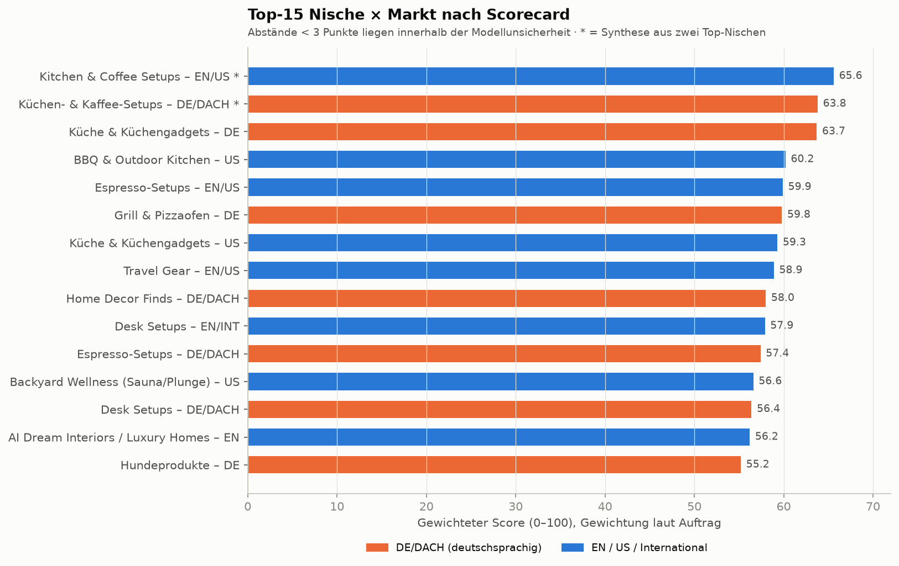

# 00 – Executive Summary: Affiliate-Theme-Page-Research

**Stand:** 26.09.2026 · **Frage:** Welche Nische und welcher Markt eignen sich für eine weitgehend KI-produzierte faceless Instagram-Reels-Theme-Page, die **ausschließlich über Affiliate-Provisionen** 5.000–10.000 €+ Gewinn pro Monat erzielen kann?

## Das Ergebnis in fünf Sätzen

1. **In keiner der 58 Nischen gibt es belastbare Belege, dass eine einzelne faceless Instagram-Page über Affiliate allein 10.000 € Monatsgewinn erreicht.** Mathematisch ist es möglich, beobachtet ist es nicht. 5.000 € sind möglich, aber nur im oberen Szenario.
2. **Der Engpass ist die Kaufabsicht pro View, nicht die Reichweite.** Das Modell ergibt je nach Nische 15–127 € Provision pro 1 Mio. Views (Base) bzw. 89–639 € (Strong). Reale Datenpunkte: ≈ 3 $ pro 1 Mio. bei Unterhaltungs-Theme-Pages, ≈ 500–900 $ bei Shopping-Content.
3. **Für 10k € Gewinn braucht die beste LOW/MEDIUM-Risk-Kombination 21–34 Mio. Views pro Monat bei optimiertem Funnel.** Das entspricht einer Page mit ~550k–900k Followern. Im Base-Funnel sind es 127–188 Mio. Views.
4. **Deutschland verdient pro View gleich viel oder mehr als englischsprachige Pages, hat aber einen harten Reichweiten-Deckel.** Gründe für den Vorteil pro View: 5 % statt 3 % Amazon-Provision bei Home/Küche, 80 % statt ~55 % monetarisierbares Publikum, 19–26× weniger Content-Konkurrenz bei Home/Finds. Mit einer DE-Page ist 5k nur mit Ausnahme-Reichweite erreichbar, 10k praktisch nur mit Ausnahme-Funnel.
5. **Bester Test-Case: „Kitchen & Coffee Setups“, englischsprachig mit US-Fokus, dazu ein deutscher Spiegel-Account.** Das Format: KI-inszenierte Küchen und Kaffee-Ecken, in denen jedes Produkt ein echter, verlinkter Freisteller ist. Getestet wird 90 Tage mit ≈ 1.400 € Budget und harten Stop-Kriterien.

## Datenbasis

| Baustein | Umfang | Datei |
|---|---|---|
| Nischen-Longlist | 58 Nischen | [01](01_longlist_niches.csv) |
| Nische × Markt modelliert | 32 Kombinationen × 4 Szenarien | [04](04_niche_economics.csv), [11](11_revenue_per_million_views.csv), [scorecard](scorecard.csv) |
| Affiliate-Programme | 613 Zeilen: 88 Amazon-Kategorien (US/DE/UK) + ~525 Programm×Markt-Einträge | [03](03_affiliate_programs.csv) |
| Marktvergleich | 13 Nischen × 4 Märkte + 283 Marktdatenpunkte | [02](02_market_comparison.csv), [quellen/F](quellen/F_marktvergleich_de_us_uk_intl.md) |
| Konkurrenz-Accounts | 192 Profile, 72 Case-Study-Einträge | [05](05_competitor_database.csv), [06](06_competitor_analysis.md) |
| Funnel-Benchmarks | 227 Datenpunkte | [quellen/E](quellen/E_funnel_benchmarks.md) |
| Einkommens-Evidenz | 69 Datenpunkte | [quellen/K](quellen/K_einkommens_evidenz_case_studies.md) |

**Datenqualität:** Jede Zahl ist als VERIFIED, THIRD-PARTY ESTIMATE, CLAIMED, MODEL ASSUMPTION oder UNKNOWN gekennzeichnet. **Die wichtigsten Lücken:**
- Instagram-Reel-Views konkurrierender Accounts: nicht abrufbar, UNKNOWN.
- Klickrate von Reel-Views auf Affiliate-Links: nur Tool-Anbieter-Angaben.
- Die Websuche war auf 200 Anfragen pro Session begrenzt. Danach wurden Primärquellen direkt abgerufen.

## Top 5 (nach Scorecard und Red Team)

| # | Nische × Markt | Score | Provision pro 1 Mio. Views (Base / Strong) | Gewinn/Monat Strong-Funnel × Strong-Reichweite | Hauptrisiko |
|---|---|---|---|---|---|
| 1 | **Kitchen & Coffee Setups – EN/US** (+ DE-Spiegel) | 65,6 | 56 / 311 € | ≈ 5.600 € | Klickrate aus Setups unbelegt |
| 2 | BBQ, Pizzaöfen & Outdoor Kitchen – US | 60,2 | 83 / 497 € | ≈ 4.400 € | Saison März–August |
| 3 | Travel Gear – EN/US | 58,9 | 41 / 232 € | ≈ 1.700 € | Kaufseltenheit, „Träumer“-Publikum |
| 4 | Home Decor „Shop the Room“ – DE/DACH | 58,0 | 44 / 221 € | ≈ 900 € | DE-Deckel, Produkttreue bei vielen Kleinteilen |
| 5 | Desk Setups – EN/INT | 57,9 | 43 / 233 € | ≈ 1.700 € | reifer, schrumpfender Markt |

Details: [12_top10.md](12_top10.md) → [13_red_team.md](13_red_team.md) → [14_top5.md](14_top5.md) → [15_winner.md](15_winner.md) → [16_90_day_test.md](16_90_day_test.md)

## Was die Recherche widerlegt hat

- **Interior/Luxury Homes/AI-Architektur als Hauptidee:** Sie bringen viel Reichweite, aber die Views sind nicht kaufbar. Dreamy Interior (315k) und Bau Rausch (620k) verlinken keine Produkte. Beim ursprünglichen Favoriten „Interior“ überlebt nur die Variante **„Shop the Room“ mit echten Produkten**, und die funktioniert am besten in DE.
- **Fashion:** DE-Retouren von 45–55 % halbieren die Provision.
- **Gadgets/Amazon Finds:** hyper-gesättigt, 0,85–1,14 € pro Bestellung, KI-Funktionsdemos wären irreführend.
- **Gaming:** perfekter KI-Fit, aber 1–2,5 % Provision und ein junges, globales Publikum.
- **Beauty:** hohe Raten (12–20 %), aber HIGH Compliance-Risiko.
- **Garten:** Saison, Stornoquoten bis 41 %.

## Antworten auf die Abschlussfragen

**A. Welche fünf Nischen sind aktuell am interessantesten?**
1. Kitchen & Coffee Setups
2. BBQ, Pizzaöfen & Outdoor Kitchen
3. Travel Gear / Packing
4. Home Decor „Shop the Room“
5. Desk Setups

Wildcard: Backyard Wellness (Sauna/Cold Plunge).

**B. Welche eignet sich am besten für Deutschland/DACH?**
**Küchen- & Kaffee-Setups DE** (Score 63,8). Gründe: Amazon.de Küche 5 %, De'Longhi DE 7 % (Social ausdrücklich willkommen), Zwilling/KitchenAid 6,4–8 %, keine DE-Küchen-Theme-Page gefunden.
Zwei Varianten nach Kriterium:
- **Stärkste gemessene Konkurrenzlücke:** Home Decor „Shop the Room“ DE (EN-Content 19,5× dichter, 0 faceless DE-Home-Finds-Pages > 100k).
- **Höchste Provision pro View in DE:** Grill & Pizzaofen DE (98 € Base), aber saisonal.

**C. Welche eignet sich am besten international?**
**Kitchen & Coffee Setups EN/US mit Geo-Routing** (65,6). Den höchsten Ertrag pro View unter den LOW/MEDIUM-Risk-Nischen hat **BBQ & Outdoor Kitchen US** (83 € / 497 €).

**D. Wo ist das beste Verhältnis aus Konkurrenz und Kaufkraft?**
**DE/DACH bei Wohnen und Küche.** Belege:
- Kaufkraft 4/5, 63 % des DE-Onlinehandels über Amazon.de
- 5 % Provision statt 3 %
- 80 % monetarisierbares Publikum
- Content-Dichte 19,5× (Wohnen) bzw. 25,6× (Amazon-Finds) geringer als EN

Die Grenze ist die Marktgröße (~37 Mio. deutschsprachige IG-Nutzer vs. ~259 Mio. EN-Kern).

**E. Bei welcher Nische ist 5k Affiliate/Monat am plausibelsten?**
**Kitchen & Coffee Setups EN/US.** Sie ist die einzige LOW/MEDIUM-Risk-Kombination mit ≥ 5.000 € bei Strong-Funnel × Strong-Reichweite (≈ 5.600 €, braucht ≈ 18 Mio. Views pro Monat). Knapp dahinter liegt BBQ US (≈ 4.400 €; 5k braucht ≈ 11 Mio. Views, aber saisonal).
Evidenzklasse: *Possible but weak evidence*.

**F. Bei welcher ist 10k am plausibelsten?**
Ebenfalls **Kitchen & Coffee Setups EN/US**: Strong-Funnel × ≈ 34 Mio. Views pro Monat, das liegt noch unter der EN-Ausnahme-Reichweite von 50 Mio. Dahinter kommt BBQ US (≈ 21 Mio. bei einem Deckel von 25 Mio.).
Evidenzklasse: *Possible but weak evidence*. Einen beobachteten Instagram-Fall gibt es nicht.

**G. Welche besitzt das größte 20k+-Potenzial?**
Unter den LOW/MEDIUM-Risk-Kombinationen: **Kitchen & Coffee EN** (Exceptional × Ausnahme-Reichweite ≈ 61.000 €) und **BBQ & Outdoor Kitchen US** (höchster Exceptional-Ertrag pro View: 2.256 € pro 1 Mio. Views).
Evidenzklasse: *No credible evidence found*. Rechnerisch noch höher liegt Beauty Devices US (≈ 64.000 €), das Compliance-Risiko ist dort aber HIGH.

**H. Welche benötigt die wenigsten monatlichen Views für 10k?**
**Beauty Devices US** (84 Mio. Base / 16,6 Mio. Strong), Compliance HIGH. Unter den LOW/MEDIUM-Risk-Kombinationen:
- **Grill & Pizzaofen DE:** 109 Mio. / 19,5 Mio.; die Strong-Menge liegt aber über dem DE-Deckel.
- **BBQ & Outdoor Kitchen US:** 127 Mio. / 21,3 Mio.

**I. Welche ist am stärksten automatisierbar?**
Technisch **AI Dream Interiors** und **Backyard Wellness** (KI-Fit 5: Szene dominiert, einfache Produktgeometrie). Unter den monetarisierbaren Nischen zusätzlich **Kitchen & Coffee Setups**: statische Geräte als Freisteller, Awin-/Impact-Feeds per API.

**J. Welche ist am passivsten?**
**AI Dream Interiors** (5), allerdings ohne tragfähige Economics. Unter den monetarisierbaren Nischen: **Kitchen & Coffee / Espresso-Setups, Backyard Wellness und Travel Gear** (4). Gründe: Produktzyklen von 3–5 Jahren, geringe Saison, teils lange Cookies (Coffee Circle 60 T, Sauna24/Kuppelofen 90 T). Voll passiv ist keine Nische ([09](09_passivity_analysis.md)).

**K. Welche besitzt das niedrigste regulatorische/Trust-Risiko?**
Unter den monetarisierbaren Nischen: **Desk Setups, Kitchen & Coffee Setups, Travel Gear, BBQ** (alle LOW-MEDIUM). Voraussetzung: Es werden nur echte Produkte in KI-Szenen (Typ b) und Datenblatt-Vergleiche (Typ f) gezeigt ([17](17_compliance.md)).

**L. Welche Nische würdest du als ersten 90-Tage-Test auswählen?**
**Kitchen & Coffee Setups, EN/US-first + DE-Spiegel, 01.10.–31.12.2026, ≈ 1.400 € Budget.** Nach 90 Tagen gilt: STOP, wenn die Provision pro 1 Mio. Views unter 110 € liegt; SCALE ab 280 € bei wachsender Reichweite ([16](16_90_day_test.md)). Als zweiter Test ist **BBQ & Outdoor Kitchen US ab Februar/März 2027** mit derselben Pipeline vorgemerkt.

## 10k-Reality-Check (Teil 30)

**Frage:** Ist es realistisch, mit **einer** Theme-Page **ausschließlich über Affiliate** diese Gewinne zu erreichen?

| Ziel | Klasse | Begründung |
|---|---|---|
| **5.000 €/Monat** | **Possible but weak evidence** | **Modell:** erreichbar nur mit Strong-Funnel (≈ 3 Affiliate-Klicks pro 1.000 Views, CVR 3–4 %) **und** ≈ 11–18 Mio. Views pro Monat (EN; ~300–500k-Follower-Page). **Beobachtet:** Der beste belegte faceless IG-Fall liegt bei ≈ 790 $ in 48 Tagen (CLAIMED, inkl. Boni). Shopping-nahe Einzelfälle erreichen 500–900 $ pro 1 Mio. Views, aber nicht als belegter Dauerzustand. Setup- und Home-Pages mit 200–650k Followern monetarisieren nachweislich, ihre Einnahmen sind aber unbekannt |
| **10.000 €/Monat** | **Possible but weak evidence** (für Instagram allein: *No credible evidence found*) | **Modell:** Strong-Funnel × 21–34 Mio. Views pro Monat (Top-Tier-Page, ~550–900k Follower) oder Exceptional-Funnel × 5–12 Mio. Views. **Beobachtet:** kein faceless IG-Fall. Nur TikTok-Shop-Ausreißer, meist Personen oder mit Werbebudget der Marke (K). Umfragen: ~4–12 % aller Affiliates (alle Kanäle, inkl. SEO/Personen) liegen über 10k $/Monat |
| **20.000 €/Monat+** | **No credible evidence found** | **Modell:** 41–66 Mio. Views pro Monat bei Strong-Funnel. **Beobachtet:** nur Personen-Creator, Amazon-Onsite-Creator (Traffic von Amazon, nicht Social) und eine unbestätigte Drittschätzung eines KI-Supplement-Videos mit Compliance-Risiko |

**Ausdrücklich:** **Die Daten zeigen, dass 10.000 € Gewinn mit einer einzelnen faceless Page über Affiliate allein in keiner untersuchten Nische plausibel im Sinne beobachteter Belege sind.** 5.000 € liegen im Bereich des Möglichen, setzen aber voraus, dass zwei unbelegte Größen gleichzeitig im oberen Bereich landen: Klicks pro View und Reichweite. Hinweise zur Skalierung jenseits einer Page:
- Mehrere Pages oder Märkte aus derselben Pipeline
- Zusätzliche Plattformen (YouTube Shorts, Pinterest mit Händlerlinks)
- Später Sponsorings. Laut Auftrag nicht Teil der Rechnung; sie wären der wahrscheinlichste Zusatzhebel, denn viele große Theme-Pages monetarisieren eher über Brand-Deals, Eigenshops oder Kurse als über Affiliate (I, K).

**Empfehlung:** Den 90-Tage-Test als **billige Messung** der zwei entscheidenden Unbekannten fahren (≈ 1.400 €), nicht als Geschäftsstart. Wenn die Provision pro 1 Mio. Views nach 90 Tagen und zwei Optimierungsrunden unter 110 € liegt, sollte das Projekt beendet werden. In diesem Fall ist das Ziel mit diesem Modell nicht erreichbar, egal wie viel Reichweite noch dazukommt.
