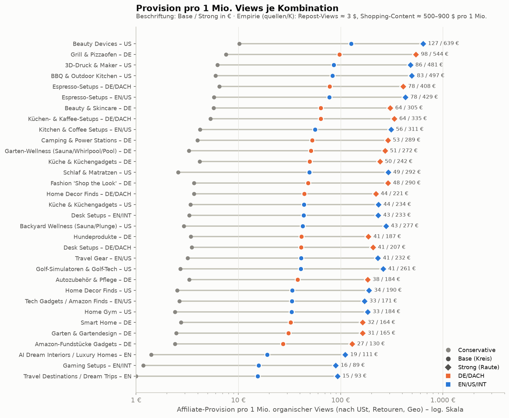
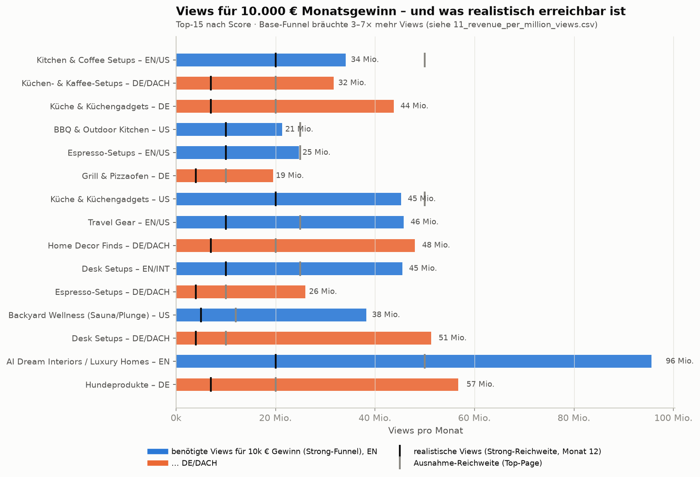

# 10 – Affiliate-Funnel-Modelle (Teile 12–18)

**Stand:** 26.09.2026 · **Rechenmodell:** [`scripts/model.py`](scripts/model.py) (reproduzierbar: `python3 scripts/model.py && python3 scripts/md_tables.py > scripts/generated_tables.md && python3 scripts/render.py`)
**Rohdaten:** [`04_niche_economics.csv`](04_niche_economics.csv), [`11_revenue_per_million_views.csv`](11_revenue_per_million_views.csv), Benchmarks in [`quellen/E_funnel_benchmarks.md`](quellen/E_funnel_benchmarks.md)

> **Kernbefund:** Im **Base-Szenario** bringt 1 Mio. organischer Reel-Views je nach Nische nur **15–127 € Provision**. Für **10.000 € Monatsgewinn** bräuchte eine einzelne Page damit **84–685 Mio. Views pro Monat**. Selbst im **Strong-Szenario**, also mit gut optimiertem Funnel und Comment-to-DM, sind es noch **17–119 Mio. Views pro Monat**. Diese Zahlen liegen in derselben Größenordnung wie die wenigen realen Datenpunkte aus [`quellen/K`](quellen/K_einkommens_evidenz_case_studies.md): Repost-Theme-Page ≈ 3 $ pro 1 Mio. Views, Shopping-Content ≈ 500–900 $ pro 1 Mio. Views.

---

## 1. Die Formel

```
Affiliate-Provision pro 1 Mio. Views
  = 1.000.000 × Klicks-pro-View × Intent-Faktor × Geo-Anteil
      × Σ_Kanal [ Klickanteil × CVR × AOV × Provision × Netto-Faktor ]
      × (1 − Retouren/Storno)

Gewinn pro Monat = Views/Monat ÷ 1 Mio. × Provision pro 1 Mio. Views − 600 € laufende Kosten
```

| Baustein | Conservative | Base | Strong | Exceptional | Herkunft | Datenqualität |
|---|---|---|---|---|---|---|
| Link-Klicks pro 1.000 Views (Comment-to-DM + Bio-Link) | 0,25 | 1,2 | 3,0 | 7,5 | Teilraten: Keyword-Kommentare 0,2–2 %, DM-Öffnung 70–92 %, DM-Klick 15–35 %, Bio-Pfad 0,05–1,1 ([E, M1/M2](quellen/E_funnel_benchmarks.md)) | MODEL ASSUMPTION (Teilraten THIRD-PARTY/CLAIMED) |
| Intent-Faktor (Kaufintention 1–5) | 1 → 0,3 · 2 → 0,5 · 3 → 0,75 · 4 → 1,0 · 5 → 1,2 | | | | Die Klick-Benchmarks stammen aus Shopping-/Amazon-Finds-Kontexten; das entspricht Intent 4 = 1,0 | MODEL ASSUMPTION |
| Monetarisierbarer Geo-Anteil EN | 45 % | 55 % | 62 % | 68 % | EN-Finds-Kanal: US 41,7 %, IN 24,1 %, UK/CA/AU 34 % ([F, Abschn. 8](quellen/F_marktvergleich_de_us_uk_intl.md)) | THIRD-PARTY → MODEL ASSUMPTION |
| Monetarisierbarer Geo-Anteil DE | 72 % | 80 % | 85 % | 88 % | DE-sprachige Kanäle ≈80 % DACH (F) | THIRD-PARTY → MODEL ASSUMPTION |
| CVR Amazon.com / Amazon.de (inkl. Halo) | 2 / 1,5 % | 4 / 3 % | 7 / 5 % | 10 / 7 % | Geniuslink Q1/2022: Amazon.com 11,1 %, Amazon.de 5,94 %, Social-Case 0,5 % | VERIFIED (Anbieterdaten) → MODEL ASSUMPTION |
| CVR Händler: Home / Elektronik / Beauty / Fashion / Pets | 0,3 / 0,4 / 1,0 / 0,5 / 0,8 % | 0,7 / 0,9 / 2,0 / 1,0 / 1,8 % | 1,5 / 1,8 / 3,5 / 2,0 / 3,0 % | 2,5 / 2,5 / 5,0 / 3,0 / 4,5 % | Dynamic Yield 2025/26, IRP UK 08/2026, danach 40–70 % Abschlag für mobilen Social-Traffic | VERIFIED → MODEL ASSUMPTION |
| CVR High-Ticket (> 2.000 €) | 0,02 % | 0,05 % | 0,12 % | 0,2 % | kein Benchmark; abgeleitet aus DY Luxury 0,63–0,72 % bei 426 $ AOV | MODEL ASSUMPTION |
| Retouren/Storno (Provisionsverlust) | Fashion DE 55 %, Elektronik DE 18 %, Home DE 18 % | 45 / 14 / 12 % | 35 / 10 / 9 % | 25 / 7 / 6 % | NRF 2025 online 19,3 %; Bamberg: DE 24,2 % der Pakete; Amazon zahlt bei Retoure 0 € | VERIFIED → MODEL ASSUMPTION |
| Netto-Faktor (Provision auf Warenwert ohne USt) | DE 1/1,19 · US 1,0 · EN-Mix 0,97 | | | | übliche Provisionsbasis „ohne Steuern/Versand“ | MODEL ASSUMPTION |
| Wechselkurs | 1 USD = 0,86 € · 1 GBP = 1,16 € | | | | Größenordnung 2025/26 | MODEL ASSUMPTION |
| Laufende Kosten | 600 €/Monat bei ~90 Reels | | | | [H, Abschn. 9.4](quellen/H_ai_tools_kosten_automation.md): 60 Reels ≈ 320–810 $, 120 Reels ≈ 530–1.290 $ | MODEL ASSUMPTION |

**Konvention:** Die Szenarien kombinieren Klickrate, CVR und Retouren **gemeinsam**. „Conservative“ ist also ein gemeinsamer Tiefpunkt, „Exceptional“ ein gemeinsamer Höchstwert. AOV und Provisionssätze sind **strukturelle** Werte je Nische aus den Programmrecherchen und bleiben über die Szenarien konstant.

**Plausibilitätsabgleich:** Die Base-EPC (Provision pro Klick) der Amazon-lastigen Nischen liegt bei 0,04–0,09 €. Das passt zu Geniuslink (0,03–0,10 $ typisch, VERIFIED/CLAIMED) und zum besten faceless Datensatz (B01: 0,047 $/Klick, 4 % effektiv, CLAIMED). Strong/Exceptional mit 0,13–0,50 € EPC entspricht Amazon.com-Werten von 0,10–0,25 $ (Geniuslink 2022) plus Händlerprogrammen mit höherem Warenkorb.

---

## 2. Teil 12 – Provision pro Bestellung und benötigte Bestellungen

Die Provision pro Bestellung ist mit Bestellanteilen gewichtet. Die meisten Bestellungen kommen auch in High-Ticket-Nischen über günstige Amazon-Artikel, deshalb liegt der gewichtete AOV niedriger als die Produktpreise vermuten lassen.
„Nominal“ bedeutet: Provisionssatz × Warenkorb. „Effektiv“ bedeutet: nach Abzug von USt (DE) und Retouren/Storno (Base).

<!-- TABLE:T1 START -->
| # | Kombination | AOV gewichtet (€) | Provision gewichtet | Provision/Bestellung nominal (€) | effektiv nach USt & Retouren (€) | Bestellungen für 3.000 € | 5.000 € | 10.000 € | 20.000 € |
|---|---|---|---|---|---|---|---|---|---|
| 1 | Kitchen & Coffee Setups – EN/US | 76 | 5,6 % | 4,25 | 3,71 | 809 | 1.348 | 2.697 | 5.394 |
| 2 | Küchen- & Kaffee-Setups – DE/DACH | 84 | 6,1 % | 5,11 | 3,69 | 813 | 1.355 | 2.709 | 5.419 |
| 3 | Küche & Küchengadgets – DE | 45 | 5,3 % | 2,35 | 1,74 | 1.723 | 2.872 | 5.744 | 11.488 |
| 4 | BBQ & Outdoor Kitchen – US | 120 | 5,4 % | 6,52 | 5,87 | 512 | 853 | 1.705 | 3.410 |
| 5 | Espresso-Setups – EN/US | 117 | 5,9 % | 6,96 | 6,07 | 494 | 823 | 1.647 | 3.293 |
| 6 | Grill & Pizzaofen – DE | 130 | 6,2 % | 8,08 | 5,98 | 502 | 837 | 1.673 | 3.346 |
| 7 | Küche & Küchengadgets – US | 39 | 4,9 % | 1,91 | 1,72 | 1.747 | 2.912 | 5.824 | 11.648 |
| 8 | Travel Gear – EN/US | 64 | 6,6 % | 4,24 | 3,62 | 829 | 1.382 | 2.763 | 5.526 |
| 9 | Home Decor Finds – DE/DACH | 47 | 5,7 % | 2,69 | 1,99 | 1.508 | 2.513 | 5.025 | 10.050 |
| 10 | Desk Setups – EN/INT | 69 | 4,3 % | 3,00 | 2,62 | 1.146 | 1.910 | 3.820 | 7.639 |
| 11 | Espresso-Setups – DE/DACH | 120 | 6,1 % | 7,34 | 5,31 | 565 | 942 | 1.885 | 3.769 |
| 12 | Backyard Wellness (Sauna/Plunge) – US | 255 | 4,5 % | 11,53 | 10,38 | 289 | 482 | 963 | 1.927 |
| 13 | Desk Setups – DE/DACH | 73 | 4,0 % | 2,93 | 2,12 | 1.415 | 2.358 | 4.717 | 9.434 |
| 14 | AI Dream Interiors / Luxury Homes – EN | 82 | 4,3 % | 3,54 | 3,09 | 970 | 1.617 | 3.233 | 6.466 |
| 15 | Hundeprodukte – DE | 41 | 5,3 % | 2,16 | 1,71 | 1.754 | 2.924 | 5.848 | 11.696 |
| 16 | Garten-Wellness (Sauna/Whirlpool/Pool) – DE | 194 | 5,5 % | 10,69 | 7,91 | 380 | 633 | 1.265 | 2.530 |
| 17 | 3D-Druck & Maker – US | 100 | 6,7 % | 6,74 | 6,06 | 495 | 825 | 1.650 | 3.299 |
| 18 | Gaming Setups – EN/INT | 49 | 3,3 % | 1,63 | 1,42 | 2.110 | 3.516 | 7.032 | 14.065 |
| 19 | Home Decor Finds – US | 49 | 4,1 % | 1,99 | 1,79 | 1.671 | 2.786 | 5.571 | 11.142 |
| 20 | Camping & Power Stations – DE | 133 | 5,1 % | 6,75 | 4,54 | 661 | 1.102 | 2.204 | 4.407 |
| 21 | Amazon-Fundstücke Gadgets – DE | 36 | 3,3 % | 1,17 | 0,85 | 3.534 | 5.889 | 11.779 | 23.557 |
| 22 | Tech Gadgets / Amazon Finds – EN/US | 31 | 4,2 % | 1,31 | 1,14 | 2.625 | 4.374 | 8.749 | 17.498 |
| 23 | Golf-Simulatoren & Golf-Tech – US | 111 | 5,8 % | 6,44 | 5,67 | 529 | 882 | 1.764 | 3.529 |
| 24 | Beauty & Skincare – DE | 40 | 9,0 % | 3,60 | 2,78 | 1.078 | 1.797 | 3.593 | 7.186 |
| 25 | Beauty Devices – US | 105 | 10,2 % | 10,66 | 9,60 | 313 | 521 | 1.042 | 2.084 |
| 26 | Smart Home – DE | 71 | 4,1 % | 2,89 | 2,09 | 1.437 | 2.396 | 4.792 | 9.583 |
| 27 | Home Gym – US | 90 | 4,0 % | 3,57 | 3,14 | 956 | 1.593 | 3.187 | 6.373 |
| 28 | Fashion 'Shop the Look' – DE | 78 | 8,7 % | 6,77 | 3,13 | 959 | 1.598 | 3.197 | 6.394 |
| 29 | Autozubehör & Pflege – DE | 40 | 5,4 % | 2,12 | 1,53 | 1.962 | 3.270 | 6.540 | 13.080 |
| 30 | Garten & Gartendesign – DE | 60 | 5,6 % | 3,41 | 2,52 | 1.191 | 1.985 | 3.970 | 7.940 |
| 31 | Travel Destinations / Dream Trips – EN | 258 | 5,0 % | 12,90 | 9,38 | 320 | 533 | 1.066 | 2.131 |
| 32 | Schlaf & Matratzen – US | 141 | 9,1 % | 12,81 | 10,25 | 293 | 488 | 976 | 1.952 |
<!-- TABLE:T1 END -->

**Lesart:**
- Amazon-lastige Nischen (Gadgets, Home-Deko, Küchenhelfer) liegen bei **0,85–2 € pro Bestellung**. Für 10.000 € braucht man dort **5.000–12.000 Bestellungen pro Monat**.
- Nischen mit Händlerprogrammen und höherem Warenkorb (Espresso, Grill/Pizzaofen, Sauna) liegen bei **5–10 € pro Bestellung**, also **~1.000–1.900 Bestellungen**.
- Selbst bei Sauna-Warenkörben von 4.000–25.000 $ entstehen die meisten Bestellungen über günstiges Zubehör. Die großen Einzelprovisionen (200–2.000 $) sind selten, weil die CVR bei High-Ticket-Produkten sehr niedrig ist.

## 3. Teil 14 – Rückrechnung „wie im Beispiel“ (Base-Szenario, 10.000 € Provision)

Beispiel aus dem Auftrag: AOV 200 € × 8 % = 16 € → 625 Bestellungen → bei 2 % CVR 31.250 Besucher → bei 1 % CTR 3,125 Mio. Views.
Dasselbe Schema mit den recherchierten Werten ergibt:

<!-- TABLE:T2 START -->
| Kombination | Provision/Bestellung eff. (€) | Bestellungen | Ø CVR Klick→Bestellung | Shop-Besucher (monetarisierbare Klicks) | Klicks pro 1.000 Views (monetarisierbar) | benötigte Views |
|---|---|---|---|---|---|---|
| Kitchen & Coffee Setups – EN/US | 3,71 | 2.697 | 2,30 % | 117.255 | 0,66 | 177,7 Mio. |
| Küchen- & Kaffee-Setups – DE/DACH | 3,69 | 2.709 | 1,81 % | 149.685 | 0,96 | 155,9 Mio. |
| Küche & Küchengadgets – DE | 1,74 | 5.744 | 2,47 % | 232.544 | 1,15 | 201,9 Mio. |
| BBQ & Outdoor Kitchen – US | 5,87 | 1.705 | 2,15 % | 79.304 | 0,66 | 120,2 Mio. |
| Espresso-Setups – EN/US | 6,07 | 1.647 | 1,94 % | 84.878 | 0,66 | 128,6 Mio. |
| Grill & Pizzaofen – DE | 5,98 | 1.673 | 1,70 % | 98.416 | 0,96 | 102,5 Mio. |
| Küche & Küchengadgets – US | 1,72 | 5.824 | 3,23 % | 180.313 | 0,79 | 227,7 Mio. |
| Travel Gear – EN/US | 3,62 | 2.763 | 2,30 % | 120.139 | 0,49 | 242,7 Mio. |
| Home Decor Finds – DE/DACH | 1,99 | 5.025 | 2,31 % | 217.538 | 0,96 | 226,6 Mio. |
| Desk Setups – EN/INT | 2,62 | 3.820 | 2,51 % | 152.180 | 0,66 | 230,6 Mio. |
| Espresso-Setups – DE/DACH | 5,31 | 1.885 | 1,54 % | 122.380 | 0,96 | 127,5 Mio. |
| Backyard Wellness (Sauna/Plunge) – US | 10,38 | 963 | 0,83 % | 116.082 | 0,49 | 234,5 Mio. |
<!-- TABLE:T2 END -->

**Warum die Zahlen viel höher sind als im Beispiel:** Das Beispiel nimmt 1 % Social→Shop-CTR an. Belegt sind für Instagram-Reels aber nur ~0,02 % über den Bio-Link und ~0,1 % mit Comment-to-DM (Base, [E, M2](quellen/E_funnel_benchmarks.md)). Zum Vergleich: Pinterest, das klickstärkste Medium, liegt bei ~0,5 % Outbound-Klicks pro Impression (Metricool 2026, VERIFIED). Dazu kommen die niedrigeren Warenkörbe (AOV 40–130 € statt 200 €) und die niedrigeren Provisionen (3–7 % statt 8 %).

## 4. Teil 13 – Sales-Funnel je Top-Kombination in vier Szenarien

<!-- TABLE:T3 START -->
**Kitchen & Coffee Setups – EN/US** (Score 65,6)

| Szenario | monetarisierbare Klicks | Ø CVR | Bestellungen | Provision (€) | EPC (€/Klick) | Views für 5k Gewinn | 10k | 20k |
|---|---|---|---|---|---|---|---|---|
| Conservative | 112 | 1,13 % | 1,3 | 4 | 0,037 | 1.329,4 Mio. | 2.516,3 Mio. | 4.890,2 Mio. |
| Base | 660 | 2,30 % | 15,2 | 56 | 0,085 | 99,3 Mio. | 188,0 Mio. | 365,3 Mio. |
| Strong | 1.860 | 4,11 % | 76,5 | 311 | 0,167 | 18,0 Mio. | 34,1 Mio. | 66,3 Mio. |
| Exceptional | 5.100 | 5,85 % | 298,4 | 1.233 | 0,242 | 4,5 Mio. | 8,6 Mio. | 16,7 Mio. |

**Küchen- & Kaffee-Setups – DE/DACH** (Score 63,8)

| Szenario | monetarisierbare Klicks | Ø CVR | Bestellungen | Provision (€) | EPC (€/Klick) | Views für 5k Gewinn | 10k | 20k |
|---|---|---|---|---|---|---|---|---|
| Conservative | 180 | 0,89 % | 1,6 | 5 | 0,030 | 1.052,1 Mio. | 1.991,4 Mio. | 3.870,1 Mio. |
| Base | 960 | 1,81 % | 17,4 | 64 | 0,067 | 87,4 Mio. | 165,4 Mio. | 321,4 Mio. |
| Strong | 2.550 | 3,12 % | 79,6 | 335 | 0,131 | 16,7 Mio. | 31,7 Mio. | 61,5 Mio. |
| Exceptional | 6.600 | 4,37 % | 288,1 | 1.247 | 0,189 | 4,5 Mio. | 8,5 Mio. | 16,5 Mio. |

**Küche & Küchengadgets – DE** (Score 63,7)

| Szenario | monetarisierbare Klicks | Ø CVR | Bestellungen | Provision (€) | EPC (€/Klick) | Views für 5k Gewinn | 10k | 20k |
|---|---|---|---|---|---|---|---|---|
| Conservative | 216 | 1,22 % | 2,6 | 4 | 0,019 | 1.339,5 Mio. | 2.535,5 Mio. | 4.927,6 Mio. |
| Base | 1.152 | 2,47 % | 28,5 | 50 | 0,043 | 112,8 Mio. | 213,5 Mio. | 415,0 Mio. |
| Strong | 3.060 | 4,20 % | 128,5 | 242 | 0,079 | 23,1 Mio. | 43,8 Mio. | 85,1 Mio. |
| Exceptional | 7.920 | 5,88 % | 465,3 | 903 | 0,114 | 6,2 Mio. | 11,7 Mio. | 22,8 Mio. |

**BBQ & Outdoor Kitchen – US** (Score 60,2)

| Szenario | monetarisierbare Klicks | Ø CVR | Bestellungen | Provision (€) | EPC (€/Klick) | Views für 5k Gewinn | 10k | 20k |
|---|---|---|---|---|---|---|---|---|
| Conservative | 112 | 1,05 % | 1,2 | 6 | 0,053 | 938,9 Mio. | 1.777,2 Mio. | 3.453,9 Mio. |
| Base | 660 | 2,15 % | 14,2 | 83 | 0,126 | 67,3 Mio. | 127,4 Mio. | 247,5 Mio. |
| Strong | 1.860 | 3,90 % | 72,5 | 497 | 0,267 | 11,3 Mio. | 21,3 Mio. | 41,4 Mio. |
| Exceptional | 5.100 | 5,75 % | 293,2 | 2.256 | 0,442 | 2,5 Mio. | 4,7 Mio. | 9,1 Mio. |

**Espresso-Setups – EN/US** (Score 59,9)

| Szenario | monetarisierbare Klicks | Ø CVR | Bestellungen | Provision (€) | EPC (€/Klick) | Views für 5k Gewinn | 10k | 20k |
|---|---|---|---|---|---|---|---|---|
| Conservative | 112 | 0,95 % | 1,1 | 6 | 0,051 | 969,0 Mio. | 1.834,1 Mio. | 3.564,4 Mio. |
| Base | 660 | 1,94 % | 12,8 | 78 | 0,118 | 72,1 Mio. | 136,5 Mio. | 265,3 Mio. |
| Strong | 1.860 | 3,48 % | 64,6 | 429 | 0,231 | 13,0 Mio. | 24,7 Mio. | 48,0 Mio. |
| Exceptional | 5.100 | 4,94 % | 251,8 | 1.703 | 0,334 | 3,3 Mio. | 6,2 Mio. | 12,1 Mio. |

**Grill & Pizzaofen – DE** (Score 59,8)

| Szenario | monetarisierbare Klicks | Ø CVR | Bestellungen | Provision (€) | EPC (€/Klick) | Views für 5k Gewinn | 10k | 20k |
|---|---|---|---|---|---|---|---|---|
| Conservative | 180 | 0,83 % | 1,5 | 8 | 0,042 | 737,7 Mio. | 1.396,4 Mio. | 2.713,8 Mio. |
| Base | 960 | 1,70 % | 16,3 | 98 | 0,102 | 57,4 Mio. | 108,7 Mio. | 211,2 Mio. |
| Strong | 2.550 | 3,00 % | 76,5 | 544 | 0,213 | 10,3 Mio. | 19,5 Mio. | 37,9 Mio. |
| Exceptional | 6.600 | 4,40 % | 290,4 | 2.349 | 0,356 | 2,4 Mio. | 4,5 Mio. | 8,8 Mio. |

**Küche & Küchengadgets – US** (Score 59,3)

| Szenario | monetarisierbare Klicks | Ø CVR | Bestellungen | Provision (€) | EPC (€/Klick) | Views für 5k Gewinn | 10k | 20k |
|---|---|---|---|---|---|---|---|---|
| Conservative | 135 | 1,60 % | 2,2 | 3 | 0,025 | 1.648,4 Mio. | 3.120,2 Mio. | 6.063,8 Mio. |
| Base | 792 | 3,23 % | 25,5 | 44 | 0,055 | 127,7 Mio. | 241,7 Mio. | 469,7 Mio. |
| Strong | 2.232 | 5,70 % | 127,2 | 234 | 0,105 | 23,9 Mio. | 45,2 Mio. | 87,9 Mio. |
| Exceptional | 6.120 | 8,13 % | 497,2 | 928 | 0,152 | 6,0 Mio. | 11,4 Mio. | 22,2 Mio. |

**Travel Gear – EN/US** (Score 58,9)

| Szenario | monetarisierbare Klicks | Ø CVR | Bestellungen | Provision (€) | EPC (€/Klick) | Views für 5k Gewinn | 10k | 20k |
|---|---|---|---|---|---|---|---|---|
| Conservative | 84 | 1,15 % | 1,0 | 3 | 0,038 | 1.754,0 Mio. | 3.320,1 Mio. | 6.452,2 Mio. |
| Base | 495 | 2,30 % | 11,4 | 41 | 0,083 | 135,9 Mio. | 257,2 Mio. | 499,9 Mio. |
| Strong | 1.395 | 4,15 % | 57,9 | 232 | 0,166 | 24,2 Mio. | 45,8 Mio. | 88,9 Mio. |
| Exceptional | 3.825 | 6,00 % | 229,5 | 972 | 0,254 | 5,8 Mio. | 10,9 Mio. | 21,2 Mio. |

**Home Decor Finds – DE/DACH** (Score 58,0)

| Szenario | monetarisierbare Klicks | Ø CVR | Bestellungen | Provision (€) | EPC (€/Klick) | Views für 5k Gewinn | 10k | 20k |
|---|---|---|---|---|---|---|---|---|
| Conservative | 180 | 1,14 % | 2,1 | 4 | 0,020 | 1.523,2 Mio. | 2.883,3 Mio. | 5.603,4 Mio. |
| Base | 960 | 2,31 % | 22,2 | 44 | 0,046 | 126,9 Mio. | 240,2 Mio. | 466,8 Mio. |
| Strong | 2.550 | 3,95 % | 100,7 | 221 | 0,087 | 25,4 Mio. | 48,0 Mio. | 93,3 Mio. |
| Exceptional | 6.600 | 5,65 % | 372,9 | 886 | 0,134 | 6,3 Mio. | 12,0 Mio. | 23,2 Mio. |

**Desk Setups – EN/INT** (Score 57,9)

| Szenario | monetarisierbare Klicks | Ø CVR | Bestellungen | Provision (€) | EPC (€/Klick) | Views für 5k Gewinn | 10k | 20k |
|---|---|---|---|---|---|---|---|---|
| Conservative | 112 | 1,24 % | 1,4 | 3 | 0,029 | 1.690,8 Mio. | 3.200,4 Mio. | 6.219,7 Mio. |
| Base | 660 | 2,51 % | 16,6 | 43 | 0,066 | 129,1 Mio. | 244,4 Mio. | 474,9 Mio. |
| Strong | 1.860 | 4,46 % | 83,0 | 233 | 0,125 | 24,0 Mio. | 45,5 Mio. | 88,4 Mio. |
| Exceptional | 5.100 | 6,35 % | 323,9 | 930 | 0,182 | 6,0 Mio. | 11,4 Mio. | 22,2 Mio. |

**Espresso-Setups – DE/DACH** (Score 57,4)

| Szenario | monetarisierbare Klicks | Ø CVR | Bestellungen | Provision (€) | EPC (€/Klick) | Views für 5k Gewinn | 10k | 20k |
|---|---|---|---|---|---|---|---|---|
| Conservative | 180 | 0,75 % | 1,4 | 7 | 0,036 | 860,0 Mio. | 1.627,8 Mio. | 3.163,5 Mio. |
| Base | 960 | 1,54 % | 14,8 | 78 | 0,082 | 71,5 Mio. | 135,4 Mio. | 263,1 Mio. |
| Strong | 2.550 | 2,68 % | 68,2 | 408 | 0,160 | 13,7 Mio. | 26,0 Mio. | 50,4 Mio. |
| Exceptional | 6.600 | 3,74 % | 246,7 | 1.521 | 0,230 | 3,7 Mio. | 7,0 Mio. | 13,5 Mio. |

**Backyard Wellness (Sauna/Plunge) – US** (Score 56,6)

| Szenario | monetarisierbare Klicks | Ø CVR | Bestellungen | Provision (€) | EPC (€/Klick) | Views für 5k Gewinn | 10k | 20k |
|---|---|---|---|---|---|---|---|---|
| Conservative | 84 | 0,41 % | 0,3 | 3 | 0,035 | 1.915,5 Mio. | 3.625,7 Mio. | 7.046,2 Mio. |
| Base | 495 | 0,83 % | 4,1 | 43 | 0,086 | 131,3 Mio. | 248,6 Mio. | 483,1 Mio. |
| Strong | 1.395 | 1,47 % | 20,5 | 277 | 0,199 | 20,2 Mio. | 38,2 Mio. | 74,3 Mio. |
| Exceptional | 3.825 | 2,12 % | 81,1 | 1.256 | 0,328 | 4,5 Mio. | 8,4 Mio. | 16,4 Mio. |
<!-- TABLE:T3 END -->

## 5. Teil 15 – Provision pro 1 Mio. Views (alle 32 Kombinationen)



<!-- TABLE:T4 START -->
| Rang | Kombination | Conservative | Base | Strong | Exceptional |
|---|---|---|---|---|---|
| 25 | Beauty Devices – US | 10 € | 127 € | 639 € | 2.583 € |
| 6 | Grill & Pizzaofen – DE | 8 € | 98 € | 544 € | 2.349 € |
| 17 | 3D-Druck & Maker – US | 6 € | 86 € | 481 € | 1.900 € |
| 4 | BBQ & Outdoor Kitchen – US | 6 € | 83 € | 497 € | 2.256 € |
| 11 | Espresso-Setups – DE/DACH | 7 € | 78 € | 408 € | 1.521 € |
| 5 | Espresso-Setups – EN/US | 6 € | 78 € | 429 € | 1.703 € |
| 24 | Beauty & Skincare – DE | 6 € | 64 € | 305 € | 1.149 € |
| 2 | Küchen- & Kaffee-Setups – DE/DACH | 5 € | 64 € | 335 € | 1.247 € |
| 1 | Kitchen & Coffee Setups – EN/US | 4 € | 56 € | 311 € | 1.233 € |
| 20 | Camping & Power Stations – DE | 4 € | 53 € | 289 € | 1.090 € |
| 16 | Garten-Wellness (Sauna/Whirlpool/Pool) – DE | 3 € | 51 € | 272 € | 1.175 € |
| 3 | Küche & Küchengadgets – DE | 4 € | 50 € | 242 € | 903 € |
| 32 | Schlaf & Matratzen – US | 3 € | 49 € | 292 € | 1.393 € |
| 28 | Fashion 'Shop the Look' – DE | 4 € | 48 € | 290 € | 1.284 € |
| 9 | Home Decor Finds – DE/DACH | 4 € | 44 € | 221 € | 886 € |
| 7 | Küche & Küchengadgets – US | 3 € | 44 € | 234 € | 928 € |
| 10 | Desk Setups – EN/INT | 3 € | 43 € | 233 € | 930 € |
| 12 | Backyard Wellness (Sauna/Plunge) – US | 3 € | 43 € | 277 € | 1.256 € |
| 15 | Hundeprodukte – DE | 3 € | 41 € | 187 € | 724 € |
| 13 | Desk Setups – DE/DACH | 4 € | 41 € | 207 € | 772 € |
| 8 | Travel Gear – EN/US | 3 € | 41 € | 232 € | 972 € |
| 23 | Golf-Simulatoren & Golf-Tech – US | 3 € | 41 € | 261 € | 1.187 € |
| 29 | Autozubehör & Pflege – DE | 3 € | 38 € | 184 € | 686 € |
| 19 | Home Decor Finds – US | 3 € | 34 € | 190 € | 825 € |
| 22 | Tech Gadgets / Amazon Finds – EN/US | 3 € | 33 € | 171 € | 689 € |
| 27 | Home Gym – US | 2 € | 33 € | 184 € | 731 € |
| 26 | Smart Home – DE | 3 € | 32 € | 164 € | 612 € |
| 30 | Garten & Gartendesign – DE | 2 € | 31 € | 165 € | 691 € |
| 21 | Amazon-Fundstücke Gadgets – DE | 2 € | 27 € | 130 € | 485 € |
| 14 | AI Dream Interiors / Luxury Homes – EN | 1 € | 19 € | 111 € | 492 € |
| 18 | Gaming Setups – EN/INT | 1 € | 16 € | 89 € | 369 € |
| 31 | Travel Destinations / Dream Trips – EN | 1 € | 15 € | 93 € | 407 € |
<!-- TABLE:T4 END -->

**Abgleich mit der Empirie** ([K, Abschn. 4](quellen/K_einkommens_evidenz_case_studies.md), alle n = 1, CLAIMED):

| Beobachtung | $ pro 1 Mio. Views | entspricht im Modell |
|---|---|---|
| Faceless IG-Repost-Theme-Page → Amazon (14,4 Mio. Views → 45 $) | ≈ 3 | Conservative (0,5–10 €) |
| Pinterest (pro 1 Mio. Impressions) | ≈ 0,33 | unter Conservative |
| Faceless Mode-Theme-Page mit eigener Zwischenseite | ≤ 600–900 € | Strong–Exceptional |
| TikTok-Shop-Deal-Account (Black Friday) | ≈ 500–600 | Strong (In-App-Checkout!) |
| YouTube faceless → Amazon | ≈ 750–890 | Strong–Exceptional |

**Warum Base unter den Shopping-Beispielen liegt:** Die realen 500–900-$-Fälle sind **Ausreißer mit viralen Kauf-Videos**, nicht Monatsdurchschnitte über 60–120 Reels. Das Modell-Base (15–130 €) gilt für eine durchschnittliche Page. Für einen realistischen Businessplan gilt: **Base = Planwert, Strong = Ziel nach Optimierung, Exceptional = Obergrenze.**

## 6. Teil 16 – Wie viele Views für 5k / 10k / 20k Gewinn – und wie realistisch?



Die realistische Reichweite nach ~12 Monaten ist eine MODEL ASSUMPTION. Sie leitet sich so ab:
- **Views pro Reel ≈ 0,5 × Follower:** SupGrowth 2026 misst Median 47–112 % der Follower (n = 223, THIRD-PARTY). Socialinsider misst für Business-Pages mit 100k–1 Mio. Followern nur 16.035 Views pro Reel (VERIFIED).
- **75–90 Reels pro Monat.**
- **DE-Deckel:** ≈37 Mio. deutschsprachige Instagram-Nutzer (DataReportal, VERIFIED).

Daraus ergeben sich diese Reichweitenstufen:

| Nischenbreite | EN Base | EN Strong | EN Ausnahme | DE Base | DE Strong | DE Ausnahme | ≈ Follower-Äquivalent |
|---|---|---|---|---|---|---|---|
| breit (Küche, Home, Gadgets) | 5 Mio. | 20 Mio. | 50 Mio. | 2 Mio. | 7 Mio. | 20 Mio. | EN 130k / 500k / >1 Mio.; DE 50k / 190k / 500k |
| mittel (Kaffee, BBQ, Desk, Travel) | 3 Mio. | 10 Mio. | 25 Mio. | 1 Mio. | 4 Mio. | 10 Mio. | |
| klein (Sauna, Golf, 3D-Druck) | 1,5 Mio. | 5 Mio. | 12 Mio. | 0,5 Mio. | 2 Mio. | 5 Mio. | |

<!-- TABLE:T5 START -->
| Kombination | Views für 5k (Base / Strong) | 10k (Base / Strong) | 20k (Base / Strong) | realist. Views Monat 12 (Base / Strong / Ausnahme) | Gewinn/Monat: Base×Base · Strong×Strong · Exc×Exc |
|---|---|---|---|---|---|
| Kitchen & Coffee Setups – EN/US | 99,3 Mio. / 18,0 Mio. | 188,0 Mio. / 34,1 Mio. | 365,3 Mio. / 66,3 Mio. | 5,0 Mio. / 20,0 Mio. / 50,0 Mio. | -318 € · 5.612 € · 61.033 € |
| Küchen- & Kaffee-Setups – DE/DACH | 87,4 Mio. / 16,7 Mio. | 165,4 Mio. / 31,7 Mio. | 321,4 Mio. / 61,5 Mio. | 2,0 Mio. / 7,0 Mio. / 20,0 Mio. | -472 € · 1.744 € · 24.340 € |
| Küche & Küchengadgets – DE | 112,8 Mio. / 23,1 Mio. | 213,5 Mio. / 43,8 Mio. | 415,0 Mio. / 85,1 Mio. | 2,0 Mio. / 7,0 Mio. / 20,0 Mio. | -501 € · 1.094 € · 17.465 € |
| BBQ & Outdoor Kitchen – US | 67,3 Mio. / 11,3 Mio. | 127,4 Mio. / 21,3 Mio. | 247,5 Mio. / 41,4 Mio. | 3,0 Mio. / 10,0 Mio. / 25,0 Mio. | -350 € · 4.373 € · 55.794 € |
| Espresso-Setups – EN/US | 72,1 Mio. / 13,0 Mio. | 136,5 Mio. / 24,7 Mio. | 265,3 Mio. / 48,0 Mio. | 3,0 Mio. / 10,0 Mio. / 25,0 Mio. | -367 € · 3.694 € · 41.970 € |
| Grill & Pizzaofen – DE | 57,4 Mio. / 10,3 Mio. | 108,7 Mio. / 19,5 Mio. | 211,2 Mio. / 37,9 Mio. | 1,0 Mio. / 4,0 Mio. / 10,0 Mio. | -502 € · 1.576 € · 22.892 € |
| Küche & Küchengadgets – US | 127,7 Mio. / 23,9 Mio. | 241,7 Mio. / 45,2 Mio. | 469,7 Mio. / 87,9 Mio. | 5,0 Mio. / 20,0 Mio. / 50,0 Mio. | -381 € · 4.087 € · 45.807 € |
| Travel Gear – EN/US | 135,9 Mio. / 24,2 Mio. | 257,2 Mio. / 45,8 Mio. | 499,9 Mio. / 88,9 Mio. | 3,0 Mio. / 10,0 Mio. / 25,0 Mio. | -476 € · 1.716 € · 23.695 € |
| Home Decor Finds – DE/DACH | 126,9 Mio. / 25,4 Mio. | 240,2 Mio. / 48,0 Mio. | 466,8 Mio. / 93,3 Mio. | 2,0 Mio. / 7,0 Mio. / 20,0 Mio. | -512 € · 945 € · 17.126 € |
| Desk Setups – EN/INT | 129,1 Mio. / 24,0 Mio. | 244,4 Mio. / 45,5 Mio. | 474,9 Mio. / 88,4 Mio. | 3,0 Mio. / 10,0 Mio. / 25,0 Mio. | -470 € · 1.731 € · 22.650 € |
| Espresso-Setups – DE/DACH | 71,5 Mio. / 13,7 Mio. | 135,4 Mio. / 26,0 Mio. | 263,1 Mio. / 50,4 Mio. | 1,0 Mio. / 4,0 Mio. / 10,0 Mio. | -522 € · 1.034 € · 14.610 € |
| Backyard Wellness (Sauna/Plunge) – US | 131,3 Mio. / 20,2 Mio. | 248,6 Mio. / 38,2 Mio. | 483,1 Mio. / 74,3 Mio. | 1,5 Mio. / 5,0 Mio. / 12,0 Mio. | -536 € · 786 € · 14.475 € |
| Beauty Devices – US | 44,2 Mio. / 8,8 Mio. | 83,7 Mio. / 16,6 Mio. | 162,6 Mio. / 32,3 Mio. | 3,0 Mio. / 10,0 Mio. / 25,0 Mio. | -220 € · 5.787 € · 63.984 € |
| Tech Gadgets / Amazon Finds – EN/US | 167,7 Mio. / 32,8 Mio. | 317,4 Mio. / 62,1 Mio. | 616,9 Mio. / 120,6 Mio. | 5,0 Mio. / 20,0 Mio. / 50,0 Mio. | -433 € · 2.816 € · 33.835 € |
| Amazon-Fundstücke Gadgets – DE | 205,3 Mio. / 43,2 Mio. | 388,6 Mio. / 81,7 Mio. | 755,3 Mio. / 158,8 Mio. | 2,0 Mio. / 7,0 Mio. / 20,0 Mio. | -545 € · 308 € · 9.105 € |
| Home Decor Finds – US | 166,2 Mio. / 29,5 Mio. | 314,5 Mio. / 55,9 Mio. | 611,3 Mio. / 108,5 Mio. | 5,0 Mio. / 20,0 Mio. / 50,0 Mio. | -431 € · 3.196 € · 40.650 € |
| Gaming Setups – EN/INT | 354,9 Mio. / 62,6 Mio. | 671,7 Mio. / 118,5 Mio. | 1.305,4 Mio. / 230,3 Mio. | 5,0 Mio. / 20,0 Mio. / 50,0 Mio. | -521 € · 1.189 € · 17.848 € |
| AI Dream Interiors / Luxury Homes – EN | 292,5 Mio. / 50,5 Mio. | 553,6 Mio. / 95,6 Mio. | 1.075,9 Mio. / 185,7 Mio. | 5,0 Mio. / 20,0 Mio. / 50,0 Mio. | -504 € · 1.618 € · 24.014 € |
| Fashion 'Shop the Look' – DE | 116,5 Mio. / 19,3 Mio. | 220,6 Mio. / 36,5 Mio. | 428,7 Mio. / 70,9 Mio. | 2,0 Mio. / 7,0 Mio. / 20,0 Mio. | -504 € · 1.433 € · 25.082 € |
| Beauty & Skincare – DE | 87,3 Mio. / 18,3 Mio. | 165,3 Mio. / 34,7 Mio. | 321,2 Mio. / 67,5 Mio. | 2,0 Mio. / 7,0 Mio. / 20,0 Mio. | -472 € · 1.538 € · 22.383 € |
| Garten-Wellness (Sauna/Whirlpool/Pool) – DE | 109,3 Mio. / 20,6 Mio. | 206,9 Mio. / 39,0 Mio. | 402,1 Mio. / 75,9 Mio. | 0,5 Mio. / 2,0 Mio. / 5,0 Mio. | -574 € · -57 € · 5.276 € |
| Desk Setups – DE/DACH | 135,9 Mio. / 27,1 Mio. | 257,2 Mio. / 51,2 Mio. | 499,9 Mio. / 99,6 Mio. | 1,0 Mio. / 4,0 Mio. / 10,0 Mio. | -559 € · 227 € · 7.116 € |
| Hundeprodukte – DE | 135,4 Mio. / 29,9 Mio. | 256,3 Mio. / 56,7 Mio. | 498,1 Mio. / 110,2 Mio. | 2,0 Mio. / 7,0 Mio. / 20,0 Mio. | -517 € · 709 € · 13.880 € |
<!-- TABLE:T5 END -->

**Realismus-Urteil:**
1. **Base × Base ist in jeder Kombination negativ.** Eine durchschnittlich laufende Page deckt ihre Tool-Kosten nicht.
2. **Strong × Strong** (optimierter Funnel und eine Page mit ~200–500k Followern) ergibt **−60 bis ~5.800 € Gewinn pro Monat**. Das Maximum hat Beauty Devices US (HIGH Compliance). Die besten LOW-/MEDIUM-Risk-Kombinationen sind Kitchen & Coffee EN (≈5.600 €), BBQ US (≈4.400 €) und Küche US (≈4.100 €). **5k ist damit am oberen Rand des Strong-Falls erreichbar, 10k nicht.**
3. **10k** braucht entweder Strong-Funnel × Ausnahme-Reichweite (EN-Top-Page mit 25–50 Mio. Views pro Monat), was bei Kitchen & Coffee EN, BBQ US, Espresso EN und Küche US rechnerisch ≈10–15k ergibt, oder einen Exceptional-Funnel bei Strong-Reichweite. Beides ist **nicht belegt**: Es gibt keine faceless IG-Page mit nachgewiesenen Affiliate-Einnahmen in dieser Höhe ([K, Abschn. 6](quellen/K_einkommens_evidenz_case_studies.md)).
4. **DE:** Selbst mit Strong-Funnel und Ausnahme-Reichweite (20 Mio. Views pro Monat) sind es nur ≈3.500–6.100 € (Küche/Kaffee, Espresso, Grill). **Mit einer einzelnen deutschsprachigen Page ist 10k praktisch nur mit Exceptional-Funnel erreichbar.**

## 7. Teil 17 – Follower als sekundäre Kennzahl

Follower erzeugen keine Einnahmen. Sie sind nur ein grober Indikator dafür, welche View-Volumina eine Page regelmäßig erreicht. Die Umrechnung ist eine MODEL ASSUMPTION: Views/Monat ≈ Follower × 0,5 × ~75 Reels.

| Ziel (Gewinn/Monat) | benötigte Views (Strong-Funnel, beste LOW/MED-Kombination) | ≈ Accountgröße bei 75 Reels/Monat | Einordnung |
|---|---|---|---|
| 5.000 € | ≈ 11–18 Mio. (BBQ US, Espresso EN, Kitchen & Coffee EN) | ≈ 300–500k | EN: obere Mittelklasse (setuputic 241k, thedreamsetup 374k – J). DE: kaum Pages dieser Größe im faceless Segment |
| 10.000 € | ≈ 21–34 Mio. | ≈ 550k–900k | Größe von trendyhomefinds1 / divaa.finds (EN, I) |
| 20.000 € | ≈ 41–66 Mio. | ≈ 1,1–1,8 Mio. | Top-Tier; im Sample nur Media-/Netzwerk-Assets |

Nur Kombinationen mit **Exceptional**-Funnel kommen mit ~100–200k Followern auf 5–10k. Dafür bräuchte es Keyword-Kommentarquoten von ~2 % der Views und DM-Klickraten von ~35 %. Für diese Werte gibt es nur Tool-Anbieter-Angaben (CLAIMED).

## 8. Teil 18 – Retouren, Stornos und effektive Provision

| Kombination | nominal pro Bestellung | effektiv (Base) | Verlust | Haupttreiber |
|---|---|---|---|---|
| Fashion „Shop the Look“ – DE | 6,77 € | 3,13 € | **−54 %** | DE-Fashion-Retouren 45 % (Bamberg: 45,9 % Artikel, 55,7 % Pakete) + 19 % USt |
| Grill & Pizzaofen – DE | 8,08 € | 5,98 € | −26 % | 12 % Retouren + USt |
| Espresso-Setups – DE | 7,34 € | 5,31 € | −28 % | 14 % Retouren + USt |
| Küche & Küchengadgets – DE | 2,35 € | 1,74 € | −26 % | 12 % Retouren + USt |
| Beauty & Skincare – DE | 3,60 € | 2,78 € | −23 % | 8 % Retouren + USt |
| BBQ & Outdoor Kitchen – US | 6,52 € | 5,87 € | −10 % | 10 % Retouren (US-Preise netto) |
| Beauty Devices – US | 10,66 € | 9,60 € | −10 % | 10 % Retouren |

**Belegte Mechanik** (VERIFIED, [E, Abschn. E](quellen/E_funnel_benchmarks.md), [D, 2.8](quellen/D_affiliate_programme_travel_sport_beauty_fashion_hobby.md), [C](quellen/C_affiliate_programme_outdoor_garden_diy_pets_baby_car.md)):
- Amazon US und DE zahlen bei eingeleiteter Retoure, Stornierung oder Rückerstattung **keine Provision**.
- **Bergfreunde** meldet eine durchschnittliche **Bestätigungsrate von nur 65 %** und storniert bei Retoure bis 100 Tage. **Plantura** hat eine **Stornoquote von 41 %**, **Cleangang** 58 % (Adcell).
- Auszahlungen erfolgen spät: AIDA Whirlpools gibt im Schnitt nach 59 Tagen frei, Babybrands nach 98 Tagen, Silver Cross validiert bis 120 Tage, Simba zahlt erst nach der 200-Nächte-Probezeit.

**Folge für das Geschäftsmodell:** Fashion scheidet trotz 10–15 % Nominalprovision praktisch aus. DE verliert gegenüber US strukturell ~15–25 % durch USt-Basis und höhere Retouren. Der Vorteil von Amazon.de bei der Provision (5 % statt 3 % bei Home/Küche) bleibt trotzdem netto positiv.

## 9. Sensitivität: Welcher Hebel zählt?

| Hebel | Spanne im Modell | Wirkung auf Provision pro 1 Mio. Views |
|---|---|---|
| **Klicks pro 1.000 Views** (DM-Automation, CTA, Format) | 0,25 → 7,5 | **×30**. Das ist der dominante Treiber. Ohne DM-Automation (nur Bio-Link, 0,2/1.000) sinkt jeder Wert auf ~⅙ |
| Kaufintention der Nische | 0,3 → 1,2 | ×4 |
| CVR (Amazon vs. Händler, Preisniveau) | ~×5 zwischen Szenarien | ×5 |
| Provision pro Bestellung (AOV × Rate) | 0,85 € → 10 € | ×12 zwischen Nischen, aber konstant innerhalb einer Nische |
| Geo (DE 80 % vs. EN 55 %) | ×1,45 | DE-Vorteil pro View |
| Retouren | 6 % → 45 % | bis ×0,55 (Fashion) |

**Konsequenz:** Die Nischenwahl legt die **Provision pro Bestellung** fest. Über Erfolg oder Misserfolg entscheidet aber die **Klickrate pro View**, und die ist für Instagram-Reels nirgends methodisch sauber belegt ([E, Datenlücke 1–3](quellen/E_funnel_benchmarks.md)). Deshalb misst der 90-Tage-Test ([16](16_90_day_test.md)) genau diese Größe zuerst.
