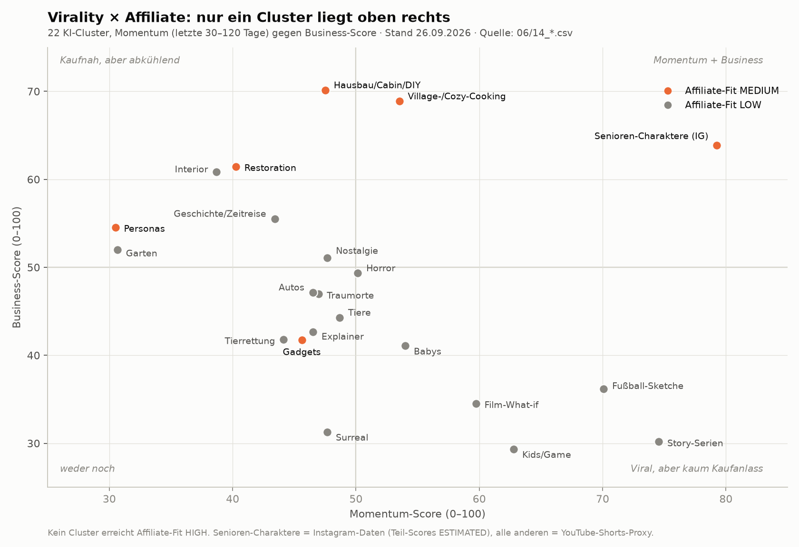

# 10 – Affiliate-Fit, Purchase Intent und Virality × Affiliate (Teile 13–16)

**Stand:** 26.09.2026 · **Rechnung:** [`11_affiliate_economics.csv`](11_affiliate_economics.csv) (38 Zeilen = 19 Cluster × EN/US und DE), Modell [`quellen/r2_affiliate_model.py`](quellen/r2_affiliate_model.py) · **Vollbericht:** [`quellen/R2_affiliate_fit_momentum_clusters.md`](quellen/R2_affiliate_fit_momentum_clusters.md)

Der Affiliate-Fit wurde **erst nach** der Momentum-Messung geprüft. Nicht eingerechnet: Sponsoring, eigene Produkte, E-Books, Kurse, B2B.

## 1. Kernbefund

- **Kein Cluster erreicht Affiliate-Fit HIGH.** HIGH verlangt Intent ≥ 4 und ≥ 250 € pro 1 Mio. Views (Strong).
- **Momentum und Kaufnähe laufen gegeneinander.** Die fünf schnellsten YouTube-Cluster (Story-Serien, Fußball, Kids/Game, Film-What-if, Surreal) liegen bei **21–77 € pro 1 Mio. Views** (Strong). Für 10.000 € Monatsgewinn bräuchten sie **137–499 Mio. Views pro Monat**.
- **MEDIUM** erreichen nur Cluster mit sichtbarem Werkzeug, Kochgeschirr oder Pflegemittel: DIY/Cabin, Kochen, Restoration, Fashion-Personas. Die KI-Senioren-Charaktere laufen in der Rezept-Variante über die Kochen-Rechnung.
- In keinem der 100 codierten Videos war **DIRECT BUYING INTENT** belegt. Kein gefundener KI-Account im Momentum-Set verdient sichtbar mit Produkt-Affiliate im großen Stil. Sichtbar sind:
  - eigene E-Books via Comment-to-DM (Grandma-Accounts)
  - Guides (Bau Rausch)
  - Tool-Referrals (Artlist, Flashloop)
  - einzelne #ad-Produktlinks (hua_jin123)

## 2. Produktlogik und Purchase Intent je Cluster

Purchase-Intent-Stufen (Teil 14):
- **ENTERTAINMENT:** „Cool.“
- **ASPIRATION:** „So möchte ich leben.“
- **PRODUCT DESIRE:** „Wo bekomme ich das?“
- **DIRECT BUYING INTENT:** „Schick mir den Link.“

Die Einstufung beruht auf den Codierungen in R1 und den Captions in M1.

| Cluster | Logische reale Produkte | Purchase Intent (beobachtet) | Affiliate-Fit | Blocker / Einschränkung |
|---|---|---|---|---|
| **Senioren-Charaktere – Rezepte** | Gusseisen, Dutch Oven, Messer, Backformen, Küchenwaage, Zutaten | **PRODUCT DESIRE (indirekt)**: „Comment RECIPE“-Kommentarfluten zeigen Handlungsbereitschaft; bisher auf eigene E-Books gelenkt | **MEDIUM** | KI-Person braucht Instagram-„AI-generated profile“-Label; keine fiktiven Erfahrungsberichte zu Produkten (FTC 16 CFR 465, UWG Anh. 23c) |
| Senioren-Charaktere – Hausmittel | Nahrungsergänzung, Tees, Öle | PRODUCT DESIRE | **nicht empfohlen** | Health-Claims (HCVO) = Compliance HIGH; KI-„Heilerin“ mit Wirkversprechen ist irreführend |
| Village-/Cozy-Cooking | Gusseisen, Feuertopf, Dutch Oven | ASPIRATION (R1: Produkte nicht als kaufbar gezeigt) | **MEDIUM** | – |
| Hausbau/Cabin/DIY | Werkzeug, Akkugeräte, Baustoffe, Gartenhaus-/Cabin-Kits | **ASPIRATION** (Luxus-Endzustand; Bau Rausch: „KI-Konzept, nicht nachbauen“) | **MEDIUM** (bestes Cluster) | Unrealistische Bauzeiten/Ergebnisse; Kit-Versprechen vermeiden |
| Restoration/Satisfying | Reiniger, Polituren, Hochdruckreiniger, Car-Detailing | ASPIRATION bzw. ENTERTAINMENT | **MEDIUM** | KI-Ergebnis darf nicht als Produktwirkung erscheinen |
| Personas (Fashion) | Kleidung, Accessoires | ASPIRATION | **MEDIUM** (DE) | 25–45 % Retouren; KI-Model trägt oft nicht existierende Outfits; Momentum seitwärts |
| Gadgets | reale Trendprodukte | **PRODUCT DESIRE** (Mr.Dumblings) | MEDIUM (EN) / LOW (DE) | Konzept-Gadgets existieren nicht → Irreführungsrisiko |
| Interior | Möbel, Licht, Deko | PRODUCT DESIRE (nur aus Titeln abgeleitet) | LOW | KI-Möbel nicht kaufbar (Vorstudie: AI-Interior-Paradox) |
| Autos/Luxus | Car Care, Modellautos | ASPIRATION | LOW | Marken-/Logo-Risiko |
| Garten/Obst | Saatgut, Geräte | ASPIRATION | LOW | KI-Fantasieobst nahe an Saatgut-Betrug |
| Geschichte/Zeitreise | Bücher, Hörbücher, Stadtführungen, Brettspiele | ENTERTAINMENT | LOW | schwacher Kaufanlass, kleine Warenkörbe |
| Nostalgie | Retro-Konsolen (Amazon 1 %), Vinyl, Bücher | ENTERTAINMENT | LOW | Kernprodukt schlecht vergütet |
| Horror | Bücher, Games (Steam ohne Programm) | ENTERTAINMENT | LOW | – |
| Traumorte | Touren, Hotels | ASPIRATION | LOW | Orte teils fiktiv → Link nur bei realen Zielen |
| Tiere / Tierrettung | Pet-Produkte | ENTERTAINMENT | LOW | Content = Wholesome, nicht Produkt; Fake-Rettungen |
| Babys | Baby-Produkte | ENTERTAINMENT (Ausnahme: App-Code bei Christina Kingston) | LOW | Compliance HIGH |
| Fußball-Sketche | Trikots, Schuhe | ENTERTAINMENT | LOW | Persönlichkeitsrecht realer Spieler, Vereins-IP |
| Film-What-if | Figuren, Artbooks | ENTERTAINMENT | LOW | Disney/Marvel-IP |
| Kids/Game-Figuren | Spielzeug | ENTERTAINMENT | LOW (strukturell) | minderjähriges Publikum, Gift-Cards 0 %, Franchise-IP |
| Story-Serien | – | ENTERTAINMENT | LOW (strukturell) | kein Produkt; Roblox-Affiliate seit 24.07.2025 eingestellt (VERIFIED) |
| Surreal | – | ENTERTAINMENT | LOW (strukturell) | kein Produktbezug |

## 3. Affiliate Economics (Teil 16) – die 15 interessantesten Momentum-Cluster

Alle Werte sind MODEL ASSUMPTION auf Basis der Programm-Daten in der CSV (Provisionen VERIFIED/THIRD-PARTY je Programm):
- **Formel:** Views × Klicks pro 1.000 Views (Base 1,2 / Strong 3,0) × Intent-Faktor × Geo-Anteil × Σ Kanal (Anteil × CVR × AOV × Provision × Netto) × (1 − Retouren).
- **Kosten:** 600 €/Monat.
- **Bester Markt** je Cluster in Klammern.

| Cluster | Markt | AOV | Provision | Provision/Sale | Cookie (Hauptprogramme) | Retouren | € / 1 Mio. Views Base / Strong | Views für 5k / 10k (Strong) |
|---|---|---|---|---|---|---|---|---|
| Hausbau/Cabin/DIY | DE | 85 € | 6,1 % | 5,21 € | Amazon 24 h; Baumärkte 30–60 T | 12 % | 49 / **266** | 21,0 / 39,8 Mio. |
| Hausbau/Cabin/DIY | EN/US | 74 € | 3,8 % | 2,83 € | Amazon 24 h; VEVOR 30 T | 10 % | 32 / 189 | 29,6 / 56,0 Mio. |
| Personas (Fashion) | DE | 78 € | 8,7 % | 6,77 € (eff. 3,13 €) | Amazon 24 h; OTTO 30 T | 45 % | 36 / 218 | 25,7 / 48,7 Mio. |
| **Kochen (Senioren-Rezepte, Cozy-Cooking)** | **DE** | 58 € | 5,7 % | 3,29 € | Amazon 24 h; Petromax 60 T | 12 % | 34 / **177** | 31,7 / 59,9 Mio. |
| **Kochen (Senioren-Rezepte, Cozy-Cooking)** | **EN/US** | 47 € | 4,7 % | 2,21 € | Amazon 24 h | 10 % | 29 / **156** | 36,0 / 68,1 Mio. |
| Restoration | DE | 50 € | 5,3 % | 2,64 € | Amazon 24 h; Kärcher AT 30 T | 14 % | 31 / 156 | 35,8 / 67,8 Mio. |
| Restoration | EN/US | 40 € | 4,6 % | 1,84 € | Amazon 24 h | 10 % | 23 / 124 | 45,1 / 85,4 Mio. |
| Autos/Luxus | DE | 55 € | 5,8 % | 3,19 € | Amazon 24 h; CK-Modelcars 30 T; Autodoc 30 T | 13 % | 22 / 112 | 50,0 / 94,6 Mio. |
| Interior | EN/US | 82 € | 4,3 % | 3,54 € | Amazon 24 h; AllModern 45 T | 10 % | 19 / 111 | 50,5 / 95,6 Mio. |
| Gadgets | EN/US | 31 € | 4,2 % | 1,31 € | Amazon 24 h | 10 % | 21 / 107 | 52,5 / 99,3 Mio. |
| Tiere & Tierrettung | EN/US | 38 € | 5,0 % | 1,88 € | Amazon 24 h; Chewy 15 T; Marken 30–90 T | 5 % | 19 / 94 | 59,8 / 113,3 Mio. |
| Geschichte/Zeitreise | EN/US | 31 € | 5,0 % | 2,13 € | Amazon 24 h | 7 % | 16 / 82 | 68,1 / 128,8 Mio. |
| Geschichte/Zeitreise | DE | 36 € | 5,7 % | 2,04 € | Amazon 24 h; Thalia 30 T | 8 % | 13 / 65 | 85,7 / 162,3 Mio. |
| Fußball-Sketche | DE | 59 € | 5,0 % | 2,92 € | Amazon 24 h; 11teamsports 30 T | 32 % | 14 / 77 | 72,6 / 137,3 Mio. |
| Babys | EN/US | 37 € | 4,2 % | 1,56 € | Amazon 24 h; Marken 30 T; Target 7 T | 10 % | 14 / 76 | 73,6 / 139,3 Mio. |
| Nostalgie | EN/US | 38 € | 2,8 % | 1,08 € | Amazon 24 h; Retro-Shops UNKNOWN | 9 % | 11 / 58 | 97,0 / 183,6 Mio. |
| Horror | DE | 32 € | 5,4 % | 1,72 € | Amazon 24 h; Thalia 30 T | 6 % | 11 / 55 | 102,7 / 194,4 Mio. |
| Film-What-if | DE | 36 € | 3,7 % | 1,34 € | Amazon 24 h; Thalia 30 T | 10 % | 10 / 49 | 114,9 / 217,6 Mio. |
| Kids/Game | DE | 38 € | 3,4 % | 1,28 € | Amazon 24 h; Thalia 30 T | 12 % | 10 / 48 | 116,9 / 221,3 Mio. |
| Story-Serien | DE | 33 € | 4,0 % | 1,30 € | Amazon 24 h; Thalia 30 T | 9 % | 7 / 35 | 162,2 / 307,1 Mio. |

AOV, Provision und Retouren sind provisionsgewichtet (Base). Programme, CVR-Benchmarks und Quellen je Zeile stehen in [`11_affiliate_economics.csv`](11_affiliate_economics.csv).

**Lesart:**
- Die DE-Varianten liegen fast immer vor EN: höherer Geo-Anteil (0,85 statt 0,62) und höhere Content-Raten (Baumärkte 7–10 %, Thalia 11 %). DE hat aber den kleineren Reichweitendeckel.
- Zum Vergleich die Vorstudie: Kitchen & Coffee Setups EN/US 311 €, Grill DE 544 € pro 1 Mio. Views (Strong). Die Momentum-Cluster verdienen pro View **deutlich weniger**, weil der Content unterhält und kein Produkt zeigt (Intent 3 statt 4–5).
- **Base-Szenario als Realitätsanker:** Selbst das beste Cluster (DIY DE) bräuchte im Base-Szenario 217 Mio. Views pro Monat für 10.000 €.

## 4. Virality × Affiliate-Matrix (Teil 15)

| Quadrant | Cluster |
|---|---|
| **oben rechts** (Momentum ≥ 50, Business ≥ 50) | **KI-Senioren-Charaktere** (79 / 64); knapp: **Village-/Cozy-Cooking** (54 / 69) |
| oben links (kaufnah, aber abkühlend) | Hausbau/Cabin/DIY (48 / 70), Restoration (40 / 62), Interior (39 / 61), Geschichte (43 / 56), Personas (31 / 55), Garten (31 / 52), Nostalgie (48 / 51) |
| unten rechts (viral, kaum Kaufanlass) | Story-Serien (75 / 30), Fußball (70 / 36), Kids/Game (63 / 29), Film-What-if (60 / 35), Babys (54 / 41), Horror (50 / 49) |
| unten links | Tiere, Tierrettung, Explainer, Gadgets, Autos, Traumorte, Surreal |

Nur ein Cluster liegt klar oben rechts, und sein Momentum-Wert beruht auf Instagram-Reihen mit ESTIMATED Teil-Scores (siehe [`15_top10_momentum.md`](15_top10_momentum.md)). Das ist ein belastbares Signal, aber kein gesicherter Trend.
