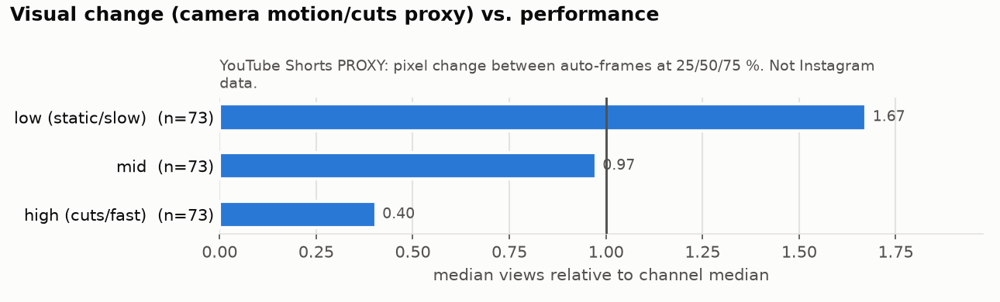
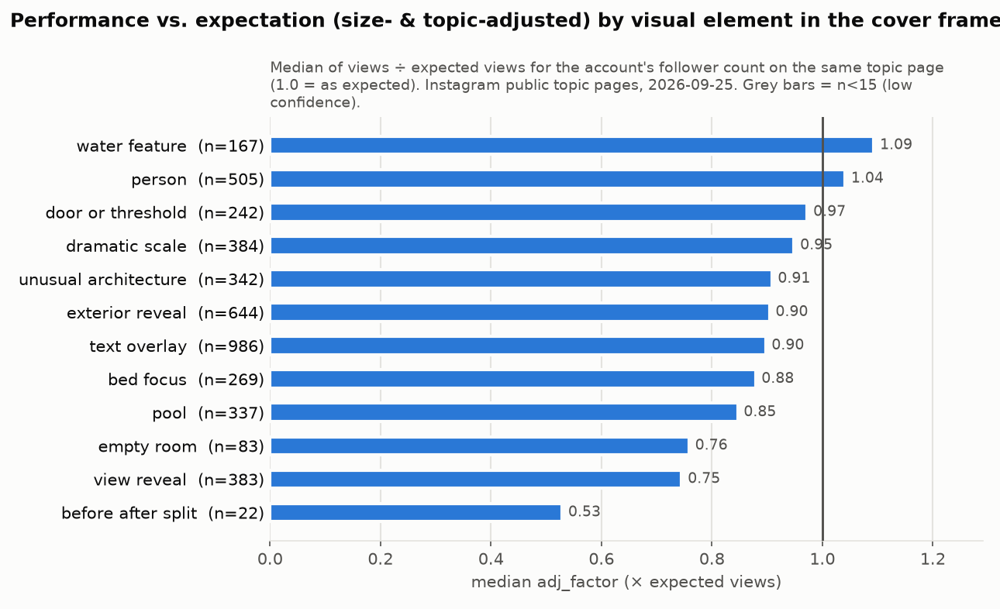
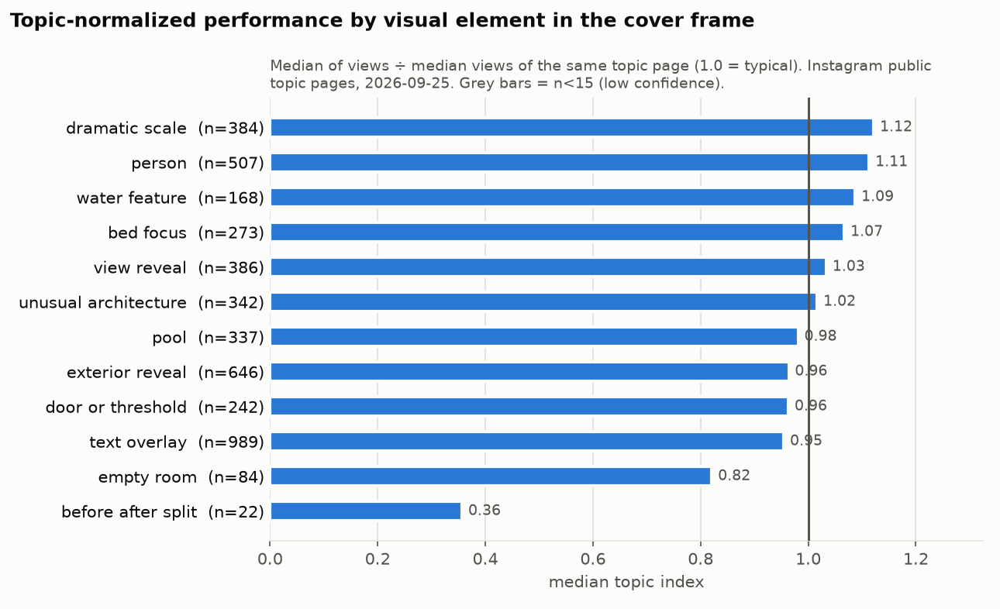
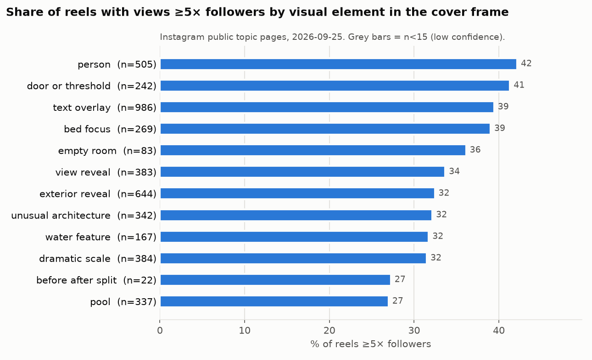
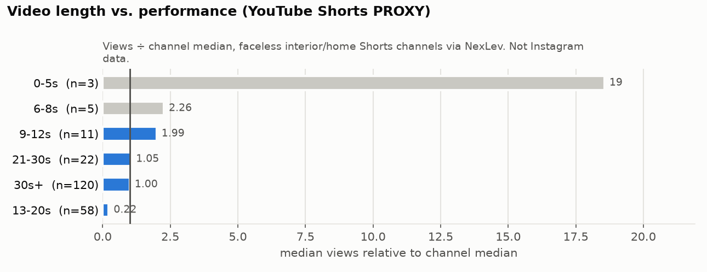
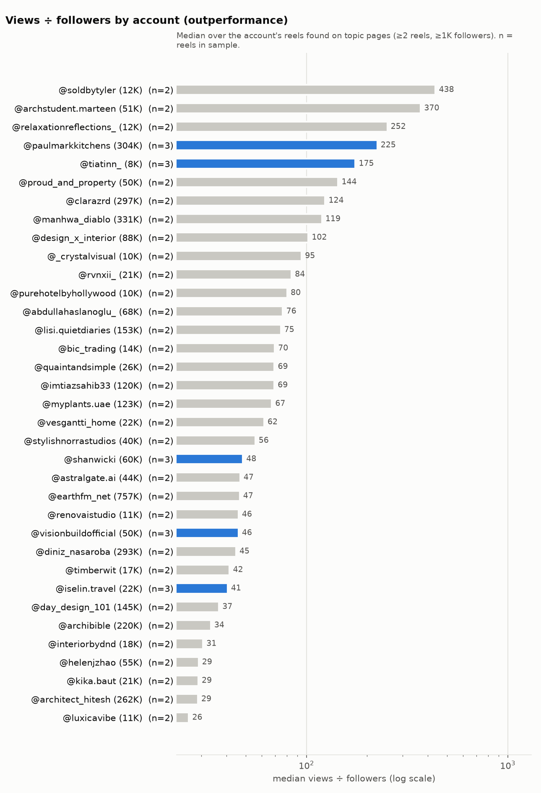

# 05 – Virale Muster: Video-Aufbau, Audio, erste Sekunden, Länge, Frequenz, Viralitätsstufen, Gewinner vs. Verlierer (Teil 7, 8, 11, 12, 13, 14, 15)

**Stand:** 25.09.2026 · **Für:** neuen internationalen KI-Architektur-/Interior-Account („AI-Architektur-Studio für *Homes that shouldn't exist (yet)*“, siehe [Strategy Brief](data/processed/strategy_brief.md)) · **Zahlenquelle:** [analysis_digest.md](data/processed/analysis_digest.md) (im Text „Digest §x“), [stats/*.csv](data/processed/stats/), [04_reel_database.csv](04_reel_database.csv), [02_competitor_database.csv](02_competitor_database.csv), Quellennotizen [q01](quellen/q01_instagram_platform_rules.md), [q06](quellen/q06_ai_theme_page_case_studies.md), [q09](quellen/q09_reels_format_benchmarks.md)

**Lesehilfe**

| Kennzeichen | Bedeutung |
|---|---|
| `VERIFIED` | Views/Follower von öffentlichen Seiten (gerundet wie angezeigt), Posts-Zahlen, Posting-Zeit aus dem Shortcode, Zitate aus Primärquellen |
| `ESTIMATED` | KI-gestützte Codierung (Cover-Frame, Caption, NexLev-Video-Analyse), eigene Ableitungen und Nachrechnungen |
| `PROXY` | YouTube-Shorts-Daten als Ersatz für nicht messbare Instagram-Größen |
| `THIRD-PARTY ESTIMATE` | Faustregeln oder Zahlen Dritter ohne offengelegte Daten |
| `UNKNOWN` | mit öffentlichen Daten nicht bestimmbar |
| **Evidenz stark** | signifikant (p < 0,05) bei n ≥ 50 je Gruppe **und** gleiche Richtung in mindestens einer weiteren Perspektive (Stufen, innerhalb Account, Top vs. Bottom) oder robust nach Mehrfachtest-Korrektur |
| **Evidenz mittel** | nominal signifikant in *einer* Perspektive (oft post hoc oder kleine n), Richtung anderswo bestätigt |
| **Evidenz schwach** | nicht signifikant, nur Richtung, n < 15, nur Proxy oder nur beschreibend |
| „eigene Nachrechnung“ | Zahl nicht im Digest, sondern aus den Daten-CSVs neu berechnet; Code in [Anhang A](#anhang-a--reproduktion-der-eigenen-nachrechnungen) |

---

## 0. Kurzfassung

1. **Teil 7 (Video-Aufbau) ist auf Instagram öffentlich kaum messbar.** Länge, Szenen, Kamera und Audio kennen wir nur für **7 Reels** (NexLev-Video-Analyse, Limit 15/Tag), und alle 7 sind EXTREME-Outlier – es fehlt jede Kontrollgruppe. Der YouTube-Proxy (219 Shorts, 12 Kanäle) zeigt: ruhige/langsame Clips liegen im Median bei 1,67× Kanal-Median, schnitt-/bewegungsreiche bei 0,40× – aber der Unterschied ist **nicht signifikant** (Kruskal p = 0,77) und stark mit der Dauer verknüpft. → Arbeitshypothese „eine ruhige, kontinuierliche Kamerafahrt je Reel“ (**schwach**).
2. **Teil 8 (erste 1–2 Sekunden):** Wir messen den **Cover-Frame als Proxy** für den ersten Eindruck. Er stimmt nur bei **3 von 7** geprüften Reels mit dem tatsächlichen ersten Frame überein. Über alle Reels ist kein Cover-Element signifikant. Bei **KI-Reels** liegt ein Cover mit Person bei **1,63 vs. 0,79** (n = 74, p = 0,02); Aussichts-Reveal (0,56; n = 118) und Text-Overlay (0,74; n = 179) liegen darunter (beide n.s.). Der Fensterblick (Bildinhalt) liegt nominal signifikant bei **0,70×** (p = 0,02; nicht Bonferroni-fest).
3. **Teil 12 (Länge, PROXY):** Die scheinbare Überlegenheit kurzer Shorts (≤ 12 s: 2,26× Kanal-Median, Viralitätsquote 58 %) stammt bei **13 von 19** Shorts aus **einem** Kanal und dessen 2025er-Hits. Ohne ihn liegt ≤ 12 s bei **0,06×** (n = 6). Kruskal über alle sechs Buckets: p = 0,22. → **Länge ist Testvariable, kein Befund.**
4. **Teil 13 (Frequenz):** Wettbewerber posten laut Obergrenze im Median **1,8 Posts/Tag** (n = 103): 45 Accounts < 1,5/Tag (davon 34 < 1/Tag), 15 ≈ 2, 10 ≈ 3, 33 ≥ 3,5 (davon 30 ≥ 4). Wer mehr postet, ist eher größer (ρ = +0,26) und liegt **pro Reel** eher weniger über der Erwartung (ρ = −0,14, n.s.; bei ≥ 365 Tagen Beobachtung −0,31, p = 0,015). **Uhrzeit und Wochentag zeigen keinen messbaren Effekt** (Kruskal p = 0,94 bzw. 0,62).
5. **Teil 14 (Viralitätsstufen):** 587 NORMAL · 528 GOOD · 356 VERY GOOD · 448 VIRAL · 459 EXTREME (n = 2.378). Die vpf-Stufen messen vor allem **Account-Größe** (EXTREME: Median 19K Follower, NORMAL: 265K). Was nach Größenbereinigung (adj_factor-Stufen) bleibt: robust **weniger Theme-Pages**; nur nominal signifikant und je nach Schnitt schwankend **mehr Menschen im Bild** (adj ≥ 20: p = 0,02; adj ≥ 5: n.s.) und **mehr Nachtlicht** (adj ≥ 20: n.s.; adj ≥ 5: p = 0,02). Für den eigenen Start gelten **absolute View-Schwellen** (Abschnitt 6.5), weil vpf unter 1.000 Followern bedeutungslos ist.
6. **Teil 15 (Gewinner vs. Verlierer):** Innerhalb derselben 25 Accounts (172 Reels) liegen die Top-10-%-Reels bei **4,5× Konto-Median**. Sie zeigen häufiger Skyline (+16 Pp., p = 0,02), Nachtlicht (+12 Pp.) und Bett-Fokus, seltener Text-Cover (−13 Pp.) sowie Wasser und Pflanzen – nominal signifikant ist nur die Skyline. Global (Top 80 vs. Bottom 40 nach adj_factor) tragen Verlierer **5× so oft Save/Shop/Follow-CTAs** (32,5 % vs. 6,4 %, p = 0,001).
7. **Viral-Formel v1 (Abschnitt 8):** 13 testbare Hypothesen. **Stark:** Studio-/Creator-Identität statt Theme-Page, fantastisches Konzept statt „dreamy“, Choice-Mechanik für Kommentare. **Mittel:** Mensch im Bild (bei KI), Nachtlicht/City-Lights, kein Fensterblick-Klischee, Novelty-Rotation. **Schwach:** Kamera, Länge, Text-Cover, Frequenz. **Kein messbarer Hebel:** Posting-Uhrzeit.

---

## 1. Datenbasis, Metriken und Messgrenzen dieses Kapitels

### 1.1 Was messbar ist – und was nicht

| Frage (Teil) | Öffentlich auf Instagram messbar? | Was wir stattdessen nutzen | n | Status |
|---|---|---|---|---|
| Länge, Szenen, Kamerafahrt, Geschwindigkeit (7, 12) | **Nein** (Topic- und Embed-Seiten zeigen keine Dauer) | NexLev-Video-Analyse von 7 IG-Reels; YouTube-Shorts: Dauer + Bildwechsel-Score (Pixel-Differenz zwischen YouTube-Auto-Frames bei 25/50/75 %) | 7 / 219 Shorts aus 12 Kanälen | `ESTIMATED` / `PROXY` |
| Erste 1–2 s, visuelle Hooks (8) | **Nein** | Codierung des Cover-Frames (`cover_hooks`, Mehrfachcodes; Re-Codierung n = 36: mittlere Jaccard-Übereinstimmung 0,848) + `first_frame`/`first_2s_hooks` der 7 NexLev-Reels | 2.364 codierte Reels mit adj_factor / 7 | `ESTIMATED` |
| Audio | **Nein** | nur die 7 NexLev-Reels | 7 | `ESTIMATED` |
| Views, Follower | Ja (gerundet) | Topic-Seiten `/popular/<slug>/`, Embed-Seiten | 2.479 Reels mit Views, 2.397 mit Followern | `VERIFIED` (gerundet) |
| Posting-Zeitpunkt (13) | Ja (exakt aus dem Shortcode) | – | 2.479 | `VERIFIED` |
| Posting-Frequenz (13) | **Nicht direkt** | Obergrenze = Posts ÷ Tage seit frühestem bekannten Post | 103 von 111 Accounts | `ESTIMATED` |
| Watch Time, Skip-Rate, Sends, Saves der Wettbewerber | **Nein** | nur externe Benchmarks ([q09](quellen/q09_reels_format_benchmarks.md)); im eigenen Account über Insights | – | `UNKNOWN` |

Quellen: Digest §1, [reliability.csv](data/processed/stats/reliability.csv), [reels_video_coded.csv](data/processed/reels_video_coded.csv), [youtube_shorts_details.csv](data/processed/youtube_shorts_details.csv).

### 1.2 Metriken

- **adj_factor** (Hauptmetrik): Views ÷ erwartete Views für die Followerzahl des Accounts auf **derselben** Topic-Seite (Regression log Views ~ log Follower innerhalb des Topics; Steigung 0,468). 1,0 = wie erwartet, 2,0 = doppelt so viel. Grund: Die Followerzahl hängt von allen Einzelgrößen am stärksten mit den Views zusammen (Spearman ρ = 0,427, n = 2.378; Digest §1; Korrelation).
- **topic_index:** Views ÷ Median-Views derselben Topic-Seite.
- **vpf:** Views ÷ Follower. Die Follower stammen vom **Abrufzeitpunkt** (25.09.2026), nicht vom Postzeitpunkt.
- **ch_index (YouTube):** Views ÷ Median-Views desselben Kanals in der Stichprobe.
- **Viralitätsquote:** YouTube = Anteil der Shorts mit ≥ 2× Kanal-Median. Instagram-Pendant = `share_viral_5x` (Anteil mit vpf ≥ 5, also Stufe VIRAL oder EXTREME).
- **Signifikanz:** Kruskal-Wallis je Dimension (Digest §1); bei ~27 Tests liegt die Bonferroni-Schwelle bei p ≈ 0,0019. Paarvergleiche mit Mann-Whitney bzw. Fisher-Test.

### 1.3 Selektionsbias – gilt für jede Zahl in diesem Kapitel

Topic-Seiten zeigen pro Thema nur die **Top-Reels**. Alle Vergleiche lauten deshalb: „**unter Reels, die es auf eine Topic-Seite geschafft haben**“.

- Absolute Views sind nach oben verzerrt: **38,1 %** der Reels mit vpf-Wert haben vpf ≥ 5 (448 + 459 von 2.378). Ein Business-Account mit 1–5K Followern erreicht dagegen im Schnitt **580 Views pro Reel** (2025) bzw. **658** (H1 2026) ([q09](quellen/q09_reels_format_benchmarks.md) §3.1, `VERIFIED`).
- „Bottom“-Reels in Teil 15 sind die **schwächsten unter den Top-Reels**, keine echten Flops.
- Merkmale, die *jeden* Reel von der Topic-Seite fernhalten, sind unsichtbar (Survivorship).
- **Relative Vergleiche** (adj_factor, innerhalb Account) sind die Stärke des Datensatzes, **Kausalität** ist es nie.

---

## 2. Teil 7 – Video-Aufbau: Länge, Szenen, Geschwindigkeit, Kamerafahrt

### 2.1 Ehrliche Bestandsaufnahme

| Aspekt | Instagram-Daten | Proxy | Belastbarkeit |
|---|---|---|---|
| Länge | 7 Reels (7–23 s) | 219 YouTube-Shorts mit Dauer (Teil 12) | schwach |
| Anzahl Szenen | 7 Reels | Bildwechsel-Score (misst Schnitte **und** Bewegung, nicht trennbar) | schwach |
| Kamerafahrt, Geschwindigkeit | 7 Reels (`camera_motion`, `camera_speed`) | Bildwechsel-Score | schwach |
| Format (Ambience, Transformation, Tour) | 7 Reels | YouTube-Titel-Hooks (Regex-codiert, 713 Shorts) | schwach |
| Komposition des Einstiegsbilds | 2.364 Cover-Frames | – | mittel (Teil 8) |

### 2.2 Die 7 per Video analysierten Instagram-Reels (NexLev)

Alle 7 sind **Top-Reels (Stufe EXTREME, vpf 22,6–750)**. Sie zeigen, *wie* Gewinner gebaut sind, aber nicht, *was sie von Verlierern unterscheidet*.

| Reel (Handle) | Länge | Szenen | Kamera / Tempo | Format | Audio | Produktion | Views | vpf | adj_factor |
|---|---|---|---|---|---|---|---|---|---|
| DBKFpVDoZzM (@paulmarkkitchens) | 21 s | 1 | Schwenk / langsam | House-Tour | nur Musik (Pop/Trend) | real | 135 Mio. | 444 | 86,9 |
| C9SiQc8S9xq (@siyad_abdali) | 7 s | 1 | statisch / langsam | Single-Scene-Ambience | nur Musik (Ambient) | KI | 109 Mio. | 27,3 | 117 |
| DZb4Qkbhr9V (@interiorbyuma22) | 23 s | 9 | gemischt / mittel | Before/After | nur Musik | gemischt (real → 3D) | 55,5 Mio. | 188 | 41,9 |
| DBWhf0koR7_ (@soothenests) | 7 s | 1 | statisch / langsam | Single-Scene-Ambience | Musik + Ambient | KI | 45,1 Mio. | 22,6 | 13,9 |
| DGQYtSbOz6S (@longingtocomehome) | 13 s | 10 | gemischt / mittel | Before/After | nur Musik (Hip-Hop) | real | 36 Mio. | 277 | 48,1 |
| DJo4QLktHJz (@cocinasintegralesjv) | 16 s | 2 | POV-Walk / mittel | House-Tour | nur Musik (Pop/Trend) | real | 24 Mio. | 750 | 78,8 |
| DQzx59pEsqO (@lisi.quietdiaries) | 7 s | 5 | statisch / langsam | Multi-Scene-Montage | nur Ambient/Natur | real | 22,7 Mio. | 148 | 29,5 |

Quelle: Digest „NexLev video-watched reels“ + [04_reel_database.csv](04_reel_database.csv) (Views/vpf/adj). Views `VERIFIED` (gerundet), Video-Codes `ESTIMATED`.

**Was sich beschreiben lässt (n = 7, keine Kontrollgruppe):**

- **Länge 7–23 s**, Median 13 s. Drei der sieben sind **7-s-Clips**.
- **Zwei wiederkehrende Bauweisen** (die übrigen drei Reels: 2 House-Tours, 1 Multi-Scene-Montage):
  - **Ein-Szenen-Stimmung:** 1 Einstellung, statisch oder langsam, Ambient-Audio. Beide KI-Reels sind so gebaut.
  - **Transformation/Reveal:** 9–10 Szenen, gemischte Kamera, rhythmische Musik, Text-Hook im ersten Bild.
- **Kein Voiceover** (0/7). 5/7 nur Musik.
- **Tempo:** 4/7 langsam, 3/7 mittel, **0/7 schnell**.

### 2.3 YouTube-Proxy: Bildwechsel (Kamerabewegung/Schnitte) vs. Performance



| Bildwechsel-Terzil | n | Kanäle | Median ch_index | Median Views | Median Dauer |
|---|---|---|---|---|---|
| niedrig (statisch/langsam) | 73 | 12 | **1,67** | 689K | 15 s |
| mittel | 73 | 12 | 0,97 | 409K | 43 s |
| hoch (Schnitte/schnell) | 73 | 10 | **0,40** | 705K | 60 s |

Quelle: [yt_visual_change.csv](data/processed/stats/yt_visual_change.csv) (`PROXY`).

**Warum das nur eine schwache Evidenz ist** (eigene Nachrechnung aus [youtube_shorts_details.csv](data/processed/youtube_shorts_details.csv)):

- **Nicht signifikant:** Kruskal-Wallis über die drei Terzile p = 0,77. Die Mediane unterscheiden sich stark, die Verteilungen überlappen aber fast vollständig. Mögliche Ursache: Die Stichprobe mischt je Kanal alte Hits und neueste Uploads.
- **Konfundiert mit der Dauer:** Bildwechsel und Dauer korrelieren mit ρ = 0,54. Längere Shorts haben zwangsläufig mehr Wechsel.
- **Konfundiert mit dem Kanal:** 54 der 73 „ruhigen“ Shorts stammen aus vier Kurzformat-Kanälen (Simple Vision 18, Isla 17, UnrealLife 10, Kou Yang 9).
- **Innerhalb derselben Kanäle** bleibt nur ein kleiner Zusammenhang: Rangkorrelation Bildwechsel ~ ch_index ρ = −0,15 (p = 0,03, n = 219). Die Richtung stimmt also, die Stärke ist gering.

### 2.4 Format-Proxy: YouTube-Titel-Hooks

| Titel-Hook (Regex) | n | Kanäle | Median ch_index |
|---|---|---|---|
| transformation | 268 | 10 | 1,15 |
| curiosity | 164 | 12 | 1,15 |
| fantasy_ai | 110 | 10 | 1,05 |
| choice | 92 | 4 | 0,995 |
| descriptive | 198 | 11 | 0,964 |
| instructional | 88 | 7 | 0,874 |
| cozy_ambience | 61 | 8 | **0,485** |
| location | 6 | 4 | 2,0 (n < 15, geringe Konfidenz) |

Quelle: [yt_title_hooks.csv](data/processed/stats/yt_title_hooks.csv) (`PROXY`, keine Signifikanztests). Transformations- und Neugier-Titel liegen leicht über dem Kanal-Median, „cozy/rain/relax“-Titel deutlich darunter. Das passt zur Decay-Evidenz bei Cozy-Formaten (Strategy Brief §2.5), ist aber nur ein Hinweis.

### 2.5 Ableitung: Aufbau-Blaupausen für die drei Startformate (Hypothesen, keine Befunde)

Grundregeln aus 2.2–2.4 (alle **schwach**): eine ruhige, kontinuierliche Kamerabewegung ab Frame 1 · höchstens 1–2 harte Schnitte bei Reveal-Formaten · Transformationen als **Sequenz** (nicht Split-Screen) · Audio ab Sekunde 0 (stumme Reels werden laut Meta herabgestuft, [q09](quellen/q09_reels_format_benchmarks.md) §3.6 `VERIFIED`) · Endframe loopfähig.

**Format A – „Unbuilt No. 017“ (Impossible-Home-Reveal; Arbeitslänge 8–12 s)**

| Zeit | Bild | Kamera | On-Screen-Text (EN) |
|---|---|---|---|
| 0,0–1,0 s | Totale des unmöglichen Hauses bei Nacht/Blue Hour, warmes Innenlicht, **kleine Figur** im Vordergrund | langsamer Push-in ab Frame 1 | `UNBUILT No. 017` klein + max. 7 Wörter, z. B. *"A house carved into a frozen waterfall"* |
| 1–5 s | Annäherung an das Signaturdetail (Treppe, Pool, Felswand) | kontinuierlicher Fly-in, kein Schnitt | – |
| 5–9 s | ein Hero-Raum (Treppe/Halle, Bad, Pool) mit **einem** kaufbaren Möbelmoment | max. 1 Match-Cut | optional: *"Would you spend one night here?"* |
| 9–12 s | Rückfahrt in die Nacht; Endframe ≈ Startframe (Loop) | langsamer Pull-back | *"AI concept · not a real listing"* |

**Format B – „Pick One“ (Choice; 10–15 s)**

| Zeit | Bild | Kamera | On-Screen-Text (EN) |
|---|---|---|---|
| 0–1 s | Variante 1 formatfüllend, Ziffer groß in der Ecke | identischer langsamer Push-in in allen Varianten | *"One room. Three worlds. Pick one."* |
| 1–12 s | Variante 1 → 2 → 3, je 3–4 s, **gleiche Kameraposition** (der Unterschied liegt nur im Konzept) | harter Schnitt auf dem Beat | Ziffern `1` `2` `3` |
| 12–15 s | kurzes Zurückblenden auf alle drei, nacheinander (kein Split-Raster als Cover) | – | *"Comment 1, 2 or 3"* |

**Format C – „From Nothing“ (Transformation; 12–20 s)**

| Zeit | Bild | Kamera | On-Screen-Text (EN) |
|---|---|---|---|
| 0–1 s | leerer, unwirtlicher Ort (Felsnische, Brache, Klippe) mit Figur | statisch oder minimaler Push-in | *"Nothing here but rock. Watch."* |
| 1–12 s | 4–6 Bauphasen aus **derselben Perspektive** (Zeitraffer-Logik) | fix, Schnitt pro Phase | – |
| 12–20 s | fertiges Ergebnis bei Nacht, Figur im Bild | langsamer Push-in, Loop zum Anfang | *"AI concept"* |

Das **Cover** zeigt bei C den Endzustand (Payoff), der **erste Frame** den Leerzustand (Spannung). Das beobachtete Muster dafür beschreibt 3.1.

**Messplan im eigenen Account:** Für jedes Reel `length_sec`, `n_scenes`, `camera`, `visual_hook` und `text_overlay` in der Winner-Datenbank erfassen ([data/winner_database_template.csv](data/winner_database_template.csv), Felder existieren). Dazu `avg_watch_time`, `completion_rate` und `skip_rate` aus den Insights. Erst damit wird Teil 7 für **unseren** Account messbar.

### 2.6 Teil 11 – Audio-Kategorien (nur n = 7 plus externe Belege)

Audio ist auf Topic- und Embed-Seiten **nicht** sichtbar und aus Cover-Frames nicht codierbar. Belastbare Performance-Vergleiche zwischen Audio-Kategorien sind mit öffentlichen Daten deshalb **nicht möglich** (`UNKNOWN`). Was vorliegt:

| Kategorie | Instagram: 7 NexLev-Reels (alle EXTREME, keine Kontrollgruppe) | Externe Evidenz | Status |
|---|---|---|---|
| nur Musik | **5/7**: Pop/Trend 2 (House-Tours, real) · Ambient 1 (KI, Ein-Szenen-Stimmung) · Hip-Hop 1 und „other“ 1 (Before/After, real bzw. gemischt) | – | `ESTIMATED` |
| Musik + Ambient-Geräusch | 1/7 (@soothenests, KI, Regen-Wohnzimmer) | – | `ESTIMATED` |
| nur Ambient/Natur | 1/7 (@lisi.quietdiaries, real, Multi-Scene-Montage) | – | `ESTIMATED` |
| Voiceover / Sprache | **0/7** | – | `ESTIMATED` |
| Trending vs. Original Audio | nicht bestimmbar | Meta: Trending Audio *"can also impact distribution"*; *"go to the audio page"* ist eine Reels-Vorhersage; stumme Reels werden herabgestuft `VERIFIED`. Eine quantitative Studie 2024–2026 zu Trending vs. Original fand sich nicht ([q09](quellen/q09_reels_format_benchmarks.md) §3.6, §3.8) | `UNKNOWN` |
| bewusst ohne Musik | Einzelfall: Caption „… No Music. Just Pure Construction.“ (@epocraftdiy, adj 330, KI; beobachtet, nicht kopieren) | stumm = herabgestuft (s. o.) → Baugeräusch statt Stille | anekdotisch |

Quelle: [reels_video_coded.csv](data/processed/reels_video_coded.csv) (`audio_type`, `music_genre`, `audio_mood`, `voiceover`), Digest „NexLev video-watched reels“. **Stimmung:** Beide KI-Reels haben ruhige Ambient-Musik (ethereal/serene bzw. cozy/relaxing), die Transformationen und House-Tours rhythmische Musik (4/7 energisch/rhythmisch). Das beschreibt Gewinner, erklärt aber nichts über Verlierer (**Evidenz schwach**).

**Ableitung:** Audio ab Sekunde 0, nie stumm · Ein-Szenen-Reveals (P1/P4) mit ruhigem Sound-Design, Transformationen (P3) mit rhythmischer Musik oder Baugeräusch · Trending Audio nur als Test auf nicht kommerziellen Reels (Musiklizenz, [11 §10](11_brand_style_guide.md)) · Test `T13_audio` ([13](13_testing_matrix.csv)) · Erfassung `audio_type`/`audio_name` in der Winner-DB ([15 §5.2](15_kpi_framework.md)).

---

## 3. Teil 8 – Die ersten 1–2 Sekunden: visuelle Hooks

### 3.1 Der Cover-Frame ist nur ein Proxy für den ersten Eindruck

Instagram zeigt öffentlich nur das **Cover**. Das kann ein frei gewähltes Bild sein und muss nicht der erste Frame sein. Wir haben das an den 7 NexLev-Reels geprüft (`ESTIMATED`):

| Reel | Cover-Codes | Codes der ersten 2 s | Übereinstimmung |
|---|---|---|---|
| @siyad_abdali | dramatic_scale, view_reveal | view_reveal, sound_hook | ja |
| @soothenests | view_reveal, dramatic_scale | view_reveal, unusual_architecture, sound_hook | ja |
| @lisi.quietdiaries | text_overlay, person | text_hook, person_present | ja |
| @paulmarkkitchens | (kein Hook-Element) | person_present, door_opening, unusual_architecture, motion_immediate | nein |
| @interiorbyuma22 | bed_focus (fertiges Ergebnis) | text_hook, person_present, before_after (Rohbau) | nein |
| @longingtocomehome | (kein Hook-Element) | text_hook, before_after | nein |
| @cocinasintegralesjv | (kein Hook-Element) | person_present, motion_immediate | nein |

**Folgerung:** Bei ruhigen Stimmungs-Clips ist das Cover ein brauchbarer Proxy (3/3 übereinstimmend: 2 Ein-Szenen-Ambience, 1 Montage). Bei House-Tours und Transformationen stimmt es nicht (0/4; auch der Ein-Szenen-Tour-Clip von @paulmarkkitchens nicht). Bei Transformationen zeigt das Cover oft den **Payoff**, während das Video mit dem **Ausgangszustand** beginnt. Alle Aussagen in 3.2–3.4 betreffen daher **das Cover (Grid, Explore, Topic-Seite)** und nur eingeschränkt die ersten 1–2 Sekunden im Feed.

Häufigkeit in den ersten 2 s der 7 Reels: Person 4×, Text-Hook 3×, sofortige Bewegung 2×, Aussichts-Reveal 2×, Before/After 2×, ungewöhnliche Architektur 2×, Sound-Hook 2×, Tür öffnet sich 1× (Mehrfachcodes, n = 7, **schwach**).

### 3.2 Cover-Elemente über alle Reels (n = 2.364 codierte Reels mit adj_factor)





| Cover-Element | n | Median adj_factor | Median topic_index | Viralitätsquote (vpf ≥ 5) | p (Mann-Whitney vs. Rest, eigene Nachrechnung) |
|---|---|---|---|---|---|
| Wasser-Element | 167 | 1,09 | 1,09 | 31,7 % | 0,19 |
| Person | 505 | 1,04 | 1,11 | 42,2 % | 0,07 |
| Tür/Schwelle | 242 | 0,973 | 0,963 | 41,3 % | 0,85 |
| dramatischer Maßstab | 384 | 0,949 | 1,12 | 31,5 % | 0,93 |
| ungewöhnliche Architektur | 342 | 0,908 | 1,02 | 32,2 % | 0,75 |
| Außen-Reveal (Fassade) | 644 | 0,904 | 0,964 | 32,5 % | 0,36 |
| Text-Overlay | 986 | 0,897 | 0,955 | 39,5 % | 0,41 |
| Bett-Fokus | 269 | 0,879 | 1,07 | 39,0 % | 0,73 |
| Pool | 337 | 0,847 | 0,981 | 27,0 % | 0,24 |
| leerer Raum | 83 | 0,759 | 0,821 | 36,1 % | 0,61 |
| Aussichts-Reveal | 383 | 0,745 | 1,03 | 33,7 % | 0,48 |
| Vorher/Nachher-Split | 22 | **0,529** | 0,357 | 27,3 % | 0,066 |
| *kein codiertes Hook-Element* | 293 | *1,20* | – | – | *0,055* |

Quellen: Digest §3 „Visual elements in cover“, [seg_cover_hooks.csv](data/processed/stats/seg_cover_hooks.csv); p-Werte und die letzte Zeile sind eigene Nachrechnung.

**Lesart:**

- **Kein einzelnes Cover-Element ist über alle Reels signifikant** (alle p ≥ 0,055). Das „Was“ auf dem Cover erklärt wenig.
- Die belastbaren Kontraste aus dem Digest (Key contrasts):
  - Text-Overlay vs. keins: **0,92×** (95-%-KI 0,77–1,09; p = 0,39; n = 986/1.392) – **nicht signifikant**.
  - Vorher/Nachher-Split: **0,56×** (KI 0,25–1,29; p = 0,065; n = 22) – **nicht signifikant**, kleine n.
  - Fensterblick im Bild (Bildinhalt, nicht Cover-Hook): **0,70×** (KI 0,53–0,85; p = 0,02; n = 306) – **nominal signifikant** (nicht Bonferroni-fest).
- Die **Viralitätsquote (vpf ≥ 5)** ist größenverzerrt: Text-Overlays liegen dort bei 39,5 %, im größenbereinigten adj_factor aber unter 1. Deshalb entscheiden wir nach adj_factor.



### 3.3 Nur KI-Reels (n = 686 mit adj_factor; Median 0,868) – relevant für unseren Account

| Cover-Element (KI) | n | Median adj mit | Median adj ohne | Anteil vpf ≥ 5 | p (MW) |
|---|---|---|---|---|---|
| **Person** | 74 | **1,63** | 0,79 | 54 % | **0,021** |
| kein Hook-Element | 74 | 1,15 | 0,83 | 47 % | 0,36 |
| Wasser-Element | 69 | 1,05 | 0,84 | 33 % | 0,36 |
| ungewöhnliche Architektur | 170 | 1,00 | 0,82 | 36 % | 0,44 |
| Vorher/Nachher-Split | 16 | 0,95 | 0,86 | 31 % | 0,37 |
| dramatischer Maßstab | 169 | 0,94 | 0,85 | 35 % | 0,65 |
| Tür/Schwelle | 53 | 0,89 | 0,87 | 42 % | 0,80 |
| Außen-Reveal | 234 | 0,81 | 0,88 | 30 % | 0,38 |
| Text-Overlay | 179 | 0,74 | 0,93 | 37 % | 0,13 |
| Pool | 81 | 0,73 | 0,87 | 32 % | 0,43 |
| leerer Raum | 22 | 0,72 | 0,88 | 27 % | 0,53 |
| Bett-Fokus | 108 | 0,70 | 0,89 | 39 % | 0,51 |
| **Aussichts-Reveal** | 118 | **0,56** | 0,90 | 37 % | 0,12 |

Eigene Nachrechnung aus [04_reel_database.csv](04_reel_database.csv) (`ESTIMATED`). Nominal signifikant ist nur „Person“ (bei 13 Tests nicht Bonferroni-fest). Das deckt sich mit dem Digest-Kontrast **„KI mit Personen im Bild“ 1,68×** (KI 0,99–2,52; p = 0,017; n = 106/580).

### 3.4 Innerhalb derselben Accounts: Cover der Top-10 % vs. Bottom-50 %

| Cover-Element | Bottom 50 % (n = 78) | Top 10 % (n = 28) | Differenz |
|---|---|---|---|
| Bett-Fokus | 15,4 % | 28,6 % | +13,2 Pp. |
| Aussichts-Reveal | 19,2 % | 28,6 % | +9,4 Pp. |
| Person | 6,4 % | 14,3 % | +7,9 Pp. |
| ungewöhnliche Architektur | 21,8 % | 28,6 % | +6,8 Pp. |
| Pool | 21,8 % | 14,3 % | −7,5 Pp. |
| Wasser-Element | 11,5 % | 0 % | −11,5 Pp. |
| **Text-Overlay** | 26,9 % | 14,3 % | **−12,6 Pp.** |
| Außen-Reveal | 48,7 % | 35,7 % | −13,0 Pp. |
| dramatischer Maßstab | 34,6 % | 21,4 % | −13,2 Pp. |

Quelle: Digest §7 „cover_hooks“. **Keine** dieser Differenzen ist signifikant (Fisher, eigene Nachrechnung: Text-Overlay p = 0,21, Bett-Fokus p = 0,16, dramatischer Maßstab p = 0,24). Ein einziges Top-Reel verschiebt einen Anteil um 3,6 Pp. **Widerspruch:** Aussichts-Reveal ist innerhalb der Accounts positiv, über Accounts (0,745) und bei KI (0,56) negativ. Daraus leiten wir **keine** Regel ab.

### 3.5 Beobachtete Cover-Texte und Captions → Prinzip → eigene Formulierung

Beobachtete Beispiele (kurze Auszüge, nicht zu kopieren) stammen aus Digest §9/§10/§11. Die neuen Hooks sind eigene Formulierungen für unser Konzept.

| Beobachtetes Beispiel (Handle, adj_factor) | Prinzip | Eigene Formulierung (EN) |
|---|---|---|
| „Maybe I don't want a bigger house…“ (@timelessdiaries, 198) | innerer Monolog, der ein Wertesystem kippt | *"Turns out I never wanted a mansion. I wanted a room inside a mountain."* |
| „HOW MUCH RENT DO YOU PAY?“ (@alshifarealtor.dxb, 139) | direkte Frage an die Lebensrealität (Geld) vor Fantasie-Bild | *"Guess the build cost. (Trick question: it can't be built.)"* |
| „Wait for it !!!!“ (@clarazrd, 32,5) | Payoff-Versprechen mit Zeitmarke | *"Second 6 is why we made this."* |
| „this capsule house won't cost you $150,000“ (@capsulecastle2025, 31,3) | Preis-Erwartung brechen | *"Everyone guesses $20M. The real answer: physics says no."* |
| „DO NOT TOUCH“ (@tns_realestate_, 27,4) | Verbot weckt Neugier | *"Do not open the last door."* |
| „Client: I want Super luxury bedroom in my budget“ (Caption; @design_x_interior, 37,4) | Mini-Dialog/Auftrag als Rahmen | *"The brief said: 'Make it float.' So we did."* |

**Achtung:** Preis- und Ortsangaben bei fiktiven Konzepten immer als Konzept kennzeichnen (Irreführungsrisiko, Strategy Brief §7; [q07](quellen/q07_legal_ai_risk.md)).

### 3.6 Regeln für die ersten 1–2 Sekunden (Checkliste)

| # | Regel | Evidenz | Stärke |
|---|---|---|---|
| 1 | **Kleine menschliche Figur im ersten Frame** (Maßstab, Story) | KI: Person im Bild 1,68× (p = 0,017); KI-Cover mit Person 1,63 vs. 0,79 (p = 0,02); 4/7 NexLev-Einstiege mit Person | mittel |
| 2 | **Warmes (künstliches) Nachtlicht im ersten Frame** | Teil 14/15: Nachtlicht in allen Perspektiven gleiche Richtung, nur teils signifikant. Blue Hour dagegen nicht gestützt (adj 0,98; innerhalb Accounts −8,8 Pp.) | mittel (Nachtlicht) |
| 3 | **Kein Fenster-mit-Aussicht-Einstieg** („Blick aus dem Fenster auf Meer/Schnee“) | Fensterblick 0,70× (p = 0,02); KI-Aussichts-Reveal 0,56 (n.s.) | mittel |
| 4 | **Ein Motiv, kein Textblock:** höchstens 1 Zeile, ≤ 7 Wörter | Text-Overlay 0,92× (n.s.), KI 0,74 (n.s.), innerhalb Accounts −12,6 Pp. (n.s.); Meta stuft *"reels that are majority text"* herab ([q09](quellen/q09_reels_format_benchmarks.md) §3.6 `VERIFIED`) | schwach (Performance) + Plattformregel |
| 5 | **Kein Split-Screen**, Transformation sequenziell zeigen | Split-Cover 0,56× (n = 22, n.s.) | schwach |
| 6 | **Bewegung ab Frame 1, aber langsam** | YouTube: ruhig > hektisch (n.s., konfundiert); 0/7 NexLev-Reels schnell | schwach |
| 7 | **Cover ≠ erster Frame bewusst planen:** Cover = Payoff/Signaturmotiv, erster Frame = Spannung | 3/7 Übereinstimmung; Transformationen starten mit dem Rohzustand | schwach |
| 8 | **Ton ab Sekunde 0** (nie stumm) | Meta stuft *"reels that are muted"* herab ([q09](quellen/q09_reels_format_benchmarks.md) §3.6 `VERIFIED`) | Plattformregel |

Externer Rahmen: Meta empfiehlt *"Make sure the first 3 seconds of your reel are engaging"*. Die durchschnittliche Skip-Rate in den ersten 3 s liegt bei **65,5 %** für 1–5K-Accounts ([q09](quellen/q09_reels_format_benchmarks.md) §3.7, `VERIFIED`). Eine Studie, die Hook-Typen mit Retention verknüpft, gibt es für Instagram nicht (`UNKNOWN`).

---

## 4. Teil 12 – Videolänge vs. Performance (YouTube-Shorts-PROXY)

### 4.1 Die geforderten Buckets



| Länge | n Shorts | n Kanäle | Median Views | Ø Views | Median Views ÷ Kanal-Median | Viralitätsquote (≥ 2× Kanal-Median) | Konfidenz |
|---|---|---|---|---|---|---|---|
| 0–5 s | 3 | 1 | 37,25 Mio. | 34,55 Mio. | 18,6 | 100 % (3/3) | **sehr gering** (n < 15, 1 Kanal) |
| 6–8 s | 5 | 1 | 4,54 Mio. | 15,23 Mio. | 2,26 | 60 % (3/5) | **sehr gering** (n < 15, 1 Kanal) |
| 9–12 s | 11 | 4 | 320K | 8,93 Mio. | 1,99 | 45,5 % (5/11) | gering (n < 15) |
| 13–20 s | 58 | 6 | 135K | 2,63 Mio. | 0,22 | 32,8 % (19/58) | mittel |
| 21–30 s | 22 | 5 | 690K | 9,91 Mio. | 1,05 | 27,3 % (6/22) | mittel |
| 30 s+ | 120 | 10 | 844K | 8,55 Mio. | 1,00 | 38,3 % (46/120) | mittel |

Quelle: [yt_duration_buckets.csv](data/processed/stats/yt_duration_buckets.csv); Stichprobe = 12 gesichtslose Interior-/Home-Shorts-Kanäle, je Kanal Top-Popular + neueste Uploads (219 Shorts mit Dauer). **Alles `PROXY`, keine Instagram-Daten.** Durchschnitte werden von Einzelhits getrieben, deshalb zählen die Mediane.

**Ergänzung Views ÷ Abonnenten (Pendant zu Views ÷ Follower; eigene Nachrechnung):** Median je Bucket 0–5 s **134** (n = 3, 1 Kanal ⚠) · 6–8 s 16,4 (n = 5, 1 Kanal ⚠) · 9–12 s 3,35 (n = 11 ⚠) · 13–20 s 0,98 (n = 58) · 21–30 s 3,70 (n = 22) · 30 s+ 4,46 (n = 120); Kruskal-Wallis p = 0,31 (n.s.). Abonnentenzahlen je Kanal aus dem NexLev-Kanal-Snapshot ([nexlev_channels_merged.json](data/raw/youtube/nexlev_channels_merged.json), Feld `subscribers`, `THIRD-PARTY ESTIMATE`), also der **aktuelle** Stand, nicht der zum Upload-Zeitpunkt. Dasselbe Muster wie beim Kanal-Index: Der scheinbare Kurz-Vorteil stammt aus einem Kanal.

### 4.2 Robustheitsprüfung (eigene Nachrechnung, `PROXY`/`ESTIMATED`)

| Prüfung | Ergebnis | Bedeutung |
|---|---|---|
| Kruskal-Wallis über die 6 Buckets (ch_index) | H = 7,02, **p = 0,22** | kein signifikanter Längeneffekt |
| Herkunft der Shorts ≤ 12 s | **13 von 19** stammen von *Simple Vision* (alle 0–8-s-Shorts) | der „Kurz-Vorteil“ ist fast ein Ein-Kanal-Effekt |
| ≤ 12 s **ohne** Simple Vision | n = 6, 3 Kanäle, Median ch_index **0,057**, Viralitätsquote 33 % | ohne diesen Kanal kein Vorteil |
| 13–30 s / > 30 s ohne Simple Vision | 1,00 (n = 75) / 1,01 (n = 118) | flach |
| Simple Vision im Zeitverlauf | 2025er-Uploads (5–10 s): 4,0–66,3 Mio. Views; 2026er-Uploads (7–104 s): 1.672–15.709 Views – **auch die 7–8-s-Clips von 2026 floppen** | Zeit/Decay erklärt vermutlich mehr als Länge |
| Rangkorrelation Dauer ~ ch_index **innerhalb** der Kanäle | ρ = +0,13, p = 0,058 (n = 219) | innerhalb der Kanäle sind längere Shorts eher **nicht** schlechter |
| Alter ~ ch_index | ρ = +0,56 (p < 0,001) | ältere Shorts liegen höher (Hit-Auswahl + Akkumulation) |

### 4.3 Konfounder (warum der Proxy keine Instagram-Aussage trägt)

1. **Kanal = Format = Länge:** Jeder Kanal hat seine eigene Standardlänge (Isla 12–18 s, UnrealLife 12–16 s, Home Graphix 69–126 s). Buckets vergleichen deshalb vor allem **Kanäle und Formate**, nicht Längen.
2. **Stichprobenaufbau:** Je Kanal wurden populäre Hits **und** die neuesten Uploads gezogen. Hits sind älter, die neuesten Uploads hatten weniger Zeit (Alter ~ ch_index ρ = 0,56).
3. **Decay:** Mehrere Kanäle brechen bei neuen Uploads ein (Simple Vision: Median 24,04 Mio. → 7.731; Kou Yang 8,30 Mio. → 3.194; Digest „older hits vs newest uploads“, altersbedingt verzerrt).
4. **Thema:** Die kurzen Hits sind Möbel-/Gadget-Clips („hidden staircase“), keine Architektur-Fantasien.
5. **Plattform:** YouTube-Shorts-Feed ≠ Instagram-Reels-Feed; Loop-Zählung und Empfehlungslogik unterscheiden sich.
6. **Kleine n** in den kurzen Buckets (3, 5, 11), keine Instagram-Retentiondaten.

### 4.4 Was externe Benchmarks sagen (Instagram, aber Marken-Accounts)

- **Socialinsider** (6 Mio. Reels von Marken, H1 2026): Median-Views 1–30 s **4.700**, 30–45 s 8.564, **45–60 s 10.374**, > 180 s 4.428; *"45–60 seconds is the sweet spot"* ([q09](quellen/q09_reels_format_benchmarks.md) §3.4, `VERIFIED`). Nicht um Content-Typ bereinigt. Derselbe Anbieter nannte früher 7–15 s bzw. 60–90 s (`VERIFIED – Widerspruch`).
- **Meta:** *"We recommend videos to unconnected audiences that are 3 minutes or less."* ([q01](quellen/q01_instagram_platform_rules.md) §6, `VERIFIED`).
- **Tutorial-Faustregel** für KI-Transformation: *"Video duration 8 seconds is ideal"* ([q06](quellen/q06_ai_theme_page_case_studies.md) §2.4, `VERIFIED` Zitat; Wirkung `THIRD-PARTY ESTIMATE`).
- **Instagram-Beobachtung:** Die 7 NexLev-Top-Reels sind 7–23 s lang (2.2).

**Fazit Teil 12:** Die Daten widersprechen sich (Proxy-Richtung „kurz“, Marken-Benchmark „45–60 s“) und sind jeweils konfundiert. **Die Länge ist in unserem Account zu testen, nicht zu setzen.**

### 4.5 Längen-Testplan (Entscheidungsregel)

| Arm | Länge | Passendes Format | Hypothese |
|---|---|---|---|
| L1 | 7–9 s | Ein-Szenen-Loop (Unbuilt, Night Story) | hohe Completion/Replays, geringe Watch Time |
| L2 | 12–15 s | Reveal mit 1–2 Schnitten (Unbuilt, Pick One) | Balance aus Completion und Watch Time |
| L3 | 18–25 s | Transformation (From Nothing; testet bewusst über die Arbeitslänge 12–20 s aus 2.5 hinaus) | höchste Watch Time, Risiko hoher Skip-Rate |

- **Länge vom Format trennen:** Pro Konzept zwei Schnittfassungen desselben Materials (z. B. 8 s vs. 14 s) im Wechsel posten, ab ~1.000 Followern als Trial Reels (`ESTIMATED`, [q01](quellen/q01_instagram_platform_rules.md) §5).
- **KPIs:** account_index (views_24h ÷ Median der letzten 15 Reels), `avg_watch_time`, `completion_rate`, `skip_rate`, Sends/Reach. Entscheidungslogik wie in [15_kpi_framework.md](15_kpi_framework.md): SCALE ab n ≥ 6 je Arm, Gruppen-Index ≥ 1,5, P(besser) ≥ 95 %.
- **Vorab festgelegt:** Gewinnt ein Arm bei Views, verliert aber bei F/1k (Follows pro 1.000 Views), entscheidet F/1k.

---

## 5. Teil 13 – Postingfrequenz und Posting-Zeitpunkt

### 5.1 Methode und Grenzen

`posting_freq_per_week_upper_bound` = Posts (`VERIFIED`, Embed-Seite) ÷ Tage seit dem frühesten **bekannten** Post (aus unserer Stichprobe) × 7 → `ESTIMATED`.

- Es ist eine **Obergrenze für den Durchschnitt**. War der Account vor dem frühesten bekannten Post schon aktiv, ist die wahre Rate niedriger.
- Posts enthalten auch Fotos/Carousels. Gelöschte Posts fehlen.
- **Kurze Beobachtungsfenster blähen die Rate auf:** Frequenz ~ Fensterlänge ρ = −0,27 (p = 0,006; eigene Nachrechnung). Werte über 10/Tag (9 Accounts, z. B. @em_henderson 40,3 bei 183 Tagen Fenster, @timelessdiaries 22,2 bei 45 Tagen) sind vor allem Artefakte.
- Die Accounts der Competitor-DB sind **prominente** Accounts (Selektionsbias): Ihr Median-adj_factor liegt deutlich über 1.

### 5.2 Buckets nach Posts/Tag (Obergrenze)

| Bucket | Accounts | davon KI | Median Posts/Tag | Median Follower | Median vpf (Konto) | Median adj_factor (Konto) | Median Beobachtungsfenster |
|---|---|---|---|---|---|---|---|
| ≈ 1/Tag oder weniger (< 1,5) | 45 | 22 | 0,64 | 296K | 4,75 | 2,74 | 677 Tage |
| ≈ 2/Tag (1,5–2,49) | 15 | 6 | 1,87 | 308K | 2,00 | 2,23 | 470 Tage |
| ≈ 3/Tag (2,5–3,49) | 10 | 6 | 3,10 | 749K | 1,10 | 0,88 | 628 Tage |
| ≈ 4+/Tag (≥ 3,5; 30 davon ≥ 4) | 33 | 13 | 6,60 | 547K | 2,47 | 1,73 | 350 Tage |
| ohne Wert | 8 | – | `UNKNOWN` | – | – | – | – |

Eigene Nachrechnung aus [02_competitor_database.csv](02_competitor_database.csv) (Frequenz, Follower, vpf) und [04_reel_database.csv](04_reel_database.csv) (Median-adj_factor der Reels des Accounts auf Topic-Seiten, meist 2–5 Reels je Account). Median aller 103 Accounts: 1,79 Posts/Tag. 34 Accounts posten < 1/Tag, 18 < 0,5/Tag.

**Robustheit nur mit Fenster ≥ 365 Tage (n = 60):** < 1,5/Tag: 29 Accounts, adj 2,01 · ≈ 2: 9, adj 1,29 · ≈ 3: 7, adj 0,70 · ≥ 3,5: 15, adj 1,05.

### 5.3 Zusammenhänge (Korrelation, keine Kausalität)

| Zusammenhang (Spearman) | alle (n = 103) | Fenster ≥ 365 Tage (n = 60) | nur KI-Accounts (n = 47) |
|---|---|---|---|
| Frequenz ~ Follower | **ρ = +0,26** (p = 0,008) | **+0,39** (p = 0,002) | **+0,39** (p = 0,007) |
| Frequenz ~ Konto-vpf | **−0,27** (p = 0,005) | **−0,47** (p < 0,001) | – |
| Frequenz ~ Konto-adj_factor | −0,14 (p = 0,15, n.s.) | **−0,31** (p = 0,015) | −0,19 (p = 0,21, n.s.) |
| Unterschiede zwischen den 4 Buckets (Kruskal) | adj p = 0,19 · vpf p = 0,07 · Follower p = 0,11 | – | – |

**Interpretation (Hypothesen):**

- Große Accounts posten mehr – entweder weil sie Teams/Pipelines haben oder weil Volumen beim Wachstum half. **Die Richtung ist mit diesen Daten nicht bestimmbar.**
- **Pro Reel** liefern Vielposter eher *weniger* über der Größen-Erwartung. Das passt zur Hypothese „Volumen verdünnt Qualität/Novelty“, ist aber nur bei langen Fenstern signifikant.
- Dieselbe Frequenz kommt mit sehr unterschiedlichem Ergebnis vor. **Frequenz allein erklärt das Ergebnis nicht; Konzept und Identität sind die plausibleren Hebel (Hypothese, 9 Beispiele):**

| KI-Account (Beispiele) | Follower | Posts/Tag (Obergrenze) | Median adj_factor (Reels im Sample) |
|---|---|---|---|
| @siyad_abdali | 4 Mio. | 2,6 | 5,67 (n = 6) |
| @soothenests | 2 Mio. | 2,8 | 3,33 (n = 4) |
| @luxurydreamhub | 1 Mio. | 2,7 | 0,70 (n = 16) |
| @cozyzen.ai | 498K | 3,0 | 0,12 (n = 3) |
| @elitebuildhq | 2 Mio. | 1,9 | 2,67 (n = 6) |
| @sunt_mrr | 2 Mio. | 1,0 | 3,09 (n = 9) |
| @aiforarchitects | 1 Mio. | 0,6 | 1,34 (n = 7) |
| @naturesms | 10 Mio. | 4,7 | 0,28 (n = 8) |
| @interior_home_design1 | 688K | 4,0 | 0,09 (n = 8) |

Quelle: [02_competitor_database.csv](02_competitor_database.csv), Digest §8.

### 5.4 Externe Evidenz zur Frequenz

- **Meta Creators-FAQ:** Creator mit dem höchsten Netto-Followerwachstum *"post 10 or more reels per month"* (Korrelation; [q01](quellen/q01_instagram_platform_rules.md) §7, `VERIFIED`).
- **Mosseri:** *"Prioritize quality over quantity, but in general, the more you post the more people you'll reach."* ([q01](quellen/q01_instagram_platform_rules.md) §7, `VERIFIED`).
- **Buffer** (2,1 Mio. Posts, Vergleich mit der eigenen Account-Baseline): Reach pro Post +12 % (3–5/Woche), +18 % (6–9), +24 % (10+) gegenüber 1–2/Woche ([q09](quellen/q09_reels_format_benchmarks.md) §3.5, `VERIFIED`; Zeitraum nicht angegeben, Formate nicht getrennt).
- 3 Reels/Tag ≈ 90/Monat liegen **weit** über allen Schwellen. Ob der Grenznutzen jenseits von 10+/Woche anhält, ist `UNKNOWN`.

### 5.5 Posting-Uhrzeit und Wochentag: kein messbarer Effekt

| Wochentag (UTC) | n | Median adj_factor | Median topic_index |
|---|---|---|---|
| So | 288 | 1,15 | 1,08 |
| Fr | 341 | 1,01 | 1,15 |
| Di | 340 | 0,979 | 0,95 |
| Mi | 358 | 0,907 | 0,909 |
| Mo | 357 | 0,875 | 0,997 |
| Sa | 326 | 0,854 | 0,993 |
| Do | 368 | 0,846 | 0,898 |

- **Wochentag:** Kruskal adj p = 0,62, topic_index p = 0,34 → **nicht signifikant**.
- **Stunde (UTC, 24 Stufen):** Spanne des Median-adj von 0,743 (01 Uhr, n = 49) bis 1,35 (23 Uhr, n = 57; 06 Uhr, n = 84). Kruskal adj p = 0,94, topic_index p = 0,85 → **nicht signifikant**.
- **Innerhalb der Accounts:** Median-Posting-Stunde Top-10 % 14 Uhr vs. Bottom-50 % 13 Uhr UTC.

Quelle: Digest §3 „Post weekday/hour“, Digest §1 (Kruskal), Digest §7. Einschränkung: Das gilt für Reels, die es auf Topic-Seiten geschafft haben. Ein Effekt der Uhrzeit auf die **ersten Stunden** eines neuen Accounts ist damit nicht ausgeschlossen (`UNKNOWN`).

### 5.6 Ableitung für unseren Account

| Entscheidung | Regel | Stärke |
|---|---|---|
| Frequenz im 30-Tage-Test | **3 Reels/Tag** als Test-Volumen (mehr Varianten = schnelleres Lernen), nicht als Reichweitenhebel. Liegt im Rahmen der Top-KI-Accounts (1–3/Tag) | schwach (Korrelation) |
| Qualitäts-Gate | Jedes Reel muss die QA aus [16_automation_strategy.md](16_automation_strategy.md) bestehen. Fällt der Median-account_index des jeweils schwächsten Tages-Slots 2 Wochen in Folge unter 0,8, oder steigt die QA-Ausschussquote, **auf 2/Tag reduzieren** | Setzung |
| Novelty-Schutz | Kein Konzept öfter als 2× pro Woche in derselben Serie wiederholen, bevor der Gruppen-Index der Serie geprüft ist (Decay-Evidenz, Abschnitt 8, V10) | mittel |
| Uhrzeit | Drei Slots über den Tag verteilen (z. B. 06 / 14 / 20 UTC, um Europa, Nahost und Amerika abzudecken), **Slots wöchentlich rotieren**, nach 30 Tagen je Slot auswerten. Keine „beste Uhrzeit“ aus den Daten ableitbar | Setzung |
| Konstanz | Frequenz lieber halten als Spitzen fahren (Mosseri: *"I'd rather you post twice a week for two years than every day for two months and then quit"*, [q01](quellen/q01_instagram_platform_rules.md) §7, `ESTIMATED` – Primärlink fehlt) | schwach |

---

## 6. Teil 14 – Viralitätsstufen

### 6.1 Definition und Verteilung

Stufen nach vpf (Views ÷ Follower): **NORMAL** < 0,5 · **GOOD** 0,5–2 · **VERY GOOD** 2–5 · **VIRAL** 5–20 · **EXTREME OUTLIER** ≥ 20.

| Stufe | vpf | n | Anteil | Median Follower | Median Views | Median adj_factor |
|---|---|---|---|---|---|---|
| NORMAL | < 0,5 | 587 | 24,7 % | 265K | 35,9K | 0,19 |
| GOOD | 0,5–2 | 528 | 22,2 % | 125K | 126,5K | 0,52 |
| VERY GOOD | 2–5 | 356 | 15,0 % | 110,5K | 344K | 1,08 |
| VIRAL | 5–20 | 448 | 18,8 % | 60K | 613,5K | 2,23 |
| EXTREME OUTLIER | ≥ 20 | 459 | 19,3 % | **19K** | 1,6 Mio. | 6,58 |
| **Summe** | | **2.378** | 100 % | | | |

Quelle: Digest §6 (n je Stufe); Mediane eigene Nachrechnung aus [04_reel_database.csv](04_reel_database.csv). vpf-Quantile aller Reels: Median 2,31, p75 12, p90 55,5 (Digest §1).

**Zwei Verzerrungen:**

1. **Selektion:** 19,3 % EXTREME ist ein Topic-Seiten-Wert. In den Reels eines normalen Accounts ist diese Stufe selten.
2. **Größe:** vpf steigt mechanisch, je kleiner der Account ist. <10K-Accounts stellen 7,2 % der NORMAL-, aber **33,8 %** der EXTREME-Reels; 1M+-Accounts 12,4 % vs. 0,9 % (Digest §6). Dazu kommt: Die Follower sind vom Abrufzeitpunkt. Ältere Reels von inzwischen gewachsenen Accounts rutschen nach unten. Der Anteil 2026er-Reels steigt von 48,5 % (NORMAL) auf 65,9 % (EXTREME; eigene Nachrechnung).



*Account-Ebene: Median-vpf der Outperformer (≥ 2 Reels, ≥ 1K Follower; Digest §8). Alle Balken beruhen auf n = 2–3 Reels, also geringe Konfidenz. Hohe vpf finden sich vor allem bei kleinen Accounts (@soldbytyler 12K, @relaxationreflections_ 12K, @tiatinn_ 8K).*

### 6.2 Was EXTREME OUTLIER von NORMAL unterscheidet – und was die Größenbereinigung übrig lässt

Die linken Spalten zeigen die vpf-Stufen (Digest §6, `tier_feature_shares`; Personen/Cover eigene Nachrechnung). Die rechten Spalten sind die **Größenkontrolle**: dieselben Merkmale in adj_factor-Stufen (< 0,5 n = 851 vs. ≥ 20 n = 118; eigene Nachrechnung).

| Merkmal | NORMAL | EXTREME | p (Fisher) | adj < 0,5 | adj ≥ 20 | p (Fisher) | Urteil |
|---|---|---|---|---|---|---|---|
| Account < 10K Follower | 7,2 % | 33,8 % | < 0,001 | – | – | – | vpf-Artefakt |
| **Theme-Page** | 27,8 % | 15,3 % | < 0,001 | 24,1 % | 12,7 % | **0,005** | **robust** |
| Medien/Publikation | 7,0 % | 0,2 % | < 0,001 | 2,9 % | 2,5 % | – | Größenartefakt |
| AI-Creator | 9,9 % | 14,2 % | 0,04 | 10,8 % | 15,3 % | 0,16 | Richtung stabil |
| Lifestyle-Creator | 17,0 % | 23,5 % | 0,01 | 17,7 % | 23,7 % | 0,13 | Richtung stabil |
| **Nachtlicht (künstlich)** | 12,2 % | 22,9 % | < 0,001 | 14,2 % | 20,3 % | 0,10 | Richtung stabil |
| hell (brightness) | 48,6 % | 37,1 % | < 0,001 | 46,2 % | 47,5 % | – | nicht stabil |
| **Personen im Bild** | 24,3 % | 28,6 % | 0,14 | 23,9 % | 33,9 % | **0,02** | **größenbereinigt stärker** |
| Cover mit Person | 19,5 % | 24,4 % | 0,07 | 19,4 % | 29,7 % | **0,015** | größenbereinigt stärker |
| Skyline-Setting | 6,2 % | 9,9 % | 0,04 | 6,8 % | 10,2 % | 0,19 | Richtung stabil |
| fantasy/impossible | 1,7 % | 3,7 % | 0,05 | 1,6 % | 1,7 % (adj 5–20: 4,4 %) | 1,0 | gemischt |
| stylized dreamy | 17,5 % | 13,0 % | 0,05 | 16,8 % | 11,0 % | 0,14 | Richtung stabil (negativ) |
| KI-generiert | 30,8 % | 28,1 % | 0,37 | 29,5 % | 24,6 % | – | **kein Unterschied** |
| Cover-Text-Overlay | 39,6 % | 41,3 % | 0,57 | 43,1 % | 37,3 % | 0,24 | kein stabiles Muster |
| Location-Caption-Hook | 10,6 % | 5,7 % | 0,007 | 8,2 % | 8,5 % | – | nicht stabil |
| Postjahr 2026 | 48,5 % | 65,9 % | < 0,001 | 57,3 % | 42,4 % | – | gegenläufig → Artefakt |

Weitere signifikante vpf-Stufen-Unterschiede (Digest §6; p eigene Nachrechnung), die wir **nicht** größenbereinigt geprüft haben:

- **Raum/Setting:** Raum „other“ 6,7 % → 13,8 % (p < 0,001); Fassade 31,2 % → 23,3 % (p = 0,005); Hotel/Resort 13,2 % → 8,6 % (p = 0,02); Meer/Strand 10,1 % → 6,4 % (p = 0,03).
- **Stile:** rustic cozy 6,5 % → 11,6 % (p = 0,004); minimalist 5,5 % → 9,9 % (p = 0,008); mediterranean 6,7 % → 1,8 % (p < 0,001); organic modern 8,4 % → 4,2 % (p = 0,008).

**Mehrfachtest-Hinweis:** In 6.2 stecken rund 25 Tests. Nach Bonferroni (p ≈ 0,002) bleiben neben den Artefakten (Account-Größe, Medien, Postjahr) nur Theme-Page (auch in adj ≥ 5 vs. < 0,5: 15,0 % vs. 24,1 %, p < 0,001), Nachtlicht (vpf-Stufen), Helligkeit, Raum „other“ und mediterranean übrig. Die letzten drei verschwinden in der Größenkontrolle (adj ≥ 20 vs. < 0,5: hell 47,5 vs. 46,2 %, Raum „other“ 8,5 vs. 7,9 %, mediterranean 5,9 vs. 6,0 %; alle p > 0,8; eigene Nachrechnung). Sie sind also Größen-, keine Inhaltseffekte.

Zusatzprüfung mit breiterer Oberstufe (adj ≥ 5, n = 439 vs. adj < 0,5, n = 851; eigene Nachrechnung):

| Merkmal | adj < 0,5 | adj ≥ 5 | p |
|---|---|---|---|
| Nachtlicht | 14,2 % | 19,1 % | 0,02 |
| AI-Creator | 10,8 % | 15,5 % | 0,02 |
| fantasy/impossible | 1,6 % | 3,6 % | 0,03 |
| stylized dreamy | 16,8 % | 12,3 % | 0,03 |

### 6.3 Profil der EXTREME OUTLIER (Synthese)

- **Klein und personengebunden:** Median 19K Follower. Creator-/Lifestyle-Identität statt Theme-Page oder Medium.
- **Szene:** eher Nacht-/Kunstlicht und mittlere Helligkeit als helles Tageslicht. Häufiger Menschen im Bild, häufiger Skyline.
- **Konzept:** Fantasy verdoppelt seinen Anteil (1,7 → 3,7 %) und bleibt trotzdem selten. „Dreamy“ nimmt ab.
- **KI ist neutral:** Der KI-Anteil ist in allen Stufen etwa gleich (26–31 %). KI-Produktion hängt nicht messbar mit der Stufe zusammen.
- **Beobachtete KI-Extreme** (Digest §9/§10; Beschreibung, keine Kopiervorlage):
  - Charakter-/Humor-Clips, die aus der Interior-Nische ausbrechen (@ai.poly_, 147 Mio. Views, vpf ≈ 10.500; @polliviva, 97,2 Mio., vpf 2.025, fantasy im Bad)
  - „Satisfying Build“ aus dem Nichts (@epocraftdiy, adj 330)
  - Stimmungsfrage an den Zuschauer (@relaxationreflections_, vpf 500)
  - Richtig/Falsch-Vergleich (@sanyamboraarchitects, Cover-Text „WRONG“, vpf 603)
  - **Prinzip:** Die extremsten KI-Ausreißer verlassen oft das reine „schönes Interior“-Muster zugunsten von Figur, Handlung oder Aha-Effekt (n klein → **schwach**).

### 6.4 Tier-Mix nach Account-Größe (Kontext)

| Follower-Bucket | NORMAL | GOOD | VERY GOOD | VIRAL | EXTREME | Median adj_factor (Digest) |
|---|---|---|---|---|---|---|
| < 10K | 42 | 75 | 55 | 75 | 155 | 0,886 (n = 402) |
| 10K–100K | 141 | 171 | 110 | 196 | 232 | 1,07 (n = 850) |
| 100K–500K | 201 | 171 | 119 | 128 | 55 | 0,864 (n = 674) |
| 500K–1M | 130 | 85 | 55 | 42 | 13 | 0,866 (n = 325) |
| 1M+ | 73 | 26 | 17 | 7 | 4 | 0,908 (n = 127) |

Anzahlen eigene Nachrechnung; adj_factor aus Digest §3 „Account size“. Größenbereinigt sind alle Größenklassen nahe 1. Die vpf-Stufen spiegeln vor allem die Größe wider.

### 6.5 Absolute Schwellen für kleine Accounts (eigener Start)

Unter ~1.000 Followern ist vpf bedeutungslos: 4.000 Views bei 200 Followern wären „EXTREME“. Deshalb gelten **absolute 7-Tage-Views** als Stufen:

**Phase A (0–999 Follower): absolute Stufen je Reel (views_7d)**

| Stufe | views_7d | Anker | Herkunft |
|---|---|---|---|
| NORMAL | < 1.000 | Ø Reel-Views von Business-Accounts mit 1–5K Followern: 580 (2025) / 658 (H1 2026) | [q09](quellen/q09_reels_format_benchmarks.md) §3.1 `VERIFIED` |
| GOOD | 1.000–4.999 | Ø Reel-Views 5–10K-Accounts: 1.000 / 1.035 | [q09](quellen/q09_reels_format_benchmarks.md) §3.1 `VERIFIED` |
| VERY GOOD | 5.000–19.999 | 73,6 % der Topic-Seiten-Reels von < 10K-Accounts liegen ≥ 5.000 (p25 = 4.659) | eigene Nachrechnung, n = 402 |
| VIRAL | 20.000–99.999 | Median der Topic-Seiten-Reels von < 10K-Accounts: 20.500 | eigene Nachrechnung, n = 402 (Digest §3: „20K“) |
| EXTREME | ≥ 100.000 | nur 31,6 % der Topic-Seiten-Reels von < 10K-Accounts erreichen das; p75 = 156.750 | eigene Nachrechnung, n = 402 |

**Phase B (1.000–9.999 Follower): doppelte Hürde.** Es gilt die vpf-Stufe, aber VIRAL verlangt zusätzlich ≥ 20.000 Views und EXTREME ≥ 100.000 Views. Die **niedrigere** der beiden Stufen zählt. Beispiel: 1.500 Follower, 30.000 Views → vpf 20 (EXTREME), absolut VIRAL → **VIRAL**.

**Phase C (≥ 10.000 Follower):** vpf-Stufen wie im Research, gesteuert wird zusätzlich nach account_index ([15_kpi_framework.md](15_kpi_framework.md): Flop < 0,5 · Schwach 0,5–0,8 · Solide 0,8–2 · Hit ≥ 2).

*Herkunft der Schwellen: **Setzung**, verankert an Benchmarks (B/P). Die Wochen-Median-Bänder für views_24h in 15_kpi_framework (< 200 / 200–1.000 / 1.000–5.000 / ≥ 5.000) messen den Account-Zustand; die Stufen hier klassifizieren einzelne Reels. Beides ist kompatibel.*

**Was bei EXTREME/VIRAL im eigenen Account passiert (Regel):** Innerhalb von 24 h Serie ableiten (gleiches Konzeptmuster, neue Variante), Kommentare beantworten, Pin-Kandidat prüfen. Nach 7 Tagen F/1k prüfen: Reichweite ohne Follows = ITERATE (Profil, CTA, Serie), siehe [15_kpi_framework.md](15_kpi_framework.md).

---

## 7. Teil 15 – Gewinner vs. Verlierer

### 7.1 Innerhalb desselben Accounts: Top 10 % vs. Bottom 50 %

**Setup** (Digest §7): Accounts mit ≥ 5 codierten Reels auf Topic-Seiten → **25 Accounts, 172 Reels**. Klassen nach Views-Rang im Account: top10 = 28, middle = 66, bottom50 = 78.

- **Account-Mix** (eigene Nachrechnung): 7 Theme-Pages, 6 AI-Creator, 4 Designstudios, 4 Medien, 3 Lifestyle, 1 Immobilien. 16 der 25 Accounts posten ≥ 50 % KI.
- **Abstand:** Top-10-%-Reels liegen bei **4,5×** des Konto-Medians, Bottom-50 % bei **0,34×**. Top-Reels sind auch auf ihrer Topic-Seite weit vorn (Median topic_index 9,1 vs. 0,88).

**Numerische Merkmale (Median):**

| Merkmal | Bottom 50 % | Top 10 % |
|---|---|---|
| Caption-Länge (Zeichen) | 294 | 283,5 |
| Hashtags | 5 | 5 |
| Emojis | 1 | 2 |
| Alter (Tage) | 244,5 | 332,5 |
| Likes/View | 0,036 | 0,047 |
| Kommentare/View | 0,0004 | 0,0002 |
| Posting-Stunde (UTC) | 13 | 14 |

→ Caption-Länge, Hashtags und Uhrzeit unterscheiden sich nicht. Top-Reels sind älter (mehr Zeit zum Akkumulieren; Mann-Whitney p = 0,11, n.s.).

**CTA-Typ (Anteil Top 10 % vs. Bottom 50 %, Digest §7 „cta_type“):** kein CTA 64,3 % vs. 65,4 % · Frage-CTA 21,4 % vs. 16,7 % (+4,7 Pp.) · Kommentar-Keyword 7,1 % vs. 7,7 % · Follow und Tag-a-friend je 3,6 % vs. 1,3 % · DM, Link in Bio, Save/Share je 0 % vs. 2,6 %. Bei 28 Top-Reels entspricht ein Reel 3,6 Pp.; **kein CTA-Unterschied ist belastbar**. Die Richtung (Befehls-CTAs eher bei den schwächeren Reels) passt zu 7.2.

**Kategoriale Merkmale – größte Differenzen (Anteil Top 10 % minus Bottom 50 %):**

| Mehr bei Gewinnern | Pp. | Weniger bei Gewinnern | Pp. |
|---|---|---|---|
| Skyline-Setting | **+16,3** (6/28 vs. 4/78; p = 0,02) | Material Wasser | −15,8 (p = 0,16) |
| Raum Schlafzimmer | +15,4 (p = 0,11) | Pflanzen | −13,7 |
| Cover: Bett-Fokus | +13,2 (p = 0,16) | Cover: dramatischer Maßstab | −13,2 (p = 0,24) |
| City-Lights (Ambience) | +12,8 (p = 0,053) | Cover: Außen-Reveal | −13,0 (p = 0,27) |
| Nachtlicht (künstlich) | +12,2 (p = 0,14) | Caption-Hook „aspirational“ | −12,8 (p = 0,27) |
| Cover: Aussichts-Reveal | +9,4 | Cover: Text-Overlay | −12,6 (p = 0,21) |
| Stil dark luxury | +8,1 | Raum Fassade | −12,4 |
| Raum Küche | +8,1 | Feuer/Kamin (Material) | −11,8 |
| dunkel (brightness) | +7,9 | Gebäude Villa | −11,1 |
| Cover: Person | +7,9 | Ambience Schnee | −10,3 |
| Personen im Bild | +7,6 (p = 0,32) | Caption-Hook „question“ | −9,0 |
| Shoppability hoch | +6,4 | Blue Hour | −8,8 |
| Stile futuristic / warm luxury | je +5,8 | Stil organic modern | −4,1 |

Quelle: Digest §7; p-Werte eigene Nachrechnung (Fisher).

**Grenzen:**

- **n = 28 Top-Reels:** Ein Reel verschiebt einen Anteil um 3,6 Pp. Nur die Skyline ist nominal signifikant (bei > 100 Vergleichen nicht korrekturfest).
- **Rohe Views:** Die Klassen beruhen auf Views, nicht auf adj_factor. Innerhalb eines Accounts ist die Größe konstant, das Alter aber nicht.
- **Widerspruch Schlafzimmer:** Innerhalb der Accounts gewinnen Schlafzimmer (+15,4 Pp.). Über Accounts liegen KI-Schlafzimmer bei ≈ 0,77 (Strategy Brief §2.1). Mögliche Deutung: Für ein bestehendes Publikum ist das Schlafzimmer der Publikumsliebling. Als **Nische** ist es gesättigt. → Schlafzimmer nur als Choice-/Night-Variante, nicht als Kern (deckt sich mit Strategy Brief §3).

### 7.2 Global: Top 80 vs. Bottom 40 nach adj_factor (Digest §9/§9b)

| Merkmal | Top 80 (78 codiert) | Bottom 40 (codiert) | p (Fisher) |
|---|---|---|---|
| Median Views | 7,7 Mio. | 4.181 | – |
| Median Follower | 76K | 51,5K | – |
| Median adj_factor | 45,4 | 0,020 | – |
| KI-generiert | 24,4 % | 30,0 % | – |
| real / 3D-Render | 62,8 % / 11,5 % | 62,5 % / 0 % | – |
| **Personen im Bild** | **37,2 %** | 20,0 % | 0,063 |
| Nachtlicht | 17,9 % | 7,5 % | 0,17 |
| Theme-Page | 11,5 % | 17,5 % | 0,40 |
| fantasy/impossible | 1,3 % | **7,5 %** | 0,11 |
| Cover-Text vorhanden | 47,4 % | 50,0 % | 0,85 |
| Fensterblick | 10,3 % | 10,0 % | 1,0 |
| Hook instructional/contrarian | 3,8 % | 15,0 % | 0,06 |
| **CTA Save/Shop/Follow** | **6,4 %** | **32,5 %** | **0,001** |
| CTA keiner | 52,6 % | 37,5 % | 0,17 |
| Median Caption-Länge | 240,5 | 344,5 | 0,34 (MW) |
| Median Alter (Tage) | 357 (alle 80; 78 codierte: 348) | 217 | – |

Eigene Auszählung der Digest-Listen aus [04_reel_database.csv](04_reel_database.csv).

**Beobachtete Beispiele → Prinzip** (kurze Auszüge; nicht kopieren):

| Seite | Beobachtetes Beispiel (Handle, adj_factor) | Prinzip |
|---|---|---|
| Top | „From Empty Cliff to Private Beach Mansion … No Music. Just Pure Construction.“ (@epocraftdiy, 330; KI) | Transformation aus dem Nichts + klares Format-Versprechen |
| Top | „I Turned Old Pallets into the ULTIMATE Backyard Oasis!“ (@cairo_ia, 164; KI) | wertloses Ausgangsmaterial → Luxus-Ergebnis, Ich-Erzählung |
| Top | „If only 'home sweet home' meant living in a tiramisu house.“ (@ifonly.ai, 200) | absurd-fantastischer Materialtausch, sofort verständlich |
| Top | „Luxury bunker built beneath a modern mansion.“ (@processlabstudio, 26,8; KI) | verborgener Raum an unmöglichem Ort |
| Top | „Which GTA house would you rather to live in?“ (@soldbytyler, 91,8) | Choice mit popkulturellem Bezug |
| Bottom | Cover „6 Ideas for a Cozy Bedroom“ + Save-CTA (@bespoke_d.designers, 0,005) | Listicle/How-to + Befehls-CTA |
| Bottom | „5 Must Haves For Living Room“ (@alayanaarchitects, 0,030; KI) | Listicle, generischer Raum |
| Bottom | „The Monolith of Grace: Redefining Form …“ (@harmosai, 0,007; KI) | abstrakt-poetischer Titel ohne Neugier-Lücke |
| Bottom | „Dreams bedrooms…“ (@perfect_decorss, 0,020; KI dreamy) / „Cozy home 🏡“ (@luxuryhouseview, 0,023; KI) | generischer KI-Raum ohne Konzept |
| Bottom | „MY SECRET UNDERGROUND BUNKER“ (@adventure.shelter_, 0,008; KI) | **gleiche Idee wie ein Top-Reel** (Bunker) – die Idee allein entscheidet nicht |
| Bottom | „Imagine pulling up to a massive 7-star superyacht… carved … out of … desert rock.“ (@cypriot.ai, 0,030; KI fantasy) | Fantasy ohne Mensch/Handlung, lange Imagine-Formel |
| Bottom | Produkt-/Tool-Werbung (z. B. @swisschaletca, @aigardendesigner, @arch.interior.ai) | Promotion statt Inhalt |

**Kernaussage 7.2:**

- Die schwächsten Reels sind **Listicles, generische KI-Räume, abstrakte Titel und Werbung**, oft mit Save/Shop/Follow-Befehl.
- Das Konzept „fantastisch“ ist **kein Selbstläufer**: 3 der 40 schlechtesten Reels sind fantasy, ebenso ein Bunker-Konzept, das auch unter den Top-Reels vorkommt. Umsetzung, Account-Identität und Verteilung entscheiden vermutlich mit (mit diesen Daten nicht trennbar).

### 7.3 Konsistenz-Matrix: Welche Muster tragen über alle Perspektiven?

| Merkmal | Key contrast (adj) | vpf-Stufen EXTREME vs. NORMAL | adj ≥ 20 vs. < 0,5 | innerhalb Account (Top 10 vs. Bottom 50) | Top 80 vs. Bottom 40 | Gesamturteil |
|---|---|---|---|---|---|---|
| Theme-Page (negativ) | 0,68× (p < 0,001) | 27,8 → 15,3 % (p < 0,001) | 24,1 → 12,7 % (p = 0,005) | – (konstant je Account) | 11,5 vs. 17,5 % | **stark** |
| Mensch im Bild | alle 1,11× (n.s.); KI 1,68× (p = 0,02) | 24,3 → 28,6 % (n.s.) | 23,9 → 33,9 % (p = 0,02) | +7,6 Pp. (n.s.) | 37,2 vs. 20,0 % (p = 0,06) | **mittel** (5/5 gleiche Richtung) |
| Nachtlicht | 1,21× (n.s.) | 12,2 → 22,9 % (p < 0,001) | 14,2 → 20,3 % (p = 0,10) | +12,2 Pp. (n.s.) | 17,9 vs. 7,5 % (n.s.) | **mittel** (5/5 gleiche Richtung) |
| Skyline/City-Lights | – | 6,2 → 9,9 % (p = 0,04) | 6,8 → 10,2 % (n.s.) | +16,3 Pp. (p = 0,02) | 7,7 vs. 5,0 % (n.s.) | **mittel/schwach** |
| fantasy/impossible | KI vs. dreamy 3,25× (p < 0,001) | 1,7 → 3,7 % (p = 0,05) | 1,6 → 1,7 % | +2,3 Pp. | 1,3 vs. 7,5 % (gegenläufig) | **stark im Median, hohe Streuung** |
| stylized dreamy (negativ) | Segment 0,70 | 17,5 → 13,0 % (p = 0,05) | 16,8 → 11,0 % (n.s.) | −4,0 Pp. | 12,8 vs. 15,0 % | **mittel** |
| Fensterblick (negativ) | 0,70× (p = 0,02) | 15,8 → 12,1 % | 15,3 → 13,6 % | −2,6 Pp. | 10,3 vs. 10,0 % | **mittel** (nur Kontrast signifikant) |
| Text-Overlay-Cover | 0,92× (n.s.) | 39,6 → 41,3 % | 43,1 → 37,3 % | −12,6 Pp. (n.s.) | 47,4 vs. 50,0 % (Cover-Text) | **schwach/uneinheitlich** |
| Choice-Hook | Views 1,65× (p = 0,053, n.s.); Kommentare/View 5,67× (p < 0,001) | 0,9 → 2,0 % | 1,2 → 1,7 % | +3,6 Pp. | 1,3 vs. 0 % | **stark für Kommentare**, schwach für Views |
| Save/Shop/Follow-CTA (negativ) | Segmente 0,75 / 0,82 / 0,87 (Kruskal CTA p = 0,62) | – | – | save_share −2,6 Pp. | 6,4 vs. 32,5 % (p = 0,001) | **mittel** |
| KI-Produktion | 0,92× (n.s.) | 30,8 → 28,1 % | 29,5 → 24,6 % | −3,4 Pp. | 24,4 vs. 30,0 % | **neutral** |

Quellen: Digest Key contrasts, §3, §6, §7, §9/§9b; Stufen-Anteile bei Fensterblick/Personen/adj-Stufen sowie alle Fisher-p eigene Nachrechnung.


---

## 8. Viral-Formel v1 – synthetisiert aus Teil 7, 8, 12, 13, 14, 15 (testbare Hypothesen)

**Arbeitsformel (multiplikativ gedacht, weil adj_factor-Effekte Verhältnisse sind; keine Kausalbehauptung):**

> Erwartete Reichweite ≈ **Account-Größe** × **Identität** (Studio/Creator statt Theme-Page) × **Konzept-Neuheit** (unmöglich, aber sofort verständlich) × **Szene** (Mensch als Maßstab, warmes Nachtlicht) × **Verpackung** (ein Motiv, ruhige Kamera, kein Textblock, kein Fenster-Klischee) × **Mechanik** (Choice für Kommentare) × **Frische** (Rotation vor Ermüdung)

Die Account-Größe ist der stärkste Einzelfaktor (ρ = 0,427) und am Start nicht beeinflussbar. Alle anderen Faktoren sind Hypothesen:

| # | Hypothese (testbar) | Evidenz (Zahlen, n) | Stärke | Test im eigenen Account | KPI / Entscheidung |
|---|---|---|---|---|---|
| V1 | Als **Studio/Creator mit Serien und Signatur** auftreten, nicht als Theme-Page | Theme-Page vs. AI-Creator 0,68× (KI 0,42–0,90; p < 0,001; n = 503/276); bei KI 0,69× (p < 0,001); EXTREME-Anteil 15,3 % vs. 27,8 %; adj ≥ 20: 12,7 % vs. 24,1 % (p = 0,005) | **stark** (Konto-Ebene, Korrelation) | nicht A/B-testbar → Positionierungsentscheidung (Strategy Brief §3) | Profilbesuche, F/1k, Anteil wiederkehrender Kommentatoren |
| V2 | **Unmögliche/fantastische, aber sofort lesbare Konzepte** schlagen „dreamy“ und generischen KI-Realismus | KI fantasy vs. dreamy 3,25× (KI 1,75–5,58; p < 0,001; n = 53/305); vs. KI-realistisch 2,53× (p = 0,008); Realismus-Kruskal adj p = 0,001; aber 3/40 Bottom-Reels sind fantasy | **stark** (Richtung), Effektgröße unsicher | P1 „Impossible Homes“ vs. Kontrollarm „realistic luxury“ im Verhältnis 2:1 über 30 Tage | Gruppen-Index ≥ 1,5 und P(besser) ≥ 95 % → SCALE |
| V3 | **Kleine menschliche Figur** im ersten Frame hebt KI-Reels | KI 1,68× (p = 0,017; n = 106); KI-Cover Person 1,63 vs. 0,79 (n = 74; p = 0,02); adj ≥ 20: 33,9 % vs. 23,9 % (p = 0,02); Top 80: 37 % vs. 20 % (p = 0,06) | **mittel** | gleiche Szene mit/ohne Figur (Paar-Test, Trial Reels ab ~1.000 Followern) | account_index, skip_rate |
| V4 | **Warmes Nachtlicht + City-/Sternenlicht** schlägt Tageslicht; kein Kerzen-Düster | Nacht vs. Tag 1,21× (n.s.); EXTREME 22,9 % vs. 12,2 % (p < 0,001); adj ≥ 5: 19,1 % vs. 14,2 % (p = 0,02); innerhalb Account +12,2 Pp., Skyline +16,3 Pp. (p = 0,02); Kerzen/Feuer 0,555 (n = 20) | **mittel** | P4 „Night Stories“ + Nacht- vs. Tag-Variante desselben Konzepts | account_index, Sends/Reach |
| V5 | **Eine ruhige, kontinuierliche Kamerafahrt**, 0–2 Schnitte, schlägt schnelle Montagen | YouTube: 1,67 vs. 0,40 (Kruskal p = 0,77; innerhalb der Kanäle ρ = −0,15, p = 0,03; mit Dauer konfundiert); 0/7 NexLev-Top-Reels schnell | **schwach** (PROXY) | Fly-through vs. 4–6-Schnitt-Montage, gleiches Material | avg_watch_time, completion_rate |
| V6 | **Länge:** keine Vorab-Annahme; 7–9 s vs. 12–15 s vs. 18–25 s testen | YouTube ≤ 12 s-Vorteil = 1 Kanal (ohne ihn 0,06×, n = 6); innerhalb der Kanäle ρ = +0,13 (n.s.); Marken-Benchmark: 1–30 s mit 4.700 Median-Views deutlich unter 45–60 s (10.374), nur > 180 s liegt noch tiefer (q09) | **schwach / UNKNOWN** | Schnittfassungs-A/B (Abschnitt 4.5) | F/1k vor Views |
| V7 | **Cover = ein starkes Einzelmotiv**, höchstens 1 Textzeile, kein Split | Text 0,92× (n.s.); KI-Text-Cover 0,74 (n.s.); innerhalb Account −12,6 Pp. (n.s.); Split 0,56× (n = 22, n.s.); Meta: *"majority text"* herabgestuft | **schwach** (+ Plattformregel) | Text-Cover vs. Motiv-Cover (gleiches Video, abwechselnd) | Views aus Profil/Explore, account_index |
| V8 | **Kein Fenster-mit-Aussicht-Klischee** als Hauptbild | Fensterblick 0,70× (KI 0,53–0,85; p = 0,02; n = 306); KI-Aussichts-Reveal 0,56 (n = 118, n.s.) | **mittel** | Negativregel im Prompt-/QA-Katalog, kein eigener Test nötig | – |
| V9 | **Choice-Mechanik** („1, 2 or 3?“) erzeugt Kommentare; auf Views nur fraglich | Kommentare/View 5,67× (KI 2,05–14,3; p < 0,001; n = 39); Views 1,65× (KI 0,87–4,67; p = 0,053, n.s.) | **stark** (Kommentare) / **schwach** (Views) | P2 „Pick One“ vs. Nicht-Choice-Caption bei gleichem Visual | Kommentare/Reach, F/1k |
| V10 | **Novelty-Rotation:** Serien rotieren, bevor sie ermüden; gesättigte Muster meiden | KI-Anteil an Topic-Reels 4,6 % (2023) → 33,2 % (2026); YouTube-Decay (Simple Vision 24,04 Mio. → 7.731; Kou Yang 8,30 Mio. → 3.194; altersverzerrt); KI-Topic-Seiten: nur 27,1 % frische Reels, neue Reels adj 0,72, 88,5 % KI | **mittel** (Richtung), Mechanismus unklar | Gruppen-Index je Serie wöchentlich; Serie pausieren, wenn Median-account_index der letzten 6 Folgen < 0,8 | Gruppen-Index der Serie ([15_kpi_framework.md](15_kpi_framework.md)) |
| V11 | **Transformation als Sequenz** (leer → fertig) trägt Watch Time, wenn Ort/Ergebnis außergewöhnlich ist | YouTube-Titel „transformation“ 1,15 (n = 268, 10 Kanäle); Top-Beispiele (@epocraftdiy, @cairo_ia); aber @designing_factory_ (Wohnzimmer-Transformation) im Bottom 40; Split-Cover schwach | **schwach–mittel** | P3 „From Nothing“: Outdoor/Pool/Bad vs. Innenraum | avg_watch_time, Sends/Reach |
| V12 | **Captions ohne Listicle/How-to und ohne Save/Shop/Follow-Befehl**; kurzer Titel-Satz + Frage | Bottom 40: Save/Shop/Follow-CTA 32,5 % vs. 6,4 % (p = 0,001); instructional 0,716 (n = 74), contrarian 0,697 (n = 56), location 0,63 (n = 161); Hook- und CTA-Kruskal n.s. (p = 0,35 / 0,62) | **mittel** (Negativregel) / schwach (Positiveffekt) | Standard-Caption ohne Befehls-CTA; Keyword-DM-CTA nur in Commerce-Reels testen | Kommentare/Reach, link_clicks |
| V13 | **Frequenz 3/Tag ist tragbar, wenn die Qualität hält**; mehr Volumen hebt nicht die Reel-Performance | Frequenz ~ Konto-adj ρ = −0,14 (n.s.); bei ≥ 365 Tagen −0,31 (p = 0,015); Frequenz ~ Follower +0,26 | **schwach** | 3/Tag mit Qualitäts-Gate, Reduktionsregel (5.6) | Median-account_index je Slot |
| – | **Posting-Uhrzeit/Wochentag ist kein Hebel** | Kruskal Stunde p = 0,94; Wochentag p = 0,62 | kein messbarer Effekt (innerhalb Top-Reels) | Slots rotieren, nur Monitoring | – |

**Anti-Formel (vermeiden – aus denselben Daten):**

- **Generische KI-Räume im „dreamy“-Look:** KI-Wohnzimmer ≈ 0,69 (n = 123), KI-Schlafzimmer ≈ 0,77 (n = 110), stylized dreamy 0,70 (n = 335).
- **Fensterblick-Klischee** (0,70×) und **Kerzen-Düsternis** (0,555, n = 20).
- **Listicle-/How-to-Hooks** (0,72) sowie **Save/Shop/Follow-Befehle** (Bottom 40: 32,5 %).
- **Split-Screen-Cover** (0,56×, n = 22) und **Textblock-Cover** (Meta: *"majority text"*).
- **Theme-Page-Anmutung ohne Absender** (0,68×).
- **Ein Konzept zu oft wiederholen** (Decay: V10).

**Teststatistik-Realismus:** Mit ≈ 90 Reels in 30 Tagen sind nur große Effekte sicher erkennbar ([15_kpi_framework.md](15_kpi_framework.md), Abschnitt 0). Deshalb gleichzeitig höchstens 3–4 Faktoren variieren: zuerst V2 (Konzept), V3 (Figur), V4 (Licht), V6 (Länge). Andere Faktoren konstant halten (Signatur, Caption-Schema, Slot-Rotation).

---

## 9. Offene Punkte (`UNKNOWN`) und wie wir sie schließen

| Offene Frage | Warum unbekannt | Wie wir es messen |
|---|---|---|
| Wirkung von Länge, Schnitten und Kamera auf **Instagram** | öffentlich nicht messbar; NexLev-Limit 15/Tag; 7 Reels ohne Kontrollgruppe | eigene A/B-Schnittfassungen; Felder `length_sec`, `n_scenes`, `camera` in der Winner-DB |
| Echte erste 1–2 s (statt Cover) | Cover ≠ erster Frame (3/7 übereinstimmend) | `skip_rate` (Graph API: Anteil Abbrüche in den ersten 3 s, „in development“, [15_kpi_framework.md](15_kpi_framework.md) §1.1) je Einstiegs-Variante |
| Trending vs. Original Audio | keine quantitative Studie gefunden ([q09](quellen/q09_reels_format_benchmarks.md) §3.8) | Audio-A/B bei gleichem Visual |
| Tatsächliche Posting-Frequenz der Wettbewerber | nur Obergrenze | Monitoring der Watchlist ([scripts/monitor/](scripts/monitor/)) über 4+ Wochen |
| Watch Time/Sends der Wettbewerber | nicht öffentlich | nicht schließbar; nur eigene Insights |

---

## Anhang A – Reproduktion der eigenen Nachrechnungen

Alle als „eigene Nachrechnung“ markierten Zahlen lassen sich mit diesem Code aus den Projekt-CSVs reproduzieren (Python 3, pandas, scipy; Arbeitsverzeichnis = `instagram-interior-research/`).

<details>
<summary>Python-Code anzeigen</summary>

```python
import pandas as pd
from scipy import stats

d = pd.read_csv("04_reel_database.csv", low_memory=False)
coded = d[d.room_primary.notna() & d.adj_factor.notna()].copy()
has = lambda s, v: s.fillna("").str.split(";").apply(lambda l: v in l)

# 3.2 / 3.3  Cover-Elemente: Median adj mit/ohne, Mann-Whitney (alle bzw. nur KI)
for sub in [coded, coded[coded.production == "ai_generated"]]:
    for h in ["person", "text_overlay", "view_reveal", "none"]:
        m = has(sub.cover_hooks, h)
        print(h, m.sum(), sub[m].adj_factor.median(), sub[~m].adj_factor.median(),
              stats.mannwhitneyu(sub[m].adj_factor, sub[~m].adj_factor).pvalue)

# 6.1 / 6.2  Stufen-Profil und Fisher-Tests (vpf-Stufen und adj-Stufen)
print(d.groupby("tier").agg(n=("shortcode", "count"), f=("followers", "median"),
                            v=("views", "median"), a=("adj_factor", "median")))
coded["atier"] = pd.cut(coded.adj_factor, [0, 0.5, 2, 5, 20, 1e9], right=False,
                        labels=["<0.5", "0.5-2", "2-5", "5-20", ">=20"])
def fisher(a, b, m):
    x, y = m[a.index].sum(), m[b.index].sum()
    return x / len(a), y / len(b), stats.fisher_exact([[x, len(a) - x], [y, len(b) - y]])[1]
m = coded.people_present.astype(str) == "True"
print(fisher(coded[coded.tier == "5_EXTREME_OUTLIER"], coded[coded.tier == "1_NORMAL"], m))
print(fisher(coded[coded.atier == ">=20"], coded[coded.atier == "<0.5"], m))

# 6.5  absolute Schwellen: Views der <10K-Accounts
s = d[(d.follower_bucket == "<10k") & d.views.notna()].views
print(len(s), s.quantile([.25, .5, .75]).tolist(), (s >= 5000).mean(), (s >= 100000).mean())

# 4.2  YouTube-Robustheit
y = pd.read_csv("data/processed/youtube_shorts_details.csv")
print(stats.kruskal(*[g.ch_index for _, g in y.groupby("bucket")]))
print(y[y.channel != "Simple Vision"].groupby("bucket").ch_index.median())
for c in ["duration_sec", "visual_change"]:
    r1 = y.groupby("channel")[c].rank(pct=True); r2 = y.groupby("channel").ch_index.rank(pct=True)
    print(c, stats.spearmanr(r1, r2, nan_policy="omit"))

# 4.1  Views ÷ Abonnenten je Längen-Bucket (Abonnenten aus dem NexLev-Kanal-Snapshot)
import json
subs = {}
for ch in json.load(open("data/raw/youtube/nexlev_channels_merged.json")):
    subs.setdefault(ch["title"].strip(), ch.get("subscribers"))
y["vps"] = y.views / y.channel.str.strip().map(subs)
print(y.groupby("bucket").vps.agg(["size", "median"]), stats.kruskal(*[g.vps for _, g in y.groupby("bucket")]))

# 5.2 / 5.3  Frequenz-Buckets
c = pd.read_csv("02_competitor_database.csv")
c = c.merge(d.groupby("handle").adj_factor.median().rename("med_adj"), left_on="handle", right_index=True, how="left")
c["per_day"] = c.posting_freq_per_week_upper_bound / 7
c["window"] = (pd.Timestamp("2026-09-25") - pd.to_datetime(c.earliest_known_post)).dt.days
c["bucket"] = pd.cut(c.per_day, [0, 1.5, 2.5, 3.5, 1e9], right=False)
print(c.groupby("bucket").agg(n=("handle", "count"), fol=("followers", "median"),
      vpf=("median_views_per_follower", "median"), adj=("med_adj", "median")))
ok = c.dropna(subset=["per_day", "med_adj"])
print(stats.spearmanr(ok.per_day, ok.med_adj), stats.spearmanr(ok[ok.window >= 365].per_day, ok[ok.window >= 365].med_adj))

# 7.1 / 7.2  innerhalb Account + Top 80 / Bottom 40
w = pd.read_csv("data/processed/stats/within_account_reels.csv", low_memory=False)
print(w.groupby("class").acct_rel.median(), w.groupby("class").topic_index.median())
a = d[d.adj_factor.notna()].sort_values("adj_factor", ascending=False)
top = a.head(80); top = top[top.room_primary.notna()]
bot = a[a.room_primary.notna()].sort_values("adj_factor").head(40)
cta = lambda x: x.cta_type.isin(["save_share", "shop_product", "follow"])
print(cta(top).mean(), cta(bot).mean())
```

</details>

## Anhang B – Quellen dieses Kapitels

| Quelle | Inhalt | Status |
|---|---|---|
| [data/processed/analysis_digest.md](data/processed/analysis_digest.md) | §1 Datensatz + Kruskal-Tests, Key contrasts, §3 Segmente (Cover, Licht, Hooks, CTA, Posting-Zeit, Account-Größe), §6 Stufen, §7 innerhalb Account, §8 Accounts, §9/§9b/§10/§11 Reel-Listen, YouTube-Proxy, NexLev-Reels, Reliabilität | Views/Follower `VERIFIED`; Codes `ESTIMATED` |
| [data/processed/stats/](data/processed/stats/) | `seg_cover_hooks.csv`, `yt_duration_buckets.csv`, `yt_visual_change.csv`, `yt_title_hooks.csv`, `tier_feature_shares.json`, `within_account_reels.csv`, `freshness_by_group.csv`, `summary.json`, `reliability.csv` | wie oben; YouTube = `PROXY` |
| [04_reel_database.csv](04_reel_database.csv), [02_competitor_database.csv](02_competitor_database.csv), [data/processed/youtube_shorts_details.csv](data/processed/youtube_shorts_details.csv), [data/processed/reels_video_coded.csv](data/processed/reels_video_coded.csv) | Basis der eigenen Nachrechnungen | Frequenz `ESTIMATED` (Obergrenze) |
| [q01](quellen/q01_instagram_platform_rules.md) | Meta: ≤ 3 min an Nicht-Follower; ≥ 10 Reels/Monat bei Top-Wachstum; Mosseri zu Frequenz; Trial Reels ab ~1.000 Followern | `VERIFIED` / `ESTIMATED` wie dort markiert |
| [q06](quellen/q06_ai_theme_page_case_studies.md) | Tutorial-Faustregeln („8 seconds is ideal“, „two or three per day“), Cozy- und Transformations-Formate | `VERIFIED` Zitat, Wirkung `THIRD-PARTY ESTIMATE` |
| [q07](quellen/q07_legal_ai_risk.md) | Irreführungs-/Kennzeichnungsrisiken bei fiktiven Preis-/Ortsangaben | siehe dort |
| [q09](quellen/q09_reels_format_benchmarks.md) | Reel-Views nach Follower-Stufe, Reel-Länge (Socialinsider), Posting-Frequenz (Buffer), Skip-Rate, Mosseri-Signale | `VERIFIED` wie dort markiert |
| [15_kpi_framework.md](15_kpi_framework.md), [16_automation_strategy.md](16_automation_strategy.md) | account_index, SCALE/KILL-Regeln, Winner-DB-Felder, QA-Gate | – |
