# 06 – Szenen, Stile, Farben, Themen & Fantasy vs. realistisch (Teil 5, 6, 16, 17, 18)

**Stand der Daten:** 25.09.2026 · **Basis:** 2.498 Reels von 239 öffentlichen Instagram-Topic-Seiten, davon 2.393 visuell codiert
(Cover-Frame + Caption, KI-gestützt) · **Hauptmetrik:** `adj_factor` (Views relativ zur Erwartung für die Accountgröße auf derselben
Topic-Seite; 1,0 = wie erwartet) · **Quellen der Zahlen:** [analysis_digest.md](data/processed/analysis_digest.md),
[stats/*.csv](data/processed/stats/), [04_reel_database.csv](04_reel_database.csv) (eigene Auswertungen: Code im [Anhang A](#anhang-a-reproduktion-der-eigenen-auswertungen)).

**Status-Tags:** Views und Follower von öffentlichen Seiten = `VERIFIED` (gerundet) · Raum, Stil, Farbe, Material, Realismus,
Shoppability = `ESTIMATED` (KI-gestützte Codierung) · Trend- und Marktzahlen aus `quellen/` behalten ihren dortigen Tag ·
Saves, Shares, Watch-Time pro Reel = `UNKNOWN` (nicht öffentlich).
**Schreibweise:** K = Tausend, M = Millionen. „Komm./10k“ = Kommentare pro 10.000 Views. „KI“ = `production == ai_generated`.
Segmente mit **n < 15 sind low confidence** und in den Tabellen mit ⚠ markiert.

---

## Inhalt

- [0. Kurzfassung: Entscheidungen aus Teil 5, 6, 16, 17, 18](#0-kurzfassung-entscheidungen-aus-teil-5-6-16-17-18)
- [1. Lesehilfe: Was die Zahlen können und was nicht](#1-lesehilfe-was-die-zahlen-können-und-was-nicht)
- [2. Teil 5 – Szenen, Räume & Architektur-/Interior-Stile](#2-teil-5--szenen-räume--architektur-interior-stile)
- [3. Teil 6 – Farben & Materialien (inkl. „warmes Holz/Stein vs. steriles Weiß“)](#3-teil-6--farben--materialien-inkl-warmes-holzstein-vs-steriles-weiß)
- [4. Teil 16 – Themenperformance-Rankings](#4-teil-16--themenperformance-rankings)
- [5. Teil 17 – Welche Stile funktionieren? (Views, Kommentare, Saves-Proxy, Möbelpotenzial)](#5-teil-17--welche-stile-funktionieren-views-kommentare-saves-proxy-möbelpotenzial)
- [6. Teil 18 – Fantasy vs. Aspirational-realistisch](#6-teil-18--fantasy-vs-aspirational-realistisch)
- [7. Offene Punkte (UNKNOWN) und was wir selbst messen](#7-offene-punkte-unknown-und-was-wir-selbst-messen)
- [Anhang A: Reproduktion der eigenen Auswertungen](#anhang-a-reproduktion-der-eigenen-auswertungen)
- [Quellen](#quellen)

---

## 0. Kurzfassung: Entscheidungen aus Teil 5, 6, 16, 17, 18

1. **„Wie“ schlägt „Was“.** Von allen visuellen Dimensionen trennt nur der **Realismusgrad** die Reels statistisch robust
   (Kruskal-Wallis auf dem größenbereinigten Residuum: p ≈ 0,001 über alle Reels **und** innerhalb der KI-Reels).
   Raum (p = 0,93), Stil (p = 0,17), Gebäudetyp (p = 0,97), Farbtemperatur (p = 0,91), Helligkeit (p = 0,60), Location (p = 0,95)
   sind über alle Reels **nicht signifikant**. Stil und Raum sind Werkzeuge, keine Hebel.
2. **Fantasy/impossible ist der stärkste messbare Visual-Faktor:** alle Reels 2,10 (n = 62), KI-Reels 2,27 (n = 53) vs.
   KI-aspirational-realistisch 0,90 (n = 328) vs. KI-stylized-dreamy 0,70 (n = 305). Kontrast KI fantasy vs. KI realistisch 2,53×
   (95-%-KI 1,29–3,92; p = 0,008). **Aber:** Der Vorteil zeigt sich vor allem bei KI-Creator-Accounts (fantasy 3,05; n = 40);
   bei Theme-Pages ist er nicht erkennbar (0,63; n = 7 ⚠, kaum Daten), bei Studios ist n zu klein (n = 3 ⚠). Querschnitt, keine
   Kausalität. Konsistent mit der Positionierung „AI-Architektur-Studio“ aus dem Strategy Brief.
3. **KI-Räume:** Treppe/Halle 2,24 (n = 16), Garten 1,61 (n = 43), Bad 1,45 (n = 28), Pool als Hauptmotiv 1,16 (n = 23),
   Terrasse 1,06 (n = 26) vs. Schlafzimmer 0,77 (n = 110), Wohnzimmer 0,69 (n = 123), Küche 0,67 (n = 31).
   Gruppenkontrast 2,07× (95-%-KI 1,45–3,00; p < 0,001), **post-hoc gebildet → im eigenen Test bestätigen.**
4. **KI-Stile:** glam 1,95 (n = 15), warm luxury 1,85 (n = 15), tropical 1,70 (n = 20), futuristic 1,06 (n = 58) vs.
   modern luxury 0,79 (n = 128, der häufigste KI-Stil), organic modern 0,57 (n = 56), Scandinavian 0,28 (n = 16).
   Gesamttest innerhalb KI nur p = 0,07 (nicht signifikant); der Gruppenkontrast 2,47× ist post-hoc. **Wichtig:** Dieselben Stile
   funktionieren als **echte** Aufnahmen oft gut (Scandinavian real 1,71; n = 44). Schwach ist der **KI-Standard-Look**, nicht der Stil.
5. **Beispielfrage Teil 6 („warmes Holz/Stein vs. steriles Weiß“):** Bei **echten Aufnahmen ja** (1,11 vs. 0,61 → 1,83×;
   95-%-KI 1,09–2,94; p = 0,002; explorativ). Bei **KI nein** (0,72 vs. 0,78; n.s.). Innerhalb KI ist „warm + dreamy“ sogar der
   schwächste Look (0,47; n = 124). → Warm-natürliche Materialien wählen wir aus **Marken- und Commerce-Gründen**
   (mehr kaufbare Stücke), **nicht** als Reichweiten-Hebel.
6. **Licht:** Nacht/künstliches Licht KI 1,27 (n = 93), alle Reels 1,14 (n = 387); Unterschied zu Tageslicht nicht signifikant
   (1,21×; 95-%-KI 0,94–1,59). Kerzen-/Feuer-Düsternis bei KI 0,32 (n = 14 ⚠). **Nacht ≠ dunkel:** dunkle Bilder bei KI 0,73 (n = 103).
7. **Themen-Ranking (Teil 16, alle Reels, adj):** Bathroom 1,41 (n = 61) › Jungle/Tropical 1,14 › Hotel/Resort 1,05 › Mountain Home 1,03 ›
   … › Living Room 0,80 › Ocean/Beach 0,79 › Penthouse 0,57 (n = 39) › Desert 0,52 (n = 34). **Locations** sind nicht signifikant
   (p = 0,95) und überwiegend echte Aufnahmen (KI-Anteil der genannten Orte 0–13 %): Schweiz 1,84 (n = 17), Tokyo 1,19 (n = 15), Bali 1,11 (n = 54), Dubai 1,10 (n = 99),
   New York 0,92 (n = 17), Maldives 0,81 (n = 37), Monaco 0,80 (n = 10 ⚠). Location = Setting, kein Hook.
8. **Shoppability kostet keine Reichweite** (high vs. low 1,01×; 95-%-KI 0,80–1,25; p = 0,91). Bei KI-realistischen Reels liegt
   „high“ sogar bei 1,13 (n = 85). **Der Zielkonflikt liegt woanders:** Die KI-Szenen mit dem höchsten adj (Treppe, Garten, Pool,
   Fantasy-Fassade) enthalten kaum kaufbare Möbel (Anteil „high“ alle Reels: 20 % / 4 % / 2 % / 0 %; nur KI-Reels: 25 % / 2 % / 0 % / 0 %).
   Ausnahmen mit beidem: **Bad** (50 % high, bei KI-Reels 32 %; KI-adj 1,45) und der Stil **warm luxury** (59 %, bei KI-Reels 53 %;
   KI-adj 1,85). **glam** ist über alle Reels zu 71 % kaufbar, die starken KI-glam-Reels aber nicht (nur 1 von 15 „high“, 10 von 15
   „dreamy“) → für glam ist „Reichweite + Kauf“ in den Daten **nicht** belegt.
9. **Geschäftsmodell:** Reichweite über Fantasy-Architektur (Pillar P1), Commerce über realistische Bäder, warm-luxury-/glam-Räume
   und Pick-One-Varianten (P2/P3). Die Hybrid-Hypothese *„Impossible places, possible furniture“* ist in den Daten **praktisch
   ungetestet** (nur 3 Fantasy-Reels mit mittlerer Shoppability) → echter Test, kein Befund.
10. **Nuancen zum Strategy Brief (datengestützt):** (a) **Klippe** als Setting ist bei KI schwach (0,48; n = 35; davon 23 dreamy mit
    0,42) → die Unmöglichkeit muss aus der Architektur kommen, nicht aus dem Standort. (b) **Penthouse/City-Skyline** ist bei KI schwach
    (Penthouse 0,46, n = 9 ⚠; Skyline 0,77, n = 49), mit Fantasy-Konzept aber stark (Skyline × fantasy 4,20; n = 7 ⚠)
    → Nachtlicht ja, Penthouse-Klischee nein. (c) **Alpin/Berg** (KI 1,72; n = 33) und **Meer/Strand** (KI 1,81; n = 26) sind die
    besten KI-Settings mit brauchbarem n (Setting-Test innerhalb KI p = 0,14, n.s. → Richtung). (d) **Unterwasser** (im Brief unter P1
    genannt) liegt bei 0,39 (n = 14 ⚠; KI 0,39, n = 7 ⚠) → nur als Test, keine Serie ohne eigene Daten.

---

## 1. Lesehilfe: Was die Zahlen können und was nicht

**Metriken** (Definitionen: [README](README.md#kennzahlen), [Digest](data/processed/analysis_digest.md)):

| Metrik | Bedeutung | Wofür wir sie hier nutzen |
|---|---|---|
| `adj_factor` | Views ÷ erwartete Views für die Followerzahl auf **derselben** Topic-Seite (Regression log Views ~ log Follower je Topic, Steigung ≈ 0,47) | **Hauptvergleich** zwischen Segmenten |
| Median Views / p90 Views | typisches bzw. „Top-10-%“-Niveau der Reels im Segment | Größenordnung, nicht Prognose |
| Views/Follower (vpf) | Views ÷ Follower beim Abruf | Reichweite über die eigene Basis hinaus |
| ≥5× Follower | Anteil Reels mit vpf ≥ 5 | „viral“-Quote |
| Likes/View, Komm./10k | Interaktionsraten | Proxy für Resonanz (Saves sind nicht öffentlich) |
| Anteil „high“ Shoppability | Anteil Reels mit klar identifizierbaren, kaufbaren Möbeln/Deko (Codierung) | Proxy für Möbel-/Affiliate-Potenzial |

**Selektionsbias (wichtig für jede Tabelle):** Topic-Seiten zeigen je ~12 **Top-Reels** eines Themas. Alle Aussagen lauten daher
„unter Reels, die es auf eine Topic-Seite geschafft haben“. Absolute Views sind nach oben verzerrt und **keine Prognose** für einen
neuen Account. Relative Vergleiche (adj) sind die Stärke der Daten. Ein Segment mit niedrigem adj kann trotzdem viele Views haben,
wenn dort überdurchschnittlich große Accounts posten (Beispiel glam/feminine: Median 690K Views, aber adj 0,78; 34 % der Reels von
Accounts ≥ 500K Follower vs. 19 % gesamt) oder die Reels auf sehr starken Topic-Seiten landen (Beispiel Penthouse: Median 266K Views,
aber adj 0,57).

**Signifikanz dieser Dimensionen** (Kruskal-Wallis auf `adj_resid`, Segmente mit n ≥ 15; alle Reels aus dem
[Digest](data/processed/analysis_digest.md), KI-only und Real-only selbst berechnet aus [04_reel_database.csv](04_reel_database.csv)).
Bei ~27 Tests liegt die Bonferroni-Schwelle bei p ≈ 0,0019.

| Dimension | p alle Reels | p nur KI | p nur echte Aufnahmen | Codier-Reliabilität (κ, n = 36) | Lesart |
|---|---|---|---|---|---|
| Realismus (fantasy … real) | **0,0011** | **0,0011** | – (fast nur `real_existing`) | 1,00 | **robust** |
| Stil | 0,17 | 0,072 | 0,27 | 0,80 | nicht signifikant; nur post-hoc-Gruppen |
| Raum | 0,93 | 0,10 | 0,81 | 1,00 | nicht signifikant; nur post-hoc-Gruppen |
| Gebäudetyp | 0,97 | 0,72 | – | 0,90 | nicht signifikant |
| Landschaft/Setting | 0,58 | 0,14 | – | 0,96 | nicht signifikant |
| Farbtemperatur | 0,91 | 0,27 | 0,027 (nominal) | 0,83 | nur bei echten Aufnahmen nominal |
| Helligkeit | 0,60 | 0,68 | 0,60 | 0,95 | nicht signifikant |
| Licht | 0,09 | 0,41 | 0,09 | 0,73 | Richtung, nicht signifikant |
| Shoppability | 0,83 | 0,27 | – | **0,63** (schwächstes Feld) | nicht signifikant |
| Produktion (KI/real/3D) | 0,32 | – | – | 0,95 | nicht signifikant |
| Location | 0,95 | – | – | regelbasiert | nicht signifikant |

**Konsequenz:** Alle Stil-, Raum-, Farb- und Location-Rankings unten sind **Richtungen und Hypothesen** für die
[Testing-Matrix](13_testing_matrix.csv), keine Kausalbefunde. Post-hoc gebildete Gruppen sind als „explorativ“ markiert.

---

## 2. Teil 5 – Szenen, Räume & Architektur-/Interior-Stile

### 2.1 Räume (Hauptraum im Cover-Frame)

Alle Reels aus [Digest „Room“](data/processed/analysis_digest.md) / [seg_room_primary.csv](data/processed/stats/seg_room_primary.csv);
KI- und Real-Spalten selbst berechnet (n = Reels mit adj_factor). Sortiert nach adj (alle).

| Raum | n | Median Views | p90 Views | Views/Follower | adj alle | adj **KI** (n) | adj real (n) | Anteil „high“ Shoppability | Komm./10k |
|---|---|---|---|---|---|---|---|---|---|
| Bathroom | 60 | 554K | 2,32M | 3,29 | **1,43** | **1,45** (28) | 1,05 (23) | 50 % | 1,4 |
| Office | 25 | 147K | 1,24M | 3,22 | 1,22 | 0,89 (5 ⚠) | 1,40 (17) | 52 % | 3,8 |
| Stairs/Hall | 75 | 221K | 3,36M | 3,15 | 1,17 | **2,24** (16) | 1,17 (43) | 20 % | 3,6 |
| Pool (Hauptmotiv) | 189 | 217K | 3,90M | 1,63 | 0,97 | 1,16 (23) | 0,88 (156) | 2 % | 3,8 |
| Kitchen | 112 | 453K | 3,49M | 3,89 | 0,96 | 0,67 (31) | 1,15 (69) | 46 % | 2,9 |
| Garden/Landscape | 104 | 430K | 7,85M | 4,52 | 0,93 | **1,61** (43) | 0,69 (50) | 4 % | 2,3 |
| Exterior/Facade | 640 | 196K | 3,83M | 1,73 | 0,93 | 0,82 (233) | 1,08 (341) | 1 % | 4,2 |
| Terrace/Outdoor | 129 | 311K | 3,62M | 1,52 | 0,93 | 1,06 (26) | 0,91 (100) | 16 % | 3,9 |
| Bedroom | 276 | 260K | 4,55M | 2,96 | 0,90 | 0,77 (110) | 1,22 (123) | 39 % | 2,3 |
| Hotel room | 40 | 34K | 785K | 1,71 | 0,83 | – (0) | 0,83 (36) | 20 % | 3,7 |
| Living room | 355 | 218K | 2,30M | 2,52 | 0,80 | 0,69 (123) | 0,78 (177) | 54 % | 3,3 |
| Closet | 41 | 234K | 3,70M | 2,90 | 0,77 | – (0) | 0,60 (34) | 71 % | 2,4 |
| Lobby/Common | 15 | 75K | 1,06M | 2,57 | 0,73 | 1,60 (4 ⚠) | 0,42 (8 ⚠) | 7 % | 5,2 |
| Dining | 45 | 183K | 1,46M | 1,26 | 0,69 | 0,56 (7 ⚠) | 0,73 (30) | 44 % | 4,2 |
| Home theater | 23 | 86K | 4,44M | 2,11 | 0,49 | 0,32 (1 ⚠) | 1,01 (19) | 43 % | 3,3 |

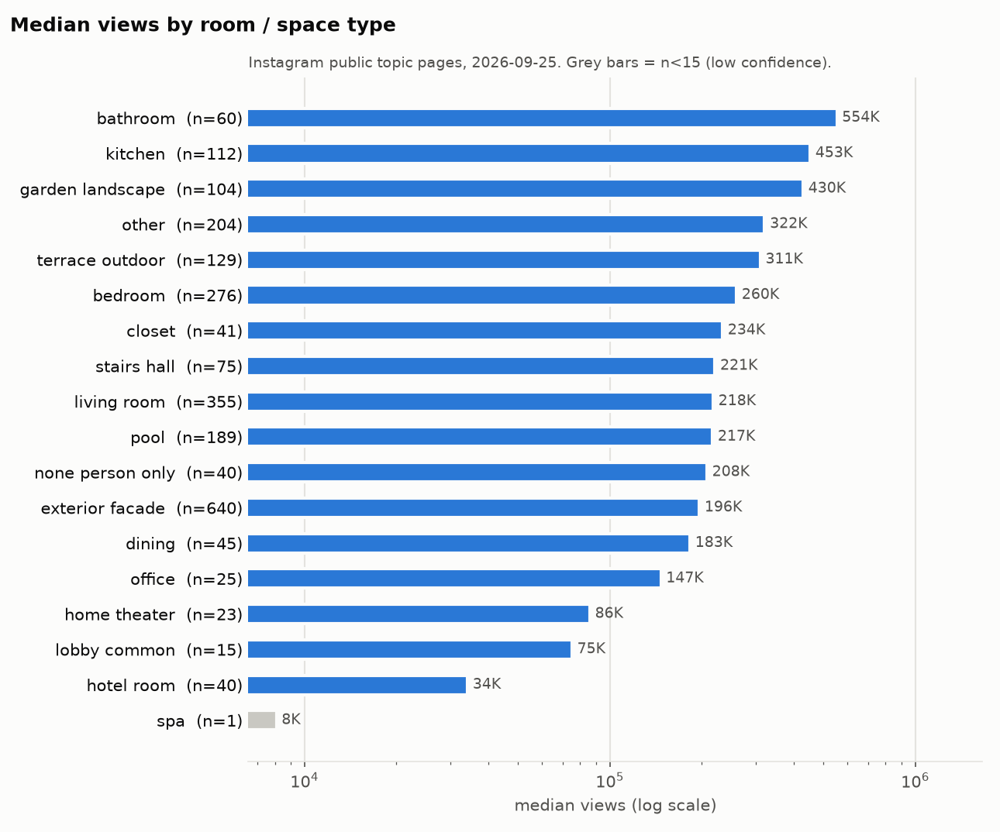


**Lesart**
- Über alle Reels ist der Raum **kein** Performance-Treiber (p = 0,93). Die Spreizung ist **innerhalb KI** größer (dort aber
  ebenfalls nicht signifikant, p = 0,10):
  Die klassischen Interior-Räume (Schlaf-, Wohnzimmer, Küche) liegen bei KI unter Erwartung, bei echten Aufnahmen darüber
  (Schlafzimmer real 1,22 vs. KI 0,77; Küche real 1,15 vs. KI 0,67). Hypothese: Gerade diese Räume sind im KI-Feed am
  stärksten gesättigt (KI-Anteil Schlafzimmer 41 %, Wohnzimmer 35 %), während echte Räume Glaubwürdigkeit/Nachkaufbarkeit bieten.
- **KI-Gewinner** sind Räume mit Architektur- oder Landschaftsdrama: Treppe/Halle, Garten, Bad, Pool als Hauptmotiv.
  Gruppenvergleich KI outdoor/bath/stairs/pool (1,45; n = 136) vs. bedroom/living/kitchen (0,70; n = 264): 2,07×
  (95-%-KI 1,45–3,00; p = 0,0005; [key_contrasts.csv](data/processed/stats/key_contrasts.csv)) – **post-hoc**.
- **Pool nur als Held:** Pool als Hauptraum KI 1,16 (n = 23), Pool irgendwo im Bild (Thema „Pool“, inkl. Deko-Pool vor Villen)
  KI 0,73 (n = 91). Richtung: Der Pool scheint nur zu tragen, wenn er das Motiv ist (kleines n, Hypothese).
- **Innerhalb-Account-Check** (25 Accounts, 172 Reels; Top 10 % vs. untere 50 % desselben Accounts; kleine Stichprobe):
  Schlafzimmer +15,4 Pp., Küche +8,1 Pp., Garten +5,8 Pp. häufiger unter den Top-Reels; Fassade −12,4 Pp., Treppe −7,7 Pp.,
  Wohnzimmer −7,0 Pp. Das **widerspricht** teilweise dem Querschnitt (KI-Schlafzimmer 0,77). Auflösung (Hypothese): Accounts,
  die ohnehin Schlafzimmer posten, haben dort ihre besten Reels; Schlafzimmer-lastige KI-Accounts bleiben aber insgesamt unter
  Erwartung. → Schlafzimmer **nur als Choice-Format** (Pick One), nicht als Kernsäule (deckt sich mit dem Strategy Brief).

### 2.2 Gebäudetyp und Setting/Landschaft

**Gebäudetyp** (alle: [seg_building_type.csv](data/processed/stats/seg_building_type.csv); KI/real selbst berechnet):

| Gebäudetyp | n | Median Views | p90 Views | Views/Follower | adj alle | adj KI (n) | adj real (n) |
|---|---|---|---|---|---|---|---|
| Hotel/Resort | 214 | 158K | 4,05M | 1,25 | 1,05 | 0,47 (8 ⚠) | 1,05 (197) |
| Mansion | 127 | 269K | 5,20M | 1,20 | 0,99 | 0,66 (37) | 1,02 (83) |
| House | 348 | 236K | 3,73M | 2,87 | 0,95 | 0,97 (117) | 0,86 (201) |
| Treehouse | 26 | 2,00M | 5,90M | 9,44 | 0,91 | 0,95 (11 ⚠) | 0,83 (15) |
| Villa | 241 | 152K | 2,70M | 1,45 | 0,91 | 0,85 (89) | 0,93 (120) |
| Cabin/Chalet | 140 | 268K | 2,56M | 2,20 | 0,87 | 0,70 (63) | 1,12 (68) |
| Apartment | 144 | 294K | 4,67M | 2,86 | 0,84 | 0,75 (41) | 0,78 (87) |
| Unusual structure | 193 | 167K | 4,58M | 2,01 | 0,81 | **1,10** (98) | 0,85 (74) |
| Penthouse | 39 | 266K | 6,36M | 2,70 | 0,57 | 0,46 (9 ⚠) | 0,54 (27) |
| Castle/Palace ⚠ | 11 | 34K | 216K | 0,25 | 0,25 | 0,25 (1 ⚠) | 0,27 (10 ⚠) |

**Setting/Landschaft** (alle: [seg_landscape.csv](data/processed/stats/seg_landscape.csv); KI/real selbst berechnet):

| Setting | n | Median Views | p90 Views | adj alle | adj KI (n) | adj real (n) |
|---|---|---|---|---|---|---|
| Space/Sky ⚠ | 12 | 344K | 5,45M | 2,64 | 3,42 (7 ⚠) | 1,36 (1 ⚠) |
| Mountain | 109 | 436K | 4,66M | 1,17 | **1,72** (33) | 1,07 (67) |
| Jungle/Tropical | 92 | 227K | 3,71M | 1,14 | 0,73 (33) | 1,14 (52) |
| Rain window | 25 | 442K | 6,18M | 1,08 | 0,66 (16) | 1,87 (6 ⚠) |
| Lake/River | 60 | 179K | 5,40M | 1,02 | 0,69 (13 ⚠) | 0,96 (42) |
| City skyline | 177 | 281K | 5,08M | 0,98 | 0,77 (49) | 1,07 (113) |
| (kein Setting) | 1.403 | 226K | 3,40M | 0,97 | 0,93 (337) | 0,96 (854) |
| Cliff | 46 | 47K | 3,80M | 0,89 | **0,48** (35) | 3,80 (10 ⚠) |
| Forest | 172 | 300K | 3,08M | 0,84 | 0,58 (63) | 0,92 (89) |
| Ocean/Beach | 165 | 153K | 3,12M | 0,79 | **1,81** (26) | 0,74 (133) |
| Snow | 65 | 147K | 4,24M | 0,66 | 0,70 (45) | 0,62 (19) |
| Desert | 34 | 38K | 926K | 0,52 | 0,68 (22) | 0,42 (6 ⚠) |
| Underwater ⚠ | 14 | 551K | 2,28M | 0,39 | 0,39 (7 ⚠) | 0,38 (7 ⚠) |

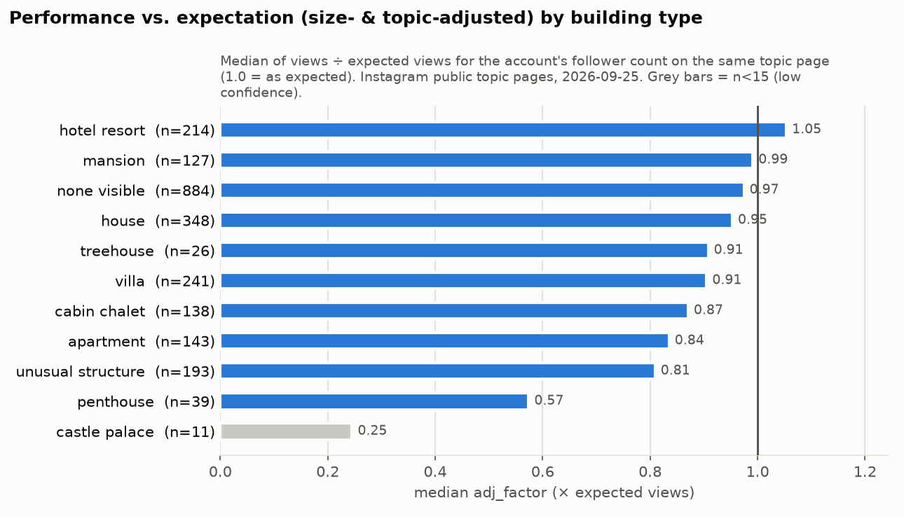


**Lesart**
- Bei KI ist **„unusual structure“** der einzige Gebäudetyp über 1 mit gutem n (1,10; n = 98). Klassische Luxus-Typologien
  (Villa 0,85, Mansion 0,66, Penthouse 0,46 ⚠, Hotel 0,47 ⚠) liegen bei KI unter Erwartung. Das passt zur Richtung „Konzept-Architektur
  statt generischer Luxusimmobilie“, ist aber kein Beleg (Gebäudetyp innerhalb KI p = 0,72, n.s.).
- **Setting-Paradox Klippe:** Die KI-Klippe liegt bei 0,48 (n = 35), 23 davon sind „stylized dreamy“ (Median 0,42). Die Topic-Seite
  `house-on-cliff` ist zu 100 % KI und hat einen Median von nur 226 Views ([Digest, Bottom 20](data/processed/analysis_digest.md)).
  Das Klippenhaus wirkt als KI-Motiv **übernutzt** (Hypothese). Einzelne Ausreißer (Bau-/Prozess-Story, siehe 6.6; n = 1) deuten an:
  Es braucht eine Story oder ein wirklich unmögliches Konzept, nicht die Klippe allein.
- **Setting × Realismus (KI, kleine n, nur Richtung):** Skyline mit Fantasy-Konzept 4,20 (n = 7 ⚠) vs. Skyline realistisch 0,59
  (n = 13 ⚠); Berg realistisch 3,30 (n = 9 ⚠) vs. Berg dreamy 0,89 (n = 22). Das Setting wirkt über das Konzept, nicht allein.

### 2.3 Architektur- und Interior-Stile

Alle Reels aus [Digest „Style“](data/processed/analysis_digest.md) / [seg_style_primary.csv](data/processed/stats/seg_style_primary.csv);
KI- und Real-Spalten selbst berechnet. Sortiert nach adj (alle).

| Stil | n | Median Views | p90 Views | adj alle | ≥2× Erwartung | adj **KI** (n) | adj real (n) | KI-Anteil |
|---|---|---|---|---|---|---|---|---|
| cyberpunk | 15 | 802K | 4,56M | **3,04** | 67 % | 4,89 (5 ⚠) | 3,03 (7 ⚠) | 33 % |
| warm luxury | 34 | 360K | 2,44M | **1,83** | 44 % | **1,85** (15) | 1,20 (12 ⚠) | 44 % |
| neoclassical | 29 | 150K | 2,86M | 1,63 | 45 % | 1,65 (5 ⚠) | 2,88 (15) | 17 % |
| mid-century | 29 | 318K | 1,10M | 1,50 | 24 % | 1,50 (5 ⚠) | 1,59 (20) | 17 % |
| traditional/regional | 111 | 216K | 4,50M | 1,33 | 41 % | 0,95 (23) | 1,35 (82) | 21 % |
| minimalist | 167 | 281K | 5,12M | 1,22 | 43 % | 1,02 (33) | 1,17 (101) | 20 % |
| rustic cozy | 195 | 358K | 5,10M | 1,06 | 34 % | 0,78 (107) | 1,21 (80) | 55 % |
| futuristic | 91 | 185K | 4,40M | 1,04 | 39 % | 1,06 (58) | 1,09 (27) | 64 % |
| biophilic | 30 | 139K | 6,43M | 1,04 | 33 % | 0,64 (15) | 1,14 (14 ⚠) | 50 % |
| tropical | 135 | 180K | 2,76M | 1,00 | 35 % | **1,70** (20) | 0,95 (108) | 15 % |
| Scandinavian | 67 | 216K | 3,42M | 0,98 | 40 % | **0,28** (16) | **1,71** (44) | 24 % |
| industrial | 46 | 314K | 2,20M | 0,85 | 33 % | 0,89 (23) | 0,99 (18) | 50 % |
| brutalist | 17 | 277K | 1,74M | 0,84 | 18 % | 0,77 (12 ⚠) | 0,67 (3 ⚠) | 71 % |
| modern luxury | 567 | 224K | 3,24M | 0,83 | 32 % | 0,79 (128) | 0,81 (353) | 23 % |
| mediterranean | 120 | 171K | 4,05M | 0,80 | 33 % | 0,69 (28) | 0,87 (82) | 23 % |
| organic modern | 182 | 222K | 2,37M | 0,79 | 28 % | 0,57 (56) | 0,84 (100) | 32 % |
| classical luxury | 74 | 196K | 5,04M | 0,79 | 39 % | 0,56 (28) | 1,43 (43) | 38 % |
| glam/feminine | 62 | 690K | 4,63M | 0,78 | 36 % | **1,95** (15) | 0,65 (43) | 24 % |
| japandi | 36 | 59K | 1,15M | 0,77 | 31 % | 0,61 (15) | 0,97 (8 ⚠) | 42 % |
| dark luxury | 66 | 93K | 2,60M | 0,67 | 32 % | 0,64 (31) | 0,47 (24) | 47 % |
| art deco ⚠ | 8 | 160K | 592K | 0,63 | 25 % | 2,72 (3 ⚠) | 0,38 (2 ⚠) | 38 % |
| maximalist ⚠ | 10 | 246K | 1,86M | 0,37 | 30 % | 0,50 (2 ⚠) | 0,25 (7 ⚠) | 20 % |

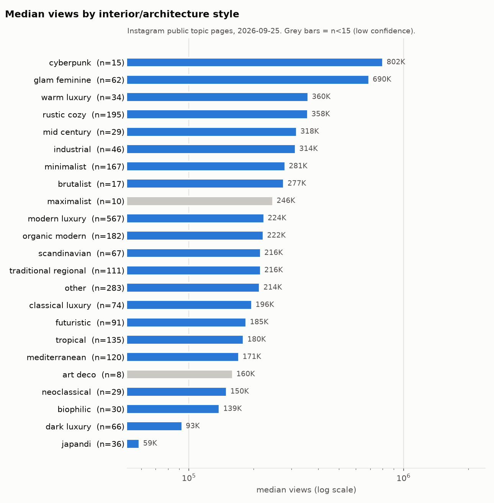
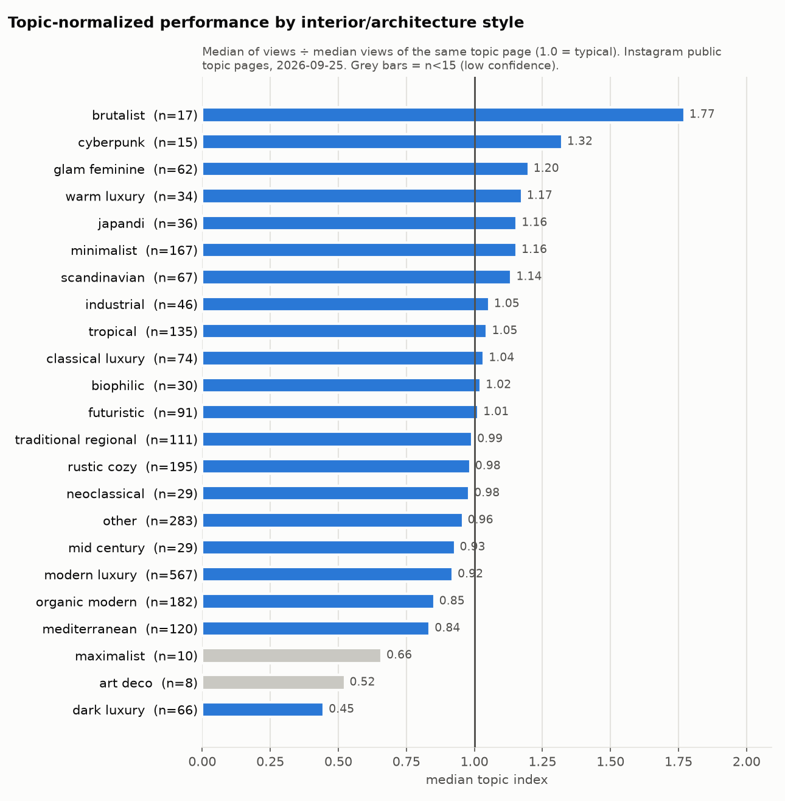
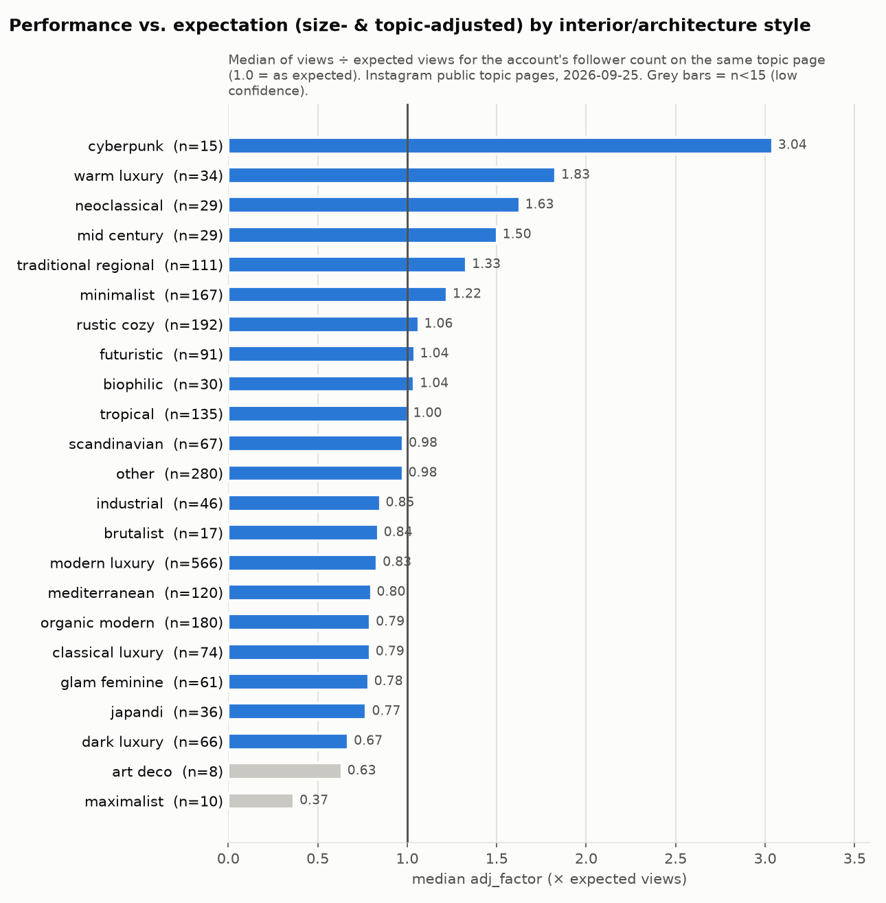

**Wie die drei Charts zusammenpassen:** `views_by_style` zeigt absolute Views (stark von Accountgröße getrieben), `index_by_style`
den Vergleich zum Median derselben Topic-Seite (ohne Größenkontrolle), `adj_by_style` den größenbereinigten Vergleich. Nur der
letzte ist für Stil-Entscheidungen geeignet. Beispiel glam/feminine: hohe Views (690K), aber adj 0,78 über alle Reels, vermutlich weil
dort große Lifestyle-Accounts häufig sind (48 % Lifestyle-Influencer; 34 % der Reels von Accounts ≥ 500K vs. 19 % gesamt). Bei KI-Reels
liegt glam dagegen bei 1,95 (n = 15).

### 2.4 Stil × Produktionsart: Scandi echt stark, als KI schwach (Hypothesen)

Die auffälligsten Umkehrungen (nur Segmente mit n ≥ 15 in **beiden** Spalten):

| Stil | KI adj (n) | real adj (n) | Muster |
|---|---|---|---|
| Scandinavian | 0,28 (16) | 1,71 (44) | real stark, KI sehr schwach |
| classical luxury | 0,56 (28) | 1,43 (43) | real stark, KI schwach |
| rustic cozy | 0,78 (107) | 1,21 (80) | real stark, KI gesättigt |
| organic modern | 0,57 (56) | 0,84 (100) | beide schwach, KI schwächer |
| glam/feminine | 1,95 (15) | 0,65 (43) | KI stark, real schwach |
| tropical | 1,70 (20) | 0,95 (108) | KI stark, real neutral |

**Hypothese (zu testen, nicht bewiesen):** Bei KI gewinnen Stile mit **starker Farbe, Glanz oder Drama** (glam, warm luxury,
tropical, cyberpunk), weil sie sich vom beigen KI-Einheitslook abheben. Ruhige, neutrale Stile (Scandi, japandi, organic modern)
sind bei KI austauschbar, bei echten Häusern dagegen glaubwürdig und nachkaufbar. Im Querschnitt lässt sich das nicht von
Account-Effekten trennen (Theme-Pages posten überdurchschnittlich viel dreamy, siehe Teil 18) → **Stil-A/B im eigenen Account**.

**Innerhalb-Account-Check Stil** (25 Accounts, 172 Reels; Anteil unter Top 10 % minus Anteil unter unteren 50 %):
dark luxury +8,1 Pp., futuristic +5,8 Pp., warm luxury +5,8 Pp.; organic modern −4,1 Pp., biophilic −3,8 Pp., rustic cozy −2,8 Pp.
Richtung passt zu warm luxury/futuristic; dark luxury widerspricht dem Querschnitt (0,67) → offen.

### 2.5 Entscheidungsregeln Teil 5 (Szenen & Stile)

| Element | Datenlage (KI-adj, n) | Rolle bei uns | Regel |
|---|---|---|---|
| Unmögliche Struktur/Konzept-Fassade | unusual structure 1,10 (98); fantasy 2,27 (53) | **Kern P1** | Jede P1-Folge braucht ein Architektur-Merkmal, das es real nicht gibt. Die Klippe allein reicht nicht. |
| Treppe/Halle als Hero-Shot | 2,24 (16) | Kern P1/P3 | In jeder zweiten P1-Folge ein Treppen- oder Hallen-Reveal testen (kleines n → Testvariable). |
| Garten/Landschaft | 1,61 (43) | Kern P3 („From Nothing“) | Transformation leer → Garten; Garten als Endbild. |
| Bad | 1,45 (28) | Kern P2/P3 (Commerce) | Statement-Bad mit kaufbaren Armaturen/Wannen; realistisch rendern. |
| Pool | 1,16 als Hauptmotiv (23); 0,73 als Nebenelement (91) | P1/P3 | Pool nur als Motiv, nie als Deko vor einer Villa. |
| Terrasse | 1,06 (26) | P3 | Outdoor-Möbel-Brücke (bewusst kaufbar stagen, s. 5.2). |
| Berg/Alpin, Meer/Strand | 1,72 (33) / 1,81 (26) | bevorzugte Settings | Settings für P1/P4; Location nie als Hook. |
| Schlaf-, Wohnzimmer | 0,77 (110) / 0,69 (123) | nur P2 „Pick One“ | Nur als Choice-Varianten, nie als Einzel-Showcase. |
| Küche, Ess-, Heimkino | 0,67 (31) / 0,56 (7 ⚠) / 0,32 (1 ⚠) | meiden | Kein Kernformat; höchstens in Pick One. Ess-/Heimkino: KI-n zu klein für ein Urteil (Heimkino real 1,01; n = 19). |
| Stile warm luxury, glam, tropical, futuristic | 1,85 / 1,95 / 1,70 / 1,06 | Hauptstile | Rotieren; futuristic für Hüllen, warm luxury/glam für Innenräume. |
| Stile modern luxury, organic modern, Scandi, japandi | 0,79 / 0,57 / 0,28 / 0,61 | vermeiden als Look | Nur als Kontrastvariante in Pick One. |

---

## 3. Teil 6 – Farben & Materialien (inkl. „warmes Holz/Stein vs. steriles Weiß“)

### 3.1 Farbtemperatur

| Farbtemperatur | n alle | Median Views | p90 Views | adj alle | Likes/View | Komm./10k | adj KI (n) | adj real (n) |
|---|---|---|---|---|---|---|---|---|
| cool | 565 | 247K | 4,10M | 0,96 | 4,3 % | 4,4 | 0,96 (162) | 0,93 (355) |
| neutral | 750 | 242K | 3,92M | 0,93 | 2,6 % | 3,6 | 1,00 (146) | 0,80 (497) |
| warm | 1.059 | 216K | 3,50M | 0,92 | 3,0 % | 2,9 | **0,75** (378) | **1,10** (547) |

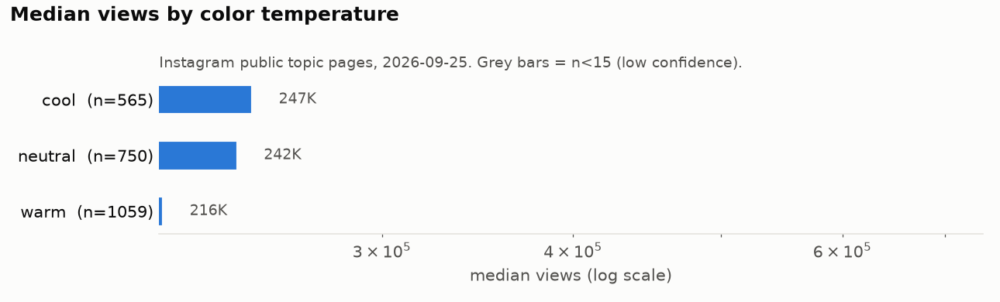
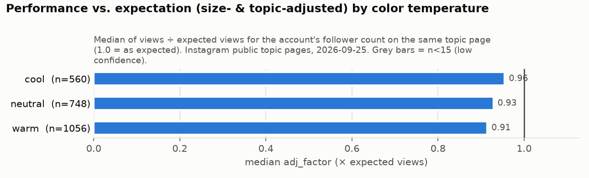

- **Über alle Reels kein Effekt:** cool vs. warm 1,04× (95-%-KI 0,84–1,23; p = 0,74; [key_contrasts](data/processed/stats/key_contrasts.csv)).
- **Aber gegenläufig nach Produktion (explorativ):** Echte Aufnahmen warm vs. kühl/neutral 1,29× (95-%-KI 0,99–1,62; p = 0,007;
  Kruskal real p = 0,027 → nominal, nicht Bonferroni-fest). KI-Reels warm vs. kühl/neutral 0,77× (95-%-KI 0,54–0,98; p = 0,11; n.s.).
  Die Effekte heben sich im Gesamtdatensatz auf.
- Warum KI-warm schwächer aussieht: 41 % der warmen KI-Reels sind „stylized dreamy“, bei kühlen sind es 61 %, bei neutralen 35 %.
  Innerhalb dreamy: warm 0,51 (n = 155) vs. kühl 0,89 (n = 99). Innerhalb aspirational-realistisch: warm 0,88 (n = 206),
  neutral 1,12 (n = 89), kühl 0,81 (n = 33). → Kein stabiles Farbtemperatur-Muster, eher ein **„warm-dreamy-cozy“-Sättigungseffekt**.
- Innerhalb Accounts: neutral +2,6 Pp., warm +1,5 Pp., cool −4,2 Pp. unter den Top 10 % (klein, kein klares Signal).

### 3.2 Helligkeit & Licht

| Helligkeit | n | Median Views | adj alle | Likes/View | adj KI (n) | adj real (n) |
|---|---|---|---|---|---|---|
| medium | 1.047 | 258K | 1,00 | 3,3 % | 0,98 (359) | 1,06 (553) |
| dark | 264 | 254K | 0,89 | 5,7 % | 0,73 (103) | 0,97 (116) |
| bright | 1.063 | 205K | 0,89 | 2,7 % | 0,82 (224) | 0,91 (730) |

| Licht | n | Median Views | p90 Views | adj alle | ≥2× Erwartung | adj **KI** (n) | adj real (n) |
|---|---|---|---|---|---|---|---|
| night/artificial | 388 | 312K | 4,63M | **1,14** | 41 % | **1,27** (93) | 1,10 (233) |
| blue hour | 219 | 292K | 4,56M | 0,98 | 36 % | 0,89 (101) | 1,08 (102) |
| golden hour | 186 | 198K | 2,45M | 0,95 | 33 % | 0,82 (84) | 1,07 (94) |
| daylight | 841 | 210K | 3,60M | 0,94 | 34 % | 0,90 (143) | 0,93 (628) |
| overcast/rain | 190 | 398K | 6,78M | 0,90 | 36 % | 0,70 (65) | 1,04 (89) |
| mixed | 530 | 193K | 2,70M | 0,82 | 31 % | 0,77 (186) | 0,77 (247) |
| candle/fire | 20 | 128K | 1,96M | 0,56 | 20 % | 0,32 (14 ⚠) | 1,15 (6 ⚠) |

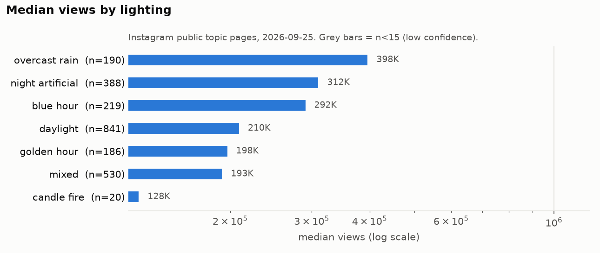


- **Nachtlicht ist die konsistenteste Licht-Richtung:** alle 1,14 (n = 387), KI 1,27 (n = 93), real 1,10 (n = 233); innerhalb Accounts
  +12,2 Pp. unter den Top 10 %. Kontrast Nacht vs. Tag 1,21× ist aber **nicht signifikant** (95-%-KI 0,94–1,59; p = 0,12).
- **„Mixed“ ist in beiden Welten schwach** (0,77/0,77): diffuses Mischlicht ohne klare Lichtidee.
- **Nacht ≠ dunkel:** Dunkle KI-Bilder 0,73 (n = 103), Kerzen/Feuer bei KI 0,32 (n = 14 ⚠), innerhalb Accounts aber „dark“ +7,9 Pp.
  Regel: Nachtszenen **hell ausgeleuchtet** mit sichtbaren Lichtquellen (Leuchten, Stadtlichter, beleuchteter Pool), keine
  Kerzen-Düsternis.

### 3.3 Materialien

Mehrfachnennung möglich. Alle aus [seg_materials.csv](data/processed/stats/seg_materials.csv); KI/real selbst berechnet.

| Material | n alle | Median Views | p90 Views | adj alle | adj KI (n) | adj real (n) | Innerhalb Accounts (Top 10 % − untere 50 %) |
|---|---|---|---|---|---|---|---|
| rattan | 132 | 218K | 2,09M | 1,02 | 1,07 (38) | 1,16 (78) | +2,3 Pp. |
| natural stone | 740 | 236K | 4,10M | 1,00 | 0,89 (267) | 1,05 (392) | −9,2 Pp. |
| marble | 325 | 250K | 2,70M | 0,98 | **1,18** (101) | 0,77 (152) | +6,8 Pp. |
| metal | 1.252 | 264K | 3,50M | 0,95 | 0,83 (342) | 1,00 (750) | +4,5 Pp. |
| wood | 1.438 | 220K | 3,60M | 0,93 | 0,80 (439) | 1,02 (805) | −3,8 Pp. |
| concrete | 389 | 224K | 2,52M | 0,93 | 0,83 (140) | 1,00 (198) | −8,8 Pp. |
| fabric | 1.176 | 224K | 3,30M | 0,93 | 0,75 (352) | 1,01 (667) | +1,3 Pp. |
| plants | 1.406 | 226K | 3,70M | 0,93 | 0,82 (502) | 0,94 (732) | −13,7 Pp. |
| plaster | 425 | 178K | 3,56M | 0,91 | 0,71 (114) | 0,93 (235) | −0,8 Pp. |
| glass | 1.551 | 232K | 3,50M | 0,88 | 0,74 (504) | 0,89 (854) | −3,0 Pp. |
| fire | 171 | 301K | 5,10M | 0,86 | 0,71 (97) | 0,91 (60) | −11,8 Pp. |
| water | 610 | 188K | 3,91M | 0,86 | 0,80 (177) | 0,91 (388) | −15,8 Pp. |
| leather | 111 | 147K | 3,70M | 0,73 | 0,69 (42) | 0,73 (61) | −2,8 Pp. |

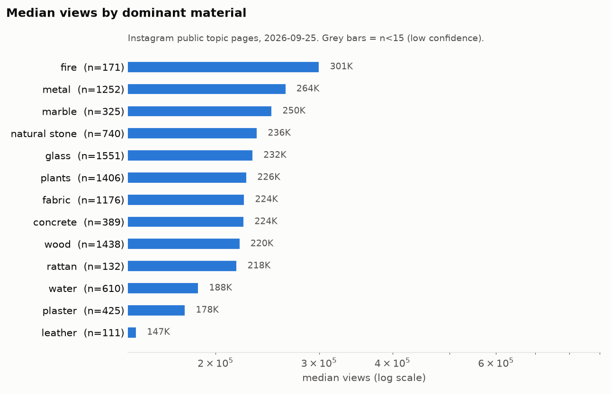
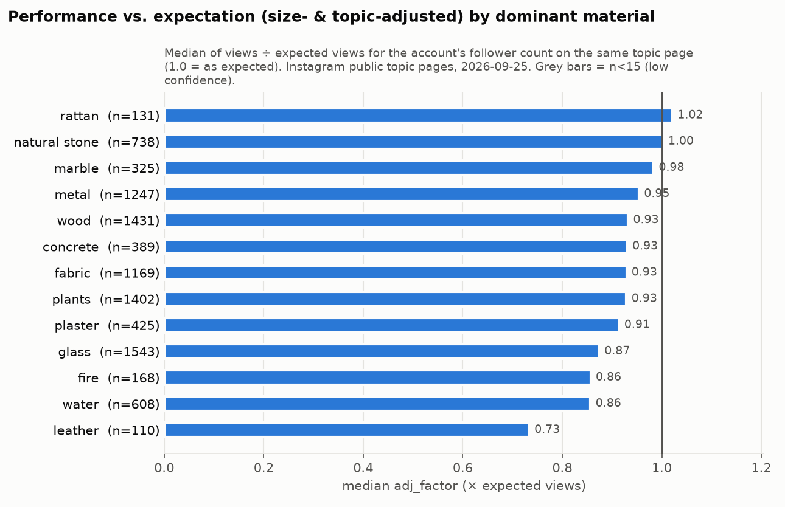

- Die Spanne über alle Reels ist schmal (0,73–1,02). **Material ist kein Hebel.** Auffällig nur: Marmor bei KI 1,18 (n = 101) vs. real 0,77;
  Leder in beiden Welten unten.
- Wasser, Pflanzen und Feuer sind innerhalb Accounts seltener unter den Top-Reels (−16/−14/−12 Pp.). Das passt zum Befund, dass
  Deko-Pool, Fensterblick (0,70×; p = 0,02, nur nominal signifikant, nicht Bonferroni-fest) und Kaminromantik übernutzt sind.
  **Hypothese, kein Beweis.**

### 3.4 Dominante Farben und Ambience-Effekte

**Dominante Farben** (Mehrfachnennung; nur Farben mit n ≥ 15; [seg_dominant_colors.csv](data/processed/stats/seg_dominant_colors.csv)).
Einträge wie magenta 17,8 (n = 2) oder sage green 6,31 (n = 3) sind Einzelfälle und **nicht verwertbar**.

| Farbe | n | adj alle | adj KI (n) | Farbe | n | adj alle | adj KI (n) |
|---|---|---|---|---|---|---|---|
| silver | 15 | 1,95 | – | pink | 194 | 0,92 | 0,87 (47) |
| orange | 305 | 1,10 | 0,76 (124) | green | 967 | 0,88 | 0,86 (307) |
| yellow | 102 | 1,06 | 1,55 (16) | terracotta | 77 | 0,86 | 0,94 (30) |
| navy | 23 | 1,00 | – | turquoise | 100 | 0,86 | – |
| grey | 1.182 | 1,00 | 0,82 (327) | cream | 78 | 0,85 | 0,69 (39) |
| blue | 862 | 0,99 | 0,94 (221) | red | 122 | 0,85 | 0,84 (26) |
| brown | 1.103 | 0,98 | 0,78 (364) | black | 896 | 0,84 | 0,78 (246) |
| gold | 332 | 0,94 | 0,89 (126) | purple | 75 | 0,82 | 0,90 (24) |
| white | 1.649 | 0,93 | 0,92 (409) | teal | 61 | 0,76 | 1,00 (20) |
| beige | 1.099 | 0,93 | 0,89 (319) | | | | |

Kein Farbton trennt die Reels klar; die großen Farbgruppen liegen alle zwischen 0,84 und 1,10. Farbe ist eine **Marken-** und keine
Reichweitenentscheidung.

**Ambience-Effekte** ([seg_ambience_fx.csv](data/processed/stats/seg_ambience_fx.csv)):

| Effekt | n | Median Views | adj alle | adj KI (n) | Innerhalb Accounts |
|---|---|---|---|---|---|
| city lights | 125 | 313K | **1,09** | 0,96 (53) | **+12,8 Pp.** |
| stars | 41 | 188K | 0,96 | – | +4,5 Pp. |
| fog | 110 | 344K | 0,95 | 0,73 (68) | +3,0 Pp. |
| fireplace | 109 | 262K | 0,74 | 0,67 (70) | −7,9 Pp. |
| rain | 85 | 403K | 0,70 | 0,63 (49) | +2,0 Pp. |
| snow | 72 | 159K | 0,68 | 0,70 (51) | −10,3 Pp. |
| ocean waves | 40 | 73K | 0,48 | 0,41 (20) | −2,6 Pp. |

Die Cozy-Effekte Regen, Schnee und Kamin liegen unter Erwartung, obwohl Rain-Reels sehr hohe Views/Follower haben (5,41;
Thema „Rain Window“). Das Muster passt zur Decay-Evidenz bei KI-Cozy-Accounts im Strategy Brief: große Einzelhits, aber
Sättigung.

### 3.5 Beispielfrage: „Funktionieren warme Holz-/Steinwelten besser als sterile weiße Räume?“

**Operationalisierung** (explorativ, post-hoc festgelegt – siehe Einschränkungen unten; Codes ESTIMATED):
- **Warm-natürlich:** `palette_temp = warm` **und** Material enthält `wood` oder `natural_stone`.
- **Steril-weiß (streng):** Weiß unter den dominanten Farben **und** Farbtemperatur kühl/neutral **und** Helligkeit „bright“ **und**
  weder Holz noch Naturstein.
- Metrik adj_factor; Median-Verhältnis mit 95-%-Bootstrap-KI (5.000 Ziehungen, Seed 42) und Mann-Whitney-p.

| Vergleich | warm-natürlich: n / Median adj | Gegengruppe: n / Median adj | Verhältnis | 95-%-KI | p |
|---|---|---|---|---|---|
| **Alle Reels:** warm-natürlich vs. steril-weiß | 851 / 0,89 | 166 / 0,75 | 1,19× | 0,89–1,66 | 0,089 |
| **Echte Aufnahmen:** warm-natürlich vs. steril-weiß | 418 / 1,11 | 122 / 0,61 | **1,83×** | **1,09–2,94** | **0,002** |
| **KI-Reels:** warm-natürlich vs. steril-weiß | 320 / 0,72 | 27 / 0,78 | 0,91× | 0,37–1,98 | 0,83 |
| KI-Reels: warm-natürlich vs. alle übrigen KI | 320 / 0,72 | 366 / 1,00 | 0,72× | 0,48–0,91 | 0,026 |
| KI dreamy: warm-natürlich vs. übrige dreamy | 124 / 0,47 | 181 / 0,93 | 0,51× | 0,34–0,91 | 0,021 |
| KI aspirational-realistisch: warm-natürlich vs. übrige | 187 / 0,87 | 141 / 1,00 | 0,88× | 0,59–1,44 | 0,99 |

Nebenwerte (alle Reels): Likes/View warm-natürlich 3,0 % vs. steril-weiß 3,1 %; Anteil „high“ Shoppability **32 % vs. 20 %**;
Reels mit Holz 28 % „high“ vs. ohne Holz 13 %.

Weitere geprüfte Varianten (Median-Verhältnis, Mann-Whitney-p; alle / KI / echte Aufnahmen):
lockere Weiß-Definition (Holz/Stein erlaubt) 1,05× (p = 0,59) / 0,77× (p = 0,17) / **1,43× (p = 0,016)** ·
Holz vs. ohne Holz 1,00× (p = 0,46) / 0,80× (p = 0,33) / 1,14× (p = 0,10) ·
Naturstein vs. ohne 1,13× (p = 0,10) / 1,08× (p = 0,997) / 1,17× (p = 0,15) ·
weiß + hell vs. Rest 0,85× (p = 0,29) / 0,95× (p = 0,56) / 0,80× (p = 0,29).
Das Muster ist in allen Varianten gleich: Nur bei echten Aufnahmen gibt es einen Vorteil für warm-natürlich; einzelne Materialien
allein trennen nicht.

**Antwort**
- **Echte Aufnahmen: ja, tendenziell deutlich.** Warm-natürliche Räume liegen bei 1,83× gegenüber steril-weißen. Einschränkungen:
  Die Definition ist post-hoc gewählt, und in der explorativen Auswertung liefen 18 Vergleiche (6 Definitionen × 3 Teilmengen; Bonferroni-Schwelle ≈ 0,0028;
  p = 0,002 liegt knapp darunter), und Account-Typen sind ungleich verteilt (Lifestyle-Influencer 40 % der warm-natürlichen vs.
  33 % der steril-weißen Real-Reels).
- **KI-Reels: nein.** Kein Unterschied zu steril-weiß (n = 27 ist klein). Warm-natürliche KI-Bilder liegen sogar unter den übrigen
  KI-Reels, und das kommt fast vollständig aus der Kombination **warm + dreamy** (0,47; n = 124). Bei realistisch gerenderten
  KI-Räumen gibt es keinen Unterschied (p = 0,99).
- **Konsequenz für uns:** Wir behalten die warm-neutrale Palette (Travertin, Sand, Walnuss, Bronze/Messing) aus dem Strategy Brief,
  weil sie **kaufbar** ist (32 % vs. 20 % „high“) und zum Nachfragetrend passt (Houzz Fall 2026: „Warmth Is the New Baseline“,
  „Natural Materials Get More Expressive“; Houzz-Suchen „sandstone“ +257 %, „Venetian plaster“ +94 %, „chocolate brown“ +153 %;
  die Suchwerte stammen aus dem Houzz-Report „Emerging Summer Trends 2026“, US-Suchen Jan–Mär 2026 vs. 2025;
  alle [VERIFIED] in [q04](quellen/q04_interior_trends_demand.md)). Reichweite erwarten wir davon **nicht**. Warmes Material nie
  mit weichem Dreamy-Filter kombinieren, sondern mit klarem Nachtlicht und scharfem, realistischem Rendering.

### 3.6 Regeln Farbe & Material (Checkliste)

- [ ] Palette warm-neutral als **Markenkonstante** (Wiedererkennung, Kaufbarkeit), dazu ein **kontrastierender Signaturton**
  (Nachtblau/Blue Hour). Die Farbtemperatur selbst ist kein Hebel (1,04×, n.s.).
- [ ] **Kein Dreamy-Weichzeichner** auf warmen Innenräumen (KI warm + dreamy 0,47; n = 124).
- [ ] Nachtszenen hell und mit sichtbaren Lichtquellen; kein Kerzen-/Kamin-Dunkel (KI candle 0,32 ⚠; fireplace 0,67).
- [ ] Marmor, Stein, Messing als kaufbare Hero-Materialien in Bad und warm-luxury-Räumen (KI marble 1,18; n = 101).
- [ ] Deko-Wasser, Pflanzenwände, Kamin **nicht** als Standard-Füllmaterial (innerhalb Accounts −12 bis −16 Pp.; Hypothese).
- [ ] „Mixed light“ vermeiden: pro Reel **eine** Lichtidee (Nacht, Blue Hour oder klares Tageslicht).

---

## 4. Teil 16 – Themenperformance-Rankings

### 4.1 Themen-Ranking auf Reel-Ebene (alle Reels)

Quelle: [themes.csv](data/processed/stats/themes.csv) / [Digest Abschnitt 4](data/processed/analysis_digest.md). Ein Reel kann mehreren
Themen angehören (Definition in `scripts/analyze.py → theme_flags`: Raum, Gebäudetyp, Landschaft, Cover-Elemente). KI/real-Spalten
selbst berechnet. Da sich Themen überlappen, gibt es **keinen** Gesamt-Signifikanztest. Einzelwerte sind Richtungen.
Die vom Nutzer angefragten Themen sind **fett**.

| # | Thema | n | Median Views | p90 (Top 10 %) | Views/Follower | ≥5× Follower | adj alle | adj KI (n) | adj real (n) | Komm./10k |
|---|---|---|---|---|---|---|---|---|---|---|
| 1 | **Bathroom** | 61 | 542K | 2,30M | 3,24 | 41 % | **1,41** | 1,44 (29) | 1,05 (23) | 1,4 |
| 2 | Jungle/Tropical | 92 | 227K | 3,71M | 3,17 | 39 % | 1,14 | 0,73 (33) | 1,14 (52) | 3,4 |
| 3 | **Hotel/Resort** | 222 | 152K | 3,69M | 1,25 | 30 % | 1,05 | 0,58 (9 ⚠) | 1,05 (201) | 3,7 |
| 4 | **Mountain Home** (Berg + Schnee) | 174 | 274K | 4,40M | 1,95 | 36 % | 1,03 | 1,15 (78) | 1,03 (86) | 3,7 |
| 5 | Lake/River | 60 | 179K | 5,40M | 1,81 | 33 % | 1,02 | 0,69 (13 ⚠) | 0,96 (42) | 4,7 |
| 6 | **Mansion** | 127 | 269K | 5,20M | 1,20 | 26 % | 0,99 | 0,66 (37) | 1,02 (83) | 4,9 |
| 7 | City Skyline | 177 | 281K | 5,08M | 2,73 | 40 % | 0,98 | 0,77 (49) | 1,07 (113) | 3,8 |
| 8 | Home Theater/Office/Library | 48 | 109K | 3,04M | 2,38 | 42 % | 0,97 | 0,61 (6 ⚠) | 1,05 (36) | 3,5 |
| 9 | **Kitchen** | 112 | 453K | 3,49M | 3,89 | 44 % | 0,96 | 0,67 (31) | 1,15 (69) | 2,9 |
| 10 | Exterior/Facade | 640 | 196K | 3,83M | 1,73 | 34 % | 0,93 | 0,82 (233) | 1,08 (341) | 4,2 |
| 11 | **Outdoor/Terrace/Garden** | 233 | 341K | 4,98M | 2,57 | 41 % | 0,93 | **1,36** (69) | 0,84 (150) | 3,0 |
| 12 | Topic: AI pages | 154 | 204K | 5,40M | 2,70 | 38 % | 0,92 | 0,89 (124) | 0,47 (12 ⚠) | 6,0 |
| 13 | Treehouse | 26 | 2,00M | 5,90M | 9,44 | 58 % | 0,91 | 0,95 (11 ⚠) | 0,83 (15) | 2,6 |
| 14 | **Villa** | 241 | 152K | 2,70M | 1,45 | 30 % | 0,91 | 0,85 (89) | 0,93 (120) | 3,9 |
| 15 | **Bedroom** | 276 | 260K | 4,55M | 2,96 | 41 % | 0,90 | 0,77 (110) | 1,22 (123) | 2,3 |
| 16 | Cliff | 46 | 47K | 3,80M | 1,39 | 30 % | 0,89 | 0,48 (35) | 3,80 (10 ⚠) | 5,0 |
| 17 | Cabin/Chalet | 140 | 268K | 2,56M | 2,20 | 34 % | 0,87 | 0,70 (63) | 1,12 (68) | 3,9 |
| 18 | Forest Home | 172 | 300K | 3,08M | 1,83 | 29 % | 0,84 | 0,58 (63) | 0,92 (89) | 3,7 |
| 19 | Apartment | 144 | 294K | 4,67M | 2,86 | 44 % | 0,84 | 0,75 (41) | 0,78 (87) | 2,3 |
| 20 | **Pool** (irgendwo im Bild) | 357 | 167K | 2,94M | 1,25 | 26 % | 0,83 | 0,73 (91) | 0,85 (239) | 3,9 |
| 21 | Unusual Structure | 193 | 167K | 4,58M | 2,01 | 35 % | 0,81 | **1,10** (98) | 0,85 (74) | 4,4 |
| 22 | **Living Room** | 355 | 218K | 2,30M | 2,52 | 36 % | 0,80 | 0,69 (123) | 0,78 (177) | 3,3 |
| 23 | **Ocean/Beach Home** | 165 | 153K | 3,12M | 1,20 | 30 % | 0,79 | **1,81** (26) | 0,74 (133) | 4,4 |
| 24 | Closet | 41 | 234K | 3,70M | 2,90 | 42 % | 0,77 | – (0) | 0,60 (34) | 2,4 |
| 25 | Rain Window | 85 | 403K | 7,02M | 5,41 | 49 % | 0,70 | 0,63 (49) | 0,63 (24) | 3,4 |
| 26 | Dining | 45 | 183K | 1,46M | 1,26 | 24 % | 0,69 | 0,56 (7 ⚠) | 0,73 (30) | 4,2 |
| 27 | **Penthouse** | 39 | 266K | 6,36M | 2,70 | 41 % | 0,57 | 0,46 (9 ⚠) | 0,54 (27) | 4,2 |
| 28 | **Desert Home** | 34 | 38K | 926K | 0,60 | 29 % | 0,52 | 0,68 (22) | 0,42 (6 ⚠) | 5,0 |
| 29 | Underwater ⚠ | 14 | 551K | 2,28M | 0,16 | 7 % | 0,39 | 0,39 (7 ⚠) | 0,38 (7 ⚠) | 4,2 |
| 30 | Castle/Palace ⚠ | 11 | 34K | 216K | 0,25 | 18 % | 0,25 | 0,25 (1 ⚠) | 0,27 (10 ⚠) | 6,0 |

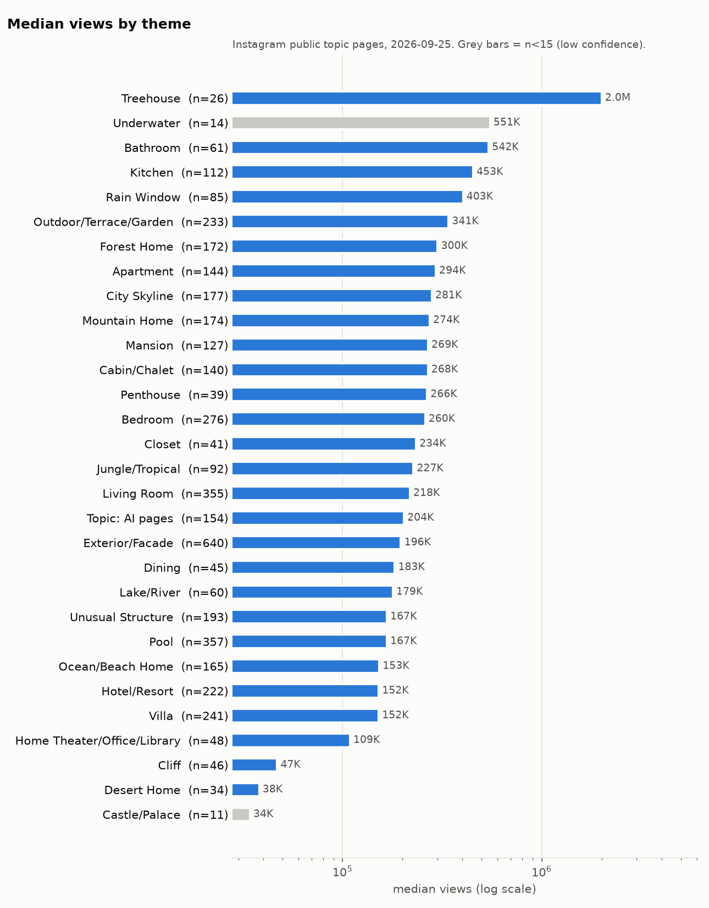
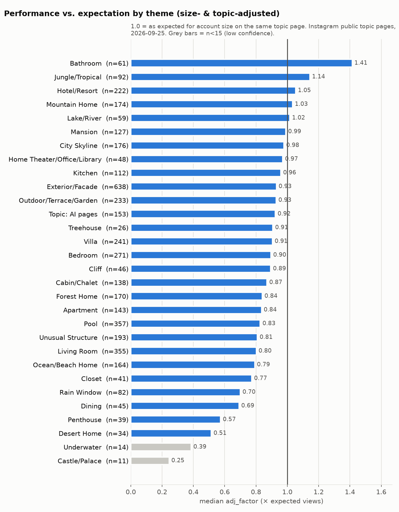

**Lesart nach Metrik** (warum „bestes Thema“ von der Metrik abhängt):
- **Nach Median Views:** Treehouse (2,00M), Underwater (551K ⚠), Bathroom (542K), Kitchen (453K), Rain Window (403K). Diese Werte
  spiegeln zum Teil große Accounts auf diesen Seiten wider.
- **Nach Top 10 % (p90):** Rain Window (7,02M), Penthouse (6,36M), Treehouse (5,90M), Lake/River (5,40M). Penthouse hat also große
  Einzelhits bei **unterdurchschnittlichem** adj (0,57): Die hohen p90-Werte sind keine realistische Erwartung für einen Start.
- **Nach Views/Follower:** Treehouse (9,44), Rain Window (5,41), Kitchen (3,89), Bathroom (3,24): Hier holen kleine Accounts viel
  über ihre Basis hinaus. Vorsicht, vpf ist bei kleinen Accounts mechanisch höher.
- **Nach adj (Hauptmetrik):** Bathroom vorn, Penthouse, Desert, Underwater, Castle hinten.
- **Für KI-Reels** ändert sich die Reihenfolge deutlich: Ocean/Beach 1,81, Bathroom 1,44, Outdoor 1,36, Mountain 1,15, Unusual 1,10
  oben; Penthouse 0,46 ⚠, Cliff 0,48, Forest 0,58, Hotel 0,58 ⚠, Rain 0,63, Mansion 0,66, Kitchen 0,67 unten.

### 4.2 Locations: Dubai, Monaco, Bali, Maldives, Schweiz, New York, Tokyo und weitere

Quelle: [seg_location_any.csv](data/processed/stats/seg_location_any.csv) (Location aus Caption oder Topic-Slug, regelbasiert).
Kruskal-Wallis p = 0,95 → **kein signifikanter Unterschied**. KI-Anteil und KI-adj selbst berechnet.

| Location | n | Median Views | p90 (Top 10 %) | Views/Follower | ≥5× Follower | adj alle | KI-Anteil | adj KI (n) | Komm./10k | häufigster Accounttyp |
|---|---|---|---|---|---|---|---|---|---|---|
| India | 48 | 294K | 2,87M | 5,69 | 52 % | **1,95** | 23 % | 0,96 (11 ⚠) | 2,1 | designer_studio |
| **Switzerland** | 17 | 1,20M | 23,64M | 1,85 | 19 % | **1,84** | 12 % | 1,22 (2 ⚠) | 3,3 | lifestyle_influencer |
| Mexico/Tulum | 15 | 1,00M | 3,60M | 9,22 | 67 % | 1,24 | 0 % | – | 3,7 | real_estate |
| **Tokyo/Japan** | 15 | 276K | 1,74M | 4,68 | 47 % | 1,19 | 0 % | – | 3,4 | real_estate |
| **Bali/Indonesia** | 54 | 176K | 1,94M | 2,17 | 37 % | 1,11 | 13 % | 2,25 (7 ⚠) | 4,2 | real_estate |
| **Dubai/UAE** | 99 | 373K | 4,82M | 3,71 | 43 % | 1,10 | 11 % | 2,29 (11 ⚠) | 3,4 | real_estate |
| Lake Como/Italy | 52 | 498K | 11,93M | 1,10 | 27 % | 1,07 | 10 % | 2,71 (5 ⚠) | 3,4 | lifestyle_influencer |
| Los Angeles/California | 59 | 96K | 870K | 0,80 | 21 % | 0,98 | 10 % | 1,14 (6 ⚠) | 6,3 | real_estate |
| Miami/Florida | 33 | 203K | 2,78M | 1,33 | 19 % | 0,96 | 12 % | 0,53 (4 ⚠) | 5,1 | real_estate |
| Saudi/Qatar/Gulf | 20 | 223K | 1,43M | 1,82 | 30 % | 0,94 | 30 % | 0,20 (6 ⚠) | 5,1 | lifestyle_influencer |
| **New York** | 17 | 1,00M | 25,30M | 3,88 | 47 % | 0,92 | 12 % | 3,40 (2 ⚠) | 3,7 | real_estate |
| Santorini/Mykonos/Greece | 22 | 451K | 2,35M | 2,27 | 45 % | 0,90 | 9 % | 1,37 (2 ⚠) | 4,0 | lifestyle_influencer |
| Ibiza/Spain | 41 | 22K | 920K | 0,52 | 7 % | 0,85 | 10 % | 0,31 (4 ⚠) | 4,1 | real_estate |
| **Maldives** | 37 | 389K | 7,70M | 1,47 | 38 % | 0,81 | 5 % | 1,68 (2 ⚠) | 2,7 | lifestyle_influencer |
| **Monaco** ⚠ | 10 | 1,40M | 5,59M | 8,58 | 80 % | 0,80 | 0 % | – | 1,2 | lifestyle_influencer |
| Morocco ⚠ | 14 | 66K | 2,05M | 0,95 | 14 % | 0,68 | 0 % | – | 4,8 | lifestyle_influencer |
| London/UK | 26 | 117K | 936K | 1,20 | 27 % | 0,58 | 8 % | 3,02 (2 ⚠) | 4,4 | lifestyle_influencer |
| Nordics/Iceland/Faroe | 23 | 197K | 3,16M | 0,74 | 30 % | 0,52 | 13 % | 0,37 (3 ⚠) | 4,6 | lifestyle_influencer |

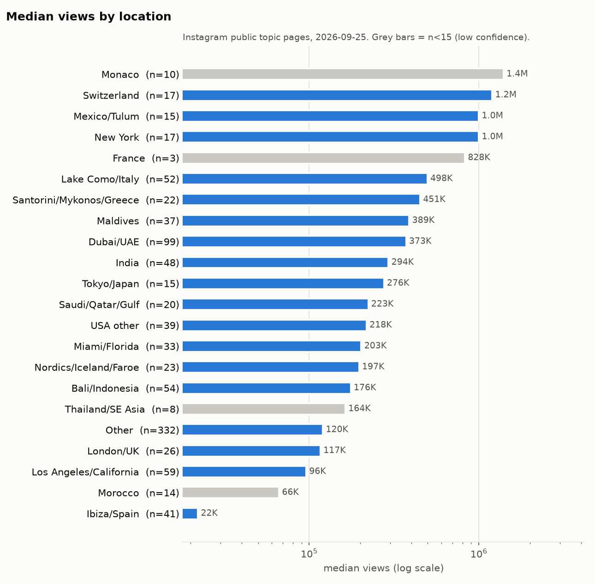
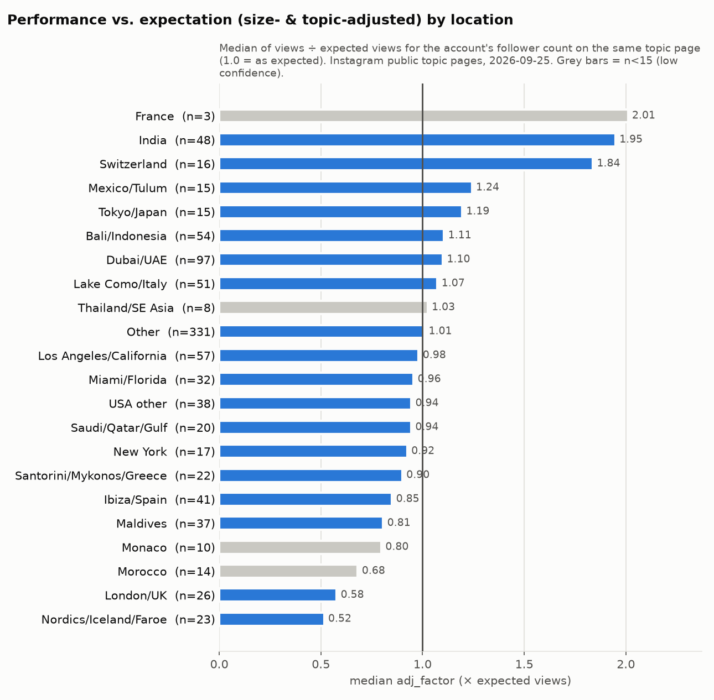

**Lesart**
- Location-Reels sind **fast nur echte Aufnahmen** (KI-Anteil 0–30 %) von Makler-, Hotel- und Travel-Accounts. Für einen KI-Account
  ist die Übertragbarkeit gering. Alle KI-Werte je Location haben n < 15.
- **Schweiz** (1,84; n = 17) und **Tokyo** (1,19; n = 15) sind die interessantesten „Setting-Kandidaten“, liegen aber knapp an der
  Konfidenzgrenze. **Dubai** (1,10; n = 99) ist das größte Location-Segment und liegt nur leicht über Erwartung.
- **Monaco und New York** haben hohe Median Views (1,40M ⚠ / 1,00M), aber adj unter 1: Dort posten große Accounts.
- Eine reine Location-Caption als Hook liegt bei 0,63 (n = 161; Kontrast 0,66×, n.s.) → siehe [07_hooks.md](07_hooks.md).
- **Recht:** „This $50M home in Dubai“ über ein fiktives KI-Objekt ist der Kernfall irreführender Werbung
  ([q07](quellen/q07_legal_ai_risk.md): UWG/UCPD `[ESTIMATED Anwendung]`). Fiktive Häuser **nie** mit realer Adresse oder realem Preis
  als Tatsache verknüpfen; Formulierungen wie „concept“, „imagined in …“.

### 4.3 Topic-Seiten-Ebene: Wie groß sind die Themen? (Nachfrage-Proxy)

Median und p90 der ~12 Top-Reels je Topic-Seite ([topics.csv](data/processed/stats/topics.csv), je n = 12). „Reels auf Instagram“ =
von Instagram angezeigte Zahl (Angebots-, kein Nachfragemaß). Auf dieser Ebene ist adj **nicht** sinnvoll (per Konstruktion ≈ 1 je Seite).

| Thema | Topic-Seite | Median Views | p90 | Views/Follower | Reels auf Instagram | KI-Anteil der Top-Reels |
|---|---|---|---|---|---|---|
| Dubai | dubai-luxury | 3,70M | 5,35M | 21,9 | 10,0M | 0 % |
| Dubai | dubai-villa / dubai-penthouse | 319K / 116K | 9,90M / 354K | 5,59 / 1,14 | 404K / 42K | 0 % / 17 % |
| Monaco | monaco | 2,05M | 5,37M | 12,5 | 44,0M | 0 % |
| Maldives | maldives-villa | 695K | 7,95M | 5,81 | UNKNOWN | 0 % |
| Bali | bali-luxury-villas-with-private-pools / bali-villa | 452K / 162K | 15,23M / 1,02M | 11,6 / 10,2 | UNKNOWN / 4,2M | 33 % / 0 % |
| Schweiz | swiss-chalet | 734K | 44,94M | 1,80 | 308K | 0 % |
| Tokyo | tokyo-apartment | 101K | 1,86M | 4,31 | 107K | 0 % |
| New York | – (kein Topic-Slug im Sweep) | UNKNOWN | UNKNOWN | UNKNOWN | UNKNOWN | – |
| Penthouse | luxury-penthouse / penthouse-tour | 1,50M / 218K | 18,02M / 1,45M | 5,82 / 3,22 | 373K / 10K | 0 % / 0 % |
| Mansion | luxury-mansion / mansion-tour | 1,15M / 343K | 3,81M / 3,78M | 1,01 / 0,95 | UNKNOWN / 133K | 17 % / 0 % |
| Villa | modern-villa / luxury-villa | 457K / 282K | 9,25M / 3,57M | 1,19 / 3,64 | 1,2M / 9,8M | 50 % / 0 % |
| Pool | infinity-pools / luxury-pool | 1,85M / 674K | 6,42M / 2,88M | 1,26 / 2,72 | 319K / 1,2M | 25 % / 33 % |
| Bathroom | luxury-bathroom-design / bathroom-design | 1,13M / 620K | 5,83M / 987K | 7,23 / 2,33 | 124K / 45M | 36 % / 64 % |
| Bedroom | bedroom-decor / dream-bedrooms | 1,25M / 1,12M | 3,77M / 6,88M | 1,96 / 6,60 | 46M / 9.500 | 0 % / 92 % |
| Kitchen | kitchen-design / luxury-kitchen | 1,25M / 713K | 4,41M / 2,64M | 17,9 / 4,76 | 102M / 4,1M | 0 % / 27 % |
| Living Room | living-room-design / luxury-living-room | 915K / 225K | 2,33M / 1,58M | 6,28 / 1,54 | 19M / 1,1M | 33 % / 27 % |
| Outdoor | luxury-garden / outdoor-living | 1,09M / 194K | 14,21M / 5,95M | 7,18 / 1,05 | 482K / 45M | 25 % / 8 % |
| Hotel | luxury-resort / luxury-hotel | 1,06M / 271K | 2,96M / 5,03M | 3,04 / 3,37 | 7,3M / 26M | 9 % / 0 % |
| Mountain | mountain-house | 204K | 4,07M | 1,24 | 1,2M | 42 % |
| Ocean | beach-house | 153K | 1,09M | 10,4 | UNKNOWN | 18 % |
| Desert | desert-house | 40K | 91K | 0,70 | 123K | 67 % |


**Warum diese Tabelle nicht das Ranking bestimmt:** Die Topic-Seiten-Mediane zeigen, wie groß die Top-Reels eines Themas sind. Das
hängt stark davon ab, welche (großen) Accounts dort landen. Dubai-luxury (3,70M) wird von echten Luxus-/Makler-Accounts getragen
(KI-Anteil 0 %). Für die Frage „welches Thema funktioniert für **unsere** Reels besser als erwartet“ zählt 4.1 (adj).
Nützlich ist 4.3 für **Keyword- und Nischenwahl**: `dream-bedrooms` hat 92 % KI-Anteil bei nur 9.500 gelisteten Reels (KI-gesättigte
Mikronische). `desert-house` ist klein und schwach (Median 40K) und hat 67 % KI-Anteil.

### 4.4 Frische je Themengruppe (wachsen oder verkrusten die Themen?)

Anteil der Top-Reels aus den letzten 180 Tagen und deren Median-adj ([freshness_by_group.csv](data/processed/stats/freshness_by_group.csv)):

| Themengruppe | n | Anteil letzte 180 Tage | n recent | adj der neuen Reels | KI-Anteil der neuen |
|---|---|---|---|---|---|
| architecture | 60 | **57 %** | 34 | **1,53** | 44 % |
| garden_outdoor | 60 | 45 % | 27 | 0,84 | 44 % |
| cozy_ambience | 108 | 44 % | 48 | 1,10 | **67 %** |
| unusual_home | 284 | 38 % | 108 | 1,08 | 41 % |
| location | 384 | 38 % | 145 | 0,82 | 6 % |
| room_generic | 192 | 32 % | 62 | 1,38 | 38 % |
| luxury_home | 288 | 32 % | 92 | 1,01 | 18 % |
| hotel_resort | 252 | 30 % | 76 | 0,71 | 11 % |
| ai | 192 | 27 % | 52 | 0,72 | **89 %** |
| luxury_room | 276 | 24 % | 65 | 0,80 | 45 % |
| future_arch | 119 | 22 % | 26 | 0,59 | 69 % |
| pool ⚠ | 72 | 3 % | 2 | 1,57 | 50 % |

Lesart: Unter den gezeigten Gruppen nehmen Architektur-Topics neue Reels am stärksten auf (insgesamt liegt nur `decor_commerce` mit
60 % höher; nicht gezeigt, KI-Anteil 7 %), und die neuen liegen über Erwartung. Die expliziten KI- und
Future-Arch-Topic-Seiten sind verkrustet und die neuen Reels liegen darunter (0,72 / 0,59). → Unsere Fantasy-Architektur sollte in
**breite Architektur-/Dream-Home-Kontexte** zielen (Keywords, Captions), nicht in die gesättigten „AI“-Nischen.

### 4.5 Tier-Liste Themen für einen KI-Architektur-Account (Entscheidung Teil 16)

| Tier | Themen | Daten-Begründung (KI-adj, n) | Einsatz |
|---|---|---|---|
| **S – Kern** | Unmögliche Strukturen/Konzept-Fassaden; Treppe/Halle als Hero | unusual 1,10 (98); fantasy 2,27 (53); stairs 2,24 (16) | P1 „Unbuilt“-Serie |
| **S – Kern** | Bad (Statement), Garten/Outdoor-Transformation | bath 1,44 (29); outdoor 1,36 (69); garden 1,61 (43) | P2/P3 Commerce + Transformation |
| **A – Setting** | Berg/Alpin, Meer/Strand | mountain 1,72 (33); ocean 1,81 (26) | Hintergrund für P1/P4 |
| **A – Test** | Pool als Hauptmotiv, Treehouse | pool room 1,16 (23); treehouse 0,95 (11 ⚠), aber vpf 9,44 alle Reels | P1/P3 Wildcards |
| **B – nur Choice** | Bedroom, Living Room | 0,77 (110); 0,69 (123) | P2 „Pick One“ |
| **C – selten** | Hotel, Villa, Mansion, City Skyline (ohne Fantasy) | 0,58 (9 ⚠); 0,85 (89); 0,66 (37); 0,77 (49) | nur mit starkem Konzept |
| **D – meiden** | Penthouse, Kitchen, Forest, Cliff-als-Setting, Rain Window, Desert, Underwater, Castle | 0,46 (9 ⚠); 0,67 (31); 0,58 (63); 0,48 (35); 0,63 (49); 0,68 (22); 0,39 (7 ⚠); 0,25 (1 ⚠) | nicht als Serie |
| **Location** | Schweiz, Tokyo, Dubai, Bali als Setting-Label | alle n.s.; KI-n < 15 | P5 Wildcard; nie als Hook, nie fiktiv-realer Ort als Tatsache |

---

## 5. Teil 17 – Welche Stile funktionieren? (Views, Kommentare, Saves-Proxy, Möbelpotenzial)

### 5.1 Was „funktionieren“ hier heißt und was wir nicht messen können

- **Views:** Median und p90 (VERIFIED, gerundet), größenbereinigt über adj.
- **Kommentare:** Komm./10k Views (VERIFIED aus den Embed-Seiten).
- **Saves: `UNKNOWN`.** Saves und Shares sind pro Reel nicht öffentlich. Wir nutzen zwei **schwache Proxys**:
  (1) **Likes/View** (VERIFIED). Das ist nur Resonanz, kein Kaufinteresse, und sinkt bei hoher Nicht-Follower-Reichweite tendenziell.
  (2) **Shoppability** (ESTIMATED, Reliabilität κ = 0,63 = schwächstes Codierfeld): Hat der Stil klar identifizierbare, kaufbare
  Stücke? Das ist die Grundlage für „Möbelpotenzial“, nicht für Saves.
- Echte Saves messen wir erst im eigenen Account (Saves/Reach, Sends/Reach): [15_kpi_framework.md](15_kpi_framework.md).
- Referenzwerte über alle Reels: Likes/View Median 3,1 %, Komm./10k ≈ 3,5 ([Digest, media type „reel“](data/processed/analysis_digest.md)).

### 5.2 Stil-Scorecard

adj/Views/Likes/Kommentare: [seg_style_primary.csv](data/processed/stats/seg_style_primary.csv); KI-adj und Shoppability-Anteile
selbst berechnet; Trend-Signale aus [q04](quellen/q04_interior_trends_demand.md) (Tags wie dort). **Möbelpotenzial:** hoch = ≥ 50 %
der Reels „high“ Shoppability, mittel = 20–49 %, niedrig = < 20 % (Schwellen = unsere Einteilung, kein Datenbefund).
Median- und p90-Views je Stil stehen in [Tabelle 2.3](#23-architektur--und-interior-stile).

| Stil | n | adj alle | adj KI (n) | Likes/View | Komm./10k | „high“ Shoppability | Möbelpotenzial | Trend-/Nachfrage-Signal (q04) | Urteil für uns |
|---|---|---|---|---|---|---|---|---|---|
| warm luxury | 34 | 1,83 | **1,85** (15) | 2,2 % | 3,3 | 59 % | **hoch** | Houzz Fall 2026 „Warmth Is the New Baseline“ [VERIFIED] | **Hauptstil Innenräume** (Bad, Pick One) |
| glam/feminine | 62 | 0,78 | **1,95** (15) | 4,0 % | 2,6 | 71 % (KI: 7 %) | **hoch** (nur echte Aufnahmen) | UNKNOWN | **Commerce-Test** (Bad, Closet, Bedroom-Choice); Kaufbarkeit bei KI-glam unbelegt |
| mid-century | 29 | 1,50 | 1,50 (5 ⚠) | 4,4 % | 2,7 | 83 % | **hoch** | IG-Topic mid-century-modern 40M Reels [VERIFIED, Angebot] | Commerce-Test (Design-Klassiker → „similar items“) |
| futuristic | 91 | 1,04 | 1,06 (58) | 3,7 % | **5,8** | 4 % | niedrig | IG future-house 6,9M Reels [VERIFIED, Angebot] | **Hauptstil Hüllen/Exteriors** (Reichweite, Kommentare) |
| tropical | 135 | 1,00 | **1,70** (20) | 2,9 % | 3,6 | 1 % | niedrig | UNKNOWN | Setting-Stil für Pool/Outdoor |
| cyberpunk ⚠ | 15 | 3,04 | 4,89 (5 ⚠) | 8,4 % | 4,4 | 0 % | niedrig | UNKNOWN | Wildcard P4 (Nacht), nicht als Serie ohne Test |
| minimalist | 167 | 1,22 | 1,02 (33) | 2,3 % | 2,3 | 25 % | mittel | Pinterest 2025: „ditching minimalist design“ [VERIFIED] | neutraler Basis-Look |
| neoclassical | 29 | 1,63 | 1,65 (5 ⚠) | 2,1 % | 2,8 | 14 % | niedrig | UNKNOWN | real stark (2,88); bei KI testen |
| traditional/regional | 111 | 1,33 | 0,95 (23) | 3,8 % | 4,1 | 9 % | niedrig | UNKNOWN | real/Travel-Stil; KI neutral |
| rustic cozy | 195 | 1,06 | 0,78 (107) | **5,4 %** | 3,9 | 12 % | niedrig | IG cozy-room 2,6M Reels [VERIFIED, Angebot] | nur Nebenserie (Sättigung, Decay) |
| industrial | 46 | 0,85 | 0,89 (23) | 2,5 % | 2,0 | 13 % | niedrig | UNKNOWN | meiden |
| modern luxury | 567 | 0,83 | 0,79 (128) | 2,7 % | 3,2 | 24 % | mittel | IG quiet-luxury 7M Reels; Exploding Topics „quiet luxury“ Status „Peaked“ [THIRD-PARTY ESTIMATE] | **Default-Look vermeiden** |
| mediterranean | 120 | 0,80 | 0,69 (28) | 3,8 % | 4,0 | 8 % | niedrig | UNKNOWN | meiden |
| organic modern | 182 | 0,79 | 0,57 (56) | 2,6 % | 3,9 | 51 % | hoch | IG organic-modern 1M, warm-minimalism 1,1M Reels [VERIFIED, Angebot] | nur als Pick-One-Variante |
| classical luxury | 74 | 0,79 | 0,56 (28) | 4,2 % | 4,0 | 18 % | niedrig | Pinterest 2025 „Castlecore“ (medieval core +110 %) [VERIFIED] | bei KI meiden |
| Scandinavian | 67 | 0,98 | **0,28** (16) | 2,6 % | 2,5 | 43 % | mittel | IG scandinavian-interior 61K Reels [VERIFIED, Angebot] | bei KI **meiden** |
| japandi | 36 | 0,77 | 0,61 (15) | **1,8 %** | 2,4 | 58 % | hoch | Exploding Topics 135K, +100 %, „Exploding“ [THIRD-PARTY ESTIMATE]; IG japandi 841K Reels [VERIFIED] | Nachfrage ja, KI-Performance nein → nur Pick One |
| biophilic | 30 | 1,04 | 0,64 (15) | 3,7 % | 3,5 | 10 % | niedrig | Houzz „biophilic design“ +112 % [VERIFIED]; Exploding Topics „Peaked“ [THIRD-PARTY ESTIMATE] | bei KI meiden |
| dark luxury | 66 | 0,67 | 0,64 (31) | 3,4 % | 3,1 | 26 % | mittel | UNKNOWN | meiden (dunkel ≠ Nacht) |
| art deco ⚠ | 8 | 0,63 | 2,72 (3 ⚠) | 4,7 % | 4,0 | 38 % | mittel | Pinterest Fall 2025 „Art deco vintage“ +805 %; Predicts 2026 „Neo Deco“ [VERIFIED] | **UNKNOWN → Wildcard-Test** |
| maximalist ⚠ | 10 | 0,37 | 0,50 (2 ⚠) | 3,5 % | 8,5 | 50 % | hoch | 1stDibs: 39 % der Designer [VERIFIED]; Exploding Topics +67 % [THIRD-PARTY ESTIMATE] | **UNKNOWN → Wildcard-Test** |

**Was die Scorecard sagt**
1. **Reichweite (adj) und Kaufbarkeit überschneiden sich bei KI nur in einem Stil mit n ≥ 15:** warm luxury (KI-adj 1,85; 8 von 15
   KI-Reels „high“). glam hat zwar KI-adj 1,95, aber nur 1 von 15 KI-glam-Reels ist „high“ (die 71 % stammen v. a. aus echten
   Aufnahmen). Beide sind klein (je n = 15) → Kandidaten für eigene Tests, keine Gewissheiten.
2. **Kommentar-Treiber** unter den großen Stilen ist futuristic (5,8 Komm./10k vs. ≈ 3,5 Referenz): Zukunftsarchitektur provoziert
   Meinungen. Das passt zur Kern-Positionierung.
3. **Likes/View als Saves-Proxy** ist unter den Stilen mit n ≥ 30 bei rustic cozy am höchsten (5,4 %) und bei japandi am niedrigsten (1,8 %). Cozy erzeugt
   Resonanz, liegt aber bei KI unter Erwartung (0,78; n = 107). Hohe Likes-Rate heißt nicht Reichweite.
4. **Trend ≠ Instagram-Performance:** Japandi, organic modern und biophilic haben positive Nachfrage- und Suchsignale (q04), rendern
   als KI aber schwach (0,57–0,64). Hypothese: Die Nachfrage gilt **echten, kaufbaren** Räumen, nicht KI-Renderings davon.
   Art Deco und Maximalismus sind die einzigen Trendstile mit ⚠-kleinem n → echte Wissenslücke, günstig testbar.

### 5.3 Möbelpotenzial nach Raum: Reichweite vs. Kaufbarkeit

| Raum/Szene | adj KI (n) | „high“ Shoppability (alle Reels) | Quadrant | Konsequenz |
|---|---|---|---|---|
| Bad | 1,45 (28) | 50 % | **Reichweite + Kauf** | Commerce-Kernformat (Armaturen, Wannen, Leuchten, Spiegel) |
| Treppe/Halle | 2,24 (16) | 20 % | Reichweite, wenig Kauf | Hero-Shot; Leuchten/Läufer als einzelne kaufbare Stücke |
| Garten/Landschaft | 1,61 (43) | 4 % | Reichweite, wenig Kauf | **kaufbare Outdoor-Möbel bewusst stagen** (heute kaum im Bild → Test) |
| Terrasse | 1,06 (26) | 16 % | neutral | Outdoor-Lounge als Endbild von P3 |
| Pool (Hauptmotiv) | 1,16 (23) | 2 % | Reichweite, wenig Kauf | Liegen/Schirme als „similar items“ (Test) |
| Schlafzimmer | 0,77 (110) | 39 % | Kauf, wenig Reichweite | nur Pick One mit Kommentar-/DM-Keyword |
| Wohnzimmer | 0,69 (123) | 54 % | Kauf, wenig Reichweite | nur Pick One |
| Küche | 0,67 (31) | 46 % | Kauf, wenig Reichweite | nicht als Kern |
| Closet | – (0) | 71 % | Kauf; KI-Performance UNKNOWN | Wildcard (glam) |
| Fantasy-Fassade | 2,27 (53, fantasy) | 0 % | reine Reichweite | Reichweite + Follows, kein Affiliate |

**Ökonomie des Möbelpotenzials** (aus [q02](quellen/q02_furniture_affiliate_commerce.md)): Amazon Furniture/Home 3,00 % Provision,
24-h-Fenster [VERIFIED]; geboostete Reels mit Amazon-Links verlieren die Provision [VERIFIED]; Wayfair „up to 7 %“, 7 Tage
[THIRD-PARTY ESTIMATE] bei AOV 332 USD (Q2 2026) [VERIFIED]; eigene Beispielrechnung Wayfair ≈ 23 USD je Bestellung als
Obergrenze [ESTIMATED]; 1stDibs AOV 2.850 USD [VERIFIED] bei 5–10 % [THIRD-PARTY ESTIMATE]. KI-Möbel existieren nicht → nur
„similar, not exact“-Listen mit Offenlegung; Instagrams „Shop the Look“-Test löste Knockoff-Kritik aus [VERIFIED].
→ **Möbelpotenzial ist ein Zusatzerlös, kein Geschäftsmodell-Träger** (Details: [09_monetization.md](09_monetization.md)).
Stile mit hohem Möbelpotenzial und hochpreisigen Stücken (warm luxury, glam, mid-century, Bad-Armaturen) passen zu
High-AOV-Händlern besser als zu Amazon-Kleinkram.

### 5.4 Stil-Entscheidung (Teil 17)

| Kategorie | Stile | Regel |
|---|---|---|
| **Kern Exteriors** | futuristic (+ fantasy-Konzept) | Hülle jeder P1-Folge; Kommentar-Treiber |
| **Kern Interiors** | warm luxury, glam | Innenräume in P2/P3; kaufbare Hero-Stücke; Hypothese mit n = 15 → in Woche 1–2 gegen Kontrollstil testen (glam: Reichweite + Kaufbarkeit bei KI bisher nicht gemeinsam beobachtet) |
| **Setting-Stile** | tropical, minimalist | Outdoor/Pool bzw. neutraler Hintergrund |
| **Nur Pick-One-Kontrast** | organic modern, japandi, Scandinavian, modern luxury | als „Option C“ in Choice-Reels (Nachfrage vorhanden, Solo-Performance bei KI schwach) |
| **Wildcards (Test, P5)** | art deco, maximalist, cyberpunk, mid-century | je 3 Reels in 30 Tagen; KEEP/KILL nach [15_kpi_framework.md](15_kpi_framework.md) |
| **Meiden** | dark luxury, rustic cozy (als Hauptlook), mediterranean, classical luxury, industrial, biophilic | nicht als Serie |

---

## 6. Teil 18 – Fantasy vs. Aspirational-realistisch

### 6.1 Hypothese und Prüfdesign

**Ausgangshypothese des Nutzers:** Fantasy-Häuser holen Reichweite, realistische Traumräume verkaufen Möbel.
**Geprüft** (Codierung `realism`, κ = 1,00 bei n = 36):
- `fantasy_impossible`: physikalisch/architektonisch unmöglich oder surreal
- `aspirational_realistic`: realistisch wirkender, aber (meist) nicht existierender Traumraum
- `stylized_dreamy`: sichtbar weichgezeichnet/überstilisiert („KI-Traum-Look“)
- `real_existing`: echte Aufnahme

Prüfpunkte: (1) Reichweite größenbereinigt, (2) Robustheit (Produktion, Accounttyp, Konzentration, Jahr, Viralitätsstufen,
innerhalb Account), (3) Shoppability, (4) Kommentare/Likes, (5) Recht/Plattform, (6) Folgerung fürs Geschäftsmodell.

### 6.2 Reichweite

**Alle Reels** ([Digest Abschnitt 3 und 5](data/processed/analysis_digest.md), [seg_realism.csv](data/processed/stats/seg_realism.csv)):

| Realismus | n | Median Views | p90 Views | adj | ≥2× Erwartung | Views/Follower | ≥5× Follower | Likes/View | Komm./10k |
|---|---|---|---|---|---|---|---|---|---|
| fantasy/impossible | 62 | 316K | 6,05M | **2,10** | **52 %** | 4,09 | 48 % | 4,5 % | 4,4 |
| aspirational-realistic | 569 | 240K | 2,40M | 1,00 | 34 % | 2,89 | 40 % | 2,1 % | 2,4 |
| real existing | 1.405 | 248K | 3,86M | 0,95 | 35 % | 2,24 | 38 % | 3,2 % | 3,5 |
| stylized dreamy | 338 | 144K | 4,30M | 0,70 | 29 % | 1,83 | 33 % | 4,6 % | 4,5 |

**Realismus × Produktion** ([Digest Abschnitt 5](data/processed/analysis_digest.md)):

| Realismus | Produktion | n | Median Views | adj |
|---|---|---|---|---|
| fantasy/impossible | **ai_generated** | 53 | 320K | **2,27** |
| fantasy/impossible | 3d_render | 5 ⚠ | 100K | 1,92 |
| aspirational-realistic | 3d_render | 154 | 270K | 1,01 |
| aspirational-realistic | **ai_generated** | 328 | 232K | 0,90 |
| aspirational-realistic | unclear | 81 | 142K | 1,20 |
| real existing | real_footage | 1.399 | 252K | 0,95 |
| stylized dreamy | **ai_generated** | 308 | 138K | **0,70** |
| stylized dreamy | 3d_render | 13 ⚠ | 157K | 0,94 |

**Nur KI-Reels** (selbst berechnet, n mit adj): fantasy 2,27 (n = 53; 55 % ≥ 2× Erwartung; p90 6,0M) · aspirational 0,90 (n = 328;
33 %; p90 2,16M) · dreamy 0,70 (n = 305; 29 %; p90 2,96M).

**Kernkontraste** ([key_contrasts.csv](data/processed/stats/key_contrasts.csv)):

| Kontrast | Verhältnis | 95-%-KI | p | signifikant |
|---|---|---|---|---|
| KI fantasy vs. KI stylized dreamy | 3,25× | 1,75–5,58 | 0,001 | ja |
| KI fantasy vs. KI aspirational-realistisch | 2,53× | 1,29–3,92 | 0,008 | ja |
| Alle: fantasy vs. Rest | 2,27× | 1,52–3,48 | 0,010 | ja |
| KI vs. echte Aufnahmen (gesamt) | 0,92× | 0,75–1,09 | 0,17 | nein |
| KI vs. 3D-Render | 0,86× | 0,52–1,10 | 0,11 | nein |

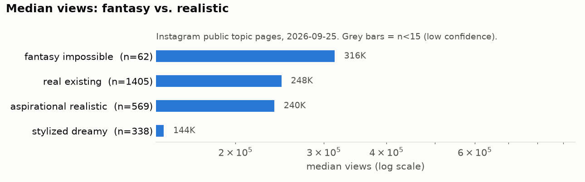

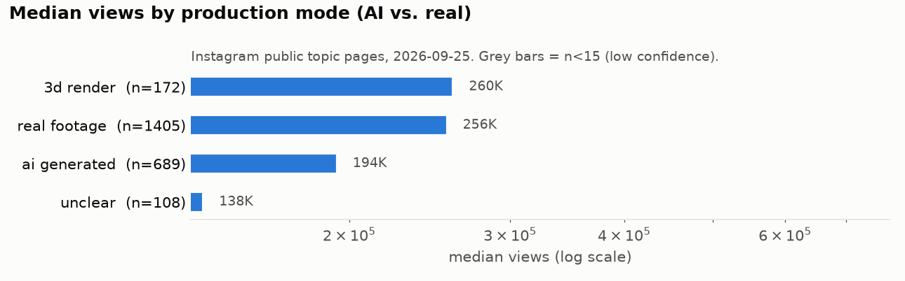
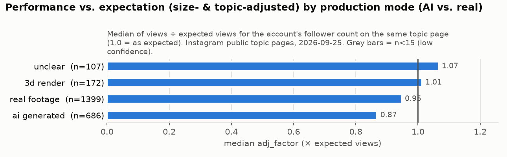

**Lesart:** Nicht „KI vs. echt“ trennt die Reels (0,92×, n.s.), sondern **welcher KI-Look** (Korrelation, keine Kausalität). Fantasy liegt deutlich vorn, der weiche
Dreamy-Look deutlich hinten, realistisch-aspirational im Mittelfeld. Dreamy ist mit 305 von 686 KI-Reels (44 %) zugleich der
häufigste KI-Look, also der **Massenmarkt**, von dem wir uns absetzen.

### 6.3 Robustheits-Checks

| Check | Ergebnis | Bewertung |
|---|---|---|
| **Accounttyp (KI)** | KI-Creator: fantasy 3,05 (n = 40), aspirational 1,19 (n = 101), dreamy 0,89 (n = 130). Theme-Page: fantasy 0,63 (n = 7 ⚠), aspirational 0,79 (n = 84), dreamy 0,66 (n = 137). Designer-Studio: fantasy 1,82 (n = 3 ⚠), aspirational 1,09 (n = 88), dreamy 0,28 (n = 19). | Der Fantasy-Vorteil zeigt sich **bei KI-Creator-Accounts**. Bei Theme-Pages kein Vorteil erkennbar (n = 7 ⚠). Die Rangfolge fantasy > aspirational > dreamy hält innerhalb der Creator-Accounts; bei Studios nur als Richtung (fantasy n = 3 ⚠). |
| **Konzentration** | 53 KI-Fantasy-Reels von **45 verschiedenen** Accounts; kein Account mit mehr als 2 Reels | Kein Einzel-Account-Artefakt |
| **Aktualität** | 32 der 53 KI-Fantasy-Reels von 2026, 14 von 2025, 7 von 2024 | Kein reiner Alt-Effekt; Muster auch 2026 sichtbar |
| **Viralitätsstufen** | Fantasy-Anteil steigt von 1,7 % (NORMAL) auf 3,7 % (EXTREME OUTLIER); dreamy fällt von 17,5 % auf 13,0 % | konsistent |
| **Innerhalb Account** | fantasy +2,3 Pp., dreamy −4,0 Pp. unter den Top 10 % (25 Accounts, 172 Reels; kaum Fantasy-Reels) | Richtung passt, nicht belastbar |
| **Personen im Bild** | KI-Fantasy mit Personen 2,58 (n = 14 ⚠), ohne 2,27 (n = 39) | Richtung passt zu „Mensch als Maßstab“; n klein |
| **Licht innerhalb Fantasy (KI)** | blue hour 3,24 (n = 10 ⚠), mixed 3,09 (n = 13 ⚠), night 2,47 (n = 8 ⚠), daylight 0,99 (n = 11 ⚠) | nur Richtung: Dämmerung/Nacht > Tag |
| **Topic-Kontext** | KI-Fantasy erscheint v. a. auf KI- und Future-Arch-Seiten (21 bzw. 12 von 53). Die Keyword-Seiten `impossible-architecture` (Median 486 Views) und `surreal-architecture` (3.480) gehören zu den schwächsten Topic-Seiten (dort fast nur echte Aufnahmen; KI-Anteil 0 % bzw. 8 %). | Das **Konzept** wirkt, das **Label** „impossible/surreal“ nicht → nicht als Keyword verkaufen |
| **Varianz** | Auch Fantasy floppt: z. B. zweites Reel von @archibible 0,59 vs. erstes 18,9 | Fantasy ist Voraussetzung, kein Garant |

**Selektionsbias:** Alles gilt unter Reels, die es auf Topic-Seiten geschafft haben. Möglich ist, dass Fantasy öfter „alles oder
nichts“ ist und gefloppte Fantasy-Reels in der Stichprobe fehlen. Das spricht **nicht** gegen Fantasy, aber gegen die Erwartung,
dass jede Fantasy-Folge über 2× liegt.

### 6.4 Shoppability und Engagement: Wer bezahlt was?

**Shoppability-Verteilung je Realismus** (Zeilen-%, [Digest Abschnitt 5](data/processed/analysis_digest.md)):

| Realismus | high | medium | low |
|---|---|---|---|
| fantasy/impossible | **0 %** | 5 % | **95 %** |
| aspirational-realistic | 28 % | 34 % | 38 % |
| real existing | 27 % | 23 % | 51 % |
| stylized dreamy | 0,3 % | 31 % | 69 % |

**Kostet Kaufbarkeit Reichweite?** Nein, nicht messbar:
- Alle Reels: high 0,98 (n = 530) vs. low 0,97 (n = 1.217) → 1,01× (95-%-KI 0,80–1,25; p = 0,91); Kruskal p = 0,83.
- KI aspirational-realistisch: high **1,13** (n = 85), low 1,00 (n = 137), medium 0,82 (n = 106).
- KI dreamy: low 0,73 (n = 210), medium 0,61 (n = 95). Schwach ist also der Look, nicht die Kaufbarkeit.
- **Hybrid** (fantasy mit kaufbaren Stücken): nur 3 Reels mit „medium“ (0,75 ⚠). **Diese Kombination ist in der Nische praktisch
  nicht vorhanden → UNKNOWN.** Das ist Chance (Lücke) und Risiko (vielleicht gibt es einen Grund) zugleich.

**Kommentare & Likes (nur KI):**

| KI-Realismus | n | Likes/View | Komm./10k | Kommentare pro Like |
|---|---|---|---|---|
| fantasy/impossible | 53 | 3,9 % | 4,4 | 1,10 % |
| aspirational-realistic | 328 | **1,9 %** | **2,1** | 0,74 % |
| stylized dreamy | 305 | 4,5 % | 4,8 | 0,97 % |

Lesart: Aspirational-realistische KI-Räume haben die **niedrigsten** Interaktionsraten (Hypothese: sie wirken wie Katalog/Werbung).
Fantasy erzeugt pro Like die meisten Kommentare (Diskussion: „würde das halten?“, „wo ist das?“). Dreamy hat viele Likes pro View,
aber die schwächste Reichweite. Likes sind kein Saves-Ersatz. Saves bleiben `UNKNOWN`.

### 6.5 Recht und Plattform: Fantasy ist das risikoärmere Genre

- **EU AI Act, Deepfake-Definition** (Draft Guidelines): „Objects“ und „Places“ sind als *realistic* definiert. Inhalte, die *„defy the
  laws of nature or physics“*, gelten als unrealistisch und fallen aus dem Anwendungsbereich `[VERIFIED – Entwurf]`. Eine
  **fotorealistische, erfundene Luxusvilla** kann dagegen ein Deepfake sein, wenn sie echt wirkt `[ESTIMATED Anwendung]`
  ([q07](quellen/q07_legal_ai_risk.md)).
- **Meta** verlangt das KI-Label bei fotorealistischem Video `[VERIFIED]` ([q07](quellen/q07_legal_ai_risk.md), [q01](quellen/q01_instagram_platform_rules.md)).
  **YouTube** verlangt keine Offenlegung für *„Animation or fantastical imagery“*, wohl aber für realistisch wirkende Orte `[VERIFIED]`
  ([q08](quellen/q08_cross_platform_signals.md)).
- **Irreführung:** „This $50M home in Dubai“ über ein fiktives Objekt ist der Kernfall (UWG § 5; UCPD) `[ESTIMATED]`
  ([q07](quellen/q07_legal_ai_risk.md)).
- **Offenlegung und Reichweite:** KI-offengelegte Reels 0,73 vs. nicht offengelegt 0,89 (0,82×; 95-%-KI 0,58–1,18; n.s.). Die
  Kennzeichnung bleibt Pflicht, der Unterschied ist nicht signifikant.
- **Folge:** Aspirational-realistische KI-Räume brauchen die sauberste Kennzeichnung („AI concept“, „similar, not exact“) gerade dort,
  wo sie Möbel verkaufen sollen.

### 6.6 Beobachtete Beispiele → Prinzip (nicht kopieren)

Beobachtet auf Topic-Seiten (Views/Follower VERIFIED, gerundet; Codes ESTIMATED). Nur kurze Auszüge zur Belegung. **Übernommen wird
das Prinzip, nie das Motiv oder die Formulierung.**

| Beobachtetes Beispiel | Daten | Abgeleitetes Prinzip |
|---|---|---|
| @polliviva – Cartoon-Badezimmer, Caption-Auszug „У кого так же 😄“ („bei wem ist es auch so?“) | 97,2M Views, 48K Follower, adj 77,8; KI offengelegt | Unmögliche Szene + **Wiedererkennungs-Humor** → Shares |
| @archibible – „Alpine Future“ | 14,3M Views, 220K Follower, adj 18,9 | **Zwei-Wort-Konzepttitel** + eindeutiges Architekturmerkmal im Hochgebirge |
| @primurse_log – „Concept 90: Fish-Shaped Skyscrapers …“ | 1,7M Views, 43K Follower, adj 15,7 | **Nummerierte Konzeptserie** + absurde Prämisse in einem Satz |
| @foorcrafts – „Building a Glass House on a Cliff … Step by Step“ | 1,3M Views, 110K Follower, adj 24,9 | **Bau-/Prozess-Narrativ** macht selbst das übernutzte Klippenmotiv wieder spannend |
| @theimagehs – „Unlikely future part 3“ | 5,6M Views, 137K Follower, adj 9,2 | **Serienteil** („part 3“) als Wiederkehr-Signal |
| @roomify.design – KI warm-luxury-Schlafzimmer „Turning an empty room into …“ | 1,7M Views, 62K Follower, adj 12,0; high Shoppability; Account-Median über 7 Reels 1,85 | Realistische, **kaufbare** Transformation + Frage-CTA → Commerce-Brücke |

### 6.7 Fazit für das Geschäftsmodell (Teil 18)

**Antwort auf die Hypothese:** *Teilweise bestätigt, mit wichtiger Korrektur.*
- ✅ **Fantasy geht mit deutlich mehr Reichweite einher:** 2,27 bei KI (n = 53), signifikant gegen beide anderen KI-Looks, nicht von
  Einzel-Accounts getragen (45 Accounts), über Jahre und Viralitätsstufen konsistent; der Vorteil zeigt sich aber nur bei
  Creator-Accounts (Theme-Pages n = 7 ⚠). Querschnitt unter Topic-Seiten-Reels, keine Kausalität → im eigenen Test bestätigen.
- ✅ **Fantasy verkauft keine Möbel:** 95 % „low“ Shoppability, 0 % „high“.
- ❌ **„Realistisch = schwache Reichweite“ stimmt so nicht:** Realistische KI-Räume liegen im Mittel (0,90), mit kaufbaren Stücken
  sogar bei 1,13 (n = 85). Der eigentliche Verlierer ist der **Dreamy-Look** (0,70; 44 % aller KI-Reels).
- ❓ **Hybrid („Impossible places, possible furniture“) = UNKNOWN**, praktisch keine Datenpunkte.

**Konsequenz (konsistent mit dem Strategy Brief, Pillars in [08_content_pillars.md](08_content_pillars.md)):**

| Rolle | Look | Anteil Start-Mix | Ziel-KPI | Monetarisierung |
|---|---|---|---|---|
| Reichweiten-Motor (P1 Impossible Homes, P4 Night) | fantasy/impossible, futuristische Hülle, Nachtlicht, kleine Figur | 50 % (35 % + 15 %) | Reach, Sends, Follows | Wachstum → KI-Tool-Sponsoring, B2B-Visualisierung, digitale Produkte ([09](09_monetization.md)) |
| Commerce-Brücke (P2 Pick One, P3 Dream Builds) | aspirational-realistisch, hohe Shoppability, Bad/Outdoor/warm luxury/glam | 40 % (20 % + 20 %) | Kommentare (Choice), Saves, Keyword-DMs, Link-Klicks | „similar, not exact“-Affiliate, Kollektionen per DM |
| Tests (P5) | Hybrid, Art Deco, Maximalismus, Location-Settings | 10 % | Gruppen-Index | Lernen |
| **Nicht** | stylized dreamy, warm+dreamy-cozy, Default modern luxury | 0 % | – | – |

**Hybrid-Test (konkret, Testvariable für [13_testing_matrix.csv](13_testing_matrix.csv)):** Dasselbe Konzept in drei Varianten
innerhalb einer Woche, alle mit gleichem Hook-Typ und gleicher Länge:
- **A – Pure Impossible:** unmögliche Hülle, keine erkennbaren Produkte.
- **B – Hybrid:** dieselbe Hülle, innen 3–5 klar erkennbare, real erhältliche Stücke („similar items“ offengelegt).
- **C – Realistic:** realistischer Innenraum im gleichen Stil, hohe Shoppability.
Entscheidung nach den Gruppenregeln in [15_kpi_framework.md](15_kpi_framework.md) (Gruppen-Index, P(besser) ≥ 95 %, F/1k,
Sends/Saves je Reach). B gewinnt, wenn es die Reichweite von A weitgehend hält und bei Saves/Keyword-DMs vor A liegt. Die genauen
Schwellen legt das KPI-Framework fest, **nicht** diese Analyse.

**Original-Beispiele für die Testreihen** (neu formuliert, EN):

| Pillar | Arbeitstitel (on-screen) | Hook (Caption, 1. Zeile) | Realismus |
|---|---|---|---|
| P1 | „UNBUILT No. 021 – The Glacier Stair“ | „A staircase that only exists when the ice does.“ | fantasy |
| P1 | „UNBUILT No. 022 – House Between Two Waves“ | „Engineers said no. We drew it anyway.“ | fantasy |
| P4 | „NIGHT SHIFT – A tower that glows from inside“ | „Every window is a different room. Which one is yours?“ | fantasy, Nachtlicht |
| P2 | „PICK 1 · 2 · 3 – Same bath, three impossible views“ | „Same marble tub. Three worlds outside. Choose.“ | Hybrid |
| P3 | „FROM NOTHING – Bare slope → alpine spa terrace“ | „Day 0: gravel. Day 90: this.“ (als Konzept gekennzeichnet) | aspirational |
| P2 | „REAL CHAIR. IMPOSSIBLE ROOM.“ | „Everything here is imagined, except the chair. Guess which brand.“ | Hybrid |

Kennzeichnung in jeder Caption: „AI concept“ bzw. „AI-generated design concept“; bei Produkten „similar, not exact“ plus
Affiliate-Hinweis ([q02](quellen/q02_furniture_affiliate_commerce.md), [q07](quellen/q07_legal_ai_risk.md)).

---

## 7. Offene Punkte (UNKNOWN) und was wir selbst messen

| Offene Frage | Warum offen | Wie wir es klären |
|---|---|---|
| Saves/Shares je Stil, Raum, Realismus | nicht öffentlich `[UNKNOWN]` | eigene Insights (Saves/Reach, Sends/Reach) je Gruppe, [15_kpi_framework.md](15_kpi_framework.md) |
| Hybrid „Impossible places, possible furniture“ | n = 3 in den Daten | A/B/C-Test (6.7) |
| Stile mit ⚠-n: art deco, maximalist, cyberpunk, mid-century (KI) | n < 15 | je 3 Wildcard-Reels (P5) |
| Stil-Effekt vs. Account-Effekt (glam/warm luxury bei KI) | Querschnitt, n = 15 | Stil als Testvariable bei gleicher Serie/Hook |
| Location-Settings für KI (Schweiz, Tokyo, Dubai) | KI-n < 15, Location n.s. | nur als P5-Setting, nie als Hook |
| Kamera, Länge, Audio je Stil | auf Instagram nicht messbar (nur YouTube-Proxy) | eigene Tests, siehe [05_viral_patterns.md](05_viral_patterns.md) |
| Topic-Seite New York | kein Slug im Sweep | bei Bedarf nachziehen |
| Reliabilität Shoppability (κ = 0,63) | schwächstes Codierfeld | eigene Produktzählung pro Reel in der Winner-DB |

---

## Anhang A: Reproduktion der eigenen Auswertungen

Alle Werte mit „selbst berechnet“ stammen aus [04_reel_database.csv](04_reel_database.csv) (Stand 25.09.2026) mit folgendem Code
(Python 3, pandas, numpy, scipy). Die übrigen Werte stammen unverändert aus dem [Digest](data/processed/analysis_digest.md) bzw.
[stats/](data/processed/stats/).

<details>
<summary>Python-Code (KI-only-Segmente, Kruskal-Wallis, Holz/Stein vs. Weiß, Realismus × Accounttyp/Shoppability)</summary>

```python
import numpy as np, pandas as pd
from scipy import stats

df = pd.read_csv("04_reel_database.csv")
d = df.dropna(subset=["adj_factor"])                 # Reels mit größenbereinigtem Wert
ai = d[d.production == "ai_generated"]               # KI-only (n = 686)

def seg(sub, col):                                   # Median adj, n, Anteil >=2x je Segment
    g = sub.groupby(col)["adj_factor"]
    return pd.DataFrame({"n": g.size(), "median_adj": g.median(),
                         "share_2x": g.apply(lambda s: (s >= 2).mean())}).sort_values("median_adj", ascending=False)

def kruskal(sub, col, min_n=15):                     # Kruskal-Wallis auf adj_resid, Segmente n>=15
    vc = sub[col].value_counts()
    return stats.kruskal(*[sub.loc[sub[col] == k, "adj_resid"] for k in vc[vc >= min_n].index])

for col in ["style_primary", "room_primary", "realism", "building_type", "landscape",
            "palette_temp", "brightness", "lighting", "shoppability"]:
    print(col, kruskal(ai, col)); print(seg(ai, col).round(2))

def has(sub, col, v):                                # Mehrfachfelder (materials, dominant_colors)
    return sub[col].fillna("").str.split(";").apply(lambda L: v in [x.strip() for x in L])

def contrast(sub, a, b, n_boot=5000):                # Median-Verhältnis, Bootstrap-KI (Seed 42), Mann-Whitney
    A, B = sub.loc[a, "adj_factor"].values, sub.loc[b, "adj_factor"].values
    rng = np.random.default_rng(42)
    r = [np.median(rng.choice(A, len(A))) / np.median(rng.choice(B, len(B))) for _ in range(n_boot)]
    return len(A), np.median(A), len(B), np.median(B), np.median(A) / np.median(B), \
           np.percentile(r, [2.5, 97.5]), stats.mannwhitneyu(A, B).pvalue

x = d[d.palette_temp.notna()].copy()
x["wood"], x["stone"], x["white"] = has(x, "materials", "wood"), has(x, "materials", "natural_stone"), has(x, "dominant_colors", "white")
x["warm_natural"] = (x.palette_temp == "warm") & (x.wood | x.stone)
x["sterile_white"] = x.white & x.palette_temp.isin(["cool", "neutral"]) & (x.brightness == "bright") & ~x.wood & ~x.stone
for name, s in [("ALL", x), ("AI", x[x.production == "ai_generated"]), ("REAL", x[x.production == "real_footage"])]:
    print(name, contrast(s, s.warm_natural, s.sterile_white), contrast(s, s.warm_natural, ~s.warm_natural))

print(ai.groupby(["realism", "account_kind_hint"]).adj_factor.agg(["size", "median"]))
print(ai.groupby(["realism", "shoppability"]).adj_factor.agg(["size", "median"]))
```

Die KI/real-Spalten der Themen-Tabelle (4.1) nutzen `theme_flags()` aus [scripts/analyze.py](scripts/analyze.py) auf denselben Daten.
Die Shoppability-Anteile je Stil/Raum sind auf Reels mit Views bezogen (gleiche Basis wie der Digest).

</details>

---

## Quellen

- Projektdaten: [data/processed/analysis_digest.md](data/processed/analysis_digest.md) (Abschnitte 1, 2, 3, 4, 5, 6, 7, 9),
  [stats/themes.csv](data/processed/stats/themes.csv), [stats/seg_*.csv](data/processed/stats/),
  [stats/key_contrasts.csv](data/processed/stats/key_contrasts.csv), [stats/freshness_by_group.csv](data/processed/stats/freshness_by_group.csv),
  [stats/topics.csv](data/processed/stats/topics.csv), [stats/reliability.csv](data/processed/stats/reliability.csv),
  [04_reel_database.csv](04_reel_database.csv), [data/processed/strategy_brief.md](data/processed/strategy_brief.md).
- Recherche-Notizen (Status-Tags wie dort):
  [q01 – Instagram-Plattformregeln](quellen/q01_instagram_platform_rules.md) ·
  [q02 – Möbel-Affiliate & Social Commerce](quellen/q02_furniture_affiliate_commerce.md) ·
  [q04 – Interior-Trends & Nachfrage](quellen/q04_interior_trends_demand.md) ·
  [q06 – KI-Theme-Page-Fallstudien](quellen/q06_ai_theme_page_case_studies.md) ·
  [q07 – Recht & KI-Risiken](quellen/q07_legal_ai_risk.md) ·
  [q08 – Cross-Platform-Signale](quellen/q08_cross_platform_signals.md).
- Hinweis zu q06: Die dort genannte Zahl „fantasy_impossible Median 890 Tsd. Views bei n = 14“ stammt aus einem früheren
  Datenstand. Maßgeblich ist der aktuelle Digest (n = 62, Median 316K, adj 2,10).
- Charts: [charts/](charts/) (views_by_*, index_by_*, adj_by_*, topics_demand_vs_supply).
