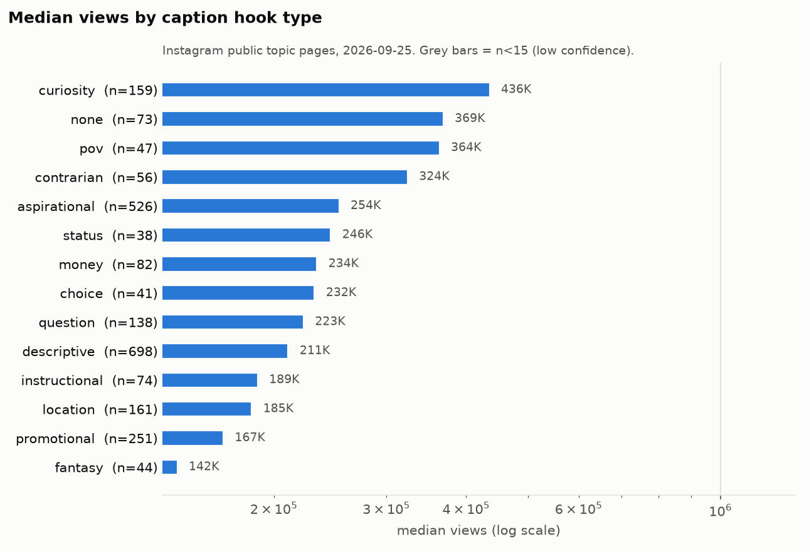
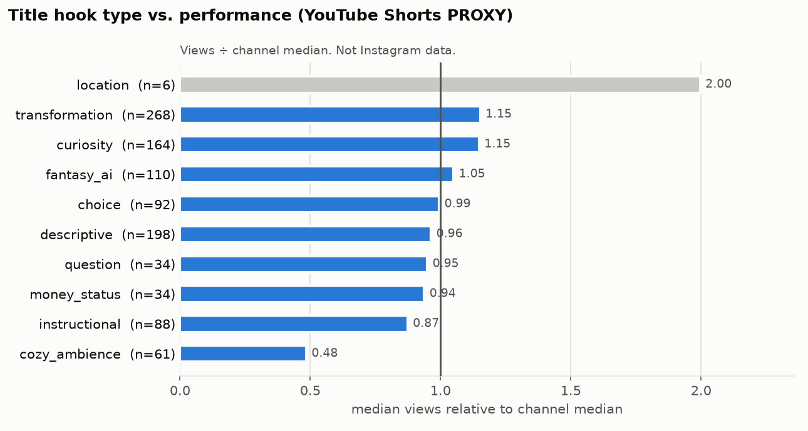

# 07 – Hooks: Text-Hooks, Captions, visuelle Hooks, Hook-Library & Visual-Hook-Library (Teil 8, 9, 10, 25, 26)

**Stand:** 25.09.2026 · **Für:** neuen internationalen KI-Architektur-Account „AI-Architektur-Studio für *Homes that shouldn't exist (yet)*“ ([Strategy Brief](data/processed/strategy_brief.md)) · **Zahlenquellen:** [analysis_digest.md](data/processed/analysis_digest.md) (im Text „Digest §x“), [stats/*.csv](data/processed/stats/), eigene Nachrechnung mit [scripts/hooks_analysis.py](scripts/hooks_analysis.py) → `data/processed/stats/hooks_*.csv`, Quellennotizen [q01](quellen/q01_instagram_platform_rules.md), [q06](quellen/q06_ai_theme_page_case_studies.md), [q07](quellen/q07_legal_ai_risk.md), [q08](quellen/q08_cross_platform_signals.md), [q09](quellen/q09_reels_format_benchmarks.md) · **Verwandte Kapitel:** [05 §3](05_viral_patterns.md) (Cover-Elemente im Detail), [06](06_visual_styles.md) (Stile, Licht, Settings), [08](08_content_pillars.md) (Pillars P1–P6), [15](15_kpi_framework.md) (Winner-DB, Testdesign), [16 §4.5](16_automation_strategy.md) (Rechtsregeln)

**Lesehilfe**

| Kennzeichen | Bedeutung |
|---|---|
| `VERIFIED` | Views/Follower von öffentlichen Seiten (gerundet wie angezeigt), Zitate aus Primärquellen |
| `ESTIMATED` | KI-gestützte Codierung (Caption-Hook, Cover-Elemente), regelbasierte Cover-Text-Kategorien, eigene Ableitungen |
| `PROXY` | YouTube-Shorts-Daten als Ersatz für nicht messbare Instagram-Größen |
| `THIRD-PARTY ESTIMATE` | Faustregeln oder Zahlen Dritter ohne offengelegte Daten |
| `UNKNOWN` | mit öffentlichen Daten nicht bestimmbar |
| **n < 15** | geringe Konfidenz, nur Richtung (in Tabellen mit ⚠ markiert) |
| **n.s.** | nicht signifikant (p ≥ 0,05) |
| **nominal** | p < 0,05, aber nicht nach Mehrfachtest-Korrektur (Bonferroni) und/oder das 95-%-Bootstrap-Konfidenzintervall (im Text „95-%-KI“) schließt 1,0 ein |
| „eigene Nachrechnung“ | nicht im Digest, sondern mit [scripts/hooks_analysis.py](scripts/hooks_analysis.py) aus `reels_master.pkl` neu berechnet (Code und Output-Dateien: [Anhang A](#anhang-a--reproduktion)) |

Zahlen im Fließtext: deutsche Dezimalkommas. Hooks, Beispielzeilen, Prompts und On-Screen-Texte stehen auf Englisch.

---

## Inhalt

- [0. Kurzfassung](#0-kurzfassung)
- [1. Datenbasis, Metriken, Grenzen](#1-datenbasis-metriken-grenzen)
- [2. Teil 9 – Text-Hooks: Kategorien und Performance](#2-teil-9--text-hooks-kategorien-und-performance) (darin [2.10 Teil 10 – Captions](#210-teil-10--captions-länge-fragen-cta-hashtags-keywords-emojis-storytelling-link-hinweise))
- [3. Teil 8 – Visuelle Hooks: die ersten 1–2 Sekunden](#3-teil-8--visuelle-hooks-die-ersten-12-sekunden)
- [4. Teil 25 – Hook Library: 50 eigene Text-Hooks](#4-teil-25--hook-library-50-eigene-text-hooks)
- [5. Teil 26 – Visual Hook Library: 34 eigene visuelle Hooks](#5-teil-26--visual-hook-library-34-eigene-visuelle-hooks)
- [6. Kombinieren, testen, entscheiden](#6-kombinieren-testen-entscheiden)
- [7. Offene Punkte (UNKNOWN)](#7-offene-punkte-unknown)
- [Anhang A – Reproduktion](#anhang-a--reproduktion)
- [Quellen](#quellen)

---

## 0. Kurzfassung

1. **Die Hook-Kategorie erklärt die Reichweite kaum, die Kommentare aber stark.** Über alle 14 Caption-Kategorien ist der größenbereinigte Wert nicht signifikant verschieden (Kruskal-Wallis p = 0,35; nur KI-Reels p = 0,22). Fast jede Kategorie taucht sowohl unter den Top-80 als auch unter den Bottom-40-Reels auf. Kommentare pro View unterscheiden sich dagegen hochsignifikant (p < 0,0001, alle und KI). → Hooks sind **Testvariablen**, keine Erfolgsgarantie. Entscheidend ist die konkrete Informationslücke, nicht das Etikett.
2. **Choice ist der robusteste Hook – für Kommentare.** Choice-Captions gehen mit **5,67× mehr Kommentaren pro View** einher (95-%-KI 2,05–14,3; p = 6 × 10⁻⁸; n = 39), bei KI-Reels **13,6×** (95-%-KI 5,5–25,5; p < 0,0001; n = 25). Der Reichweiteneffekt ist nur nominal: alle 1,53 (n = 40; Kontrast 1,65×, p = 0,053, n.s.), KI 1,37 (n = 25; p = 0,032, das 95-%-KI schließt 1 ein). **Gegenevidenz:** 86 von 92 Choice-Titeln im YouTube-Proxy stammen aus einem einzigen Kanal mit einem wiederholten Template; Median dort 0,89× Kanal-Median (vermutlich Template-Ermüdung; die Ursache ist laut [q08](quellen/q08_cross_platform_signals.md) §5 `UNKNOWN`).
3. **Curiosity kippt je nach Produktion.** Bei KI-Reels ist Curiosity die stärkste Caption-Kategorie (**1,50**, n = 67; 1,79× vs. andere KI-Captions, p = 0,037 nominal, 95-%-KI 0,80–3,27), bei realen Aufnahmen nur die viertschwächste von 14 (0,71, n = 76). Innerhalb KI trägt der **Prozess-/Bau-Typ** („from X to Y“, „built …“): 1,54 (n = 38) vs. übrige Curiosity 0,73 (n = 25; post-hoc). → **Curiosity nur mit sichtbarem Payoff** (unmöglicher Bau, Reveal, Transformation).
4. **Money und Status liegen über 1, sind aber nicht belegt und in KI kaum getestet.** Money 1,19 (n = 82; 1,28×, p = 0,15), Status 1,37 (n = 37; p = 0,58). Bei KI: Money n = 5, Status n = 6 (⚠). Dazu das Rechtsrisiko fiktiver Preise ([q07](quellen/q07_legal_ai_risk.md) §2.6). → Preis-Hooks nur mit **realen Produktpreisen** oder **ohne Zahl** (Schätzfrage bei klar gekennzeichnetem Konzept).
5. **Schwach:** Location-Caption 0,63 (n = 161; KI 0,45, n = 8 ⚠), Contrarian 0,70 (n = 56), Instructional 0,72 (n = 74), POV bei KI 0,47 (n = 14 ⚠), Descriptive bei KI 0,76 (n = 209). Ein Fragezeichen allein macht keinen messbaren Unterschied (Caption mit Frage 0,943 vs. ohne 0,937).
6. **„Imagine …“ sagen zeigt keinen Vorteil, Unmögliches zeigen schon (korrelativ).** Fantasy-Captions liegen bei 0,97 (n = 44), fantastische *Bilder* bei KI dagegen bei **2,27** (n = 53; 3,25× vs. „dreamy“, p = 0,001). → Dream-Hooks müssen ein **konkretes unmögliches Detail** benennen, nicht zum Träumen auffordern.
7. **Cover-Text: kein Etikett.** Kurze Label-Texte (1–7 Wörter, meist Beschreibungen wie Stil, Raum oder Ort) liegen bei 0,84 vs. 0,98 ohne Text (p = 0,044, nominal); ganze Hook-Sätze (≥ 8 Wörter) bei 1,18 (n = 289; vs. kein Text p = 0,061, n.s.). Bei KI ist nichts davon signifikant. → **Standard ohne Text**; wenn Text, dann **ein Satz mit Lücke**, nie ein Label. Das weicht von [05 §3.6](05_viral_patterns.md) Regel 4 („≤ 7 Wörter“) ab; der Längen-Befund ist konfundiert und bei KI n.s., daher im eigenen Test prüfen.
8. **Visuelle Hooks:** Bei KI ist **Person im Cover** das einzige nominal signifikante Cover-Element (1,63 vs. 0,79; p = 0,021; n = 74); wir setzen das als **kleine menschliche Figur** um (Größe der Figur nicht codiert). Dazu Nachtlicht (KI 1,27 vs. Tageslicht 0,90), Treppen/Hallen, Gärten, Bäder und Wasser als Richtung. Meiden: Fensterblick (0,70×, nominal signifikant, nicht Bonferroni-fest), „Aussicht als Payoff“ (KI 0,56), Bett-Fokus (KI 0,70), Split-Screen, leerer Raum als Cover, Schnee/Kamin/Kerzen, Klippen-Postkarte (KI 0,48, n = 35).
9. **Libraries:** 50 eigene Text-Hooks ([§4](#4-teil-25--hook-library-50-eigene-text-hooks)), gewichtet nach Evidenz (Curiosity 9, Choice 8, Story 6, Price 5, POV 5, Dream 5, Question 4, Location 4, Status 4), und 34 eigene visuelle Hooks für die ersten 1–2 Sekunden ([§5](#5-teil-26--visual-hook-library-34-eigene-visuelle-hooks)). Dazu eine Kombinationsmatrix und Entscheidungsregeln ([§6](#6-kombinieren-testen-entscheiden)).

---

## 1. Datenbasis, Metriken, Grenzen

### 1.1 Was hier „Hook“ heißt und wie es gemessen wurde

| Hook-Ebene | Was | n | Wie codiert | Status |
|---|---|---|---|---|
| **Caption-Hook** | erste Zeile der Caption (im Feed unter dem Video sichtbar) | 2.378 mit adj_factor | KI-gestützt nach Codebuch in 14 Kategorien ([cover_codebook.md](scripts/cover_codebook.md)); Reliabilität κ = 0,966 (n = 36, [reliability.csv](data/processed/stats/reliability.csv)) | `ESTIMATED` |
| **Cover-Text** | Text-Overlay im Cover-Frame | 1.150 Reels mit Cover-Text (Digest §11 zählt 1.120 mit > 2 Zeichen) | **regelbasiert** (Schlüsselwort-Regeln, erste Übereinstimmung gewinnt; [hooks_analysis.py](scripts/hooks_analysis.py)); Übereinstimmung mit der KI-Codierung, wo Cover-Text = erste Caption-Zeile: **56 %** (n = 52, [hooks_cover_rule_agreement.csv](data/processed/stats/hooks_cover_rule_agreement.csv)) | `ESTIMATED`, **grob** |
| **Visueller Hook** | Bildelemente im Cover-Frame (Person, Wasser, Tür, Reveal …) | 2.364 | KI-gestützt, Mehrfachcodes; Reliabilität Jaccard 0,848 | `ESTIMATED` |
| **Erste 2 Sekunden (echt)** | tatsächliche Eröffnung des Videos | **7** Reels | NexLev-Video-Analyse (15 Aufrufe/Tag) | `ESTIMATED`, anekdotisch |
| **YouTube-Titel** | Titel von 713 Shorts aus 12 Faceless-Interior-Kanälen | 713 | Schlüsselwort-Regeln, Mehrfachlabels ([youtube_proxy.py](scripts/youtube_proxy.py)) | `PROXY` |

### 1.2 Metriken

- **`adj_factor` (Hauptmetrik):** Views relativ zur Erwartung für die Followerzahl des Accounts auf derselben Topic-Seite (1,0 = wie erwartet). Ohne diese Kontrolle würde die Account-Größe (Spearman ρ = 0,43, Digest §1) jede Hook-Kategorie überlagern.
- **Kommentare je 1.000 Views** (`comments_per_view` × 1.000): direkter Proxy für „löst der Hook eine Antwort aus?“.
- **Anteil vpf ≥ 5** (Views ≥ 5× Follower): größenverzerrt, nur ergänzend.
- **Median-Views:** nur Kontext; wegen des Selektionsbias keine Prognose.

### 1.3 Selektionsbias – warum „kein Effekt“ hier nicht „egal“ heißt

Topic-Seiten zeigen die Top-Reels eines Themas. Wir vergleichen also Hooks **unter Reels, die es bereits nach oben geschafft haben**. Zwei Folgen:

1. Ein Hook, der oft zum Absturz führt, taucht in der Stichprobe seltener auf, aber die überlebenden Beispiele können gut aussehen. Die Stichprobe unterschätzt Unterschiede eher. Ein nicht signifikanter Unterschied kann also trotzdem real sein.
2. Hooks, die mit mehr **Kommentaren** einhergehen (Choice), sind unabhängig vom Reichweiten-Bias messbar, weil Kommentare pro View innerhalb des Reels normiert sind. Das ist der robusteste Hook-Befund in diesem Kapitel.

### 1.4 Signifikanz und Mehrfachtests

- Kruskal-Wallis über alle Caption-Kategorien (n ≥ 15): größenbereinigt p = 0,35 (alle) bzw. 0,22 (KI) → **n.s.**; Kommentare pro View H = 89,9 bzw. 58,8, p < 0,0001 ([hooks_kruskal.csv](data/processed/stats/hooks_kruskal.csv)).
- In [hooks_contrasts.csv](data/processed/stats/hooks_contrasts.csv) stehen 24 eigene Kontraste. Bonferroni-Schwelle p ≈ 0,0021. Diese Schwelle unterschreiten nur: **Choice → Kommentare (KI)**, **Cover-Text 1–7 vs. ≥ 8 Wörter (alle; p = 0,0017)** und **Cover-Text ≥ 8 vs. 1–7 Wörter (nur reale Aufnahmen; p = 0,0009)**. Alles andere ist Richtung.
- **Keine Kausalität:** Alle Muster sind Hypothesen für die Testmatrix ([15 §4.5](15_kpi_framework.md)).

---

## 2. Teil 9 – Text-Hooks: Kategorien und Performance

### 2.1 Taxonomie

Die geforderten Kategorien Curiosity, POV, Aspirational, Choice, Question, Status, Money, Location, Fantasy und Contrarian entsprechen 1:1 den Codebuch-Kategorien. Dazu kommen Instructional, Descriptive, Promotional und „none“ (keine Caption).

| Kategorie | Definition (Codebuch, verkürzt) | Beobachtetes Beispiel (Auszug, Handle) – **nicht kopieren** |
|---|---|---|
| **Curiosity** | offene Lücke, Geheimnis, Prozess, „wait for it“ | „From Empty Cliff to Private Beach Mansion …“ (@epocraftdiy) |
| **POV** | „POV: …“, Zuschauer wird in die Szene gesetzt | „POV: this feeling when you arrive in the Maldives“ (@swaraagharat) |
| **Aspirational** | Wunschleben, Ideal-Selbst, Stimmung | „Suddenly, living in the middle of nowhere sounds perfect“ (@timelessdiaries) |
| **Choice** | Auswahl zwischen Optionen | „Which GTA house would you rather to live in?“ (@soldbytyler) |
| **Question** | Frage ohne Auswahl | „Who would love one of these in their garden?“ (@paulmarkkitchens) |
| **Status** | Reichtum, Exklusivität, Besitzer | „Meeting the owner of a $200,000,000 home“ (Cover, @ryanserhant) |
| **Money** | Preis, Kosten, Miete, Budget | „HOW MUCH RENT DO YOU PAY?“ (Cover, @alshifarealtor.dxb) |
| **Location** | Ortsname als Hauptaussage | „Shangrila Resort Skardu“ (@northern___bear) |
| **Fantasy** | „imagine“, „if only“, Traumwelt | „If only 'home sweet home' meant living in a tiramisu house.“ (@ifonly.ai) |
| **Contrarian** | Widerspruch, „don't …“, „it's not about …“ | „Don't Stay In Hotels in Morocco…“ (Cover, @quingable) |
| **Instructional** | How-to, Tipps, Listen | „DIY Dreamy Home Library“ (@longingtocomehome) |
| **Descriptive** | Beschreibung/Label ohne Spannung | „Luxury cliffside villa with breathtaking ocean views“ (@facade_designn) |
| **Promotional** | Angebot, Kontakt, Marke | „Contact by WhatsApp …“ (@balidroomvillas) |

Alle Beispiele stammen aus Digest §9–§11 bzw. [q06](quellen/q06_ai_theme_page_case_studies.md). Sie dienen nur der Kategorisierung.

### 2.2 Performance über alle Reels




| Caption-Hook | n (adj) | Median-Views | **Median adj_factor** | Anteil ≥ 2× Erwartung | Anteil vpf ≥ 5 | **Kommentare/1.000 Views** |
|---|---|---|---|---|---|---|
| **Choice** | 40 | 232 Tsd. | **1,53** | 47,5 % | 60,0 % | **1,81** |
| Status | 37 | 246 Tsd. | 1,37 | 40,5 % | 40,5 % | 0,43 |
| Money | 82 | 234 Tsd. | 1,19 | 41,5 % | 43,9 % | 0,49 |
| *keine Caption* | 72 | 369 Tsd. | 1,17 | 37,5 % | 45,8 % | 0,27 |
| Promotional | 251 | 167 Tsd. | 1,01 | 32,7 % | 34,7 % | 0,46 |
| Aspirational | 525 | 254 Tsd. | 1,01 | 35,4 % | 38,1 % | 0,33 |
| Fantasy | 44 | 142 Tsd. | 0,97 | 43,2 % | 40,9 % | 0,44 |
| Descriptive | 693 | 211 Tsd. | 0,91 | 33,0 % | 39,0 % | 0,30 |
| Question | 137 | 223 Tsd. | 0,89 | 32,8 % | 35,8 % | 0,31 |
| Curiosity | 159 | 436 Tsd. | 0,86 | 37,7 % | 45,3 % | 0,26 |
| POV | 47 | 364 Tsd. | 0,84 | 34,0 % | 36,2 % | 0,33 |
| Instructional | 74 | 189 Tsd. | 0,72 | 29,7 % | 32,4 % | 0,44 |
| Contrarian | 56 | 324 Tsd. | 0,70 | 30,4 % | 30,4 % | 0,38 |
| **Location** | 161 | 185 Tsd. | **0,63** | 31,7 % | 28,0 % | 0,40 |

Quelle: Digest §3 „Caption hook category“, [seg_caption_hook_category.csv](data/processed/stats/seg_caption_hook_category.csv). Kruskal-Wallis p = 0,35 → **n.s.** Belastbare Kontraste (Digest „Key contrasts“ und eigene Nachrechnung):

| Kontrast | Verhältnis | 95-%-KI | p | Urteil |
|---|---|---|---|---|
| Choice vs. andere → Kommentare/View | **5,67×** | 2,05–14,3 | 6 × 10⁻⁸ | **robust** |
| Choice vs. andere → adj_factor | 1,65× | 0,87–4,67 | 0,053 | n.s. |
| Money vs. andere | 1,28× | 0,86–2,46 | 0,15 | n.s. |
| Status vs. andere | 1,47× | 0,45–3,98 | 0,58 | n.s. |
| Location vs. andere | 0,66× | 0,49–1,18 | 0,22 | n.s. |
| Contrarian vs. andere | 0,74× | 0,34–1,08 | 0,13 | n.s. |
| Instructional vs. andere | 0,76× | 0,41–1,24 | 0,21 | n.s. |
| Question vs. andere | 0,95× | 0,51–1,35 | 0,38 | n.s. |
| POV vs. andere | 0,90× | 0,58–1,95 | 0,80 | n.s. |
| Preisangabe in Caption/Cover vs. keine (n = 199) | 1,07× | 0,81–1,38 | 0,37 | n.s. |

**Lesart:** Die Median-Views (Curiosity 436 Tsd., POV 364 Tsd.) und der größenbereinigte Wert (0,86 bzw. 0,84) zeigen in verschiedene Richtungen. Curiosity- und POV-Captions werden überdurchschnittlich oft von **großen** Accounts genutzt. Nach Größenbereinigung bleibt davon nichts übrig. Deshalb entscheiden wir nach adj_factor.

### 2.3 Innerhalb KI vs. reale Aufnahmen – hier kippt das Bild

| Caption-Hook | **KI: n** | **KI: adj** | KI: Komm./1.000 | KI: vpf ≥ 5 | **Real: n** | **Real: adj** | Real: Komm./1.000 |
|---|---|---|---|---|---|---|---|
| **Curiosity** | 67 | **1,50** | 0,18 | 53,7 % | 76 | 0,71 | 0,37 |
| **Choice** | 25 | **1,37** | **4,56** | **68,0 %** | 10 ⚠ | 1,86 | 0,84 |
| Money | 5 ⚠ | 1,13 | 0,23 | 40,0 % | 73 | 1,24 | 0,49 |
| *keine Caption* | 28 | 1,06 | 0,39 | 42,9 % | 41 | 1,15 | 0,24 |
| Fantasy | 40 | 0,97 | 0,46 | 40,0 % | 2 ⚠ | 1,79 | 1,04 |
| Aspirational | 162 | 0,90 | 0,33 | 37,7 % | 293 | 1,04 | 0,32 |
| Question | 45 | 0,89 | 0,43 | 40,0 % | 80 | 0,97 | 0,28 |
| Promotional | 44 | 0,87 | 1,00 | 27,3 % | 187 | 1,06 | 0,44 |
| Contrarian | 13 ⚠ | 0,84 | 0,29 | 38,5 % | 37 | 0,68 | 0,38 |
| Descriptive | 209 | 0,76 | 0,33 | 30,1 % | 348 | 0,93 | 0,30 |
| Instructional | 20 | 0,72 | 0,28 | 35,0 % | 44 | 0,56 | 0,47 |
| Status | 6 ⚠ | 0,70 | 0,20 | 33,3 % | 28 | 1,38 | 0,38 |
| POV | 14 ⚠ | 0,47 | 0,44 | 28,6 % | 32 | 1,15 | 0,30 |
| Location | 8 ⚠ | 0,45 | 0,53 | 25,0 % | 148 | 0,64 | 0,39 |

Quelle: [hooks_caption_by_production.csv](data/processed/stats/hooks_caption_by_production.csv) (KI-Werte identisch mit [ai_segments.csv](data/processed/stats/ai_segments.csv)); eigene Nachrechnung. Kruskal-Wallis KI: p = 0,22 (**n.s.**).

**Kontraste innerhalb KI** ([hooks_contrasts.csv](data/processed/stats/hooks_contrasts.csv)):

| Kontrast (nur KI) | Verhältnis | 95-%-KI | p | Urteil |
|---|---|---|---|---|
| Choice vs. andere KI-Captions → **Kommentare/View** | **13,6×** | 5,5–25,5 | < 0,0001 | **robust** (Bonferroni-fest) |
| Curiosity vs. andere KI-Captions → adj | 1,79× | 0,80–3,27 | 0,037 | nominal |
| Choice vs. andere KI-Captions → adj | 1,64× | 0,86–6,14 | 0,032 | nominal |
| Aspirational vs. andere KI-Captions | 1,06× | 0,80–1,70 | 0,74 | n.s. |
| Descriptive vs. andere KI-Captions | 0,85× | 0,64–1,21 | 0,31 | n.s. |

**Curiosity-Untertypen bei KI (post-hoc, Schlüsselwort-Regel):**

| Untertyp | n | Median adj | Median-Views | Prinzip |
|---|---|---|---|---|
| **Prozess/Bau** („built“, „from … to …“, „turned … into“, „transform“, „empty“) | 38 | **1,54** | 546 Tsd. | Lücke wird durch den **Bauablauf** geschlossen |
| Geheim/versteckt („secret“, „hidden“, „beneath“, „bunker“) | 4 ⚠ | 4,82 | 2,6 Mio. | verborgener Raum, n zu klein |
| übrige Curiosity (Superlative, „when …“, Andeutungen) | 25 | 0,73 | 301 Tsd. | Lücke ohne klaren Payoff |

Quelle: [hooks_ai_curiosity_subtypes.csv](data/processed/stats/hooks_ai_curiosity_subtypes.csv). **Explorativ – nicht getestet.**

**Deutung (Hypothese):** Bei realen Aufnahmen ist „Curiosity“ oft Clickbait ohne Auflösung (Superlative, „wait for it“ bei einer normalen Wohnung). Bei KI wird die Lücke durch einen spektakulären, sichtbaren Prozess geschlossen: Aus einer leeren Klippe wird ein Haus. Das passt zum YouTube-Befund, dass Transformation- und Curiosity-Titel gepoolt über 10 bzw. 12 Kanäle knapp über dem Kanal-Median liegen (je 1,15; je Kanal über 1,0 aber nur in 7 von 10 bzw. 6 von 12 Kanälen; [§2.6](#26-youtube-titel-hooks-proxy)). Es passt auch zu [q08](quellen/q08_cross_platform_signals.md) §3.4: Stabil laufen Kanäle mit „Story und Überraschung“, verschlissen sind reine Template-Formate `[ESTIMATED]`.

### 2.4 Weitere Perspektiven: Viralitätsstufen, innerhalb Account, Top vs. Bottom

**(a) Anteil je Viralitätsstufe (vpf-Stufen, größenverzerrt; Digest §6):**

| Hook | NORMAL (< 0,5×) | GOOD | VERY GOOD | VIRAL | EXTREME (≥ 20×) | Richtung |
|---|---|---|---|---|---|---|
| Curiosity | 4,6 % | 8,0 % | 5,1 % | 8,9 % | 7,0 % | ↑ |
| Choice | 0,9 % | 1,3 % | 1,1 % | 3,3 % | 2,0 % | ↑ |
| Money | 2,6 % | 3,0 % | 4,2 % | 4,2 % | 3,7 % | ↑ |
| Location | 10,6 % | 5,5 % | 7,0 % | 4,2 % | 5,7 % | **↓** |
| Question | 7,5 % | 5,3 % | 4,5 % | 4,7 % | 6,1 % | ↓ (schwach) |
| Contrarian | 3,1 % | 2,1 % | 2,8 % | 2,0 % | 1,7 % | ↓ |
| Aspirational | 21,1 % | 23,3 % | 21,9 % | 19,2 % | 24,8 % | – |

**(b) Innerhalb derselben 25 Accounts (172 Reels): Top 10 % (n = 28) vs. Bottom 50 % (n = 78); Digest §7:**

| Hook | Bottom 50 % | Top 10 % | Differenz |
|---|---|---|---|
| Descriptive | 21,8 % | 28,6 % | +6,8 Pp. |
| Promotional | 5,1 % | 10,7 % | +5,6 Pp. |
| Choice | 0 % | 3,6 % | +3,6 Pp. |
| Fantasy | 0 % | 3,6 % | +3,6 Pp. |
| Curiosity | 5,1 % | 7,1 % | +2,0 Pp. |
| Money | 5,1 % | 7,1 % | +2,0 Pp. |
| Status | 2,6 % | 0 % | −2,6 Pp. |
| **Question** | 9,0 % | 0 % | **−9,0 Pp.** |
| **Aspirational** | 44,9 % | 32,1 % | **−12,8 Pp.** |

Ein einziges Top-Reel verschiebt den Anteil um 3,6 Pp. Keine dieser Differenzen ist belastbar. Konsistent mit den anderen Perspektiven sind nur: **Question und Aspirational eher bei den schwächeren Reels eines Accounts**.

**(c) Top 80 vs. Bottom 40 nach adj_factor (Zählung aus Digest §9/§9b):** Descriptive 17 vs. 11, Aspirational 13 vs. 8, Promotional 11 vs. 5, Question 9 vs. 2, Location 8 vs. 3, Curiosity 6 vs. 1, keine Caption 5 vs. 0, Money 3 vs. 2, Instructional 2 vs. 3, **Contrarian 1 vs. 3**. Fast jede Kategorie steht auf beiden Seiten. Das stützt: **Die Kategorie allein entscheidet nicht.**

### 2.5 Cover-Texte (On-Screen-Text): Kategorie und Länge

**(a) Kategorie des Cover-Texts (regelbasiert, `ESTIMATED`, grob: 56 % Übereinstimmung mit der KI-Codierung):**

| Cover-Text-Kategorie | alle: n | alle: adj | alle: Median-Views | KI: n | KI: adj |
|---|---|---|---|---|---|
| **Curiosity** | 54 | **2,01** | 588 Tsd. | 9 ⚠ | 2,02 |
| Fantasy („imagine“, „dream“) | 47 | 1,54 | 379 Tsd. | 6 ⚠ | 0,96 |
| **POV** | 44 | 1,47 | 301 Tsd. | 3 ⚠ | 1,00 |
| *kein Cover-Text* | 1.236 | 0,98 | 258 Tsd. | 425 | 0,90 |
| Choice | 30 | 0,93 | 99 Tsd. | 11 ⚠ | 2,12 |
| Money | 72 | 0,89 | 291 Tsd. | 4 ⚠ | 0,35 |
| Descriptive (Label) | 654 | 0,87 | 182 Tsd. | 186 | 0,77 |
| Promotional/Branding | 76 | 0,75 | 115 Tsd. | 24 | 1,01 |
| Aspirational | 17 | 0,74 | 401 Tsd. | 2 ⚠ | 0,26 |
| Question | 27 | 0,65 | 189 Tsd. | 6 ⚠ | 1,08 |
| **Location** | 91 | **0,61** | 196 Tsd. | 3 ⚠ | 0,18 |
| Instructional | 22 | 0,58 | 322 Tsd. | 4 ⚠ | 1,29 |

Quelle: [hooks_cover_text_categories.csv](data/processed/stats/hooks_cover_text_categories.csv); nicht gezeigt: Contrarian (n = 7 ⚠, 0,76) und Status (n = 1 ⚠). Kruskal-Wallis über die Cover-Text-Kategorien: p = 0,18 (**n.s.**). Einzelkontrast Curiosity-Cover vs. andere Cover-Texte: 2,33× (95-%-KI 1,08–6,30; p = 0,021, nominal). **Einschränkung:** Die Curiosity-Regel fängt auch Teaser-Auslassungen („WELCOME TO …“). POV- und Fantasy-Cover stammen fast nur aus realen Aufnahmen (POV 41 von 44, Fantasy 36 von 47; KI: n = 3 bzw. 6), rund die Hälfte davon von Lifestyle-Accounts (22 von 44 bzw. 20 von 47; eigene Nachrechnung).

**(b) Länge des Cover-Texts – der klarste Cover-Befund:**

| Wörter im Cover-Text | alle: n | **alle: adj** | KI: n | KI: adj |
|---|---|---|---|---|
| 0 (kein Text) | 1.236 | 0,98 | 425 | 0,90 |
| 1–3 (Label: „BALI“, „Walk-in closet“) | 413 | **0,85** | 141 | 0,74 |
| 4–7 | 440 | **0,83** | 76 | 0,78 |
| 8–12 (ein Satz) | 205 | **1,18** | 27 | 1,12 |
| 13+ | 84 | 1,23 | 17 | 0,89 |

Quelle: [hooks_cover_text_words.csv](data/processed/stats/hooks_cover_text_words.csv), Kontraste in [hooks_contrasts.csv](data/processed/stats/hooks_contrasts.csv):

| Kontrast | Verhältnis | 95-%-KI | p |
|---|---|---|---|
| 1–7 vs. ≥ 8 Wörter (alle) | 0,71× | 0,45–0,97 | **0,0017** (Bonferroni-fest) |
| 1–7 Wörter vs. kein Text (alle) | 0,86× | 0,72–1,02 | 0,044 (nominal) |
| ≥ 8 Wörter vs. kein Text (alle) | 1,21× | 0,89–1,87 | 0,061 (n.s.) |
| ≥ 8 vs. 1–7 Wörter (nur reale Aufnahmen) | 1,73× | 1,11–2,66 | 0,0009 |
| ≥ 8 vs. 1–7 Wörter (ohne Lifestyle-Accounts) | 1,21× | 0,87–1,82 | 0,072 (n.s.) |
| ≥ 8 vs. 1–7 Wörter (nur KI) | 1,31× | 0,72–2,55 | 0,61 (n.s.) |

**Lesart:** Nicht „Text“ ist schwach, sondern **Etiketten-Text**. 538 der 853 kurzen Cover-Texte (1–7 Wörter, Median 0,84) sind reine Beschreibungen (Stil, Raumname u. Ä.), weitere 73 reine Ortsangaben. Satz-Hooks liegen über „kein Text“, aber nicht signifikant. Der Effekt hängt stark an Lifestyle-Accounts (Konfundierung mit Account-Typ) und ist bei KI nicht nachweisbar. Instagram stuft außerdem *"reels that are majority text"* herab ([q09](quellen/q09_reels_format_benchmarks.md) §3.6 `[VERIFIED]`).

**Regel:** Standard = **kein Cover-Text**. Wenn Text, dann **genau ein Satz (ca. 8–12 Wörter) mit Informationslücke**, nie ein Label wie Ort oder Stil. Das ergänzt die Regel „kein dichter Text“ aus dem [Strategy Brief](data/processed/strategy_brief.md) §5. Von [05 §3.6](05_viral_patterns.md) Regel 4 („≤ 7 Wörter“) weicht sie bei der Satzlänge ab; weil der Längen-Effekt konfundiert und bei KI n.s. ist, entscheidet der eigene Test (§7 Punkt 5).

### 2.6 YouTube-Titel-Hooks (PROXY)



| Titel-Hook (Mehrfachlabels) | n | Kanäle | Median Views ÷ Kanal-Median | Konzentration ([hooks_yt_by_channel.csv](data/processed/stats/hooks_yt_by_channel.csv)) |
|---|---|---|---|---|
| Location | 6 ⚠ | 4 | 2,00 | zu klein |
| **Transformation** | 268 | 10 | **1,15** | breit verteilt; in 7 von 10 Kanälen über 1,0 |
| **Curiosity** | 164 | 12 | **1,15** | breit verteilt; stark streuend (0,06–1,77 je Kanal) |
| Fantasy/AI | 110 | 10 | 1,05 | – |
| **Choice** | 92 | 4 | 0,99 | **86 von 92 aus einem Kanal** (UnrealLife, Median 0,89) |
| Descriptive | 198 | 11 | 0,96 | – |
| Question | 34 | 9 | 0,95 | – |
| Money/Status | 34 | 9 | 0,94 | – |
| Instructional | 88 | 7 | 0,87 | – |
| **Cozy/Ambience** | 61 | 8 | **0,48** | 41 von 61 aus demselben Choice-Kanal |

Quelle: Digest „YouTube Shorts proxy: title hooks“; eigene Aufschlüsselung je Kanal. **PROXY** – andere Plattform, andere Titel-Logik, Views ÷ Kanal-Median statt adj_factor.

**Was der Proxy beiträgt:**

- **Transformation und Curiosity** liegen kanalübergreifend knapp über dem Median. Das stützt Befund 3 (Prozess-Curiosity) als Richtung.
- **Choice ist auf YouTube kein Selbstläufer:** Ein Kanal hat dasselbe Template („Choose your dream bedroom“) 48-mal wiederholt. Die 48 neuesten Shorts liegen bei 6.600–76.000 Views gegenüber einem Top-Short mit 22 Mio. ([q08](quellen/q08_cross_platform_signals.md) §3.4 `[VERIFIED]`). YouTube schließt *"templated storylines"* und *"generic or unoriginal templates"* von der Monetarisierung aus ([q08](quellen/q08_cross_platform_signals.md) §3.5 `[VERIFIED]`). → Choice braucht **wechselnde Achsen** (Setting, Material, Tageszeit, Maßstab), nicht dieselbe Frage.
- **Cozy/Ambience-Titel** liegen bei 0,48. Das passt zum Decay-Befund im Strategy Brief (§2 Punkt 5).

### 2.7 Psychologisches Prinzip je Kategorie und Urteil

Die Prinzipien sind **Erklärungshypothesen** aus der Verhaltensforschung. Ob sie in unseren Daten die Ursache sind, ist `UNKNOWN`. Die Spalte „Daten“ sagt, ob das Muster zu den Zahlen passt.

| Kategorie | Psychologisches Prinzip | Daten (adj; KI in Klammern) | Warum es (nicht) trägt – Hypothese | Urteil |
|---|---|---|---|---|
| **Choice** | Beteiligung mit minimalem Aufwand; Geschmack als Selbstausdruck; eine Antwort ist sofort möglich | 1,53 (1,37); **Kommentare 5,7× / 13,6×** | Die Frage hat eine eindeutige, kurze Antwort („2“). Das senkt die Kommentar-Schwelle. | **SCALE** (P2), Achsen rotieren |
| **Curiosity** | Informationslücke: Wer die Lücke kennt, will sie schließen | 0,86 (**1,50**) | Trägt nur, wenn das Video die Lücke **sichtbar** schließt (Bau, Reveal). Ohne Payoff wirkt es als Clickbait. | **SCALE** bei KI mit Prozess/Reveal |
| **Money** | Anker und Schätzreflex; Realitätscheck gegen Fantasie | 1,19 (1,13 ⚠ n = 5) | Zahlen sind konkret und vergleichbar. Bei fiktiven Häusern ist ein Preis aber eine Falschbehauptung. | **TEST** nur mit realen Preisen oder ohne Zahl |
| **Status** | Sozialer Vergleich, Exklusivität, Knappheit | 1,37 (0,70 ⚠ n = 6) | Funktioniert v. a. mit echten Besitzern (reale Accounts). Bei KI fehlt die reale Person. | **TEST** über Zugang/Einzigartigkeit, nicht über Reichtum |
| **POV** | Selbstprojektion; narrative Transportation | 0,84 (0,47 ⚠) | Braucht einen glaubwürdigen Alltagsmoment. Real 1,15, KI 0,47 – in KI fehlt oft der „Ich“-Moment. | **TEST** nur mit Figur und konkretem Moment |
| **Fantasy** (verbal) | Aufforderung zum Tagtraum | 0,97 (0,97) | Der Text delegiert die Vorstellungsarbeit an den Zuschauer. Das Bild sollte sie erledigen (visuell fantastisch: KI 2,27). | **UMBAUEN** zu „Dream“ mit konkretem unmöglichem Detail |
| **Aspirational** | Ideal-Selbst, Stimmung | 1,01 (0,90) | Zweithäufigste Kategorie (22 %, nach Descriptive mit 29 %), daher kein Unterscheidungsmerkmal. Innerhalb Accounts −12,8 Pp. | **MINIMIEREN** |
| **Question** | offene Schleife, Antwortreiz | 0,89 (0,89) | Generische Fragen („would you live here?“) haben keine Lücke und eine triviale Antwort. Gleiches Muster steht in Top und Bottom. | **nur spezifisch** (Schätzen, Entscheiden, Benennen) |
| **Contrarian** | Erwartungsbruch | 0,70 (0,84 ⚠) | In der Nische meist Plattitüden („X is not about Y“, 3 von 40 Bottom-Reels). Nur konkrete, prüfbare Gegenbehauptungen tragen. | **MEIDEN** (Ausnahme: echte Gegenthese) |
| **Instructional** | Nutzenversprechen → Saves | 0,72 (0,72) | Spricht DIY-Suchende an, nicht Entdecker. Reichweite schwach. | **MEIDEN** als Hook |
| **Location** | Wiedererkennung, Fernweh | **0,63** (0,45 ⚠) | Ein Ortsname erzeugt keine Lücke. Der Anteil sinkt von NORMAL 10,6 % auf EXTREME 5,7 %. | **MEIDEN** als alleiniger Hook; Ort nur als Setting |
| **Descriptive** | Label, keine Spannung | 0,91 (0,76) | Die häufigste Kategorie bei KI (n = 209) und dort klar unter 1. | **ERSETZEN** |
| **Promotional** | Werbeerkennung aktiviert Abwehr | 1,01 (0,87) | Bei KI schwach, aber viele Kommentare (1,00 pro 1.000), vermutlich durch Keyword-DM-CTAs. | nur in CTA-Zeile, nie als Hook |
| *keine Caption* | – | 1,17 (1,06) | Das Video spricht für sich. Das stützt Befund 1: Die Caption ist nicht der Haupthebel. | legitime Option bei starkem Bild |

### 2.8 Beobachtete Beispiele → Prinzip (Top vs. Bottom derselben Kategorie)

Paare aus Digest §9/§9b/§11. Kurze Auszüge mit Handle, **nicht kopieren**. Das Prinzip erklärt, warum dieselbe Kategorie oben und unten stehen kann.

| Kategorie | Oben (adj_factor) | Unten (adj_factor) | Abgeleitetes Prinzip |
|---|---|---|---|
| Question | „Who would love one of these in their garden?“ (@paulmarkkitchens, 86,9) | „Would You Live in This Secret Underground Bunker?“ (@adventure.shelter_, 0,008) | Die Frage ist nie der Hebel. Oben trägt ein neuartiges Objekt (Outdoor-Küche), unten ein gesättigtes KI-Motiv. |
| Fantasy | „If only 'home sweet home' meant living in a tiramisu house.“ (@ifonly.ai, 200) | „Imagine pulling up to a massive 7-star superyacht… carved … out of … desert rock.“ (@cypriot.ai, 0,03) | Oben ein absurd-konkretes, sofort verständliches Bild; unten Superlative ohne Anker. |
| Curiosity | „From Empty Cliff to Private Beach Mansion …“ (@epocraftdiy, 330) | „Did you know there's a ChatGPT for your garden?“ (@aigardendesigner, 0,02) | Oben löst das Video die Lücke visuell auf, unten ist es Werbung für ein Tool. |
| Aspirational | „Suddenly, living in the middle of nowhere sounds perfect“ (@timelessdiaries, 198) | „Manifesting for this dream“ (@mr_relatable_33, 0,01) | Oben ein **Perspektivwechsel** („maybe I want this“), unten eine Floskel. |
| Contrarian | „Don't Stay In Hotels in Morocco…“ (Cover, @quingable, 26,3) | „Cozy is a feeling, not a budget.“ (@bespoke_d.designers, 0,005) | Oben eine konkrete, handlungsrelevante These, unten ein Kalenderspruch. |
| Money | „HOW MUCH RENT DO YOU PAY?“ (Cover, @alshifarealtor.dxb, 139) | „$24,000,000 in Fort Lauderdale“ (@timberwit, 0,025) | Oben wird der Zuschauer mit seiner eigenen Zahl konfrontiert. Unten ist der Preis nur ein Etikett. |
| Location | „Shangrila Resort Skardu“ (@northern___bear, 258) | „Luxus resorts Hunza valley …“ (@peacefulgilgitbaltistan, 0,014) | Gleiche Region, gleiche Hook-Art, Faktor 18.000 dazwischen. Der Ort erklärt nichts, das Bild entscheidet. |
| POV | „POV: this feeling when you arrive in the Maldives“ (@swaraagharat, 152) | „Pov: All you need is using Arch AI App …“ (@arch.interior.ai, 0,007) | POV trägt mit einem echten Gefühlsmoment, nicht als Werbe-Verpackung. |
| Choice | „Franklin's house or…“ (Cover, @soldbytyler, 91,8) | – (keine Choice-Caption unter den Bottom 40) | Popkultur-Anker + unvollständiger Satz = zwei Lücken zugleich. |

### 2.9 Entscheidungsregeln Text-Hooks (Checkliste)

| # | Regel | Evidenz | Stärke |
|---|---|---|---|
| T1 | **Jeder Hook hat eine konkrete Lücke, die das Video in ≤ 1 Szene schließt.** Keine Lücke ohne Payoff. | KI-Curiosity 1,50 vs. real 0,71; Prozess-Typ 1,54 vs. übrige 0,73 | mittel (nominal, post-hoc) |
| T2 | **Choice für Kommentare** (P2), mit wechselnder Achse; höchstens 1 identisches Template pro 10 Choice-Reels | Kommentare 5,7× / 13,6× (robust); YouTube-Template-Ermüdung (q08) | **stark** (Kommentare) |
| T3 | **Kein Ortsname als Hook.** Ort nur als Setting („imagined for …“) und mit zweiter Mechanik | Location 0,63; Stufen-Anteil ↓; rechtlich [q07](quellen/q07_legal_ai_risk.md) §2.6 | mittel (Richtung konsistent) |
| T4 | **Kein „imagine“, kein „dream“ ohne konkretes unmögliches Detail** | Fantasy-Caption 0,97 vs. visuell fantastisch 2,27 | mittel |
| T5 | **Keine generische Frage.** Fragen nur zum Schätzen, Entscheiden oder Benennen | Question 0,89; Caption mit Frage 0,943 vs. 0,937; innerhalb Account −9 Pp. | schwach |
| T6 | **Keine Preise für fiktive Objekte.** Preis-Hooks nur mit realem, datiertem Produktpreis oder als Frage ohne Zahl | Money 1,19 n.s.; KI n = 5; [q07](quellen/q07_legal_ai_risk.md) §2.6, [16 §4.5](16_automation_strategy.md) | Recht > Daten |
| T7 | **Keine How-to-, Listen- oder Plattitüden-Hooks** | Instructional 0,72; Contrarian 0,70 | schwach |
| T8 | **Cover-Text: keiner oder ein ganzer Satz**, nie ein Label | 1–7 Wörter 0,84 vs. ≥ 8 Wörter 1,18 (p = 0,0017) | mittel (konfundiert, KI n.s.) |
| T9 | **Caption-Zeile 1 ≠ Cover-Text.** Der Cover-Satz öffnet die Lücke, Caption-Zeile 1 verschiebt sie (z. B. Frage zum Detail) | keine direkte Messung | Setzung |
| T10 | **Serien-Kennung ergänzt den Hook, ersetzt ihn nicht** („UNBUILT No. 017: …“) | Strategy Brief §5 (Wiedererkennung); keine Hook-Messung | Setzung |

### 2.10 Teil 10 – Captions: Länge, Fragen, CTA, Hashtags, Keywords, Emojis, Storytelling, Link-Hinweise

Caption-Merkmale über alle Reels mit adj_factor. Quellen: Digest §3 („Caption length“, „Hashtag count“, „Caption has question“, „Caption link/shop hint“, „Caption comment CTA“, „CTA type“), [seg_caption_len_bucket.csv](data/processed/stats/seg_caption_len_bucket.csv), [seg_hashtag_bucket.csv](data/processed/stats/seg_hashtag_bucket.csv), [seg_cta_type.csv](data/processed/stats/seg_cta_type.csv), [seg_caption_link_hint.csv](data/processed/stats/seg_caption_link_hint.csv), [seg_caption_comment_cta.csv](data/processed/stats/seg_caption_comment_cta.csv). Zählmerkmale (Länge, Hashtags, Emojis, Fragezeichen, Link-Hinweis) sind aus dem Caption-Text gezählt (`VERIFIED` Eingabe, Regeln `ESTIMATED`); CTA-Typ ist KI-codiert (`ESTIMATED`). Kruskal-p für Länge, Hashtags und Emojis sind eigene Nachrechnung aus [04_reel_database.csv](04_reel_database.csv) (`adj_resid`, Code unten).

| Merkmal | Ausprägung (n mit adj) → Median adj_factor | Kommentare/1.000 Views | Test | Urteil |
|---|---|---|---|---|
| **Länge** (Zeichen) | 1–50 (134) 0,98 · **51–150 (523) 1,10** · 151–400 (813) 0,92 · 401–1.000 (750) 0,88 · 1.000+ (142) 0,87 · ohne Text (16 ⚠) 1,39 | 0,31 · 0,29 · 0,37 · 0,37 · 0,40 | Kruskal p = 0,73 (n.s.) | kurze Titel-Caption (1–2 Sätze) als Standard, keine Regel |
| **Frage in der Caption** | ja (529) 0,943 · nein (1.849) 0,937 | 0,38 · 0,34 | p = 0,64 (n.s.) | Fragezeichen allein ohne Effekt (Regel T5) |
| **CTA-Typ** | Frage 1,05 (335) · Tag-a-friend 1,16 (43) · keiner 0,98 (1.273) · DM 0,93 (231) · Follow 0,87 (99) · Kommentar-Keyword 0,86 (145) · Link in Bio 0,82 (99) · Shop 0,82 (51) · Save/Share 0,75 (102) | Keyword-CTA **2,03** vs. keiner 0,31 (≈ 6,6×, [09 §2.2](09_monetization.md)) | Kruskal p = 0,62 (n.s.) | Befehls-CTAs (Save/Shop/Follow) sind in den Bottom 40 überrepräsentiert (32,5 % vs. 6,4 %, p = 0,001; [05 §7.2](05_viral_patterns.md)) → Standard ohne Befehls-CTA |
| **Hashtags** (Anzahl) | 0 (423) 0,93 · 1–3 (227) 0,66 · 4–10 (1.231) 0,94 · 11–20 (285) 0,85 · 21+ (212) **1,51** | 0,38 · 0,30 · 0,34 · 0,37 · 0,33 | Kruskal p = 0,004; **nur Reels ab 2025: p = 0,07 (n.s.)**, 21+ dann 0,98 (n = 115) vs. 4–10 0,92 (n = 1.109) | Der 21+-Vorteil ist mit dem Postjahr konfundiert: 93 % dieser Reels stammen von vor 2026 (Postjahr robust signifikant, [quellen §34.5](quellen/README.md)). Seit 12/2025 gilt ein Limit von 5 Hashtags ([q01](quellen/q01_instagram_platform_rules.md)) → **≤ 5**, im Launch 3 |
| **Emojis** (Anzahl) | 0 (789) 0,92 · 1–2 (870) 0,99 · 3–5 (468) 0,96 · 6+ (251) 0,82 | 0,34 · 0,33 · 0,37 · 0,40 | Kruskal p = 0,47 (n.s.) | 64 % aller 2.498 Reels haben ≥ 1 Emoji in der Caption; innerhalb Accounts Top 10 % Median 2 vs. Bottom 50 % 1 (Digest §7) → optional, sparsam |
| **Link-/Shop-Hinweis** | ja (53) 1,16 · nein (2.325) 0,93 | 0,50 · 0,34 | p = 0,85 (n.s.) | kein messbarer Reichweitennachteil; Commerce-Hinweise nur mit Kennzeichnung ([09 §6](09_monetization.md)) |
| **Kommentar-Aufforderung** | ja (274) 0,88 · nein (2.104) 0,94 | 0,57 · 0,33 | p = 0,61 (n.s.) | mehr Kommentare, keine Reichweite; Engagement-Bait-Risiko ([q01](quellen/q01_instagram_platform_rules.md)) |
| **Keywords** | Location-Caption 0,63 (n = 161, n.s.) · Preisangabe 1,07× (n = 199, n.s.) · KI-Captions mit Transformations-Schlagworten 1,51× (n = 144 vs. 542, p = 0,064, n.s., [08](08_content_pillars.md)) · Label-Keywords „impossible/surreal“ als Topic-Seite schwach ([06 §6.3](06_visual_styles.md)) | – | – | Keywords beschreiben den Inhalt (Architektur, Bau, Material), nicht das Label; **Such-Keywords (SEO in der Caption) wurden nicht gemessen** `UNKNOWN` |
| **Storytelling** | nicht als eigene Kategorie codiert `UNKNOWN`. Näherung: lange Captions (401–1.000 / 1.000+ Zeichen) 0,88 / 0,87; Top 80 Median 240,5 Zeichen vs. Bottom 40 344,5 (p = 0,34, [05 §7.2](05_viral_patterns.md)) | – | – | Story im **Bild** (Prozess, Reveal) statt im Text; Story-Hooks der Library ([§4.4](#44-story-6--evidenz-e-sto)) sind Hypothesen |
| **Sprache** | Englisch 91 % der codierten Top-Reels (2.163 von 2.372); Sprache n.s. (Kruskal p = 0,36) | – | – | Englisch (Projektvorgabe) |

**Fazit Teil 10 (Korrelation unter Top-Reels):** Kein Caption-Merkmal hängt nach Größenbereinigung robust mit der Reichweite zusammen. Messbar sind nur Effekte auf **Kommentare** (Keyword-CTA, Choice-Hook, §2.2) und das Negativmuster **Befehls-CTA** in den schwächsten Reels. Die Caption ist damit ein Hebel für Interaktion und Commerce, nicht für Distribution. Standard für den Launch: Titelzeile mit Lücke (T1) + 1–2 Sätze + `AI concept`-Zeile + 3 Hashtags; Varianten laufen als Test `T23_caption_length`, `T19_cta_question` und `T22_cta_keyword` ([13](13_testing_matrix.csv)).

<details>
<summary><b>Reproduktion Teil 10 (Kruskal-Wallis auf adj_resid)</b></summary>

```python
import pandas as pd
from scipy.stats import kruskal
r = pd.read_csv("04_reel_database.csv", low_memory=False)
d = r[r.adj_resid.notna()].copy()
d["emoji_bucket"] = pd.cut(d.caption_emojis, [-1, 0, 2, 5, 1000], labels=["0", "1-2", "3-5", "6+"])
for col in ["caption_len_bucket", "hashtag_bucket", "emoji_bucket"]:
    groups = [g.adj_resid for _, g in d.groupby(col) if len(g) >= 15]
    print(col, kruskal(*groups).pvalue)                       # 0.73 / 0.004 / 0.47
d25 = d[d.post_year >= 2025]
print(kruskal(*[g.adj_resid for _, g in d25.groupby("hashtag_bucket")]).pvalue)  # 0.07
print((d[d.hashtag_bucket == "21+"].post_year < 2026).mean())                    # 0.93
```
</details>

---

## 3. Teil 8 – Visuelle Hooks: die ersten 1–2 Sekunden

### 3.1 Was wir messen können

Instagram zeigt öffentlich nur das **Cover**. Bei 3 von 7 per Video geprüften Reels stimmt es mit dem ersten Frame überein. Bei Transformationen zeigt das Cover meist den Payoff, das Video beginnt mit dem Rohzustand ([05 §3.1](05_viral_patterns.md)). Alle Aussagen in 3.2–3.3 betreffen also das **Cover als Proxy für den ersten Eindruck**. Kamerafahrt, Tempo und Ton der ersten Sekunden sind auf Instagram `UNKNOWN` (nur 7 Reels, YouTube-Proxy).

Externer Rahmen: Meta empfiehlt *"Make sure the first 3 seconds of your reel are engaging"*. Die durchschnittliche Skip-Rate in den ersten 3 s liegt bei **65,5 %** für Accounts mit 1–5K Followern ([q09](quellen/q09_reels_format_benchmarks.md) §3.7 `[VERIFIED]`). Eine Studie, die Hook-Typen mit Retention verknüpft, gibt es für Instagram nicht (`[UNKNOWN]`, q09).

### 3.2 Cover-Elemente: alle Reels vs. KI


| Cover-Element | alle: n | alle: adj mit | KI: n | **KI: adj mit** | KI: adj ohne | KI: p (MW) |
|---|---|---|---|---|---|---|
| **Person** | 505 | 1,04 | 74 | **1,63** | 0,79 | **0,021** |
| *kein Hook-Element* | 293 | 1,20 | 74 | 1,15 | 0,83 | 0,36 |
| Wasser-Element | 167 | 1,09 | 69 | 1,05 | 0,84 | 0,36 |
| ungewöhnliche Architektur | 342 | 0,91 | 170 | 1,00 | 0,82 | 0,44 |
| Vorher/Nachher-Split | 22 | 0,53 | 16 | 0,95 | 0,86 | 0,37 |
| dramatischer Maßstab | 384 | 0,95 | 169 | 0,94 | 0,85 | 0,65 |
| Tür/Schwelle | 242 | 0,97 | 53 | 0,89 | 0,87 | 0,80 |
| Außen-Reveal (Fassade) | 644 | 0,90 | 234 | 0,81 | 0,88 | 0,38 |
| Text-Overlay | 986 | 0,90 | 179 | 0,74 | 0,93 | 0,13 |
| Pool | 337 | 0,85 | 81 | 0,73 | 0,87 | 0,43 |
| leerer Raum | 83 | 0,76 | 22 | 0,72 | 0,88 | 0,53 |
| Bett-Fokus | 269 | 0,88 | 108 | 0,70 | 0,89 | 0,51 |
| **Aussichts-Reveal** | 383 | 0,75 | 118 | **0,56** | 0,90 | 0,12 |

Quelle: Digest §3 „Visual elements in cover“; KI-Spalten aus [hooks_cover_elements_ai.csv](data/processed/stats/hooks_cover_elements_ai.csv) (identisch mit [05 §3.3](05_viral_patterns.md)). Über alle Reels ist **kein** Cover-Element signifikant. Bei KI ist nur „Person“ nominal signifikant (bei 13 Tests nicht Bonferroni-fest). Das deckt sich mit dem Digest-Kontrast „KI mit Personen im Bild“ **1,68×** (95-%-KI 0,99–2,52; p = 0,017; n = 106/580).

### 3.3 Bildinhalt-Signale jenseits der Cover-Codes (für die Wahl des ersten Bildes)

| Signal | Wert (n) | Perspektive | Evidenz |
|---|---|---|---|
| Nacht/künstliches Licht vs. Tageslicht | 1,14 (387) vs. 0,94 (841) → 1,21×, 95-%-KI 0,94–1,59, p = 0,12 | alle | n.s. |
| Nachtlicht bei KI | **1,27** (93) vs. Tageslicht 0,90 (143), Blue Hour 0,89 (101), Golden Hour 0,82 (84), Mischlicht 0,77 (186) | KI ([ai_segments.csv](data/processed/stats/ai_segments.csv)) | Richtung |
| Nachtlicht innerhalb Account | Top 10 % 25,0 % vs. Bottom 50 % 12,8 % (+12,2 Pp.) | Digest §7 | Richtung |
| City-Lights (Ambience) | 1,09 (124); innerhalb Account +12,8 Pp. | alle | Richtung; **aber** KI-Skyline als Setting 0,77 (49), KI-Penthouse 0,46 (9 ⚠) |
| Sterne / Nebel | 0,96 (41) / 0,95 (109); innerhalb Account +4,5 / +3,0 Pp. | alle | neutral |
| Kamin / Regen / Schnee / Wellen | 0,74 (108) / 0,70 (82) / 0,68 (72) / 0,48 (39); innerhalb Account Kamin −7,9, Schnee −10,3 Pp. | alle | Richtung negativ |
| Kerzen/Feuer als Licht (KI) | 0,32 (14 ⚠) | KI | Richtung negativ |
| **Fensterblick im Bild** | **0,70** (306) vs. 0,99 → 0,70×, 95-%-KI 0,53–0,85, **p = 0,021** | alle | **nominal signifikant** (nicht Bonferroni-fest) |
| KI-Räume | Treppe/Halle **2,24** (16), Garten **1,61** (43), Bad **1,45** (28), Pool 1,16 (23), Terrasse 1,06 (26) vs. Schlafzimmer 0,77 (110), Wohnzimmer 0,69 (123), Küche 0,67 (31) | KI | Gruppenkontrast 2,07×, p < 0,001 (post-hoc) |
| KI-Settings | Küste/Strand **1,81** (26), Berg **1,72** (33), Himmel/All 3,42 (7 ⚠) vs. Klippe **0,48** (35), Wald 0,58 (63), Wüste 0,68 (22), Schnee 0,70 (45), Unterwasser 0,39 (7 ⚠) | KI | Richtung, n.s. |
| KI-Gebäudetyp | ungewöhnliche Struktur **1,10** (98) vs. Villa 0,85 (89), Mansion 0,66 (37) | KI | Richtung |
| KI-Realismus | fantasy/impossible **2,27** (53) vs. dreamy 0,70 (305) → 3,25×, p = 0,001 | KI | **signifikant** (Kontrast p = 0,001; Realismus-Kruskal über alle Reels Bonferroni-fest, p = 0,001) |
| Helligkeit innerhalb Account | dunkel +7,9 Pp., hell −7,3 Pp. | Digest §7 | Richtung |

Quellen: Digest §3, §7, Key contrasts; [ai_segments.csv](data/processed/stats/ai_segments.csv). Details zu Licht, Farbe und Setting: [06 §2–3](06_visual_styles.md).

### 3.4 Bewegung und Tempo (nur PROXY)

| Signal | Wert | Status |
|---|---|---|
| YouTube: wenig Bildwechsel (statisch/langsam) vs. viel | 1,67× (n = 73; Median-Dauer 15 s) vs. 0,40× Kanal-Median (n = 73; 60 s) | `PROXY`, n.s. (Kruskal p = 0,77, [05 §2.3](05_viral_patterns.md)), stark mit Dauer konfundiert |
| NexLev, 7 IG-Reels, erste 2 s | Person 4×, Text-Hook 3×, sofortige Bewegung 2×, Aussichts-Reveal 2×, Vorher/Nachher 2×, ungewöhnliche Architektur 2×, Sound-Hook 2× | `ESTIMATED`, n = 7, alle EXTREME-Outlier |
| Plattformregel | *"reels that are muted"* werden herabgestuft; Watch Time, Likes und Sends sind die Top-Signale | [q09](quellen/q09_reels_format_benchmarks.md) §3.6 `[VERIFIED]` (Top-Signale: `[VERIFIED – sekundär]`) |

→ Arbeitshypothese (**schwach**): **eine ruhige, durchgehende Kamerabewegung mit sofortigem Bildinhalt**, keine Schnittgewitter im Hook.

### 3.5 Die visuellen Hebel für die ersten 1–2 Sekunden

| # | Hebel | Evidenz | Stärke | Umsetzung |
|---|---|---|---|---|
| V1 | **Kleine menschliche Figur** für Maßstab und Story | KI-Cover mit Person 1,63 vs. 0,79 (p = 0,021); KI-Personen 1,68× (p = 0,017); 4 von 7 Eröffnungen mit Person | **mittel** | Rückenansicht, ohne erkennbares Gesicht; fotorealistische Menschen offenlegen ([16 §4.5](16_automation_strategy.md), [q01](quellen/q01_instagram_platform_rules.md)) |
| V2 | **Unmöglichkeit im ersten Bild** (nicht erst am Ende) | KI-Fantasy 2,27 vs. dreamy 0,70 (signifikant); Außen-Reveal bei KI nur 0,81 | **stark** (Konzept), mittel (Timing) | Das unmögliche Element ist ab Frame 1 sichtbar oder angeschnitten |
| V3 | **Warmes Nachtlicht / Licht geht an** | KI Nacht 1,27 vs. Tag 0,90; innerhalb Account +12,2 Pp.; gesamt n.s. | mittel | Schalt-Moment in Sekunde 0–1 als Bewegung |
| V4 | **Treppe, Halle, Bad, Garten, Wasser** als Hero-Motiv | KI Treppe 2,24 (16), Garten 1,61, Bad 1,45; Wasser-Element 1,09 (n.s.). **Gegenevidenz** innerhalb Accounts (Digest §7): Wasser-Element im Cover −11,5 Pp., Treppe/Halle −7,7 Pp. | schwach bis mittel (post-hoc, gegenläufig) | Architektur-Element statt Schlaf-/Wohnzimmer |
| V5 | **Prozess-Start** (Rohzustand mit Spannung, Cover = Payoff) | KI-Curiosity Prozess 1,54 (38); YouTube Transformation 1,15; leerer Raum als Cover 0,76 | mittel | Rohzustand ≤ 1 s, nie als Cover |
| V6 | **Langsame, durchgehende Kamerabewegung** | YouTube low change 1,67 vs. high 0,40 (n.s.) | schwach | eine Bewegung pro Hook-Shot |
| V7 | **Sequenzielle Auswahl statt Split-Screen** (Choice) | Split-Cover 0,53 (n = 22; KI 0,95, n = 16); Choice-Kommentare 5,7× | schwach (Split) / stark (Choice) | Varianten nacheinander, gleiche Kameraposition |

### 3.6 Visuelle Anti-Patterns

| Anti-Pattern | Daten | Warum meiden |
|---|---|---|
| Blick aus dem Fenster auf Meer, Schnee oder Stadt als Eröffnung | Fensterblick **0,70×** (p = 0,021, n = 306) | übernutztes Klischee; der einzige (nominal, nicht Bonferroni-fest) signifikante Negativ-Befund bei Bildinhalten |
| Aussicht als Payoff („Pull-back to the view“) | KI 0,56 (n = 118, n.s.); alle 0,75 | Die Aussicht ist austauschbar; Payoff muss die Architektur sein |
| Bett im Fokus, Schlaf-/Wohnzimmer/Küche als Hero | KI Bett-Fokus 0,70 (108, n.s.); KI Schlaf 0,77 / Wohn 0,69 / Küche 0,67; **Gegenevidenz:** innerhalb Accounts Bett-Fokus +13,2 Pp. (Digest §7) | gesättigtes KI-Motiv ([06](06_visual_styles.md)); für bestehendes Publikum evtl. stark, als Nische schwach |
| Split-Screen Vorher/Nachher als Cover | 0,53 (n = 22, p = 0,065, n.s.) | schwach gesamt; bei KI neutral (0,95, n = 16 ⚠), aber kein Vorteil |
| leerer Raum als Cover | 0,76 (83); KI 0,72 (22) | Rohzustand gehört in Sekunde 0–1, nicht auf das Cover |
| Text-Etikett auf dem Cover („BALI“, Stilname) | 1–7 Wörter 0,84 vs. kein Text 0,98 (p = 0,044, nominal) | Label ohne Lücke; Plattform stuft *"majority text"* herab (q09) |
| Kerzen-, Kamin-, Schnee-, Regen-Cozy | Kamin 0,74, Schnee 0,68, Regen 0,70; KI-Kerzen 0,32 (⚠) | gesättigt, Decay ([q08](quellen/q08_cross_platform_signals.md) §3.4) |
| Klippen-Villa als Postkarte | KI-Klippe **0,48** (n = 35) | verbreitetes KI-„Traumhaus“-Setting, schwach; Klippe nur mit Prozess oder Figur |
| schnelle Schnittfolge im Hook | YouTube high change 0,40 (n.s., PROXY) | Hypothese: Ruhe hält, Hektik nicht |

---

## 4. Teil 25 – Hook Library: 50 eigene Text-Hooks

### 4.0 So wird die Library benutzt

- **Ein Reel = ein Mechanismus.** Der Hook wirkt über drei Ebenen: visueller Hook (§5), optional **ein** On-Screen-Satz, Caption-Zeile 1. Alle drei bedienen dieselbe Lücke.
- **Platzhalter** stehen in `[eckigen Klammern]`. Die Beispielzeilen sind **eigene Formulierungen** für unser Konzept. Keine stammt aus beobachteten Captions. Die Prüfung gegen alle 2.498 Captions und Cover-Texte steht in [Anhang A](#anhang-a--reproduktion).
- **Pillars:** P1 Impossible Homes (`UNBUILT No. ###`), P2 Pick One (`PICK ONE No. ###`), P3 Dream Builds (`FROM NOTHING No. ###`), P4 Night Stories (`AFTER DARK No. ###`), P5 Wildcards, P6 Statement Rooms (Reserve, `THE ROOM No. ###`) – siehe [08](08_content_pillars.md).
- **Winner-DB:** Jeder Hook bekommt seine ID (H01–H50) als Präfix in `hook_text`. `hook_type` wird so gemappt: Curiosity → `curiosity`, Choice → `choice`, Story → `curiosity`, Price → `money`, POV → `pov`, Dream → `fantasy`, Question → `question`, Location → `location`, Status → `status` ([15](15_kpi_framework.md) Feld 11–12).
- **Pflicht bei jedem KI-Reel:** In-App-KI-Label und eine Caption-Zeile wie *"AI-generated concept – not a real property."* ([16 §4.5](16_automation_strategy.md)).

### 4.1 Verteilung und Evidenz je Kategorie

| Kategorie | Anzahl | Evidenzblock | Status |
|---|---|---|---|
| **Curiosity** | 9 | **E-CUR:** KI-Curiosity 1,50 (n = 67; p = 0,037 nominal); Prozess-Typ 1,54 (n = 38) vs. übrige 0,73 (n = 25); Curiosity-Cover 2,01 (n = 54, regelbasiert); YouTube Curiosity/Transformation je 1,15; Anteil NORMAL → VIRAL 4,6 % → 8,9 %. Real: 0,71 (n = 76) → Payoff-Pflicht | SCALE |
| **Choice** | 8 | **E-CHO:** Kommentare 5,67× (alle) / 13,6× (KI), robust; adj 1,53 (n = 40) / KI 1,37 (n = 25), nominal; KI 68 % der Choice-Reels ≥ 5× Follower; YouTube: Template-Ermüdung | SCALE (Kommentare) |
| **Story** | 6 | **E-STO:** keine eigene Codebuch-Kategorie. Nächste Evidenz: KI-Prozess-Curiosity 1,54; POV real 1,15 (n = 32); KI mit Person 1,68×; YouTube Transformation 1,15; stabile Kanäle liefern „Story und Überraschung“ ([q08](quellen/q08_cross_platform_signals.md) §3.4, `ESTIMATED`) | TEST |
| **Price** | 5 | **E-PRI:** Money 1,19 (n = 82), 1,28×, p = 0,15; Preisangabe 1,07×, p = 0,37; Money-Cover 0,89 (n = 72); KI n = 5 ⚠; Recht: keine Preise für fiktive Objekte | TEST (streng) |
| **POV** | 5 | **E-POV:** alle 0,84 (n = 47), real 1,15 (n = 32), KI 0,47 (n = 14 ⚠); POV-Cover 1,47 (n = 44, fast nur real) | TEST |
| **Dream** | 5 | **E-DRE:** Fantasy-Caption 0,97 (n = 44; KI 0,97, n = 40); Aspirational 1,01 (KI 0,90); visuell fantastisch KI 2,27 → konkretes Detail statt „imagine“ | TEST |
| **Question** | 4 | **E-QUE:** 0,89 (n = 137; KI 0,89, n = 45); Frage-Cover 0,65 (n = 27); innerhalb Account −9 Pp. → nur spezifische Fragen | MINIMAL |
| **Location** | 4 | **E-LOC:** 0,63 (n = 161; KI 0,45, n = 8 ⚠); Location-Cover 0,61 (n = 91); Location Kruskal p = 0,95; Setting-Werte Schweiz 1,84 (n = 16), Tokyo 1,19 (n = 15), Dubai 1,10 (n = 97) → Ort nur als Setting + zweite Mechanik | MINIMAL |
| **Status** | 4 | **E-STA:** 1,37 (n = 37), p = 0,58; real 1,38 (n = 28), KI 0,70 (n = 6 ⚠); Luxus-Nachfrage hängt an Geld-/Status-Narrativen ([q08](quellen/q08_cross_platform_signals.md) §3.2 E, `ESTIMATED`) | TEST |
| **Summe** | **50** | | |

### 4.2 Curiosity (9) – Evidenz E-CUR

| ID | Muster (Template) | Eigene Beispielzeilen (EN) | Pillar | Daten-Begründung | Risiko / Hinweis |
|---|---|---|---|---|---|
| H01 | "[Impossible feature]. [Consequence that raises a question]." | *"This house has no front door. You arrive by water."* · *"No stairs, no lift. So how do you reach the bedroom?"* | P1 | Lücke, die das Bild sofort schließt; Prozess/Reveal-Logik der KI-Curiosity (1,50) | Auflösung spätestens in der 2. Szene, sonst Clickbait |
| H02 | "It started as [unremarkable raw state]." | *"It started as a crack in a sea wall."* · *"Day one: a gravel lot and a single olive tree."* | P3 | Prozess-Typ 1,54 (n = 38); YouTube Transformation 1,15 | Rohzustand ≤ 1 s zeigen; Cover = Endzustand (leerer Raum als Cover 0,76) |
| H03 | "Everything you see was built [unusual constraint]." | *"Everything here was built without touching the ground."* · *"Every room in this house sits below the waterline."* | P1 | ungewöhnliche Struktur bei KI 1,10 (n = 98); Constraint erzeugt Frage „wie?“ | physikalisch unmöglich = Konzept; nicht als Ingenieursfakt formulieren |
| H04 | "Keep your eyes on the [element]." / "Watch the [element] at second [X]." | *"Keep your eyes on the ceiling."* · *"Watch the pool at second five."* | P1, P4 | zeitlich verankertes Payoff-Versprechen (Prinzip aus beobachtetem „Wait for it“-Cover, 32,5) | Moment muss exakt kommen; max. 1 von 10 Reels, sonst Formel-Ermüdung |
| H05 | "The brief had one rule: [surprising rule]." | *"The brief had one rule: no straight lines."* · *"One rule for this house: every room must see the stars."* | P1, P5 | Regel = Lücke + Story; passt zur Studio-Identität (AI-Creator 1,09 vs. Theme-Page 0,74) | fiktiver Auftrag, als Studio-Konzept kennzeichnen |
| H06 | "From the [viewpoint] it looks like [ordinary thing]. Look again." | *"From the road it looks like a hill. Look again."* · *"You'd walk past this boulder without a second glance."* | P1 | verborgenes Haus (Geheim-Typ 4,82, n = 4 ⚠); Tarnung = Reveal | Reveal muss in ≤ 2 s kommen |
| H07 | "What's under the [ordinary surface]?" | *"What's under the lawn?"* · *"Lift the pool. There's a whole floor down there."* | P1, P3 | verborgener Raum (⚠ kleine n); Prozess-Reveal | Bunker-Motive sind stark besetzt ([q08](quellen/q08_cross_platform_signals.md) §3.2 A) → eigene Variante, kein Bunker-Klon |
| H08 | "[N] seconds from [state A] to [state B]." | *"Twelve seconds from bare rock to a lit living room."* · *"From dry slope to glowing garden in one shot."* | P3 | Transformation (YouTube 1,15); Prozess-Typ 1,54 | Sekundenangabe muss zur echten Reel-Länge passen |
| H09 | "UNBUILT No. [###]: the house that [impossible verb]." | *"UNBUILT No. 017: the house that holds up the waterfall."* · *"UNBUILT No. 023: the house that leans on the wind."* | P1 | Serien-Wiedererkennung + Lücke; Novelty-Engine gegen Decay (Strategy Brief §2 Punkt 5) | Serien-Titel allein reicht nicht; Verb muss unmöglich und konkret sein |

### 4.3 Choice (8) – Evidenz E-CHO

| ID | Muster (Template) | Eigene Beispielzeilen (EN) | Pillar | Daten-Begründung | Risiko / Hinweis |
|---|---|---|---|---|---|
| H10 | "PICK ONE No. [###]: same [X], three [dimension]." | *"PICK ONE No. 004: same lake, three houses."* · *"One mountain ridge. Three ways to live on it."* | P2 | Choice-Kommentare 5,7× / 13,6× | Achse (Setting, Material, Maßstab) jede Folge wechseln (YouTube-Template-Ermüdung) |
| H11 | "You get one night in one of these. [1], [2] or [3]?" | *"You get one night in one of these. 1, 2 or 3?"* | P2, P4 | eindeutige, kurze Antwort → niedrige Kommentar-Schwelle; KI 68 % ≥ 5× Follower | Varianten nacheinander zeigen, kein Split-Screen (0,53) |
| H12 | "Left: [option]. Right: [option]. You only get one." | *"Left door: the library. Right door: the pool. You only get one."* | P2, P1 | Tür/Schwelle neutral (0,97) + Choice-Mechanik | Türen sequenziell öffnen, nicht nebeneinander splitten |
| H13 | "Rank these [N] [rooms] from 1 to [N]. No ties." | *"Rank these three bathrooms from 1 to 3. No ties."* | P2, P6 | Ranking erzeugt längere Antworten; KI-Bad 1,45 (n = 28) | Kein Gewinnspiel, kein „comment X to win“ (Engagement-Bait, [q01](quellen/q01_instagram_platform_rules.md)) |
| H14 | "Same [room], [time A] and [time B]. Which one is yours?" | *"Same terrace at noon and at midnight. Which one is yours?"* | P2, P4 | KI Nacht 1,27 vs. Tag 0,90 → Nacht-Variante als Magnet | Varianten schnell hintereinander (je ~1 s), gleiche Kameraposition |
| H15 | "Build it in [N] picks: [A], [B] or [C]?" | *"Build your house in three picks. First: rock, water or sky?"* | P2 | mehrstufige Wahl → Folge-Episode aus den Kommentaren (Community-Loop) | Versprechen einer Folge-Episode einhalten |
| H16 | "Which [level/wing] do you claim: [A] or [B]?" | *"Top floor above the clouds or the pool level inside the rock?"* | P1, P2 | Choice auf **einem** Haus (UNBUILT) einsetzbar → Hook-Typ unabhängig vom Format testbar ([15 §4.5](15_kpi_framework.md)) | beide Optionen im Video tatsächlich zeigen |
| H17 | "Two of these are pure fantasy. One could almost exist. Which?" | *"Two of these are pure fantasy. One could almost exist. Which one?"* | P2, P1 | kombiniert Choice + Curiosity (KI 1,37 / 1,50) | Auflösung als **Studio-Einschätzung** im angepinnten Kommentar, keine Ingenieursbehauptung |

### 4.4 Story (6) – Evidenz E-STO

| ID | Muster (Template) | Eigene Beispielzeilen (EN) | Pillar | Daten-Begründung | Risiko / Hinweis |
|---|---|---|---|---|---|
| H18 | "The brief was one sentence: '[simple wish]'." | *"The brief was one sentence: 'Somewhere to read during storms.'"* | P1, P6 | Auftrag-als-Rahmen (Prinzip aus beobachteter „Client: …“-Caption, @design_x_interior, 37,4); Studio-Identität | fiktiver Auftrag; kein realer Kunde behaupten |
| H19 | "[Character] has lived here [time]. [He/She] has never [ordinary thing]." | *"She has lived here six years and never once heard traffic."* | P1 | Figur + Erzählung: KI mit Person 1,68× | fiktive Figur; Figur klein, ohne Gesicht; Story als Fiktion lesbar halten |
| H20 | "Chapter [n]: [character] finds the [hidden room]." | *"Chapter 2: she finds the door behind the waterfall."* | P1, P4 | Serien-Story als Novelty-Engine; stabile YouTube-Kanäle mit Story (q08, `ESTIMATED`) | Folgen müssen einzeln verständlich bleiben (Nicht-Follower sehen nur eine Folge) |
| H21 | "Built for someone who [quirk]." | *"Built for someone who hates stairs and loves the sea."* · *"Built for a pianist who can't stand neighbours."* | P1, P6 | Identität + konkrete Lücke; Status-Nähe (1,37) | keine realen Personen nennen |
| H22 | "Nobody lit this place for [time]. Tonight, [event]." | *"Nobody switched these lights on for forty years. Tonight, someone did."* | P4, P3 | Licht-an-Moment (KI Nacht 1,27) + Wiederbelebungs-Story | fiktiv; keinen realen Ort als verlassen behaupten |
| H23 | "Every night at [time], this happens." | *"Every night at nine, the roof slides open."* | P4 | Ritual + Curiosity; Sterne innerhalb Account +4,5 Pp. | Mechanik im Video zeigen, nicht nur behaupten |

### 4.5 Price (5) – Evidenz E-PRI

**Pflichtregel:** Keine Preise für fiktive Häuser, Villen oder Hotels (kein *"$20M villa"*). Zahlen nur für **real kaufbare Produkte** mit Stand-Datum und, falls nicht identisch, dem Hinweis *"similar, not exact"* ([16 §4.5](16_automation_strategy.md), [08](08_content_pillars.md) P5, [q07](quellen/q07_legal_ai_risk.md) §2.6, [q02](quellen/q02_furniture_affiliate_commerce.md)). Affiliate-Offenlegung nach [16 §4.5](16_automation_strategy.md).

| ID | Muster (Template) | Eigene Beispielzeilen (EN) | Pillar | Daten-Begründung | Risiko / Hinweis |
|---|---|---|---|---|---|
| H24 | "The house is fiction. The [object] is real: [verified price, date]." | *"The house is impossible. The lamp is real, and under [€X] (as of [date])."* | P6, P2 | Money 1,19 (n.s.); Shoppability ohne messbaren Reichweitennachteil (1,01×, p = 0,91); Hybrid „impossible places, possible furniture“ | Preis vor Posting prüfen; Affiliate-Kennzeichnung; „similar, not exact“ |
| H25 | "Guess what this would cost to build." (keine Auflösung mit Zahl) | *"Guess what this would cost to build. Wrong answers encouraged."* | P1 | Schätzreflex/Anker (Prinzip aus beobachtetem „HOW MUCH RENT …“-Cover, 139) | **Nie** eine erfundene Zahl als Antwort; Auflösung: *"It can't be priced, it's a concept."* |
| H26 | "This [room] = [N] real pieces. Total: [verified sum]." | *"This whole reading nook comes down to three real pieces. Total: [€X]."* | P6, P3 | Preis als konkrete, prüfbare Zahl; Commerce-Brücke ([08](08_content_pillars.md) P6) | Summe nur aus verifizierten Einzelpreisen; Datum |
| H27 | "What would one night here be worth to you?" | *"What would one night here be worth to you? Name your number."* | P4, P1 | Zuschauer nennt die Zahl, nicht wir; Kommentar-Mechanik | als Frage an ein klar gekennzeichnetes Konzept; kein Buchungsangebot suggerieren |
| H28 | "This house has no price tag. [Reason it can't exist]." | *"This house has no price tag. No plot, no permit, and no respect for gravity."* | P1 | Preisrahmen ohne Zahl; Kennzeichnung ist Teil des Hooks | kombiniert Compliance und Humor; nicht als „priceless luxury“ vermarkten |

### 4.6 POV (5) – Evidenz E-POV

| ID | Muster (Template) | Eigene Beispielzeilen (EN) | Pillar | Daten-Begründung | Risiko / Hinweis |
|---|---|---|---|---|---|
| H29 | "POV: [tiny everyday moment] [impossible place]." | *"POV: your morning coffee, 300 metres above the valley floor."* | P1, P4 | POV real 1,15 (n = 32) mit konkretem Moment; Berg bei KI 1,72 | KI-POV 0,47 (n = 14 ⚠) → nur mit Figur/Hand im Bild testen |
| H30 | "POV: the last guest just left and [feature] switches on." | *"POV: the last guest just left and the pool floor lights up."* | P4 | Licht-an-Moment; KI Nacht 1,27 | Moment in Sekunde 0–1, sonst verpufft der POV |
| H31 | "POV: you inherited [odd building]. The note says: '[instruction]'." | *"POV: you inherited a lighthouse. The note says: 'Never go below the waterline.'"* | P1, P5 | POV + Story + Curiosity kombiniert | fiktiv; keine realen Gebäude |
| H32 | "POV: [late hour], can't sleep, so you walk down to the [feature]." | *"POV: 2 a.m., can't sleep, so you walk down to the indoor lagoon."* | P4 | Nacht + Wasser (Wasser-Element 1,09) | nicht in Kerzen-/Kamin-Cozy abrutschen (0,74 / KI-Kerzen 0,32 ⚠) |
| H33 | "POV: they said '[modest description]'. They left out [impossible detail]." | *"POV: they said 'studio flat'. They left out that it's inside a mountain."* | P1 | Erwartungsbruch + Unmöglichkeit (KI-Fantasy 2,27) | Humor sparsam; Mountain-Setting statt Klippe (KI-Klippe 0,48) |

### 4.7 Dream (5) – Evidenz E-DRE

| ID | Muster (Template) | Eigene Beispielzeilen (EN) | Pillar | Daten-Begründung | Risiko / Hinweis |
|---|---|---|---|---|---|
| H34 | "A [room] where the [surface] is [impossible element]." | *"A reading room where the ceiling is the underside of a lake."* | P1, P6 | konkretes unmögliches Detail statt „imagine“ (Fantasy-Caption 0,97 vs. visuell 2,27) | kein Schlafzimmer als Hero (KI 0,77) |
| H35 | "If [natural phenomenon] had a floor plan." | *"If a thunderstorm had a floor plan."* · *"If a coral reef had a guest wing."* | P1, P5 | Metapher als Bildversprechen; Fantasy/Impossible | Bild muss die Metapher wörtlich einlösen |
| H36 | "The house you drew when you were [age], built properly." | *"The house you drew when you were eight, finally built properly."* | P1 | Nostalgie + Identität; Aspirational mit konkretem Bezug | keine Kinder im Bild |
| H37 | "Somewhere between a [A] and a [B]." | *"Somewhere between a cathedral and a swimming pool."* | P1, P6 | Kategorie-Mix = Neuheit; Treppe/Halle KI 2,24, Bad 1,45 | Bild muss beide Pole erkennbar zeigen |
| H38 | "One night here and every [comparison] feels [small]." | *"One night here and every hotel after it feels ordinary."* | P4 | Aspirational + Kontrast; Nacht-Signatur | keine realen Hotelmarken ([q07](quellen/q07_legal_ai_risk.md) §2.4) |

### 4.8 Question (4) – Evidenz E-QUE

| ID | Muster (Template) | Eigene Beispielzeilen (EN) | Pillar | Daten-Begründung | Risiko / Hinweis |
|---|---|---|---|---|---|
| H39 | "How many [days] would you last here without [comfort]?" | *"How many days would you last here without Wi-Fi?"* | P1, P5 | Schätzfrage mit Zahl-Antwort (spezifisch statt „would you live here?“) | Frage 0,89 gesamt → nur als Test |
| H40 | "Where's the front door? (There is one.)" | *"Where's the front door? There is one."* | P1 | Suchbild-Frage = echte Lücke; ungewöhnliche Struktur 1,10 | Tür muss auffindbar sein; Lösung im angepinnten Kommentar |
| H41 | "Which room would you [lock/keep] first?" | *"Which room in this house do you lock for yourself first?"* | P6, P2 | Präferenz-Frage nahe an Choice (Kommentare 5,7×) | Räume vorher klar zeigen |
| H42 | "What would you name this house?" | *"What would you name this house? Best name goes on the next episode."* | P1 | Benennen = kreativer Kommentar; Community-Loop | Versprechen einhalten; Namen auf Marken prüfen |

### 4.9 Location (4) – Evidenz E-LOC

**Regel:** Ort **nie** als Tatsachenbehauptung über ein Objekt, nur als Setting (*"imagined for …"*, *"concept inspired by …"*). Keine Hotel- oder Markennamen ([16 §4.5](16_automation_strategy.md), [q07](quellen/q07_legal_ai_risk.md) §2.4/§2.6). Jeder Location-Hook braucht eine **zweite Mechanik**.

| ID | Muster (Template) | Eigene Beispielzeilen (EN) | Pillar | Daten-Begründung | Risiko / Hinweis |
|---|---|---|---|---|---|
| H43 | "Imagined for [region]: [impossible feature]." | *"Imagined for the Swiss Alps: a house that hangs under the ridge, not on it."* | P5, P1 | Setting Schweiz 1,84 (n = 16) + Unmöglichkeit; Ort allein 0,63 | „imagined“ Pflicht; kein reales Grundstück andeuten |
| H44 | "[City], [late hour]. Somewhere above the rooftops, [scene]." | *"Tokyo, 2 a.m. Somewhere above the rooftops, one room is still warm."* | P4, P5 | Tokyo 1,19 (n = 15); Nachtlicht; Story statt Ortsetikett | keine Skyline-Postkarte (KI-Skyline 0,77) |
| H45 | "If [region] built [direction/material] instead of [usual]." | *"If Tulum built upward instead of outward."* | P5 | Ort + Gedankenexperiment; Tulum/Mexiko 1,24 | Konzept-Kennzeichnung; keine Kulturklischees |
| H46 | "Same house, three cities: [A], [B] or [C]?" | *"Same house, three cities: Zurich, Dubai or Tokyo?"* | P2, P5 | Location + Choice (Kommentare 5,7×); Dubai 1,10 (n = 97) | Varianten sequenziell; Städte nur als Kulisse |

### 4.10 Status (4) – Evidenz E-STA

| ID | Muster (Template) | Eigene Beispielzeilen (EN) | Pillar | Daten-Begründung | Risiko / Hinweis |
|---|---|---|---|---|---|
| H47 | "Built for exactly [one] [guest]." | *"Built for exactly one guest."* · *"There is one key to this house, and it's underwater."* | P1 | Exklusivität/Knappheit (Status 1,37, n.s.) | Status über Zugang, nicht über Reichtum |
| H48 | "Not on any map. Not in any listing. Only here." | *"Not on any map. Not in any listing. Only in this series."* | P1 | Insider-Status + Serienbindung | klar als Konzeptserie erkennbar machen |
| H49 | "For the person who already has [status object]." | *"For the person who already has the penthouse."* | P4 | Überbietung als Status-Signal; Money/Status-Narrativ (q08) | KI-Penthouse als Bild meiden (0,46 ⚠); Text-Anker reicht |
| H50 | "Most houses [show off]. This one [hides]." | *"Most houses show off. This one hides."* | P1 | Quiet-Luxury-Status + Reveal; Tarnung wie H06 | Reveal muss folgen; keine Plattitüde (Contrarian 0,70) |

### 4.11 Compliance-Check für jeden Hook (vor dem Posting)

| Prüfpunkt | Regel | Quelle |
|---|---|---|
| Preis | nur reale, datierte Produktpreise; keine Zahl für fiktive Objekte | [16 §4.5](16_automation_strategy.md), [q07](quellen/q07_legal_ai_risk.md) §2.6 |
| Ort | nur „imagined for / inspired by“; kein reales Hotel, keine reale Adresse | [16 §4.5](16_automation_strategy.md), [q07](quellen/q07_legal_ai_risk.md) §2.4 |
| Marken | keine Marken- oder Designernamen im Hook | [q07](quellen/q07_legal_ai_risk.md) §2.4 |
| KI-Hinweis | In-App-Label + Caption-Zeile *"AI-generated concept – not a real property."* | [q01](quellen/q01_instagram_platform_rules.md), [16 §4.5](16_automation_strategy.md) |
| Engagement-Bait | keine Gewinnspiele, kein „comment X to win“ | [q01](quellen/q01_instagram_platform_rules.md), [15 §4.7](15_kpi_framework.md) |
| Hashtags | höchstens 5 | [q01](quellen/q01_instagram_platform_rules.md) `[VERIFIED – Sekundärquelle]` |
| Originalität | keine beobachtete Caption wörtlich; kein Klon fremder Serien | [q01](quellen/q01_instagram_platform_rules.md) (Originalitätsregeln) |

---

## 5. Teil 26 – Visual Hook Library: 34 eigene visuelle Hooks

### 5.0 Regeln für alle visuellen Hooks

1. **Frame 1 ist nie leer.** Das unmögliche Element, die Figur oder das Licht sind ab dem ersten Bild da oder angeschnitten (V2).
2. **Eine Kamerabewegung pro Hook-Shot**, langsam und durchgehend (V6). Hook-Shot = die ersten 1,0–2,0 s.
3. **Figur:** klein (Faustregel: deutlich unter 1/10 der Bildhöhe), Rückenansicht, kein erkennbares Gesicht (V1). Fotorealistische Menschen offenlegen.
4. **Licht:** warmes Kunstlicht zur Nacht oder späten Blue Hour; keine Kerzen-Düsternis, kein diffuses Mischlicht (Brief §5; KI-Mischlicht 0,77).
5. **Cover ≠ erster Frame:** Cover = Payoff-/Signaturmotiv, erster Frame = Spannung ([05 §3.1](05_viral_patterns.md)).
6. **Kein Fensterblick-Einstieg, kein Split-Screen, kein Text-Etikett** (§3.6).
7. **9:16**, Hauptmotiv in der mittleren Bildzone (UI-Overlays unten und rechts frei lassen).
8. **Palette:** warm-neutral (Travertin, Sandstein, Walnuss, Bronze) plus tiefes Nachtblau. Das ist eine **Markenentscheidung**, kein Performance-Hebel (Farbtemperatur kühl vs. warm 1,04×, n.s.).

**Prompt-Gerüst (EN) für den Start-Keyframe und die Bewegung:**

```text
[FORMAT] vertical 9:16, photoreal architectural concept, first frame already shows {hook_element}.
[SUBJECT] {impossible_structure}, materials: travertine, sandstone, walnut, bronze accents.
[LIGHT] warm interior light glowing at deep blue hour / night, no candles, no mixed daylight.
[SCALE] one small human figure seen from behind, far from camera, face not visible.
[CAMERA] {single_move}, slow and continuous, {duration} seconds, no cuts.
[NEGATIVE] no text, no logo, no watermark, no window-frame view shot, no split screen,
           no snow, no fireplace, no bed as focal point, no distorted hands, no extra limbs.
```

Die Spalte „Generierung“ nennt nur die Abweichungen vom Gerüst. `DB-Code` = Wert für das Winner-DB-Feld `visual_hook` ([15](15_kpi_framework.md) Feld 13).

### 5.1 Familie A – Menschlicher Maßstab

| ID | Konzept (erste 1–2 s) · DB-Code | Pillar | Kamera | Hook-Shot | Warum (Daten) | Generierung |
|---|---|---|---|---|---|---|
| VH01 | **Figure at the lip:** Rückenfigur steht an der Kante einer frei auskragenden Steinterrasse über einem Bergtal, hinter ihr leuchtet das Haus warm. · `person_present` | P1 | langsamer Push-in von hinten | 1,5 s | KI-Person 1,63 vs. 0,79 (p = 0,021); KI-Berg 1,72 (n = 33); KI-Nacht 1,27 | Start-Keyframe zuerst als Bild; Terrasse ohne Geländer-Klischee; *"figure stands still"* gegen Zappeln |
| VH02 | **Model becomes real:** Architekturmodell auf einem Tisch mit Miniaturfigur; die Kamera fährt hinein und das Modell wird maßstabsgetreu, die Figur lebendig. · `unusual_architecture` | P1, P3 | Push-in mit Match-Transition bei ~1,2 s | 1,5 s | KI-Prozess-Curiosity 1,54 (n = 38); Person; Neuheit | zwei Keyframes mit identischer Komposition (Modell / real); Übergang per Start-/End-Frame-Modus |
| VH03 | **Lamp-lit descent:** Figur mit warmer elektrischer Laterne steigt eine in Fels gehauene Wendeltreppe hinab; Licht streift nassen Stein. · `person_present` | P4, P1 | Top-down, folgt der Figur abwärts | 2,0 s | KI-Treppe/Halle 2,24 (n = 16); Person; Nacht | elektrisches Licht statt Kerze (KI-Kerzen 0,32 ⚠); Stufen-Geometrie stabil halten |
| VH04 | **Lone swimmer line:** Top-down auf ein schwarz gekacheltes Becken; ein Schwimmer gleitet auf eine Kante zu, hinter der nur Meer ist; die Kamera steigt. · `pool` | P1 | Kran aufwärts aus der Draufsicht | 2,0 s | Wasser-Element 1,09 (n = 167); KI-Küste 1,81 (n = 26); Person | Schwimmer sehr klein (Armbewegungs-Artefakte); keine Wellen-Ambience (0,48) |
| VH05 | **Pivot door spill:** Figur öffnet eine massive Drehtür aus Stein; warmes Licht fällt auf ein dunkles Felsplateau. · `door_opening` | P4 | statisch, Tür dreht ab ~0,5 s | 1,0 s | Tür/Schwelle neutral (KI 0,89); Person + sofortige Bewegung + Nachtlicht | Physik der Drehtür prüfen; Lichtkegel als Hauptbewegung |
| VH06 | **Symmetry break:** Kamera auf Wasserhöhe vor einem spiegelglatten Becken; Haus und Spiegelung bilden eine perfekte Form, bis ein Schritt der Figur sie bei ~1 s zerreißt. · `person_present` | P1, P4 | statisch → minimaler Push | 1,5 s | Wasser 1,09; Person; Musterbruch = Mikro-Lücke | Spiegelung sauber rendern; Ripple erst nach Frame 1 |

### 5.2 Familie B – Licht geht an / Nacht

| ID | Konzept (erste 1–2 s) · DB-Code | Pillar | Kamera | Hook-Shot | Warum (Daten) | Generierung |
|---|---|---|---|---|---|---|
| VH07 | **Floor by floor:** Totale eines dunklen, turmartigen Hauses vor tiefblauem Himmel; die Lichter gehen Etage für Etage von unten nach oben an. · `motion_immediate` | P4 | statisch (locked-off) | 1,5 s | KI-Nacht 1,27 vs. Tag 0,90; innerhalb Account Nacht +12,2 Pp. | zwei Keyframes (unbeleuchtet / beleuchtet), Geometrie identisch |
| VH08 | **Path ignition:** Drohne top-down über einem dunklen Garten; Wegleuchten zünden nacheinander und zeichnen eine Linie zu einem leuchtenden Pavillon. · `motion_immediate` | P3, P4 | langsame Vorwärtsfahrt top-down | 1,5 s | KI-Garten 1,61 (n = 43); Nacht | Lichtlinie als Leitlinie zum Bildzentrum; keine Lichterketten-Kitsch |
| VH09 | **Pool wakes up:** schwarzes Becken; bei ~0,5 s gehen die Unterwasserlichter an und zeigen eine unmögliche Form (Becken, das einen Raum umschließt). · `pool` | P4, P1 | statisch → langsamer Push | 1,0 s | Wasser 1,09; Nacht; Fantasy KI 2,27 | Pool-Cover allein schwach (KI 0,73) → die Form muss unmöglich sein |
| VH10 | **Dusk flip:** fixe Totale; der Himmel kippt in 1,5 s von letztem Licht zu tiefem Blau, das Innere glüht auf. · `motion_immediate` | P4 | statisch, Mikro-Push | 2,0 s | KI Golden Hour 0,82 vs. Nacht 1,27 → im Nachtlicht enden | Zeitraffer-Look; Wolken ruhig; Endframe = Cover |
| VH11 | **Glass floor over the city:** Wohnraum mit Glasboden schwebt über einem nächtlichen Lichtraster; die Kamera kippt von den Füßen der Figur hinunter. · `unusual_architecture` | P4 | Tilt nach unten | 1,5 s | City-Lights 1,09 (n = 124), innerhalb Account +12,8 Pp.; **aber** KI-Skyline 0,77 → TEST | keine erkennbare reale Skyline (Ort/Marke); Lichter abstrakt |
| VH12 | **Roof opens:** versenkte Lounge; Dachpaneele gleiten auseinander und öffnen einen Sternenhimmel; die Figur schaut hoch. · `motion_immediate` | P4, P1 | statisch → Tilt nach oben | 1,5 s | Sterne innerhalb Account +4,5 Pp.; KI-Himmel 3,42 (n = 7 ⚠); Person | Sterne dezent (kein Milchstraßen-Kitsch); Mechanik plausibel |

### 5.3 Familie C – Unmögliche Architektur

| ID | Konzept (erste 1–2 s) · DB-Code | Pillar | Kamera | Hook-Shot | Warum (Daten) | Generierung |
|---|---|---|---|---|---|---|
| VH13 | **Waterline rise:** Kamera startet wenige Zentimeter über der glatten Wasserfläche eines Infinity-Beckens und steigt, bis ein auskragendes Haus über dem Becken sichtbar wird. · `unusual_architecture` | P1 | Pedestal/Kran aufwärts | 2,0 s | Wasser 1,09; KI-Fantasy 2,27; **Payoff = Haus, nicht Aussicht** (KI-Aussichts-Reveal 0,56) | Frame 1: Wasser mit warmen Reflexen der Fenster, damit das Haus „angekündigt“ ist |
| VH14 | **Rock seam:** Makro auf rauen Fels; eine glühende Fuge öffnet sich; Rückfahrt zeigt Fenster, die in einen Monolithen geschnitten sind. · `unusual_architecture` | P1 | Rückfahrt (Dolly-out) | 2,0 s | KI ungewöhnliche Struktur 1,10 (n = 98); verborgener Raum (⚠) | Fels-Textur scharf; Übergang Makro → Totale ohne Schnitt |
| VH15 | **Hanging house:** Kamera gleitet unter einen Felsüberhang; darunter hängt ein Haus kopfüber wie ein Tropfen. · `unusual_architecture` | P1 | seitliche Fahrt + leichtes Rollen | 1,5 s | Fantasy/Impossible; ungewöhnliche Struktur | Rollen langsam halten (schnelle Bewegung im Proxy 0,40) |
| VH16 | **Inside the frozen wave:** eine riesige erstarrte Welle aus Glas und Stein, in ihrem Bogen ein bewohntes Haus, Figur auf der Terrasse. · `unusual_architecture` | P1 | seitliche Truck-Fahrt | 1,5 s | KI-Küste 1,81 (n = 26); Fantasy; Person | keine echte Wellen-Ambience (0,48); Welle statisch |
| VH17 | **Stair into the cloud:** freistehende, beleuchtete Treppe steigt aus einem See in eine Wolke. · `unusual_architecture` | P1 | Tilt nach oben | 1,5 s | KI-Treppe 2,24 (n = 16); Himmel (⚠) | Stufenbeleuchtung als Rhythmus; See spiegelglatt |
| VH18 | **Hollow mountain:** Kabinentür gleitet bei ~0,8 s auf; dahinter eine riesige, warm beleuchtete Halle im Inneren eines Berges. · `door_opening` | P1 | statische POV, Tür öffnet | 1,0 s | KI-Berg 1,72; Tür + Reveal; Curiosity | Türrahmen als Bildrahmen; Halle ohne Fensterblick |
| VH19 | **Single-column house:** ein Haus auf einer einzigen schlanken Säule über einem Nebelmeer, Figur an der Kante. · `unusual_architecture` | P1 | langsamer Orbit | 2,0 s | Nebel neutral (0,95), innerhalb Account +3,0 Pp.; Fantasy; Person | Orbit maximal 15–20° im Hook; Säule strukturell „frech“, aber sauber |
| VH20 | **Into the painting:** Push auf ein gerahmtes Landschaftsgemälde an einer Wand; die Kamera tritt hindurch in die gemalte Welt, in der ein unmögliches Haus steht. · `unusual_architecture` | P1, P5 | Push-in mit Durchtritt | 2,0 s | Fantasy + Curiosity; Neuheit gegen Decay | Gemälde eigener Stil, keine bekannten Werke (Urheberrecht, [q07](quellen/q07_legal_ai_risk.md)) |
| VH21 | **Cloud descent:** Start in einer Wolke; Abstieg zeigt ein Haus auf einem schmalen Berggrat zur Blue Hour mit warm erleuchteten Fenstern. · `unusual_architecture` | P1 | vertikaler Abstieg | 2,0 s | KI-Berg 1,72; Nacht/Blue Hour | Wolke ≤ 0,5 s, damit Frame 1 nicht leer wirkt (Silhouette durchscheinen lassen) |

### 5.4 Familie D – Prozess / From Nothing

**Regel:** Rohzustand höchstens ~1 s und immer mit einem Spannungselement (Figur, Licht, Markierung). Cover = fertiger Endzustand (leerer Raum als Cover 0,76, KI 0,72).

| ID | Konzept (erste 1–2 s) · DB-Code | Pillar | Kamera | Hook-Shot | Warum (Daten) | Generierung |
|---|---|---|---|---|---|---|
| VH22 | **First stake:** kahler Hang in der Dämmerung, ein einzelner Vermessungspflock mit Lampe; ab ~1 s beginnt der Bau im Zeitraffer. · `empty_to_full` | P3 | statisch | 1,0 s + Zeitraffer | KI-Prozess 1,54 (n = 38); YouTube Transformation 1,15 | Kamera fix über alle Bauphasen (gleiche Komposition); Endframe = Cover |
| VH23 | **Blueprint extrude:** weiße Linienzeichnung auf dunklem Papier; die Linien heben sich in 3D und werden zu Stein und Glas. · `empty_to_full` | P3, P1 | Draufsicht → Kippen in die Perspektive | 2,0 s | Prozess-Curiosity; 3D-Render 1,01 vs. KI 0,87 (n.s.) | Linien eigener Entwurf; keine realen Pläne |
| VH24 | **Water rushes in:** leer ausgehobenes Becken aus Stein; bei ~0,5 s schießt Wasser hinein, die Lichter gehen an. · `empty_to_full` | P3 | statische Totale | 1,5 s | KI-Pool 1,16 (n = 23); Wasser 1,09; Nacht | Wasser-Physik ist ein Artefakt-Risiko → kurze Einstellung, viel Licht |
| VH25 | **Dry yard to glow:** rissiger, trockener Hof mit einem einzelnen Stuhl; der Boden wellt sich, ein Garten wächst, Licht geht an. · `empty_to_full` | P3 | langsamer Push-in | 1,5 s | KI-Garten 1,61; Wüste KI 0,68 → Trockenzustand < 1 s | Stuhl = realer, kaufbarer Anker (P6-Brücke) |
| VH26 | **Bath from bedrock:** roher Steinblock; eine unsichtbare Hand „schält“ Wanne und Waschtisch heraus, warmes Licht. · `empty_to_full` | P3, P6 | statisch, Makro → Halbtotale | 2,0 s | KI-Bad 1,45 (n = 28) | Materialkörnung konsistent; keine Werkzeug-Hände (Artefakte) |

### 5.5 Familie E – Choice-Eröffnungen (sequenziell, nie Split-Screen)

| ID | Konzept (erste 1–2 s) · DB-Code | Pillar | Kamera | Hook-Shot | Warum (Daten) | Generierung |
|---|---|---|---|---|---|---|
| VH27 | **Three lit doors:** Korridor mit drei nummerierten Türen, unter jeder quillt anderes Licht; die Kamera zentriert sich und fährt auf Tür 2 zu. · `door_opening` | P2 | Push-in | 1,0 s | Choice-Kommentare 5,7× / 13,6×; Tür neutral | Zahlen als Architektur-Detail (Messing), nicht als Overlay |
| VH28 | **Column wipe morph:** Seitliche Fahrt durch einen Raum; jedes Mal, wenn eine Säule das Bild verdeckt, wechselt der Stil (3 Varianten). · `motion_immediate` | P2 | seitliche Fahrt mit Verdeckungs-Wipes | 1,5 s (Variante 1) | Choice; sequenziell statt Split (0,53) | gleiche Kamerabahn für alle Varianten; Varianten einzeln generieren und schneiden |
| VH29 | **Same house, three worlds:** identisches Haus, harte Schnitte im Takt zwischen Berg, Küste und Wolkenmeer. · `unusual_architecture` | P2, P5 | statisch, identische Kadrierung | je ~1,0 s | KI-Berg 1,72, KI-Küste 1,81; Choice | Haus als fixes Referenzbild (Image-to-Video mit gleichem Seed/Referenz) |
| VH30 | **Fork in the corridor:** POV erreicht eine Gabelung: links warm beleuchteter Stein, rechts Glasgang über Wasser; die Kamera stoppt bei ~1 s. · `motion_immediate` | P2 | Vorwärtsfahrt → Stopp | 1,0 s | Choice; Wasser 1,09 | Stopp klar setzen (Hold 0,5 s), dann Schnitt zu beiden Wegen |
| VH31 | **Noon/midnight toggle:** dieselbe Terrasse springt im Takt von Mittag zu Nacht und zurück. · `motion_immediate` | P2, P4 | statisch | je ~0,7 s | KI Nacht 1,27 vs. Tag 0,90; Choice | zwei Keyframes mit identischer Geometrie; Licht als einzige Variable |

### 5.6 Familie F – Statement Rooms mit realem Anker (Hybrid „impossible places, possible furniture“)

| ID | Konzept (erste 1–2 s) · DB-Code | Pillar | Kamera | Hook-Shot | Warum (Daten) | Generierung |
|---|---|---|---|---|---|---|
| VH32 | **Hand on a real lamp:** Nahaufnahme einer Hand, die eine real kaufbare Tischleuchte einschaltet; die Rückfahrt zeigt die Leuchte in einer unmöglichen Steinhalle. · `person_present` | P6, P2 | Rückfahrt (Dolly-out) | 1,5 s | Shoppability ohne messbaren Reichweitennachteil (1,01×, p = 0,91); Person (Hand); Nachtlicht | Hand klein, einfache Geste (Artefakt-Risiko); Produkt nur als „similar, not exact“ verlinken |
| VH33 | **Waterfall stair hall:** Kamera steigt in einem Treppenauge, durch dessen Mitte ein dünner Wasserfall fällt; warmes Licht auf den Stufen. · `unusual_architecture` | P6, P1 | Kran aufwärts | 2,0 s | KI-Treppe 2,24 (n = 16); Wasser 1,09 | Wasserfall dünn und gleichmäßig (Artefakte); Stufen mit Materialwechsel |
| VH34 | **Chair first, room second:** Frame 1 zeigt nur einen realen Designstuhl im Streiflicht; die Kamera hebt sich und enthüllt, dass der Stuhl auf einer schwebenden Plattform über einem Canyon-See steht. · `unusual_architecture` | P6 | Pedestal aufwärts | 2,0 s | Hybrid-Hypothese (Brief §2 Punkt 8); Fantasy KI 2,27 | kein ikonisches Designerstück kopieren (Designschutz, [q07](quellen/q07_legal_ai_risk.md) §2.4); See statt Wüste (KI-Wüste 0,68) |

### 5.7 Verteilung der visuellen Hooks auf die Pillars

| Pillar | Visuelle Hooks (Haupt-Pillar fett) | Anzahl mit Haupt-Pillar |
|---|---|---|
| P1 Impossible Homes | **VH01, VH02, VH04, VH06, VH13–VH21**, VH03, VH09, VH12, VH23, VH33 | 13 |
| P2 Pick One | **VH27–VH31**, VH32 | 5 |
| P3 Dream Builds | **VH08, VH22–VH26**, VH02 | 6 |
| P4 Night Stories | **VH03, VH05, VH07, VH09–VH12**, VH06, VH08, VH31 | 7 |
| P5 Wildcards | VH20, VH29 | – |
| P6 Statement Rooms (Reserve) | **VH32–VH34**, VH26 | 3 |

(Einige Hooks passen zu zwei Pillars. Gezählt wird jeweils die zuerst genannte Pillar: 13 + 5 + 6 + 7 + 3 = 34.)

---

## 6. Kombinieren, testen, entscheiden

### 6.1 Kombinationsmatrix für die Start-Serien

| Serie (Pillar) | Visueller Hook (erste 1–2 s) | On-Screen-Satz (optional, ein Satz) | Caption-Zeile 1 | CTA |
|---|---|---|---|---|
| `UNBUILT No. ###` (P1) | VH13, VH14, VH18, VH01 | H01, H03, H06 | H09 (Serien-Titel + Lücke) oder H40 | H42 (Name) oder keiner |
| `PICK ONE No. ###` (P2) | VH27, VH28, VH29, VH31 | *keiner* (die Nummern im Bild reichen) | H10, H11, H14, H46 | Antwort mit Zahl (implizit in H11) |
| `FROM NOTHING No. ###` (P3) | VH22, VH24, VH25, VH26 | H02 oder H08 | H07 oder H26 (realer Preis) | keiner / Folge-Episode |
| `AFTER DARK No. ###` (P4) | VH07, VH09, VH12, VH05 | H23 oder H30 | H22, H32, H44 | keiner |
| Wildcards (P5) | VH20, VH29 | H43 oder H45 | H31, H35 | – |
| `THE ROOM No. ###` (P6, Reserve) | VH32, VH34, VH33 | H24 | H26, H41 | Produkt-Link mit Offenlegung |

**Faustregeln** (Setzungen, ungetestet): maximal **ein** On-Screen-Satz. Hook-Kategorie von Cover-Satz und Caption-Zeile 1 unterschiedlich (z. B. Curiosity auf dem Bild, Question in der Caption). Kein identisches Template zweimal in Folge.

### 6.2 Hooks im Testdesign

- **Startdesign Woche 1–2** ([15 §4.5](15_kpi_framework.md): 3 Serien × 3 hook_types × 3 Stile). Vorschlag für die drei `hook_type`-Stufen, geordnet nach Research-Prior:
  1. `curiosity` (H01–H09, H18–H23): stärkste KI-Caption (1,50), nominal
  2. `choice` (H10–H17): robust für Kommentare, auch auf Einzelhäusern einsetzbar (H16, H17)
  3. `money` (Price, H24–H28), wie im [Strategy Brief](data/processed/strategy_brief.md) §5/§6 (Curiosity + Price + Choice) vorgesehen und in [13](13_testing_matrix.csv) T02 eingeplant: 1,19 gesamt (n.s.), in KI praktisch ungetestet (n = 5). **Nur** als Schätzfrage ohne Zahl (H25, H27, H28) oder mit realem, datiertem Produktpreis (H24, H26).
  
  `status` (H47–H50; 1,37 gesamt, n.s., KI n = 6), `pov`, `fantasy` (Dream) und `location` laufen erst ab Woche 3 in den Explorations-Slots.
- **Was pro Hook gemessen wird** ([15](15_kpi_framework.md)):

| KPI | Wofür | Richtwert / Entscheidung |
|---|---|---|
| Skip-Rate erste 3 s | visueller Hook + On-Screen-Satz | Benchmark 1–5K-Accounts: 65,5 % ([q09](quellen/q09_reels_format_benchmarks.md) `[VERIFIED]`); unter dem eigenen Konto-Median = Hook KEEP |
| Kommentare/View | Choice, Question, Price-Fragen | Choice-Reels sollten klar über dem Konto-Median liegen; wenn nicht → Achse wechseln, nicht Format streichen |
| Sends/Reichweite | Curiosity, Dream, Story | Top-Signal für Nicht-Follower-Reichweite ([q09](quellen/q09_reels_format_benchmarks.md) §3.6) |
| Ø % angesehen | Payoff-Einlösung | niedriger Wert bei guter Skip-Rate = Hook verspricht mehr, als das Video hält → T1 prüfen |

- **Erkennbarkeit:** Mit n ≈ 14 Reels je Hook-Stufe sind erst Effekte ab etwa ×3 sicher erkennbar ([15 §4.6](15_kpi_framework.md)). Die Research-Unterschiede zwischen Hook-Kategorien liegen meist darunter (z. B. Curiosity-KI 1,79×). **Einzelne Hits sind kein Beweis**. Replikation in Monat 2.
- **Trial Reels** (vermutlich ab ~1.000 Followern, [q01](quellen/q01_instagram_platform_rules.md) `ESTIMATED`) sind das Werkzeug für Hook-A/B-Tests. Varianten immer neu generieren oder neu schneiden, nie identisch hochladen ([q01](quellen/q01_instagram_platform_rules.md) Originalität).

### 6.3 Entscheidungsregeln nach 14 Tagen (Hook-Ebene)

| Befund im eigenen Account | Entscheidung |
|---|---|
| Hook-Typ ≥ 1,2 × Konto-Median Views **und** Skip-Rate unter Konto-Median | **SCALE**: mehr Slots, neue Formulierungen desselben Musters |
| Views schwach, aber Kommentare/View oder Sends ≥ 1,2 × Median | **ITERATE**: Hook behalten, visuellen Hook / Cover tauschen ([15](15_kpi_framework.md) Regel 6) |
| Skip-Rate gut, % angesehen schlecht | **ITERATE**: Payoff früher, Video kürzen |
| Hook-Typ < 0,6 × Median bei n ≥ 6 und keine Sekundärsignale | **KILL** für diesen Monat, Replikation in Monat 2 |
| Einzelnes Template läuft ≥ 3× gut | nicht wiederholen, sondern **Achse variieren** (YouTube-Template-Ermüdung) |

---

## 7. Offene Punkte (UNKNOWN)

| # | Frage | Status | Wie wir es klären |
|---|---|---|---|
| 1 | Wirkung der **ersten 1–2 Sekunden** auf Instagram (Kamera, Tempo, Ton) | `UNKNOWN` (nur 7 Reels, YouTube-Proxy) | eigene Skip-Rate je `visual_hook` in der Winner-DB |
| 2 | Retention je Hook-Typ | `UNKNOWN` (keine Studie, [q09](quellen/q09_reels_format_benchmarks.md)) | Ø % angesehen je `hook_type` |
| 3 | Ob Curiosity bei KI **kausal** wirkt oder nur Transformations-Content markiert | `UNKNOWN` (Konfundierung mit Format) | Ein-Faktor-Test: gleiches Video, Curiosity- vs. Descriptive-Caption |
| 4 | Wirkung von Price-/Status-Hooks bei KI | `UNKNOWN` (n = 5 / 6) | Price im Startdesign (nur ohne Zahl oder mit realem Preis), Status in den Explorations-Slots ab Woche 3 |
| 5 | Lesedauer für Satz-Cover (8–12 Wörter) | `UNKNOWN` | Skip-Rate: Satz-Cover vs. kein Cover |
| 6 | Wie schnell Choice-Formate ermüden | `UNKNOWN` für Instagram; YouTube-Hinweis (q08) | Kommentare/View je Choice-Folge über die Zeit |
| 7 | Einfluss des KI-Labels auf Hook-Wirkung | `UNKNOWN`; offengelegte KI-Reels 0,73 vs. 0,89 (n.s., Digest Key contrasts) | Label ist Pflicht, kein Testfaktor |
| 8 | Genauigkeit der regelbasierten Cover-Text-Kategorien | 56 % Übereinstimmung mit KI-Codierung | bei Bedarf KI-Nachcodierung der 1.150 Cover-Texte |

---

## Anhang A – Reproduktion

```bash
# Alle eigenen Zahlen dieses Kapitels (liest data/processed/reels_master.pkl und youtube_shorts.csv)
python3 scripts/hooks_analysis.py
```

| Ausgabe | Inhalt | Abschnitt |
|---|---|---|
| [hooks_caption_by_production.csv](data/processed/stats/hooks_caption_by_production.csv) | Caption-Hook × alle / KI / real | 2.2, 2.3 |
| [hooks_contrasts.csv](data/processed/stats/hooks_contrasts.csv) | 24 Kontraste (Median-Verhältnis, Bootstrap-KI mit 2.000 Resamples und Seed 7, Mann-Whitney) | 2.2, 2.3, 2.5 |
| [hooks_kruskal.csv](data/processed/stats/hooks_kruskal.csv) | Kruskal-Wallis (adj_resid, comments_per_view) | 1.4 |
| [hooks_ai_curiosity_subtypes.csv](data/processed/stats/hooks_ai_curiosity_subtypes.csv) | KI-Curiosity nach Untertyp (post-hoc) | 2.3 |
| [hooks_cover_text_categories.csv](data/processed/stats/hooks_cover_text_categories.csv) | Cover-Text-Kategorien (regelbasiert) | 2.5 |
| [hooks_cover_text_words.csv](data/processed/stats/hooks_cover_text_words.csv) | Cover-Text-Länge | 2.5 |
| [hooks_cover_rule_agreement.csv](data/processed/stats/hooks_cover_rule_agreement.csv) | Übereinstimmung Regel vs. KI-Codierung | 1.1 |
| [hooks_cover_elements_ai.csv](data/processed/stats/hooks_cover_elements_ai.csv) | Cover-Elemente mit/ohne, alle und KI | 3.2 |
| [hooks_yt_by_channel.csv](data/processed/stats/hooks_yt_by_channel.csv) | YouTube-Titel-Hooks je Kanal | 2.6 |

**Originalitätsprüfung der 50 Hooks:** Alle 63 Beispielzeilen und 50 Templates aus §4 wurden per Skript gegen die Captions und Cover-Texte der 2.498 Reels in `reels_master.pkl` und gegen die 713 YouTube-Titel geprüft: kein wörtlicher Treffer der ganzen Zeile und keine gemeinsame Folge von 6 Wörtern (Normalisierung: Kleinschreibung, nur Buchstaben und Ziffern). Bei 4 Wörtern gibt es nur zwei generische Treffer („in one of these“, „and a swimming pool“).

Weitere Zahlen stammen direkt aus dem Digest (§1 Kruskal, Key contrasts, §3, §6, §7, §9–§11, YouTube-Abschnitte) und aus [ai_segments.csv](data/processed/stats/ai_segments.csv), [seg_caption_hook_category.csv](data/processed/stats/seg_caption_hook_category.csv), [seg_cover_hooks.csv](data/processed/stats/seg_cover_hooks.csv), [yt_title_hooks.csv](data/processed/stats/yt_title_hooks.csv), [yt_visual_change.csv](data/processed/stats/yt_visual_change.csv), [key_contrasts.csv](data/processed/stats/key_contrasts.csv).

---

## Quellen

**Projektdaten (Stand 25.09.2026)**

- [analysis_digest.md](data/processed/analysis_digest.md) – alle Segment-, Tier-, Within-Account- und YouTube-Tabellen
- [data/processed/stats/](data/processed/stats/) – Segment-CSVs, `key_contrasts.csv`, `ai_segments.csv`, eigene `hooks_*.csv`
- [04_reel_database.csv](04_reel_database.csv) – Reel-Datenbank (Captions, Cover-Texte, Codes)
- [Strategy Brief](data/processed/strategy_brief.md) – verbindliche Entscheidungen

**Quellennotizen (Status-Tags wie dort vergeben)**

- [q01 – Instagram-Plattformregeln](quellen/q01_instagram_platform_rules.md): Ranking-Signale, Originalität, Wasserzeichen, KI-Kennzeichnung, Trial Reels, Hashtag-Limit `[VERIFIED]` / `[ESTIMATED]`
- [q02 – Möbel-Affiliate](quellen/q02_furniture_affiliate_commerce.md): „similar, not exact“, Offenlegung `[VERIFIED]`
- [q06 – KI-Theme-Page-Case-Studies](quellen/q06_ai_theme_page_case_studies.md): Pick-your-home-Formate, Fragen-Captions `[VERIFIED – Captions]` / `[ESTIMATED]`
- [q07 – Recht und KI-Risiko](quellen/q07_legal_ai_risk.md): Irreführung fiktiver Preis-/Ortsangaben (§2.6), Marken und Designs (§2.4) `[VERIFIED]` / `[ESTIMATED]`
- [q08 – Cross-Platform-Signale](quellen/q08_cross_platform_signals.md): Template-Ermüdung, Story-Kanäle stabil, YouTube-Policy „inauthentic content“ `[VERIFIED]` / `[ESTIMATED]`
- [q09 – Reels-Format-Benchmarks](quellen/q09_reels_format_benchmarks.md): erste 3 s, Skip-Rate 65,5 %, *"majority text"*, *"muted"* `[VERIFIED]`

**Verwandte Kapitel:** [05_viral_patterns.md](05_viral_patterns.md) · [06_visual_styles.md](06_visual_styles.md) · [08_content_pillars.md](08_content_pillars.md) · [15_kpi_framework.md](15_kpi_framework.md) · [16_automation_strategy.md](16_automation_strategy.md)
