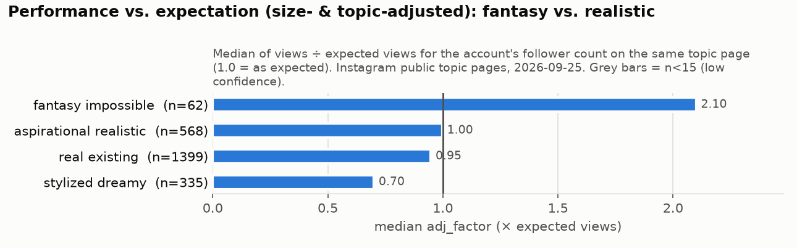
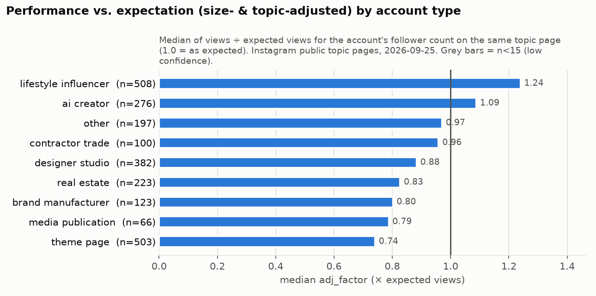
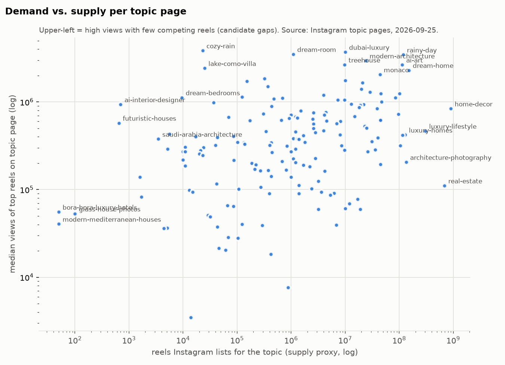
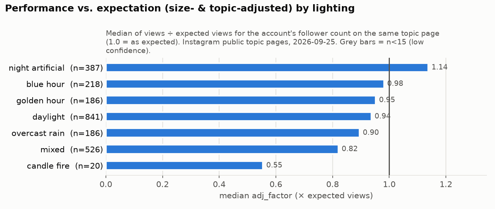
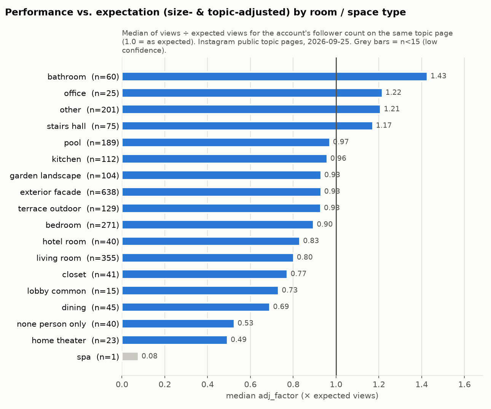

# 08 – Content Pillars (Teil 24)

> **Stand:** 25.09.2026 · **Datenbasis:** 2.498 Reels von 239 öffentlichen Instagram-Topic-Seiten (2.393 per Cover-Frame und Caption codiert), 1.985 Accounts, YouTube-Shorts als Proxy · **Hauptmetrik:** `adj_factor` = Views im Verhältnis zur Erwartung für die Accountgröße auf derselben Topic-Seite (1,0 = erwartbar, 2,0 = doppelt so viel)
> **Zahlenquellen:** [analysis_digest.md](data/processed/analysis_digest.md), [strategy_brief.md](data/processed/strategy_brief.md), [key_contrasts.csv](data/processed/stats/key_contrasts.csv). Für die Pillar-Proxys neu berechnet mit [scripts/pillar_style_stats.py](scripts/pillar_style_stats.py) aus [04_reel_database.csv](04_reel_database.csv): [pillar_benchmarks.csv](data/processed/stats/pillar_benchmarks.csv), [ai_segments.csv](data/processed/stats/ai_segments.csv), [ai_style_contrasts.csv](data/processed/stats/ai_style_contrasts.csv).
> **Status-Tags:** `[VERIFIED]` öffentliche Views und Follower (gerundet angezeigt) · `[ESTIMATED]` KI-gestützte Codes (Reliabilität κ 0,63–1,0) und eigene Ableitungen · `[THIRD-PARTY ESTIMATE]` Angaben Dritter · `[PROXY]` YouTube-Daten · `[UNKNOWN]` nicht messbar.
> **Verwandte Teile:** Style Guide (Teil 23) in [11_brand_style_guide.md](11_brand_style_guide.md) · KPI-System und Entscheidungsregeln (Teil 30/31) in [15_kpi_framework.md](15_kpi_framework.md) · Produktions-Pipeline in [16_automation_strategy.md](16_automation_strategy.md)

---

## 0. Kurzfassung

**Die Pillars sind nach Konzept und Format geschnitten, nicht nach Raumtyp.** Grund: Was gezeigt wird (Stil, Raum, Ort), erklärt in den Daten wenig. Die Kruskal-Wallis-Tests auf den größenbereinigten Wert sind nicht signifikant: Stil p = 0,17, Raum p = 0,93, Location p = 0,95. Wie es gezeigt wird, erklärt mehr: Realismusgrad p = 0,001, Account-Typ p = 0,00003. Beide halten der Bonferroni-Schwelle von p ≈ 0,0019 stand ([Digest §1](data/processed/analysis_digest.md)).

| # | Pillar | Flagship-Serie | Versprechen an den Zuschauer | Anteil 30 Tage | Reels (von 90) | Hauptziel | Datenlage |
|---|---|---|---|---|---|---|---|
| **P1** | Impossible Homes | `UNBUILT No. ###` | „Homes that shouldn't exist (yet)“ | 35 % | 32 | Reichweite, Sends, Follows | **stark:** KI-Fantasy 2,27 (n = 53) gegenüber KI-dreamy 0,70; Kontrast 3,25×, signifikant |
| **P2** | Pick One | `PICK ONE No. ###` | 3 Varianten, du entscheidest | 20 % | 18 | Kommentare, Community, Brücke zum Commerce | **stark für Kommentare** (5,7× pro View, signifikant); **Views nicht belastbar** |
| **P3** | Dream Builds | `FROM NOTHING No. ###` | vom leeren Ort zum Traumort (Garten, Pool, Bad) | 20 % | 18 | Watch Time, Saves, kaufbare Stücke | **Richtung:** KI Outdoor/Bad/Treppe/Pool 2,07× gegenüber Schlaf-/Wohnzimmer/Küche (post-hoc gebildet) |
| **P4** | Night Stories | `AFTER DARK No. ###` | der Moment, in dem das Licht angeht | 15 % | 13 | Signatur, Sends, Follows | **schwach bis mittel:** Nachtlicht 1,21×, nicht signifikant; nur bei KI 1,55× (p = 0,046, post-hoc) |
| **P5** | Wildcards | wechselnd | Explorationsbudget | 10 % | 9 | neue Gewinner finden | explorativ |
| *(P6)* | *Statement Rooms (Reserve)* | *`THE ROOM No. ###`* | *ein baubarer Hero-Raum rund um kaufbare Stücke* | *Pilot mit 4 Reels innerhalb von P3* | – | *Saves, Affiliate* | *Richtung:* KI Treppe/Bad 2,39× gegenüber Schlaf-/Wohnzimmer/Küche (post-hoc, p = 0,0075) |

**Präzisierungen gegenüber dem Strategy Brief (datengestützt, Richtung und Anteile bleiben gleich):**

1. **P1:** Klippe und Unterwasser sind **kein Standard-Setting**. KI-Reels mit Klippe liegen bei 0,48 (n = 35), Unterwasser bei 0,39 (n = 7, geringe Konfidenz). Die Topic-Seite `house-on-cliff` hat einen Median von nur 226 Views. Berg und Küste liegen dagegen bei 1,80 (n = 59, post-hoc).
2. **P4:** Das Thema ist **Nachtlicht mit Figur**, nicht Penthouse oder Skyline. Penthouse liegt bei 0,57 (n = 39), KI-Skyline bei 0,77 (n = 49).
3. **P5:** Der Preis-Hook ist nur mit **realen Produktpreisen** erlaubt, nie mit Preisen für fiktive Häuser ([q07](quellen/q07_legal_ai_risk.md) §2.6, [16](16_automation_strategy.md) §4.5).
4. **P6 „Statement Rooms“** ist als **Reserve-Pillar** angelegt. Die Daten reichen für eine Richtung, aber in 30 Tagen mit 90 Reels kostet jede zusätzliche Pillar Stichprobe. Bei n = 12 je Stufe ist erst ein Effekt ab etwa ×3,3 erkennbar ([15 §4.6](15_kpi_framework.md)).

---

## 1. Methode, Proxys und Grenzen

### 1.1 Warum Konzept und Format die Pillars bestimmen

- Der **Realismusgrad** ist der stärkste inhaltliche Unterschied im Datensatz: fantasy/impossible 2,10 (n = 62), aspirational realistic 1,00 (n = 568), real existing 0,95 (n = 1.399), stylized dreamy 0,70 (n = 335). Der Kruskal-Test ergibt p = 0,001 und ist damit robust. `[ESTIMATED – Codes]`
- Der **Account-Typ** ist der zweite robuste Faktor. Theme-Pages liegen bei 0,74 (n = 503), AI-Creator bei 1,09 (n = 276), Lifestyle-Accounts bei 1,24 (n = 508). Kontrast Theme-Page zu AI-Creator: 0,68× (95-%-KI 0,42–0,90, p = 0,0005). **Folge für alle Pillars:** Jede Pillar braucht eine Serien-Identität (Name, Nummer, Signatur). Eine anonyme Bildstrecke reicht nicht.

- **Nicht signifikant** und deshalb **kein** Schnittkriterium für Pillars: Stil, Raum, Ort, Farbtemperatur, Caption-Hook, CTA, Posting-Zeit ([Digest §1](data/processed/analysis_digest.md), Kruskal-Tabelle). Raum und Stil dienen innerhalb der Pillars als *Setting*. Die KI-spezifischen Raum- und Stil-Unterschiede sind post-hoc gebildet und nur als Richtung zu lesen (§3).

### 1.2 Pillar-Proxys: Mit welchen Segmenten wir jede Pillar vergleichen

Es gibt noch keine eigenen Reels. Jede Pillar wird deshalb mit einem oder mehreren **vergleichbaren Segmenten** aus dem Research verglichen. Das sind **Näherungen**, nicht die Pillars selbst.

| Pillar | Proxy-Segment(e) | Datei |
|---|---|---|
| P1 | KI + `fantasy_impossible`; KI + `unusual_structure`; KI + Berg/Küste; Topic-Gruppe `architecture` | [pillar_benchmarks.csv](data/processed/stats/pillar_benchmarks.csv) |
| P2 | Caption-Hook `choice` (alle / KI) | dito, [key_contrasts.csv](data/processed/stats/key_contrasts.csv) |
| P3 | KI + Raum Garten/Terrasse/Pool/Bad/Treppe; KI + Transformations-Schlagworte in der Caption (explorativ, Regex im Skript) | dito |
| P4 | Licht `night_artificial` (alle / KI); KI + Nacht + Person; `city_lights`, Skyline, Penthouse als Gegenprobe | dito |
| P5 | Topic-Gruppe `cozy_ambience`, Money-Hook, Locations | dito |
| P6 | KI + Raum Treppe/Halle oder Bad | dito |

**Mehrfachtest-Hinweis:** In [ai_style_contrasts.csv](data/processed/stats/ai_style_contrasts.csv) stehen 18 zusätzliche, post-hoc gebildete KI-Kontraste. Bei 18 Tests liegt die Bonferroni-Schwelle bei p ≈ 0,0028. Diese Schwelle unterschreitet nur der Kommentar-Kontrast der Choice-Hooks (p ≈ 6 × 10⁻⁸). Alles andere aus dieser Datei ist **Richtung**, keine Tatsache.

### 1.3 Wie die Potenzial-Ratings (1–5) entstehen

Shares, Saves und Follows sind öffentlich **nicht sichtbar** `[UNKNOWN]`. Die Ratings sind deshalb **begründete Schätzungen** `[ESTIMATED]` aus Proxys:

| Potenzial | Proxy im Research | Warum dieser Proxy | Grenze |
|---|---|---|---|
| **Share** | `share_viral_5x`: Anteil der Reels mit Views ≥ 5× Follower; dazu `adj_factor` | Views weit über die eigene Basis hinaus heißt Reichweite bei Nicht-Followern. Laut Mosseri sind dort *"sends"* etwas wichtiger als Likes ([q01](quellen/q01_instagram_platform_rules.md), `[VERIFIED – Sekundärquelle]`). | Viral-Quote ist bei kleinen Accounts strukturell höher. Nur innerhalb der Proxys vergleichen. |
| **Save** | Referenzwert: Ist das Gezeigte nachbaubar oder kaufbar (`shoppability`)? | Saves sind Merk- und Referenzverhalten. Laut [q09](quellen/q09_reels_format_benchmarks.md) sind Saves eher eine Karussell-Stärke (Save-Rate Reels 0,04 % vs. Karussells 0,05 % pro Follower). | reine Plausibilität |
| **Follow** | Serien- und Identitätslogik; Theme-Page vs. AI-Creator 0,68× | Follows entstehen, wenn ein wiederholbares Versprechen erkennbar ist. | Follows pro Pillar erst im eigenen Test messbar (F/1k, [15 §3.1](15_kpi_framework.md)) |
| **Affiliate** | Anteil `shoppability = high`; Matching-Problem „similar vs. exact“ ([q02](quellen/q02_furniture_affiliate_commerce.md)) | Nur sichtbar kaufbare Stücke lassen sich verlinken. | Umsätze `[UNKNOWN]` bis Monat 2 |

Skala: **1** = kaum vorhanden · **3** = mittel · **5** = Kernstärke der Pillar.

### 1.4 Was „typische Views“ in diesem Dokument bedeutet

- **Selektionsbias:** Topic-Seiten zeigen die **Top-Reels** eines Themas. Alle Views unten sind Benchmarks von Reels, die es auf eine Topic-Seite geschafft haben. Sie sind **keine Prognose** für unsere Reels. `[VERIFIED Views; Auswahl verzerrt nach oben]`
- Wir nennen je Proxy **Median, Interquartilsabstand (IQR, P25–P75) und P90**. Dazu kommt die Teilmenge **Accounts unter 100K Follower**, weil sie unserer Lage näher ist.
- **Erwartung für den Start:** Marken-Accounts mit 1–5K Followern erreichen im Schnitt **580–658 Views pro Reel** ([q09](quellen/q09_reels_format_benchmarks.md) §3.1, Socialinsider `[VERIFIED]`, keine KI-Theme-Pages). Die Launch-Bänder für views_24h stehen in [15 §3.2](15_kpi_framework.md): Wochen-Median < 200 / 200–1.000 / 1.000–5.000 / ≥ 5.000.
- **Bewertet werden Pillars deshalb relativ:** über `account_index`, Gruppen-Index und NS-Index aus [15 §4.1](15_kpi_framework.md), nicht über absolute Views.

---

## 2. Scorecard: alle Pillars auf einen Blick

Views gerundet; Quelle [pillar_benchmarks.csv](data/processed/stats/pillar_benchmarks.csv). Views-Spalten gelten für Top-Page-Reels, Ratings sind `[ESTIMATED]`.

| Pillar (Haupt-Proxy) | n | adj (Median) | Views Median (IQR) | Views Median, Accounts < 100K (n) | Viral ≥ 5× | Kommentare/View | Kaufbar „high“ | Share | Save | Follow | Affiliate |
|---|---|---|---|---|---|---|---|---|---|---|---|
| **P1** KI fantasy/impossible | 53 | **2,27** | 320 Tsd. (20 Tsd.–2,1 Mio.) | 35 Tsd. (29) | 49 % | 0,04 % | 0 % | **5** | 2 | **4** | 1 |
| **P2** KI Choice-Hook | 26 | 1,37 | 259 Tsd. (50–564 Tsd.) | 162 Tsd. (22) | **68 %** | **0,46 %** | 15 % | 4 | 3 | 3 | **4** |
| **P3** KI Garten/Terrasse/Pool/Bad/Treppe | 137 | 1,45 | 514 Tsd. (103 Tsd.–1,7 Mio.) | 267 Tsd. (69) | 52 % | 0,02 % | 12 % | 4 | **4** | 3 | 3 |
| **P4** KI Nachtlicht | 93 | 1,27 | 313 Tsd. (63–838 Tsd.) | 211 Tsd. (57) | 46 % | 0,03 % | 16 % | 3 | 2 | 3 | 2 |
| **P5** z. B. KI Cozy-Topics | 47 | 0,68 | 147 Tsd. (47–853 Tsd.) | 102 Tsd. (28) | 43 % | 0,04 % | 2 % | 3 | 2 | 2 | 2 |
| *(P6)* KI Treppe/Halle oder Bad | 44 | 1,67 | 350 Tsd. (103 Tsd.–1,3 Mio.) | 295 Tsd. (28) | 55 % | 0,01 % | **30 %** | 3 | **4** | 3 | **4** |
| *Referenz:* alle KI-Reels | 694 | 0,87 | 194 Tsd. (27–900 Tsd.) | 79 Tsd. (384) | 37 % | 0,04 % | 12 % | | | | |
| *Referenz:* KI Schlaf-/Wohnzimmer/Küche (Ursprungskonzept) | 266 | 0,70 | 118 Tsd. (22–606 Tsd.) | 57 Tsd. (160) | 34 % | 0,03 % | 24 % | | | | |

Zu den n: n = Reels im Segment; adj fehlt bei den Pillar-Proxys für 0–3 Reels, bei der Referenz „alle KI-Reels“ für 8 (Details in der CSV).

**Lesehilfe:**
- P1 hat den höchsten größenbereinigten Wert, aber die **breiteste Streuung**: Der IQR reicht von 20 Tsd. bis 2,1 Mio. Die Pillar ist hit-getrieben, und bei kleinen Accounts liegt der Median nur bei 35 Tsd.
- P3 und P6 zeigen bei kleinen Accounts die höchsten Mediane. Das ist die **stabilere, aber weniger spektakuläre** Reichweite.
- Die Referenzzeile unten ist das Ursprungskonzept (KI-Luxus-Schlaf-/Wohnzimmer/Küchen). Es ist der schwächste KI-Bereich, deshalb ist es keine Pillar.

---

## 3. Pillar-Steckbriefe

### P1 – Impossible Homes · Flagship `UNBUILT No. ###`

**Kernidee:** Pro Folge ein Originalentwurf, der **genau eine Architekturregel bricht** (Schwerkraft, Material oder Ort). Gezeigt werden außen und innen, mit laufender Nummer. Die Unmöglichkeit muss **im ersten Frame** lesbar sein.

**Rein:**
- in einen Findling oder Fels gebaut
- Auskragung über Leere, Turm in der Landschaft, hängendes Haus
- Haus rund um einen Wasserfall, Treppenhaus in den Berg
- Settings: Berg, Küste und (als Test) über den Wolken

**Raus:**
- die generische „Glasvilla mit Infinity-Pool und Meerblick“ (Belege siehe Style Guide)
- die Klippen-Villa als Default
- Unterwasser als Default
- das Label „futuristic house“ ohne Konzept (Belege in der Tabelle)

**Ziel:** Reichweite bei Nicht-Followern, Sends und Follows. P1 ist die Pillar, die das Markenversprechen trägt.

**Evidenz**

| Befund | Wert | n | Einordnung |
|---|---|---|---|
| KI fantasy/impossible vs. KI stylized dreamy | 3,25× (95-%-KI 1,75–5,58), p = 0,001 | 53 vs. 305 | signifikant `[ESTIMATED – Codes]` |
| KI fantasy/impossible vs. KI aspirational realistic | 2,53× (1,29–3,92), p = 0,008 | 53 vs. 328 | nominal signifikant (nicht Bonferroni-robust) |
| Topic-Gruppe Architektur: Anteil Top-Reels < 180 Tage | 57 %; neue Reels adj 1,53 (n = 34), davon 44 % KI | 60 | zweitfrischeste Gruppe nach Deko/Commerce (60 %) ([Digest §2](data/processed/analysis_digest.md)) |
| Topic-Gruppe Future-Architecture | 22 % frisch; neue Reels adj 0,59 (n = 26) | 119 | Label „futuristic“ allein ist verbraucht |
| KI + Berg/Küste vs. übrige KI | 1,80 vs. 0,82 → 2,21× (1,09–2,76), p = 0,018 | 59 vs. 627 | post-hoc, Richtung |
| KI + Klippe | 0,48 (Kontrast 0,55×, p = 0,27) | 35 | nicht signifikant, aber klar unter 1 |
| KI + `unusual_structure` | 1,10 | 98 | Richtung |
| Nachfrage: Topic-Mediane (Top-12-Reels) | architecture 11,75 Mio. · modern-architecture 2,95 Mio. · treehouse 2,65 Mio. · underground-house 1,11 Mio. · futuristic-houses 575 Tsd. bei nur 650 Reels auf der Seite | je 12 | `[VERIFIED]` |
| Keine Suche nach dem Wort „impossible“ | impossible-architecture 486 · surreal-architecture 3.480 (Topic-Mediane) | je 12 | Fantasy-Inhalte unter **breiten** Nachfragebegriffen verpacken (architecture, dream home, underground house), nicht unter „impossible“ |
| YouTube: „Zukunftsarchitektur“ als eigenes Thema | 24 Shorts „futuristic house architecture AI“ im letzten Monat: 2–1.600 Views | Stichprobe | `[PROXY]` ([q08](quellen/q08_cross_platform_signals.md) §3.2) |
| Kaufbarkeit | 0 % high, 95 % low (alle fantasy/impossible) | 62 | kein Möbel-Affiliate |

**Typische Views (Benchmark, kein Versprechen):** KI fantasy/impossible, n = 53: Median **320 Tsd.**, IQR 20 Tsd.–2,1 Mio., P90 6,0 Mio. Bei Accounts unter 100K (n = 29): Median **35 Tsd.**, IQR 8,6–802 Tsd. KI + Berg/Küste (n = 60): Median 521 Tsd. `[VERIFIED Views; Auswahl der Top-Reels]`

**Potenzial**

| | Rating | Begründung |
|---|---|---|
| Share | **5** | Höchster adj unter den Haupt-Proxys der Scorecard (2,27). Viral-Quote 49 % gegenüber 37 % aller KI-Reels. „Hast du das gesehen?“ ist ein natürlicher Sende-Anlass. |
| Save | 2 | nicht nachbaubar, 0 % kaufbar |
| Follow | 4 | Einzigartiges Versprechen („Homes that shouldn't exist“) plus Studio-Identität. Die Nummerierung macht Folgen sammelbar. `[ESTIMATED]` |
| Affiliate | 1 (Möbel) | Kaufbarkeit 0 %. **Indirekt stark:** Zu KI-Tool-Programmen passt P1 am besten. Runway zahlt $15 pro Abo, Higgsfield bis 25 % Affiliate bzw. bis $2.500 pro Video über Earn ([q03](quellen/q03_sponsors_brand_deals.md) §2.4, `[VERIFIED]`). Dazu kommen B2B-Aufträge nach dem Vorbild @aiforarchitects ([q06](quellen/q06_ai_theme_page_case_studies.md) §2.1). |

**Serien (Konzeptfamilien für die Novelty-Engine):**
- `UNBUILT No. ###`: Flagship. Ein Haus pro Folge, fortlaufend nummeriert über alle Familien.
- `One Rule Broken`: Der Titel nennt die gebrochene Regel, z. B. *"No ground floor."*
- `The Way In`: Der Eingang ist das Rätsel. Wie betritt man dieses Haus?
- `Under Things`: Häuser unter oder in etwas, etwa einem Findling, einem See oder einem Wasserfall. Unterwasser nur als Test.
- `Above the Clouds`: Wolken- und Himmelshäuser. KI `space_sky` 3,42, aber n = 7: nur als Test.

**Reel-Formate** (Codes wie in [15 §5.2](15_kpi_framework.md)):
- `single_scene_ambience`: langsamer Push-in, 8–12 s.
- `multi_scene_montage`: außen → Schwelle → innen → Rückzug in die Nacht; 3–4 Einstellungen, 10–12 s.
- `house_tour` (20–30 s) frühestens im Längen-Test ab Woche 4 (`T03`).

**Anteil im 30-Tage-Test:** 35 % = **32 Reels** (Tage 1–14: 14 im faktoriellen Startdesign; Tage 15–30: 18).

**KPIs** ([15](15_kpi_framework.md)):
- primär: Gruppen-Index (`account_index`), Sends/Reach
- sekundär: F/1k, Skip Rate, % angesehen, Profilbesuche/View

**Kill-Kriterien:**
1. Die allgemeinen Regeln aus [15 §4.3](15_kpi_framework.md) gelten zuerst: POLICY-KILL sofort, KILL bei n ≥ 6, Gruppen-Index < 0,6, P(schlechter) ≥ 95 % und NS-Index < 0,6.
2. **Konzeptfamilie rotieren statt Pillar streichen:** Hat eine Familie bei n ≥ 6 einen Gruppen-Index < 0,8, bekommt sie 0 Slots. Die nächste Familie übernimmt.
3. **Pillar-KILL** nur, wenn **drei Familien** (n ≥ 18) die KILL-Bedingung aus Regel 2 in [15](15_kpi_framework.md) erfüllen. Dann ist das Kernkonzept widerlegt, und die Positionierung muss neu entschieden werden.
4. **Decay-Regel:** Fällt der Gruppen-Index der letzten 6 Reels einer Familie unter 0,6, nachdem er vorher ≥ 1,2 war, wird die Familie rotiert. Hintergrund ist der Formatverschleiß in [q06](quellen/q06_ai_theme_page_case_studies.md) §2.1 (z. B. @cozyzen.ai: 4,1 Mio. Views 2024 vs. 27 Tsd./18,3 Tsd. 2026) und im Strategy Brief §2.5.

**Beobachtete Beispiele → Prinzip → eigene Umsetzung** (Ausschnitte als Beleg, nicht zum Kopieren; Einzelfälle, n = 1)

| Beobachtet (Caption-Ausschnitt, Handle) | Kennzahlen | Prinzip | Unsere Formulierung (original) |
|---|---|---|---|
| „If only 'home sweet home' meant living in a tiramisu house.“ – @ifonly.ai | 136 Mio. Views, adj 200 | unmögliche Prämisse als Wunschsatz, ein einziges unbaubares Element | *"What if the walls were a waterfall?"* |
| „Luxury bunker built beneath a modern mansion.“ – @processlabstudio | 4,6 Mio., adj 26,8 | Verborgenes unter dem Bekannten | *"There's a second house under this lake."* |
| Gegenbeispiel: „Imagine pulling up to a massive 7-star superyacht... carved entirely out of solid desert rock.“ – @cypriot.ai | 20 Tsd., adj 0,03 | Fantasy allein reicht nicht. Superlativ-Stapel und Wüsten-Setting (KI-Wüste 0,68, n = 22). | eine Behauptung, kein Superlativ |
| Gegenbeispiel: „The Monolith of Grace: Redefining Form in Luxury Architecture“ – @harmosai | 9,6 Tsd., adj 0,007 | Architektur-Jargon statt Neugier | Alltagssprache |

Weitere eigene Hook-Zeilen (EN): *"This house has no ground floor."* · *"The only way in is through the rock."* · *"Nobody has built this. Yet."* · *"Built for one person. Nothing below but air."*

**Hook-Typen:**
- Standard: `curiosity` und `fantasy`. Curiosity liegt bei KI bei 1,50 (n = 67) vs. 0,84 für die übrigen Hooks; post-hoc und nicht belastbar.
- Der im Brief (§6) genannte Price-Hook gilt in P1 **nur** in der Form „reale Stücke, realer Preis“ (siehe P5 `Real Price`). Einen Preis für ein fiktives Haus gibt es nie ([q07](quellen/q07_legal_ai_risk.md) §2.6, [16 §4.5](16_automation_strategy.md)).

---

### P2 – Pick One · Flagship `PICK ONE No. ###`

**Kernidee:** Zwei bis vier Varianten **desselben** Raums oder Hauses. Kamera und Architektur bleiben gleich, Material- und Lichtcharakter wechseln. Der Zuschauer wählt A, B oder C. **Eine Variante enthält immer kaufbare Hero-Stücke** (Regel im [Style Guide](11_brand_style_guide.md), Abschnitt Möbel).

**Motive:** Statement-Räume wie Bad, Treppenhalle, Pool-Terrasse und Garten. Schlafzimmer sind **nur hier** erlaubt, wie im Brief festgelegt. KI-Schlafzimmer liegen bei 0,77 (n = 110) und sind gesättigt, der Choice-Mechanismus soll sie tragen.

**Ziel:** Kommentare und Community-Signal. Dazu die **Brücke zum Commerce**: Aus der Wahl entsteht die Stückliste der Gewinner-Variante per Story oder Link ab Monat 2.

**Evidenz**

| Befund | Wert | n | Einordnung |
|---|---|---|---|
| Kommentare pro View: Choice vs. andere Hooks (alle) | 5,67× (95-%-KI 2,05–14,3), p = 6 × 10⁻⁸ | 39 vs. 1.971 | **robust** ([key_contrasts](data/processed/stats/key_contrasts.csv)) |
| Kommentare pro View: Choice vs. andere (nur KI) | 13,6× (5,5–25,3), p = 6 × 10⁻⁸ | 25 vs. 526 | robust, post-hoc berechnet ([ai_style_contrasts](data/processed/stats/ai_style_contrasts.csv)) |
| Views: Choice vs. andere (adj) | 1,65× (0,87–4,67), p = 0,053 | 40 vs. 2.338 | **nicht belastbar** |
| Viral-Quote ≥ 5× | 60 % (alle) / 68 % (KI) vs. 38 % gesamt | 40 / 25 | Richtung |
| Anteil Choice-Hooks nach Tier | 3,3 % im Tier VIRAL vs. 0,9 % im Tier NORMAL | Tier-Tabelle | Richtung ([Digest §6](data/processed/analysis_digest.md)) |
| YouTube Choice-Titel | Median-Kanalindex 1,0 | 92 Shorts, 4 Kanäle | `[PROXY]` kein Views-Vorteil |
| Formatverschleiß | „Choose your dream bedroom“ (UnrealLife) erreichte einmal 22 Mio. und gilt heute als „ausgereizt“ | – | `[PROXY]` ([q08](quellen/q08_cross_platform_signals.md) §3.2) |
| CTA `comment_keyword` | Kommentare/View 0,20 % vs. 0,03 % ohne CTA; adj aber 0,86 | 145 | Kommentare ja, Reichweite nein. „Engagement bait“ wird laut [q01](quellen/q01_instagram_platform_rules.md) nicht empfohlen. |
| Kaufbarkeit | 17 % high (alle) / 15 % (KI) | 41 / 26 | Commerce-Brücke möglich |

**Typische Views (Benchmark):** KI-Choice, n = 26: Median **259 Tsd.**, IQR 50–564 Tsd., P90 3,1 Mio. Accounts unter 100K (n = 22): Median **162 Tsd.**, IQR 41–413 Tsd. Alle Choice-Reels (n = 41): Median 232 Tsd. `[VERIFIED Views; Auswahl der Top-Reels]`

**Potenzial**

| | Rating | Begründung |
|---|---|---|
| Share | 4 | Höchste Viral-Quote unter den Proxys (68 %, n = 25). Die Wahl lädt ein, den Partner oder Freund zu fragen. |
| Save | 3 | Variantenvergleich als Referenz; nicht belegt |
| Follow | 3 | Kommentare sind keine Follows. Risiko „Engagement ohne Follow“: F/1k beobachten ([15](15_kpi_framework.md) Regel 5). |
| Affiliate | **4** | Die Variante mit realen Stücken wird zur Stückliste. Research-Beispiel für Kommentar → DM: @roomify.design, „kuratierte Wayfair-Kollektion per DM“ (Strategy Brief §2.12). |

**Serien:**
- `PICK ONE No. ###`: Flagship.
- `Same Room, Three Lives`: dieselbe Architektur in drei Material-Geschichten.
- `Which Door?`: drei Eingänge ins selbe Haus.
- `Your Partner Picks`: Beziehungsmotiv, gezielt auf Sends und Tags ausgelegt.
- `Pick One: Real Pieces`: Alle Varianten bestehen aus realen Produkten, Commerce ab Monat 2.

**Reel-Format:** `choice_compare`.
- Fixe Kamera, 3 Varianten à ca. 3 s.
- In den Tagen 1–14 insgesamt 8–12 s, weil die Länge im Startdesign konstant bleibt ([15 §4.5](15_kpi_framework.md)).
- Labels nur „A / B / C“.
- **Kein Split-Screen:** Before/After-Split-Cover liegen bei 0,53 (n = 22; Kontrast nicht signifikant, p = 0,07, also nur Richtung). Die Varianten laufen nacheinander, als Cover dient die stärkste Variante.

**Anteil im 30-Tage-Test:** 20 % = **18 Reels** (Tage 1–14: 14; Tage 15–30: 4).

**KPIs:**
- primär: Kommentare/View, Gruppen-Index
- sekundär: F/1k, Sends/Reach
- ab Monat 2: Link-Klicks je Variante (Sub-ID, [15 §3.7](15_kpi_framework.md))

**Kill-Kriterien:**
1. Allgemeine Regeln aus [15 §4.3](15_kpi_framework.md).
2. **Mechanik-Check:** Liegen die Kommentare/View bei n ≥ 6 unter dem 1,5-Fachen des Konto-Medians der Nicht-P2-Reels, greift die Choice-Mechanik nicht. Das führt zu ITERATE: weniger Varianten (2 statt 3), größere Unterschiede zwischen ihnen, klarere Frage. Die Schwelle ist bewusst niedrig angesetzt; der Research-Kontrast liegt bei 5,7×.
3. **Reichweite ohne Follows:** Gruppen-Index ≥ 1,2, aber F/1k < 0,7× Konto → ITERATE nach Regel 5 in [15](15_kpi_framework.md): Serienkennung in den Hook, Profil prüfen.
4. **Decay:** Fallen die Kommentare/View der letzten 6 P2-Reels unter 50 % der ersten 6, werden Motiv und Mechanik rotiert (Beleg: der Verschleiß bei UnrealLife, s. o.).
5. **POLICY:** Wertet Instagram Keyword-CTAs als Engagement-Bait (Hinweis im Account Status), wird der CTA sofort gestoppt.

**Beobachtete Beispiele → Prinzip**

| Beobachtet | Kennzahlen | Prinzip | Unsere Formulierung (original) |
|---|---|---|---|
| „Which GTA house would you rather to live in? 🤔“ – @soldbytyler | 8,8 Mio. Views, 733× Follower, adj 91,8 | Wahl zwischen **bekannten** Referenzen senkt die Denkhürde | *"Same stair. Three moods. Which one is you?"* |
| Cover: „If you really know your wife, which house is she choosing?“ – @wayup_media | 10,2 Mio., adj 13,8 | Wahl plus Beziehung ergibt einen Sende-Anlass | *"Pick the one your partner would pick. Then ask them."* |

Weitere Zeilen (EN): *"Three baths. You only get one. A, B or C?"* · *"Same mountain, three houses. Which one are you moving into?"*

---

### P3 – Dream Builds · Flagship `FROM NOTHING No. ###`

**Kernidee:** Ein leerer oder roher Ort wird in 3–4 Stufen zum Traum-Außenraum, Bad oder Pool. Beispiele: ein Felsvorsprung, ein verwilderter Hof, ein Rohbau-Bad. Der **Bogen von Tag zu Nacht** endet im Signatur-Nachtlicht.

**Ziel:** Watch Time (Spannung bis zum letzten Frame), Saves (Ideen zum Nachbauen) und kaufbare Outdoor- bzw. Bad-Stücke.

**Evidenz**

| Befund | Wert | n | Einordnung |
|---|---|---|---|
| KI Garten/Terrasse/Pool/Bad/Treppe vs. KI Schlaf-/Wohnzimmer/Küche | 1,45 vs. 0,70 → 2,07× (1,45–3,00), p = 0,0005 | 136 vs. 264 | Gruppierung **post-hoc** gebildet |
| KI-Räume einzeln | Garten 1,61 (43) · Bad 1,45 (28) · Pool 1,16 (23) · Terrasse 1,06 (26) · Treppe/Halle 2,24 (16) | klein | Richtung ([ai_segments.csv](data/processed/stats/ai_segments.csv)) |
| Raum über alle Reels | Kruskal p = 0,93 | 17 Räume | Raum an sich erklärt nichts; die Unterschiede zeigen sich nur innerhalb der KI-Reels |
| KI-Captions mit Transformations-Schlagworten | 1,18 vs. 0,78 → 1,51× (1,005–2,29), p = 0,064 | 144 vs. 542 | explorativ, nicht signifikant |
| YouTube-Titel „Transformation“ | Median-Kanalindex 1,15 | 268 Shorts, 10 Kanäle | `[PROXY]` |
| YouTube-Cluster „KI-Konzept-Bau/Transformation“ | 7 der 13 Kanäle haben unter 100K Abos und erreichen trotzdem Ø-Views ≥ 5× ihrer Abozahl; 10 von 13 erst 2026 gestartet | 13 | `[PROXY]` stärkstes, aber am schnellsten besetztes Cluster ([q08](quellen/q08_cross_platform_signals.md) §3.2) |
| Verschleiß bei Bau-Kanälen | BuildFlow: ältere Hälfte Median 4,4 Mio., neueste 6.690 · Buildenza: 7,75 Mio. vs. 1.237 | je 19–20 | `[PROXY]`, altersverzerrt ([Digest](data/processed/analysis_digest.md), YouTube-Abschnitt) |
| Cover mit Split-Screen / leerem Raum | 0,53 (n = 22) / 0,76 (n = 83) | | Erster Frame **nicht** als Split und nicht als leerer Raum ohne Spannung |
| Topic-Gruppe Garten/Outdoor | 45 % frisch; neue Reels adj 0,84 (n = 27) | 60 | gemischtes Signal |
| Kaufbarkeit | 12 % high, 56 % low | 137 | Outdoor-Möbel, Leuchten, Wannen |

**Typische Views (Benchmark):** KI Garten/Terrasse/Pool/Bad/Treppe, n = 136: Median **514 Tsd.**, IQR 103 Tsd.–1,7 Mio., P90 9,1 Mio. Accounts unter 100K (n = 69): Median **267 Tsd.**, IQR 40–973 Tsd. Das ist nach P6 (295 Tsd.) der zweithöchste Median für kleine Accounts in der Scorecard. `[VERIFIED Views; Auswahl der Top-Reels]`

**Potenzial**

| | Rating | Begründung |
|---|---|---|
| Share | 4 | Viral-Quote 52 %. Transformationen erzeugen „Schick das X“-Momente (siehe Beispiel @myplants.uae unten). |
| Save | **4** | Stufen und Stücke sind nachbaubar, ein klassischer Merk-Anlass `[ESTIMATED]` |
| Follow | 3 | Serienlogik (Nummer, ein neuer Ort pro Folge) |
| Affiliate | 3 | 12 % kaufbar (high). Outdoor-Sofas, Leuchten, freistehende Wannen. Möbel-Provisionen sind dünn: Amazon Home 3 %, Wayfair bis 7 % laut Drittquelle ([q02](quellen/q02_furniture_affiliate_commerce.md)). |

**Serien:**
- `FROM NOTHING No. ###`: Flagship.
- `Bare Ledge`: Felsvorsprung wird Terrasse mit Pool.
- `The Backyard Brief`: verwilderter Hof wird Garten.
- `Raw Bath`: Rohbau-Bad wird Stein-Spa.
- `Night Shift`: tagsüber gebaut, nachts fertig; der Tag-Nacht-Bogen ist hier das Hauptmotiv.

**Reel-Format:** `transformation_morph`.
- In den Tagen 1–14 **12 s** mit 4 Stufen à ca. 3 s. Das ist die Obergrenze des konstanten Längenkorridors im Startdesign (8–12 s, [15 §4.5](15_kpi_framework.md)) und die Untergrenze der 12–20 s aus dem Strategy Brief (§6).
- 13–20 s nur als Längentest (`T03`).
- **Erster Frame:** ein dramatischer Rohzustand mit kleiner Figur, kein banaler leerer Raum.
- Kein Split, die Stufen laufen nacheinander.

**Anteil im 30-Tage-Test:** 20 % = **18 Reels**.
- Tage 1–14: 14 `FROM NOTHING`.
- Tage 15–30: 4 Reels als **Pilot für P6 „The Room“** (§4).

**KPIs:**
- primär: % angesehen bzw. Completion Rate, Saves/Reach
- sekundär: Gruppen-Index, Sends/Reach, F/1k
- ab Monat 2: Klicks pro 1.000 Reach

**Kill-Kriterien:**
1. Allgemeine Regeln aus [15 §4.3](15_kpi_framework.md).
2. **Spannungs-Check:** Liegen bei n ≥ 6 sowohl % angesehen als auch Saves/Reach unter dem Konto-Median, folgt ITERATE: weniger Stufen, stärkerer erster Frame, die Endstufe früher andeuten.
3. **Decay:** Fällt der Gruppen-Index der letzten 6 unter 0,6, nachdem er vorher ≥ 1,2 war, wechseln Ortstyp oder Raum (Beleg: BuildFlow, Buildenza).
4. **POLICY/Legal:** Keine Behauptung, etwas sei real gebaut worden. Plausible Orte und Objekte können nach dem AI Act Deepfakes sein ([q07](quellen/q07_legal_ai_risk.md) §2.1). Jede Folge wird deshalb als *concept* gekennzeichnet.

**Beobachtete Beispiele → Prinzip**

| Beobachtet | Kennzahlen | Prinzip | Unsere Formulierung (original) |
|---|---|---|---|
| „From Empty Cliff to Private Beach Mansion 🤯 No Music. Just Pure Construction.“ – @epocraftdiy | 445 Tsd., 619× Follower, adj 330 (höchster adj im Datensatz) | Start- und Endzustand stehen im ersten Satz; dazu ein ungewöhnliches Audio-Versprechen | *"A bare ledge. Four steps. One pool you'd never leave."* |
| „I Turned Old Pallets into the ULTIMATE Backyard Oasis! 😱✨“ – @cairo_ia | 81,1 Mio., adj 164 | billiger Ausgangsstoff, Luxus-Ergebnis im Freien | *"Day one: rubble. Last frame: your evening."* |
| „Send this to someone who'd turn a small garden into their dream escape 🌺✨“ – @myplants.uae | 15,6 Mio., adj 37,4 | Der Sende-Anlass steht im ersten Satz | *"Send this to the person who keeps saying 'one day'."* |
| Gegenbeispiel: „From raw concrete to a fully alive luxury living space ⚡✨ …“ – @designing_factory_ | 12 Tsd., adj 0,03 | Transformation eines **Wohnzimmers**; KI-Wohnzimmer liegen bei 0,69 (n = 123) | Wohnzimmer nicht als P3-Motiv |

---

### P4 – Night Stories · Flagship `AFTER DARK No. ###`

**Kernidee:** Die Nacht wird zur Handlung. Jemand kommt an, das Licht geht Raum für Raum an, eine Figur steht im warmen Fenster. Die Architektur stammt aus der P1/P3-Welt, **die Story ist der Lichtmoment**.

**Abgrenzung:** Nachtlicht ist ohnehin der Signatur-Look **aller** Pillars ([Style Guide](11_brand_style_guide.md), Abschnitt Licht). P4 ist die Pillar, in der das Licht selbst das Ereignis ist.

**Ziel:** ästhetische Signatur und Wiedererkennung, Sends, Follows.

**Evidenz**

| Befund | Wert | n | Einordnung |
|---|---|---|---|
| Nacht/Kunstlicht vs. Tageslicht (alle) | 1,21× (0,94–1,59), p = 0,12 | 387 vs. 841 | **nicht signifikant** |
| KI Nacht vs. übrige KI-Lichtarten | 1,27 vs. 0,82 → 1,55× (0,97–2,50), p = 0,046 | 93 vs. 593 | post-hoc; KI berührt 1 |
| Innerhalb derselben Accounts (Top-10 % vs. untere 50 %) | Nachtlicht +12 Pp · Skyline +16 Pp · City-Lights +13 Pp | 28 Top-Reels (Vergleich innerhalb von 25 Accounts) | kleines n, Richtung ([Digest §7](data/processed/analysis_digest.md)) |
| Gegenprobe KI City-Lights / KI Skyline / Penthouse (alle) | 0,96 (53) / 0,77 (49) / 0,57 (39) | | **Skyline und Penthouse sind kein Hebel** |
| Kerze/Kamin: alle / KI | 0,55 (20) / 0,32 (14, geringe Konfidenz) | | dunkle Cozy-Stimmung meiden |
| KI Nacht **mit Person** | 3,57 | **12** | geringe Konfidenz: Hypothese „Figur im erleuchteten Fenster“ |
| Licht (Kruskal, adj) | p = 0,09 | 7 Stufen | nicht signifikant |

**Typische Views (Benchmark):** KI Nachtlicht, n = 93: Median **313 Tsd.**, IQR 63–838 Tsd., P90 5,7 Mio. Accounts unter 100K (n = 57): Median **211 Tsd.**, IQR 40–470 Tsd. `[VERIFIED Views; Auswahl der Top-Reels]`

**Potenzial**

| | Rating | Begründung |
|---|---|---|
| Share | 3 | Viral-Quote 46 %. Stimmung als Sende-Anlass („das sind wir“) ist nicht belegt. |
| Save | 2 | wenig Referenzwert |
| Follow | 3 | Trägt die Signatur, die in allen Pillars wiederkehrt `[ESTIMATED]` |
| Affiliate | 2 | Leuchten sind kaufbar: 16 % high bei KI-Nacht. Leuchten als Hero-Stück (Style Guide) |

**Serien:**
- `AFTER DARK No. ###`: Flagship.
- `Lights On`: Das Haus erwacht Raum für Raum, locked-off.
- `Arrival`: Eine Figur kommt nachts an, die Kamera folgt nicht, sie wartet.
- `The Late Room`: ein Statement-Raum (Bad, Treppe) zur späten Stunde. Schlaf- und Wohnzimmer meiden: KI 0,77 bzw. 0,69.

**Reel-Format:**
- `single_scene_ambience`, 8–12 s, locked-off oder langsamer Push-in.
- Das Einschalten des Lichts ist der visuelle Hook und passiert in der **ersten Sekunde** (`visual_hook` = `motion_immediate`).
- Das Ende ist der Signatur-Pull-back ([Style Guide](11_brand_style_guide.md)).

**Anteil im 30-Tage-Test:** 15 % = **13 Reels**, alle in den Tagen 15–30. In den Tagen 1–14 steckt der Nachtlook bereits als Stil in P1–P3. P4 wird danach als eigenständige Story-Pillar geprüft.

**KPIs:**
- primär: Sends/Reach, F/1k
- sekundär: Gruppen-Index, % angesehen

**Kill-Kriterien:**
1. Allgemeine Regeln aus [15 §4.3](15_kpi_framework.md).
2. **Signatur-Check:** Liegen bei n ≥ 6 der Gruppen-Index unter 0,8 **und** Sends/Reach unter dem Konto-Median, bekommt P4 0 Slots. Das Nachtlicht bleibt als Stil in P1–P3 erhalten, die Signatur geht also nicht verloren.
3. **Stil-Rückkopplung:** Schneiden Nachtvarianten im Stil-Faktor des Startdesigns ([15 §4.5](15_kpi_framework.md)) signifikant schlechter ab als Blue-Hour- oder Tagvarianten, muss der Style Guide geprüft werden, nicht nur P4.

**Beobachtete Beispiele → Prinzip**

| Beobachtet | Kennzahlen | Prinzip | Unsere Formulierung (original) |
|---|---|---|---|
| „Still awake? Maybe tonight isn't asking you to figure everything out. 🌧️🌙“ – @relaxationreflections_ | 6,0 Mio., 500× Follower, adj 71,5 | Der Nachtmoment spricht den Zuschauer persönlich an | *"Nobody lives here yet. The lights still come on at nine."* |
| Cover: „Wait for it !!!! 🗽🌇🥹“ – @clarazrd (reales Video) | 72,1 Mio., adj 32,5 | Warte-Versprechen auf den Lichtmoment. Einzelfall; Penthouse ist im Schnitt schwach (0,57) | *"Wait for the second light."* |

---

### P5 – Wildcards · wechselnde Serien

**Kernidee:** 10 % Explorationsbudget für Hypothesen außerhalb der Kern-Pillars. In Monat 1 bekommt jedes Thema **höchstens 3 Reels**. Ein Hit führt zu einer Test-Serie.

**Ziel:** den nächsten Gewinner finden, bevor eine Kern-Pillar verschleißt (Novelty-Engine, Strategy Brief §2.5).

**Kandidaten und Datenlage**

| Thema (Arbeitstitel) | Daten | Warum Wildcard statt Pillar | Monat 1 |
|---|---|---|---|
| **Named Setting** („Unbuilt in the Swiss Alps“, Dubai, Tokyo, Tulum) | Schweiz 1,84 (n = 16) · Dubai/VAE 1,10 (n = 97) · Tokyo 1,19 (n = 15) · Tulum 1,24 (n = 15); Location Kruskal p = 0,95; reiner Location-Hook 0,63 (n = 161) | Ort nicht signifikant. Er dient als **Setting**, nie als Tatsachenbehauptung, nur als *"imagined in …"* ([q07](quellen/q07_legal_ai_risk.md) §2.6, [16 §4.5](16_automation_strategy.md)). | **3 Reels** |
| **Sky Homes** (über den Wolken) | KI `space_sky` 3,42 (n = 7) · Cyberpunk (alle) 3,04 (n = 15) | n sehr klein | **3 Reels** |
| **Real Price** (Money-Hook mit realen Stückpreisen) | Money 1,19 (n = 82), Kontrast 1,28×, p = 0,15; Status 1,37 (n = 37); KI-Money n = 5 | nicht signifikant. Preise **nur** für real kaufbare Produkte mit Datum und dem Hinweis „similar, not exact“, wo nötig ([16](16_automation_strategy.md), [q02](quellen/q02_furniture_affiliate_commerce.md)) | **3 Reels** |
| Cozy Night Retreat | Cozy-Gruppe: Median 594 Tsd. Views (n = 97), Likes/View 7,0 %. KI-Cozy aber adj 0,68 (n = 44); Regen/Schnee/Kamin bei KI 0,76× (n.s.); Hit-Decay laut [q06](quellen/q06_ai_theme_page_case_studies.md) | gesättigt, laut Brief nur Nebenserie | Reserve |
| Material Spectacle | YouTube-Cluster: einzelne Hits bis 249 Mio., Median der Kanal-Mediane nur 79 Tsd. | `[PROXY]`, Hit-Lotterie ([q08](quellen/q08_cross_platform_signals.md) §3.2) | Reserve |

**Typische Views (Benchmark):** stark themenabhängig.

| Proxy | n | Median |
|---|---|---|
| Dubai/VAE | 99 | 373 Tsd. |
| Schweiz | 17 | 1,2 Mio. (nur 4 davon von Accounts < 100K) |
| Money-Hook | 82 | 234 Tsd. |
| KI-Cozy | 47 | 147 Tsd. |

**Potenzial:** je nach Thema. Share 3, Save 2, Follow 2 (Risiko: Das Thema passt nicht zum Follow-Versprechen), Affiliate 2 (Real Price: 3–4) `[ESTIMATED]`.

**Format:** das Format der nächstliegenden Kern-Pillar (meist `single_scene_ambience` oder `multi_scene_montage`), mit derselben Signatur.

**Anteil im 30-Tage-Test:** 10 % = **9 Reels** (3 Themen × 3 Reels, alle in den Tagen 15–30).

**KPIs:** `account_index` pro Reel (Hit ≥ 2,0), F/1k.

**Promote/Kill** (eigene Regel, da n < 6 und damit kein Fall für die Gruppenregeln in 15):
- **Promote:** mindestens ein Hit (account_index ≥ 2,0) und F/1k ≥ Konto-Schnitt. Dann 6 weitere Reels als Replikation nach Regel 7 in [15](15_kpi_framework.md).
- **Kill:** kein Reel über account_index 1,0. Das Thema ruht dann 30 Tage.
- **Kein „Learning“ bei n = 3.** Ein einzelner Hit ist kein Beweis ([15 §4.6](15_kpi_framework.md)).

---

## 4. Reserve-Pillar P6 und geprüfte, aber nicht aufgenommene Kandidaten

### P6 – Statement Rooms · `THE ROOM No. ###` (Reserve)

**Kernidee:** Ein **realistisch baubarer**, aber spektakulärer Einzelraum wie eine Wendeltreppen-Halle aus Stein, ein Steinbad oder ein Innenpool. Der Raum wird rund um 1–3 kaufbare Hero-Stücke entworfen („Hero-Piece-First“, [Style Guide](11_brand_style_guide.md)). Damit ist P6 die „possible furniture“-Hälfte der Hybrid-Hypothese *„Impossible places, possible furniture“* (Strategy Brief §2.8).

| Befund | Wert | n | Einordnung |
|---|---|---|---|
| KI Treppe/Halle oder Bad vs. KI Schlaf-/Wohnzimmer/Küche | 1,67 vs. 0,70 → 2,39× (1,42–3,94), p = 0,0075 | 44 vs. 264 | post-hoc, Richtung |
| Alle Reels, Treppe/Halle oder Bad | 1,25 | 135 | Richtung |
| Kaufbarkeit | 30 % high (KI Treppe/Bad) vs. 12 % (alle KI) | 44 | stärkste Commerce-Eignung |
| Kaufbarkeit kostet keine Reichweite | KI high vs. low 1,22× (0,69–1,95), p = 0,78; alle 1,01×, p = 0,91 | | nicht signifikant, also kein Nachteil messbar |
| Nachfrage | luxury-bathroom-design: Topic-Median 1,13 Mio. (124 Tsd. Reels auf der Seite) | 12 | `[VERIFIED]` |

**Typische Views (Benchmark):** n = 44: Median **350 Tsd.**, IQR 103 Tsd.–1,3 Mio., P90 6,1 Mio. Accounts unter 100K (n = 28): Median 295 Tsd.

**Potenzial:** Share 3 · Save **4** · Follow 3 · Affiliate **4** `[ESTIMATED]`.

**Aktivierungsregel:**
1. Pilot mit 4 Reels in den Tagen 15–30 innerhalb des P3-Anteils.
2. Eigene Pillar ab Monat 2 mit 10 %, wenn der Median-account_index des Piloten ≥ 1,2 **und** Saves/Reach ≥ Konto-Median ist. Die Slots kommen von P5 oder P4, je nachdem, welche schwächer ist.
3. Ab n ≥ 6 gelten die Regeln aus [15 §4.3](15_kpi_framework.md).

### Geprüfte Kandidaten, die keine Pillar werden

| Kandidat | Daten | Entscheidung |
|---|---|---|
| Dream Bedrooms | KI-Schlafzimmer 0,77 (n = 110); stylized dreamy 0,70 (n = 335); dream-bedrooms zu 92 % KI | nur als Variante in P2 |
| Luxury Kitchens | KI-Küche 0,67 (n = 31) | nein |
| Wohnzimmer | KI 0,69 (n = 123) | nein, höchstens als Innenansicht in P1 |
| Hotels/Resorts | Hotelzimmer 0,83 (n = 40); Topic-Gruppe Hotel: neue Reels adj 0,71 (n = 76); dazu Irreführungsrisiko bei realen Namen ([q07](quellen/q07_legal_ai_risk.md) §2.4) | nein |
| Penthouse/Skyline | Penthouse 0,57 (n = 39); KI-Skyline 0,77 (n = 49) | nein, P4 auf Lichtmoment umgestellt |
| Cozy Ambience als Kern | KI-Cozy 0,68 (n = 44); 67 % der neuen Cozy-Top-Reels sind KI (Sättigung) | nur Wildcard |
| Future-Architecture-Label | Topic-Gruppe: neue Reels 0,59 (n = 26); YouTube ohne eigenes Nachfragesignal (`[PROXY]`) | nur als Konzept in P1, nicht als Label |
| Skandi/Organic/Japandi/Modern Luxury | KI 0,28 (16) / 0,57 (56) / 0,61 (15) / 0,79 (128); Gruppenkontrast 2,47× (p = 0,001, post-hoc) | als Stil ausgeschlossen (Style Guide) |
| Tutorials („How I made this“) | Instructional-Hook 0,72 (n = 74), KI 0,72 (n = 20). Kurse als Geschäftsmodell sind belegt, Umsätze aber `[UNKNOWN]` ([q06](quellen/q06_ai_theme_page_case_studies.md) §2.5) | frühestens ab Monat 3 als Test für digitale Produkte |

*Hinweis zum Chart:* Er zeigt **alle** Reels, also auch reale Aufnahmen. Die KI-spezifischen Raumwerte oben stammen aus [ai_segments.csv](data/processed/stats/ai_segments.csv).

---

## 5. Anteile im 30-Tage-Test (90 Reels, 3 pro Tag)

Die Anteile entsprechen dem Strategy Brief (35/20/20/15/10). Die Phasen folgen dem Testplan in [15 §4.5](15_kpi_framework.md): In den Tagen 1–14 läuft ein faktorielles Startdesign aus 3 Serien × 3 Hook-Typen × 3 Stilen. Ab Tag 15 kommen Champion-, Thompson- und Explorations-Slots dazu.

| Pillar | Anteil | Reels gesamt | Tage 1–14 (Startdesign, 42 Reels) | Tage 15–30 (48 Reels) | Hinweis |
|---|---|---|---|---|---|
| P1 Impossible Homes | 35 % | 32 | 14 (`UNBUILT`) | 18 | Konzeptfamilien rotieren |
| P2 Pick One | 20 % | 18 | 14 (`PICK ONE`) | 4 | danach nur als Champion oder nach Befund |
| P3 Dream Builds | 20 % | 18 | 14 (`FROM NOTHING`) | 4 (Pilot `THE ROOM`, P6) | |
| P4 Night Stories | 15 % | 13 | 0 (Nachtlook läuft als Stil in P1–P3) | 13 | |
| P5 Wildcards | 10 % | 9 | 0 | 9 (3 Themen × 3) | |
| **Summe** | **100 %** | **90** | **42** | **48** | |

**Regeln für die Taktung:**
- Pro Tag höchstens **1 Reel pro Pillar**; Ausnahme P1 mit bis zu 2.
- Champion-Slots (ab Tag 15: 7 pro Woche, [15 §4.5](15_kpi_framework.md)) zählen auf die Pillar des Champions. Die Anteile oben sind **Soll-Korridore mit ±5 Pp**, die Entscheidungsregeln haben Vorrang.
- **Nach Tag 30** gilt der Zielkorridor aus dem Brief: 60–70 % Reichweiten-Pillars (P1, P4) und 30–40 % Commerce-nahe Pillars (P2, P3, ggf. P6), je nach Ergebnis der Winner-DB.
- Varianten nie als identischen Re-Upload posten, sondern neu generieren ([15 §4.5](15_kpi_framework.md), [q01](quellen/q01_instagram_platform_rules.md)).

---

## 6. KPI- und Entscheidungsmatrix je Pillar (Zusammenfassung)

Die Reihenfolge der allgemeinen Regeln aus [15 §4.3](15_kpi_framework.md) gilt immer zuerst (POLICY → KILL → ITERATE → SCALE …). Die Pillar-Kriterien unten ergänzen sie um den **Zweck** der Pillar.

| Pillar | Primär-KPI | Sekundär | SCALE-Signal | ITERATE-Signal (Zweck verfehlt) | KILL |
|---|---|---|---|---|---|
| P1 | Gruppen-Index, Sends/Reach | F/1k, Skip Rate, % angesehen | Regel 4 (n ≥ 6, Index ≥ 1,5, P ≥ 95 %, F/1k ≥ Konto) → neue Konzeptfamilie als Serie | Familie mit Index < 0,8 bei n ≥ 6 → Familie rotieren | erst wenn 3 Familien (n ≥ 18) Regel 2 erfüllen |
| P2 | Kommentare/View, Gruppen-Index | F/1k, Sends/Reach, Link-Klicks je Variante (ab Monat 2) | Regel 4 plus Kommentare/View ≥ 2× Konto | Kommentare/View < 1,5× Konto-Median (n ≥ 6) | Regel 2 |
| P3 | % angesehen, Saves/Reach | Gruppen-Index, Sends/Reach, F/1k | Regel 4 → Längentest 13–20 s | % angesehen **und** Saves/Reach < Konto-Median (n ≥ 6) | Regel 2 |
| P4 | Sends/Reach, F/1k | Gruppen-Index, % angesehen | Regel 4 | – | Index < 0,8 **und** Sends/Reach < Konto-Median (n ≥ 6) → 0 Slots, Nachtlook bleibt |
| P5 | account_index je Reel | F/1k | Hit (≥ 2,0) und F/1k ≥ Konto → 6 Reels Replikation | – | kein Reel > 1,0 nach 3 Reels → Thema ruht 30 Tage |
| P6 | Saves/Reach, Klicks/1.000 Reach | Gruppen-Index | Aktivierung nach §4 | – | Regel 2 |

**Für alle Pillars:** Die Unfollow-Quote muss unter 20 % bleiben ([15 §3.6](15_kpi_framework.md)). Steigt sie, driftet die Pillar vom Follow-Versprechen weg.

---

## 7. Übergabe an Winner-DB und Pipeline

- **Serien:** In der Tabelle `series` ([15 §5.5](15_kpi_framework.md)) je Serie die Playbook-Pillar P1–P6 eintragen. Vorschlag für `series_id`: `S01_unbuilt`, `S02_pick_one`, `S03_from_nothing`, `S04_after_dark`, `S05_wild_<thema>`, `S06_the_room`.
- **Reel-Feld `pillar`:** bleibt die **Themengruppe** aus dem Research (z. B. `unusual_home`, `fantasy_dream`, `pool`, `luxury_room`), damit die eigenen Daten mit dem Research vergleichbar bleiben ([15 §5.2](15_kpi_framework.md), Feld 5).
- **Pipeline-Kürzel** ([16 §6](16_automation_strategy.md), Dateinamenkonvention, nennt Platzhalter, die an die Pillars anzupassen sind): `unb` (P1), `pick` (P2), `bld` (P3), `dark` (P4), `wild` (P5), `room` (P6).
**Formate je Pillar** (Codes wie in [15 §5.2](15_kpi_framework.md), Feld 10):

| Pillar | Format |
|---|---|
| P1 | `single_scene_ambience`, `multi_scene_montage` |
| P2 | `choice_compare` |
| P3 | `transformation_morph` |
| P4 | `single_scene_ambience` |
| P5 | Format der nächstliegenden Kern-Pillar |
| P6 | `single_scene_ambience` oder `house_tour` (Längentest) |

---

## 8. Risiken und offene Punkte

- **Selektionsbias und kleine n:** Alle Benchmarks stammen von Top-Page-Reels. Viele Pillar-Proxys haben n = 25–60. Die KI-Kontraste sind post-hoc gebildet. **Keine Kausalität:** Jede Pillar ist eine Hypothese, die erst die eigene Winner-DB bestätigt.
- **Account-Größe dominiert:** Views und Follower korrelieren mit Spearman ρ = 0,43. Die ersten Wochen liefern wenig Reichweite ohne Durchbruch (Brief §7).
- **Sättigung und Decay:**
  - KI-Anteil an den codierten Topic-Reels: 5 % (2023) → 33 % (2026) ([Digest §1](data/processed/analysis_digest.md)).
  - Bei YouTube-Kanälen liegen die neuesten Uploads teils 10–1.000× unter den Hits `[PROXY]`.
  - Deshalb die Decay-Regeln in jeder Pillar.
- **Legal/Plattform:**
  - KI-Kennzeichnung ab dem ersten Frame, weil plausible Orte und Objekte als Deepfake gelten können ([q07](quellen/q07_legal_ai_risk.md) §2.1).
  - Keine Preise für fiktive Objekte.
  - Keine realen Hotel- oder Markennamen (q07 §2.4 und §2.6).
  - Werbekennzeichnung „Werbung“ bzw. „Anzeige“ für einen Betreiber in Deutschland (q07 §2.7).
  - Engagement-Bait-Risiko bei Keyword-CTAs in P2 ([q01](quellen/q01_instagram_platform_rules.md)).
- **Marken und KI:** Die Begeisterung für KI-Creator-Content fiel von 60 % (2023) auf 26 % (2025) ([q03](quellen/q03_sponsors_brand_deals.md) §2.1, `[VERIFIED]`). Für P2, P3 und P6 sind Möbel-Affiliate und KI-Tool-Programme deshalb realistischer als Marken-Sponsoring.
- **Offen `[UNKNOWN]`:** Reel-Länge, Kamera und Audio sind auf Instagram im Research nicht messbar; es gibt nur Proxys. Ebenso offen: Wirkung des „AI info“-Labels auf die Reichweite ([q01](quellen/q01_instagram_platform_rules.md)); Verfügbarkeit von Affiliate-Reels für einen deutschen Account ([q01](quellen/q01_instagram_platform_rules.md) §8).

---

## Quellen

- [data/processed/analysis_digest.md](data/processed/analysis_digest.md): Segmenttabellen, Kruskal-Tests, Key Contrasts, Frische, Within-Account, Top-Reels, YouTube-Proxy
- [data/processed/strategy_brief.md](data/processed/strategy_brief.md): verbindliche Positionierung, Pillars P1–P5 und Start-Mix
- [data/processed/stats/key_contrasts.csv](data/processed/stats/key_contrasts.csv) · [pillar_benchmarks.csv](data/processed/stats/pillar_benchmarks.csv) · [ai_segments.csv](data/processed/stats/ai_segments.csv) · [ai_style_contrasts.csv](data/processed/stats/ai_style_contrasts.csv), erzeugt mit [scripts/pillar_style_stats.py](scripts/pillar_style_stats.py) (Bootstrap 2.000×, Seed 7)
- [04_reel_database.csv](04_reel_database.csv): Reel-Rohdaten mit Codes
- [q01](quellen/q01_instagram_platform_rules.md) Plattformregeln · [q02](quellen/q02_furniture_affiliate_commerce.md) Affiliate · [q03](quellen/q03_sponsors_brand_deals.md) Sponsoren · [q06](quellen/q06_ai_theme_page_case_studies.md) Fallstudien · [q07](quellen/q07_legal_ai_risk.md) Recht · [q08](quellen/q08_cross_platform_signals.md) Cross-Platform · [q09](quellen/q09_reels_format_benchmarks.md) Format-Benchmarks
- Charts: [adj_by_realism](charts/adj_by_realism.png), [adj_by_account_type](charts/adj_by_account_type.png), [topics_demand_vs_supply](charts/topics_demand_vs_supply.png), [adj_by_lighting](charts/adj_by_lighting.png), [adj_by_room](charts/adj_by_room.png)
