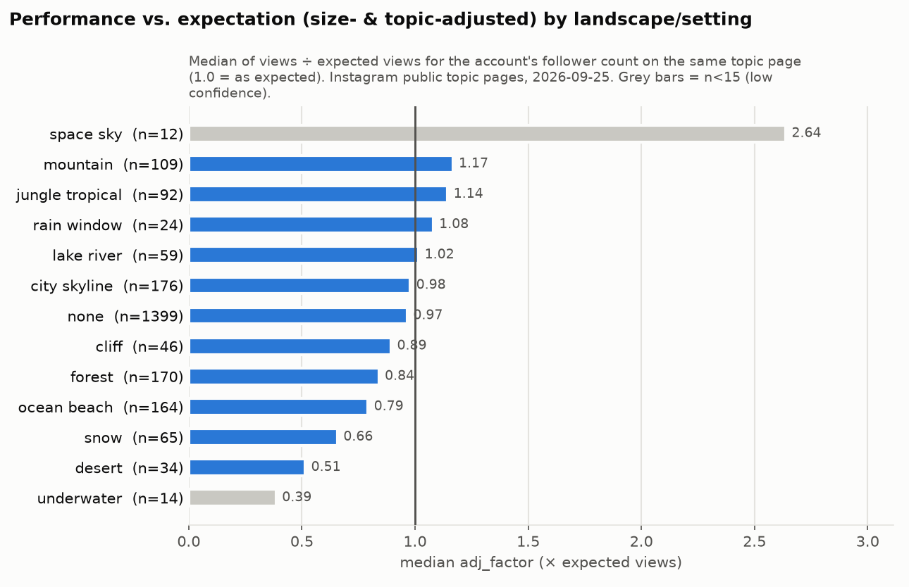

# 10 – Marktlücken: Micro-Niches und Account-Konzepte (Teil 21 + Teil 22)

> **Stand der Daten:** 25.09.2026 · **Basis:** 2.498 Reels von 239 öffentlichen Instagram-Topic-Seiten, davon 2.393 visuell
> codiert (694 als KI-generiert, 686 davon mit adj), 72 tief profilierte Accounts, 9 Recherche-Notizen.
> **Hauptmetrik:** `adj_factor` = Views relativ zur Erwartung für die Accountgröße auf derselben Topic-Seite (1,0 = erwartbar,
> 2,0 = doppelt) ([Strategy Brief §1](data/processed/strategy_brief.md)).
> **Neu für dieses Dokument:** [scripts/micro_niches.py](scripts/micro_niches.py) erzeugt
> [micro_niches.csv](data/processed/stats/micro_niches.csv) (alle Nischen-Kennzahlen),
> [topic_freshness.csv](data/processed/stats/topic_freshness.csv) (Frische und KI-Anteil je Topic-Seite) und
> [micro_niches_summary.json](data/processed/stats/micro_niches_summary.json) (Test „Ratio vs. Frische“).
>
> **Status-Tags:** `VERIFIED` = öffentlich angezeigte Views/Follower (gerundet) oder wörtliches Zitat · `ESTIMATED` =
> KI-gestützte Codierung, eigene Ableitung oder eigene Schwelle · `THIRD-PARTY ESTIMATE` = Zahl eines Dritten · `PROXY` =
> YouTube statt Instagram · `UNKNOWN` = nicht belegbar. **`*` = n < 15 (geringe Konfidenz).**
>
> **Sprache:** Analyse auf Deutsch. Hooks, Titel, Serien- und Account-Namen auf Englisch. Beobachtete Captions sind als
> *beobachtet* markiert (kurzer Ausschnitt + Handle). Daraus leiten wir nur das **Prinzip** ab; alle eigenen Hooks sind
> neu formuliert.

---

## Inhalt

- [0. Kurzfassung](#0-kurzfassung)
- **Teil 21 – Micro-Niches**
  - [1. Methode](#1-methode-teil-21)
  - [2. Nachfrage vs. Angebot: Warum die Ratio allein täuscht](#2-nachfrage-vs-angebot-warum-die-ratio-allein-täuscht-teil-21)
  - [3. Screening aller 22 Micro-Niches](#3-screening-aller-22-micro-niches-teil-21)
  - [4. Steckbriefe: vielversprechende Micro-Niches (GO / TEST)](#4-steckbriefe-vielversprechende-micro-niches-teil-21)
  - [5. Watchlist](#5-watchlist-teil-21)
  - [6. Verworfene Micro-Niches (REJECT)](#6-verworfene-micro-niches-teil-21)
  - [7. Entscheidungsregeln für neue Nischen-Ideen](#7-entscheidungsregeln-für-neue-nischen-ideen-teil-21)
- **Teil 22 – Account-Konzepte**
  - [8. Beobachtete Marktmuster](#8-beobachtete-marktmuster-grundlage-für-teil-22)
  - [9. Fünf Account-Konzepte](#9-fünf-account-konzepte-teil-22)
  - [10. Vergleichsmatrix](#10-vergleichsmatrix-teil-22)
  - [11. Empfehlung](#11-empfehlung-teil-22)
- [12. Offene Punkte (UNKNOWN)](#12-offene-punkte-unknown)
- [Quellen und Dateien](#quellen-und-dateien)

---

## 0. Kurzfassung

**Teil 21.** Geprüft wurden **22 Micro-Niches**: die 12 vorgegebenen Kandidaten (Treehouse und Cliff getrennt bewertet, also 13 Nischen) und 9 weitere, die in den Daten auffielen.
Ergebnis: **3 GO, 7 TEST, 3 WATCH, 9 REJECT.**

| Urteil | Micro-Niches |
|---|---|
| **GO** | Luxury Homes in Impossible Locations · AI Landscaping/Garden Transformations · „Pick One“ (als Format) |
| **TEST** | Alpine/Swiss Concept Homes · Underground Oases · Statement Staircases · Impossible Bathrooms · AI Tropical (nur als Stil) · Treehouse Homes · Waterfall Houses |
| **WATCH** | Cyberpunk Night Cities · Dark-Academia Home Libraries · Neo-Deco Statement Rooms |
| **REJECT** | Cozy Night Retreats · Future Bedrooms · Night Penthouses · Cliff Homes · AI Hotels/Future Resorts · Infinity Pools (eigenständig) · Unique Stays · Desert Homes · Underwater Homes |

Die fünf wichtigsten Befunde:

1. **Views pro Angebot allein zeigen keine Lücke an.** Die Kennzahl „Median-Views je 1.000 Reels“ hängt *negativ* mit der
   Frische zusammen (Spearman ρ = −0,34, p < 0,001, 166 Seiten). 9 der 10 „besten“ Ratio-Seiten haben höchstens 25 % junge
   Top-Reels (Median 8 %). Über alle 239 Seiten liegt der Median bei 25 %. Eine hohe Ratio zeigt meist eine **enge
   Suchphrase** oder eine **verkrustete Evergreen-Seite** an. Eine echte Lücke braucht **vier Signale zugleich**: Nachfrage,
   Frische, KI-Performance über Erwartung und einen fiktiven Gegenstand ohne Irreführungsrisiko.
2. **Die stärkste Micro-Niche hat kein eigenes Keyword.** KI-Reels mit „unmöglicher“ Architektur erreichen adj 2,27 (n=53).
   Das sind 2,81× die übrigen KI-Reels (95-%-KI 1,45–4,30; p = 0,002). Als einziger der 22 KI-Kontraste dieses Screenings übersteht er
   knapp eine Bonferroni-Korrektur. Die Seite `impossible-architecture` hat aber einen Median von nur 486 Views.
   **„Impossible“ ist ein Format, kein Suchbegriff.** Verbreitet werden muss es über breite Seiten wie architecture,
   underground-house oder treehouse.
3. **Die beste Nischen-Wertung unter den Home-Nischen hat Alpine Concept Homes (22/25):** KI mit Berg-Setting 1,72 (n=33),
   Alpen-Seiten nur zu 11 % KI, 52 % junge Top-Reels. Der Kontrast ist aber nur nominal (p = 0,035, KI 0,92–6,13) → TEST.
   Wichtig: *alpine Architektur*, nicht *verschneites Cozy-Chalet* (KI-Schnee 0,70, n=45; KI-Chalet 0,70, n=63).
4. **Die commerce-nächsten Lücken sind Außenräume und Bäder**, aber mit Einschränkungen. KI-Garten/Terrasse liegt bei 1,36
   (n=69), KI-Bad bei 1,45 (n=28, 32 % gut kaufbare Motive). Der Garten füllt sich jedoch gerade: 49 % KI-Anteil auf den
   Garten-Seiten, neue Reels dort nur 0,91 (n=33), und mehrere Spezialisten tauchen erst 2026 im Sample auf.
5. **Hohe Views, trotzdem REJECT:** Cozy Night Retreats (cozy-rain Median 3,85 Mio.; KI-Cozy aber 0,68 gegenüber real 1,82;
   20 % aller KI-Top-Reels zeigen schon Regen, Schnee oder Kamin; Decay-Fälle). Future Bedrooms (dream-bedrooms 92 % KI,
   0 % junge Top-Reels). Night Penthouses (KI 0,77; 10 % jung). Cliff Homes (KI 0,48; 96 % KI auf den Seiten).
   AI Hotels (0,58*; Sponsoren bezahlen nur echte Aufenthalte).

**Teil 22.** Aus beobachteten Marktmustern leiten wir **5 Account-Konzepte** ab: K1 *The Unbuilt* (AI-Architektur-Studio),
K2 *From Nothing* (Outdoor- und Bad-Transformation), K3 *One of Three* (Pick-One-Format), K4 *After Rain* (Cozy-Ambience mit
YouTube) und K5 *Concept Villas* (B2B-Villenvisualisierung). In der Matrix liegt **K1 vorn** (26/35 ohne Brief-Passung) vor
K2 (22), K3 (21), K5 (17) und K4 (13).

**Empfehlung, konsistent mit dem [Strategy Brief](data/processed/strategy_brief.md):** K1 ist die Positionierung. K3 läuft
als Pillar P2, K2 als P3 (plus P6 für Bäder und Treppen). K5 dient nur als B2B-Monetarisierungsschicht, K4 nur als Wildcard.
Die GO- und TEST-Nischen werden zu Konzeptfamilien innerhalb von P1 und P3 ([Abschnitt 11](#11-empfehlung-teil-22)).

---

# Teil 21 – Micro-Niches mit hoher Nachfrage, starken Views und wenig spezialisierten Accounts

## 1. Methode (Teil 21)

### 1.1 Zwei Messebenen

Eine Micro-Niche ist hier ein **Motiv- oder Formatkonzept**, das enger ist als die Sub-Nischen aus
[01](01_market_analysis.md), zum Beispiel „Underground Oases“ statt „Unusual Homes“. Wir messen jede Micro-Niche auf zwei
Ebenen:

| Ebene | Kennzahl | Was sie misst | Quelle | Status |
|---|---|---|---|---|
| **Topic-Seiten** (Label) | Median der Topic-Mediane | Nachfrage nach dem **Begriff**: Views der ~12 Top-Reels je Seite | [topics.csv](data/processed/stats/topics.csv) | `VERIFIED` |
| | Σ bzw. Median „X reels on Instagram“ | **Angebot** (Proxy); kleine Zahlen = enge Suchphrase | topics.csv | Label `VERIFIED`, Zählweise `UNKNOWN` ([q04](quellen/q04_interior_trends_demand.md) §2.8) |
| | Median-Views je 1.000 Reels | Nachfrage ÷ Angebot | topics.csv | `ESTIMATED` (Quotient) |
| | **Frische**: Anteil der Top-Slots ≤ 180 Tage alt; adj dieser jungen Slots | ob neue Reels die Seite noch erreichen, und wie gut sie dort laufen | [topic_freshness.csv](data/processed/stats/topic_freshness.csv), [micro_niches.csv](data/processed/stats/micro_niches.csv) | Datum `VERIFIED` (Shortcode), Anteil `ESTIMATED` |
| | KI-Anteil der codierten Slots | KI-Sättigung auf den Seiten der Nische | micro_niches.csv | `ESTIMATED` |
| **Inhalt** (Motiv) | Median adj der Reels mit dem Nischen-Merkmal, **datensatzweit**, meist nur KI-Reels | ob das Motiv bei KI die Größenerwartung schlägt | micro_niches.csv | `ESTIMATED` (Codes, κ 0,63–1,0) |
| | Median-Verhältnis zu **allen übrigen KI-Reels**, 95-%-Bootstrap-KI, Mann-Whitney p | Signifikanz | micro_niches.csv | `ESTIMATED` |
| | Handles im Segment; „Spezialisten“ = Handles mit ≥ 2 Reels im Segment; benannte Accounts aus [02](02_competitor_database.csv) | Wettbewerb | micro_niches.csv, 02 | nur Sample; Gesamtmarkt `UNKNOWN` |
| | Median-Views (alle / Accounts < 100K), p90, Anteil ≥ 5× Follower | Reichweitenpotenzial | micro_niches.csv | Views `VERIFIED`, Einordnung `ESTIMATED` |

**Warum zwei Ebenen?** adj ist das Residuum einer Regression *innerhalb* jeder Topic-Seite. Ganze Seiten oder Seitengruppen
lassen sich darüber nicht vergleichen: Der Kruskal-Test über 16 Topic-Gruppen ergibt p ≈ 1,0 ([Digest §1](data/processed/analysis_digest.md)).
Seiten vergleichen wir deshalb über Nachfrage, Angebot und Frische. Die Performance messen wir an Motiven, die auf **vielen**
Seiten vorkommen. Dort misst adj, ob ein Reel mit dem Motiv seine Nachbarn auf derselben Seite schlägt. Zusätzlich gilt: Jede
Topic-Seite zeigt nur 12 Reels. **Einzelne Seitenwerte sind daher immer geringe Konfidenz.** Wir bündeln 1–21 Seiten je Nische.

### 1.2 Bewertungsregel (Nischen-Score, max. 25) und KO-Regeln

Die Schwellen haben wir selbst gesetzt (`ESTIMATED`). Die Robustheitsprüfung steht in 3.3.

| Dimension | Regel | Gewicht |
|---|---|---|
| **N – Nachfrage** | höherer Wert aus *Median der Topic-Mediane* und *Median-Views des Segments*: ≥ 1 Mio. = 5 · 500K–1 Mio. = 4 · 250–500K = 3 · 100–250K = 2 · < 100K = 1 | 1× |
| **S – KI-Sättigung** (5 = wenig KI) | KI-Anteil der Slots auf den Nischen-Seiten: < 20 % = 5 · 20–35 % = 4 · 35–50 % = 3 · 50–70 % = 2 · ≥ 70 % = 1. Ohne eigene Topic-Seite = 3 (neutral, markiert mit ᵃ) | 1× |
| **P – KI-Performance** | Median adj des Segments: ≥ 1,8 = 5 · 1,4–1,8 = 4 · 1,1–1,4 = 3 · 0,8–1,1 = 2 · < 0,8 = 1. Bei n < 15 höchstens 3. **Doppelt gewichtet**, weil adj laut Brief die Hauptmetrik ist | **2×** |
| **F – Frische** | Anteil junger Top-Slots auf den Nischen-Seiten: ≥ 50 % = 5 · 40–50 % = 4 · 30–40 % = 3 · 20–30 % = 2 · < 20 % = 1. Ohne Topic-Seite gilt der Anteil junger Reels im Segment (ᵃ) | 1× |

**Nischen-Score = N + S + 2·P + F.**

**KO-Regeln** (übersteuern den Score):
- **KO-1 KI robust schwach:** Segment-adj < 0,8 bei n ≥ 20.
- **KO-2 Verkrustet:** Weniger als 20 % der Top-Slots auf den Nischen-Seiten sind jünger als 180 Tage.
- **KO-3 Realitätsbindung:** Der Wert der Nische hängt an realen Orten, Aufenthalten oder Objekten. KI wäre dort irreführend
  oder für Sponsoren wertlos ([q03](quellen/q03_sponsors_brand_deals.md) §2.5, [q07](quellen/q07_legal_ai_risk.md) §2.4/§2.6).
- **KO-4 KI-Evidenz fehlt:** weniger als 10 KI-Reels im Segment → höchstens WATCH.

**Urteile:**
- **GO:** Score ≥ 17, n ≥ 25, Kontrast zu den übrigen KI-Reels mit KI-Untergrenze > 1 **und** p < 0,05, keine KO-Regel.
- **TEST:** Score ≥ 14, keine KO-Regel.
- **WATCH:** Nur KO-4 greift (dann unabhängig vom Score, weil P dort nicht auf KI-Reels beruht).
- **REJECT:** KO-1, KO-2 oder KO-3 greift, oder Score ≤ 13 (ohne KO-4).

**Sonderfall „Pick One“:** Die Nische ist ein Format, dessen Aufgabe Kommentare sind, nicht Views. Das GO stützt sich auf den
signifikanten Kommentar-Kontrast (Abschnitt 4.3).

### 1.3 Grenzen, die jede Zahl in diesem Kapitel betreffen

1. **Selektionsbias:** Topic-Seiten zeigen Top-Reels. Absolute Views sind Benchmarks für Reels, die es auf eine Seite
   geschafft haben, keine Erwartung für einen neuen Account. Ohne Viralität sind für einen neuen Account einige hundert bis
   etwa 1.000 Views pro Reel realistisch (Benchmark bei 1–5K Followern: 580–658; [q09](quellen/q09_reels_format_benchmarks.md)).
2. **Post-hoc-Segmente:** Die Nischen-Definitionen stammen aus diesem Screening. 22 KI-Kontraste → Bonferroni-Schwelle ≈ 0,0023.
   Nominal signifikante Ergebnisse (p < 0,05) sind **Hypothesen für die [Testing-Matrix](13_testing_matrix.csv)**, keine Befunde.
3. **Codes sind `ESTIMATED`:** Raum, Stil, Setting und Realismus wurden KI-gestützt am Cover codiert (κ 0,63–1,0,
   [reliability.csv](data/processed/stats/reliability.csv)). Drei Segmente (Underground, Waterfall, Library) beruhen auf
   Textsuche in Caption und Bildnotiz. Sie sind noch unschärfer.
4. **„Spezialisten“ zählen wir nur im Sample** (1.985 Handles). Die wahre Zahl spezialisierter Accounts ist `UNKNOWN`.
   „Erstes gesehenes Reel“ aus [02](02_competitor_database.csv) ist eine Untergrenze des Account-Alters, kein Gründungsdatum.
5. **Keine Kausalität:** Alle Zusammenhänge sind Korrelationen unter Top-Reels.

**Reproduktion:** `python3 scripts/micro_niches.py` (Bootstrap 2.000 Resamples, Seed 7, wie in
[key_contrasts.py](scripts/key_contrasts.py)). Topic-Listen und Segment-Definitionen stehen im Skript und in der Spalte
`segment_definition` von micro_niches.csv.

---

## 2. Nachfrage vs. Angebot: Warum die Ratio allein täuscht (Teil 21)

*Lesehilfe:* Oben links liegen Seiten mit hohen Views und wenigen konkurrierenden Reels. Auf den ersten Blick sind das
Kandidaten für Lücken. Die Tabelle zeigt, was dahinter steckt.

**Die 10 Seiten mit den meisten Views je 1.000 Reels** ([Digest §2](data/processed/analysis_digest.md), Frische und KI-Anteil
aus [topic_freshness.csv](data/processed/stats/topic_freshness.csv); je 12 Slots → alle Werte *):

| Topic-Seite | Median-Views | Reels auf der Seite | Views je 1K Reels | Anteil junger Top-Reels | KI-Anteil | Lesart |
|---|---|---|---|---|---|---|
| ai-interior-designer | 935 Tsd. | 700 | 1,34 Mio. | 25 % | 50 % | enge Phrase; „AI interior design“ gilt als „Peaked“ ([q04](quellen/q04_interior_trends_demand.md) §2.7, `THIRD-PARTY ESTIMATE`) |
| bora-bora-luxury-hotels | 56 Tsd. | 50 | 1,11 Mio. | 8 % | 0 % | enge Phrase, kleine Views, reale Hotels |
| futuristic-houses | 575 Tsd. | 650 | 885 Tsd. | 0 % | 75 % | verkrustet und KI-lastig |
| modern-mediterranean-houses | 40 Tsd. | 50 | 809 Tsd. | 58 % | 42 % | jung, aber kleine Views |
| glass-house-photos | 53 Tsd. | 100 | 530 Tsd. | 0 % | 58 % | enge Phrase, verkrustet |
| cozy-rain | 3,85 Mio. | 23 Tsd. | 167 Tsd. | 25 % | 42 % | echte Nachfrage, gehalten von Evergreen-Hits (Max. 155 Mio.) |
| dream-bedrooms | 1,12 Mio. | 9,5 Tsd. | 118 Tsd. | 0 % | 92 % | verkrustet und KI-gesättigt |
| saudi-arabia-architecture | 377 Tsd. | 3,5 Tsd. | 108 Tsd. | 8 % | 17 % | regional, reale Architektur |
| lake-como-villa | 2,42 Mio. | 25 Tsd. | 97 Tsd. | 25 % | 0 % | reale Orte → KI wäre irreführend |
| ai-house-design | 140 Tsd. | 1,6 Tsd. | 87 Tsd. | 0 % | 100 % | KI-gesättigt, verkrustet |

**Test** ([micro_niches_summary.json](data/processed/stats/micro_niches_summary.json)): Über alle 166 Seiten mit Angebotslabel
hängt die Ratio **negativ** mit der Frische zusammen (Spearman ρ = −0,339, p = 8·10⁻⁶). Die Top-10 der Ratio haben im Median
8 % junge Top-Reels, 9 von 10 höchstens 25 %. Über alle 239 Seiten liegt der Median bei 25 %.

**Konsequenz:** Eine hohe Ratio heißt oft nur, dass wenige alte Hits eine enge Seite besetzen. Neue Reels verdrängen sie
selten. Für Teil 21 werten wir die Ratio deshalb nur zusammen mit Frische, KI-Sättigung und KI-Performance (Regel 1.2).

**Frische je Topic-Gruppe** ([freshness_by_group.csv](data/processed/stats/freshness_by_group.csv)): Wo erreichen neue Reels
die Seiten, wie laufen sie dort, und wie viel davon ist KI?

| Gruppe | Anteil junger Top-Reels (n Slots) | adj junger Reels (n) | KI-Anteil junger Reels | Lesart für Micro-Niches |
|---|---|---|---|---|
| decor_commerce | 60 % (48) | 0,86 (29) | 7 % | frisch, aber real und produktgetrieben |
| **architecture** | **57 % (60)** | **1,53 (34)** | 44 % | frischester Verteilkanal für Konzept-Architektur |
| garden_outdoor | 45 % (60) | 0,84 (27) | 44 % | frisch, neue Reels unter Erwartung → Wettbewerb steigt |
| cozy_ambience | 44 % (108) | 1,10 (48) | **67 %** | frisch, aber KI-dominiert → Sättigung |
| unusual_home | 38 % (284) | 1,08 (108) | 41 % | stabil; Treehouse, Underground |
| style | 38 % (336) | 1,00 (127) | 41 % | neutral |
| location | 38 % (384) | 0,82 (145) | 6 % | real dominiert |
| room_generic | 32 % (192) | 1,38 (62) | 38 % | stabil, neue Reels über Erwartung |
| luxury_home | 32 % (288) | 1,01 (92) | 18 % | real dominiert |
| interior_generic | 30 % (96) | 1,81 (29) | 23 % | wenige, aber starke junge Reels |
| hotel_resort | 30 % (252) | 0,71 (76) | 11 % | schwach |
| ai | 27 % (192) | 0,72 (52) | **89 %** | KI-Seiten: verkrustet und gesättigt |
| fantasy_dream | 25 % (84) | 0,80 (21) | 40 % | die *Seiten* mit Fantasy-Label sind klein und alt |
| luxury_room | 24 % (276) | 0,80 (65) | 45 % | verkrustet |
| future_arch | 22 % (119) | 0,59 (26) | 69 % | verkrustet, KI-lastig |
| pool | **3 % (72)** | 1,57 (2*) | 50 % | fast vollständig verkrustet |

---

## 3. Screening aller 22 Micro-Niches (Teil 21)

### 3.1 Tabelle A – Topic-Ebene: Nachfrage, Angebot, Frische, KI-Sättigung

Quelle: [micro_niches.csv](data/processed/stats/micro_niches.csv) (Spalten `topic_*`, `supply_*`, `fresh_share_180d`,
`recent_median_adj`, `slot_ai_share`). Die zugeordneten Topic-Seiten stehen in der Spalte `topics`.

| # | Micro-Niche | Topic-Seiten | Median der Topic-Mediane | Angebot Σ Reels (Seiten mit Label) | Views je 1K Reels | Junge Top-Slots (n) | adj junger Slots (n) | KI-Anteil der Slots |
|---|---|---|---|---|---|---|---|---|
| 1 | Luxury Homes in Impossible Locations | 4 | 55 Tsd. | 25 Tsd. (2/4) | 8.624 | 38 % (48) | 1,03 (18) | 21 % |
| 2 | Alpine/Swiss Concept Homes | 4 | 469 Tsd. | 21,3 Mio. (4/4) | 139 | 52 % (48) | 1,02 (25) | 11 % |
| 3 | AI Landscaping/Garden Transformations | 6 | 558 Tsd. | 120 Mio. (5/6) | 21 | 46 % (72) | 0,91 (33) | 49 % |
| 4 | Impossible Bathrooms | 6 | 463 Tsd. | 49,1 Mio. (3/6) | 117 | 43 % (72) | 1,44 (31) | 46 % |
| 5 | Statement Staircases | – | – | – | – | – | – | – |
| 6 | Underground Oases | 2 | 812 Tsd. | 687 Tsd. (1/2) | 1.615 | 46 % (24) | 2,07 (11*) | 46 % |
| 7 | Waterfall Houses | 1 | 187 Tsd. | 11 Tsd. (1/1) | 17.000 | 58 % (12*) | 1,84 (7*) | 67 % |
| 8 | Treehouse Homes | 3 | 1,6 Mio. | 9,8 Mio. (1/3) | 270 | 39 % (36) | 0,72 (14*) | 33 % |
| 9 | Cliff Homes | 2 | 9 Tsd. | 423 Tsd. (1/2) | 43 | 13 % (24) | 0,08 (3*) | 96 % |
| 10 | „Pick One“ Rooms/Homes | – | – | – | – | – | – | – |
| 11 | AI Tropical Luxury Homes | 6 | 200 Tsd. | 7,2 Mio. (3/6) | 81 | 39 % (72) | 1,95 (28) | 24 % |
| 12 | Night Penthouses | 4 | 244 Tsd. | 425 Tsd. (3/4) | 4.021 | 10 % (48) | 1,07 (5*) | 4 % |
| 13 | Future Bedrooms | 3 | 659 Tsd. | 1,31 Mio. (3/3) | 55.673 | 11 % (36) | 1,01 (4*) | 67 % |
| 14 | Cozy Night Retreats | 10 | 405 Tsd. | 122 Mio. (6/10) | 339 | 48 % (120) | 1,27 (57) | 57 % |
| 15 | AI Hotels/Future Resorts | 21 | 167 Tsd. | 65,0 Mio. (11/21) | 2.052 | 30 % (252) | 0,71 (76) | 9 % |
| 16 | Infinity Pools (eigenständig) | 6 | 230 Tsd. | 4,6 Mio. (5/6) | 439 | 3 % (72) | 1,57 (2*) | 14 % |
| 17 | Neo-Deco Statement Rooms | 2 | 222 Tsd. | 11 Tsd. (1/2) | 27.773 | 71 % (24) | 0,96 (17) | 36 % |
| 18 | Dark-Academia Home Libraries | 2 | 401 Tsd. | 2,5 Mio. (1/2) | 254 | 29 % (24) | 0,55 (7*) | 6 % |
| 19 | Cyberpunk Night Cities | 1 | 649 Tsd. | 916 Tsd. (1/1) | 708 | 67 % (12*) | 2,83 (8*) | 25 % |
| 20 | Unique Stays (Glamping/Airbnb) | 2 | 443 Tsd. | 183 Tsd. (2/2) | 14.083 | 8 % (24) | 0,12 (2*) | 0 % |
| 21 | Desert Homes | 3 | 47 Tsd. | 123 Tsd. (1/3) | 327 | 36 % (36) | 0,80 (13*) | 58 % |
| 22 | Underwater Homes | 1 | 255 Tsd. | 20 Tsd. (1/1) | 12.773 | 8 % (12*) | 0,38 (1*) | 18 % |

Views und Angebotslabels: `VERIFIED` (gerundet). Frische und KI-Anteil: `ESTIMATED`. Die Cozy-Werte enthalten zusätzlich die
Seite `ai-cozy-cabin`. Für die reine Topic-Gruppe gilt der Digest-Wert (44 % jung, neue Reels 1,10, davon 67 % KI).

### 3.2 Tabelle B – Inhaltsebene, Score und Urteil

Quelle: micro_niches.csv (Spalten `seg_*`, `ratio_vs_rest_ai`, `ci95_*`, `mannwhitney_p`). Die Segmente enthalten, wo nicht
anders angegeben, nur **KI-generierte** Reels.

| # | Micro-Niche | Segment | n | Median adj | vs. übrige KI (95-%-KI; p) | ≥ 5× Follower | Median-Views alle / < 100K (n) | Handles / Spezialisten | N | S | P | F | **Score /25** | **Urteil** |
|---|---|---|---|---|---|---|---|---|---|---|---|---|---|---|
| 1 | Impossible Locations | Realismus = fantasy_impossible | 53 | **2,27** | **2,81×** (1,45–4,30; **p = 0,002**) | 49 % | 320 Tsd. / 35 Tsd. (29) | 45 / 8 | 3 | 4 | 5 | 3 | **20** | **GO** |
| 2 | Alpine/Swiss | Setting = mountain | 33 | 1,72 | 2,06× (0,92–6,13; p = 0,035) | 30 % | 910 Tsd. / 604 Tsd. (9*) | 30 / 4 | 4 | 5 | 4 | 5 | **22** | **TEST** |
| 3 | Garden Transformations | Raum = Garten oder Terrasse | 69 | 1,36 | 1,69× (1,04–2,37; p = 0,035) | 55 % | 713 Tsd. / 334 Tsd. (34) | 60 / 7 | 4 | 3 | 3 | 4 | **17** | **GO** |
| 4 | Impossible Bathrooms | Raum = Bad | 28 | 1,45 | 1,73× (1,01–2,98; p = 0,13) | 50 % | 429 Tsd. / 370 Tsd. (17) | 24 / 3 | 3 | 3 | 4 | 4 | **18** | **TEST** |
| 5 | Statement Staircases | Raum = Treppe/Halle | 16 | 2,24 | 2,66× (1,05–4,09; p = 0,15) | 62,5 % | 303 Tsd. / 147 Tsd. (11*) | 16 / 0 | 3 | 3ᵃ | 5 | 5ᵃ | **21** | **TEST** |
| 6 | Underground Oases | Text: underground/bunker/cave | 27 | 1,81 | 2,10× (0,49–6,51; p = 0,25) | 44 % | 539 Tsd. / 16 Tsd. (13*) | 24 / 3 | 4 | 3 | 5 | 4 | **21** | **TEST** |
| 7 | Waterfall Houses | Text: waterfall | 26 | 1,21 | 1,42× (0,77–3,00; p = 0,49) | 46 % | 215 Tsd. / 132 Tsd. (16) | 23 / 3 | 2 | 2 | 3 | 5 | **15** | **TEST** (Unterserie) |
| 8 | Treehouse Homes | Gebäude = treehouse | 11* | 0,95 | 1,10× (0,25–5,03; p = 0,65) | 64 % | 2,7 Mio. / 425 Tsd. (3*) | 10 / 1 | 5 | 4 | 2 | 3 | **16** | **TEST** (Nebenformat) |
| 9 | Cliff Homes | Setting = cliff | 35 | 0,48 | 0,55× (0,25–1,42; p = 0,27) | 23 % | 15 Tsd. / 1,6 Tsd. (22) | 30 / 5 | 1 | 1 | 1 | 1 | **5** | **REJECT** (KO-1, KO-2) |
| 10 | „Pick One“ | Caption-Hook = choice | 25 | 1,37 | 1,64× (0,87–6,11; p = 0,03); **Kommentare/View 13,6×** (5,5–25,3; p < 0,0001) | 68 % | 259 Tsd. / 162 Tsd. (22) | 17 / 4 | 3 | 3ᵃ | 3 | 2ᵃ | **14** | **GO** (Format) |
| 11 | AI Tropical (Stil) | Stil = tropical | 20 | 1,70 | 2,02× (0,88–3,87; p = 0,24) | 35 % | 306 Tsd. / 55 Tsd. (10*) | 16 / 3 | 3 | 4 | 4 | 3 | **18** | **TEST** (nur Stil) |
| 11b | *Tropical, Variante Dschungel-Setting* | Setting = jungle_tropical | 33 | 0,73 | 0,84× (0,33–2,58; p = 0,90) | 36 % | 189 Tsd. / 28 Tsd. (17) | 29 / 3 | – | – | – | – | – | *REJECT (KO-1)* |
| 12 | Night Penthouses | Gebäude = Penthouse oder Setting = Skyline | 49 | 0,77 | 0,88× (0,28–1,29; p = 0,52) | 41 % | 133 Tsd. / 69 Tsd. (30) | 42 / 6 | 2 | 5 | 1 | 1 | **10** | **REJECT** (KO-1, KO-2) |
| 13 | Future Bedrooms | Schlafzimmer × futuristisch/Sterne/Himmel | 10* | 0,53 | 0,61× (0,23–4,81; p = 0,66) | 40 % | 158 Tsd. / 109 Tsd. (7*) | 9 / 1 | 4 | 2 | 1 | 1 | **9** | **REJECT** (KO-2) |
| 14 | Cozy Night Retreats | Effekt Regen/Schnee/Kamin | 140 | 0,70 | 0,78× (0,56–1,09; p = 0,72) | 40 % | 214 Tsd. / 102 Tsd. (75) | **103 / 22** | 3 | 2 | 1 | 4 | **11** | **REJECT** (KO-1) |
| 15 | AI Hotels | Gebäude = Hotel/Resort oder Hotelzimmer/Lobby | 9* | 0,58 | 0,66× (0,10–2,98; p = 0,36) | 11 % | 48 Tsd. / 48 Tsd. (5*) | 9 / 0 | 2 | 5 | 1 | 3 | **12** | **REJECT** (KO-3) |
| 16 | Infinity Pools | Raum = Pool | 23 | 1,16 | 1,37× (0,51–3,71; p = 0,43) | 39 % | 226 Tsd. / 40 Tsd. (8*) | 21 / 2 | 2 | 5 | 3 | 1 | **14** | **REJECT** (KO-2) → nur Element |
| 17 | Neo-Deco | **alle** Reels, Stil = art_deco (KI: 3*) | 8* | 0,63 (KI 2,72*) | – | 50 % | 160 Tsd. / 116 Tsd. (6*) | 8 / 0 | 2 | 3 | 1 | 5 | **12** | **WATCH** (KO-4) |
| 18 | Dark-Academia Libraries | **alle** Reels, Text: library (KI: 4*) | 25 | 1,94ᵇ | – | 52 % | 243 Tsd. / 135 Tsd. (11*) | 25 / 0 | 3 | 5 | 5ᵇ | 2 | **20** | **WATCH** (KO-4) |
| 19 | Cyberpunk Night Cities | **alle** Reels, Stil = cyberpunk (KI: 5*) | 15 | 3,04ᵇ (KI 4,89*) | – | 67 % | 802 Tsd. / 495 Tsd. (7*) | 12 / 2 | 4 | 4 | 5ᵇ | 5 | **23** | **WATCH** (KO-4) |
| 20 | Unique Stays | KI-Hotel-Proxy | 8* | 0,47 | 0,54× (0,09–2,29; p = 0,21) | 0 % | 43 Tsd. / 35 Tsd. (4*) | 8 / 0 | 3 | 5 | 1 | 1 | **11** | **REJECT** (KO-2, KO-3) |
| 21 | Desert Homes | Setting = desert | 22 | 0,68 | 0,77× (0,30–1,94; p = 0,54) | 36 % | 42 Tsd. / 31 Tsd. (14*) | 20 / 1 | 1 | 2 | 1 | 3 | **8** | **REJECT** (KO-1) |
| 22 | Underwater Homes | **alle** Reels, Setting = underwater (KI: 7*) | 14* | 0,39 (KI 0,39*) | – | 7 % | 551 Tsd. / 3,4 Tsd. (1*) | 10 / 3 | 4 | 5 | 1 | 1 | **12** | **REJECT** (KO-2) |

ᵃ Keine eigene Topic-Seite: S ist neutral (3), F kommt aus dem Segment. ᵇ P beruht überwiegend auf **realen** Reels. Die
KI-Evidenz ist zu dünn (KO-4). **Zum Vergleich:** Alle KI-Reels liegen bei adj 0,87 (n=686), KI-Schlafzimmer bei 0,77 (n=110),
KI-dreamy bei 0,70 (n=305) ([ai_segments.csv](data/processed/stats/ai_segments.csv), [key_contrasts.csv](data/processed/stats/key_contrasts.csv)).

### 3.3 Robustheit und KI-Segmentwerte im Überblick

- **Ungewichtet** (N + S + P + F, max. 20) liegen alle GO- und TEST-Nischen bei ≥ 14. Ausnahmen sind Waterfall (12, bewusst nur
  als Unterserie von #1) und Pick One (11, Format-Sonderfall). Alle REJECT-Nischen liegen bei ≤ 11. Die Rangfolge an der
  Spitze bleibt mit und ohne Doppelgewichtung gleich: Unter den Home-Nischen führen Alpine (18 bzw. 22) und
  Underground/Staircases (16 bzw. 21).
- **Signifikanz:** Nur #1 Impossible Locations übersteht die Bonferroni-Schwelle (p = 0,0022 < 0,0023). Sein Kern ist
  zusätzlich durch die vorab definierten Key contrasts gedeckt: gegen KI-dreamy 3,25× (p = 0,001), gegen KI-realistisch 2,53×
  (p = 0,008). Garden, Alpine und Pick One (Views) sind **nur nominal** signifikant.

**KI-only-Segmentwerte, die die Nischen stützen** (Auszug aus [ai_segments.csv](data/processed/stats/ai_segments.csv),
Median adj, n):

| Dimension | über Erwartung | nahe Erwartung | unter Erwartung |
|---|---|---|---|
| Raum | Treppe/Halle 2,24 (16) · Garten 1,61 (43) · Bad 1,45 (28) · Pool 1,16 (23) | Terrasse 1,06 (26) | Fassade 0,82 (233) · Schlafzimmer 0,77 (110) · Wohnzimmer 0,69 (123) · Küche 0,67 (31) |
| Setting | Küste 1,81 (26) · Berg 1,72 (33) · *Himmel/All 3,42 (7*)* | ohne Setting 0,93 (337) | Skyline 0,77 (49) · Dschungel 0,73 (33) · Schnee 0,70 (45) · Wüste 0,68 (22) · Regenfenster 0,66 (16) · Wald 0,58 (63) · Klippe 0,48 (35) · *Unterwasser 0,39 (7*)* |
| Gebäude | ungewöhnliche Struktur 1,10 (98) | Haus 0,97 (117) · *Treehouse 0,95 (11*)* | Villa 0,85 (89) · Apartment 0,75 (41) · Chalet 0,70 (63) · Mansion 0,66 (37) · *Hotel 0,47 (8*)* · *Penthouse 0,46 (9*)* |
| Stil | Glam 1,95 (15) · Warm Luxury 1,85 (15) · Tropical 1,70 (20) | Futuristic 1,06 (58) · Minimalist 1,02 (33) | Modern Luxury 0,79 (128) · Rustic Cozy 0,78 (107) · Organic Modern 0,57 (56) · Scandinavian 0,28 (16) |
| Licht | Nacht/Kunstlicht 1,27 (93) | Tageslicht 0,90 (143) · Blue Hour 0,89 (101) | Mischlicht 0,77 (186) · Regen/Bedeckt 0,70 (65) · *Kerzen/Feuer 0,32 (14*)* |

Über **alle** Reels (real + KI) sind Raum (p = 0,93), Gebäude (p = 0,97), Setting (p = 0,58) und Stil (p = 0,17) im
Kruskal-Test **nicht signifikant** ([summary.json](data/processed/stats/summary.json)). Signifikant ist die Gruppierung *innerhalb*
der KI-Reels: Outdoor/Bad/Treppe/Pool vs. Schlaf-/Wohnzimmer/Küche 2,07× (p < 0,001, post-hoc). Setting und Raum gelten deshalb
als **Richtung für KI**, nicht als Gesetz.

*Achtung beim Lesen:* Der Chart zeigt **alle** Reels. Bei KI kehren sich zwei Settings um: Dschungel liegt über alle Reels bei
1,14 (n=92), bei KI nur bei 0,73 (n=33). Küste liegt über alle Reels bei 0,79 (n=164), bei KI bei 1,81 (n=26).

---

## 4. Steckbriefe: vielversprechende Micro-Niches (Teil 21)

Jeder Steckbrief beantwortet dieselben Fragen: Wettbewerb, potenzielle Reichweite, AI-Eignung, Möbel-Affiliate-Eignung,
Sponsoring, Differenzierung, jeweils mit Evidenz. Die Pillar-Zuordnung folgt [08_content_pillars.md](08_content_pillars.md).

### 4.1 Luxury Homes in Impossible Locations – **GO** (Kern von P1 `UNBUILT No. ###`) · Score 20/25

| Kriterium | Bewertung | Evidenz |
|---|---|---|
| **Potenzielle Reichweite** | hoch, aber Lotterie | KI-Fantasy-Reels: Median 320 Tsd., p90 6,0 Mio., 49 % erreichen ≥ 5× Follower (n=53) `VERIFIED Views`. Bei Accounts < 100K liegt der Median aber nur bei **35 Tsd.** (n=29). Beispiel für die Lotterie (Klippen-Build, nicht im Fantasy-Segment): @epocraftdiy (719 Follower), ein Reel mit 445 Tsd., die zwei folgenden mit je ≈ 1,6 Tsd. ([04](04_reel_database.csv)). |
| **Nachfrage nach dem Begriff** | **keine** | impossible-architecture Median 486 Views, surreal-architecture 3.480, house-on-cliff 226 (je 12 Slots*) `VERIFIED`. Nachfrage gibt es unter breiten Begriffen: architecture 11,75 Mio., treehouse 2,65 Mio., underground-house 1,11 Mio. ([Digest §2](data/processed/analysis_digest.md)). |
| **Wettbewerb** | mittel | Nur 2,6 % der codierten Top-Reels sind fantasy (62/2.393). Im KI-Segment: 45 Handles, 8 mit ≥ 2 Reels (u. a. archibible, sunt_mrr, visionbuildofficial, astralgate.ai je 2). Große Spieler: @sunt_mrr (2M Follower), @ifonly.ai (1M), @archibible (220K) `VERIFIED`. Die Label-Seiten sind zu 38 % jung und zu 21 % KI. Auf YouTube fand sich **kein** eigener Zukunftsarchitektur-Kanal ([q08](quellen/q08_cross_platform_signals.md) §3.2, `PROXY`). |
| **AI-Eignung** | **sehr hoch** | adj 2,27; **2,81× vs. übrige KI (1,45–4,30; p = 0,002)**, als einziger der 22 KI-Kontraste unter der Bonferroni-Schwelle (≈ 0,0023). Vorab definierte Key contrasts: 3,25× vs. dreamy, 2,53× vs. realistisch. Der Gegenstand ist fiktiv, das Täuschungsrisiko also gering. Die KI-Kennzeichnung bleibt Pflicht ([q01](quellen/q01_instagram_platform_rules.md), [q07](quellen/q07_legal_ai_risk.md)). **Nuance:** Die Unmöglichkeit trägt, nicht die Kulisse. KI Berg/Küste liegt bei 1,80 (n=59, post-hoc), Klippe bei 0,48 (n=35). |
| **Möbel-Affiliate** | sehr niedrig | 0 % „high shoppability“ (n=53). Einziger Weg ist der Hybrid *„Impossible places, possible furniture“* als Test ([09 §5.3](09_monetization.md)). |
| **Sponsoring** | gut | KI-Tools: Higgsfield Earn bis 2.500 $/Video, Runway 15 $/Abo, Luma CPP ([q03](quellen/q03_sponsors_brand_deals.md), `VERIFIED`). B2B-Konzeptvisualisierung nach dem Muster @aiforarchitects ([q06](quellen/q06_ai_theme_page_case_studies.md) §2.2). Commissions und Prints wie bei @archibible (02). |
| **Differenzierung** | – | Nummerierte Serie mit **genau einer gebrochenen Regel** pro Haus (08 P1), warmes Nachtlicht, kleine Figur als Maßstab (KI mit Personen 1,68×, p = 0,017, nur nominal; 95-%-KI 0,99–2,53), kaufbarer Innenmoment. Verbreitung über breite Begriffe, nicht über „impossible“. |
| **Beobachtet → Prinzip → eigene Idee** | – | *Beobachtet:* „Concept 90: Fish-Shaped Skyscrapers Rising From the Ocean“ – @primurse_log (43K Follower, 1,7 Mio. Views). **Prinzip:** fortlaufende Konzeptnummer plus ein absurder Satz. **Eigen:** *"Unbuilt No. 014 — a house that holds a waterfall in place."* |
| **Test-/Kill-Kriterium** | – | Regeln der P1-Konzeptfamilien in [08](08_content_pillars.md) und [15 §4.3](15_kpi_framework.md) (Gruppen-Index < 0,6 bei n ≥ 6 → KILL). |

### 4.2 AI Landscaping / Garden Transformations – **GO** (P3 `FROM NOTHING No. ###`) · Score 17/25

| Kriterium | Bewertung | Evidenz |
|---|---|---|
| **Potenzielle Reichweite** | hoch | Segment (KI, Garten oder Terrasse): Median 713 Tsd., p90 9,7 Mio., 55 % ≥ 5× Follower. Accounts < 100K: Median 334 Tsd. (n=34). Größte Einzelhits: @cairo_ia (944K) 81,1 Mio., @diniz_nasaroba (293K) 25 Mio., @elitebuildhq (2M) 24 Mio.; dazu u. a. @myplants.uae (123K) 15,6 Mio. `VERIFIED` |
| **Nachfrage** | hoch, aber breit | Seiten-Median 558 Tsd.: luxury-garden 1,09 Mio., garden-design 838 Tsd., backyard-design 607 Tsd., landscape-design-ai 509 Tsd. Angebot Σ 120 Mio. Reels, nur 21 Views je 1K Reels → breite, generische Phrasen. |
| **Wettbewerb** | **mittel bis hoch, steigend** | 46 % junge Top-Slots, die aber nur adj **0,91** erreichen (n=33). **49 % KI** auf den Slots, auf landscape-design 83 %, auf landscape-design-ai 75 % ([topic_freshness.csv](data/processed/stats/topic_freshness.csv)). 60 Handles, 7 Spezialisten (fromrawto_real 4, diniz_nasaroba, day_design_101, neuraltransform je 2). Erstes gesehenes Reel 2026 bei neuraltransform, fromrawto_real, recastliving, myplants.uae und cairo_ia ([02](02_competitor_database.csv), Untergrenze). YouTube: KI-Transformation ist das am schnellsten besetzte Cluster; bei Kou Yang liegt der Median der 48 neuesten Shorts bei 2.700 Views, der Top-Short bei 30 Mio. ([q08](quellen/q08_cross_platform_signals.md) §3.4, `PROXY`). |
| **AI-Eignung** | gut | adj 1,36 (n=69); 1,69× vs. übrige KI (1,04–2,37; p = 0,035; **nur nominal**). Nur Garten: 1,61 (n=43). Transformations-Captions bei KI: 1,18 (n=144; 1,51×, p = 0,064, n.s., [ai_style_contrasts.csv](data/processed/stats/ai_style_contrasts.csv)). **Split-Screen-Cover: 0,53 (n=22, alle Reels; 0,56×, p = 0,065, n.s.)** → Vorher/Nachher als Video, nicht als Split (Richtung, kein Befund). Risiko: Ein fotorealistisches „Makeover“ realer Gärten muss als KI-Konzept gekennzeichnet sein ([q07](quellen/q07_legal_ai_risk.md)). |
| **Möbel-Affiliate** | mittel | Nur 6 % high shoppability (n=69), aber Outdoor-Produkte funktionieren: @neuraltransform verlinkt Amazon-Solarleuchten und Gartenwerkzeug (02). Konditionen: Amazon Lawn & Garden 3 % ([q02](quellen/q02_furniture_affiliate_commerce.md), `VERIFIED`), Wayfair bis 7 % (`THIRD-PARTY ESTIMATE`). |
| **Sponsoring** | gut (B2B) | @myplants.uae nutzt KI-Gartenkonzepte als Lead-Funnel für 2D/3D-Landschaftsplanung und Bau (02). Dazu Pool- und Landschaftsbauer als B2B-Kunden sowie KI-Tools. Festhonorare von Gartenmarken: `UNKNOWN`. |
| **Differenzierung** | – | **„Impossible gardens“** statt Hinterhof-Hack: versenkte Höfe, Gärten über Leere, Wasserflächen, dazu ein **Nacht-Reveal** (Licht an; KI-Nachtlicht 1,27). Kaufbare Außenmöbel im Endbild. Houzz meldet für „French courtyards“ fast das 6-Fache und für „Italian courtyards“ das 4,5-Fache (≈ +500 % bzw. +350 %; Faktoren `VERIFIED` als Houzz-Angabe, Prozentwerte umgerechnet, [q04](quellen/q04_interior_trends_demand.md) §2.4) → Innenhof-Serie als Hypothese. |
| **Beobachtet → Prinzip → eigene Idee** | – | *Beobachtet:* „Send this to someone who'd turn a small garden into their dream escape…“ – @myplants.uae (15,6 Mio.). **Prinzip:** Send-Aufforderung an eine konkrete Person. Sends zählen für Reichweite bei Nicht-Followern ([q01](quellen/q01_instagram_platform_rules.md)). **Eigen:** *"Show this to the person who keeps saying 'one day, a garden.'"* |
| **Test-/Kill-Kriterium** | – | P3-Regeln ([08](08_content_pillars.md), [15](15_kpi_framework.md)). Zusätzlich: Liegen Garten-Reels nach n ≥ 6 unter 0,8, wechselt P3 auf Bad und Pool. |

### 4.3 „Pick One“ Rooms/Homes – **GO als Format** (P2 `PICK ONE No. ###`) · Score 14/25 (Sonderregel)

| Kriterium | Bewertung | Evidenz |
|---|---|---|
| **Potenzielle Reichweite** | mittel | KI-Choice-Reels: Median 259 Tsd., 68 % ≥ 5× Follower (n=26). Accounts < 100K: Median 162 Tsd. (n=22). |
| **Nachfrage** | – | Keine eigene Topic-Seite (`UNKNOWN`). Das Format läuft auf Bedroom-, Home- und Cozy-Seiten. |
| **Wettbewerb** | **niedrig in der Menge, hoch im Template** | Choice ist selten: 41 von 2.407 hook-codierten Top-Reels (1,7 %), davon 26 KI. 17 Handles, 4 Spezialisten (ayeshadeary5 4, insmultiverse 4, yourfantasyhomes 3, _crystalvisual 2). Nur 27 % der KI-Choice-Reels sind jünger als 180 Tage → ein älteres Format. **Decay-Warnung:** Auf YouTube wiederholte UnrealLife „Choose your dream bedroom“ 48-mal (Top 22 Mio.). Die 48 neuesten Shorts liegen im Median bei 26 Tsd. ([q08](quellen/q08_cross_platform_signals.md) §3.4, `PROXY`). |
| **AI-Eignung** | Views: **nicht belastbar**; Kommentare: **belastbar** | Views: adj 1,37 (n=25), 1,64× vs. übrige KI (0,87–6,11; p = 0,03). Das KI-Intervall schließt 1 ein. Über alle Reels: 1,65× (p = 0,053). **Kommentare pro View: 5,67× (alle; 2,05–14,3; p < 0,0001), bei KI 13,6× (5,5–25,3)** ([key_contrasts.csv](data/processed/stats/key_contrasts.csv), [ai_style_contrasts.csv](data/processed/stats/ai_style_contrasts.csv)). |
| **Möbel-Affiliate** | **hoch (Brückenformat)** | 15 % high shoppability bei KI-Choice. Eine Variante wird bewusst aus kaufbaren Stücken gebaut. Reels mit Comment-Keyword-CTA haben 6,6× so viele Kommentare pro View (p < 0,001), ohne messbaren Unterschied beim adj (0,88×, p = 0,87; Korrelation, [monetization_contrasts.csv](data/processed/stats/monetization_contrasts.csv)). Vorbild für den Funnel: @roomify.design, „kuratierte Wayfair-Kollektion“ per DM (02; Affiliate-Status `UNKNOWN`). |
| **Sponsoring** | niedrig bis mittel | Marken-Integration („Variante 2 mit Produkt X“) denkbar. Belege: `UNKNOWN`. |
| **Differenzierung** | – | **Kein Schlafzimmer-Template.** Choice über Häuser, Außenräume, Licht („Day vs. night“) und Stilvarianten derselben unmöglichen Architektur. Ergebnis-Reveal in der Folgefolge (Serienbindung). |
| **Beobachtet → Prinzip → eigene Idee** | – | *Beobachtet:* „Which house would you pick to live in?“ – @insmultiverse (79K, 604 Tsd. Views). **Prinzip:** nummerierte Optionen, Antwort mit einem Zeichen. **Eigen:** *"1, 2 or 3? You get one winter here — choose wisely."* |
| **Test-/Kill-Kriterium** | – | Kommentare je 1K Views ≥ 3× Konto-Median **und** Gruppen-Index ≥ 0,8. Sonst wird der Choice-Teil auf 10 % reduziert. |

### 4.4 Alpine/Swiss Concept Homes – **TEST** (P1-Setting und P5 „Named Setting“) · Score 22/25

| Kriterium | Bewertung | Evidenz |
|---|---|---|
| **Potenzielle Reichweite** | hoch | KI-Berg-Segment: Median 910 Tsd., p90 3,8 Mio., 30 % ≥ 5× Follower. Accounts < 100K: 604 Tsd. (n=9*). Schweiz über alle Reels: Median 1,2 Mio. (n=17), aber nur 4 davon von Accounts < 100K ([pillar_benchmarks.csv](data/processed/stats/pillar_benchmarks.csv)). |
| **Nachfrage** | hoch | Seiten: chalet 1,05 Mio., swiss-chalet 734 Tsd., mountain-house 204 Tsd., aspen 61 Tsd. Angebot Σ 21,3 Mio. Reels. |
| **Wettbewerb** | **niedrig bei KI** | 52 % junge Top-Slots (neue adj 1,02, n=25), **nur 11 % KI**. Die Seiten sind real dominiert: @syifa_in_switzerland (3M), @swissaround (3M), @uniqchalets (684K). KI-Segment: 30 Handles, 4 Spezialisten; größter Hit dort @diycraftstvofficial (6M) mit 17,6 Mio. Bekanntestes KI-Beispiel mit Alpen-Titel: @archibible „Alpine Future“, 14,3 Mio. Views bei 220K Followern `VERIFIED` (als Fantasy mit Schnee-Setting codiert, also außerhalb des Berg-Segments). |
| **AI-Eignung** | gut, **aber nur als Architektur** | KI-Berg 1,72 (n=33), 2,06× vs. übrige KI (0,92–6,13; p = 0,035, n.s. nach Korrektur). Schweiz über alle Reels 1,84 (n=16). **Gegenbefund:** KI-Schnee 0,70 (n=45), KI-Chalet als Gebäudetyp 0,70 (n=63), Kerzen/Feuer 0,32 (n=14*). Das verschneite Cozy-Chalet ist also schwach. Ortsbezug nur als *„imagined in …“*, nie als reale Adresse ([q07](quellen/q07_legal_ai_risk.md) §2.6). |
| **Möbel-Affiliate** | niedrig | 0 % high shoppability im Segment. Möglich nur über Innenmomente wie Wolle, Holz, Leuchten (Hybrid-Test). |
| **Sponsoring** | mittel | KI-Tools. Tourismus und Hotels bezahlen für **echte** Aufenthalte ([q03](quellen/q03_sponsors_brand_deals.md) §2.5) → für KI nein. |
| **Differenzierung** | – | „Alpine Unbuilt“: in Fels gesetzte Häuser, Auskragungen über dem Tal, Nachtlicht über dunklem Hang, eine Figur auf der Terrasse. **Kein** Chalet-Kitsch, kein Schneesturm-Fenster. |
| **Beobachtet → Prinzip → eigene Idee** | – | *Beobachtet:* „Alpine Future“ – @archibible. **Prinzip:** ein Weltentitel aus zwei Wörtern. **Eigen:** *"Unbuilt No. 031 — cantilevered 400 m above the valley. Imagined, not built."* |
| **Test-/Kill-Kriterium** | – | 3 Reels als P5 „Named Setting“ in den Tagen 15–30 ([08](08_content_pillars.md) P5). Bei einem Hit (account_index ≥ 2,0) folgen 6 Replikationen. |

### 4.5 Underground Oases – **TEST** (P1-Familie „Under Things“) · Score 21/25

| Kriterium | Bewertung | Evidenz |
|---|---|---|
| **Potenzielle Reichweite** | hoch, **extrem hit-getrieben** | Segment: Median 539 Tsd., p90 14,2 Mio., 44 % ≥ 5× Follower. Accounts < 100K: Median nur **16 Tsd.** (n=13*). |
| **Nachfrage** | hoch | underground-house Median 1,11 Mio. bei 687 Tsd. Reels (1.615 Views je 1K). inside-underground-bunker-house 514 Tsd. `VERIFIED` |
| **Wettbewerb** | mittel bis hoch (Build-Story) | 46 % junge Slots (neue 2,07, n=11*), 46 % KI, 46 % Theme-Pages. Spezialisten (≥ 2 Reels im Segment): @elitebuildhq (2M, KI-Bunker-Builds), @cozyzen.ai, @naturesms. Dazu @diycraftstvofficial (6M) mit einem Bunker-Build. Build-Story-Hits: @thehomopien (546K) 18,5 Mio., @imtiazsahib33 (120K) 16,6 Mio., @not_your_basic_build (974K) 12,6 Mio., @processlabstudio (10K) 4,6 Mio. YouTube-Cluster „KI-Konzept-Bau“ (Bunker, Tiny House): 10 von 13 Kanälen starteten 2026 ([q08](quellen/q08_cross_platform_signals.md) §3.2, `PROXY`). |
| **AI-Eignung** | gut, unsicher | adj 1,81 (n=27), 2,10× vs. übrige KI (0,49–6,51; p = 0,25, **n.s.**). Das Segment beruht auf Textsuche (`ESTIMATED`). Fiktiv, geringes Täuschungsrisiko. |
| **Möbel-Affiliate** | niedrig bis mittel | 0 % high im Segment. Unterirdische Wohnräume können aber realistisch eingerichtet sein (Hybrid-Test). |
| **Sponsoring** | mittel | KI-Tools; ein Bau-Timelapse-Guide als Produkt ist bei Bau Rausch belegt ([q08](quellen/q08_cross_platform_signals.md) §3.2/§3.8). |
| **Differenzierung** | – | **„Oase“ statt „Survival-Bunker“:** Lichthof, unterirdischer Garten, Wasser, Nachtlicht von unten. Reveal unter einer gewöhnlichen Oberfläche. **Kein** Klon des Bau-Timelapse, weil dieses Format schnell besetzt wird. |
| **Beobachtet → Prinzip → eigene Idee** | – | *Beobachtet:* „Building a SECRET Underground Room Under My Lawn!“ – @imtiazsahib33. **Prinzip:** Geheimnis unter einer Alltagsfläche. **Eigen:** *"The lawn is the roof. Go down."* |
| **Test-/Kill-Kriterium** | – | 6 Reels in der P1-Familie „Under Things“. Rotation bei einem Gruppen-Index < 0,8 (08, Regel 2). |

### 4.6 Statement Staircases & Halls – **TEST** (Hero-Element in P1, Pilot in P6 `THE ROOM`) · Score 21/25

| Kriterium | Bewertung | Evidenz |
|---|---|---|
| **Potenzielle Reichweite** | mittel bis hoch | Segment: Median 303 Tsd., p90 8,2 Mio., 62,5 % ≥ 5× Follower. Accounts < 100K: 147 Tsd. (n=11*). |
| **Nachfrage** | `UNKNOWN` | Es gibt keine Topic-Seite zu Treppen im Sweep. |
| **Wettbewerb** | **sehr niedrig** | 16 KI-Reels von **16 verschiedenen** Handles → kein Spezialist im Sample. Über alle Reels: Treppe/Halle 1,17 (n=75). |
| **AI-Eignung** | hoch, klein | adj 2,24 (n=16), 2,66× vs. übrige KI (1,05–4,09; p = 0,15, n.s.). Treppe oder Bad vs. Schlaf-/Wohnzimmer/Küche: 2,39× (1,42–3,94; p = 0,0075, post-hoc; [ai_style_contrasts.csv](data/processed/stats/ai_style_contrasts.csv)). |
| **Möbel-Affiliate** | mittel | 25 % high shoppability: Leuchten, Läufer, Kunst, Konsolen. |
| **Sponsoring** | `UNKNOWN` | Leuchten-Programme: Lumens 6 %, YLighting 2–10 % (`THIRD-PARTY ESTIMATE`, [q03](quellen/q03_sponsors_brand_deals.md) §2.2). |
| **Differenzierung** | – | Die Treppe als **Hauptdarsteller** des Hauses: Das Haus wird um die Treppe herum entworfen, Kamerafahrt von unten nach oben, Nachtlicht in den Stufen. |
| **Beobachtet → Prinzip → eigene Idee** | – | *Beobachtet:* „Most people spend thousands on their staircase steps — and completely ignore the wall…“ – @archimyst1 (556K, 3,2 Mio.). **Prinzip:** das Detail, das alle übersehen. **Eigen:** *"Nobody photographs the stairs. So we built the whole house around them."* |
| **Test-/Kill-Kriterium** | – | P6-Aktivierungsregel ([08 §4](08_content_pillars.md)): Pilot mit 4 Reels; eigene Pillar ab einem Median-account_index ≥ 1,2. |

### 4.7 Impossible Bathrooms – **TEST** (P3/P6) · Score 18/25

| Kriterium | Bewertung | Evidenz |
|---|---|---|
| **Potenzielle Reichweite** | hoch | Segment: Median 429 Tsd., p90 3,2 Mio., 50 % ≥ 5× Follower. Accounts < 100K: **370 Tsd.** (n=17), der höchste Kleinaccount-Wert unter den GO/TEST-Nischen mit n ≥ 15. Bad über alle Reels: 1,41 (n=61; [themes.csv](data/processed/stats/themes.csv)). |
| **Nachfrage** | hoch | luxury-bathroom-design 1,13 Mio. bei 124 Tsd. Reels (9.149 Views je 1K), bathroom-design 620 Tsd., quiet-luxury-bathroom 456 Tsd. |
| **Wettbewerb** | mittel | 43 % junge Slots (neue **1,44**, n=31), 46 % KI. Aber luxury-bathroom-design ist nur zu 17 % jung. 24 Handles, 3 Spezialisten (luxoraify 3, zaxzaaafrica 2, jareef__saifi 2). Ausreißer: @polliviva (48K), ein Cartoon-Bad mit 97,2 Mio. Views (Humor, Einzelfall; [q06](quellen/q06_ai_theme_page_case_studies.md) §2.1). |
| **AI-Eignung** | gut | adj 1,45 (n=28), 1,73× vs. übrige KI (1,01–2,98; p = 0,13, n.s.). |
| **Möbel-Affiliate** | **am höchsten unter den KI-Nischen** | **32 % high shoppability**: Armaturen, Wannen, Leuchten, Textilien. Home-Programme: Amazon 3 % Furniture/Home, Kitchen 4,5 % ([q02](quellen/q02_furniture_affiliate_commerce.md)). |
| **Sponsoring** | mittel | @zaxzaaafrica (65K) nutzt KI-Bäder als Portfolio für Design/Build und Möbel-Vorbestellungen (02). Festhonorare von Badmarken: `UNKNOWN`. |
| **Differenzierung** | – | **„Impossible bath, possible fittings“:** ein unmöglicher Ort (Basalthöhle, Wasserfallnische, Glasboden über Leere) mit realen, kaufbaren Armaturen und Leuchten. |
| **Beobachtet → Prinzip → eigene Idee** | – | *Beobachtet:* „Frutiger aqua interior 🐠💧 Would you live here?“ – @purestvintage (17K, 200 Tsd.). **Prinzip:** benannte Nostalgie-Ästhetik plus Wohnfrage. **Eigen:** *"A bath carved into basalt. Ten minutes or two hours?"* |
| **Test-/Kill-Kriterium** | – | Im P6-Piloten zusammen mit Treppen (08). Saves/Reach ≥ Konto-Median als zweites Kriterium. |

### 4.8 AI Tropical Luxury Homes – **TEST nur als Stil** (Material- und Klimaprinzip in P1) · Score 18/25

| Kriterium | Bewertung | Evidenz |
|---|---|---|
| **Potenzielle Reichweite** | mittel | Stil-Segment: Median 306 Tsd., p90 4,0 Mio. Accounts < 100K: nur 55 Tsd. (n=10*). |
| **Nachfrage** | mittel | Seiten-Median 200 Tsd.: bali-luxury-villas-with-private-pools 452 Tsd., tropical-house 228 Tsd., tropical-villa 172 Tsd. Angebot Σ 7,2 Mio. |
| **Wettbewerb** | mittel, ein Großer | 39 % junge Slots (neue **1,95**, n=28), 24 % KI. Im KI-Segment dominiert @sunt_mrr (2M; 3 der 20 Stil-Reels, „Luxury Ubud infinity villa“ 24,5 Mio.). Dazu im Stil-Segment @luxquisit (190K), @baliinteriordesign (64K), @naturesms (10M), im Dschungel-Segment @miladeshtiyaghi (642K). |
| **AI-Eignung** | **gespalten** | Stil tropical bei KI 1,70 (n=20; 2,02×, 0,88–3,87; p = 0,24). **Setting Dschungel bei KI nur 0,73 (n=33)**; kombiniert 1,21 (n=44; p = 0,51). Die post-hoc-Stilgruppe warm/tropical/glam/futuristic vs. organic/scandi/japandi/mediterranean/modern-luxury liegt bei 2,47× (p = 0,001, [key_contrasts.csv](data/processed/stats/key_contrasts.csv)). Location-Hooks sind schwach (0,63, n=161). |
| **Möbel-Affiliate** | niedrig | 0 % high im Stil-Segment. Rattan und Leinen als Hybrid (Pinterest „rattan accent chair“ +50 %, [q04](quellen/q04_interior_trends_demand.md) §2.1). |
| **Sponsoring** | niedrig | Reisemarken bezahlen nur für echte Orte ([q03](quellen/q03_sponsors_brand_deals.md)). KI-Tools ja. |
| **Differenzierung** | – | Tropical als **Material- und Klimaprinzip** (offene Häuser, Stein, Monsun, Nachtlicht), nicht als Bali-Ortsversprechen und nicht als Dschungel-Postkarte. |
| **Beobachtet → Prinzip → eigene Idee** | – | *Beobachtet:* „Luxury Ubud infinity villa“ – @sunt_mrr. **Prinzip:** Ort plus Objekt. Wir ersetzen den Ort durch eine Idee. **Eigen:** *"A villa that lets the monsoon in — on purpose."* |
| **Test-/Kill-Kriterium** | – | Als Stilvariante in P1 und P2, keine eigene Serie. Kill, wenn tropische Varianten in P2 < 0,8 liegen. |

### 4.9 Treehouse Homes – **TEST als Nebenformat** (nur „unmöglich“, P1) · Score 16/25

Die vorgegebene Kombination „Treehouse/Cliff“ zerfällt in den Daten in zwei Fälle: **Treehouse = TEST**, **Cliff = REJECT**
(Abschnitt 6.4).

| Kriterium | Bewertung | Evidenz |
|---|---|---|
| **Potenzielle Reichweite** | sehr hoch, aber größengetrieben | Treehouse über alle Reels: Median **2,0 Mio.**, vpf 9,44, 58 % ≥ 5× Follower (n=26). KI: Median 2,7 Mio. (n=11*). Accounts < 100K: 425 Tsd. (n=3*). |
| **Nachfrage** | sehr hoch | treehouse Median 2,65 Mio. (9,8 Mio. Reels, 270 Views je 1K), treehouse-hotel 1,6 Mio. |
| **Wettbewerb** | **hoch bei KI** | Die treehouse-Seite ist **zu 100 % jung** (12/12), aber zu **67 % KI** und zu 50 % von KI-Creatorn besetzt. Neue Slots erreichen nur 0,85. @sandiwara_multiverse.99 (402K) hat 85,2 Mio. Views, erstes gesehenes Reel 07/2026. Dazu @naturesms (10M, KI) und @travelask.world (681K; Medienseite mit gemischtem Material, beide Treehouse-Reels KI-codiert). |
| **AI-Eignung** | nur erwartungsgemäß | Alle Reels 0,91 (n=26), KI 0,95 (n=11*; 1,10×, 0,25–5,03; p = 0,65). Die hohen Views kommen von großen Accounts, nicht von einer Kante des Motivs. |
| **Möbel-Affiliate** | niedrig | 4 % high (alle Reels). |
| **Sponsoring** | niedrig | Treehouse-Hotels sponsern nur reale Aufenthalte ([q03](quellen/q03_sponsors_brand_deals.md)). |
| **Differenzierung** | – | Nur als **unmögliche** Architektur, etwa eine ganze Straße in der Krone oder ein Baumhaus in einer Felswand. Keine Hütte im Wald. |
| **Beobachtet → Prinzip → eigene Idee** | – | *Beobachtet:* Luftbild eines Dorfs aus Strohhütten auf einzelnen Riesenstämmen, Caption nur „TreeHouse #GiantTree…“ – @sandiwara_multiverse.99. **Prinzip:** Maßstabsübertreibung, Menschen winzig. **Eigen:** *"Unbuilt No. 022 — a whole street, forty metres up."* |
| **Test-/Kill-Kriterium** | – | Höchstens 3 Reels in P1. Die treehouse-Seite ist der Verteilkanal. Kill, wenn account_index < 1,0. |

### 4.10 Waterfall Houses – **TEST als Unterserie von 4.1** · Score 15/25

| Kriterium | Bewertung | Evidenz |
|---|---|---|
| **Potenzielle Reichweite** | mittel | Segment: Median 215 Tsd., p90 1,7 Mio., 46 % ≥ 5× Follower. Accounts < 100K: 132 Tsd. (n=16). |
| **Nachfrage** | mittel, enge Phrase | waterfall-house Median 187 Tsd. bei 11 Tsd. Reels (17.000 Views je 1K). |
| **Wettbewerb** | mittel, KI-lastig | 58 % junge Slots* (neue 1,84, n=7*), **67 % KI**. 23 Handles, 3 Spezialisten (urban_lifestyle_lab 3, rodnova_installation_ 2, roomify.design 2). @elitebuildhq zeigt „hidden lofts behind waterfalls“ (02). |
| **AI-Eignung** | mittel | adj 1,21 (n=26), 1,42× (0,77–3,00; p = 0,49, n.s.). |
| **Möbel-Affiliate** | niedrig | 11 % high. |
| **Sponsoring** | KI-Tools | – |
| **Differenzierung** | – | Wasser als **Unmöglichkeitsregel** (ein Haus, das einen Wasserfall trägt oder teilt), immer mit Nachtlicht. Teil der P1-Familie „Under Things“, keine eigene Serie. |
| **Test-/Kill-Kriterium** | – | Läuft im Budget von 4.5. |

---

## 5. Watchlist (Teil 21)

Die drei Nischen zeigen Nachfrage- oder Trendsignale, aber fast keine **KI**-Evidenz (KO-4). Wir beobachten sie im
[Konkurrenzmonitor](17_competitor_monitor.md), bauen aber keine Serie darauf.

| Micro-Niche | Wettbewerb | Potenzielle Reichweite | AI-Eignung | Möbel-Affiliate | Sponsoring | Differenzierung / Nutzung | Nächster Schritt |
|---|---|---|---|---|---|---|---|
| **Cyberpunk Night Cities** | cyberpunk-city: 67 % junge Slots*, 25 % KI; Top-Account @abeastinside (182K) zeigt reale Nachtfotografie aus Chongqing, **keine Interiors** (02) | Seite 649 Tsd. Median, 916 Tsd. Reels; Stil über alle Reels 3,04 (n=15), 67 % ≥ 5× | KI 4,89 (n=5*) → zu dünn; zudem **keine Home-Nische** | 0 % high | KI-Tools | nur als **Licht- und Stimmungsreferenz** für P4 `AFTER DARK` (Nachtblau als Signatur, Brief §5), nicht als Motiv | höchstens 1 Reel in P5 „Sky Homes“ |
| **Dark-Academia Home Libraries** | home-library 42 % jung, 10 % KI; dark-academia-home-library 0 % KI; kein Spezialist im Sample (25 Reels, 25 Handles) | home-library 636 Tsd. Median, 2,5 Mio. Reels; Text-Segment über alle Reels 1,94 (n=25), 52 % ≥ 5× | KI nur 4 Reels → `UNKNOWN` | **24 % high** (Regale, Leuchten, Sessel) | Houzz: „bibliothèque“ +191 %; Pinterest: „Reading nook ideas“ +245 % ([q04](quellen/q04_interior_trends_demand.md) §2.3/§2.4) | als **Variante in P2** („Pick your library“) mit kaufbaren Stücken | 2 Reels in P2 ab Woche 3 |
| **Neo-Deco Statement Rooms** | art-deco-interior-design zu **100 % jung**, 36 % KI; kein Spezialist | Seite 306 Tsd. Median bei 11 Tsd. Reels (27.773 je 1K); Stil über alle Reels 0,63 (n=8*) | KI 2,72 (n=3*) → `UNKNOWN` | 38 % high (n=8*) | Pinterest: „Art deco vintage“ +805 %, Neo Deco als Trend 2026 ([q04](quellen/q04_interior_trends_demand.md) §2.1/§2.3) | Messing passt zur Palette (Brief §5) → **Stilvariante in P2/P6** | 2 Reels in P2 ab Woche 3 |

---

## 6. Verworfene Micro-Niches (Teil 21)

### 6.1 Cozy Night Retreats – **REJECT als Kern** (Sättigung) · Score 11/25 · KO-1

| Kriterium | Bewertung | Evidenz |
|---|---|---|
| **Potenzielle Reichweite** | hoch (für die Nische, nicht für KI) | cozy-rain Median **3,85 Mio.** bei 23 Tsd. Reels (167 Tsd. Views je 1K, Rang 6 der Ratio-Liste), rainy-day 3,45 Mio. Cozy-Gruppe: Median 594 Tsd., p90 12,5 Mio. (n=97, [Digest](data/processed/analysis_digest.md)). KI-Segment: 214 Tsd., Accounts < 100K 102 Tsd. (n=75). |
| **Wettbewerb** | **sehr hoch** | Gruppe 44 % jung (n=108), aber **67 % der jungen Top-Reels sind KI**. Das KI-Segment (Regen/Schnee/Kamin) umfasst **140 Reels = 20 % aller KI-Top-Reels**, 103 Handles und **22 Spezialisten** (siyad_abdali 6, naturesms 6, ayeshadeary5 4, drcozyvibes 3). Weitere: @soothenests (2M), @nostalgicraindrops (713K), @cozyzen.ai (498K), @calm_neststudio (156K), @nesthome.03, @cabinstillwoods (02). |
| **AI-Eignung** | **schlecht** | KI-Cozy (Topic-Gruppe) **0,68 (n=44) vs. reale Aufnahmen 1,82 (n=36)** ([01](01_market_analysis.md) Teil 1.5; aus [04](04_reel_database.csv)). KI-Regen/Schnee/Kamin 0,70 (n=140; 0,78× vs. übrige KI, p = 0,72). Kerzen/Feuer bei KI 0,32 (n=14*). **Decay-Hinweise** (Einzelreels, Views teils altersbedingt): @cozyzen.ai von 4,1 Mio. (2024) auf 27 Tsd./18,3 Tsd. (2026) ([q06](quellen/q06_ai_theme_page_case_studies.md) §2.2), kohlectcabins von 23,8 Mio. (07/2024) auf 70,6 Tsd. (01/2026) ([04](04_reel_database.csv), [Brief §2.5](data/processed/strategy_brief.md)). |
| **Möbel-Affiliate** | niedrig | 3,5 % high. Die stärksten „Cozy-Room“-Commerce-Signale sind **Produkt-Ads**, nicht KI (CozeeBed 296 Mio., Galix 183 Mio.; [q08](quellen/q08_cross_platform_signals.md) §3.8, `VERIFIED`). |
| **Sponsoring** | niedrig | Tool-Partnerschaft bei @soothenests (Dreamina-Post, 460 Views auf Threads; [q06](quellen/q06_ai_theme_page_case_studies.md)). YouTube-Long-Form Rain/Sleep mit RPM 6,62–8,22 $ (`THIRD-PARTY ESTIMATE`, [q08](quellen/q08_cross_platform_signals.md) §3.5). Die IG→YT-Funnels sind aber schwach: @drcozyvibes 1,13K Abos, @nostalgicraindrops 6,27K. |
| **Differenzierung** | kaum möglich | Das Format ist ein Template (Fenster + Wetter + Bett). Cozy-Rain-Shorts auf YouTube (Stichprobe letzte Woche): 15 Treffer mit 5–791 Views, Neuabfrage am 25.09.2026 25 Treffer mit 2–1.300 Views ([q08](quellen/q08_cross_platform_signals.md), `PROXY`). |
| **Was bleibt** | – | Warmes Nachtlicht (nicht Kerzen) als Signatur in P4. „Cozy Night Retreat“ bleibt Reserve in P5 ([08](08_content_pillars.md)). YouTube-Long-Form frühestens ab 200K ([09 §5.2](09_monetization.md)). |

### 6.2 Future Bedrooms – **REJECT** · Score 9/25 · KO-2

| Kriterium | Bewertung | Evidenz |
|---|---|---|
| **Potenzielle Reichweite** | scheinbar hoch | dream-bedrooms 1,12 Mio. Median bei **9,5 Tsd. Reels** (118 Tsd. je 1K), futuristic-interior 290 Tsd. bei 5,2 Tsd. Reels (55.673 je 1K). Auf den ersten Blick eine Lücke. |
| **Wettbewerb** | **verkrustet und KI-gesättigt** | Bündel: **11 % junge Slots** (n=36). dream-bedrooms und dream-bedroom haben 0 % junge Top-Reels, 92 % bzw. 67 % KI. KI-Schlafzimmer allgemein: 112 Reels, 85 Handles, **18 Spezialisten** (siyad_abdali, ayeshadeary5, drcozyvibes, calm_neststudio). Sternenhimmel-Schlafzimmer bei @luxurydreamhub (1M) und @luxuryhouseview (389K) (02). |
| **AI-Eignung** | schlecht | KI-Future-Bedroom 0,53 (n=10*). KI-Schlafzimmer 0,77 (n=110). KI-dreamy 0,70 (n=305). Junge Reels der future_arch-Gruppe 0,59 (n=26). Ausnahme KI Himmel/All 3,42 (n=7*) ist zu dünn. |
| **Möbel-Affiliate** | mittel (Schlafzimmer), 0 % (Future) | KI-Schlafzimmer 18 % high; das Future-Segment 0 %. |
| **Sponsoring** | niedrig | – |
| **Differenzierung** | – | Nur als **Variante in P2** oder als Innenraum eines P1-Hauses. „Above the Clouds“ bleibt ein Test in P1 (08). |

### 6.3 Night Penthouses – **REJECT als Motiv** (Nachtlicht bleibt) · Score 10/25 · KO-1, KO-2

| Kriterium | Bewertung | Evidenz |
|---|---|---|
| **Potenzielle Reichweite** | nur real | luxury-penthouse Median 1,5 Mio. (373 Tsd. Reels) bei **0 % KI**. Der Top-Hit @clarazrd „Wait for it“ (72,1 Mio.) ist ein reales Video ([08](08_content_pillars.md) P4). KI-Segment: 133 Tsd., Accounts < 100K 69 Tsd. (n=30). |
| **Wettbewerb** | verkrustet | Bündel **10 % junge Slots** (n=48), 4 % KI. KI-Segment: 42 Handles, 6 Spezialisten (siyad_abdali 3, facade_designn, luxurydreamhub, remodel_design_ je 2). |
| **AI-Eignung** | schlecht als Motiv | KI Penthouse/Skyline 0,77 (n=49; p = 0,52). Penthouse über alle Reels 0,57 (n=39), KI-Penthouse 0,46 (n=9*). **Gegenbefund, der bleibt:** KI-Nachtlicht 1,27 (n=93; 1,56× vs. übrige Lichtarten, p = 0,046 nominal), KI Nacht + Personen 3,57 (n=12*). |
| **Möbel-Affiliate** | niedrig | 8 % high. |
| **Sponsoring** | nein | Makler wollen reale Objekte zeigen; die VAE (inkl. Dubai) verlangen seit 01.02.2026 eine Werbelizenz ([q03](quellen/q03_sponsors_brand_deals.md)). |
| **Differenzierung** | – | P4 `AFTER DARK` = **Lichtmoment mit Figur**, nicht Penthouse oder Skyline ([08](08_content_pillars.md), Präzisierung 2). |

### 6.4 Cliff Homes – **REJECT** · Score 5/25 · KO-1, KO-2

| Kriterium | Bewertung | Evidenz |
|---|---|---|
| **Potenzielle Reichweite** | niedrig | cliff-house Median 18 Tsd. (423 Tsd. Reels, 43 je 1K), house-on-cliff **226 Views**. KI-Segment: Median 15 Tsd., Accounts < 100K **1,6 Tsd.** (n=22). |
| **Wettbewerb** | KI-gesättigt | **96 % KI** auf den Slots, 13 % jung. 30 Handles, 5 Spezialisten (epocraftdiy 3, interior_home_design1 3, sunt_mrr 2, whatif.real 2). |
| **AI-Eignung** | schlecht | KI-Klippe 0,48 (n=35; 0,55×, 0,25–1,42; p = 0,27). Ausnahme als Build-Story: @epocraftdiy (719 Follower) mit einem Reel von 445 Tsd., die zwei folgenden Klippen-Reels mit ≈ 1,6 Tsd. → Einzelfall. |
| **Möbel-Affiliate / Sponsoring** | – | 0 % high; nur KI-Tools. |
| **Differenzierung** | – | Klippe nicht als Label und nicht als Standard-Setting (08, Präzisierung 1). Nur wenn die Klippe **selbst** die Unmöglichkeit ist. |

### 6.5 AI Hotels / Future Resorts – **REJECT** (schwach) · Score 12/25 · KO-3

| Kriterium | Bewertung | Evidenz |
|---|---|---|
| **Potenzielle Reichweite** | nur real | Gruppe: Median der Topic-Mediane 167 Tsd. Einzelne Seiten sind groß: treehouse-hotel 1,6 Mio., luxury-resort 1,05 Mio., overwater-villa 888 Tsd. bora-bora-luxury-hotels hat nur 50 Reels (Median 56 Tsd.) → enge Phrase. KI-Segment: Median 48 Tsd. (n=9*). |
| **Wettbewerb** | real dominiert | 30 % junge Slots (n=252), neue Reels **0,71** (n=76), 9 % KI. Große Anbieter mit realem Material: @beautifulhotels (6M), @vacations (7M); dazu @travelask.world (681K, gemischt real/KI). |
| **AI-Eignung** | schlecht | KI-Hotel 0,58 (n=9*); Hotelzimmer über alle Reels 0,83 (n=40). Hotelgebäude über alle Reels (überwiegend reale Aufnahmen) dagegen 1,05 (n=214) → die Nachfrage gilt **realen Orten**. |
| **Möbel-Affiliate** | nein | Expedia zahlt bis 4 %, nur für reale Buchungen ([q03](quellen/q03_sponsors_brand_deals.md)). @luxquisit leitet Fantasy-Reels auf reale Unique-Stay-Artikel mit Expedia-Links (02). Der Bruch von Fantasy zu Realität ist heikel. |
| **Sponsoring** | nein | Ein Marriott-Creator-Brief (Tribute Portfolio) bot 12.750 $ plus Aufenthalt, aber für **echte** Aufenthalte. KI-Hotelbilder wären für Hotelmarken irreführend ([q03](quellen/q03_sponsors_brand_deals.md) §2.5). Innenräume realer Hotels sind urheber- und markenrechtlich riskant ([q07](quellen/q07_legal_ai_risk.md) §2.4). |
| **Differenzierung** | – | Keine. Resort-Ästhetik höchstens als Stilmittel in P1, nie mit Hotelnamen. |

### 6.6 Weitere verworfene Micro-Niches (kompakt)

| Micro-Niche | Wettbewerb | Potenzielle Reichweite | AI-Eignung | Möbel-Affiliate | Sponsoring | Differenzierung / was bleibt | KO |
|---|---|---|---|---|---|---|---|
| **Infinity Pools (eigenständig)** | pool-Gruppe nur **3 % junge Slots** (n=72); infinity-pools 1,85 Mio. Median bei 0 % jungen Top-Reels | KI-Segment 226 Tsd.; Accounts < 100K 40 Tsd. (n=8*) | KI-Pool 1,16 (n=23; p = 0,43) | 0 % high | Poolbauer als B2B-Kunden (Muster @myplants.uae) | Pool als **Element** in P1/P3, nie als Serienlabel | KO-2 |
| **Unique Stays (Glamping/Airbnb)** | unique-airbnb 17 % jung, glamping-ideas 0 % jung; 0 % KI | unique-airbnb 615 Tsd. Median (3.576 je 1K), glamping-ideas 271 Tsd. | KI-Hotel-Proxy 0,47 (n=8*) | – | Airbnb-Creator-Programm nur kampagnenweise ([q03](quellen/q03_sponsors_brand_deals.md) §2.5) | keine; KI-„Unterkünfte“ wären irreführend | KO-2, KO-3 |
| **Desert Homes** | 58 % KI auf den Slots | Seiten-Median 47 Tsd.; KI-Segment 42 Tsd. | KI-Wüste 0,68 (n=22); Wüste über alle Reels 0,51 (n=34) | 0 % high | – | Wüste nicht als Setting (08 P1: Gegenbeispiel @cypriot.ai mit Wüsten-Setting, adj 0,03) | KO-1 |
| **Underwater Homes** | underwater-hotel 8 % jung | 551 Tsd. Median über alle Reels, aber nur **1** Reel von einem Account < 100K (3,4 Tsd.) | alle 0,39 (n=14*), KI 0,39 (n=7*) | 0 % | Resorts nur real | Unterwasser nur als Test in „Under Things“ (08) | KO-2 |
| *Tropical, Variante Dschungel-Setting* | siehe 4.8 | Accounts < 100K 28 Tsd. (n=17) | KI-Dschungel 0,73 (n=33; p = 0,90) | 3 % high | – | Tropical nur als Stil (4.8) | KO-1 |

---

## 7. Entscheidungsregeln für neue Nischen-Ideen (Teil 21)

Checkliste für jede neue Idee, zum Beispiel aus dem [Konkurrenzmonitor](17_competitor_monitor.md). Das Skript
[micro_niches.py](scripts/micro_niches.py) lässt sich um eine Zeile in `niches()` erweitern.

- [ ] **Label-Nachfrage:** Gibt es Topic-Seiten? Median ≥ 250 Tsd.? Falls nicht: Unter welchem **breiten** Begriff wird das
      Motiv gefunden? („Impossible“ läuft über architecture, nicht über impossible-architecture.)
- [ ] **Frische:** Sind ≥ 35 % der Top-Slots jünger als 180 Tage? **Unter 20 % → KO-2.** Eine hohe Views-je-1K-Ratio ersetzt
      die Frische nicht (ρ = −0,34).
- [ ] **KI-Sättigung:** Ist der KI-Anteil der Slots unter 50 %? Liegen weniger als 10 % aller KI-Top-Reels im Segment? (Cozy: 20 % → gesättigt.)
- [ ] **KI-Performance:** Liegt das Segment-adj bei KI ≥ 1,4 mit n ≥ 15? **Unter 0,8 bei n ≥ 20 → KO-1.**
- [ ] **Signifikanz:** Schließt das 95-%-KI des Kontrasts zu den übrigen KI-Reels die 1 aus? Sonst gilt die Idee nur als Hypothese.
- [ ] **Realitätsbindung:** Hängt der Wert an realen Orten, Hotels, Listings oder Marken? **Ja → KO-3.**
- [ ] **Commerce:** Lassen sich kaufbare Momente einbauen (Anteil high shoppability, Produktkategorie mit Programm)?
- [ ] **Wettbewerb:** Wie viele Spezialisten (≥ 2 Reels) gibt es im Sample? Wie viele neue Accounts tauchen erst 2026 auf?
- [ ] **Dann:** 3 Wildcard-Reels nach der P5-Regel ([08](08_content_pillars.md)). Promote bei einem account_index ≥ 2,0,
      Kill, wenn kein Reel > 1,0 erreicht.

---

# Teil 22 – Fünf Account-Konzepte aus beobachteten Marktmustern

## 8. Beobachtete Marktmuster (Grundlage für Teil 22)

Die Beispiele sind **beobachtet** und dienen als Beleg für das Muster, nicht als Vorlage. Follower und Views sind `VERIFIED`
(gerundet, [02](02_competitor_database.csv), [04](04_reel_database.csv)). Codes sind `ESTIMATED`.

| # | Muster | Beobachtete Beispiele | Daten | Lehre für die Konzepte |
|---|---|---|---|---|
| M1 | **Studio- und Creator-Identität schlägt Theme-Page** | Creator/Studios: @archibible, @sunt_mrr, @aiforarchitects · Theme-Pages: @luxurydreamhub, @deirdres_design | adj ai_creator 1,09 (n=276) vs. theme_page 0,74 (n=503); Kontrast 0,68× (0,42–0,90; p < 0,001). Theme-Pages: 11 von 17 ohne sichtbaren Erlösweg. Designer-Studios: 12 von 14 mit Dienstleistungen ([monetization_summary.csv](data/processed/stats/monetization_summary.csv)) | Jedes Konzept als **Studio mit Originalwerken**, nie als Repost-Page (auch wegen der Originalitätsregel, [q01](quellen/q01_instagram_platform_rules.md)) |
| M2 | **Fantasy/Konzept-Architektur in Serien** | @primurse_log („Concept 90…“), @archibible („Alpine Future“), @ifonly.ai, @facade_designn | KI-Fantasy 2,27 (n=53); nur 2,6 % der Top-Reels | größte Reichweitenkante bei geringem Angebot → **K1** |
| M3 | **Transformation/Build-Story** | @cairo_ia, @neuraltransform, @recastliving, @thehomopien | KI-Garten/Terrasse 1,36 (n=69); Transformations-Captions 1,18 (n.s.); Split-Cover 0,53 (n=22, n.s.); YouTube-Verschleiß (Kou Yang) | stark, aber schnell besetzt → **K2** |
| M4 | **Choice/Pick-One** | @insmultiverse, @yourfantasyhomes, @ayeshadeary5, @astralserenity | Kommentare 5,7× (p < 0,0001); Views n.s.; 1,7 % der Top-Reels; Template-Decay bei UnrealLife (`PROXY`) | Community- und Commerce-Brücke → **K3** |
| M5 | **Cozy-Wetter-Ambience** | @soothenests, @drcozyvibes, @nostalgicraindrops, @cozyzen.ai | KI 0,68 vs. real 1,82; 20 % aller KI-Top-Reels; Decay | hohe Nachfrage, KI gesättigt → **K4** |
| M6 | **KI-Luxusvilla als B2B-Funnel** | @aiforarchitects (1M; *beobachtet:* „For private commissions and inquiries“), @miladeshtiyaghi, @idw.design, @stylishnorrastudios | KI aspirational-realistisch 0,90 (n=328); KI-Villa 0,85 (n=89); KI-Mansion 0,66 (n=37) | Geldweg belegt, Reichweite schwach → **K5** |
| M7 | **Commerce-Funnels über Kommentar oder Linkseite** | @roomify.design (Keyword → DM mit Wayfair-Kollektion), @neuraltransform (Amazon), @luxquisit (Expedia/Amazon über eigene Website) | Comment-Keyword-CTA: 6,6× Kommentare pro View, adj n.s. ([monetization_contrasts.csv](data/processed/stats/monetization_contrasts.csv)) | Commerce ohne Reichweitenverlust **messbar** testen |
| M8 | **Tools und Wissen als Produkt** | @sunt_mrr (Kurse, Prompts), @montani3d (Workshop → Ausbildung), @archibible (Luma-Link, Prints); YouTube: Bau Rausch (Guide) | 6 von 72 Profilen mit digitalen Produkten; Umsätze `UNKNOWN` ([09 §5.1](09_monetization.md)) | spätere Stufe für K1/K2 |

## 9. Fünf Account-Konzepte (Teil 22)

Die Namen sind **Arbeitstitel**. Ob die Handles verfügbar sind, ist `UNKNOWN`. Zielgruppen sind **Hypothesen** (`ESTIMATED`).
Demografische Daten der Wettbewerber sind öffentlich nicht verfügbar (`UNKNOWN`). Belegt ist nur, dass 91 % der codierten
Top-Reels englische Captions haben (2.163 von 2.372, [seg_language.csv](data/processed/stats/seg_language.csv)). Das stützt
einen internationalen, englischsprachigen Account.

### K1 – *The Unbuilt* · AI-Architektur-Studio für „Homes that shouldn't exist (yet)“

| Feld | Inhalt |
|---|---|
| **Name / Positionierung** | *The Unbuilt — an AI architecture studio for homes that shouldn't exist (yet).* Originalentwürfe als nummerierte Serie, klar als KI-Konzept gekennzeichnet. Studio-Identität, keine Theme-Page (M1). |
| **Content** | P1 Impossible Homes 35 % (Micro-Niches 4.1, 4.4, 4.5, 4.9, 4.10; Treppen aus 4.6 als Hero) · P2 Pick One 20 % (4.3) · P3 From Nothing 20 % (4.2, 4.7) · P4 After Dark 15 % (Nachtlicht mit Figur) · P5 Wildcards 10 % ([Brief §4](data/processed/strategy_brief.md), [08](08_content_pillars.md)) |
| **Visueller Stil** | warmes Kunstlicht und Blue Hour; kleine menschliche Figur als Maßstab; Travertin, Walnuss, Bronze/Messing plus Nachtblau; Unmöglichkeit im ersten Frame; kein dichter Text auf dem Cover, kein Split-Screen ([Style Guide](11_brand_style_guide.md)) |
| **Zielgruppe** (Hypothese) | international, englischsprachig; Architektur- und Design-Interessierte, KI-Creator mit Tool-Interesse, „Traumhaus“-Publikum. B2B: Architekten, Entwickler, Marken |
| **Warum könnte es wachsen?** | KI-Fantasy 2,27 (n=53), **2,81× vs. übrige KI (p = 0,002)**. Nur 2,6 % der Top-Reels sind fantasy → geringes Angebot. Architektur-Seiten gehören zu den frischesten (57 %, nach decor_commerce 60 %; neue Reels 1,53). Creator- statt Theme-Identität 1/0,68×. KI mit Personen 1,68× (nur nominal). KI Berg/Küste 1,80 (post-hoc). Präzedenz: Tim Fu wuchs von „a few hundred followers“ auf über 100K in weniger als 11 Monaten ([q06](quellen/q06_ai_theme_page_case_studies.md) §2.3, Selbstauskunft `VERIFIED`) |
| **Monetarisierung** | (1) KI-Tool-Affiliate und -Sponsoring · (2) B2B-Konzeptvisualisierung · (3) später digitale Produkte · (4) Möbel-Affiliate nur über den Hybrid „possible furniture“ ([09 §5.1](09_monetization.md)) |
| **Konkurrenzstärke** | **mittel.** Große Spieler: @sunt_mrr (2M), @ifonly.ai (1M), @archibible (220K). Im Segment aber nur 8 Spezialisten unter 45 Handles. Die Kombination Studio + Serie + kaufbare Innenmomente fand sich im Sample bei keinem Account (`ESTIMATED`) |
| **Reel-Arten** | `UNBUILT No. ###` Reveal (8–12 s Push-in) · „One Rule Broken“ · „The Way In“ · `PICK ONE` · `FROM NOTHING` · `AFTER DARK` Lichtmoment (08) |
| **Hauptrisiko** | Lotterie (Accounts < 100K: Median 35 Tsd. unter den Top-Reels), geringe Kaufbarkeit, Formatverschleiß → Novelty-Engine mit rotierenden Konzeptfamilien |

### K2 – *From Nothing* · Outdoor- und Bad-Transformationsstudio

| Feld | Inhalt |
|---|---|
| **Name / Positionierung** | *From Nothing — empty yards, rooftops and bathrooms turned into places you'd never leave.* KI-Transformationen mit kaufbaren Endzuständen |
| **Content** | leerer Hof → Garten-Oase, Dachfläche → Terrasse mit Pool, Rohbau-Bad → Statement-Bad. Nacht-Reveal. „3 Budgets“ als Choice (nur reale Preise für reale Produkte) |
| **Visueller Stil** | ehrlicher Vorher-Frame (Tageslicht, leer), dann Dämmerung und „Licht an“. Sequenzieller Reveal im Video, **kein Split-Cover** (0,53, n=22, n.s.; Richtung). Cover zeigt den Endzustand oder den Lichtmoment |
| **Zielgruppe** (Hypothese) | Haus- und Gartenbesitzer, DIY-Interessierte. Houzz: 61 % planen, nach der Renovierung 11+ Jahre zu bleiben; 44 % sprechen vom „forever home“ ([q04](quellen/q04_interior_trends_demand.md) §2.4). B2B: Landschafts- und Poolbauer |
| **Warum könnte es wachsen?** | KI Garten/Terrasse 1,36 (n=69; 1,69×, p = 0,035 nominal); P3-Proxy KI Garten/Terrasse/Pool/Bad/Treppe 1,45 (n=136), 52 % ≥ 5× Follower, Accounts < 100K Median 267 Tsd. ([pillar_benchmarks.csv](data/processed/stats/pillar_benchmarks.csv)); Garten-Seiten 46 % jung; Bad-Seiten: neue Reels 1,44 |
| **Monetarisierung** | Outdoor- und Garten-Affiliate (Amazon Lawn & Garden 3 %; Muster @neuraltransform) · Bad-Ausstattung (32 % high shoppability) · B2B-Leads für Landschaftsplanung (Muster @myplants.uae) · KI-Tools |
| **Konkurrenzstärke** | **hoch und steigend.** 60 Handles, 7 Spezialisten; 49 % KI auf den Garten-Seiten; neue Reels dort nur 0,91. Mehrere Spezialisten erst 2026 im Sample. YouTube: Angebotsflut („AI house transformation“: 14 Treffer im letzten Monat, 3–2.200 Views; [q08](quellen/q08_cross_platform_signals.md), `PROXY`) |
| **Reel-Arten** | `FROM NOTHING No. ###` (12–20 s, sequenziell) · Night Switch-on · „3 Budgets“ · Bad-Reveal · „same yard, three moods“ |
| **Hauptrisiko** | Template-Müdigkeit (Kou Yang: Median der neuesten Shorts 2.700 vs. 30 Mio. Top, `PROXY`). Irreführung, wenn reale Grundstücke als „renoviert“ erscheinen. Dünne Affiliate-Ökonomie |

### K3 – *One of Three* · interaktiver Pick-One-Account

| Feld | Inhalt |
|---|---|
| **Name / Positionierung** | *One of Three — every post is a decision.* Drei Varianten, das Publikum wählt, die Folgefolge zeigt das Ergebnis |
| **Content** | Varianten derselben Architektur oder desselben Raums (Stil, Setting, Licht), „Day vs. night“, „Budget vs. dream“ (reale Preise nur für reale Stücke), wöchentliche „Finals“ |
| **Visueller Stil** | identische Kamera, nummerierte Varianten 1–3, gleiche Dauer je Variante, ruhige Schnitte |
| **Zielgruppe** (Hypothese) | breites, kommentierfreudiges Home-Publikum; Kaufinteressierte für Deko |
| **Warum könnte es wachsen?** | Kommentare pro View 5,67× (p < 0,0001), bei KI 13,6×. 68 % der KI-Choice-Reels erreichen ≥ 5× Follower. Nur 1,7 % der hook-codierten Top-Reels sind Choice → wenig Angebot. **Aber:** Der Views-Effekt ist nicht belastbar (1,65×, p = 0,053), nur 27 % der KI-Choice-Reels sind jung, und UnrealLife zeigt Template-Decay (`PROXY`) |
| **Monetarisierung** | Commerce-Brücke: eine Variante aus kaufbaren Stücken, Comment-Keyword-DM (6,6× Kommentare, adj n.s.), LTK ab 5K Followern ([q02](quellen/q02_furniture_affiliate_commerce.md)). Marken-Integrationen `UNKNOWN` |
| **Konkurrenzstärke** | **niedrig bis mittel.** 4 Spezialisten im Sample (@insmultiverse 79K, @ayeshadeary5 16,5K, @yourfantasyhomes 23K, @_crystalvisual), überwiegend als Schlafzimmer-Template |
| **Reel-Arten** | `PICK ONE No. ###` · Day vs. Night · Budget vs. Dream · Bracket/Finale · „Which one would you remove?“ |
| **Hauptrisiko** | Kommentare führen nicht zwingend zu Follows oder Views. Das Template verschleißt schnell |

### K4 – *After Rain* · Cozy-Night-Ambience mit YouTube-Long-Form

| Feld | Inhalt |
|---|---|
| **Name / Positionierung** | *After Rain — quiet rooms for loud days.* Rückzugsorte bei Regen, Schnee und Nacht, Ambient-Sound, Funnel zu YouTube-Sleep-Videos |
| **Content** | Schlafzimmer, Hütten und Lesenischen mit Fensterwetter, Kamin, langsamer Push-in |
| **Visueller Stil** | dunkel, Regen am Fenster, warmes Einzellicht |
| **Zielgruppe** (Hypothese) | Entspannungs-, Schlaf- und Fokus-Publikum |
| **Warum könnte es wachsen?** | Nachfrage ist enorm (cozy-rain Median 3,85 Mio.; Cozy-Gruppe Median 594 Tsd.; 44 % junge Top-Reels). YouTube-Long-Form Rain/Sleep mit höherer RPM (6,62–8,22 $, `THIRD-PARTY ESTIMATE`) |
| **Warum eher nicht** | KI-Cozy 0,68 vs. real 1,82. Das KI-Segment umfasst 20 % aller KI-Top-Reels mit 22 Spezialisten. Decay-Fälle (cozyzen.ai, kohlectcabins). IG→YT-Funnels schwach (1,13K bzw. 6,27K Abos). Loops und Standbilder sind nicht monetarisierbar ([q01](quellen/q01_instagram_platform_rules.md), [q06](quellen/q06_ai_theme_page_case_studies.md) §2.1) |
| **Monetarisierung** | YouTube-AdSense (Long-Form), Tool-Partner. Produkt-Ads funktionieren, aber produkt-, nicht KI-getrieben |
| **Konkurrenzstärke** | **sehr hoch** (@soothenests 2M, @naturesms 10M, @siyad_abdali 4M, @drcozyvibes 584K u. v. m.) |
| **Reel-Arten** | `single_scene_ambience` (8–12 s), Wetterwechsel, „stay the night“-POV |
| **Hauptrisiko** | Sättigung, Decay, Plattformregeln zu Loops und Wiederholung |

### K5 – *Concept Villas* · B2B-Visualisierungsstudio für realistische Luxusvillen

| Feld | Inhalt |
|---|---|
| **Name / Positionierung** | *Concept Villas — photoreal villa concepts, designed on request.* Realistische KI-Villen als Portfolio für Aufträge |
| **Content** | fotorealistische Villen und Mansions, „Plan → Render“, Materialstudien, Anfrage-CTA |
| **Visueller Stil** | fotoreal, Blue Hour, Fassade mit Pool; beobachtet bei @aiforarchitects: Villa plus Supercar |
| **Zielgruppe** (Hypothese) | Bauherren, Entwickler, Architekten (B2B); Luxus-Publikum |
| **Warum könnte es wachsen?** | Der Geldweg ist am besten belegt: @aiforarchitects (1M) mit Leistungsseite ([q06](quellen/q06_ai_theme_page_case_studies.md) §2.2); 12 von 14 Designer-Studios mit Dienstleistungen. Dubai-Setting 1,10 (n=97), Money-Hook 1,19 (n=82, n.s.) |
| **Warum eher nicht** | KI-realistisch 0,90 (n=328), KI-Villa 0,85 (n=89), KI-Mansion 0,66 (n=37), KI-Designer-Studio 0,80 (n=110). Luxury-Home-Seiten nur 32 % jung; Mansions: 31 % der Slots gehören Accounts ≥ 1 Mio. ([01](01_market_analysis.md) Tabelle B). Location-Hook 0,63 (n=161). **Recht:** Preis- oder Ortsangaben zu fiktiven Objekten → § 5 UWG, KI-VO Art. 50 ([q07](quellen/q07_legal_ai_risk.md) §2.6) |
| **Monetarisierung** | Aufträge (Preise `UNKNOWN`; Untergrenze im Wettbewerb: 3D-Außenrender „ab 200 USD“ bei @elarch.studio, [09](09_monetization.md)), Entwickler-Kampagnen nur mit realem Material |
| **Konkurrenzstärke** | **hoch** (@aiforarchitects 1M, @miladeshtiyaghi 642K, @idw.design 318K, dazu reale Luxury-Home-Medien) |
| **Reel-Arten** | Villa-Reveal, Plan → Render, „Designed for a client in … (concept)“ |
| **Hauptrisiko** | schwache Reichweite, Irreführungs- und Lizenzrisiken, Makler wollen reale Objekte ([q03](quellen/q03_sponsors_brand_deals.md)) |

## 10. Vergleichsmatrix (Teil 22)

Skala 1–5 (5 = günstig). Die Kriterien 1–3 folgen den Datenregeln aus 1.2, die übrigen sind begründete Einschätzungen
(`ESTIMATED`).

| Kriterium | Regel / Beleg | K1 The Unbuilt | K2 From Nothing | K3 One of Three | K4 After Rain | K5 Concept Villas |
|---|---|---|---|---|---|---|
| 1 Reichweiten-Signal (KI-adj des Kernsegments) | P-Regel | **5** (2,27) | 4 (1,45, P3-Proxy) | 3 (1,37) | 1 (0,68) | 2 (0,90) |
| 2 Einstiegschance (Frische der Kernseiten) | F-Regel | **5** (architecture 57 %) | 4 (Garten 46 %) | 2 (Segment 27 %) | 4 (Cozy 44 %) | 3 (luxury_home 32 %) |
| 3 Wettbewerbsdichte | Spezialisten, Großaccounts, KI-Anteil | 3 (große KI-Spieler, Konzept aber selten) | 2 (60 Handles, 7 Spezialisten, Zulauf 2026) | **4** (4 Spezialisten, 1,7 %) | 1 (22 Spezialisten, 20 % der KI-Top-Reels) | 2 (Großaccounts) |
| 4 Commerce / Möbel-Affiliate | high shoppability, Programme | 2 (0 %; nur Hybrid) | 3 (Garten 6 %, Bad 32 %) | **4** (Brücke, Comment-DM) | 1 (3,5 %) | 1 (Villen) |
| 5 Sponsoring / B2B | q03, 02, 09 | 4 (Tools + B2B) | 4 (B2B-Leads + Tools) | 2 | 2 | **5** (B2B am besten belegt) |
| 6 Decay-Risiko (5 = gering) | q06, q08 | 3 (Novelty-Engine nötig) | 2 (Transformations-Verschleiß) | 2 (Template-Verschleiß) | 1 (belegte Decay-Fälle) | 3 (`UNKNOWN`) |
| 7 Recht / Plattform (5 = gering) | q01, q07 | 4 (fiktiv + gekennzeichnet) | 3 (reale Grundstücke) | 4 | 3 (Loops, Wiederholung) | 1 (Preis-/Ortsangaben) |
| **Summe 1–7 (max. 35)** | | **26** | 22 | 21 | 13 | 17 |
| 8 Passung zum Strategy Brief | [Brief §3–4](data/processed/strategy_brief.md) | 5 | 4 (als P3) | 4 (als P2) | 2 (P5) | 2 (nur B2B) |
| **Summe 1–8 (max. 40)** | | **31** | 26 | 25 | 15 | 19 |

**Robustheit:** K1 führt mit und ohne Kriterium 8. K1 führt auch, wenn nur die drei Datenkriterien 1–3 zählen (13 vs. K2 10,
K3 9, K5 7, K4 6). K2 und K3 liegen nah beieinander und ergänzen sich (Reichweite plus Kaufbarkeit vs. Kommentare plus
Commerce-Brücke). K4 liegt in jeder Variante hinten.

## 11. Empfehlung (Teil 22)

**Empfohlen: K1 *The Unbuilt* als Positionierung.** K3 und K2 laufen als integrierte Pillars. Das deckt sich mit dem
[Strategy Brief](data/processed/strategy_brief.md) (§3 Positionierung, §4 Pillars) und mit [08](08_content_pillars.md).

**Warum nicht ein anderes Konzept als Kern?**
- **K2 allein:** stärkste Commerce-Nähe, aber das am schnellsten besetzte Feld. Neue Reels liegen auf den Garten-Seiten nur bei
  0,91, der KI-Anteil dort bei 49 %, dazu kommt der Transformations-Verschleiß auf YouTube. Als Pillar (20 %) wirkt es als
  Commerce-Motor, als Kern wäre es ein Wettlauf mit Neueinsteigern.
- **K3 allein:** Der Kommentar-Effekt ist robust, der Views-Effekt nicht, und das Template verschleißt. Als P2-Mechanik mit
  wechselnden Motiven liefert es trotzdem Kommentare und Kaufbarkeit.
- **K4:** höchste Nachfrage, aber der KI-schwächste und gesättigtste Bereich. Nur als Reserve-Wildcard.
- **K5:** bester B2B-Geldweg, schwächste Reichweite, höchstes Rechtsrisiko. Das B2B-Element übernimmt K1 als **Portfolio-Schicht**
  (Originalentwürfe, „AI concept“ gekennzeichnet, ohne Preise oder Orte fiktiver Objekte, [09 §5.2](09_monetization.md)).

**Zuordnung der Micro-Niches** (verteilt die Slots aus [08](08_content_pillars.md), ohne neue Quoten):

| Pillar (Anteil 30 Tage) | Micro-Niches aus Teil 21 | Rolle |
|---|---|---|
| P1 Impossible Homes (35 %) | 4.1 Impossible Locations (Flaggschiff) · 4.4 Alpine (Setting) · 4.5 Underground + 4.10 Waterfall (Familie „Under Things“) · 4.9 Treehouse (nur unmöglich) · 4.6 Treppen als Hero · 4.8 Tropical als Stil | Reichweite, Sends, Follows |
| P2 Pick One (20 %) | 4.3 als Mechanik; Motive aus P1/P3; Watchlist-Varianten Library und Neo-Deco (je 2 Reels) | Kommentare, Commerce-Brücke |
| P3 From Nothing (20 %) | 4.2 Garten/Terrasse · Pool als Element · 4.7 Bad (P6-Pilot mit 4.6 Treppen) | Watch Time, Saves, kaufbare Stücke |
| P4 After Dark (15 %) | Nachtlicht mit Figur (aus 6.3: Penthouse raus, Licht bleibt) | Signatur |
| P5 Wildcards (10 %) | „Named Setting“ Swiss Alps (4.4) · „Sky Homes“ (Cyberpunk-Licht als Referenz) · Cozy Night nur Reserve | Exploration |

**Test-Design für die Micro-Niches in P1:** Die 32 P1-Reels rotieren über Konzeptfamilien mit je **≥ 6 Reels**, damit die
Gruppenregel aus [15 §4.3](15_kpi_framework.md) greift. Die Familien-Rotationsregel aus [08](08_content_pillars.md) (Regel 2:
Gruppen-Index < 0,8 bei n ≥ 6 → 0 Slots; KILL nach 15 erst bei < 0,6) entscheidet, welche Micro-Niche bleibt. Hypothesen für die [Testing-Matrix](13_testing_matrix.csv):

- **H21-1:** Underground-Oasen erreichen einen höheren account_index als Klippen- und Wüsten-Settings (Daten: 1,81 vs. 0,48/0,68).
- **H21-2:** Alpine Architektur (ohne Schnee-Cozy) schlägt verschneite Chalets (1,72 vs. 0,70).
- **H21-3:** Garten-Transformationen mit Nacht-Reveal schlagen solche mit Tageslicht-Endbild (KI-Nachtlicht 1,27 vs. Tageslicht 0,90).
- **H21-4:** „Pick One“ mit Architekturmotiv liefert ≥ 3× Kommentare pro View bei Views ≥ 0,8× des Konto-Medians.
- **H21-5:** Bad-Reels erzielen die höchste Saves/Reach-Rate und die höchste Affiliate-Klickrate aller Pillars (32 % kaufbar).

**Was die Empfehlung kippen würde** (nach ~90 Reels, Regeln aus [15](15_kpi_framework.md)):

| Signal | Konsequenz |
|---|---|
| Drei P1-Familien (n ≥ 18) erfüllen die KILL-Bedingung | K1 als Kern widerlegt → **K2 als Positionierung** prüfen, wenn P3 ≥ 1,2 liegt |
| P3 (Garten/Bad) liegt ≥ 1,5× über P1 bei n ≥ 12 je Gruppe | Gewichtung umdrehen: K2 wird Kern, P1 wird Signatur-Serie |
| P2 liefert Kommentare, aber Views < 0,6× und keine Follows | P2 auf 10 % reduzieren, Commerce über P3 |
| Tool-/B2B-Anfragen übertreffen Reichweitenziele deutlich | K5-Portfolio-Schicht ausbauen (ohne Positionswechsel) |

---

## 12. Offene Punkte (UNKNOWN)

- **Suchvolumen der Micro-Niches:** Instagram-Hashtag-Volumina und Google Trends waren nicht abrufbar ([q04](quellen/q04_interior_trends_demand.md) §2.7/§2.8). Für Treppen und Pick One gibt es keine Topic-Seite.
- **Wahre Zahl spezialisierter Accounts:** nur im Sample gezählt (1.985 Handles). Wer außerhalb der Topic-Seiten dieselben Motive postet, ist unbekannt.
- **Textsuche-Segmente** (Underground, Waterfall, Library) sind nicht gegen eine manuelle Codierung validiert.
- **Zielgruppen-Demografie** der Wettbewerber: nicht öffentlich.
- **Konversion** von Garten- und Bad-Affiliate bei KI-Motiven („similar items“): kein belegtes Vorbild ([q02](quellen/q02_furniture_affiliate_commerce.md)).
- **Wirkung des KI-Labels** auf die Reichweite je Micro-Niche ([q01](quellen/q01_instagram_platform_rules.md)).
- **Handle-Verfügbarkeit** der Arbeitstitel K1–K5.
- **Reel-Länge und Kamera** je Micro-Niche: öffentlich nicht messbar, nur `PROXY` ([05](05_viral_patterns.md)).

---

## Quellen und Dateien

**Daten und Statistik**
- [data/processed/analysis_digest.md](data/processed/analysis_digest.md): Topic-Tabellen, Ratio-Liste, Frische je Gruppe, Themen, Key contrasts
- [data/processed/stats/micro_niches.csv](data/processed/stats/micro_niches.csv), [topic_freshness.csv](data/processed/stats/topic_freshness.csv), [micro_niches_summary.json](data/processed/stats/micro_niches_summary.json): neu, erzeugt von [scripts/micro_niches.py](scripts/micro_niches.py)
- [stats/topics.csv](data/processed/stats/topics.csv), [freshness_by_group.csv](data/processed/stats/freshness_by_group.csv), [ai_segments.csv](data/processed/stats/ai_segments.csv), [ai_style_contrasts.csv](data/processed/stats/ai_style_contrasts.csv), [key_contrasts.csv](data/processed/stats/key_contrasts.csv), [pillar_benchmarks.csv](data/processed/stats/pillar_benchmarks.csv), [themes.csv](data/processed/stats/themes.csv), [seg_language.csv](data/processed/stats/seg_language.csv), [monetization_summary.csv](data/processed/stats/monetization_summary.csv), [monetization_contrasts.csv](data/processed/stats/monetization_contrasts.csv), [summary.json](data/processed/stats/summary.json)
- [02_competitor_database.csv](02_competitor_database.csv) (Accounts, Monetarisierung, erstes gesehenes Reel), [04_reel_database.csv](04_reel_database.csv) (Reels, Codes, adj)

**Recherche-Notizen** (Status-Tags siehe jeweilige Notiz)
- [q01](quellen/q01_instagram_platform_rules.md) Plattformregeln, Originalität, KI-Label, Sends
- [q02](quellen/q02_furniture_affiliate_commerce.md) Möbel-/Garten-Affiliate (Amazon 3 %, Lawn & Garden, Wayfair)
- [q03](quellen/q03_sponsors_brand_deals.md) Sponsoren: KI-Tools, Hotels (nur real), Immobilien
- [q04](quellen/q04_interior_trends_demand.md) Trends: Houzz (Innenhöfe, Bibliothek), Pinterest (Neo Deco, Art Deco), Exploding Topics
- [q06](quellen/q06_ai_theme_page_case_studies.md) Fallstudien und Decay (soothenests, cozyzen.ai, aiforarchitects, Tim Fu)
- [q07](quellen/q07_legal_ai_risk.md) Recht: Irreführung (§ 5 UWG), reale Hotels/Gebäude, KI-VO
- [q08](quellen/q08_cross_platform_signals.md) YouTube-Proxy: Cluster, Decay (Kou Yang, UnrealLife), Cozy-RPM
- [q09](quellen/q09_reels_format_benchmarks.md) Benchmarks für neue Accounts

**Verknüpfte Kapitel:** [01 Marktanalyse](01_market_analysis.md) · [03 Wettbewerb](03_competitor_analysis.md) ·
[08 Content Pillars](08_content_pillars.md) · [09 Monetarisierung](09_monetization.md) ·
[11 Style Guide](11_brand_style_guide.md) · [15 KPI-Framework](15_kpi_framework.md) ·
[17 Konkurrenzmonitor](17_competitor_monitor.md)
