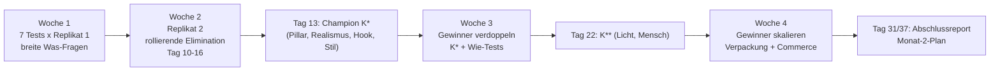
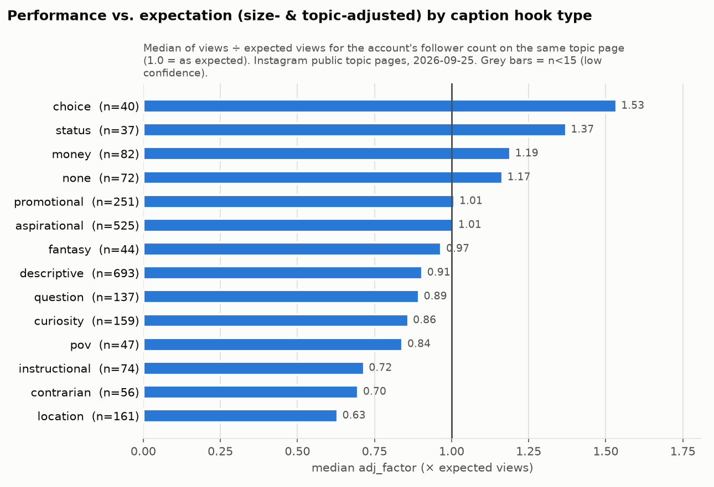

# 14 – 30-Tage-Launch-Plan (Teil 29)

**Stand:** 25.09.2026 · **Für:** neuen internationalen Instagram-Account „AI-Architektur-Studio – Homes that shouldn't exist (yet)“ (Positionierung laut [Strategy Brief](data/processed/strategy_brief.md)) · **Umfang:** 3 Reels pro Tag = 90 Reels in 30 Tagen

| Datei | Inhalt |
|---|---|
| [13_testing_matrix.csv](13_testing_matrix.csv) | **Teil 28:** 27 Tests mit Hypothese, Variable, Konstanten, Varianten, Reel-IDs, KPIs, Entscheidungsregel und Datenbasis. Dieser Plan setzt die Matrix Tag für Tag um. |
| [15_kpi_framework.md](15_kpi_framework.md) | **Teil 30/31:** KPI-Katalog, Winner-Datenbank, Gruppenregeln (hier in Abschnitt 6 übernommen) |
| [scripts/winner_analysis.py](scripts/winner_analysis.py) | Wochenanalyse der eigenen Reels (Abschnitt 8) |
| [16_automation_strategy.md](16_automation_strategy.md) | **Teil 32:** Produktionspipeline und menschliche Gates G1–G5 (Abschnitt 5) |
| `17_competitor_monitor.md` und [scripts/monitor/monitor_weekly.py](scripts/monitor/monitor_weekly.py) | **Teil 33:** Wettbewerber-Monitor im Review-Ritual (Abschnitt 8) |

**Status-Tags:** `VERIFIED` = Views/Follower von öffentlichen Seiten (gerundet) bzw. Primärquelle gesehen · `ESTIMATED` = KI-gestützte Codes, eigene Ableitungen und Simulationen · `THIRD-PARTY ESTIMATE` = Zahl eines Dritten ohne Primärbeleg · `PROXY` = YouTube-Shorts-Daten · `UNKNOWN` = nicht messbar oder nicht belegt · `ANNAHME` = Setzung ohne Daten. Alle adj-Werte (adj_factor = Views relativ zur Erwartung für die Accountgröße auf derselben Topic-Seite) stammen aus [analysis_digest.md](data/processed/analysis_digest.md) oder sind als „eigene Nachrechnung aus [04_reel_database.csv](04_reel_database.csv)“ markiert.

---

## 0. Kurzfassung

1. **Der Plan ist ein Experiment, kein Redaktionskalender.** Jedes der 90 Reels gehört zu mindestens einem der 27 Tests aus [13_testing_matrix.csv](13_testing_matrix.csv). 7 Kontroll-Reels dienen gleichzeitig mehreren Tests (z. B. R45 für Licht, Mensch, Kamera, Text und Audio).
2. **Ein Tag = ein Block = ein Konzept.** Die 3 Reels eines Tages zeigen dieselbe Architektur-Idee und unterscheiden sich in genau **einer** Variable (z. B. gleicher Körper mit 3 Hooks; gleicher Hook mit 3 Stilen). Verglichen wird innerhalb des Tages (bzw. innerhalb eines 2-Tage-Clusters derselben Woche). Das neutralisiert Tagesschwankungen und das Kontowachstum.
3. **Phasen:** Woche 1 testet breit die „Was“-Fragen (Pillar, Realismus, Hook, Stil, Format, Setting, Raum). Woche 2 repliziert jeden Test und eliminiert rollierend schwache Stufen (Entscheidung jeweils 2 Tage nach dem Replikat). Woche 3 verdoppelt die Gewinner: 71 % der Reels bauen auf dem Champion-Rezept K\* auf, getestet werden nur noch „Wie“-Faktoren (Licht, Mensch, Kamera, Text, Audio). Woche 4 skaliert: Reichweiten-Slots laufen mit K\*/K\*\*, getestet wird Verpackung (Länge, Audio, Hook-Feinschliff) und Commerce (Keyword-CTA, Preis-Labels, Hybrid).
4. **Die Daten stützen nur wenige Startentscheidungen belastbar**, vor allem Realismus (Kruskal-Wallis adj p = 0,0011; KI fantasy vs. KI realistisch 2,53×). Stil, Raum, Location, CTA und Posting-Zeit sind im Datensatz **nicht signifikant**. Deshalb startet das Kontroll-Rezept K0 mit den Daten-Defaults und muss sich gegen Varianten behaupten.
5. **Posting-Zeiten:** 3 feste Slots 11:00, 17:00 und 23:00 UTC. Die Posting-Stunde zeigt im Datensatz keinen Effekt (Kruskal-Wallis adj p = 0,94). Deshalb halten wir die Slots konstant und rotieren die Test-Arme über die Slots (Test T24).
6. **Entscheidungen relativ zum eigenen Konto:** Alle Schwellen beziehen sich auf den rollierenden Median der letzten 15 eigenen Reels (account_index, F-, S-, C-, W-Index). Absolute Benchmarks für einen neuen KI-Account sind `UNKNOWN`.
7. **Statistische Ehrlichkeit:** Mit 2 Paaren pro Test erklärt eine Simulation ≈ 22–24 % „vorläufige Gewinner“, obwohl kein Effekt existiert (Abschnitt 6.4). Deshalb gilt: Woche 2 **pausiert**, Woche 3 **repliziert**, und erst die gepoolten Gruppenregeln aus [15_kpi_framework.md](15_kpi_framework.md) (n ≥ 6, P ≥ 95 %) erlauben **SCALE** oder **KILL**.
8. **Trial Reels** sind vermutlich erst ab ~1.000 Followern verfügbar (`ESTIMATED`, [q01](quellen/q01_instagram_platform_rules.md)). Ab dann laufen Test-Varianten als Trial Reels, Champions normal (Abschnitt 7).

---

## 1. Die vier Phasen (Teil 29)



| Woche | Ziel | Was läuft | Entscheidungen | Anteil Champion-basiert |
|---|---|---|---|---|
| **1** (Tag 1–7, 21 Reels) | Breite Tests der „Was“-Fragen | T05 Pillar, T03 Realismus, T02 Hook, T04 Stil, T01 Format, T07 Setting, T06 Raum – je 1 Tagesblock (Kontrolle + 2 Varianten) | nur Policy/QA-Stopps; keine Leistungsentscheidung mit n = 1 | – (alle Reels sind Test-Arme) |
| **2** (Tag 8–14, 21 Reels) | Replizieren, dann schwache Stufen eliminieren | Replikat 2 derselben 7 Tests in derselben Reihenfolge | **rollierend:** jeder Test 2 Tage nach seinem Replikat (Tag 10–16): VORLÄUFIGER GEWINNER / PAUSIEREN / OFFEN; **Tag 13:** K\* festlegen | – |
| **3** (Tag 15–21, 21 Reels) | Gewinner verdoppeln | Cluster R1/R2: K\* + 5 Geschwister je Cluster (Licht, Mensch, Kamera, Text, Audio, Realismus-Bestätigung, Stil-Exploration); Hybrid-Block; P3-Star; Location-Pilot | Tag 22: T08/T09 → K\*\* | 15 von 21 (71 %) |
| **4** (Tag 22–30, 27 Reels) | Gewinner skalieren | Reichweite: K\*/K\*\* mit Längen-, Audio-, Hook- und Kamera-Varianten; Commerce: Hybrid r2, P2-Star (Keyword-CTA, Preis-Labels), P3-Star r2; P4-Pilot | Tag 25–31 je Test; Tag 31 Abschlussreport | 15 von 27 (56 %) auf K\*, weitere 9 auf den P2/P3-Champions (zusammen 89 %) |

**Warum Elimination in Woche 2 „pausieren“ heißt und nicht „widerlegt“:** Mit k = 2 Paaren pausiert die Regel unter Nulleffekt ≈ 22–24 % der Stufen zu Unrecht, eine echte ×2,5-Stufe aber nur in 5–9 % der Fälle (Simulation, Abschnitt 6.4). Die Elimination ist also eine Slot-Entscheidung zugunsten wahrscheinlicherer Gewinner. Pausierte Stufen können in Monat 2 mit neuer Hypothese zurückkommen (wie KILL-Regel 2 in [15](15_kpi_framework.md), Abschnitt 4.3).

**Abweichung von [15_kpi_framework.md](15_kpi_framework.md), Abschnitt 4.5:** Dort ist als Beispiel ein faktorielles Startdesign (`T01_factorial`) mit Thompson-Sampling ab Woche 3 skizziert. Dieser Plan ersetzt es durch gepaarte Ein-Faktor-Blöcke (Vorgabe „one variable at a time“). Die Test-IDs der Matrix ersetzen die Beispiel-IDs aus 15. Das Thompson Sampling des Skripts nutzen wir ab Monat 2 für die Slot-Verteilung.

---

## 2. Kontroll-Rezepte K0 → K\* → K\*\* (Teil 29)

K0 ist das Startrezept aus den Daten-Defaults. Jede Variante muss sich gegen K0 behaupten („Beweislast liegt bei der Variante“). **K\*** = K0 mit allen vorläufigen Gewinnern aus T02–T05 (Stand Tag 13). **K\*\*** = K\* plus Gewinner aus T08/T09 (Stand Tag 22). Ohne Gewinner bleibt die K0-Stufe.

### 2.1 K0-P1 „Unbuilt“ (Reichweiten-Kontrolle)

| Merkmal | K0-P1 | Datenbasis (kurz) | Test |
|---|---|---|---|
| Realismus | fantasy_impossible | KI fantasy 2,27 (n = 53) vs. KI realistisch 0,90 (n = 328): 2,53× (95-%-KI 1,29–3,92; p = 0,008) `ESTIMATED` (Codes) | T03 |
| Pillar / Format | P1 Reveal: Außen → Innen, 1 durchgehende Einstellung | Architektur-Topics 57 % frische Top-Reels, neue Reels adj 1,53 (n = 34) | T01, T05 |
| Setting | unmögliche Struktur an einer Bergkante | KI mountain 1,72 (n = 33); Landschaft gesamt n. s. (adj p = 0,58) | T07 |
| Held-Raum am Ende | Treppe/Halle | KI stairs_hall 2,24 (n = 16); post-hoc, innerhalb Accounts −7,7 Pp. → widersprüchlich | T06 (in P2) |
| Stil | warm_luxury (Travertin, Walnuss, Messing) | KI 1,85 (n = 15, genau an der Grenze für geringe Konfidenz); post-hoc-Kontrast 2,47× | T04, T27 |
| Licht | warmes Kunstlicht innen, tiefblauer Nachthimmel | KI Nacht 1,27 (n = 93) vs. Tag 0,90 (n = 143), p = 0,06 (eigene Nachrechnung); gesamt 1,21×, n. s. | T08 |
| Mensch | 1 kleine Figur als Maßstab, kein erkennbares Gesicht | KI mit Personen 1,68× (KI 0,99–2,52; p = 0,017) | T09 |
| Kamera | slow_push_in | `PROXY`: YouTube statisch/langsam 1,67 (n = 73) vs. schnell 0,40 | T10 |
| Länge | 10 s | `PROXY`: YouTube 9–12 s 1,99 (n = 11, geringe Konfidenz) | T12 |
| Audio | music_plus_ambient, lizenzfrei (Sound Collection oder lizenziert) | `UNKNOWN` ([q09](quellen/q09_reels_format_benchmarks.md)) | T13 |
| On-Screen-Text | nur Hook, ≤ 7 Wörter, erste 2 s | Cover-Text 0,92× (n. s.) | T11 |
| Hook-Typ | curiosity | KI curiosity 1,50 (n = 67), p = 0,037 (eigene Nachrechnung, explorativ); gesamt 0,86 (n = 159) | T02, T15 |
| Cover | laut Overlay-Plan: sauber oder Serien-Titel | 0,92× (n. s.) | T21 |
| Caption | Titelzeile `Unbuilt No. 0XX – <Name>` + Konzeptsatz + `AI concept, not a real property.`; kurz oder lang laut Overlay | 51–150 Zeichen adj 1,10 (n = 523) | T23 |
| CTA | laut Overlay: keiner / Frage / Serien-Follow | CTA n. s. (adj p = 0,62) | T19, T20 |
| Hashtags | 3 (Limit 5) | [q01](quellen/q01_instagram_platform_rules.md) `VERIFIED` | konstant |
| KI-Label | immer gesetzt | Pflicht bei fotorealistischem KI-Video ([q01](quellen/q01_instagram_platform_rules.md), [q07](quellen/q07_legal_ai_risk.md)) | Gate, kein Testfaktor |
| Fensterblick | vermeiden | 0,70× (KI 0,53–0,85; p = 0,021) | T26 |


### 2.2 Kontrollen der übrigen Pillars

| Kontrolle | Rezept | Tests |
|---|---|---|
| **K0-P2 Pick One** | 3 Optionen desselben Raums (Start: Bad), je 4 s, Optionen unterscheiden sich im Stil; On-Screen `Pick one. You can only keep one.`; Nacht; keine Figur; 12 s | T01, T06, T22, T25 |
| **K0-P3 Build („From Nothing“)** | leere Bergkante → Garten-Terrasse, 4–5 Bauphasen als Morph, feste Drohnen-Totale, 15 s, endet bei Nacht mit Figur; **kein Split-Screen** (Split-Cover 0,56×, n = 22, n. s.) | T01, T07, T16, T17 |
| **K0-P4 Night Stories** | Penthouse-Terrasse, City Lights, warm_luxury, Figur, 10 s; City Lights sichtbar, aber kein gerahmter Fensterblick | T04, T05, T26 |
| **K0-P5 Wildcard** | Cozy Night Retreat (T05) bzw. Location-Serie mit Ort als Setting-Zeile (T18) | T05, T18 |

**Wenn T05 einen anderen Pillar als P1 bestätigt** (z. B. P4), werden die Cluster R1–R3, die Längen- und die Hybrid-Blöcke ab Woche 3 mit dem P4-Rezept produziert. Die Tabellen in Abschnitt 4 zeigen den Default P1.

### 2.3 Texte für die Test-Arme (Englisch, eigene Formulierungen)

| Zweck | Text |
|---|---|
| T02 curiosity (Kontrolle) | `No road leads to this house.` |
| T02 money | `What would this cost to build?` |
| T02 question | `Could you live this far from everyone?` |
| T15 POV | `POV: you wake up above the clouds.` |
| T15 Fantasy-Statement | `A house grown out of solid rock.` |
| P2 Hook | `Pick one. You can only keep one.` |
| CTA Frage (T19) | `Would you move in? Yes or no.` |
| CTA Frage P2 (T22/T25-Kontrolle) | `Which one would you keep: 1, 2 or 3?` |
| CTA Serien-Follow (T20) | `Unbuilt No. 015 drops tomorrow. Follow so you don't miss it.` |
| CTA Keyword (T22) | `Comment SIMILAR and I'll DM you real pieces that match.` |
| Cover Serien-Titel (T21) | `UNBUILT No. 015 · The Cloud Library` |
| Preis-Label (T25) | `est. build cost (concept): $1.8M` – immer als Schätzung eines fiktiven Konzepts |
| Location-Zeile (T18) | `Concept set in the Swiss Alps.` – Ort nur als Setting, nie als Hook |

**Beobachtete Muster, nur als Prinzip genutzt** (Kurz-Auszüge aus [analysis_digest.md](data/processed/analysis_digest.md), Abschnitt 11; nicht kopieren):

| Beobachtet (Handle, Auszug) | adj_factor | Prinzip | Umsetzung hier |
|---|---|---|---|
| @soldbytyler: „Which GTA house would you rather…“ (Choice, echtes Footage) | 91,8 | Wahl zwischen klar unterscheidbaren Optionen, Popkultur-Rahmen | P2 `Pick one…`, T06, T22 |
| @design_x_interior: „Client: I want Super luxury bedroom in my budget“ (Money, KI) | 37,4 | Budget-Spannung als Rahmen | T25 Preis-Labels (als Schätzung markiert) |
| @thehomopien: „I Built a Luxury Tiny House Inside an Underground Bunker“ (KI) | 22,6 | Endzustand im Hook versprechen | T16 „Ergebnis zuerst“ |

Diese Werte sind Einzelfälle von Topic-Seiten (Selektionsbias: dort stehen nur Top-Reels) und keine Erwartungswerte.



---

## 3. Posting-Zeiten (Teil 29)

**Befund:** Die Posting-Stunde zeigt im Datensatz keinen messbaren Effekt: Kruskal-Wallis über 24 Stunden topic_index p = 0,85, adj p = 0,94; Wochentag p = 0,34 bzw. 0,62. Innerhalb von Accounts posten die Top-10-%-Reels im Median um 14 UTC, die Bottom-50-% um 13 UTC ([Digest](data/processed/analysis_digest.md)). Außerdem unterliegen die Posting-Zeiten der Top-Reels Survivorship ([16](16_automation_strategy.md), Abschnitt 5). **Folge:** feste Slots nach Zielmarkt-Logik, Test über Rotation statt Optimierung.

| Slot | UTC | bis 24.10. MESZ | ab 25.10. MEZ | New York (bis 31.10. / ab 01.11.) | Los Angeles (bis 31.10. / ab 01.11.) | Skript-Bucket `hour_bucket_utc` |
|---|---|---|---|---|---|---|
| Reel 1 | **11:00** | 13:00 | 12:00 | 07:00 / 06:00 | 04:00 / 03:00 | 06–11h |
| Reel 2 | **17:00** | 19:00 | 18:00 | 13:00 / 12:00 | 10:00 / 09:00 | 12–17h |
| Reel 3 | **23:00** | 01:00 | 00:00 | 19:00 / 18:00 | 16:00 / 15:00 | 18–23h |

- **Warum diese drei:** Reel 1 erreicht Europa mittags, Reel 2 Europa abends und die USA mittags, Reel 3 den US-Abend (Zielmärkte z. B. US/UK/CA/AU; in [15](15_kpi_framework.md), Abschnitt 3.1 nur als Beispiel genannt, im Content-Plan festzulegen). Die Wahl beruht auf dieser Logik, **nicht** auf den nicht signifikanten Stunden-Medianen des Digests.
- **Die Slots liegen in drei verschiedenen 6-h-Buckets** des Skripts. So kann [scripts/winner_analysis.py](scripts/winner_analysis.py) die Slots im Faktor `hour_bucket_utc` trennen.
- **Rotation:** Die Kontrolle wandert täglich A → B → C, die Varianten entsprechend. Jeder Slot bekommt 30 Reels und einen vergleichbaren Mix (T24).
- **UTC bleibt fix**, auch über die Zeitumstellungen (EU 25.10.2026, USA 01.11.2026). Reel 3 wird in der App eingeplant (Mitternacht in Deutschland).
- **Test T24 (passiv):** Ein Slot wird in Monat 2 nur verschoben, wenn er ≤ 0,67× der beiden anderen liegt, mit P(schlechter) ≥ 95 % in beiden Sichten (alle Reels und nur Kontroll-Reels).

---

## 4. Tag-für-Tag-Plan: 90 Reels (Teil 29)

### 4.1 Lesehilfe

- **Zelle:** `R07` = Plan-ID (R01–R90, Tag × Slot) · Pillar · Format · Test-ID · Arm. **K** = Kontrolle des Tagesblocks, **K\*** = Champion-Kontrolle, die mehrere Tests bedient (in Klammern). B/C = Varianten.
- **Formate → Codebook-Werte in der Winner-DB:** Reveal = `single_scene_ambience`, Pick One = `choice_compare`, Build = `transformation_morph`.
- **Pillar → `pillar` in der Winner-DB:** P1 = `unusual_home` (bzw. `future_arch` bei futuristischen Konzepten), P2 = `luxury_room`, P3 = `pool` bei Pool-Endzustand, sonst `architecture`, P4 = `luxury_home`, P5 = `cozy_ambience` bzw. `location`. Zusätzlich `series_id` (Konvention aus [08](08_content_pillars.md), Abschnitt 7): `S01_unbuilt`, `S02_pick_one`, `S03_from_nothing`, `S04_after_dark`, `S05_wild_<thema>` (z. B. `S05_wild_cozy_night`, `S05_wild_named_setting`).
- **Letzte Spalte (Overlays, gelten für alle Reels eines Blocks):** CTA (– = keiner, Frage, Follow, „im Test“ = CTA ist dort die Testvariable) · Cover (clean = ohne Text, Titel = Serien-Titel) · Caption (kurz = 51–150 Zeichen, lang = 400–1.000 Zeichen). Die Verteilung ist auf gleiche Reel-Zahlen optimiert: CTA 27/30/27 (+6 im Test), Cover 45/45, Caption 45/45, paarweise nahezu ausgewogen (T19–T21, T23).
- **2-Tage-Cluster** (R1: Tag 15–16, R2: Tag 19–20, R3: Tag 25–26) teilen eine Kontrolle und identische Overlays. Paare liegen dort auf dem gleichen oder dem Folgetag derselben Woche.

### 4.2 Tabellen

#### Woche 1 (Tag 1–7): breite Tests, Replikat 1

| Tag | Block | Reel 1 · 11:00 UTC | Reel 2 · 17:00 UTC | Reel 3 · 23:00 UTC | CTA · Cover · Caption |
|---|---|---|---|---|---|
| 1 | T05 r1 | **R01** P1 · Reveal · T05 **K P1 remote** | **R02** P4 · Reveal · T05 B P4 Nacht | **R03** P5 · Reveal · T05 C P5 Cozy | – · Titel · kurz |
| 2 | T03 r1 | **R04** P1 · Reveal · T03 C dreamy | **R05** P1 · Reveal · T03 **K fantasy** | **R06** P1 · Reveal · T03 B realistisch | Follow · clean · lang |
| 3 | T02 r1 | **R07** P1 · Reveal · T02 B money | **R08** P1 · Reveal · T02 C question | **R09** P1 · Reveal · T02 **K curiosity** | – · Titel · lang |
| 4 | T04 r1 | **R10** P4 · Reveal · T04 **K warm_luxury** | **R11** P4 · Reveal · T04 B futuristic | **R12** P4 · Reveal · T04 C organic_modern | Frage · clean · lang |
| 5 | T01 r1 | **R13** P3 · Build · T01 C Build | **R14** P1 · Reveal · T01 **K Reveal** | **R15** P2 · Pick One · T01 B Pick One | Follow · Titel · kurz |
| 6 | T07 r1 | **R16** P3 · Build · T07 B Meeresklippe | **R17** P3 · Build · T07 C Wolken | **R18** P3 · Build · T07 **K Bergkante** | – · clean · lang |
| 7 | T06 r1 | **R19** P2 · Pick One · T06 **K Bad** | **R20** P2 · Pick One · T06 B Treppe/Halle | **R21** P2 · Pick One · T06 C Wohnzimmer | Follow · clean · kurz |

*Woche 1: 21 Reels · P1 8 · P2 4 · P3 4 · P4 4 · P5 1 · davon 7 Kontroll-Reels*

#### Woche 2 (Tag 8–14): Replikat 2 und rollierende Elimination

| Tag | Block | Reel 1 · 11:00 UTC | Reel 2 · 17:00 UTC | Reel 3 · 23:00 UTC | CTA · Cover · Caption |
|---|---|---|---|---|---|
| 8 | T05 r2 | **R22** P5 · Reveal · T05 C P5 Cozy | **R23** P1 · Reveal · T05 **K P1 remote** | **R24** P4 · Reveal · T05 B P4 Nacht | Follow · clean · lang |
| 9 | T03 r2 | **R25** P1 · Reveal · T03 B realistisch | **R26** P1 · Reveal · T03 C dreamy | **R27** P1 · Reveal · T03 **K fantasy** | – · clean · lang |
| 10 | T02 r2 | **R28** P1 · Reveal · T02 **K curiosity** | **R29** P1 · Reveal · T02 B money | **R30** P1 · Reveal · T02 C question | Frage · Titel · kurz |
| 11 | T04 r2 | **R31** P4 · Reveal · T04 C organic_modern | **R32** P4 · Reveal · T04 **K warm_luxury** | **R33** P4 · Reveal · T04 B futuristic | Follow · clean · kurz |
| 12 | T01 r2 | **R34** P2 · Pick One · T01 B Pick One | **R35** P3 · Build · T01 C Build | **R36** P1 · Reveal · T01 **K Reveal** | Follow · Titel · kurz |
| 13 | T07 r2 | **R37** P3 · Build · T07 **K Bergkante** | **R38** P3 · Build · T07 B Meeresklippe | **R39** P3 · Build · T07 C Wolken | – · Titel · lang |
| 14 | T06 r2 | **R40** P2 · Pick One · T06 C Wohnzimmer | **R41** P2 · Pick One · T06 **K Bad** | **R42** P2 · Pick One · T06 B Treppe/Halle | Frage · Titel · kurz |

*Woche 2: 21 Reels · P1 8 · P2 4 · P3 4 · P4 4 · P5 1 · davon 7 Kontroll-Reels*

#### Woche 3 (Tag 15–21): Gewinner verdoppeln

| Tag | Block | Reel 1 · 11:00 UTC | Reel 2 · 17:00 UTC | Reel 3 · 23:00 UTC | CTA · Cover · Caption |
|---|---|---|---|---|---|
| 15 | Cluster R1 | **R43** P1 · Reveal · T08 B Tageslicht | **R44** P1 · Reveal · T09 B ohne Figur | **R45** P1 · Reveal · **K\*** (T08·T09·T10·T11·T13) | Follow · Titel · lang |
| 16 | Cluster R1 | **R46** P1 · Reveal · T10 B Fly-through | **R47** P1 · Reveal · T11 B ohne Text | **R48** P1 · Reveal · T13 B Trend-Musik | Follow · Titel · lang |
| 17 | T14 r1 | **R49** P1 · Reveal · T14 C realistisch+kaufbar | **R50** P1 · Reveal · T14 **K Fantasy-Möbel** | **R51** P1 · Reveal · T14 B Hybrid | Frage · clean · kurz |
| 18 | P3-Star r1 | **R52** P3 · Build · T16 B Ergebnis zuerst | **R53** P3 · Build · T17 B Pool | **R54** P3 · Build · **K\*** (T16·T17) | – · clean · kurz |
| 19 | Cluster R2 | **R55** P1 · Reveal · **K\*** (T08·T09·T03·T27) | **R56** P1 · Reveal · T08 B Tageslicht | **R57** P1 · Reveal · T09 B ohne Figur | Frage · Titel · lang |
| 20 | Cluster R2 | **R58** P1 · Reveal · T27 B tropical | **R59** P1 · Reveal · T03 B realistisch | **R60** P1 · Reveal · T08 C Blue Hour | Frage · Titel · lang |
| 21 | T18 r1 | **R61** P5 · Reveal · T18 B Dubai | **R62** P5 · Reveal · T18 C Tokyo | **R63** P5 · Reveal · T18 **K Swiss Alps** | Frage · clean · kurz |

*Woche 3: 21 Reels · P1 15 · P2 0 · P3 3 · P4 0 · P5 3 · davon 5 Kontroll-Reels*

#### Woche 4 (Tag 22–30): Gewinner skalieren

| Tag | Block | Reel 1 · 11:00 UTC | Reel 2 · 17:00 UTC | Reel 3 · 23:00 UTC | CTA · Cover · Caption |
|---|---|---|---|---|---|
| 22 | T12 r1 | **R64** P1 · Reveal · T12 **K 10 s** | **R65** P1 · Reveal · T12 B 6 s | **R66** P1 · Reveal · T12 C 20 s | – · clean · kurz |
| 23 | T14 r2 | **R67** P1 · Reveal · T14 C realistisch+kaufbar | **R68** P1 · Reveal · T14 **K Fantasy-Möbel** | **R69** P1 · Reveal · T14 B Hybrid | – · Titel · kurz |
| 24 | P2-Star r1 | **R70** P2 · Pick One · T22 B Keyword-CTA | **R71** P2 · Pick One · T25 B Preis-Labels | **R72** P2 · Pick One · **K\*** (T22·T25) | im Test · clean · kurz |
| 25 | Cluster R3 | **R73** P1 · Reveal · **K\*** (T13·T15·T10·T11) | **R74** P1 · Reveal · T13 B Trend-Musik | **R75** P1 · Reveal · T15 B POV | Frage · clean · lang |
| 26 | Cluster R3 | **R76** P1 · Reveal · T11 B ohne Text | **R77** P1 · Reveal · T15 C Fantasy-Statement | **R78** P1 · Reveal · T10 B Fly-through | Frage · clean · lang |
| 27 | T12 r2 | **R79** P1 · Reveal · T12 B 6 s | **R80** P1 · Reveal · T12 C 20 s | **R81** P1 · Reveal · T12 **K 10 s** | Follow · Titel · lang |
| 28 | P3-Star r2 | **R82** P3 · Build · **K\*** (T16·T17) | **R83** P3 · Build · T16 B Ergebnis zuerst | **R84** P3 · Build · T17 B Pool | Frage · Titel · kurz |
| 29 | P2-Star r2 | **R85** P2 · Pick One · T25 B Preis-Labels | **R86** P2 · Pick One · **K\*** (T22·T25) | **R87** P2 · Pick One · T22 B Keyword-CTA | im Test · Titel · lang |
| 30 | T26 r1 | **R88** P4 · Reveal · T26 B Fensterblick | **R89** P4 · Reveal · T26 C ohne Ausblick | **R90** P4 · Reveal · T26 **K Terrasse** | – · clean · kurz |

*Woche 4: 27 Reels · P1 15 · P2 6 · P3 3 · P4 3 · P5 0 · davon 8 Kontroll-Reels*

In Woche 4 sind die K\*-Reels der Cluster und Längen-Blöcke die Skalierungs-Reels: neue Konzepte der Gewinner-Serie mit fortlaufender Nummer. Die Varianten ändern nur die Verpackung (Länge, Audio, Hook, Kamera, Text). Gewinner-Reels kommen in den Profil-Anheft-Bereich; Varianten laufen ab Freischaltung als Trial Reels (Abschnitt 7).

### 4.3 Entscheidungskalender Woche 2 → Produktion Woche 3/4

Die Produktion läuft mit 2 Tagen Vorlauf ([16](16_automation_strategy.md), Abschnitt 5). Die Reihenfolge der Tests in Woche 1–2 ist so gewählt, dass alle Entscheidungen für K\* am Morgen von Tag 13 vorliegen, wenn die Reels für Tag 15 produziert werden.

| Test | Replikat 2 am | Entscheidung (morgens, alle Reels ≥ 24 h) | bestimmt | benötigt für Produktion am |
|---|---|---|---|---|
| T05 Pillar | Tag 8 | Tag 10 | Champion-Pillar K\* | Tag 13 (für Tag 15) |
| T03 Realismus | Tag 9 | Tag 11 (Endentscheid Tag 21 nach Replikat 3) | Realismus K\* | Tag 13 |
| T02 Hook | Tag 10 | Tag 12 | Hook-Typ K\*, Kontrolle für T15 | Tag 13 |
| T04 Stil | Tag 11 | Tag 13 | Stil K\* und P4 | Tag 13 |
| T01 Format | Tag 12 | Tag 14 | Format-Anteile ab Monat 2 (Woche 3/4 sind fix geplant) | – |
| T07 Setting | Tag 13 | Tag 15 | Setting der P3-Stars | Tag 16 (für Tag 18) |
| T06 Raum | Tag 14 | Tag 16 | Raum der P2-Stars | Tag 22 (für Tag 24) |
| T08 Licht, T09 Mensch | Tag 19 | Tag 22 (Tag-20-Reels ≥ 24 h) | K\*\* | Tag 23 (für Tag 25) |
| T14 Hybrid | Tag 23 | Tag 25 | Commerce-Slot ab Monat 2 | Monat 2 |
| T10, T11, T13, T15, T12, T16, T17, T22, T25, T26 | Tag 26–30 | Tag 28–32 | Rezept Monat 2 | Monat 2 |
| Overlays T19–T21, T23, Slot T24 | laufend | Zwischenstand Tag 15, Entscheidung Tag 31 | Caption-, Cover- und CTA-Standard, Slots | Monat 2 |

**Pillar-Mix:** Woche 1–2 folgen dem Start-Mix des Strategy Brief (P1 38 %, P2 19 %, P3 19 %, P4 19 %, P5 5 % der 42 Reels). Über 30 Tage ergibt sich mit dem Default-Champion P1: P1 46 (51 %), P2 14 (16 %), P3 14 (16 %), P4 11 (12 %), P5 5 (6 %). Reichweiten-Pillars (P1 + P4) machen 63 % aus, Commerce-Pillars (P2 + P3) 31 %. Zählt man die 4 T14-Reels mit kaufbaren Möbeln dazu (Hybrid R51/R69 und realistisch+kaufbar R49/R67; die Kontrollen R50/R68 haben Fantasy-Möbel), sind es 36 %. Das liegt im Zielkorridor des Brief für die Zeit nach dem Test (60–70 % Reichweite, 30–40 % Commerce). Die Abweichung vom statischen Start-Mix ist gewollt: Woche 3–4 verdoppeln den Gewinner.

---

## 5. Produktions-Workflow pro Tag (Teil 29)

**Prinzip:** 1 Konzept pro Tag (bzw. pro 2-Tage-Cluster), daraus 1 Kontrolle und 2 (bzw. 5) Geschwister. Heute wird für übermorgen produziert. Die Gates G1–G5 und die QA-Checkliste stammen aus [16_automation_strategy.md](16_automation_strategy.md), Abschnitt 4.

| Zeit (MESZ, Beispiel) | Schritt | Mensch [ANNAHME] | Gate |
|---|---|---|---|
| 08:00 | Metriken eintragen: `views_24h` der 3 Reels von gestern, T+7d-Werte der Reels von vor 7 Tagen, optional `views_1h`/`views_6h` | 10 min | – |
| 08:10 | Tages-Check: Reel-Klassen (Abschnitt 6.2), Entscheidungskalender (4.3), Account Status bei Auffälligkeiten | 5 min | – |
| 08:15 | Konzeptkarte für Tag T+2 aus Plan und Matrix: `test_id`, Arme, Konstanten, Hook-Texte, Overlays | 5 min | G1 (wöchentlich freigegeben) |
| 08:20 | Kontrolle: 8–16 Bildkandidaten, Keyframe wählen | 10 min | G2a |
| 08:40 | Geschwister: gleicher Prompt, **nur die Testvariable ändern**, neuer Seed; Keyframes wählen | 10 min | G2a |
| 09:00 | Image-to-Video, 2–4 Takes je Reel (läuft asynchron) | 5 min | – |
| 10:30 | Schnitt: Länge, Hook-Text, Audio, Cover je Arm und Overlay | 25 min | – |
| 11:00 | QA: Artefakte, keine Generator-Wasserzeichen, Ähnlichkeitscheck, `visual_quality` = high | 20 min | G2b |
| 11:20 | Captions: Titelzeile, Overlay-CTA und -Länge, 3 Hashtags, `AI concept`-Zeile; Orts- und Preisangaben prüfen | 10 min | G3 |
| 11:30 | Einplanen (11:00/17:00/23:00 UTC), KI-Label, Winner-DB-Zeilen anlegen | 10 min | G4 |
| Slots | nach jedem Slot 5 min Kommentare beantworten (Wirkung auf Reichweite `UNKNOWN`) | 15 min | – |

**Summe ≈ 2 h 5 min pro Tag** `ANNAHME`. [16](16_automation_strategy.md) rechnet mit ≈ 45 min pro einzelnem Reel in Woche 1–4 (also ≈ 2 h 15 min für 3 Reels); Geschwister sparen Ideen- und Prompt-Zeit. Montags kommt das Review-Ritual dazu (≈ 70 min, Abschnitt 8).

**Regeln für Geschwister-Reels**

1. **Nur die Testvariable ändert sich.** Alles andere kommt aus der Konzeptkarte: gleiche Architektur, Perspektive, Farbwelt, Schrift, Hook-Position.
2. **Nie denselben Clip zweimal hochladen.** Instagram empfiehlt bei identischen Inhalten nur das Original ([q01](quellen/q01_instagram_platform_rules.md), `VERIFIED`). Geschwister werden neu gerendert (anderer Seed) bzw. neu geschnitten; `prompt_id` z. B. `P0031`, `P0031-v2`, `P0031-v3`. Ob Instagram sehr ähnliche Geschwister als Duplikate behandelt, ist `UNKNOWN`. Deshalb bei Hook- und Text-Tests auch die erste Sekunde leicht variieren (anderer Startframe derselben Fahrt).
3. **Gleiche Qualität für alle Arme.** Ein schwächer gerenderter Arm testet Qualität statt der Variable. Die visuelle Qualität gehört zu den wenigen Dimensionen, die im Datensatz auch nach Bonferroni-Korrektur signifikant sind (topic_index p < 0,001; größenbereinigt nur nominal, adj p = 0,013).
4. **Fällt ein Arm durch die QA,** wird er neu generiert. Geht das nicht, bleibt der Slot mit einem Reel desselben Konzepts **ohne** Testrolle belegt und in der Matrix als `-` gewertet. Kein fremdes Konzept einschieben.
5. **Protokoll in der Winner-DB** ([15](15_kpi_framework.md), Abschnitt 5.2) plus drei Zusatzspalten, die das Skript ignoriert: `plan_id` (R01–R90), `cover_type` (`clean`/`series_title`), `caption_len` (Zeichen). `test_id` = Test des Reels laut Tabelle; Kontrollen mehrerer Tests bekommen den ersten Test und `variant` = `control`, die übrigen in `notes` (`also_control: T09,T10,T11,T13`).

---

## 6. KPIs und Entscheidungsregeln KEEP / ITERATE / SCALE / KILL (Teil 29, Verweis Teil 30/31)

### 6.1 KPIs relativ zum eigenen Konto

Absolute Benchmarks für einen neuen KI-Interior-Account sind `UNKNOWN`. Die veröffentlichten Benchmarks stammen von Marken-Accounts (1–5K Follower: Ø 580–658 Views pro Reel, [q09](quellen/q09_reels_format_benchmarks.md), `VERIFIED` für Marken). Die Research-Werte sind Top-Reels (Selektionsbias). Deshalb bewerten wir jedes Reel gegen den **Median der 15 vorherigen eigenen Reels** (bei weniger als 3 Vorgängern: Median aller Reels, wie im Skript).

| KPI | Formel | Relativ-Index | Messzeitpunkt |
|---|---|---|---|
| **account_index (AI)** | views_24h ÷ Median views_24h der 15 Vorgänger | AI selbst | T+24 h (App) |
| **Views/Follower (VPF)** | views_7d ÷ followers_at_post, erst ab 1.000 Followern | VPF-Index = VPF ÷ Median-VPF der 15 Vorgänger | T+7 d |
| **Follows pro 1.000 Views (F/1k)** | 1.000 × followers_gained ÷ views_7d | F-Index = F/1k ÷ Median der 15 Vorgänger; Gruppen gepoolt (Summe ÷ Summe) | T+7 d (App; per API für Reels nicht verfügbar, [15](15_kpi_framework.md)) |
| **Shares pro 1.000 Views (S/1k)** | 1.000 × shares ÷ views_7d (im Skript als Sends/Reach) | S-Index | T+7 d |
| **Kommentare pro 1.000 Views (C/1k)** | 1.000 × comments ÷ views_7d | C-Index | T+7 d |
| **Ø Watch Time / % angesehen / Completion** | avg_watch_time; avg_watch_time ÷ length_sec; Completion, falls die App sie zeigt | W-Index = % angesehen ÷ Median der 15 Vorgänger | T+7 d |
| **NS-Index** (North Star) | Gruppen-Index × F-Index | – | Gruppen |

Die Launch-Bänder in [15](15_kpi_framework.md), Abschnitt 3 bleiben Orientierung. An Tag 14 ersetzen wir sie durch eigene Perzentile (Skript-Report Abschnitt 8).

### 6.2 Reel-Ebene (täglich ab T+24 h)

| Klasse | Bedingung | Aktion |
|---|---|---|
| **Hit** | AI ≥ 2,0 | Folge-Konzept derselben Serie im nächsten freien Champion-Slot (≤ 72 h); ist F-Index < 0,7: Serien-CTA und Profil prüfen |
| **Solide** | 0,8 ≤ AI < 2,0 | normal weiter |
| **Schwach** | 0,5 ≤ AI < 0,8 | ist S-Index oder W-Index ≥ 1,2: Verpackung schwach, Inhalt gut → neuer Hook/Cover beim nächsten Konzept |
| **Flop** | AI < 0,5 | nicht wiederholen; Faktoren in der Lift-Tabelle beobachten |
| **Community-Signal** (Ergänzung, nicht im Skript) | C-Index ≥ 2,0 | Kommentar-Themen als Optionen für den nächsten Pick One nutzen |
| **Policy** | Hinweis oder Einschränkung im Account Status | sofort KILL des Formats (`notes`: `POLICY: …`) |

In Woche 1–2 ändern Reel-Klassen den Plan nicht, weil alle Slots Test-Arme sind. Ein Hit wird notiert und ab Woche 3 als Konzept-Idee für einen K\*-Slot genutzt.

### 6.3 Gruppen-Ebene (Montags, kumuliert; identisch mit 15, Abschnitt 4.3 und den Skript-Konstanten)

Gruppen = einzelne Werte von `series_id`, `pillar`, `format`, `hook_type`, `visual_hook`, `style`. Test-Arme sind Stufen dieser Faktoren und werden über Tests hinweg gepoolt (z. B. alle `hook_type = money`-Reels). Gruppen-Index = Median AI der Gruppe ÷ Median AI aller Reels. Erste zutreffende Regel gilt.

| # | Entscheidung | Bedingung | Folge |
|---|---|---|---|
| 1 | **KILL (Policy)** | ein Reel der Gruppe mit `POLICY` in `notes` | sofort stoppen, Einspruch prüfen |
| 2 | **KILL** | n ≥ 6 · Gruppen-Index < 0,6 · P(schlechter) ≥ 95 % · NS-Index < 0,6 · keine Packaging-Diagnose | 0 Slots; frühestens nach 30 Tagen mit neuer Hypothese |
| 3 | **ITERATE (Nische)** | n ≥ 3 · Gruppen-Index < 0,6 · F-Index ≥ 1,5 | Follower-Magnet: Hook und Cover testen, nicht streichen |
| 4 | **SCALE** | n ≥ 6 · Gruppen-Index ≥ 1,5 · P(besser) ≥ 95 % · F-Index ≥ 1,0 | 7 Champion-Slots pro Woche, 3–5 neue Varianten, Serie bauen |
| 5 | **ITERATE (Reichweite ohne Follows)** | n ≥ 3 · Gruppen-Index ≥ 1,2 · F-Index < 0,7 | Serien-Kennung in den Hook, Follow-CTA, Bio/Grid prüfen |
| 6 | **ITERATE (Packaging)** | n ≥ 3 · Gruppen-Index < 0,8 · S-Index oder W-Index ≥ 1,2 | neuer Hook, neues Cover, neue erste Sekunde |
| 7 | **ITERATE (Replizieren)** | n ≥ 6 · Gruppen-Index ≥ 1,5 · P(besser) < 95 % | 6 weitere Reels, übrige Faktoren variieren |
| 8 | **KEEP** | n ≥ 6, sonst | im Rotationspool |
| 9 | **OFFEN** | n < 6 | weiter testen |

**Ergänzungen für diesen Plan** (manuell, nicht im Skript):
- **P2-Gruppen:** C-Index ≥ 2,0 bei Gruppen-Index ≥ 0,6 → KEEP statt KILL, weil P2 für Kommentare und Community gebaut ist (Choice: Kommentare/View 5,67×, p < 0,001).
- **Ab 1.000 Followern:** VPF-Index als Gegenprobe zum AI. Weichen beide um mehr als Faktor 2 voneinander ab, prüfen, ob schnelles Follower-Wachstum den Vergleich verzerrt.

### 6.4 Test-Ebene (Matrix, Spalte `entscheidungsregel`)

| Typ | Tests | Regel |
|---|---|---|
| **GEPAART** (k = 2–3 Paare) | T01–T14, T16, T17, T22, T25 | q = KPI(Variante) ÷ KPI(Kontrolle) im selben Block. **VORLÄUFIGER GEWINNER** (→ ITERATE: in K\* übernehmen bzw. Slots verdoppeln) wenn Median q ≥ 1,5 **und** alle q > 1 **und** Sekundär-KPI ≥ 0,8× Kontrolle. **PAUSIEREN** (→ KILL für Monat 1) wenn Median q ≤ 0,67 **und** alle q < 1 **und** Sekundär-KPI nicht ≥ 1,2×. Sonst **OFFEN**: Kontroll-Stufe bleibt. Testspezifische Abweichungen stehen in der Matrix (z. B. T14, T22). |
| **PILOT** (k = 1) | T15, T18, T26, T27 | keine Slot-Entscheidung; Signal bei q ≥ 3 oder q ≤ 0,33 → Replikation in Monat 2 |
| **OVERLAY** (ungepaart, blockweise) | T19, T20, T21, T23 | Auswertung in zwei Sichten (alle Reels; nur Kontroll-Reels). **GEWINNER** nur bei Ratio ≥ 1,5 und P(besser) ≥ 95 % in **beiden** Sichten und account_index-Ratio ≥ 0,8. **TENDENZ** bei P ≥ 90 % nur in „alle Reels“ → Replikation |
| **PASSIV** | T24 | Slot verschieben nur bei ≤ 0,67× mit P(schlechter) ≥ 95 % in beiden Sichten |

**Wie oft irrt die gepaarte Regel?** Simulation (`ESTIMATED`): log-normale Views mit σ = 1,38 pro Reel (Median-Streuung innerhalb von 104 Research-Accounts, [15](15_kpi_framework.md), Abschnitt 4.6), Korrelation der Paar-Partner ρ = 0 bzw. 0,5 (unbekannt), 200.000 Durchläufe:

| Paare k | wahrer Effekt | P(„vorläufiger Gewinner“) | P(„pausieren“) |
|---|---|---|---|
| 1 | kein Effekt | 38–42 % | 38–42 % |
| 2 | kein Effekt | 22–24 % | 22–24 % |
| 2 | ×1,7 | 36–40 % | 10–14 % |
| 2 | ×2,5 | 45–54 % | 5–9 % |
| 3 | kein Effekt | 11–12 % | 11–12 % |
| 3 | ×2,5 | 30–40 % | 1–3 % |

Lesart: Mit 2 Paaren findet die Regel einen Effekt in der Größe des Realismus-Kontrasts (≈ ×2,5) etwa jedes zweite Mal und pausiert ihn nur selten. Sie produziert aber auch Scheingewinner. Deshalb wird jeder vorläufige Gewinner in Woche 3/4 repliziert, und „belegt“ ist ein Faktor erst nach den Gruppenregeln (6.3) bzw. bei „belegt“ in der Lift-Tabelle des Skripts (95-%-KI ohne 0 und BH-q < 0,10).

**Overlays** wurden gesondert simuliert (Blockstruktur dieses Plans, zufällige Arm-Effekte, σ = 1,38, 300 Durchläufe ohne bzw. 200 mit echtem Effekt, `ESTIMATED`): Die einfache Regel (P ≥ 90 % in einer Sicht) meldet ohne echten Effekt in 11–18 % der Fälle einen Unterschied, die Zwei-Sichten-Regel in 1–3 %. Dafür erkennt sie einen echten ×2-Effekt nur in ≈ 20 % der Fälle (einfache Regel ≈ 78 %), einen ×3-Effekt in ≈ 52 % (≈ 94 %). Deshalb: einfache Regel = TENDENZ, Zwei-Sichten-Regel = GEWINNER.

### 6.5 Leitplanken (gelten immer)

- **Account Status** wöchentlich prüfen; jede Einschränkung → KILL des betroffenen Formats ([q01](quellen/q01_instagram_platform_rules.md)).
- **Liegt der Median von views_24h über 7 Tage unter 100** oder der Nicht-Follower-Anteil unter 60 % (bei < 5.000 Followern): Eligibility prüfen (Originalität, Wasserzeichen, Account Status) vor jeder Inhaltsentscheidung ([15](15_kpi_framework.md), Abschnitt 3.2).
- **KI-Label 100 %**, `AI concept`-Zeile in jeder Caption, keine fotorealistischen KI-Personen ohne Offenlegung ([q01](quellen/q01_instagram_platform_rules.md)).
- **Keine realen Orts- oder Preis-Claims** für fiktive Objekte; Preis nur als `est. … (concept)`; Ort nur als `Concept set in …` ([q07](quellen/q07_legal_ai_risk.md), Abschnitt 2.6).
- **Trend-Musik** nur auf nicht-kommerziellen Reels; Hybrid-, P2- und P3-Commerce-Reels nur mit lizenzfreiem Audio ([q07](quellen/q07_legal_ai_risk.md), Abschnitt 2.9).
- **Kein Engagement-Bait, keine Gewinnspiele, keine gekauften Likes** ([q01](quellen/q01_instagram_platform_rules.md)). Der Keyword-CTA (T22) wird sofort gestoppt, wenn ein Account-Status-Hinweis erscheint.
- **≤ 5 Hashtags** (hier 3), nie `continuous_text` und keine Standbild-Slideshows (nicht monetarisierbar, [q01](quellen/q01_instagram_platform_rules.md)).

---

## 7. Trial Reels (Teil 29, [q01](quellen/q01_instagram_platform_rules.md))

**Was belegt ist:**
- Trial Reels werden zuerst Nicht-Followern gezeigt und erscheinen nicht im Grid, solange man sie nicht teilt. Metriken gibt es nach ca. 24 h; bei guter Performance ist ein automatisches Teilen innerhalb von 72 h möglich (creators.instagram.com, 10.12.2024, `VERIFIED`).
- Trial Reels lassen sich seit ca. April 2026 planen (`VERIFIED`, Sekundärquelle).
- Freigabe für öffentliche Accounts ab 1.000 Followern (The Keyword, 17.07.2025, `ESTIMATED`, Primärpost nicht gesehen). Angaben von „+80 % Nicht-Follower-Reichweite“ sind `THIRD-PARTY ESTIMATE`.

**Was das für diesen Plan heißt:**
- **Vor der Freigabe** (wahrscheinlich der ganze Monat 1; Tag-30-Ziel laut [15](15_kpi_framework.md): ≥ 500 Follower Basis, ≥ 1.000 Stretch) laufen alle 90 Reels als normale Reels. Geschwister belasten dann das Grid. Deshalb die besten Champion-Reels im Profil anheften und Serien-Titel konsequent nutzen.
- **Ab Freigabe:**
  1. Test-Varianten (B/C-Arme, Pilot-Arme, Hook- und Cover-Varianten) als Trial Reels posten; Champions und Serien-Reels normal.
  2. **Fairer Vergleich:** Entweder beide Arme eines Paares als Trial Reel posten oder nur die Nicht-Follower-Views vergleichen. Eine Trial-Variante gegen eine normale Kontrolle mit Follower-Reichweite zu stellen, verzerrt den Test.
  3. **Auto-Share für Test-Varianten aus.** Sonst wechselt das Publikum mitten im 7-Tage-Fenster. Gewinnt die Variante nach T+24 h, manuell teilen und den Zeitpunkt in `notes` eintragen.
  4. `is_trial_reel` = 1 setzen; das Skript wertet Trial als eigenen Faktor aus.
  5. **Erste Einsätze in Monat 2:** Replikation von T15 (Hooks, gleicher Körper), T21 (Cover), T26 und T27 (Piloten) mit je ≥ 3 Paaren.

---

## 8. Wöchentliches Review-Ritual (Teil 29)

**Termine:** Montag = Tag 8, 15, 22, 29; Abschluss Tag 31 (alle Reels ≥ 24 h) und Tag 37 (T+7d-Werte der letzten Reels). Zusätzlich die rollierenden Test-Entscheidungen aus 4.3 (je ≈ 10 min am jeweiligen Morgen).

| # | Schritt | Dauer [ANNAHME] | Werkzeug | Ergebnis |
|---|---|---|---|---|
| 1 | Datenqualität: alle `views_24h`, T+7d-Werte, `plan_id`, `cover_type`, `caption_len`; Account Status | 10 min | Winner-DB ([15](15_kpi_framework.md), Abschnitt 5.6) | vollständige Woche |
| 2 | Wochenreport | 5 min | `python3 scripts/winner_analysis.py data/winner_db.csv --week 2026-Wxx --out reports/winner_2026-Wxx.md` | KPIs, Reel-Klassen, KEEP/ITERATE/SCALE/KILL je Gruppe, Lifts, Thompson-Vorschlag |
| 3 | Matrix-Auswertung | 10 min | Snippet unten (`scripts/matrix_eval.py` anlegen) | q je Paar, Overlay-Ratios mit P(besser) |
| 4 | Wettbewerber-Monitor | 20–25 min (manueller Modus) | Wochenordner nach `17_competitor_monitor.md` füllen, dann `python3 scripts/monitor/monitor_weekly.py data/monitor/2026-Wxx --prev data/monitor/2026-Wyy` | `report.md`, `alerts.json`, `inspiration_candidates.csv` |
| 5 | Entscheiden und planen | 15 min | Regeln aus Abschnitt 6, Kalender 4.3 | K\*/K\*\* aktualisiert, pausierte Stufen gestrichen, Konzeptkarten der nächsten Woche |
| 6 | Learning-Log | 5 min | Tabelle `tests` in `data/winner.db` (`--to-sqlite`) oder Markdown | je Test: Status, Entscheidung, k, Median q |

**Umgang mit dem Wettbewerber-Monitor (Schritt 4):**
- Nur Prinzipien übernehmen, nie Motive, Captions oder Schnitte kopieren. Ähnlichkeits-Check nach [16](16_automation_strategy.md), Abschnitt 4.4.
- Höchstens 2 neue Hypothesen pro Woche, und nur in Explorations- oder Pilot-Slots (Woche 3–4: T18, T26, T27; ab Monat 2: 4 Explorations-Slots pro Woche laut [15](15_kpi_framework.md)).
- Monitor-Alarme sind Korrelationen auf Top-Reels („Korrelation, kein Test“, so steht es im Report). Sie ändern keine laufenden Tests.
- **Sättigungs-Warnung:** Zeigt der Monitor, dass unser Format bei Wettbewerbern stark zunimmt (z. B. KI-Anteil neuer Top-Reels im Pillar steigt), wird das Novelty-Tempo erhöht: neue Konzepte je Block statt Varianten alter Konzepte. Hintergrund: KI-Anteil auf Topic-Seiten 5 % (2023) → 33 % (2026); Decay-Beispiele in [q06](quellen/q06_ai_theme_page_case_studies.md).

**Matrix-Auswertung (Snippet, pandas).** Liest die Winner-DB mit Zusatzspalte `plan_id` und [13_testing_matrix.csv](13_testing_matrix.csv); berechnet account_index wie das Skript. Getestet am 25.09.2026 mit simulierten 90 Reels.

```python
import numpy as np, pandas as pd

db = pd.read_csv("data/winner_db.csv", sep=None, engine="python")   # Winner-DB + Zusatzspalte plan_id (R01–R90)
mx = pd.read_csv("13_testing_matrix.csv")
db = db[db.plan_id.notna() & db.views_24h.notna()].copy()
db["ts"] = pd.to_datetime(db.date.astype(str) + " " + db.time_posted.fillna("00:00").astype(str))
db = db.sort_values("ts").reset_index(drop=True)
v = db.views_24h.astype(float)
db["account_index"] = v / pd.Series([v[max(0, i - 15):i].median() if i >= 3 else v.median() for i in range(len(db))])
db["vref"] = db.views_7d.fillna(db.views_24h).astype(float)
RATE = {"F/1k": ("followers_gained", 1000), "C/1k": ("comments", 1000), "S/1k": ("shares", 1000),
        "profile_visits/view": ("profile_visits", 1)}
for k, (num, f) in RATE.items():
    db[k] = f * db[num] / db.vref
db = db.set_index("plan_id")

def arms(cell):
    return [(lab.strip(), [x.strip() for x in ids.split(",")]) for lab, ids in (p.split("=", 1) for p in cell.split(";"))]

def arm_value(ids, kpi):                         # Raten gepoolt (Summe/Summe), account_index als Median
    d = db.loc[[i for i in ids if i in db.index]]            # Duplikate erlaubt (Bootstrap)
    if kpi in RATE:
        num, f = RATE[kpi]
        return f * d[num].sum() / d.vref.sum(), d
    return d[kpi].median(), d

CTRL = {c for cell, k in zip(mx.reel_ids_im_plan, mx.entscheidungsregel)
        if k.split()[0].strip(".:") in ("GEPAART", "PILOT") for c in arms(cell)[0][1] if c != "-"}
rng = np.random.default_rng(1)
for _, t in mx.iterrows():
    kpi, kind = t.primaer_kpi.split()[0], t.entscheidungsregel.split()[0].strip(".:")
    A = arms(t.reel_ids_im_plan)
    print(f"\n{t.test_id} [{kind}, {kpi}]")
    for lab, ids in A[1:]:
        if kind in ("GEPAART", "PILOT"):
            q = [float(db.at[v_, kpi] / db.at[c, kpi]) for c, v_ in zip(A[0][1], ids)
                 if c in db.index and v_ in db.index and db.at[c, kpi] > 0]
            if not q:
                print(f"  {lab}: noch keine Paare"); continue
            m = float(np.median(q))
            hi, lo, tag = (3, 1 / 3, "Signal") if kind == "PILOT" else (1.5, 0.67, "Regel")
            flag = "+" if m >= hi and min(q) > 1 else "-" if m <= lo and max(q) < 1 else "offen"
            print(f"  {lab}: k={len(q)} q={[round(x, 2) for x in q]} Median={m:.2f} {tag}: {flag}")
        else:                                    # Overlay/passiv: alle Reels und nur Kontroll-Reels (weniger Mix-Effekte)
            for name, keep in (("alle", None), ("nur Kontrollen", CTRL)):
                ca, cb = [x for x in A[0][1] if keep is None or x in keep], [x for x in ids if keep is None or x in keep]
                (a, da), (b, dbb) = arm_value(ca, kpi), arm_value(cb, kpi)
                if min(len(da), len(dbb)) < 3:
                    print(f"  {lab} ({name}): zu wenig Daten"); continue
                boot = [arm_value(dbb.index[rng.integers(0, len(dbb), len(dbb))], kpi)[0] /
                        arm_value(da.index[rng.integers(0, len(da), len(da))], kpi)[0] for _ in range(1000)]
                print(f"  {lab} ({name}): n={len(dbb)} vs {len(da)} Ratio={b / a:.2f} P(besser)={np.mean(np.array(boot) > 1):.0%}")
```

Das Snippet markiert nur den Primär-KPI (`+`, `-`, `offen`). Die Sekundär-KPI-Bedingung aus der Matrix prüft der Mensch im Wochenreport des Skripts.

**Leitfragen je Review**

| Termin | Kernfrage |
|---|---|
| Tag 8 | Sind die Daten vollständig? Gibt es Policy- oder Eligibility-Probleme? Keine Leistungsentscheidungen. |
| Tag 10–16 (rollierend) | Welche Stufen werden pausiert, welche ins K\* übernommen? (Kalender 4.3) |
| Tag 15 | Ist K\* korrekt produziert? Zwischenstand der Overlays; erste Gruppenregeln mit n ≥ 6 (z. B. `hook_type`, `pillar`) |
| Tag 22 | K\*\* (Licht, Mensch), Signale der Piloten T18/T27, Tag-14-Rekalibrierung der Bänder erledigt? |
| Tag 29 | Welche Tests sind noch offen? Entwurf Monat 2 (Replikationen, Trial-Reel-Plan, Commerce-Slot) |
| Tag 31 / 37 | Abschlussreport: belegte Gewinner/Verlierer (Gruppenregeln), Tendenzen, Pillar-Mix Monat 2, Slot-Entscheidung T24 |

---

## 9. Risiken, Grenzen und Konsistenz

- **Korrelation statt Kausalität in den Startdaten.** Alle Hypothesen beruhen auf Top-Reels öffentlicher Topic-Seiten (Selektionsbias). Absolute Views sind nach oben verzerrt; relative Vergleiche (adj_factor) sind die Stärke. Die Tests in diesem Plan sind der erste kausale Schritt, aber mit kleinen n.
- **Kleine Stichproben.** 2 Paare pro Test können nur große Effekte zeigen (Abschnitt 6.4). Innerhalb eines Accounts streuen die Views stark (σ ≈ 1,38 log-Einheiten, [15](15_kpi_framework.md)). Nach 30 Tagen werden viele Tests „OFFEN“ oder „TENDENZ“ sein. Das ist ein Replikationsauftrag für Monat 2, kein Scheitern.
- **Geteilte Kontrollen.** R45 dient fünf Tests. Hat diese eine Kontrolle zufällig einen Ausreißer, verschiebt das alle fünf Vergleiche in dieselbe Richtung. Deshalb pro Test immer auch das zweite Paar (R55 bzw. R73) prüfen.
- **2-Tage-Cluster.** Paare über zwei Tage enthalten Tageseffekte; der account_index mildert das, beseitigt es aber nicht.
- **Kaltstart.** In den ersten Tagen ist der rollierende Median instabil (weniger als 15 Vorgänger). Die Tagesblöcke sind deshalb gepaart ausgewertet, nicht gegen den Kontomedian.
- **Geschwister-Ähnlichkeit.** Ob Instagram sehr ähnliche Varianten desselben Konzepts als Duplikate abwertet, ist `UNKNOWN`. Gegenmittel: neue Seeds, variierter Startframe, später Trial Reels.
- **Sättigung und Decay.** Einzelne KI-Accounts fielen nach Hits stark ab (Fallbeispiele, teils altersbedingt, `ESTIMATED`, [q06](quellen/q06_ai_theme_page_case_studies.md)); Frische-Daten zeigen verkrustete Themen (Pool-Topics 2,8 % neue Top-Reels). Jeder Block bringt deshalb ein neues Konzept.
- **Kennzeichnung.** Die Wirkung des „AI info“-Labels auf die Reichweite ist `UNKNOWN` ([q01](quellen/q01_instagram_platform_rules.md)). Das Label ist Pflicht und kein Testfaktor. Im Datensatz liegen offengelegte KI-Reels bei adj 0,69 (n = 237), aber der Kontrast nur innerhalb von KI-Reels ist nicht signifikant (0,82×, p = 0,15).
- **Konsistenz mit [15_kpi_framework.md](15_kpi_framework.md):** Die Gruppenregeln und Schwellen (6.3) sind identisch mit 15 und den Skript-Konstanten. Der Testplan in 15, Abschnitt 4.5 ist ein Beispiel; dieser Plan und die Matrix ersetzen ihn. In 15, Abschnitt 0 stehen ältere Kruskal-Werte (z. B. Realismus p = 0,59). Maßgeblich ist der aktuelle Digest: Realismus topic_index p = 0,052, adj p = 0,0011.

---

## 10. Quellen und Daten

- [data/processed/strategy_brief.md](data/processed/strategy_brief.md): Positionierung, Pillars P1–P5, Start-Mix, Test-Formate
- [data/processed/analysis_digest.md](data/processed/analysis_digest.md): Segmenttabellen (adj_factor, n), Kruskal-Wallis-Tests, Key contrasts mit Bootstrap-KI, Within-Account-Vergleiche, YouTube-Proxy, Video-Tool-Stichprobe
- [data/processed/stats/](data/processed/stats/): `key_contrasts.csv`, `seg_*.csv`, `freshness_by_group.csv`, `summary.json`
- [04_reel_database.csv](04_reel_database.csv): eigene Nachrechnungen nur für KI-Reels (production = ai_generated), am 25.09.2026 mit pandas/scipy; explorativ, ohne Mehrfachtest-Korrektur
- [quellen/q01_instagram_platform_rules.md](quellen/q01_instagram_platform_rules.md): Originalität, Trial Reels, KI-Label, Hashtag-Limit, Engagement-Bait, Monetarisierungsregeln
- [quellen/q06_ai_theme_page_case_studies.md](quellen/q06_ai_theme_page_case_studies.md): Hit-Abhängigkeit und Decay von KI-Themenseiten
- [quellen/q07_legal_ai_risk.md](quellen/q07_legal_ai_risk.md): Irreführung bei fiktiven Orts- und Preisangaben, Musiklizenzen
- [quellen/q09_reels_format_benchmarks.md](quellen/q09_reels_format_benchmarks.md): Marken-Benchmarks zu Views, Länge, Skip-Rate, Audio
- [15_kpi_framework.md](15_kpi_framework.md), [16_automation_strategy.md](16_automation_strategy.md), `17_competitor_monitor.md`, [scripts/winner_analysis.py](scripts/winner_analysis.py), [scripts/monitor/monitor_weekly.py](scripts/monitor/monitor_weekly.py)
- Simulationen in Abschnitt 6.4: eigene Rechnungen vom 25.09.2026 (`ESTIMATED`), Streuung σ = 1,38 aus [15](15_kpi_framework.md), Abschnitt 4.6
