# 16 – Automatisierungsstrategie (Teil 32): Was Agenten übernehmen und was der Mensch kontrolliert

Stand: 2026-09-25 · Gilt für einen **neuen, internationalen (englischsprachigen) Instagram-Themen-Account**. Er zeigt überwiegend KI-generierte Luxury-Interiors, Future Homes und Architektur-Reels. Betrieben wird er aus Deutschland.

**Kennzeichnung:**
- **[VERIFIED]**: belegt in einer Primär- oder zitierten Quelle, siehe `quellen/`.
- **[DATEN]**: eigene Auswertung. Die visuellen Codes stammen von KI-Codierern, die Cover-Frames betrachtet haben. Sie sind **geschätzt**.
- **[ANNAHME]**: Planungswert, nicht gemessen.
- **zu verifizieren**: muss vor der Nutzung geprüft werden.

**Datenbasis dieser Seite:**
- **Topic-Seiten.** Am 2026-09-25 haben wir **264 öffentliche Topic-Seiten** (`instagram.com/popular/<slug>/`) ohne Login über das WebFetch-Tool abgerufen. 239 davon lieferten Reels, zusammen **2.498 eindeutige Reels**.
- **Embed-Seiten.** Öffentliche Reel-Embed-Seiten lieferten Follower (gerundet), Beitragszahl, Likes, Kommentare, Caption und Cover-URL.
- **Veröffentlichungszeitpunkt.** Er wurde aus dem Shortcode dekodiert (`scripts/shortcode_time.py`).
- **Cover-Codierung.** 556 Cover wurden mit dem festen Codebuch [`scripts/cover_codebook.md`](scripts/cover_codebook.md) visuell codiert.
- **Inter-Coder-Reliabilität.** Eine Zufallsstichprobe von 36 Reels wurde unabhängig ein zweites Mal codiert ([`data/processed/stats/reliability.csv`](data/processed/stats/reliability.csv)). Die Übereinstimmung, gemessen als Cohens κ:
  - `production` (KI vs. real): 0,95
  - `realism`, `people_present`, `ai_disclosed`: jeweils 1,0
  - `style_primary`: 0,80
  - `lighting`: 0,73
  - `shoppability`: 0,63

  Für `visual_quality` wurde die Reliabilität **nicht gemessen**. Das Feld ist nicht in der Stichprobe enthalten.
- **Kennzahlen.** Alle Zahlen stammen aus [`data/processed/analysis_digest.md`](data/processed/analysis_digest.md) oder aus Zusatzauswertungen auf dieser Seite, die jeweils mit Methode angegeben sind.

---

## 0. Kurzfassung

1. **Agenten automatisieren alles, was Text, Dateien und Daten sind.** Dazu gehören Trend-Sweeps, Wettbewerber-Deltas, Ideenkarten, Prompt-Befüllung aus Templates, Dateibenennung, Hook- und Caption-Entwürfe, Vorprüfung auf KI-Artefakte, Ähnlichkeits-Screening, Metrik-Import und Wochenberichte.
2. **Der Mensch behält am Anfang fünf Gates:**
   - G1: Serie oder Idee freigeben
   - G2: Bild- und Videoauswahl plus Artefakt-QA
   - G3: Text, Recht und KI-Label
   - G4: Veröffentlichen
   - G5: Wochenreview inklusive Account Status

   Später kann G2 schneller werden, weil der Mensch aus einer vorsortierten Auswahl wählt. G3 bei kommerziellen Posts und G4 werden **nie** vollautomatisch.
3. **Warum das Qualitäts-Gate kein Selbstzweck ist [DATEN]:**
   - Cover mit hoher visueller Qualität (Code `high`) erreichten einen medianen topic_index von **1,19**, mittlere Qualität nur **0,74** (n = 356 / 190). Kruskal-Wallis ergibt p = 0,003. Das ist das deutlichste visuelle Signal im Sample. Einschränkung: Für diesen Code ist die Reliabilität nicht gemessen.
   - Als KI codierte Cover liegen bei 0,81, echtes Footage bei 1,05. Der Test über alle Produktionsarten ergibt p = 0,06, ist also nicht signifikant.
   - „Realistisch-aspirative“ KI-Bilder liegen bei **0,62** (n = 61), 3D-Renderings desselben Realismus-Typs bei **1,51** (n = 38).
   - Diese Daten sind korrelativ, nicht kausal. Der „KI-Look“ kostet aber sichtbar Reichweite.
4. **Posting per API erst, wenn verifiziert ist, dass sich das KI-Label per API setzen lässt.** Content Publishing über die Meta Graph API ist in [q01](quellen/q01_instagram_platform_rules.md) **nicht** abgedeckt und damit **zu verifizieren**. Bis dahin postet ein Mensch in der App und setzt das Label von Hand.
5. **Die Ähnlichkeitsprüfung ist kalibriert [DATEN]:**
   - Wir haben 931 Wettbewerber-Cover gehasht, also 432.915 Paare verglichen.
   - Bei einer pHash-Distanz ≤ 6 Bit fanden sich 2 identische Cover, jeweils bei zwei verschiedenen Accounts. Dasselbe Bild wurde also mehrfach verwendet.
   - Bei 10 Bit fand sich eine umgefärbte Variante.
   - Ab etwa 13–14 Bit waren die Bilder in der Sichtprüfung nicht mehr verwandt.
   - pHash findet Kopien, aber keine „gleiche Idee in neuem Render“. Dafür braucht es CLIP-Ähnlichkeit und einen Menschen.
6. **Menschliche Zeit pro Reel [ANNAHME]:** etwa 45 min in Woche 1–4, etwa 25 min in Monat 2–3 und etwa 15–20 min ab Monat 4. Die Kosten stehen in Abschnitt 10.

---

## 1. Harte Grenzen, die die Automatisierung bestimmen

| Grenze | Folge für die Pipeline | Beleg |
|---|---|---|
| Instagram-Daten nur von öffentlichen Seiten ohne Login. Direkte `curl`-Abrufe vom Server liefern Login-Walls oder 429. **Wir umgehen das nicht.** | Research-Agenten nutzen nur WebFetch. Bei 429 oder Login-Wall wird abgebrochen und nicht erneut versucht. Kein Scraping mit Login, keine inoffiziellen APIs. | Projektmethodik |
| WebFetch cacht 15 Minuten | Delta-Sweeps höchstens täglich. Ein erneuter Abruf innerhalb von 15 Minuten liefert nichts Neues. | Tool-Eigenschaft |
| WebSearch-Budget von ca. 200 Suchen pro Session. In [q05](quellen/q05_competitor_lists.md) war es schon beim Start erschöpft. | Suchen nur zur gezielten Verifikation einsetzen, nicht für laufendes Monitoring. Monitoring läuft über Topic- und Embed-Seiten. | q05, Methodik |
| NexLev-Video-Watching ist auf **15 Reels pro Tag** begrenzt | Fremdvideos werden nur für die neuen Top-Ausreißer „angeschaut“. Die QA eigener Videos läuft **lokal** über Frame-Extraktion. `ffmpeg` ist auf dem Server derzeit nicht installiert und muss eingerichtet werden. | Projektmethodik |
| Topic-Seiten zeigen nur ca. 12 Top-Reels mit gerundeten Views | Survivorship: Wir sehen Gewinner, keine Basisrate der Flops. Trendsignale sind nur Hypothesen. | Projektmethodik |
| Identische Inhalte: *"we will only recommend the original one"*. Bereits gepostete Reels werden seltener gezeigt. | **Gewinner nie erneut hochladen**, stattdessen neue Varianten generieren. Kein Cross-Posting desselben Videos auf eigene Zweit-Accounts. | [q01, Abschn. 2 (1)–(2)](quellen/q01_instagram_platform_rules.md) [VERIFIED] |
| Empfehlbar ist nur Content *"no visible watermarks"*. Die Creators-FAQ empfiehlt, das Wasserzeichen wegzulassen. | Nur Generator-Tarife nutzen, die **ohne Wasserzeichen** exportieren. Wasserzeichen nicht wegretuschieren, weil das die Tool-AGB verletzen kann (zu verifizieren). | q01 [VERIFIED] |
| Pflicht zur Selbstauskunft bei *"photorealistic video … digitally created or altered"* | Jedes KI-Reel bekommt das KI-Label. Das ist ein Gate, keine Option. | q01, Abschn. 2 (3) [VERIFIED] |
| Nicht monetarisierbar sind u. a. *"static images played in succession"*, *"loops … the same segment multiple times"* und *"still or moving images with overlaid text"* | Nur Image-to-Video mit echter Bewegung. Keine Slideshow, kein wiederholter Loop desselben Clips innerhalb eines Reels. | q01, Abschn. 2 (9) [VERIFIED] |
| Höchstens 5 Hashtags. Reels bis 3 min werden an Nicht-Follower empfohlen. | Der Caption-Linter blockiert mehr als 5 Hashtags. Die Ziel-Länge liegt weit unter 3 min. | q01 [VERIFIED] |

---

## 2. Automatisierungs-Matrix: 12 Bereiche

**Stufen:**
- **0** = manuell
- **1** = Agent entwirft, Mensch entscheidet jeden Fall
- **2** = Agent führt aus, Mensch wählt aus oder prüft Ausnahmen
- **3** = vollautomatisch mit Alarm

„Agent“ meint Coding-Agenten (Claude Code / Codex), die die Skripte in `scripts/` ausführen und erweitern. „Generator“ meint Bild- und Video-Tools. In der aktuellen Arbeitsumgebung ist z. B. ein Higgsfield-MCP angebunden, der Bild- und Video-Generierung, Batch-Jobs und Upscaling bietet. Tarife, Wasserzeichen-Politik und kommerzielle Nutzungsrechte sind **zu verifizieren**. Tool-eigene „Virality“-Scores sind nicht validiert und dienen **nicht** als Entscheidungskriterium.

| # | Bereich | Agent übernimmt | Mensch behält | Start (W1–4) | Ziel (M4+) |
|---|---|---|---|---|---|
| 1 | **Trendrecherche** | **Wöchentlicher Re-Sweep** von ca. 60 Kern-Topics (Priorität 1 in `topic_groups.py`) per WebFetch, danach `parse_topics.py`. Ausgewertet werden neue Reels mit topic_index ≥ 5, Topics mit steigendem Median und neue Handles. **YouTube-Shorts-Proxy** über `youtube_proxy.py` für Länge und Bewegung. Ergebnis: `01_research/trends/YYYY-Www.md` mit 10 Musterkandidaten. | Entscheidet, welche Muster zu Marke und Pillars passen. Streicht Hypes außerhalb der Nische. | 1 | 2 |
| 2 | **Wettbewerber-Tracking** | Watchlist mit ca. 50 Accounts aus `data/processed/accounts_metrics.csv` (1.985 Handles) und [q05](quellen/q05_competitor_lists.md) (354 Handles). **Monatlicher** Abruf der Embed-Seiten bekannter Reels: Das Delta von Follower- und Beitragszahl ergibt die Posting-Frequenz. Neue Ausreißer aus dem Topic-Sweep werden mit `cover_codebook.md` codiert. Bis zu 15 NexLev-Watches pro Tag nur für Top-Ausreißer. Ergebnis: Pflege des Referenz-Sets für den Ähnlichkeitscheck (4.4). | Interpretiert Format und Mechanik, **kopiert keine Motive**. Legt fest, was „lernen“ heißt: Format, Hook-Typ, Kameraführung, aber nicht die Szene. | 1 | 2 |
| 3 | **Prompt-Erstellung** | Befüllt Templates aus der Bibliothek (Abschnitt 7) mit den Variablen der Ideenkarte. Führt den **Prompt-Linter** aus, der geblockte Begriffe prüft: Wettbewerber-Handles, Marken, reale Hotels, Namen lebender Designer. Zusätzlich lässt er keine fremden Bildreferenzen zu. | Besitzt die Templates: Neue Templates und Versionen gibt nur der Mensch frei. Einzelprompts prüft er nur in W1–4. | 1 | 2 |
| 4 | **Content-Ideen** | Erstellt 10 Ideenkarten pro Woche aus Winner-DB und Trends, als Mix aus 70 % Varianten von Gewinnern, 20 % Nachbarthemen und 10 % Experimenten [ANNAHME]. Jede Karte enthält Hypothese, Pillar, Codebuch-Tags und Hook-ID. | **G1**: wöchentliche Auswahl der Serien und Prioritäten (ca. 15 min). | 1 | 2 |
| 5 | **Bildgenerierung** | Batch mit 8–16 Kandidaten pro Idee. Seed, Modell und Einstellungen landen in einer Sidecar-JSON. **Auto-Vorfilter**: Auflösung, Wasserzeichen-Ecken, pHash gegen Referenz-Set, multimodale Vorprüfung nach Checkliste 4.3. Die Top 3 werden vorsortiert. | **G2a**: wählt 1–3 Keyframes. Diese Auswahl bleibt dauerhaft beim Menschen. | 1 | 2 |
| 6 | **Videogenerierung** | Image-to-Video mit 2–4 Takes à 5–10 s über den Motion-Block des Templates. Danach automatische Frame-Extraktion (alle 0,5 s), Flicker- und Morphing-Check über Frame-Differenzen, pHash- und CLIP-Screening. | **G2b**: Artefakt-QA nach Checkliste 4.3 und Freigabe des Ähnlichkeitsbefunds. | 1 | 2 |
| 7 | **Dateibenennung** | Vollständig: Namen nach Abschnitt 6, Ordner verschieben, Sidecar-JSON, Prüfsumme, pHash. | Nur Stichprobe. | 2 | 3 |
| 8 | **Hook-Varianten** | 5–10 Varianten pro Reel aus der Hook-Bibliothek, getaggt mit den Kategorien des Codebuchs (curiosity, pov, choice …). Textähnlichkeits-Check gegen Wettbewerber-Captions (4.4, Schritt 5). | Wählt 1 Hook, später 1 zusätzlichen für Trial Reels. | 1 | 2 |
| 9 | **Captions** | Englischer Entwurf: Hook-Zeile, 1–3 Sätze Nutzen, KI-Hinweiszeile, höchstens 5 Hashtags, bei Links die Affiliate-Offenlegung. **Caption-Linter**: keine Preis- oder Ortsbehauptung ohne Flag, keine Marken, kein Engagement-Bait. | **G3**: In W1–4 gibt der Mensch jede Caption frei. Ab M2 gilt: Captions mit Affiliate-, Sponsor-, Orts- oder Preisbezug immer, die übrigen stichprobenartig. | 1 | 2 |
| 10 | **Performance-Analyse** | Import der Insights: in W1–4 manueller Export, später API (zu verifizieren, siehe #12). Berechnung von account_index und Tiers (Abschnitt 8). Eigene Cover werden mit **demselben Codebuch** codiert und sind damit direkt mit der Wettbewerber-DB vergleichbar. | Interpretation und Wahl der Tests. | 1 | 3 (Berechnung) |
| 11 | **Wochenreports** | Erzeugt automatisch `08_metrics/weekly/YYYY-Www.md` (Vorlage in 8.3). | Liest den Report, trifft 3 Entscheidungen und prüft den **Account Status** in der App. Das kann nur ein Mensch ([q01, Abschn. 2 (4)](quellen/q01_instagram_platform_rules.md)). | 2 | 3 |
| 12 | **Posting / Scheduling** | Stellt das **Posting-Paket** zusammen: finales Video, Cover-Frame, Caption, Hashtags, Label-Checkliste, Musik-Lizenz-ID. **Meta Graph API Content Publishing für Business-/Creator-Accounts: in q01 nicht geprüft, zu verifizieren**, siehe Abschnitt 11. | **G4**: Posten in der App mit KI-Label. Alternativ In-App-Planung; Trial Reels lassen sich laut q01 seit ca. 04/2026 planen [VERIFIED, Sekundärquelle]. API-Scheduling erst, wenn KI-Label, Cover und Musik per API nachweislich funktionieren. | 0 | 2 (bedingt) |

**Zu #1 und #2, praktische Details:**
- **Taktung:** Trend-Sweep wöchentlich, Wettbewerber-Embeds monatlich, NexLev-Watches täglich bis zum Limit von 15.
- **Ausführung:** Wiederkehrende Agent-Läufe lassen sich als geplante Agent-Sessions oder per `cron` auf eigenem Server einrichten.
- **Zu Abbrüchen:** Jeder Lauf protokolliert, welche Seiten fehlschlugen (am 2026-09-25 waren es 25 von 264 Topics). Fehlgeschlagene Seiten werden nicht per Umgehung nachgeladen.

---

## 3. RACI-ähnliche Verantwortungsmatrix

**Agent** = Claude Code / Codex plus Generator-Tools. **Mensch** = Owner. **Beide** = Agent bereitet vor, Mensch entscheidet. Die Spalte „Freigabe“ nennt, wer das letzte Wort hat.

| Aufgabe | W1–4 | M2–3 | M4+ | Freigabe (A) |
|---|---|---|---|---|
| Trend-Sweep ausführen und auswerten | Agent | Agent | Agent | – |
| Trends auswählen (was passt zur Marke) | Beide | Beide | Beide | Mensch |
| Wettbewerber-Watchlist pflegen | Beide | Agent | Agent | Mensch (Aufnahme/Streichung) |
| Referenz-Set für den Ähnlichkeitscheck aktualisieren | Agent | Agent | Agent | – |
| Ideenkarten schreiben | Beide | Agent | Agent | Mensch (G1) |
| Prompt-Templates anlegen oder ändern | Mensch | Beide | Beide | Mensch |
| Prompts aus Templates befüllen und linten | Agent | Agent | Agent | – (Linter blockt) |
| Bilder und Videos generieren | Agent | Agent | Agent | – |
| Keyframe und Take auswählen | Mensch | Beide | Beide | Mensch (G2) |
| Artefakt-Vorprüfung | Agent | Agent | Agent | – |
| Artefakt-QA final | Mensch | Mensch | Mensch | Mensch (G2) |
| Ähnlichkeits-Screening (pHash/CLIP) | Agent | Agent | Agent | – |
| Reverse Image Search | Mensch (jedes Reel) | Mensch (Flags + Stichprobe) | Mensch (Flags + Stichprobe) | Mensch |
| Schnitt, Text-Overlay, Audio einsetzen | Beide | Agent | Agent | Mensch (G2) |
| Musik auswählen und Lizenz dokumentieren | Mensch | Beide | Beide | Mensch |
| Hook-Varianten und Caption-Entwurf | Agent | Agent | Agent | Mensch (G3) |
| KI-Label, Affiliate- und Werbekennzeichnung | Mensch | Mensch | Mensch | Mensch (G3/G4), **nie delegiert** |
| Veröffentlichen / Planen | Mensch | Mensch | Beide (API nur falls verifiziert) | Mensch (G4) |
| Metriken importieren, Winner-DB aktualisieren | Beide | Agent | Agent | – |
| Wochenreport | Agent | Agent | Agent | Mensch (G5 liest und entscheidet) |
| Account Status prüfen | Mensch | Mensch | Mensch | Mensch |
| Kommentare und DMs beantworten | Mensch | Mensch | Beide (Entwürfe) | Mensch |
| Sponsoren, Affiliate-Partner, B2B-Kunden | Mensch | Mensch | Mensch | Mensch |
| Kill-Switch (Automatisierung pausieren) | Mensch | Mensch | Agent alarmiert, Mensch schaltet | Mensch |

---

## 4. Die menschlichen Gates

### 4.1 Überblick

| Gate | Wann | Was genau | Zeitbudget [ANNAHME] | Bei Fail |
|---|---|---|---|---|
| G1 Idee/Serie | wöchentlich | Serien für die Woche freigeben, Hypothesen festlegen | 15 min/Woche | Karte verwerfen |
| G2a Keyframe | pro Reel | 1–3 Keyframes aus der vorsortierten Top-3 wählen | 3–5 min | neu generieren |
| G2b Video-QA | pro Reel | Checkliste 4.3, Markencheck 4.2, Ähnlichkeitsbefund 4.4 | 4–6 min | Blocker: neu generieren. Fix: Crop, Retusche, anderer Take |
| G3 Text/Recht | pro Reel | Caption, Hook, KI-Hinweis, Offenlegungen, Orts- und Preisangaben (4.5) | 2–3 min | umschreiben |
| G4 Publish | pro Reel | In-App-KI-Label, Cover, Musik, Veröffentlichung oder Planung | 2–3 min | nicht posten |
| G5 Review | wöchentlich | Report lesen, Account Status prüfen, 3 Entscheidungen treffen | 20–30 min/Woche | Kill-Switch (Abschnitt 9) |

### 4.2 Qualität und Markenkonsistenz

**Technischer Mindeststandard (automatisch geprüft):**
- 1080 × 1920 px im Format 9:16
- kein Letterbox-Rand, kein sichtbares Banding im Himmel oder in Verläufen
- kein Generator-Wasserzeichen
- Länge im Zielkorridor

Ziel-Länge und Bewegung sind Startwerte aus dem **Proxy**, nicht aus Instagram-Daten:
- Bei YouTube Shorts aus Interior-Kanälen erreichten Clips mit **geringer visueller Veränderung** (statisch oder langsam) einen medianen Kanal-Index von **1,67**, Clips mit hoher Veränderung (Schnitte, schnell) nur **0,40** (n = 73 je Gruppe) [DATEN].
- Der Befund ist mit der Länge konfundiert: Die mediane Länge beträgt 15 s gegenüber 60 s.
- Die zwei per NexLev angesehenen KI-Ambience-Reels waren jeweils **7 s, eine Szene, statisch**. Das ist nur eine Anekdote.
- Startkorridor daher: **6–12 s, eine Szene, langsame Kamera** [ANNAHME, im eigenen Account testen].

**Qualitäts-Rubrik (G2b):** Bewertet werden 6 Kriterien jeweils von 1 bis 5: Komposition, Licht, Materialtreue, Physik und Realismus, Bewegung, Scroll-Stop im ersten Frame. Gepostet wird nur, wenn **alle ≥ 3 und der Schnitt ≥ 4** [ANNAHME]. Die Rubrik-Werte gehen in die Winner-DB, damit sich prüfen lässt, ob sie die Performance vorhersagen.

**Markencheck (G2b, 8 Punkte):**
1. Die Farbpalette liegt im definierten Brand-Board. Der Agent vergleicht dafür das Farbhistogramm mit den 20 zuletzt freigegebenen Keyframes und markiert Ausreißer.
2. Der Stil ist für den Pillar zugelassen, siehe Style-Blocks in der Bibliothek.
3. Die Kamerasprache ist konsistent: ruhig, gerade Vertikalen, Augenhöhe oder definierte Drohnenperspektive.
4. Text-Overlay nutzt nur die Hausschrift, liegt in der Safe-Zone (nicht unten im Caption-Bereich) und hat höchstens 7 Wörter [ANNAHME].
5. Kein eigenes Logo-Wasserzeichen zum Start. Welche Reichweitenwirkung eigene Wasserzeichen haben, ist ungeklärt; q01 belegt nur den negativen Effekt fremder Wasserzeichen (zu verifizieren).
6. Keine fotorealistischen Menschen. Die Recommendation Guidelines schließen Accounts aus, die wiederholt fotorealistische KI-Personen ohne Offenlegung zeigen ([q01, Abschn. 2 (2)](quellen/q01_instagram_platform_rules.md)) [VERIFIED]. Im Sample zeigten **15 %** der KI-codierten Cover Personen (23 von 156) [DATEN].
7. Die Tonalität der Caption entspricht dem Voice-Guide: ruhig, präzise, ohne Übertreibung.
8. Die Serienlogik ist erkennbar: Serien-Tag und wiederkehrendes Hook-Format.

### 4.3 QA-Checkliste für KI-Interiors

**Was Betrachter zuerst als KI erkennen [DATEN]:** Wir haben die Freitext-Begründungen („production_evidence“) der 156 als `ai_generated` codierten Cover nach Schlagworten ausgezählt. Die Zählung ist grob und sagt nur, was den Codierern auffiel:

| Merkmal in der Begründung | Anteil |
|---|---|
| übermäßig glatt, wachsartig, „too perfect“ | ca. 50 % |
| verschmierte oder schmelzende Details | ca. 28 % |
| verzogene oder unmögliche Geometrie und Proportionen | ca. 12 % |
| sichtbares Generator-Wasserzeichen, z. B. „Gemini“-Stern oder „Veo“ (13 Fälle) | ca. 8 % |
| verstümmelte Schrift | ca. 8 % |

**Ablauf:**
1. Der Agent extrahiert alle 0,5 s einen Frame (dazu den ersten Frame in voller Auflösung).
2. Er lässt jeden Frame multimodal gegen die Tabelle prüfen und berechnet Frame-Differenzen in statischen Bildbereichen, um Flackern oder Morphing zu finden.
3. Er schreibt `06_qa/<basename>_qa.json` mit Flags und Zeitstempeln.
4. Der Mensch sieht das Video **2×**: einmal in Normalgeschwindigkeit auf dem Handy, einmal mit 0,5× oder Frame für Frame an den markierten Stellen.
5. **Ein Blocker bedeutet Neu-Generierung.** Retusche gibt es nur bei „Fix“-Punkten in der Bildperipherie.

| # | Prüfpunkt | Woran konkret erkennen | Auto-Vorprüfung | Schwere |
|---|---|---|---|---|
| 1 | **Verzogene Linien** | Türrahmen, Fensterprofile und Regalkanten sind nicht senkrecht oder nicht parallel. Fliesenraster, Dielen oder Deckenfugen laufen krumm oder enden im Nichts. Beim Kameraschwenk „biegen“ sich Kanten. | Linienerkennung auf Keyframes; Vertikalen mit > 2° Abweichung markieren [ANNAHME: Schwelle kalibrieren] | Blocker im Fokus, sonst Fix |
| 2 | **Unmögliche Möbel** | Sofa mit 5 oder ohne Beine, Tisch wächst in die Wand, Stuhl mit doppelter Lehne, Schränke ohne Fugen oder Griffe, Leuchte ohne Aufhängung oder Kabel, Bett ohne Anschluss ans Kopfteil | multimodal: „Beschreibe jedes Möbelstück und wie es steht und hängt“ | Blocker |
| 3 | **Schwebende Objekte** | Kein Kontaktschatten unter Möbeln, Vasen oder Pflanzen schweben, Treppe ohne Auflager, Auskragung ohne erkennbares Tragwerk (außer bewusst im Fantasy-Pillar, dann „concept“-Kennzeichnung) | multimodal: Kontaktschatten-Frage pro Objekt | Blocker |
| 4 | **Schmelzende Texturen** | Marmoradern fließen, Holzmaserung verschmiert, Stoff geht in Stein über. Im Video „kochen“ Muster, d. h. sie wandern von Frame zu Frame. | Frame-Differenz in statischen Zonen; Spitzen > 3σ markieren [ANNAHME] | Blocker im Fokus, Fix am Rand |
| 5 | **Text-Artefakte** | Pseudo-Schrift auf Buchrücken, Bildern, Kissen, Schildern, Displays oder Uhren; Zahlensalat | multimodal: „Lies jeden sichtbaren Text vor.“ Regel: kein lesbarer Text außer dem eigenen Overlay | Fix (Crop/Retusche) oder Blocker |
| 6 | **Falsche Spiegelungen** | Spiegel zeigt einen anderen Raum oder es fehlen Objekte. Pool oder Glasboden spiegelt nicht. Fensterreflexe passen nicht zur Lichtquelle. Chrom spiegelt nichts. | multimodal; Mensch prüft Spiegel und Wasser immer | Blocker, wenn prominent |
| 7 | **Inkonsistentes Licht** | Schatten in mehrere Richtungen, Blue Hour draußen und gleichzeitig harte Sonnenflecken innen, Lampen ohne Lichtkegel, Taghimmel mit Nachtbeleuchtung | multimodal: „Aus welcher Richtung kommt das Hauptlicht? Passen alle Schatten?“ | Blocker, wenn offensichtlich |
| 8 | **Zusätzliche Türen und Treppen** | Türen ohne Zugang, Treppen in die Decke oder ins Nichts, doppelte Fenster, abrupt endende Geländer, Räume ohne Ausgang | multimodal: Türen, Treppen und Fenster zählen und Zugänge beschreiben | Blocker |
| 9 | **Gebrochene Symmetrie** | Bei symmetrischer Komposition (Bett mittig, Kronleuchter) sind die Nachttische oder Leuchten links und rechts verschieden, das Deckenraster ist versetzt, die Fensterachsen sind ungleich | Nur bei Templates mit `symmetry: true`: Differenz zwischen linker und gespiegelter rechter Bildhälfte | Fix oder Blocker |
| 10 | **Duplikate und Klone** | Identische Kissen, Bäume, Yachten oder Leuchten wiederholen sich. Den Codierern fielen „identische, wiederholte Elemente“ öfter auf. | multimodal | Fix |
| 11 | **Morphing im Video** | Objekte erscheinen oder verschwinden, Möbel ändern während der Kamerafahrt ihre Form, Feuer oder Wasser loopen sichtbar | Frame-Differenz-Spitzen und Vergleich der Objektliste zwischen erstem und letztem Frame | Blocker |
| 12 | **Maßstab und Proportionen** | 4 m hohe Türen neben normalen Stühlen, winzige Esstische, ungleiche Treppenstufen | multimodal | Fix oder Blocker |
| 13 | **Logos und Wasserzeichen** | Generator-Marken in Ecken (8 % der KI-Cover im Sample), erfundene Markenlogos auf Möbeln, Autos oder Yachten | Ecken-Crop plus multimodale Logo-Frage | Blocker |
| 14 | **Menschen und Tiere** | Fotorealistische Personen (siehe 4.2), deformierte Hände oder Gesichter | multimodal | Blocker (Standard: keine Menschen) |
| 15 | **Technik** | < 1080 × 1920, Kompressionsblöcke, Banding, Flackern, Framerate-Sprünge | `ffprobe` und Bildstatistik | Fix |

Die QA-Ergebnisse jedes Reels gehen in die Winner-DB, und zwar als Ablehnungsgrund pro Punkt. Die **Ablehnungsquote je Prüfpunkt und Template** ist eine Kern-KPI im Wochenreport. Sie zeigt, welche Templates repariert werden müssen.

### 4.4 Ähnlichkeit zu Wettbewerbern

**Regeln, die der Prompt-Linter hart erzwingt:**
- **R1 – Nie mit Wettbewerber-Material prompten.** Kein fremdes Bild als Input: kein Image-to-Image, keine Style-Referenz, keine Referenz-Uploads. Kein Handle, Account- oder Seitenname in Prompts, Captions oder Dateinamen. Die Blockliste speist sich aus `accounts_metrics.csv` (1.985 Handles) und [q05](quellen/q05_competitor_lists.md) (354 Handles).
- **R2 – Nur eigene oder lizenzierte Referenzen.** Referenzbilder kommen ausschließlich aus dem eigenen Archiv (`04_generation/.../selected/`) oder aus lizenziertem Stock, mit Lizenzdatei.
- **R3 – Keine Stilanker mit Eigennamen.** Keine Namen lebender Designer, Architekturbüros oder Marken als Stilanker. Stattdessen beschreibende Attribute, z. B. „curved cantilevered white shell“ statt eines Büronamens. Grund: Genau diese Anker nutzt die Masse. In einer Auswertung von 4,9 Mio. Midjourney-Prompts wird „Zaha Hadid“ 63.103-mal referenziert ([q06](quellen/q06_ai_theme_page_case_studies.md), [VERIFIED, Sekundärquelle]). Wer diese Anker nutzt, landet näher am Wettbewerb. Die rechtliche Einordnung ist zu verifizieren.
- **R4 – Kein Re-Upload fremder Inhalte.** Das gilt auch nicht „mit Credit“, siehe die Originalitätsregeln in [q01, Abschn. 2 (2)](quellen/q01_instagram_platform_rules.md) [VERIFIED].

**Prüfverfahren (pro Reel, Agent plus Mensch):**

| Schritt | Was | Wer | Ergebnis |
|---|---|---|---|
| 1 Referenz-Set | Cover-Frames (og:image) nur von öffentlichen Embed- und Topic-Seiten, gespeichert mit Shortcode, Handle, Cover-URL, 64-Bit-pHash, CLIP-Embedding und Datum. Wöchentlich mit dem Sweep aufgefrischt. **Bilder bleiben lokal zur Prüfung, dauerhaft gespeichert werden Hashes und Embeddings; nichts davon wird veröffentlicht.** | Agent | `01_research/ref_set/ref_index.parquet` |
| 2 pHash (Kopien) | Erster Frame plus 1 Frame pro Sekunde gegen das Referenz-Set (Hamming-Distanz) | Agent | Distanz-Band, siehe Kalibrierung unten |
| 3 CLIP (gleiche Idee) | Cosinus-Ähnlichkeit der Keyframes gegen das Referenz-Set. `open_clip` ist auf dem Server **noch nicht installiert**. Schwelle **kalibrieren** = 99,9-Perzentil der Ähnlichkeit zwischen nicht verwandten Referenzpaaren. Bis dahin gehen die Top-5-Treffer immer an den Menschen. | Agent → Mensch | Top-5 ähnlichste Fremd-Cover nebeneinander |
| 4 Reverse Image Search | Erster Frame in Google Lens, TinEye oder Bing Visual Search. W1–4: jedes Reel. Später: jedes geflaggte Reel und jedes 5. Reel [ANNAHME]. Automatisierte Reverse-Search-APIs: Kosten und Nutzungsbedingungen **zu verifizieren**. | Mensch | Treffer ja/nein, Link |
| 5 Textähnlichkeit | Hook und erste Caption-Zeile gegen die Wettbewerber-Captions aus den Embed-Seiten. Identische erste Zeile: umschreiben. 5-Gramm-Jaccard ≥ 0,5: umschreiben [ANNAHME] | Agent | Flag |
| 6 Entscheidung | Max-pHash, CLIP-Top-1, Reverse-Search-Befund und Prüfer werden in der Sidecar-JSON gespeichert | Mensch | pass / reject |

**Kalibrierung aus unseren Daten [DATEN].**

Methode: Wir haben 931 lokal gespeicherte Cover-Frames aus dem Sweep von 2026-09-25 (819 Accounts) mit einem DCT-pHash (32 × 32 Graustufen, 8 × 8 DCT-Koeffizienten, 64 Bit) verglichen, alle Paare gegeneinander (432.915 Paare). Die Verteilung der Distanzen: Das 0,1-%-Quantil liegt bei 18 Bit, das 1-%-Quantil bei 22 Bit, der Median bei 32 Bit.

| Hamming-Distanz | Beobachtung im Sample | Regel |
|---|---|---|
| **0–6** | 2 Paare, beide zwischen **verschiedenen Accounts**. (a) Identische KI-Schlafzimmer-Szene bei `luxurydreamhub` und `luxury_lifestylers`, laut Shortcode-Zeitstempel 3 Tage auseinander (2025-12-19 / 2025-12-22). (b) Identisches Schlafzimmer mit Sternenhimmel-Decke und türkisen LED-Leisten bei `luxuryhouseview` und `interiorbyuma22`, 7 Monate auseinander (2025-11-10 / 2026-06-11). Wer der Urheber ist, lässt sich aus öffentlichen Daten nicht feststellen. | **Block**: nicht posten |
| **7–12** | 1 Paar zwischen zwei Accounts bei 10 Bit: dieselbe Küche mit anderer Schrankfarbe (grün vs. beige), 5 Monate auseinander. Dazu 2 Paare innerhalb desselben Accounts (8 und 12 Bit). | **Mensch prüft**, Standard: ablehnen |
| **13–16** | Ab 14 Bit steigt die Paarzahl sprunghaft (16 Paare ≤ 14 Bit). 6 zufällig geprüfte Paare bei 14 Bit waren durchweg **verschiedene Szenen**. | pHash-Stufe bestanden, weiter zu CLIP |

Folgerung: **Dieselben KI-Bilder tauchen in der Nische bei mehreren Accounts auf.** pHash findet sie zuverlässig, auch umgefärbt, aber nicht „dieselbe Idee neu gerendert“. Deshalb sind Schritt 3 und 4 Pflicht.

Minimaler Code für Schritt 2. Er läuft mit PIL, numpy und scipy, die auf dem Server vorhanden sind:

```python
import numpy as np
from PIL import Image
from scipy.fft import dct

def phash64(path):
    a = np.asarray(Image.open(path).convert("L").resize((32, 32), Image.LANCZOS), dtype=float)
    d = dct(dct(a, axis=0, norm="ortho"), axis=1, norm="ortho")[:8, :8]
    return (d > np.median(d.flatten()[1:])).flatten()   # 64 bool

def hamming(h1, h2):
    return int((h1 != h2).sum())   # 0-6 block | 7-12 human review | >=13 pass to CLIP
```

### 4.5 Rechtliche Risiken

> Hinweis: `quellen/q07_legal_ai_risk.md` lag bei Erstellung dieser Seite **nicht vor**. Die Punkte unten stützen sich auf [q01](quellen/q01_instagram_platform_rules.md), [q02](quellen/q02_furniture_affiliate_commerce.md) und [q03](quellen/q03_sponsors_brand_deals.md). Sie sind **keine Rechtsberatung**. Vor der ersten Monetarisierung lässt ein Anwalt sie prüfen. Sobald q07 vorliegt, ist diese Tabelle damit abzugleichen.

| Risiko | Regel in der Pipeline | Gate | Beleg / Status |
|---|---|---|---|
| **KI-Kennzeichnung** | **Jedes** Reel mit KI-Inhalt bekommt: (1) das In-App-KI-Label, (2) eine Caption-Zeile wie *"AI-generated concept – not a real property."*, (3) einen Bio-Hinweis wie *"AI-generated interiors & architecture concepts"*. C2PA/IPTC-Metadaten der Generatoren nicht entfernen. | G3 + G4 | Meta verlangt die Offenlegung bei fotorealistischem Video [VERIFIED, q01]. EU AI Act Art. 50 gilt seit 02.08.2026; ob er auf fiktive Interiors anwendbar ist, ist offen [q01]. **[DATEN]:** Nur 22 % (35/156) der KI-codierten Wettbewerber-Cover weisen KI aus. Die Nische kennzeichnet also meist nicht, wir kennzeichnen bewusst. Gekennzeichnete Reels: topic_index 0,80 gegenüber 1,05 (n = 41 / 515, p = 0,28, **nicht signifikant**). Das belegt keinen Nachteil, aber auch keine Neutralität. Gegenbeispiel: Ein Reel mit der Caption *"AI-generated video (Midjourney • Magnific AI • Immersity)"* hat laut Projektdaten 136 Mio. Views ([q06](quellen/q06_ai_theme_page_case_studies.md)). |
| **Marken und Markennamen** | Keine Marken- oder Luxuslabel-Namen in Prompts. Negativblock „no logos, no brand names“. Erfundene Logos sind ein QA-Blocker (#13). Marken in Captions nur im Affiliate- oder Sponsorkontext mit Kennzeichnung. Ikonische Designermöbel nicht als „echtes Produkt X“ ausgeben. Designschutz und Urheberrecht: zu verifizieren. | Linter + G3 | zu verifizieren (q07/Anwalt) |
| **Reale Orte und Hotels** | Eine KI-Szene wird **nie** als reales Hotel, Resort oder Objekt ausgegeben. Keine Hotelnamen. Ortsbezug nur als *"concept inspired by the Amalfi Coast"*. Blockliste realer Hotel- und Resortnamen im Linter. | Linter + G3 | **[DATEN]:** 29 von 156 KI-Covern (19 %) nennen einen Ort, z. B. Dubai, Amalfi Coast, Bali. Im Immobilienbereich zusätzlich Werbe-Lizenzpflichten, z. B. VAE-Advertiser-Permit ([q03](quellen/q03_sponsors_brand_deals.md)) [VERIFIED, Sekundärquelle]. |
| **Irreführende Preis- oder Ortsangaben** | Keine Preise für fiktive Objekte (kein *"$20M villa"*). Preise nur für real kaufbare Produkte (Affiliate), mit Stand-Datum und dem Hinweis „similar, not exact“, wenn nicht identisch. | Linter + G3 | **[DATEN]:** 6 KI-Cover mit Geldbeträgen, z. B. „$55 Million“, „$20,000,000“. „Similar, not exact“ und Transparenz: [q02](quellen/q02_furniture_affiliate_commerce.md) [VERIFIED] |
| **Musiklizenzen** | Nur Audio mit dokumentierter kommerzieller Lizenz. Die Lizenzdatei liegt in `05_edit/audio/licenses/`, die Lizenz-ID in der Sidecar-JSON. Ob Business-Accounts Zugriff auf die Instagram-Musikbibliothek haben und ob per API gepostete Reels Bibliotheksmusik nutzen können: **zu verifizieren**. Diese Frage beeinflusst die Wahl zwischen Creator- und Business-Konto. | G4 | zu verifizieren |
| **Affiliate-Offenlegung** | Amazon-Pflichtsatz: *"As an Amazon Associate I earn from qualifying purchases."* Das Paid-Partnership-Label allein genügt nicht, weil laut FTC das eingebaute Plattform-Tool evtl. nicht ausreicht. Deutsche Werbekennzeichnung („Werbung/Anzeige“) für einen DE-Betreiber: zu verifizieren. | G3 | [q02](quellen/q02_furniture_affiliate_commerce.md) [VERIFIED]; DE-Recht zu verifizieren |
| **Impressum (DE-Betreiber)** | Pflicht und Form für ein Social-Media-Profil klären. | einmalig | zu verifizieren |
| **Nutzungsrechte der Generatoren** | Pro Tool und Tarif klären: kommerzielle Nutzung, Weiterverkauf (digitale Produkte, B2B), Wasserzeichen. Tarif und AGB-Version in der Sidecar-JSON festhalten. | einmalig + bei Tarifwechsel | zu verifizieren |
| **Fotorealistische Personen** | Standard: keine Menschen. Falls doch, dann offenlegen. | G2b | q01 Recommendation Guidelines [VERIFIED] |
| **Engagement-Bait** | Keine „Comment X“-Gewinnspiele oder Köder-CTAs. Ob Keyword-CTAs (*"comment VILLA"*) als Engagement-Bait gelten: **zu verifizieren**. | Linter | Die Creators-FAQ schließt *"engagement bait"* von Empfehlungen aus [VERIFIED, q01]. **[DATEN]:** Captions mit Kommentar-CTA 0,89 gegenüber 1,11 topic_index (n = 68 / 516) |

---

## 5. Tägliche Produktionspipeline

```mermaid
flowchart LR
  A[Winner-DB + Trend-Report] --> B[Ideenkarte<br/>Hypothese, Pillar, Codes, Hook-ID]
  B -->|G1 Mensch: Serie freigegeben| C[Prompt aus Template<br/>+ Prompt-Linter]
  C --> D[Bildgenerierung<br/>8-16 Kandidaten]
  D --> E[Auto-Vorfilter<br/>Technik, Wasserzeichen, pHash, Artefakte]
  E -->|G2a Mensch: Keyframe| F[Image-to-Video<br/>2-4 Takes, 5-10 s]
  F --> G[Schnitt, lizenziertes Audio,<br/>Text-Overlay]
  G --> H[Auto-QA<br/>Frames, Flicker, pHash/CLIP]
  H -->|G2b Mensch: Artefakte + Ähnlichkeit| I[Hook-Varianten + Caption<br/>+ Caption-Linter]
  I -->|G3 Mensch: Text, Recht, KI-Hinweis| J[Posting-Paket]
  J -->|G4 Mensch: KI-Label, posten/planen| K[Live]
  K --> L[Metriken 24 h / 72 h / 7 d / 28 d]
  L --> M[Winner-DB<br/>Codes + KPIs + QA-Daten]
  M --> N[Nächste Ideen<br/>70/20/10]
  N --> B
  E -. Fail .-> D
  H -. Blocker .-> D
  I -. Linter-Fail .-> I
```



Textfassung für Renderer ohne Mermaid:
`Idee → [G1] → Prompt (+Linter) → Bild (8–16) → Vorfilter → [G2a] → Video (2–4 Takes) → Schnitt/Audio → Auto-QA → [G2b] → Caption/Hooks (+Linter) → [G3] → Posting-Paket → [G4] → Live → Metriken → Winner-DB → nächste Ideen`

**Tagesablauf bei 1 Reel pro Tag [ANNAHME].** Das Prinzip ist ein Puffer von 2 Tagen: Heute wird das Reel für übermorgen produziert.

| Uhrzeit (Beispiel) | Schritt | Wer | Dauer Mensch |
|---|---|---|---|
| 07:30 | Metriken aller Reels im Alter von 24 h, 72 h und 7 d holen, Winner-DB aktualisieren (W1–4 per manuellem Export) | Agent (W1–4: Mensch exportiert) | 0–5 min |
| 08:00 | Ideenkarte für T+2 aus der freigegebenen Serie, Prompts befüllen und linten | Agent | 0 |
| 08:15 | Bild-Batch starten (asynchron) | Agent/Generator | 0 |
| 09:00 | **G2a** Keyframe wählen | Mensch | 3–5 min |
| 09:10 | Video-Takes starten (asynchron) | Agent/Generator | 0 |
| 10:00 | Schnitt aus Vorlage, Auto-QA, Ähnlichkeits-Screening | Agent | 0 |
| 10:30 | **G2b** QA plus Reverse Image Search | Mensch | 5–8 min |
| 10:40 | Hooks, Caption, Posting-Paket | Agent | 0 |
| 10:45 | **G3** Text und Recht | Mensch | 2–3 min |
| Slot | **G4** Posten oder In-App-Planung mit KI-Label | Mensch | 2–3 min |

Den Posting-Slot testen wir im eigenen Account. Die Posting-Stunden der Top-Reels auf Topic-Seiten unterliegen Survivorship und taugen nicht als Vorgabe.

---

## 6. Ordner- und Dateinamenkonvention

**Muster:** `YYYYMMDD_pillar_room_style_hookID_vNN[_asset].ext`

| Feld | Regel | Werte |
|---|---|---|
| `YYYYMMDD` | **Geplantes Veröffentlichungsdatum**. Das Generierungsdatum steht in der Sidecar-JSON. | `20261006` |
| `pillar` | 3–4 Buchstaben. Die Kürzel an die Content-Pillars des Playbooks anpassen. | `lux` Luxury Interior · `fut` Future Home · `arc` Architektur/Unusual · `cozy` Ambience · `pick` Choice/Vergleich |
| `room` | `room_primary` aus [`cover_codebook.md`](scripts/cover_codebook.md), Unterstrich wird zu Bindestrich | `living-room`, `bedroom`, `pool`, `exterior-facade`, `terrace-outdoor` … |
| `style` | `style_primary` aus dem Codebuch | `modern-luxury`, `rustic-cozy`, `futuristic`, `japandi` … |
| `hookID` | `H` + 3 Ziffern aus `hooks/hook_library.csv` | `H012` |
| `vNN` | Generierungsversion; jede neue Generierung zählt hoch | `v01`, `v02` |
| `_asset` | optional | `_img07` Kandidat · `_key` gewählter Keyframe · `_take3` Video-Take · `_edit` · `_cover` · `_final` |

**Regeln:**
- nur Kleinbuchstaben und ASCII, keine Leerzeichen
- `_` trennt Felder, `-` steht innerhalb eines Feldes
- höchstens 80 Zeichen
- **keine Marken- oder Wettbewerbernamen in Dateinamen**

Jede finale Datei hat eine gleichnamige `.json`.

**Beispiele:**
- `20261006_cozy_bedroom_rustic-cozy_H012_v01_img07.png`
- `20261006_cozy_bedroom_rustic-cozy_H012_v02_take3.mp4`
- `20261006_cozy_bedroom_rustic-cozy_H012_v02_final.mp4` + `…_final.json` + `…_cover.jpg`

**Ordnerstruktur:**

```
account/
  00_admin/          brand_guide.md, voice_guide.md, legal_checklist.md, tool_terms/ (AGB-Versionen je Tarif)
  01_research/       trends/YYYY-Www.md, competitors/watchlist.csv, ref_set/ref_index.parquet
  02_ideas/          backlog.csv (Ideenkarten), series.csv
  03_prompts/        -> Prompt-Bibliothek (Abschnitt 7)
  04_generation/     YYYYMMDD_.../images/{raw,selected}/, YYYYMMDD_.../video/{takes,selected}/
  05_edit/           projects/, overlays/, audio/{tracks,licenses}/
  06_qa/             <basename>_qa.json, frames/ (temporär, wöchentlich löschen)
  07_publish/        ready/, scheduled/, posted/ (Posting-Pakete)
  08_metrics/        raw/ (Insights-Exporte), weekly/YYYY-Www.md
  09_winner_db/      reels.csv (Schema in 8.2), templates_perf.csv
  hooks/             hook_library.csv
```

**Sidecar-JSON (Pflichtfelder):**

```json
{
  "reel_id": "20261006_cozy_bedroom_rustic-cozy_H012_v02",
  "template": "T03_cozy_bedroom_rustic-cozy-snow@1.2.0",
  "variables": {"wood": "aged spruce", "color": "oat", "view": "pine forest"},
  "generator": {"image_model": "…", "video_model": "…", "seed": 184223, "plan": "…", "terms_version": "…"},
  "qa": {"status": "pass", "blockers": [], "fixes": ["#5 crop book spines"], "reviewer": "owner", "rubric": [4,4,5,4,4,5]},
  "similarity": {"phash_min": 21, "clip_top1": null, "reverse_search": "none", "checked_at": "2026-10-04"},
  "audio": {"track": "…", "license_id": "…"},
  "disclosure": {"ai_label_in_app": true, "caption_ai_line": true, "affiliate": false},
  "codes": {"room_primary": "bedroom", "style_primary": "rustic_cozy", "lighting": "night_artificial", "realism": "stylized_dreamy"}
}
```

---

## 7. Prompt-Template-Bibliothek

**Struktur:**

```
03_prompts/
  README.md                      Aufbau, Linter-Regeln, Freigabeprozess
  blocks/
    style/     STY-<name>.md     Raum, Stil, Materialien, Möbeltypen
    camera/    CAM-<name>.md     Format, Höhe, Brennweite, Perspektive; plus Motion-Satz fürs Video
    lighting/  LGT-<name>.md     Tageszeit, Lichtquellen, Farbtemperatur, Schatten-/Reflexionsregeln
    view/      VIEW-<name>.md    Landschaft vor dem Fenster
    negative/  NEG-core.md, NEG-interior.md, NEG-exterior.md, NEG-fantasy-allowed.md
  templates/   T01_…yaml         setzt Blocks + Variablen zusammen
  blocklists/  competitor_handles.txt, brands.txt, real_hotels.txt, designers_studios.txt
  CHANGELOG.md                   Versionen, Grund (Datenbeleg), Freigabe durch Mensch
```

**Regeln:**
- **Versionierung:** Jede Template-Version bekommt SemVer (`@1.2.0`). Die Sidecar-JSON jedes Reels speichert `template@version`, damit die Winner-DB Performance pro Template misst.
- **Änderungen:** Der Agent schlägt sie mit Datenbeleg vor, z. B. „Artefakt #4 in 5 von 8 Takes“. Der Mensch gibt frei.
- **Negativ-Prompts:** Nicht jedes Tool unterstützt sie. In dem Fall wird der Negativ-Block als Satz *"Avoid: …"* angehängt. Beide Varianten testen.

**Datenlage für die Startwerte [DATEN]:** Die Unterschiede zwischen Stil- und Licht-Segmenten sind im Sample **nicht signifikant** (Kruskal-Wallis: Stil p = 0,53, Licht p = 0,68). Die drei Templates sind deshalb **Starthypothesen**, keine belegten Gewinner. Genutzt wurden die Segmente mit den höchsten medianen topic_index-Werten bei n ≥ 15.

### T01 – `T01_lux_living-room_mountain-bluehour` (Luxury Interior)

Anlass: Blue Hour 1,31 (n = 54), Mountain Home 1,48 (n = 43), kühle Palette 1,24 (n = 151), Cover-Element „dramatic scale“ 1,38 (n = 87).

```yaml
id: T01_lux_living-room_mountain-bluehour
version: 1.0.0
pillar: lux
symmetry: false
variables: {style: "warm modern luxury", material_1: "honed travertine", material_2: "smoked oak", sofa: "low curved boucle sofa", view: "snow-capped alpine peaks"}
style_block: >
  A double-height luxury living room in {style} style, {material_1} walls, {material_2} floor,
  a {sofa} facing a floor-to-ceiling glass wall, minimal decor, real-world furniture proportions,
  high-end architectural interior photography.
camera_block: >
  Vertical 9:16, eye level at 1.4 m, 24 mm lens, one-point perspective toward the window,
  perfectly straight verticals, sharp focus throughout.
lighting_block: >
  Blue hour: deep blue sky and {view} outside; warm 2700K interior lamps and a linear fireplace
  as the only practical lights; soft shadows that fall away from each lamp; lamp reflections
  in the glass consistent with their positions.
negative_block: >
  No people, no text, no logos, no brand names, no watermark, no warped or bent lines,
  no floating furniture, no extra doors or stairs, no duplicated objects,
  no melted or smeared textures, no mismatched reflections.
motion_block: >
  Very slow push-in toward the window over 8 seconds, constant camera height, furniture stays
  rigid, no morphing; only fire flicker and light snow drift outside.
```

### T02 – `T02_fut_exterior-facade_unusual-structure-reveal` (Future Home)

Anlass: futuristisch 2,06 (n = 18), Unusual Structure 1,69 (n = 38), Cliff 1,68 (n = 17), Cover-Element „water feature“ 1,48 (n = 47). Caption-Pflicht: *"concept"*. Kein realer Ort, höchstens eine Region als Inspiration.

```yaml
id: T02_fut_exterior-facade_unusual-structure-reveal
version: 1.0.0
pillar: fut
symmetry: false
variables: {form: "organic curved", site: "sea cliff", material: "white glass-fibre concrete", feature: "infinity pool on the lower terrace"}
style_block: >
  A futuristic {form} residence cantilevered from a {site}, {material} shell with continuous
  ribbon windows, {feature}, architectural concept visualization, structurally plausible
  with visible supports and a believable entrance.
camera_block: >
  Vertical 9:16, aerial view from about 40 m at a 20 degree downward angle, 35 mm,
  house in the middle third of the frame, level horizon.
lighting_block: >
  Golden hour side light from the left; warm light on the shell, cool shadows on the sea;
  interior lights just switched on; one sun direction only; sky reflections in the pool
  consistent with the sun position.
negative_block: >
  Core negatives (see T01) plus: no cantilevers without supports, no stairs leading nowhere,
  no floating terraces, no cars, no boats, no logos on anything.
motion_block: >
  Slow drone orbit 15 degrees to the right over 8 seconds while descending slightly;
  facade geometry stays rigid, no morphing; waves move naturally.
```

### T03 – `T03_cozy_bedroom_rustic-cozy-snow` (Ambience, statisch)

Anlass: rustic_cozy 1,50 (n = 40). Statische Einzelszene nach dem YouTube-Proxy (geringe visuelle Veränderung 1,67 gegenüber 0,40, n = 73 je Gruppe) und nach den 7-s-Ambience-Beispielen aus NexLev (n = 2, anekdotisch). Hinweis zur Monetarisierung: **ein** Clip mit echter Mikrobewegung; nicht denselben Clip innerhalb des Reels wiederholen ([q01](quellen/q01_instagram_platform_rules.md)).

```yaml
id: T03_cozy_bedroom_rustic-cozy-snow
version: 1.0.0
pillar: cozy
symmetry: true
variables: {wood: "aged spruce", color: "oat", color2: "warm grey", view: "snowy pine forest"}
style_block: >
  A cozy luxury chalet bedroom, {wood} ceiling beams, linen bedding in {color} and {color2},
  a stone fireplace with a real fire, sheepskin rug, matching bedside tables and lamps
  on both sides of the bed, a large window with a view of a {view} at night,
  believable hotel-grade furniture.
camera_block: >
  Vertical 9:16, locked-off tripod shot, centered on the bed at 1.2 m height, 28 mm,
  bed and window in frame, straight verticals.
lighting_block: >
  Night: the fireplace and two bedside lamps at 2200-2700K are the only light sources;
  warm pools of light, deep but not crushed shadows; cool moonlight on the snow outside;
  the window faintly reflects the fire.
negative_block: >
  Core negatives (see T01) plus: no animals, no readable text on books, no second fireplace,
  no snow inside the room, no bending window frames, no mismatched bedside tables.
motion_block: >
  Static camera, 6-8 seconds; only the fire flickers and snow falls outside;
  no object changes, no camera movement.
```

---

## 8. Performance-Loop: Metriken, Winner-DB, Wochenbericht

### 8.1 Metriken

Erhoben wird nach 24 h, 72 h, 7 d und 28 d.

| Metrik | Warum | Status |
|---|---|---|
| Durchschnittliche Watch Time, Likes pro Reichweite, **Sends pro Reichweite** | Mosseri nennt Watch Time, Likes und Sends als Top-3-Signale; Sends sind *"slightly more important for unconnected content"* | [VERIFIED, Sekundärquelle, q01] |
| Saves pro Reichweite | Für Explore explizit genannt | [VERIFIED für Explore, q01] |
| Views | Seit 2024/25 die Standard-Metrik | [ESTIMATED, q01] |
| Skip Rate | laut Drittquellen in Reels-Insights | [ESTIMATED, q01]; Verfügbarkeit prüfen |
| Follows pro 1.000 Views, Profilbesuche | Wachstumseffizienz | Insights-Verfügbarkeit prüfen |

**Eigene Indizes, analog zur Research-Methodik:**
- `account_index = views_7d / Median(views_7d der letzten 20 eigenen Reels)`. Das entspricht dem topic_index. Bis 20 Reels vorliegen, dient der Median aller bisherigen Reels als Basis.
- Tiers wie in der Research: < 0,5 schwach · 0,5–2 normal · 2–5 stark · 5–20 viral · ≥ 20 extrem [ANNAHME: Research-Schwellen auf eigene Basis übertragen].
- vpf (Views ÷ Follower) wird nur zum Vergleich mitgeführt. Bei wenigen Followern ist er stark aufgebläht.
- **Winner** = account_index ≥ 2 **und** Sends pro Reichweite ≥ eigener Median. **Serie ausbauen** = account_index ≥ 5 [ANNAHME].
- **Statistische Ehrlichkeit:** Unter 30 Reels gibt es keine Signifikanz. Ein Muster „zählt“ erst, wenn es mit ≥ 3 Winnern aus demselben Template bei verschiedenen Motiven repliziert ist.

### 8.2 Winner-DB (`09_winner_db/reels.csv`)

| Feldgruppe | Felder |
|---|---|
| Identität | `reel_id`, `shortcode`, `posted_at` (UTC, Kontrolle über `shortcode_time.py`), `pillar`, `series`, `template@version`, `hook_id`, `hook_text`, `hook_category` |
| Visuelle Codes (identisch mit [`cover_codebook.md`](scripts/cover_codebook.md)) | `room_primary`, `building_type`, `landscape`, `style_primary`, `palette_temp`, `brightness`, `lighting`, `materials`, `cover_hooks`, `realism`, `shoppability` |
| Video (wie [`reel_codebook_prompt.txt`](scripts/reel_codebook_prompt.txt)) | `length_sec`, `n_scenes`, `camera_motion`, `camera_speed`, `format`, `audio_type`, `music_genre`, `onscreen_text` |
| KPIs (24 h / 72 h / 7 d / 28 d) | `views`, `reach`, `avg_watch_time`, `skip_rate`, `likes`, `comments`, `sends`, `saves`, `follows`, `profile_visits` sowie abgeleitete Quoten pro Reichweite, `account_index`, `tier`, `winner` |
| Produktion | `generator_models`, `n_image_candidates`, `n_video_takes`, `human_minutes`, `variable_cost_eur`, `qa_blockers`, `qa_fixes`, `rubric_scores`, `phash_min`, `clip_top1` |
| Compliance | `ai_label`, `caption_ai_line`, `affiliate_disclosed`, `location_claim`, `price_claim`, `music_license_id` |

### 8.3 Wochenbericht (automatisch erzeugt, `08_metrics/weekly/YYYY-Www.md`)

1. **KPI-Tabelle:** Reels der Woche, Median-Views, account_index, Sends und Saves pro Reichweite, Follower-Netto. Jeweils im Vergleich zur Vorwoche.
2. **Top 3 und Flop 3:** erster Frame, Codes, Hook, Template, Hypothese → Ergebnis.
3. **Template-Ranking:** Performance und QA-Ablehnungsquote pro Template.
4. **QA-Statistik:** Blocker nach Prüfpunkt (Tabelle 4.3), Ähnlichkeits-Flags, Anzahl Reverse-Search-Treffer.
5. **Compliance:** KI-Label 100 % (Soll), Offenlegungen, Orts- und Preis-Flags.
6. **Aufwand:** menschliche Minuten pro Reel, variable Kosten pro Reel.
7. **Trend-Delta** aus dem Sweep, maximal 5 Punkte.
8. **Vom Menschen auszufüllen:** Account Status (ok / eingeschränkt), 3 Entscheidungen für die nächste Woche.

---

## 9. Reifegrad-Roadmap

| Phase | Ziel | Agent automatisiert | Mensch | Output [ANNAHME] | Exit-Kriterium |
|---|---|---|---|---|---|
| **Woche 1–4: Assistiert** | Fundament und Baseline | Ordner, Namensskript, Sidecar-JSON; Prompt-Bibliothek v1 (ca. 10 Templates); Blocklisten; Referenz-Set mit pHash; Linter für Prompt und Caption; Trend-Sweep wöchentlich; Caption- und Hook-Entwürfe; Wochenreport aus manuell exportierten Insights | Alle Gates in jedem Fall; Reverse Search bei jedem Reel; Posting **manuell in der App** mit KI-Label. Kontotyp (Creator vs. Business) wählen, wirkt sich auf Musik und API aus (zu verifizieren); Rechtsfragen aus 4.5 klären | 3–4 Reels pro Woche. Die Creators-FAQ nennt ≥ 10 Reels/Monat bei den wachstumsstärksten Creators (Korrelation, [q01](quellen/q01_instagram_platform_rules.md)). | ≥ 12 Reels live · 0 Compliance-Fehler · QA-Ablehnungsquote gemessen · Baseline-Median der Views steht |
| **Monat 2–3: Teilautomatisiert** | Durchsatz ohne Qualitätsverlust | Batch-Generierung per API/MCP; Auto-Vorprüfung auf Artefakte (Frames + multimodal + Frame-Differenz); CLIP-Screening kalibriert; Metrik-Import (API, falls verifiziert); eigene Cover automatisch mit dem Codebuch codieren; Winner-DB; Hook-Tests über **Trial Reels**, sobald berechtigt (≈ 1.000 Follower, [ESTIMATED, q01]) | G2 wählt aus der vorsortierten Top-3; G3 immer bei kommerziellen, Orts- und Preis-Captions; Reverse Search bei Flags und jedem 5. Reel; Template-Freigaben | 4–6 Reels pro Woche | Die Vorprüfung findet ≥ 80 % der Blocker, die der Mensch findet (gemessen) · ≤ 25 min Mensch pro Reel · 3 Templates mit replizierten Winnern |
| **Monat 4+: Skalierung mit Gates** | Skalieren und Wiederverwenden | Ideengenerierung aus der Winner-DB (70/20/10); Varianten von Gewinner-Templates (**neue** Generierungen, nie Re-Uploads); API-Scheduling **nur**, wenn KI-Label, Cover und Musik per API verifiziert sind; Kommentar-Antwortentwürfe; dieselbe Bibliothek für B2B-Visuals und digitale Produkte (Nutzungsrechte vorher klären) | G2b-QA jedes Reel (Freigabe per Klick); G3 bei allem Kommerziellen; G4 Freigabe; G5 wöchentlich; Sponsoren und B2B komplett | 5–7 Reels pro Woche. Mosseri: lieber nachhaltig als kurz maximal ([q01](quellen/q01_instagram_platform_rules.md), [ESTIMATED]) | ≤ 15–20 min Mensch pro Reel bei stabiler QA-Quote |

**Kill-Switch:** Die Automatisierung pausiert, und die Gates gehen zurück auf „jeder Fall“, sobald eines der folgenden Ereignisse eintritt:
- Account Status zeigt eine Einschränkung
- 2 Wochen in Folge steigt die Blocker-Quote
- eine Reverse Search findet einen Treffer bei einem veröffentlichten Reel
- es gibt eine Häufung von Kommentaren zu „fake“ oder „AI slop“ [ANNAHME: ≥ 3 % der Kommentare eines Reels]
- ein Generator-Wasserzeichen wurde veröffentlicht

---

## 10. Kosten und Zeit pro Reel: **ANNAHME, nicht recherchiert**

> Die folgenden Werte sind **Planungsannahmen**. Tool-Preise wurden für diese Seite nicht erhoben. Vor dem Start die echten Tarife der gewählten Generatoren eintragen.
>
> Formel: `Kosten/Reel = n_Bilder × Preis_Bild + Σ(Take-Sekunden) × Preis_Videosekunde + Upscale + Musik-Abo ÷ Reels/Monat`. Fixkosten wie Agent-Abos (Claude Code / Codex) und Generator-Grundgebühren kommen **separat** hinzu.

| Schritt | Mensch W1–4 | Mensch M4+ | Tool-Einheiten pro Reel | Variable Kosten [ANNAHME] |
|---|---|---|---|---|
| Idee und Prompt | 5 min | 1 min | – | – |
| Bildgenerierung und Auswahl (G2a) | 5 min | 3 min | 8–16 Bilder | 0,30–1,50 € |
| Video-Takes und Auswahl | 5 min | 2 min | 2–4 Takes à 5–10 s (10–40 s) | 1,50–10 € |
| Upscale / Nachbearbeitung | – | – | 1 Video | 0,10–1 € |
| Schnitt, Audio, Overlay | 10 min | 3 min | – | Musik-Abo anteilig 0,50–1 € |
| QA plus Reverse Search (G2b) | 8 min | 5 min | – | – |
| Caption und Recht (G3) | 5 min | 2 min | – | – |
| Posting (G4) | 3 min | 2 min | – | – |
| Metriken, Report | 4 min | 0–1 min | – | – |
| **Summe** | **≈ 45 min** | **≈ 18–19 min** | | **≈ 2,40–13,50 € variabel** |

Bei 20 Reels pro Monat ergibt das etwa 50–270 € variable Kosten und 15 h Mensch (W1–4) bzw. etwa 6 h (M4+) pro Monat [ANNAHME]. Die tatsächlichen Werte misst die Winner-DB über `human_minutes` und `variable_cost_eur`. Der Wochenreport ersetzt die Annahmen nach 4 Wochen durch Messwerte.

---

## 11. Offen und zu verifizieren (vor dem jeweiligen Automatisierungsschritt)

| # | Frage | Relevant für | Status |
|---|---|---|---|
| 1 | **Meta Graph API Content Publishing** (Instagram Platform) für Business- und Creator-Accounts: Werden Reels unterstützt? Wie hoch ist das Tageslimit? Lassen sich **KI-Label**, Cover-Frame, Trial Reels, Collab- und Produkt-Tags und Bibliotheksmusik per API setzen? | Abschnitt 2 #12, Roadmap M4+ | **zu verifizieren**, in q01 nicht abgedeckt. Prüfen in der Meta-Entwicklerdoku „Instagram Platform – Content Publishing“, die für diese Seite nicht abgerufen wurde. |
| 2 | Welche Insights-Metriken per API verfügbar sind (Views, Reach, Watch Time, Shares/Sends, Saves, Skip Rate) | #10, 8.1 | zu verifizieren |
| 3 | Musikbibliothek: Zugriff für Business- vs. Creator-Konten; Musik bei API-Posts | 4.5, Kontotyp-Wahl | zu verifizieren |
| 4 | Trial-Reels-Schwelle (1.000 Follower) | Roadmap M2–3 | [ESTIMATED, q01] |
| 5 | Keyword-Kommentar-CTAs als Engagement-Bait? | Caption-Linter | zu verifizieren |
| 6 | Reichweitenwirkung eines eigenen Marken-Wasserzeichens | 4.2 | zu verifizieren |
| 7 | DE-Werbekennzeichnung, Impressumspflicht, Designschutz ikonischer Möbel, Anwendbarkeit von Art. 50 AI Act | 4.5 | zu verifizieren (q07 / Anwalt) |
| 8 | Nutzungsrechte, Weiterverkauf und Wasserzeichen je Generator-Tarif | 4.5, B2B, digitale Produkte | zu verifizieren |
| 9 | Bleiben C2PA-Metadaten nach Schnitt und Upload erhalten? Löst die Edits-App das „AI info“-Label aus? | 4.5 | [UNKNOWN, q01] |
| 10 | Reliabilität von `visual_quality` (in der Stichprobe mit n = 36 nicht enthalten). Die übrigen Felder liegen bei κ 0,63–1,0. | Kurzfassung Punkt 3, 4.2 | offen: Feld in der nächsten Re-Codierung ergänzen |
| 11 | Server-Setup: `ffmpeg` (Frame-Extraktion), `open_clip` (CLIP-Screening) | 4.3, 4.4 | zu installieren |

---

## Quellen und Daten

- [quellen/q01_instagram_platform_rules.md](quellen/q01_instagram_platform_rules.md): Ranking-Signale, Originalität, Wasserzeichen, KI-Labels, Trial Reels, Monetarisierungs-Policies, Hashtag-Limit, Account Status
- [quellen/q02_furniture_affiliate_commerce.md](quellen/q02_furniture_affiliate_commerce.md): Amazon-Pflichtsatz, FTC-Linie, „similar, not exact“
- [quellen/q03_sponsors_brand_deals.md](quellen/q03_sponsors_brand_deals.md): VAE-Advertiser-Permit, KI-Backlash-Signale
- [quellen/q05_competitor_lists.md](quellen/q05_competitor_lists.md): 354 Wettbewerber-Handles (Blockliste, Watchlist)
- [quellen/q06_ai_theme_page_case_studies.md](quellen/q06_ai_theme_page_case_studies.md): Häufigkeit von Architektennamen in Midjourney-Prompts, Beispiel eines KI-gekennzeichneten Reels mit hoher Reichweite
- `quellen/q07_legal_ai_risk.md`: lag bei Erstellung nicht vor
- [data/processed/analysis_digest.md](data/processed/analysis_digest.md): alle Segmentwerte (topic_index, Kruskal-Wallis, YouTube-Proxy, NexLev-Stichprobe)
- `data/processed/reels_cover_coded.csv`: Zusatzauswertungen auf dieser Seite (KI-Merkmale in `production_evidence`, Orts- und Preisangaben, Personen, `ai_disclosed` bei `production = ai_generated`, n = 156)
- [data/processed/stats/reliability.csv](data/processed/stats/reliability.csv): Inter-Coder-Reliabilität (n = 36)
- pHash-Kalibrierung: 931 Cover-Frames aus dem Sweep vom 2026-09-25 (lokal, nicht im Repo), Methode und Code in 4.4, Zeitstempel über [`scripts/shortcode_time.py`](scripts/shortcode_time.py)
- Codebücher: [`scripts/cover_codebook.md`](scripts/cover_codebook.md), [`scripts/reel_codebook_prompt.txt`](scripts/reel_codebook_prompt.txt)
