# 16 – Automatisierungsstrategie (Teil 32): Was Agenten übernehmen und was der Mensch kontrolliert

Stand: 2026-09-25 · Gilt für einen **neuen, internationalen (englischsprachigen) Instagram-Themen-Account**. Er zeigt überwiegend KI-generierte Luxury-Interiors, Future Homes und Architektur-Reels. Betrieben wird er aus Deutschland.

**Abgleich mit der finalen Strategie (25.09.2026):** Diese Seite entstand vor der finalen Strategie und ist jetzt angeglichen an:
- **Datenerhebung und Compliance** (Abschnitte 1, 2, 3 und 4.4): Instagrams `robots.txt` untersagt automatisierte Erhebung ohne schriftliche Erlaubnis. Standard sind die offizielle Graph API (Business Discovery) und der manuelle Modus aus [17](17_competitor_monitor.md); ein automatischer Web-Sweep ist nicht mehr vorgesehen.
- **Pillars und Serien** aus [08](08_content_pillars.md) und [11](11_brand_style_guide.md): Dateikürzel (6), Prompt-Templates aus den Blöcken in 11 §19 (7), Figurenregel „The Visitor“ (4.2, 4.3).
- **Recht** nach [q07](quellen/q07_legal_ai_risk.md) (4.5).
- **Taktung und Tests** nach [13](13_testing_matrix.csv) und [14](14_30_day_launch_plan.md): 3 Reels pro Tag (5, 9, 10); Kennzahlen und Entscheidungsregeln nach [15](15_kpi_framework.md) (8).

**Kennzeichnung:**
- **[VERIFIED]**: belegt in einer Primär- oder zitierten Quelle, siehe `quellen/`.
- **[DATEN]**: eigene Auswertung. Die visuellen Codes stammen von KI-Codierern, die Cover-Frames betrachtet haben. Sie sind **geschätzt**.
- **[ANNAHME]**: Planungswert, nicht gemessen.
- **zu verifizieren**: muss vor der Nutzung geprüft werden.

**Datenbasis dieser Seite:**
- **Topic-Seiten.** Am 2026-09-25 haben wir **264 öffentliche Topic-Seiten** (`instagram.com/popular/<slug>/`) ohne Login über das WebFetch-Tool abgerufen. 239 davon lieferten Reels, zusammen **2.498 eindeutige Reels**. Das war eine **einmalige** Stichprobe; für wiederkehrende Abrufe gilt Abschnitt 1 ([README – Compliance-Hinweis](README.md)).
- **Embed-Seiten.** Öffentliche Reel-Embed-Seiten lieferten Follower (gerundet), Beitragszahl, Likes, Kommentare, Caption und Cover-URL.
- **Veröffentlichungszeitpunkt.** Er wurde aus dem Shortcode dekodiert (`scripts/shortcode_time.py`).
- **Cover-Codierung.** 2.393 Reels wurden mit dem festen Codebuch [`scripts/cover_codebook.md`](scripts/cover_codebook.md) über Cover-Frame und Caption visuell codiert. Die Schlagwort- und Anteilszählungen in Abschnitt 4.2, 4.3 und 4.5 (Basis: 156 KI-Cover) stammen aus einer frühen Teilstichprobe von 556 Covern und sind nur als Richtwerte zu lesen.
- **Inter-Coder-Reliabilität.** Eine Zufallsstichprobe von 36 Reels wurde unabhängig ein zweites Mal codiert ([`data/processed/stats/reliability.csv`](data/processed/stats/reliability.csv)). Die Übereinstimmung, gemessen als Cohens κ:
  - `production` (KI vs. real): 0,95
  - `realism`, `people_present`, `ai_disclosed`: jeweils 1,0
  - `style_primary`: 0,80
  - `lighting`: 0,73
  - `shoppability`: 0,63

  Für `visual_quality` wurde die Reliabilität **nicht gemessen**. Das Feld ist nicht in der Stichprobe enthalten.
- **Kennzahlen.** Alle Zahlen stammen aus [`data/processed/analysis_digest.md`](data/processed/analysis_digest.md) oder aus Zusatzauswertungen auf dieser Seite, die jeweils mit Methode angegeben sind.

---

## 0. Kurzfassung

1. **Agenten automatisieren alles, was Text, Dateien und Daten sind.** Dazu gehören die Auswertung von Trend- und Wettbewerberdaten (erhoben über die Graph API oder manuell, siehe Punkt 7), Ideenkarten, Prompt-Befüllung aus Templates, Dateibenennung, Hook- und Caption-Entwürfe, Vorprüfung auf KI-Artefakte, Ähnlichkeits-Screening, Metrik-Import und Wochenberichte.
2. **Der Mensch behält am Anfang fünf Gates:**
   - G1: Serie oder Idee freigeben
   - G2: Bild- und Videoauswahl plus Artefakt-QA
   - G3: Text, Recht und KI-Label
   - G4: Veröffentlichen
   - G5: Wochenreview inklusive Account Status

   Später kann G2 schneller werden, weil der Mensch aus einer vorsortierten Auswahl wählt. G3 bei kommerziellen Posts und G4 werden **nie** vollautomatisch.
3. **Warum das Qualitäts-Gate kein Selbstzweck ist [DATEN]:**
   - Cover mit hoher visueller Qualität (Code `high`) erreichten einen medianen topic_index von **1,09**, mittlere Qualität nur **0,82** (n = 1.445 / 891). Kruskal-Wallis ergibt p < 0,001; größenbereinigt (adj) ist der Unterschied nur nominal signifikant (p = 0,013). Einschränkung: Für diesen Code ist die Reliabilität nicht gemessen.
   - Als KI codierte Cover liegen bei 0,91, echtes Footage bei 1,00 (topic_index). Der Test über alle Produktionsarten ergibt p = 0,11, ist also nicht signifikant (größenbereinigt KI vs. real 0,92×, p = 0,17).
   - „Realistisch-aspirative“ KI-Bilder liegen bei **0,98** (n = 328), 3D-Renderings desselben Realismus-Typs bei **1,09** (n = 154).
   - Diese Daten sind korrelativ, nicht kausal. Der Abstand zwischen KI und realen Aufnahmen ist klein; deutlich schwächer ist der weiche „dreamy“-KI-Look (adj 0,70 vs. KI fantasy/impossible 2,27, [key_contrasts.csv](data/processed/stats/key_contrasts.csv)). Das Qualitäts-Gate soll vor allem diesen generischen Look abfangen.
4. **Posting per API erst, wenn verifiziert ist, dass sich das KI-Label per API setzen lässt.** Content Publishing über die Meta Graph API ist in [q01](quellen/q01_instagram_platform_rules.md) **nicht** abgedeckt und damit **zu verifizieren**. Bis dahin postet ein Mensch in der App und setzt das Label von Hand.
5. **Die Ähnlichkeitsprüfung ist kalibriert [DATEN]:**
   - Wir haben 931 Wettbewerber-Cover gehasht, also 432.915 Paare verglichen.
   - Bei einer pHash-Distanz ≤ 6 Bit fanden sich 2 identische Cover, jeweils bei zwei verschiedenen Accounts. Dasselbe Bild wurde also mehrfach verwendet.
   - Bei 10 Bit fand sich eine umgefärbte Variante.
   - Ab etwa 13–14 Bit waren die Bilder in der Sichtprüfung nicht mehr verwandt.
   - pHash findet Kopien, aber keine „gleiche Idee in neuem Render“. Dafür braucht es CLIP-Ähnlichkeit und einen Menschen.
6. **Menschliche Zeit pro Reel [ANNAHME]:** etwa 45 min in Woche 1–4, etwa 25 min in Monat 2–3 und etwa 15–20 min ab Monat 4. Im Launch-Monat entstehen 3 Reels pro Tag aus einem Konzept; [14 §5](14_30_day_launch_plan.md) rechnet dafür mit ≈ 2 h 5 min pro Tag [ANNAHME]. Die Kosten stehen in Abschnitt 10.
7. **Datenerhebung nur regelkonform [VERIFIED]:** Die `robots.txt` von instagram.com sperrt alle User-Agents (`Disallow: /`) und hält fest: *"Collection of data on Instagram through automated means is prohibited unless you have express written permission from Instagram"* ([17 §2.1](17_competitor_monitor.md)). Wiederkehrendes Monitoring läuft deshalb über die offizielle **Graph API (Business Discovery)** oder im **manuellen Modus**; WebFetch nur mit dokumentierter schriftlicher Erlaubnis (Modus `webfetch_permitted`). Die Research-Erhebung vom 25.09.2026 war eine einmalige Stichprobe.

---

## 1. Harte Grenzen, die die Automatisierung bestimmen

| Grenze | Folge für die Pipeline | Beleg |
|---|---|---|
| **`robots.txt` von instagram.com:** `Disallow: /` für alle User-Agents, dazu *"Collection of data on Instagram through automated means is prohibited unless you have express written permission from Instagram"* (abgerufen 25.09.2026). Direkte `curl`-Abrufe liefern zudem Login-Walls oder 429. **Wir umgehen das nicht.** | **Kein wiederkehrender automatischer Web-Sweep.** Trend- und Wettbewerberdaten kommen über die offizielle Graph API (Business Discovery mit eigenem Business- oder Creator-Konto; Hashtag Search nach App Review) oder werden vom Owner im Browser gespeichert und lokal ausgewertet (Modi `api` und `manual`, [17 §2.2](17_competitor_monitor.md)). WebFetch nur im Modus `webfetch_permitted` mit dokumentierter schriftlicher Erlaubnis. In allen Modi: kein Login, keine inoffiziellen Endpunkte; die erste Login-Wall, der erste 429 oder das erste Captcha beendet den Lauf. | [VERIFIED], [17 §2.1–2.3](17_competitor_monitor.md), [README – Compliance-Hinweis](README.md) |
| WebFetch cacht 15 Minuten | Nur im Modus `webfetch_permitted` relevant: höchstens ein Abruf je URL und Lauf. | Tool-Eigenschaft |
| WebSearch-Budget von ca. 200 Suchen pro Session. In [q05](quellen/q05_competitor_lists.md) war es schon beim Start erschöpft. | Suchen nur zur gezielten Verifikation einsetzen, nicht für laufendes Monitoring. Monitoring läuft über die Modi aus [17](17_competitor_monitor.md). | q05, Methodik |
| NexLev-Video-Watching ist auf **15 Reels pro Tag** begrenzt | Nur für einzelne, vom Menschen im Monitor-Review ausgewählte Ausreißer, nicht als automatischer Teil des Monitorings. Ob der Dienst Instagram-Inhalte mit Erlaubnis abruft, ist **zu verifizieren**. Die QA eigener Videos läuft **lokal** über Frame-Extraktion. `ffmpeg` ist auf dem Server derzeit nicht installiert und muss eingerichtet werden. | Projektmethodik |
| Topic-Seiten zeigen nur ca. 12 Top-Reels mit gerundeten Views | Survivorship: Wir sehen Gewinner, keine Basisrate der Flops. Trendsignale sind nur Hypothesen. | Projektmethodik |
| Identische Inhalte: *"we will only recommend the original one"*. Bereits gepostete Reels werden seltener gezeigt. | **Gewinner nie erneut hochladen**, stattdessen neue Varianten generieren. Kein Cross-Posting desselben Videos auf eigene Zweit-Accounts. | [q01, Abschn. 2 (1)–(2)](quellen/q01_instagram_platform_rules.md) [VERIFIED] |
| Empfehlbar ist nur Content *"no visible watermarks"*. Die Creators-FAQ empfiehlt, das Wasserzeichen wegzulassen. | Nur Generator-Tarife nutzen, die **ohne Wasserzeichen** exportieren. Wasserzeichen nicht wegretuschieren, weil das die Tool-AGB verletzen kann (zu verifizieren). | q01 [VERIFIED] |
| Pflicht zur Selbstauskunft bei *"photorealistic video … digitally created or altered"*; EU AI Act Art. 50 seit 02.08.2026 mit Offenlegung spätestens bei der ersten Exposition | Jedes KI-Reel bekommt das In-App-KI-Label **und** das Badge `AI CONCEPT` im Bild ab Frame 0 (4.5). Das ist ein Gate, keine Option. | q01, Abschn. 2 (3) [VERIFIED]; [q07 §2.1](quellen/q07_legal_ai_risk.md) |
| Nicht monetarisierbar sind u. a. *"static images played in succession"*, *"loops … the same segment multiple times"* und *"still or moving images with overlaid text"* | Nur Image-to-Video mit echter Bewegung. Keine Slideshow, kein wiederholter Loop desselben Clips innerhalb eines Reels. | q01, Abschn. 2 (9) [VERIFIED] |
| Höchstens 5 Hashtags. Reels bis 3 min werden an Nicht-Follower empfohlen. | Der Caption-Linter blockiert mehr als 5 Hashtags. Die Ziel-Länge liegt weit unter 3 min. | q01 [VERIFIED] |

---

## 2. Automatisierungs-Matrix: 12 Bereiche

**Stufen:**
- **0** = manuell
- **1** = Agent entwirft, Mensch entscheidet jeden Fall
- **2** = Agent führt aus, Mensch wählt aus oder prüft Ausnahmen
- **3** = vollautomatisch mit Alarm

„Agent“ meint Coding-Agenten (Claude Code / Codex), die die Skripte in `scripts/` ausführen und erweitern. „Generator“ meint Bild- und Video-Tools. In der aktuellen Arbeitsumgebung ist z. B. ein Higgsfield-MCP angebunden, der Bild- und Video-Generierung, Batch-Jobs und Upscaling bietet. Tarife, Wasserzeichen-Politik und kommerzielle Nutzungsrechte sind **zu verifizieren**. Tool-eigene „Virality“-Scores sind nicht validiert und dienen **nicht** als Entscheidungskriterium.

| # | Bereich | Agent übernimmt | Mensch behält | Start (W1–4) | Ziel (M4+) |
|---|---|---|---|---|---|
| 1 | **Trendrecherche** | **Wöchentliche Auswertung der Monitor-Daten** aus [17](17_competitor_monitor.md): Im Modus `manual` speichert der Owner 20–25 Kern-Topics im eigenen Browser, im Modus `api` kommen Daten aus Hashtag Search (`top_media`). Der Agent parst lokal und wertet mit `monitor_weekly.py` aus: neue Reels mit topic_index ≥ 5, Topics mit steigendem Median, neue Handles. **Kein automatischer WebFetch-Sweep** ohne schriftliche Erlaubnis (Abschnitt 1). **YouTube-Shorts-Proxy** über `youtube_proxy.py` für Länge und Bewegung. Ergebnis: `report.md` des Monitors und `01_research/trends/YYYY-Www.md` mit höchstens 10 Musterkandidaten. | Entscheidet, welche Muster zu Marke und Pillars passen. Streicht Hypes außerhalb der Nische. | 1 | 2 |
| 2 | **Wettbewerber-Tracking** | Watchlist mit 40 Accounts ([17 §3.2](17_competitor_monitor.md), erzeugt aus `data/processed/accounts_metrics.csv` mit 1.985 Handles; Blockliste zusätzlich aus [q05](quellen/q05_competitor_lists.md) mit 354 Handles). Im Modus `api` **wöchentlich** über **Business Discovery**: Follower- und Beitragszahl exakt, pro Medium Likes, Kommentare und Views. Im Modus `manual` speichert der Owner **monatlich** die Embed-Seiten der 10 wichtigsten Wettbewerber. Daraus: Posting-Frequenz und Ausreißer. Captions codieren Agenten offline mit dem Codebuch. NexLev-Watches nur für einzelne, vom Menschen ausgewählte Ausreißer. Ergebnis: Monitor-Report, Inspirations-Board ([17 §6](17_competitor_monitor.md)) und Pflege des Referenz-Sets (4.4). | Interpretiert Format und Mechanik, **kopiert keine Motive**. Legt fest, was „lernen“ heißt: Format, Hook-Typ, Kameraführung, aber nicht die Szene. | 1 | 2 |
| 3 | **Prompt-Erstellung** | Befüllt Templates aus der Bibliothek (Abschnitt 7) mit den Variablen der Ideenkarte. Führt den **Prompt-Linter** aus, der geblockte Begriffe prüft: Wettbewerber-Handles, Marken, reale Hotels, Namen lebender Designer. Zusätzlich lässt er keine fremden Bildreferenzen zu. | Besitzt die Templates: Neue Templates und Versionen gibt nur der Mensch frei. Einzelprompts prüft er nur in W1–4. | 1 | 2 |
| 4 | **Content-Ideen** | Erstellt 10 Ideenkarten pro Woche aus Winner-DB und Trends, als Mix aus 70 % Varianten von Gewinnern, 20 % Nachbarthemen und 10 % Experimenten [ANNAHME]. Jede Karte enthält Hypothese, Pillar, Codebuch-Tags und Hook-ID. | **G1**: wöchentliche Auswahl der Serien und Prioritäten (ca. 15 min). | 1 | 2 |
| 5 | **Bildgenerierung** | Batch mit 8–16 Kandidaten pro Idee. Seed, Modell und Einstellungen landen in einer Sidecar-JSON. **Auto-Vorfilter**: Auflösung, Wasserzeichen-Ecken, pHash gegen Referenz-Set, multimodale Vorprüfung nach Checkliste 4.3. Die Top 3 werden vorsortiert. | **G2a**: wählt 1–3 Keyframes. Diese Auswahl bleibt dauerhaft beim Menschen. | 1 | 2 |
| 6 | **Videogenerierung** | Image-to-Video mit 2–4 Takes à 5–10 s über den Motion-Block des Templates. Danach automatische Frame-Extraktion (alle 0,5 s), Flicker- und Morphing-Check über Frame-Differenzen, pHash- und CLIP-Screening. | **G2b**: Artefakt-QA nach Checkliste 4.3 und Freigabe des Ähnlichkeitsbefunds. | 1 | 2 |
| 7 | **Dateibenennung** | Vollständig: Namen nach Abschnitt 6, Ordner verschieben, Sidecar-JSON, Prüfsumme, pHash. | Nur Stichprobe. | 2 | 3 |
| 8 | **Hook-Varianten** | 5–10 Varianten pro Reel aus der Hook-Bibliothek, getaggt mit den Kategorien des Codebuchs (curiosity, pov, choice …). Textähnlichkeits-Check gegen Wettbewerber-Captions (4.4, Schritt 5). | Wählt 1 Hook, später 1 zusätzlichen für Trial Reels. | 1 | 2 |
| 9 | **Captions** | Englischer Entwurf: Hook-Zeile, 1–3 Sätze Nutzen, KI-Hinweiszeile, höchstens 5 Hashtags, bei Links bzw. Sponsoring die Werbe- und Affiliate-Kennzeichnung nach 4.5. **Caption-Linter**: keine Preis- oder Ortsbehauptung ohne Flag, keine Marken, kein Engagement-Bait, „Werbung \| Ad“ als erstes Wort bei `ad_disclosure` ≠ `none`. | **G3**: In W1–4 gibt der Mensch jede Caption frei. Ab M2 gilt: Captions mit Affiliate-, Sponsor-, Orts- oder Preisbezug immer, die übrigen stichprobenartig. | 1 | 2 |
| 10 | **Performance-Analyse** | Import der Insights: in W1–4 manueller Export, später API (zu verifizieren, siehe #12). Berechnung von account_index, Reel-Klassen und Gruppenentscheidungen mit `scripts/winner_analysis.py` (Abschnitt 8, [15](15_kpi_framework.md)). Eigene Cover werden mit **demselben Codebuch** codiert und sind damit direkt mit der Wettbewerber-DB vergleichbar. | Interpretation und Wahl der Tests. | 1 | 3 (Berechnung) |
| 11 | **Wochenreports** | Erzeugt automatisch `08_metrics/weekly/YYYY-Www.md` (Vorlage in 8.3). | Liest den Report, trifft 3 Entscheidungen und prüft den **Account Status** in der App. Das kann nur ein Mensch ([q01, Abschn. 2 (4)](quellen/q01_instagram_platform_rules.md)). | 2 | 3 |
| 12 | **Posting / Scheduling** | Stellt das **Posting-Paket** zusammen: finales Video, Cover-Frame, Caption, Hashtags, Label-Checkliste, Musik-Lizenz-ID. **Meta Graph API Content Publishing für Business-/Creator-Accounts: in q01 nicht geprüft, zu verifizieren**, siehe Abschnitt 11. | **G4**: Posten in der App mit KI-Label. Alternativ In-App-Planung; Trial Reels lassen sich laut q01 seit ca. 04/2026 planen [VERIFIED, Sekundärquelle]. API-Scheduling erst, wenn KI-Label, Cover und Musik per API nachweislich funktionieren. | 0 | 2 (bedingt) |

**Zu #1 und #2, praktische Details:**
- **Modus:** Start im Modus `manual` (Standard im Workflow-Skript), Wechsel auf `api`, sobald Business-Konto, Meta-App und Token eingerichtet sind. `webfetch_permitted` nur mit schriftlicher Erlaubnis von Instagram/Meta (`permission_ref`); ohne sie bricht das Skript ab ([17 §2.2](17_competitor_monitor.md)).
- **Taktung:** Monitor wöchentlich am Montag; Wettbewerber im Modus `api` wöchentlich, im Modus `manual` monatlich; NexLev-Watches nur nach Auswahl durch den Menschen, höchstens 15 pro Tag.
- **Ausführung:** Geplante Agent-Sessions (Routine) oder `cron` auf eigenem Server rufen nur die Graph API mit dem eigenen Token ab oder werten vom Owner gespeicherte Dateien aus ([17 §4](17_competitor_monitor.md)).
- **Zu Abbrüchen:** Jeder Lauf protokolliert Fehlschläge und Stoppgrund in `run_meta.json`. Fehlgeschlagene Abrufe werden nicht per Umgehung nachgeladen. Bei der einmaligen Research-Erhebung am 2026-09-25 fielen 25 von 264 Topic-Abrufen aus.

---

## 3. RACI-ähnliche Verantwortungsmatrix

**Agent** = Claude Code / Codex plus Generator-Tools. **Mensch** = Owner. **Beide** = Agent bereitet vor, Mensch entscheidet. Die Spalte „Freigabe“ nennt, wer das letzte Wort hat.

| Aufgabe | W1–4 | M2–3 | M4+ | Freigabe (A) |
|---|---|---|---|---|
| Trend- und Wettbewerberdaten erheben (Modus `manual`: Owner speichert Seiten; Modus `api`: Collector mit eigenem Token) | Mensch | Mensch bzw. Agent (`api`) | Agent (`api`) | Mensch (Modus, Erlaubnis) |
| Monitor-Daten auswerten (`monitor_weekly.py`) | Agent | Agent | Agent | – |
| Trends auswählen (was passt zur Marke) | Beide | Beide | Beide | Mensch |
| Wettbewerber-Watchlist pflegen | Beide | Agent | Agent | Mensch (Aufnahme/Streichung) |
| Referenz-Set für den Ähnlichkeitscheck aktualisieren (nur aus zulässigen Quellen, 4.4) | Beide | Beide | Agent (`api`) | – |
| Ideenkarten schreiben | Beide | Agent | Agent | Mensch (G1) |
| Prompt-Templates anlegen oder ändern | Mensch | Beide | Beide | Mensch |
| Prompts aus Templates befüllen und linten | Agent | Agent | Agent | – (Linter blockt) |
| Bilder und Videos generieren | Agent | Agent | Agent | – |
| Keyframe und Take auswählen | Mensch | Beide | Beide | Mensch (G2) |
| Artefakt-Vorprüfung | Agent | Agent | Agent | – |
| Artefakt-QA final | Mensch | Mensch | Mensch | Mensch (G2) |
| Ähnlichkeits-Screening (pHash/CLIP) | Agent | Agent | Agent | – |
| Reverse Image Search | Mensch (jedes Reel) | Mensch (Flags + Stichprobe) | Mensch (Flags + Stichprobe) | Mensch |
| Schnitt, Text-Overlay, Audio einsetzen | Beide | Agent | Agent | Mensch (G2) |
| Musik auswählen und Lizenz dokumentieren | Mensch | Beide | Beide | Mensch |
| Hook-Varianten und Caption-Entwurf | Agent | Agent | Agent | Mensch (G3) |
| KI-Label, Affiliate- und Werbekennzeichnung | Mensch | Mensch | Mensch | Mensch (G3/G4), **nie delegiert** |
| Veröffentlichen / Planen | Mensch | Mensch | Beide (API nur falls verifiziert) | Mensch (G4) |
| Metriken importieren, Winner-DB aktualisieren | Beide | Agent | Agent | – |
| Wochenreport | Agent | Agent | Agent | Mensch (G5 liest und entscheidet) |
| Account Status prüfen | Mensch | Mensch | Mensch | Mensch |
| Kommentare und DMs beantworten | Mensch | Mensch | Beide (Entwürfe) | Mensch |
| Sponsoren, Affiliate-Partner, B2B-Kunden | Mensch | Mensch | Mensch | Mensch |
| Kill-Switch (Automatisierung pausieren) | Mensch | Mensch | Agent alarmiert, Mensch schaltet | Mensch |

---

## 4. Die menschlichen Gates

### 4.1 Überblick

| Gate | Wann | Was genau | Zeitbudget [ANNAHME] | Bei Fail |
|---|---|---|---|---|
| G1 Idee/Serie | wöchentlich | Serien für die Woche freigeben, Hypothesen festlegen | 15 min/Woche | Karte verwerfen |
| G2a Keyframe | pro Reel | 1–3 Keyframes aus der vorsortierten Top-3 wählen | 3–5 min | neu generieren |
| G2b Video-QA | pro Reel | Checkliste 4.3, Markencheck 4.2, Ähnlichkeitsbefund 4.4, Badge `AI CONCEPT` ab Frame 0 (4.5) | 4–6 min | Blocker: neu generieren. Fix: Crop, Retusche, anderer Take |
| G3 Text/Recht | pro Reel | Caption, Hook, KI-Hinweis, Werbe- und Affiliate-Kennzeichnung, Marken, Orts- und Preisangaben, Musiklizenz (4.5) | 2–3 min | umschreiben |
| G4 Publish | pro Reel | In-App-KI-Label, Cover, Musik, Veröffentlichung oder Planung | 2–3 min | nicht posten |
| G5 Review | wöchentlich | Report lesen, Account Status prüfen, 3 Entscheidungen treffen | 20–30 min/Woche | Kill-Switch (Abschnitt 9) |

### 4.2 Qualität und Markenkonsistenz

**Technischer Mindeststandard (automatisch geprüft):**
- 1080 × 1920 px im Format 9:16
- kein Letterbox-Rand, kein sichtbares Banding im Himmel oder in Verläufen
- kein Generator-Wasserzeichen
- Länge im Zielkorridor

Ziel-Länge und Bewegung sind Startwerte aus dem **Proxy**, nicht aus Instagram-Daten:
- Bei YouTube Shorts aus Interior-Kanälen erreichten Clips mit **geringer visueller Veränderung** (statisch oder langsam) einen medianen Kanal-Index von **1,67**, Clips mit hoher Veränderung (Schnitte, schnell) nur **0,40** (n = 73 je Gruppe) [DATEN].
- Der Befund ist mit der Länge konfundiert: Die mediane Länge beträgt 15 s gegenüber 60 s.
- Die zwei per NexLev angesehenen KI-Ambience-Reels waren jeweils **7 s, eine Szene, statisch**. Das ist nur eine Anekdote.
- Startkorridor daher: **eine Szene, langsame Kamera**; Längen laut Kontroll-Rezepten in [14 §2](14_30_day_launch_plan.md): P1, P4 und P5 10 s, P2 12 s, P3 15 s. `T12_length` testet 6 / 10 / 20 s [ANNAHME, im eigenen Account testen].

**Qualitäts-Rubrik (G2b):** Bewertet werden 6 Kriterien jeweils von 1 bis 5: Komposition, Licht, Materialtreue, Physik und Realismus, Bewegung, Scroll-Stop im ersten Frame. Gepostet wird nur, wenn **alle ≥ 3 und der Schnitt ≥ 4** [ANNAHME]. Die Rubrik-Werte gehen in die Winner-DB, damit sich prüfen lässt, ob sie die Performance vorhersagen.

**Markencheck (G2b, 8 Punkte):**
1. Die Farbpalette liegt im definierten Brand-Board. Der Agent vergleicht dafür das Farbhistogramm mit den 20 zuletzt freigegebenen Keyframes und markiert Ausreißer.
2. Der Stil ist für den Pillar zugelassen, siehe Style-Blocks in der Bibliothek.
3. Die Kamerasprache ist konsistent: ruhig, gerade Vertikalen, Augenhöhe oder definierte Drohnenperspektive.
4. Text-Overlay nutzt nur die Hausschrift, liegt in der Safe-Zone (nicht unten im Caption-Bereich) und hat höchstens 7 Wörter [ANNAHME].
5. Kein eigenes Logo-Wasserzeichen zum Start. Welche Reichweitenwirkung eigene Wasserzeichen haben, ist ungeklärt; q01 belegt nur den negativen Effekt fremder Wasserzeichen (zu verifizieren).
6. Keine fotorealistischen Menschen im Vordergrund. **Einzige zulässige Figur ist „The Visitor“** nach [11 §16](11_brand_style_guide.md): immer dieselbe Silhouette, Rückenansicht oder Profil im Gegenlicht, **nie ein Gesicht**, kleiner als 1/10 der Bildhöhe. Datenbeleg für eine kleine Figur: KI-Reels mit Personen 1,68× (95-%-KI 0,99–2,52; p = 0,017; [14 §2.1](14_30_day_launch_plan.md)), Test `T09_human`. Die Recommendation Guidelines schließen Accounts aus, die wiederholt fotorealistische KI-Personen *"prominently"* ohne Offenlegung zeigen ([q01, Abschn. 2 (2)](quellen/q01_instagram_platform_rules.md)) [VERIFIED]. Keine Ähnlichkeit zu realen Personen ([q07 §2.5](quellen/q07_legal_ai_risk.md)). Im Teil-Sample zeigten **15 %** der KI-codierten Cover Personen (23 von 156) [DATEN].
7. Die Tonalität der Caption entspricht dem Voice-Guide: ruhig, präzise, ohne Übertreibung.
8. Die Serienlogik ist erkennbar: Serien-Badge (`UNBUILT`, `PICK ONE`, `FROM NOTHING`, `AFTER DARK`, `THE ROOM` mit fortlaufender Nummer, [11 §16](11_brand_style_guide.md)) und wiederkehrendes Hook-Format.

### 4.3 QA-Checkliste für KI-Interiors

**Was Betrachter zuerst als KI erkennen [DATEN]:** Wir haben die Freitext-Begründungen („production_evidence“) der 156 als `ai_generated` codierten Cover nach Schlagworten ausgezählt. Die Zählung ist grob und sagt nur, was den Codierern auffiel:

| Merkmal in der Begründung | Anteil |
|---|---|
| übermäßig glatt, wachsartig, „too perfect“ | ca. 50 % |
| verschmierte oder schmelzende Details | ca. 28 % |
| verzogene oder unmögliche Geometrie und Proportionen | ca. 12 % |
| sichtbares Generator-Wasserzeichen, z. B. „Gemini“-Stern oder „Veo“ (13 Fälle) | ca. 8 % |
| verstümmelte Schrift | ca. 8 % |

**Ablauf:**
1. Der Agent extrahiert alle 0,5 s einen Frame (dazu den ersten Frame in voller Auflösung).
2. Er lässt jeden Frame multimodal gegen die Tabelle prüfen und berechnet Frame-Differenzen in statischen Bildbereichen, um Flackern oder Morphing zu finden.
3. Er schreibt `06_qa/<basename>_qa.json` mit Flags und Zeitstempeln.
4. Der Mensch sieht das Video **2×**: einmal in Normalgeschwindigkeit auf dem Handy, einmal mit 0,5× oder Frame für Frame an den markierten Stellen.
5. **Ein Blocker bedeutet Neu-Generierung.** Retusche gibt es nur bei „Fix“-Punkten in der Bildperipherie.

| # | Prüfpunkt | Woran konkret erkennen | Auto-Vorprüfung | Schwere |
|---|---|---|---|---|
| 1 | **Verzogene Linien** | Türrahmen, Fensterprofile und Regalkanten sind nicht senkrecht oder nicht parallel. Fliesenraster, Dielen oder Deckenfugen laufen krumm oder enden im Nichts. Beim Kameraschwenk „biegen“ sich Kanten. | Linienerkennung auf Keyframes; Vertikalen mit > 2° Abweichung markieren [ANNAHME: Schwelle kalibrieren] | Blocker im Fokus, sonst Fix |
| 2 | **Unmögliche Möbel** | Sofa mit 5 oder ohne Beine, Tisch wächst in die Wand, Stuhl mit doppelter Lehne, Schränke ohne Fugen oder Griffe, Leuchte ohne Aufhängung oder Kabel, Bett ohne Anschluss ans Kopfteil | multimodal: „Beschreibe jedes Möbelstück und wie es steht und hängt“ | Blocker |
| 3 | **Schwebende Objekte** | Kein Kontaktschatten unter Möbeln, Vasen oder Pflanzen schweben, Treppe ohne Auflager, Auskragung ohne erkennbares Tragwerk (außer bewusst als „unmögliche Geste“ in P1 Impossible Homes; dann gilt die KI-Kennzeichnung aus 4.5) | multimodal: Kontaktschatten-Frage pro Objekt | Blocker |
| 4 | **Schmelzende Texturen** | Marmoradern fließen, Holzmaserung verschmiert, Stoff geht in Stein über. Im Video „kochen“ Muster, d. h. sie wandern von Frame zu Frame. | Frame-Differenz in statischen Zonen; Spitzen > 3σ markieren [ANNAHME] | Blocker im Fokus, Fix am Rand |
| 5 | **Text-Artefakte** | Pseudo-Schrift auf Buchrücken, Bildern, Kissen, Schildern, Displays oder Uhren; Zahlensalat | multimodal: „Lies jeden sichtbaren Text vor.“ Regel: kein lesbarer Text außer dem eigenen Overlay | Fix (Crop/Retusche) oder Blocker |
| 6 | **Falsche Spiegelungen** | Spiegel zeigt einen anderen Raum oder es fehlen Objekte. Pool oder Glasboden spiegelt nicht. Fensterreflexe passen nicht zur Lichtquelle. Chrom spiegelt nichts. | multimodal; Mensch prüft Spiegel und Wasser immer | Blocker, wenn prominent |
| 7 | **Inkonsistentes Licht** | Schatten in mehrere Richtungen, Blue Hour draußen und gleichzeitig harte Sonnenflecken innen, Lampen ohne Lichtkegel, Taghimmel mit Nachtbeleuchtung | multimodal: „Aus welcher Richtung kommt das Hauptlicht? Passen alle Schatten?“ | Blocker, wenn offensichtlich |
| 8 | **Zusätzliche Türen und Treppen** | Türen ohne Zugang, Treppen in die Decke oder ins Nichts, doppelte Fenster, abrupt endende Geländer, Räume ohne Ausgang | multimodal: Türen, Treppen und Fenster zählen und Zugänge beschreiben | Blocker |
| 9 | **Gebrochene Symmetrie** | Bei symmetrischer Komposition (Bett mittig, Kronleuchter) sind die Nachttische oder Leuchten links und rechts verschieden, das Deckenraster ist versetzt, die Fensterachsen sind ungleich | Nur bei Templates mit `symmetry: true`: Differenz zwischen linker und gespiegelter rechter Bildhälfte | Fix oder Blocker |
| 10 | **Duplikate und Klone** | Identische Kissen, Bäume, Yachten oder Leuchten wiederholen sich. Den Codierern fielen „identische, wiederholte Elemente“ öfter auf. | multimodal | Fix |
| 11 | **Morphing im Video** | Objekte erscheinen oder verschwinden, Möbel ändern während der Kamerafahrt ihre Form, Feuer oder Wasser loopen sichtbar | Frame-Differenz-Spitzen und Vergleich der Objektliste zwischen erstem und letztem Frame | Blocker |
| 12 | **Maßstab und Proportionen** | 4 m hohe Türen neben normalen Stühlen, winzige Esstische, ungleiche Treppenstufen | multimodal | Fix oder Blocker |
| 13 | **Logos und Wasserzeichen** | Generator-Marken in Ecken (8 % der KI-Cover im Sample), erfundene Markenlogos auf Möbeln, Autos oder Yachten | Ecken-Crop plus multimodale Logo-Frage | Blocker |
| 14 | **Menschen und Tiere** | Fotorealistische Personen im Vordergrund (siehe 4.2), sichtbare Gesichter, deformierte Hände, mehr als eine Figur, Ähnlichkeit zu realen Personen | multimodal: Anzahl, Größe und Blickrichtung der Figuren | Blocker, **außer „The Visitor“** nach [11 §16](11_brand_style_guide.md) (eine kleine Figur, kein Gesicht) |
| 15 | **Technik** | < 1080 × 1920, Kompressionsblöcke, Banding, Flackern, Framerate-Sprünge | `ffprobe` und Bildstatistik | Fix |

Die QA-Ergebnisse jedes Reels gehen in die Winner-DB, und zwar als Ablehnungsgrund pro Punkt. Die **Ablehnungsquote je Prüfpunkt und Template** ist eine Kern-KPI im Wochenreport. Sie zeigt, welche Templates repariert werden müssen.

### 4.4 Ähnlichkeit zu Wettbewerbern

**Regeln, die der Prompt-Linter hart erzwingt:**
- **R1 – Nie mit Wettbewerber-Material prompten.** Kein fremdes Bild als Input: kein Image-to-Image, keine Style-Referenz, keine Referenz-Uploads. Kein Handle, Account- oder Seitenname in Prompts, Captions oder Dateinamen. Die Blockliste speist sich aus `accounts_metrics.csv` (1.985 Handles) und [q05](quellen/q05_competitor_lists.md) (354 Handles).
- **R2 – Nur eigene oder lizenzierte Referenzen.** Referenzbilder kommen ausschließlich aus dem eigenen Archiv (`04_generation/.../selected/`) oder aus lizenziertem Stock, mit Lizenzdatei. Ausnahme für P6 bzw. Block 5 in [11 §19](11_brand_style_guide.md) („Hero-Piece-First“): das Produktbild eines real kaufbaren Stücks, nur mit geklärten Bildrechten (Händler- bzw. Programmbedingungen **zu verifizieren**); Quelle und Rechte-Nachweis in der Sidecar-JSON. Keine erkennbare Nachbildung geschützter Designklassiker ([q07 §2.4](quellen/q07_legal_ai_risk.md)).
- **R3 – Keine Stilanker mit Eigennamen.** Keine Namen lebender Designer, Architekturbüros oder Marken als Stilanker. Stattdessen beschreibende Attribute, z. B. „curved cantilevered white shell“ statt eines Büronamens. Grund: Genau diese Anker nutzt die Masse. In einer Auswertung von 4,9 Mio. Midjourney-Prompts wird „Zaha Hadid“ 63.103-mal referenziert ([q06](quellen/q06_ai_theme_page_case_studies.md), [VERIFIED, Sekundärquelle]). Wer diese Anker nutzt, landet näher am Wettbewerb. Die rechtliche Einordnung ist zu verifizieren.
- **R4 – Kein Re-Upload fremder Inhalte.** Das gilt auch nicht „mit Credit“, siehe die Originalitätsregeln in [q01, Abschn. 2 (2)](quellen/q01_instagram_platform_rules.md) [VERIFIED].

**Prüfverfahren (pro Reel, Agent plus Mensch):**

| Schritt | Was | Wer | Ergebnis |
|---|---|---|---|
| 1 Referenz-Set | Basis sind die Cover-Frames der einmaligen Research-Stichprobe vom 2026-09-25 (931 Frames, lokal). Aufgefrischt wird **nur aus zulässigen Quellen**: im Modus `api` über Business Discovery (ob Vorschaubilder fremder Reels geliefert werden und für Hashes genutzt werden dürfen, ist **zu verifizieren**), sonst manuell durch den Owner für einzelne Reels aus dem Monitor-Review. Kein automatischer Cover-Download; der Monitor selbst lädt keine Bilder ([17 §2.3](17_competitor_monitor.md)). Gespeichert werden Shortcode, Handle, 64-Bit-pHash, CLIP-Embedding und Datum. **Bilder bleiben lokal zur Prüfung, dauerhaft gespeichert werden Hashes und Embeddings; nichts davon wird veröffentlicht.** | Agent (Owner im Modus `manual`) | `01_research/ref_set/ref_index.parquet` |
| 2 pHash (Kopien) | Erster Frame plus 1 Frame pro Sekunde gegen das Referenz-Set (Hamming-Distanz) | Agent | Distanz-Band, siehe Kalibrierung unten |
| 3 CLIP (gleiche Idee) | Cosinus-Ähnlichkeit der Keyframes gegen das Referenz-Set. `open_clip` ist auf dem Server **noch nicht installiert**. Schwelle **kalibrieren** = 99,9-Perzentil der Ähnlichkeit zwischen nicht verwandten Referenzpaaren. Bis dahin gehen die Top-5-Treffer immer an den Menschen. | Agent → Mensch | Top-5 ähnlichste Fremd-Cover nebeneinander |
| 4 Reverse Image Search | Erster Frame in Google Lens, TinEye oder Bing Visual Search. W1–4: jedes Reel. Später: jedes geflaggte Reel und jedes 5. Reel [ANNAHME]. Automatisierte Reverse-Search-APIs: Kosten und Nutzungsbedingungen **zu verifizieren**. | Mensch | Treffer ja/nein, Link |
| 5 Textähnlichkeit | Hook und erste Caption-Zeile gegen die Wettbewerber-Captions aus den Embed-Seiten. Identische erste Zeile: umschreiben. 5-Gramm-Jaccard ≥ 0,5: umschreiben [ANNAHME] | Agent | Flag |
| 6 Entscheidung | Max-pHash, CLIP-Top-1, Reverse-Search-Befund und Prüfer werden in der Sidecar-JSON gespeichert | Mensch | pass / reject |

**Kalibrierung aus unseren Daten [DATEN].**

Methode: Wir haben 931 lokal gespeicherte Cover-Frames aus der einmaligen Research-Stichprobe vom 2026-09-25 (819 Accounts) mit einem DCT-pHash (32 × 32 Graustufen, 8 × 8 DCT-Koeffizienten, 64 Bit) verglichen, alle Paare gegeneinander (432.915 Paare). Die Verteilung der Distanzen: Das 0,1-%-Quantil liegt bei 18 Bit, das 1-%-Quantil bei 22 Bit, der Median bei 32 Bit.

| Hamming-Distanz | Beobachtung im Sample | Regel |
|---|---|---|
| **0–6** | 2 Paare, beide zwischen **verschiedenen Accounts**. (a) Identische KI-Schlafzimmer-Szene bei `luxurydreamhub` und `luxury_lifestylers`, laut Shortcode-Zeitstempel 3 Tage auseinander (2025-12-19 / 2025-12-22). (b) Identisches Schlafzimmer mit Sternenhimmel-Decke und türkisen LED-Leisten bei `luxuryhouseview` und `interiorbyuma22`, 7 Monate auseinander (2025-11-10 / 2026-06-11). Wer der Urheber ist, lässt sich aus öffentlichen Daten nicht feststellen. | **Block**: nicht posten |
| **7–12** | 1 Paar zwischen zwei Accounts bei 10 Bit: dieselbe Küche mit anderer Schrankfarbe (grün vs. beige), 5 Monate auseinander. Dazu 2 Paare innerhalb desselben Accounts (8 und 12 Bit). | **Mensch prüft**, Standard: ablehnen |
| **13–16** | Ab 14 Bit steigt die Paarzahl sprunghaft (16 Paare ≤ 14 Bit). 6 zufällig geprüfte Paare bei 14 Bit waren durchweg **verschiedene Szenen**. | pHash-Stufe bestanden, weiter zu CLIP |

Folgerung: **Dieselben KI-Bilder tauchen in der Nische bei mehreren Accounts auf.** pHash findet sie zuverlässig, auch umgefärbt, aber nicht „dieselbe Idee neu gerendert“. Deshalb sind Schritt 3 und 4 Pflicht. Weil das Referenz-Set nicht mehr per wöchentlichem Sweep wächst, ist Schritt 4 (Reverse Image Search) der wichtigste Schutz gegen neuere fremde Motive. Zusätzlich sagen die Runway-AGB: *"OUTPUTS MAY NOT BE UNIQUE AND SIMILAR OUTPUTS MAY BE GENERATED FOR OTHER USERS"* ([q07 §2.3](quellen/q07_legal_ai_risk.md)).

Minimaler Code für Schritt 2. Er läuft mit PIL, numpy und scipy, die auf dem Server vorhanden sind:

```python
import numpy as np
from PIL import Image
from scipy.fft import dct

def phash64(path):
    a = np.asarray(Image.open(path).convert("L").resize((32, 32), Image.LANCZOS), dtype=float)
    d = dct(dct(a, axis=0, norm="ortho"), axis=1, norm="ortho")[:8, :8]
    return (d > np.median(d.flatten()[1:])).flatten()   # 64 bool

def hamming(h1, h2):
    return int((h1 != h2).sum())   # 0-6 block | 7-12 human review | >=13 pass to CLIP
```

### 4.5 Rechtliche Risiken

> Grundlage ist [q07](quellen/q07_legal_ai_risk.md) (Stand 25.09.2026), ergänzt um [q01](quellen/q01_instagram_platform_rules.md), [q02](quellen/q02_furniture_affiliate_commerce.md) und [q03](quellen/q03_sponsors_brand_deals.md). Das ist **keine Rechtsberatung**. q07 empfiehlt vor dem Start mit Sponsoring bzw. Affiliate eine anwaltliche Prüfung, vor allem zu UWG/MStV, KI-VO Art. 50 und Marken. Status-Tags wie in q07: [VERIFIED] Wortlaut gesehen, [ESTIMATED] eigene Ableitung, [UNKNOWN] offen.

| Risiko | Regel in der Pipeline | Gate | Beleg / Status |
|---|---|---|---|
| **KI-Kennzeichnung (EU AI Act Art. 50, Meta)** | **Jedes** KI-Reel bekommt: (1) das Badge `AI CONCEPT` im Bild von Frame 0 bis zum Ende, eingebettet, damit es beim Teilen und Herunterladen sichtbar bleibt ([11 §16–17](11_brand_style_guide.md)); (2) das In-App-KI-Label; (3) die Caption-Zeile *"AI-generated concept – not a real property."*; (4) den Bio-Hinweis *"AI architecture concepts. None of these homes exist — yet."* ([11 §17](11_brand_style_guide.md)). C2PA-/IPTC-Metadaten und Provenienz-Markierungen der Generatoren nicht entfernen. Sichtbare Generator-Wasserzeichen nicht wegretuschieren, sondern Tarife ohne Wasserzeichen nutzen. | G2b (Badge) + G3 + G4 | Art. 50 gilt seit **02.08.2026**; die Übergangsfrist bis 02.12.2026 betrifft nur Anbieter und nur die maschinenlesbare Markierung nach Art. 50(2) ([EU-FAQ](https://digital-strategy.ec.europa.eu/en/faqs/transparency-obligations-under-article-50-ai-act)) [VERIFIED]. Ein Account mit Affiliate- oder Sponsoring-Einnahmen ist „Deployer“ [ESTIMATED]. Auch plausible fiktive Gebäude und Orte können Deepfakes sein (Draft Guidelines Rn. 107) [VERIFIED – Entwurf]. Offenlegung *"at the latest at the time of the first interaction or exposure"*; *"Disclosure as part of end credits does not comply"*; Metadaten allein reichen nicht [VERIFIED]. Ob „AI info“ im Post-Menü genügt: [UNKNOWN]. Bußgeld bis 15 Mio. € oder 3 % des weltweiten Umsatzes [VERIFIED]. Provenienz: [Higgsfield-AGB](https://higgsfield.ai/terms-of-use-agreement) [VERIFIED] (alles q07 §2.1–2.2, §4). Meta verlangt die Offenlegung bei fotorealistischem Video [VERIFIED, q01]. **[DATEN]:** 215 von 686 KI-Reels (31 %) legen KI offen; unter KI-Reels 0,82× (95-%-KI 0,58–1,18; p = 0,15, **nicht signifikant**, [key_contrasts.csv](data/processed/stats/key_contrasts.csv)). Das belegt keinen Nachteil, aber auch keine Neutralität. Gegenbeispiel: Ein Reel mit der Caption *"AI-generated video (Midjourney • Magnific AI • Immersity)"* hat laut Projektdaten 136 Mio. Views ([q06](quellen/q06_ai_theme_page_case_studies.md)). |
| **Marken, Designklassiker, Logos** | Keine Marken-, Hotel- oder Designernamen in Prompts und Captions, um fiktive Szenen zu beschreiben; Stilbegriffe statt Namen (*"warm minimalist resort style"* statt „Aman-inspired“). Keine erkennbaren Nachbildungen geschützter Designmöbel, vor allem nicht mit Affiliate-Links zu „Dupes“. Negativblock „no logos, no brand names“; halluzinierte Logos sind ein QA-Blocker (#13). Marken in Captions nur im gekennzeichneten Affiliate- oder Sponsorkontext. | Linter + G2b + G3 | [§ 14 Abs. 2 Nr. 3 MarkenG](https://dejure.org/gesetze/MarkenG/14.html) (bekannte Marken); [§ 23 MarkenG](https://dejure.org/gesetze/MarkenG/23.html) nur bei *„anständigen Gepflogenheiten“* [VERIFIED]. Meta verbietet *"False affiliation with brand(s)"* und entfernt Accounts bei wiederholten Verstößen ([Meta IP-Policy](https://transparency.meta.com/policies/community-standards/intellectual-property/)) [VERIFIED]. EuGH Mio/konektra: Verletzung, wenn kopierte originelle Gestaltung erkennbar ist [VERIFIED – Sekundärquelle]. Getty v Stability: Markenverletzung durch Wasserzeichen-Versionen in Outputs [VERIFIED – Sekundärquelle] (q07 §2.4). Ob die EU-Designreform rein bildliche KI-Szenen erfasst: [UNKNOWN]. |
| **Reale Orte, Hotels und Gebäude** | Eine KI-Szene wird **nie** als reales Hotel, Resort oder Objekt ausgegeben. Keine Hotelnamen und keine berühmten Landmarken (Negativblock `NEG-unbuilt`, [11 §19](11_brand_style_guide.md)). Ortsbezug nur als Setting, z. B. *"Concept set in the Swiss Alps."* ([14 §2.3](14_30_day_launch_plan.md)) oder *"imagined in …"*, nie „located in“. Keine erkennbaren KI-Nachbauten realer Innenräume. Blockliste realer Hotel- und Resortnamen im Linter. | Linter + G3 | Die Panoramafreiheit gilt nur für Werke an öffentlichen Wegen, *„bei Bauwerken … nur auf die äußere Ansicht“* ([§ 59 UrhG](https://dejure.org/gesetze/UrhG/59.html)) [VERIFIED]; Innenräume realer Hotels und Villen sind also nicht gedeckt [ESTIMATED] (q07 §2.4). Im Immobilienbereich zusätzlich Werbe-Lizenzpflichten, z. B. VAE-Advertiser-Permit ([q03](quellen/q03_sponsors_brand_deals.md)) [VERIFIED, Sekundärquelle]. **[DATEN]:** 29 von 156 KI-Covern (19 %) im Teil-Sample nennen einen Ort, z. B. Dubai, Amalfi Coast, Bali. |
| **Irreführende Preis- oder Ortsangaben** | Keine Preise als Tatsachenbehauptung für fiktive Objekte (kein *"$20M villa"*, kein *"This $50M home in Dubai"*). Preise nur für real kaufbare Produkte (Affiliate), mit Stand-Datum und dem Hinweis *"similar, not exact"*, wenn nicht identisch. Einzige Ausnahme im Launch-Monat: der Test `T25_p2_price_labels` mit dem Label `est. build cost (concept): $X`, immer als Schätzung eines fiktiven Konzepts ([13](13_testing_matrix.csv), [14 §6.5](14_30_day_launch_plan.md)). [08](08_content_pillars.md) und [11](11_brand_style_guide.md) sehen gar keine Preise für fiktive Häuser vor; vor einem Ausbau nach dem Test deshalb rechtlich prüfen. Keine „Shop this look“-Links auf Produkte, die nicht die gezeigten sind. | Linter + G3 | Monetarisierte Posts sind geschäftliche Handlungen ([BGH PM 170/2021](https://www.bundesgerichtshof.de/SharedDocs/Pressemitteilungen/DE/2021/2021170.html)) [VERIFIED]. Irreführung über wesentliche Merkmale, Verfügbarkeit oder geografische Herkunft ([§ 5 UWG](https://dejure.org/gesetze/UWG/5.html)) [VERIFIED]. Das AI-Act-Kriterium „falsely appear authentic“ gilt unabhängig davon [VERIFIED Zitat / ESTIMATED Anwendung]. q07 §5 Nr. 2 nennt die Konzept-Rahmung als risikoärmere Form [ESTIMATED] (q07 §2.6). **[DATEN]:** 6 KI-Cover im Teil-Sample mit Geldbeträgen, z. B. „$55 Million“, „$20,000,000“. „Similar, not exact“ und Transparenz: [q02](quellen/q02_furniture_affiliate_commerce.md) [VERIFIED] |
| **Musiklizenzen** | Standard für alle Reels: Meta Sound Collection oder Musik mit dokumentierter kommerzieller Lizenz, dazu eigenes Sound-Design ([11 §10](11_brand_style_guide.md)). Trend-Musik aus der Instagram-Bibliothek nur auf nicht kommerziellen Reels (Test `T13_audio`), **nie** auf Affiliate-, Sponsoring- oder Hybrid-Reels. Lizenzdatei in `05_edit/audio/licenses/`, Lizenz-ID in der Sidecar-JSON. | G4 | Die Bibliothek ist *"intended for personal, non-commercial use"*; *"certain business accounts … do not have access"*; die Sound Collection hat *"over 14,000 songs and sounds"* und ist kommerziell nutzbar ([Instagram Help](https://www.facebook.com/help/instagram/402084904469945)). Kommerzielle Nutzung ohne Lizenz ist verboten, Inhalte können *"blocked, muted or removed"* werden ([Music Guidelines](https://www.facebook.com/legal/music_guidelines)) [VERIFIED] (q07 §2.9). Welche Post-Typen keinen Bibliothekszugriff haben, ob per API gepostete Reels Bibliotheksmusik nutzen können und wie KI-Musiktools lizenzieren: [UNKNOWN]. Diese Fragen beeinflussen die Wahl zwischen Creator- und Business-Konto. |
| **Werbe- und Affiliate-Kennzeichnung** | **Doppelt:** Tool „Paid partnership“ **plus** „Werbung \| Ad“ bzw. „Anzeige“ als erstes Wort der Caption, ohne Ausklappen sichtbar. Bei Affiliate-Links ein Sternchen (*) mit Erläuterung direkt am Link, kein pauschaler Bio-Hinweis; bei Amazon zusätzlich der Pflichtsatz *"As an Amazon Associate I earn from qualifying purchases."* Bei werblicher Hauptrolle im Video eine Dauereinblendung „Werbung“. Auch Keyword-DMs mit Affiliate-Links (`T22_cta_keyword`) kennzeichnen. | G3, **nie** delegiert | Leitfaden der Medienanstalten (Mai 2025): „ad“ und „sponsored by“ reichen nicht; Plattform-Tools nur mit „Werbung“, „Anzeige“ oder „bezahlte Werbepartnerschaft“; Affiliate-Links mit *„Symbol (*) und Erläuterung“* ([PDF](https://www.die-medienanstalten.de//fileadmin/user_upload/die_medienanstalten/Service/Merkblaetter_Leitfaeden/Leitfaden_Werbekennzeichnung_Online-Medien_interaktiv.pdf)) [VERIFIED]. [§ 5a Abs. 4 UWG](https://dejure.org/gesetze/UWG/5a.html) [VERIFIED]. Instagram: Affiliate-Content *"should have the Paid partnership with label"* [VERIFIED]. FTC: Offenlegung im Video, nicht nur in der Beschreibung; Plattform-Tool *"no guarantee"* ([FTC](https://www.ftc.gov/business-guidance/resources/disclosures-101-social-media-influencers)) [VERIFIED]. ASA: „Ad“ upfront [VERIFIED] (alles q07 §2.7). Welches Recht für den englischsprachigen Account aus Deutschland greift: [UNKNOWN] (q07 §4 Nr. 5). Amazon-Satz: [q02](quellen/q02_furniture_affiliate_commerce.md) [VERIFIED]. |
| **Personen** | Nur „The Visitor“ (4.2). Keine erkennbaren realen Personen, keine Referenzfotos realer Menschen. Jede weitere Figur nur mit Offenlegung. | G2b | Personen als *„Beiwerk“* ([§ 23 KUG](https://dejure.org/gesetze/KunstUrhG/23.html)) [VERIFIED]; ob rein synthetische Personen erfasst sind: [UNKNOWN]; Tool-AGB verlangen Einwilligungen für Abbilder realer Personen [VERIFIED] (q07 §2.5). Recommendation Guidelines [VERIFIED, q01]. |
| **Nutzungsrechte der Generatoren** | Pro Tool und Tarif klären: kommerzielle Nutzung, Weiterverkauf (digitale Produkte, B2B), Wasserzeichen, Trainingsrechte. AGB-Version, Tarif und Generierungsdatum in der Sidecar-JSON festhalten (Nachweis bei Takedowns, q07 §5 Nr. 7). | einmalig + bei Tarifwechsel | Runway, Higgsfield und Google beanspruchen kein Eigentum an Outputs bzw. erlauben die kommerzielle Nutzung, verlagern aber Rechte- und Haftungsrisiko auf den Nutzer und sichern sich Trainingsrechte [VERIFIED für Runway und Higgsfield]. Midjourney, Kling und Sora: [UNKNOWN] (q07 §2.8). Reine Prompt-Outputs sind wahrscheinlich nicht urheberrechtlich geschützt; Schutz entsteht eher durch Schnitt, Auswahl und Anordnung [ESTIMATED] (q07 §2.3). |
| **Impressum (DE-Betreiber)** | Pflicht und Form für ein Social-Media-Profil klären. | einmalig | zu verifizieren (in q07 nicht behandelt) |
| **Datenerhebung über Wettbewerber** | Kein automatischer Web-Sweep. Nur die Modi `api` (Graph API, Business Discovery), `manual` oder `webfetch_permitted` mit schriftlicher Erlaubnis. Datensparsam: Handle, öffentliche Zähler, Shortcode, Caption bis 300 Zeichen; keine Bilder, Profile oder Kommentare ([17 §2.3](17_competitor_monitor.md)). Rohdaten nur intern nutzen. | G5 (Modus) | `robots.txt`: *"Collection of data on Instagram through automated means is prohibited unless you have express written permission from Instagram."* [VERIFIED, 17 §2.1]. DSGVO, Nutzungsbedingungen und Datenbankrecht: **zu verifizieren**; q07 behandelt diese Punkte nicht. |
| **Engagement-Bait** | Keine „Comment X“-Gewinnspiele oder Köder-CTAs. Der Keyword-CTA läuft nur im Test `T22_cta_keyword` und wird bei einem Hinweis im Account Status sofort gestoppt. Ob Keyword-CTAs (*"comment VILLA"*) als Engagement-Bait gelten: **zu verifizieren**. | Linter | Die Creators-FAQ schließt *"engagement bait"* von Empfehlungen aus [VERIFIED, q01]. **[DATEN]:** Captions mit Kommentar-CTA 0,95 gegenüber 1,00 topic_index (n = 274 / 2.205) |

---

## 5. Tägliche Produktionspipeline

```mermaid
flowchart LR
  A[Winner-DB + Trend-Report] --> B[Ideenkarte<br/>Hypothese, Pillar, Codes, Hook-ID]
  B -->|G1 Mensch: Serie freigegeben| C[Prompt aus Template<br/>+ Prompt-Linter]
  C --> D[Bildgenerierung<br/>8-16 Kandidaten]
  D --> E[Auto-Vorfilter<br/>Technik, Wasserzeichen, pHash, Artefakte]
  E -->|G2a Mensch: Keyframe| F[Image-to-Video<br/>2-4 Takes, 5-10 s]
  F --> G[Schnitt, lizenziertes Audio,<br/>Badge AI CONCEPT, Text-Overlay]
  G --> H[Auto-QA<br/>Frames, Flicker, pHash/CLIP]
  H -->|G2b Mensch: Artefakte + Ähnlichkeit| I[Hook-Varianten + Caption<br/>+ Caption-Linter]
  I -->|G3 Mensch: Text, Recht, KI-Hinweis| J[Posting-Paket]
  J -->|G4 Mensch: KI-Label, posten/planen| K[Live]
  K --> L[Metriken 1 h / 6 h optional,<br/>24 h, 7 d]
  L --> M[Winner-DB<br/>Codes + KPIs + QA-Daten]
  M --> N[Nächste Ideen<br/>70/20/10]
  N --> B
  E -. Fail .-> D
  H -. Blocker .-> D
  I -. Linter-Fail .-> I
```



Textfassung für Renderer ohne Mermaid:
`Idee → [G1] → Prompt (+Linter) → Bild (8–16) → Vorfilter → [G2a] → Video (2–4 Takes) → Schnitt/Audio → Auto-QA → [G2b] → Caption/Hooks (+Linter) → [G3] → Posting-Paket → [G4] → Live → Metriken → Winner-DB → nächste Ideen`

**Tagesablauf.** Im Launch-Monat entstehen **3 Reels pro Tag aus einem Konzept**: eine Kontrolle und zwei Geschwister, die sich nur in der Testvariable unterscheiden (neuer Seed, nie derselbe Clip). Der verbindliche Ablauf mit Uhrzeiten steht in [14 §5](14_30_day_launch_plan.md) (≈ 2 h 5 min Mensch pro Tag [ANNAHME]). Die Tabelle unten zeigt die Schritte für **ein** Reel als Baustein [ANNAHME]. Das Prinzip ist ein Puffer von 2 Tagen: Heute wird für übermorgen produziert.

| Uhrzeit (Beispiel) | Schritt | Wer | Dauer Mensch |
|---|---|---|---|
| 07:30 | Metriken holen: `views_24h` der Reels von gestern, T+7d-Werte der Reels von vor 7 Tagen, optional `views_1h`/`views_6h`; Winner-DB aktualisieren ([15 §5.6](15_kpi_framework.md); W1–4 manuell aus der App) | Agent (W1–4: Mensch trägt ein) | 0–5 min |
| 08:00 | Ideenkarte für T+2 aus der freigegebenen Serie, Prompts befüllen und linten | Agent | 0 |
| 08:15 | Bild-Batch starten (asynchron) | Agent/Generator | 0 |
| 09:00 | **G2a** Keyframe wählen | Mensch | 3–5 min |
| 09:10 | Video-Takes starten (asynchron) | Agent/Generator | 0 |
| 10:00 | Schnitt aus Vorlage, Auto-QA, Ähnlichkeits-Screening | Agent | 0 |
| 10:30 | **G2b** QA plus Reverse Image Search | Mensch | 5–8 min |
| 10:40 | Hooks, Caption, Posting-Paket | Agent | 0 |
| 10:45 | **G3** Text und Recht | Mensch | 2–3 min |
| Slot (11:00 / 17:00 / 23:00 UTC) | **G4** Posten oder In-App-Planung mit KI-Label | Mensch | 2–3 min |

Die drei Slots sind fix und werden über Rotation ausgewertet (`T24_post_slot`, [14 §3](14_30_day_launch_plan.md)). Die Posting-Stunden der Top-Reels auf Topic-Seiten unterliegen Survivorship und taugen nicht als Vorgabe.

---

## 6. Ordner- und Dateinamenkonvention

**Muster:** `YYYYMMDD_pillar_room_style_hookID_vNN[_asset].ext`

| Feld | Regel | Werte |
|---|---|---|
| `YYYYMMDD` | **Geplantes Veröffentlichungsdatum**. Das Generierungsdatum steht in der Sidecar-JSON. | `20261006` |
| `pillar` | 3–4 Buchstaben, Kürzel der Playbook-Pillar ([08 §7](08_content_pillars.md)) | `unb` P1 Impossible Homes (`UNBUILT`) · `pick` P2 Pick One · `bld` P3 Dream Builds (`FROM NOTHING`) · `dark` P4 Night Stories (`AFTER DARK`) · `wild` P5 Wildcards · `room` P6 Statement Rooms (`THE ROOM`) |
| `room` | `room_primary` aus [`cover_codebook.md`](scripts/cover_codebook.md), Unterstrich wird zu Bindestrich | `living-room`, `bedroom`, `pool`, `exterior-facade`, `terrace-outdoor` … |
| `style` | `style_primary` aus dem Codebuch | `modern-luxury`, `rustic-cozy`, `futuristic`, `japandi` … |
| `hookID` | `H` + 3 Ziffern aus `hooks/hook_library.csv` | `H012` |
| `vNN` | Generierungsversion; jede neue Generierung zählt hoch | `v01`, `v02` |
| `_asset` | optional | `_img07` Kandidat · `_key` gewählter Keyframe · `_take3` Video-Take · `_edit` · `_cover` · `_final` |

**Regeln:**
- nur Kleinbuchstaben und ASCII, keine Leerzeichen
- `_` trennt Felder, `-` steht innerhalb eines Feldes
- höchstens 80 Zeichen
- **keine Marken- oder Wettbewerbernamen in Dateinamen**

Jede finale Datei hat eine gleichnamige `.json`. Plan-ID (`R01`–`R90`), `test_id`, `variant` und Serie stehen in der Sidecar-JSON, nicht im Dateinamen.

**Beispiele:**
- `20261006_unb_exterior-facade_warm-luxury_H012_v01_img07.png`
- `20261006_unb_exterior-facade_warm-luxury_H012_v02_take3.mp4`
- `20261006_unb_exterior-facade_warm-luxury_H012_v02_final.mp4` + `…_final.json` + `…_cover.jpg`

**Ordnerstruktur:**

```
account/
  00_admin/          brand_guide.md, voice_guide.md, legal_checklist.md, tool_terms/ (AGB-Versionen je Tarif)
  01_research/       trends/YYYY-Www.md, competitors/watchlist.csv, ref_set/ref_index.parquet
  02_ideas/          backlog.csv (Ideenkarten), series.csv
  03_prompts/        -> Prompt-Bibliothek (Abschnitt 7)
  04_generation/     YYYYMMDD_.../images/{raw,selected}/, YYYYMMDD_.../video/{takes,selected}/
  05_edit/           projects/, overlays/, audio/{tracks,licenses}/
  06_qa/             <basename>_qa.json, frames/ (temporär, wöchentlich löschen)
  07_publish/        ready/, scheduled/, posted/ (Posting-Pakete)
  08_metrics/        raw/ (Insights-Exporte), weekly/YYYY-Www.md
  09_winner_db/      reels.csv (Format der Vorlage aus 15 §5.2), production.csv (8.2), templates_perf.csv
  hooks/             hook_library.csv
```

**Sidecar-JSON (Pflichtfelder):**

```json
{
  "asset_id": "20261006_unb_exterior-facade_warm-luxury_H012_v02",
  "ig_shortcode": null,
  "plan_id": "R14",
  "playbook_pillar": "p1_impossible_homes",
  "series_id": "S01_unbuilt",
  "series_family": "under_things",
  "test_id": "T01_format",
  "variant": "control",
  "prompt_id": "P0014",
  "template": "TPL1_unb_split-boulder@2.0.0",
  "variables": {"setting": "high alpine ridge above a sea of clouds", "gesture": "one vertical cut through a granite boulder"},
  "generator": {"image_model": "…", "video_model": "…", "seed": 184223, "plan": "…", "terms_version": "…", "generated_at": "2026-10-04"},
  "qa": {"status": "pass", "blockers": [], "fixes": ["#5 crop book spines"], "reviewer": "owner", "rubric": [4,4,5,4,4,5]},
  "similarity": {"phash_min": 21, "clip_top1": null, "reverse_search": "none", "checked_at": "2026-10-04"},
  "audio": {"track": "…", "source": "sound_collection", "license_id": "…"},
  "disclosure": {"ai_badge_in_video": true, "ai_label_in_app": true, "caption_ai_line": true, "ad_disclosure": "none", "affiliate_links": false},
  "claims": {"location": "fictional", "price": null, "brands": []},
  "codes": {"room": "exterior_facade", "style": "warm_luxury", "lighting": "night_artificial", "realism": "fantasy_impossible"}
}
```

`asset_id` ist der Dateiname; `ig_shortcode` wird nach dem Posten eingetragen und ist in der Winner-DB `reel_id` ([15 §5.2](15_kpi_framework.md), Feld 1). Die Codes heißen wie die Felder der Winner-DB.

---

## 7. Prompt-Template-Bibliothek

**Struktur:**

```
03_prompts/
  README.md                      Aufbau, Linter-Regeln, Freigabeprozess
  blocks/
    style/     STY-<name>.md     Raum, Stil, Materialien, Möbeltypen
    camera/    CAM-<name>.md     Format, Höhe, Brennweite, Perspektive; plus Motion-Satz fürs Video
    lighting/  LGT-<name>.md     Tageszeit, Lichtquellen, Farbtemperatur, Schatten-/Reflexionsregeln
    view/      VIEW-<name>.md    Landschaft vor dem Fenster
    negative/  NEG-unbuilt.md (11 §19), NEG-core.md, NEG-interior.md, NEG-exterior.md
  templates/   TPL1_…yaml        setzt Blocks + Variablen zusammen (IDs mit TPL, nicht mit T wie die Test-IDs)
  blocklists/  competitor_handles.txt, brands.txt, real_hotels.txt, designers_studios.txt
  CHANGELOG.md                   Versionen, Grund (Datenbeleg), Freigabe durch Mensch
```

**Regeln:**
- **Versionierung:** Jede Template-Version bekommt SemVer (`@1.2.0`). Die Sidecar-JSON jedes Reels speichert `template@version`, damit die Winner-DB Performance pro Template misst.
- **Änderungen:** Der Agent schlägt sie mit Datenbeleg vor, z. B. „Artefakt #4 in 5 von 8 Takes“. Der Mensch gibt frei.
- **Negativ-Prompts:** Nicht jedes Tool unterstützt sie. In dem Fall wird der Negativ-Block als Satz *"Avoid: …"* angehängt. Beide Varianten testen.

**Stand @2.0.0 (Abgleich mit [11 §19–20](11_brand_style_guide.md)):** Die Templates bauen auf den Prompt-Blöcken des Style Guides auf. Die Prompt-Texte stehen nur an einer Stelle, in 11 §19; diese Seite hält Zuordnung und Versionierung. Template-IDs beginnen mit `TPL`, damit sie nicht mit den Test-IDs `T01`–`T27` der [Testing-Matrix](13_testing_matrix.csv) verwechselt werden.

| Template @2.0.0 | Pillar · Serie | Blöcke aus 11 §19 | Format ([15](15_kpi_framework.md), Feld 10) | Länge: Kontroll-Rezept 14 / Block in 11 | Besonderheit |
|---|---|---|---|---|---|
| `TPL0_house-style` | alle | Block 0: `STY-unbuilt-core` + `NEG-unbuilt` | – | – | Basis jedes Templates; „The Visitor“ ist Teil des House Style |
| `TPL1_unb_split-boulder` | P1 · `UNBUILT` | Block 1 | `single_scene_ambience` | 10 s / 10 s | Badge `UNBUILT · No. ### · AI CONCEPT` ab Frame 0 |
| `TPL2_pick_three-baths` | P2 · `PICK ONE` | Block 2 | `choice_compare` | 12 s / 9–10 s | 3 Varianten mit identischer Kamera und Geometrie; eine Variante mit realem Hero-Stück |
| `TPL3_bld_bare-ledge` | P3 · `FROM NOTHING` | Block 3 | `transformation_morph` | 15 s / 12 s | Tageslicht nur in den Rohzuständen, Ende bei Nacht; kein Split-Screen |
| `TPL4_dark_lights-on` | P4 · `AFTER DARK` | Block 4 | `single_scene_ambience` | 10 s / 10 s | Lichtereignis in der ersten Sekunde |
| `TPL5_room_hero-piece` | P3-Pilot / P6 · `THE ROOM` | Block 5 | `single_scene_ambience` | – / 10 s | Produktbild als Referenz nur mit geklärten Rechten (4.4, R2); Affiliate-Kennzeichnung (4.5) |

Für die Tests in Monat 1 gelten die Längen der Kontroll-Rezepte aus [14 §2](14_30_day_launch_plan.md); die Blöcke werden entsprechend verlängert oder gekürzt.

**Aufbau eines Templates** (Beispiel; Werte aus Block 1):

```yaml
id: TPL1_unb_split-boulder
version: 2.0.0
playbook_pillar: p1_impossible_homes
series_id: S01_unbuilt
format: single_scene_ambience
length_sec: 10
blocks: [STY-unbuilt-core, NEG-unbuilt]
source: 11_brand_style_guide.md, Abschnitt 19, Block 1
variables: {setting: "high alpine ridge above a sea of clouds", gesture: "one clean vertical cut through a granite boulder"}
overlay: {badge: "UNBUILT · No. {n} · AI CONCEPT", hook_max_words: 7}
symmetry: false
```

**Abgelöst (@1.0.0):** `T01_lux_living-room_mountain-bluehour`, `T02_fut_exterior-facade_unusual-structure-reveal` und `T03_cozy_bedroom_rustic-cozy-snow`. Sie beruhten auf einer frühen Teilstichprobe (556 Cover). Die aktuellen KI-Werte sprechen gegen ihre Motive: KI-Wohnzimmer 0,69 (n = 123), Blue Hour 0,89 (n = 101), Klippe 0,48 (n = 35), Golden Hour 0,82 (n = 84), rustic cozy 0,78 (n = 107), Kamin-FX 0,67 (n = 70) ([11 §20](11_brand_style_guide.md)). Sie bleiben nur im `CHANGELOG.md` dokumentiert, damit ältere Sidecar-JSONs zuordenbar bleiben.

**Datenlage [DATEN]:** Die Unterschiede zwischen Stil- und Licht-Segmenten sind **nicht signifikant** (Kruskal-Wallis topic_index: Stil p = 0,74, Licht p = 0,32; größenbereinigt p = 0,17 bzw. 0,09, [Digest](data/processed/analysis_digest.md)). Auch die Templates @2.0.0 sind deshalb **Starthypothesen**, keine belegten Gewinner. Getestet wird nach [13](13_testing_matrix.csv) und [14](14_30_day_launch_plan.md).

---

## 8. Performance-Loop: Metriken, Winner-DB, Wochenbericht

### 8.1 Metriken

Erhoben wird wie in [15 §1.2](15_kpi_framework.md): `views_1h` und `views_6h` optional, `views_24h` bei T+24 h, alle übrigen Werte bei T+7 d, optional T+30 d für den Long-Tail.

| Metrik | Warum | Status |
|---|---|---|
| Durchschnittliche Watch Time, Likes pro Reichweite, **Sends pro Reichweite** | Mosseri nennt Watch Time, Likes und Sends als Top-3-Signale; Sends sind *"slightly more important for unconnected content"* | [VERIFIED, Sekundärquelle, q01] |
| Saves pro Reichweite | Für Explore explizit genannt | [VERIFIED für Explore, q01] |
| Views | Seit 2024/25 die Standard-Metrik | [ESTIMATED, q01] |
| Skip Rate | laut Drittquellen in Reels-Insights | [ESTIMATED, q01]; Verfügbarkeit prüfen |
| Follows pro 1.000 Views, Profilbesuche | Wachstumseffizienz | Insights-Verfügbarkeit prüfen |

**Indizes und Entscheidungen** sind in [15 §4](15_kpi_framework.md) und [14 §6](14_30_day_launch_plan.md) verbindlich festgelegt; die früheren Definitionen dieser Seite (account_index auf views_7d mit 20 Vorgängern, eigene Tiers, „Winner“ ab Index 2) sind ersetzt:
- `account_index = views_24h ÷ Median(views_24h der vorherigen 15 eigenen Reels)`; bei weniger als 3 Vorgängern dient der Median aller Reels als Basis.
- Reel-Klassen: Hit ≥ 2,0 · Solide 0,8–2,0 · Schwach 0,5–0,8 · Flop < 0,5 ([15 §4.2](15_kpi_framework.md)).
- vpf (Views ÷ Follower) erst ab 1.000 Followern; davor ist er stark aufgebläht.
- Gruppenentscheidungen KEEP / ITERATE / SCALE / KILL nach [15 §4.3](15_kpi_framework.md) (z. B. SCALE ab n ≥ 6, Gruppen-Index ≥ 1,5, P(besser) ≥ 95 % und F/1k ≥ Kontoschnitt). In Monat 1 kommt davor die gepaarte Test-Ebene aus [13](13_testing_matrix.csv) und [14 §6.4](14_30_day_launch_plan.md).
- **Statistische Ehrlichkeit:** Mit 6 Reels je Stufe sind erst Effekte ab etwa ×5 sicher erkennbar ([15 §4.6](15_kpi_framework.md)). Einzelne Hits sind kein Beweis. Für Templates gilt zusätzlich: Ein Template gilt erst als bewährt, wenn es ≥ 3 Hits bei verschiedenen Motiven hatte [ANNAHME].

### 8.2 Winner-DB (`09_winner_db/reels.csv`)

Die Winner-DB hat **ein** Format: das der Vorlage [data/winner_database_template.csv](data/winner_database_template.csv) mit Feldliste und Codebook v1.1 aus [15 §5.2](15_kpi_framework.md) und dem SQLite-Schema [data/winner_database_schema.sql](data/winner_database_schema.sql). Ausgewertet wird sie mit [scripts/winner_analysis.py](scripts/winner_analysis.py). Was die Pipeline zusätzlich erzeugt, bleibt in der Sidecar-JSON und in `09_winner_db/production.csv` (Schlüssel `prompt_id` bzw. `plan_id`):

| Feldgruppe | In der Winner-DB ([15 §5.2](15_kpi_framework.md)) | Nur in der Pipeline (Sidecar-JSON, `production.csv`) |
|---|---|---|
| Identität und Test | `reel_id` (Instagram-Shortcode), `date`, `time_posted`, `pillar` (Themengruppe), `playbook_pillar` (P1–P6), `series_id`, `series_family`, `test_id`, `variant`, `plan_id` | `asset_id` (Dateiname), `template@version`, `hook_id` |
| Content-Codes | `format`, `hook_type`, `hook_text`, `visual_hook`, `room`, `building_type`, `style`, `landscape`, `lighting`, `realism`, `camera`, `length_sec`, `n_scenes`, `audio_type`, `text_overlay`, `caption_type`, `cta_type`, `hashtags_n`, `cover_type`, `caption_len` | Cover-Codes ohne Gegenstück in der Winner-DB: `palette_temp`, `brightness`, `materials`, `shoppability` |
| KPIs | `views_1h`, `views_6h`, `views_24h`, `views_7d`, `reach`, `non_follower_reach_pct`, `likes`, `comments`, `shares`, `saves`, `reposts`, `followers_gained`, `profile_visits`, `avg_watch_time`, `completion_rate`, `skip_rate`, `link_clicks`, `revenue` | – |
| Produktion und QA | `ai_tool`, `prompt_id`, `visual_quality` | `generator_models`, `n_image_candidates`, `n_video_takes`, `human_minutes`, `variable_cost_eur`, `qa_blockers`, `qa_fixes`, `rubric_scores`, `phash_min`, `clip_top1` |
| Compliance | `ai_label` (Badge ab Frame 0 **und** In-App-Label), `ad_disclosure`, `location`, `audio_name` | `caption_ai_line`, `price_claim`, `music_source`, `music_license_id`, `terms_version` |

Frühere Feldnamen dieser Seite entsprechen: `hook_category` → `hook_type`, `room_primary` → `room`, `style_primary` → `style`, `camera_motion` → `camera`, `onscreen_text` → `text_overlay`, `sends` → `shares`, `follows` → `followers_gained`, `series` → `series_id`. `tier` und `winner` entfallen; das Skript berechnet Reel-Klasse und Entscheidungen.

### 8.3 Wochenbericht (automatisch erzeugt, `08_metrics/weekly/YYYY-Www.md`)

Kern ist der Report von `python3 scripts/winner_analysis.py 09_winner_db/reels.csv --week YYYY-Www --out 08_metrics/weekly/YYYY-Www.md` ([15 §6](15_kpi_framework.md)); die Pipeline ergänzt die Punkte 3–7. Das Review-Ritual steht in [14 §8](14_30_day_launch_plan.md).

1. **KPI-Tabelle:** Reels der Woche, Median-Views, account_index, Sends und Saves pro Reichweite, Follower-Netto. Jeweils im Vergleich zur Vorwoche.
2. **Top 3 und Flop 3:** erster Frame, Codes, Hook, Template, Hypothese → Ergebnis.
3. **Template-Ranking:** Performance und QA-Ablehnungsquote pro Template.
4. **QA-Statistik:** Blocker nach Prüfpunkt (Tabelle 4.3), Ähnlichkeits-Flags, Anzahl Reverse-Search-Treffer.
5. **Compliance:** KI-Kennzeichnung 100 % (Badge ab Frame 0 und In-App-Label), Werbe- und Affiliate-Kennzeichnung 100 %, Musiklizenz bei kommerziellen Reels 100 %, Orts-, Preis- und Marken-Flags ([15 §3.6](15_kpi_framework.md)).
6. **Aufwand:** menschliche Minuten pro Reel, variable Kosten pro Reel.
7. **Trend-Delta** aus dem Monitor-Report ([17](17_competitor_monitor.md)), maximal 5 Punkte.
8. **Vom Menschen auszufüllen:** Account Status (ok / eingeschränkt), 3 Entscheidungen für die nächste Woche.

---

## 9. Reifegrad-Roadmap

| Phase | Ziel | Agent automatisiert | Mensch | Output [ANNAHME] | Exit-Kriterium |
|---|---|---|---|---|---|
| **Woche 1–4: Assistiert** | Fundament und Baseline | Ordner, Namensskript, Sidecar-JSON; Prompt-Bibliothek v1 (ca. 10 Templates); Blocklisten; Referenz-Set mit pHash; Linter für Prompt und Caption; Monitor-Auswertung wöchentlich (Modus `manual`, [17](17_competitor_monitor.md)); Caption- und Hook-Entwürfe; Wochenreport aus manuell eingetragenen Insights | Alle Gates in jedem Fall; Reverse Search bei jedem Reel; Posting **manuell in der App** mit KI-Label; Monitor-Seiten speichern. Kontotyp (Creator vs. Business) wählen, wirkt sich auf Musik und API aus (zu verifizieren); Rechtsfragen aus 4.5 klären | 21 Reels pro Woche (3 pro Tag laut [14](14_30_day_launch_plan.md)). Die Creators-FAQ nennt ≥ 10 Reels/Monat bei den wachstumsstärksten Creators (Korrelation, [q01](quellen/q01_instagram_platform_rules.md)). | 90 Reels live laut Plan · 0 Compliance-Fehler · QA-Ablehnungsquote gemessen · Launch-Bänder an Tag 14 rekalibriert ([15 §3](15_kpi_framework.md)) |
| **Monat 2–3: Teilautomatisiert** | Durchsatz ohne Qualitätsverlust | Batch-Generierung per API/MCP; Auto-Vorprüfung auf Artefakte (Frames + multimodal + Frame-Differenz); CLIP-Screening kalibriert; Metrik-Import (API, falls verifiziert); Monitor im Modus `api` (Business Discovery), sobald eingerichtet; eigene Cover automatisch mit dem Codebuch codieren; Winner-DB; Hook-Tests über **Trial Reels**, sobald berechtigt (≈ 1.000 Follower, [ESTIMATED, q01]) | G2 wählt aus der vorsortierten Top-3; G3 immer bei kommerziellen, Orts- und Preis-Captions; Reverse Search bei Flags und jedem 5. Reel; Template-Freigaben | Taktung nach dem Ergebnis von Monat 1; die Slot-Logik in [15 §4.5](15_kpi_framework.md) rechnet weiter mit 21 Slots pro Woche (7 Champion, 10 Thompson, 4 Exploration) | Die Vorprüfung findet ≥ 80 % der Blocker, die der Mensch findet (gemessen) · ≤ 25 min Mensch pro Reel · 3 Templates mit replizierten Hits |
| **Monat 4+: Skalierung mit Gates** | Skalieren und Wiederverwenden | Ideengenerierung aus der Winner-DB (70/20/10); Varianten von Gewinner-Templates (**neue** Generierungen, nie Re-Uploads); API-Scheduling **nur**, wenn KI-Label, Cover und Musik per API verifiziert sind; Kommentar-Antwortentwürfe; dieselbe Bibliothek für B2B-Visuals und digitale Produkte (Nutzungsrechte vorher klären) | G2b-QA jedes Reel (Freigabe per Klick); G3 bei allem Kommerziellen; G4 Freigabe; G5 wöchentlich; Sponsoren und B2B komplett | Taktung nach Winner-DB und Aufwand, bei Bedarf auch unter 21 Reels pro Woche. Mosseri: lieber nachhaltig als kurz maximal ([q01](quellen/q01_instagram_platform_rules.md), [ESTIMATED]) | ≤ 15–20 min Mensch pro Reel bei stabiler QA-Quote |

**Kill-Switch:** Die Automatisierung pausiert, und die Gates gehen zurück auf „jeder Fall“, sobald eines der folgenden Ereignisse eintritt:
- Account Status zeigt eine Einschränkung
- 2 Wochen in Folge steigt die Blocker-Quote
- eine Reverse Search findet einen Treffer bei einem veröffentlichten Reel
- es gibt eine Häufung von Kommentaren zu „fake“ oder „AI slop“ [ANNAHME: ≥ 3 % der Kommentare eines Reels]
- ein Generator-Wasserzeichen wurde veröffentlicht

---

## 10. Kosten und Zeit pro Reel: **ANNAHME, nicht recherchiert**

> Die folgenden Werte sind **Planungsannahmen**. Tool-Preise wurden für diese Seite nicht erhoben. Vor dem Start die echten Tarife der gewählten Generatoren eintragen.
>
> Formel: `Kosten/Reel = n_Bilder × Preis_Bild + Σ(Take-Sekunden) × Preis_Videosekunde + Upscale + Musik-Abo ÷ Reels/Monat`. Fixkosten wie Agent-Abos (Claude Code / Codex) und Generator-Grundgebühren kommen **separat** hinzu.

| Schritt | Mensch W1–4 | Mensch M4+ | Tool-Einheiten pro Reel | Variable Kosten [ANNAHME] |
|---|---|---|---|---|
| Idee und Prompt | 5 min | 1 min | – | – |
| Bildgenerierung und Auswahl (G2a) | 5 min | 3 min | 8–16 Bilder | 0,30–1,50 € |
| Video-Takes und Auswahl | 5 min | 2 min | 2–4 Takes à 5–10 s (10–40 s) | 1,50–10 € |
| Upscale / Nachbearbeitung | – | – | 1 Video | 0,10–1 € |
| Schnitt, Audio, Overlay | 10 min | 3 min | – | Musik-Abo anteilig 0,50–1 € |
| QA plus Reverse Search (G2b) | 8 min | 5 min | – | – |
| Caption und Recht (G3) | 5 min | 2 min | – | – |
| Posting (G4) | 3 min | 2 min | – | – |
| Metriken, Report | 4 min | 0–1 min | – | – |
| **Summe** | **≈ 45 min** | **≈ 18–19 min** | | **≈ 2,40–13,50 € variabel** |

Im Launch-Monat mit 90 Reels ([14](14_30_day_launch_plan.md)) ergibt dieselbe Annahme etwa 216–1.215 € variable Kosten. Für die Zeit rechnet 14 §5 mit ≈ 2 h 5 min pro Tag, weil Geschwister-Reels Ideen- und Prompt-Zeit sparen, plus ≈ 70 min Review pro Woche [ANNAHME]. Zum Vergleich: Bei 20 Reels pro Monat wären es etwa 50–270 € und 15 h Mensch (W1–4) bzw. etwa 6 h (M4+) [ANNAHME]. Die tatsächlichen Werte misst die Winner-DB über `human_minutes` und `variable_cost_eur`. Der Wochenreport ersetzt die Annahmen nach 4 Wochen durch Messwerte.

---

## 11. Offen und zu verifizieren (vor dem jeweiligen Automatisierungsschritt)

| # | Frage | Relevant für | Status |
|---|---|---|---|
| 1 | **Meta Graph API Content Publishing** (Instagram Platform) für Business- und Creator-Accounts: Werden Reels unterstützt? Wie hoch ist das Tageslimit? Lassen sich **KI-Label**, Cover-Frame, Trial Reels, Collab- und Produkt-Tags und Bibliotheksmusik per API setzen? | Abschnitt 2 #12, Roadmap M4+ | **zu verifizieren**, in q01 nicht abgedeckt. Prüfen in der Meta-Entwicklerdoku „Instagram Platform – Content Publishing“, die für diese Seite nicht abgerufen wurde. |
| 2 | Welche Insights-Metriken per API verfügbar sind (Views, Reach, Watch Time, Shares/Sends, Saves, Skip Rate) | #10, 8.1 | zu verifizieren |
| 3 | Musikbibliothek: Zugriff für Business- vs. Creator-Konten; Musik bei API-Posts | 4.5, Kontotyp-Wahl | zu verifizieren |
| 4 | Trial-Reels-Schwelle (1.000 Follower) | Roadmap M2–3 | [ESTIMATED, q01] |
| 5 | Keyword-Kommentar-CTAs als Engagement-Bait? | Caption-Linter | zu verifizieren |
| 6 | Reichweitenwirkung eines eigenen Marken-Wasserzeichens | 4.2 | zu verifizieren |
| 7 | Recht: [q07](quellen/q07_legal_ai_risk.md) liegt vor und ist in 4.5 umgesetzt. Offen bleiben laut q07 §4: ob das Meta-Label „AI info“ die Pflicht aus Art. 50 erfüllt, welches Recht für den englischsprachigen DE-Account gilt, welche Aufsicht zuständig ist, finale Art.-50-Leitlinien, Reichweite der EU-Designreform. Impressumspflicht ist in q07 nicht behandelt. | 4.5 | anwaltlich prüfen vor der ersten Monetarisierung |
| 8 | Nutzungsrechte, Weiterverkauf und Wasserzeichen je Generator-Tarif | 4.5, B2B, digitale Produkte | zu verifizieren |
| 9 | Bleiben C2PA-Metadaten nach Schnitt und Upload erhalten? Löst die Edits-App das „AI info“-Label aus? | 4.5 | [UNKNOWN, q01] |
| 10 | Reliabilität von `visual_quality` (in der Stichprobe mit n = 36 nicht enthalten). Die übrigen Felder liegen bei κ 0,63–1,0. | Kurzfassung Punkt 3, 4.2 | offen: Feld in der nächsten Re-Codierung ergänzen |
| 11 | Server-Setup: `ffmpeg` (Frame-Extraktion), `open_clip` (CLIP-Screening) | 4.3, 4.4 | zu installieren |
| 12 | Datenerhebung: Inhalt der Meta Automated Data Collection Terms; Berechtigungen und Rate-Limits von Business Discovery; ob Vorschaubilder fremder Reels für das Referenz-Set genutzt werden dürfen; DSGVO für Handles natürlicher Personen | 1, 2, 4.4 | zu verifizieren ([17 §9](17_competitor_monitor.md)) |

---

## Quellen und Daten

- [quellen/q01_instagram_platform_rules.md](quellen/q01_instagram_platform_rules.md): Ranking-Signale, Originalität, Wasserzeichen, KI-Labels, Trial Reels, Monetarisierungs-Policies, Hashtag-Limit, Account Status
- [quellen/q02_furniture_affiliate_commerce.md](quellen/q02_furniture_affiliate_commerce.md): Amazon-Pflichtsatz, FTC-Linie, „similar, not exact“
- [quellen/q03_sponsors_brand_deals.md](quellen/q03_sponsors_brand_deals.md): VAE-Advertiser-Permit, KI-Backlash-Signale
- [quellen/q05_competitor_lists.md](quellen/q05_competitor_lists.md): 354 Wettbewerber-Handles (Blockliste, Watchlist)
- [quellen/q06_ai_theme_page_case_studies.md](quellen/q06_ai_theme_page_case_studies.md): Häufigkeit von Architektennamen in Midjourney-Prompts, Beispiel eines KI-gekennzeichneten Reels mit hoher Reichweite
- [quellen/q07_legal_ai_risk.md](quellen/q07_legal_ai_risk.md): EU AI Act Art. 50 (seit 02.08.2026), Meta-KI-Labels, Marken und Designs, reale Orte, Irreführung (UWG), Werbe- und Affiliate-Kennzeichnung (Medienanstalten, FTC, ASA), Tool-AGB, Musiklizenzen
- [17_competitor_monitor.md](17_competitor_monitor.md) und [README – Compliance-Hinweis](README.md): `robots.txt`, Erhebungsmodi `api` / `manual` / `webfetch_permitted`
- [08_content_pillars.md](08_content_pillars.md), [11_brand_style_guide.md](11_brand_style_guide.md): Pillars, Serien, Kürzel, Prompt-Blöcke, Figurenregel
- [13_testing_matrix.csv](13_testing_matrix.csv), [14_30_day_launch_plan.md](14_30_day_launch_plan.md), [15_kpi_framework.md](15_kpi_framework.md): Tests, Tagesplan, Kennzahlen und Winner-DB
- [data/processed/analysis_digest.md](data/processed/analysis_digest.md): alle Segmentwerte (topic_index, Kruskal-Wallis, YouTube-Proxy, NexLev-Stichprobe)
- `data/processed/reels_cover_coded.csv`: Zusatzauswertungen auf dieser Seite (KI-Merkmale in `production_evidence`, Orts- und Preisangaben, Personen, `ai_disclosed` bei `production = ai_generated`, n = 156)
- [data/processed/stats/reliability.csv](data/processed/stats/reliability.csv): Inter-Coder-Reliabilität (n = 36)
- pHash-Kalibrierung: 931 Cover-Frames aus der einmaligen Research-Stichprobe vom 2026-09-25 (lokal, nicht im Repo), Methode und Code in 4.4, Zeitstempel über [`scripts/shortcode_time.py`](scripts/shortcode_time.py)
- Codebücher: [`scripts/cover_codebook.md`](scripts/cover_codebook.md), [`scripts/reel_codebook_prompt.txt`](scripts/reel_codebook_prompt.txt)
