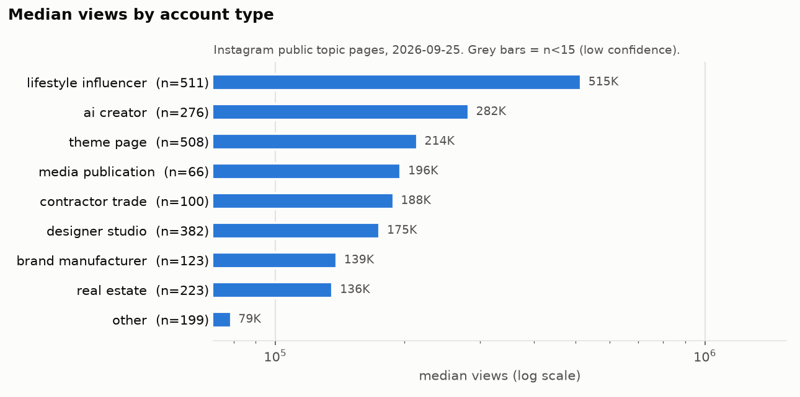

# Teil 34: Quellen und Quellenqualität

**Stand aller Abrufe: 25.09.2026.** Dieses Dokument ist der Index aller Quellen des Playbooks. Es beantwortet drei Fragen:
Woher stammt jede Zahl? Wie belastbar ist sie? Welche Quelle gilt, wenn sich zwei widersprechen?

Navigation: [Projekt-README](../README.md) · [Alle Kennzahlen (Digest)](../data/processed/analysis_digest.md) ·
[Reel-Datenbank](../04_reel_database.csv) · [Account-Datenbank](../02_competitor_database.csv)

| Abschnitt | Inhalt |
|---|---|
| [34.0](#340-status-tags-gelten-für-das-ganze-playbook) | Status-Tags (VERIFIED / ESTIMATED / THIRD-PARTY ESTIMATE / UNKNOWN / PROXY) |
| [34.1](#341-primärdaten-dieser-studie) | Primärdaten: Methode, Umfang, was belegt ist und was nicht, Codier-Reliabilität |
| [34.2](#342-recherche-notizen-q01q09-und-faktencheck) | Recherche-Notizen q01–q09 und Ergebnis des automatisierten Faktenchecks |
| [34.3](#343-die-wichtigsten-externen-links-150-von-561) | Die wichtigsten 150 externen Links, nach Quellentyp gruppiert |
| [34.4](#344-rangfolge-der-quellenqualität-angewandte-regeln) | Rangfolge der Quellenqualität und Entscheidungsregeln bei Widersprüchen |
| [34.5](#345-bekannte-grenzen-und-verzerrungen-bias-register) | Bekannte Grenzen und Verzerrungen (Bias-Register) |
| [34.6](#346-zitier--und-pflegeregeln-checkliste) | Zitier- und Pflegeregeln (Checkliste) |

---

## Kurzfassung

1. **Der Kernbeleg ist eine eigene Erhebung öffentlicher Instagram-Seiten.** Sie umfasst 2.498 eindeutige Reels von
   239 Topic-Seiten. Views sind für 2.479 Reels **VERIFIED** (öffentlich angezeigt, gerundet), Follower für 2.397 Reels.
   Die Posting-Zeit ist für alle 2.498 Reels aus dem Shortcode abgeleitet.
2. **Alle inhaltlichen Codes sind ESTIMATED.** Stil, Raum, KI vs. real, Realismus und Hooks wurden KI-gestützt aus
   Cover-Frame und Caption codiert. Eine unabhängige Zweitcodierung (n=36) ergibt Cohen's κ von 0,63 (`shoppability`) bis 1,0.
3. **Länge, Kamera, Audio und die ersten Sekunden sind auf Instagram nicht gemessen.** Es gibt nur 7 Reels aus dem
   NexLev-Video-Tool (Limit 15 Aufrufe pro Tag) und einen YouTube-Proxy (12 Kanäle, 713 Shorts). Diese Angaben sind **PROXY bzw. UNKNOWN**.
4. **Neun Recherche-Notizen** mit 428 Quellenlisten-Einträgen (393 eindeutige URLs). Der automatisierte Faktencheck
   prüfte 108 Kernaussagen: **87 CONFIRMED, 12 CORRECTED, 9 NOT_CONFIRMED**. Keine Kernaussage wurde durch die zitierte Quelle
   im Kern widerlegt; die 12 CORRECTED-Fälle sind Detailkorrekturen (Werte, Datum, Kontext). Von den 9 NOT_CONFIRMED waren fünf falsch zugeordnet, zwei enthielten Details, die die Quelle nicht hergibt, und zwei Projektzahlen in q06 sind veraltet.
5. **Die größte Verzerrung ist die Selektion.** Topic-Seiten zeigen Gewinner: Der Median liegt bei 233.000 Views, und 19 % der Reels
   mit Followerdaten (459 von 2.378) erreichen mindestens das 20-Fache der Followerzahl. **Relative Vergleiche** (`adj_factor`) sind belastbarer,
   gelten aber nur „unter Reels, die es auf eine Topic-Seite geschafft haben“; **absolute Zahlen sind keine Prognose**.

---

## 34.0 Status-Tags (gelten für das ganze Playbook)

| Tag | Bedeutung | Typische Herkunft in diesem Projekt |
|---|---|---|
| **VERIFIED** | Selbst in der Quelle gesehen: auf einer öffentlichen Seite, im Primärtext oder als wörtliches Zitat. Das heißt: **„Die Quelle sagt es so“**, nicht automatisch „es stimmt“ (so ausdrücklich in [q03](q03_sponsors_brand_deals.md), [q06](q06_ai_theme_page_case_studies.md), [q09](q09_reels_format_benchmarks.md)). | Views von Topic-Seiten (gerundet), Follower/Likes/Kommentare von Embed-Seiten, Meta-Regeltexte, Programmbedingungen, Gesetzestexte |
| **ESTIMATED** | Eigene Ableitung, Rechnung oder KI-gestützte Codierung | alle Cover-/Caption-Codes, Posting-Frequenz (Obergrenze), Account-Alter (Untergrenze), Planungsableitungen in den q-Notizen |
| **THIRD-PARTY ESTIMATE** | Zahl oder Behauptung eines Dritten ohne offengelegten Primärbeleg. Dazu zählen auch Einkommens-Selbstauskünfte von Creatorn ([q06](q06_ai_theme_page_case_studies.md)) und NexLev-Umsätze und -Outlier-Scores ([q08](q08_cross_platform_signals.md)). | Influencer-Preislisten, Affiliate-Verzeichnisse, Benchmark-Faustregeln, NexLev-Klassifikationen |
| **UNKNOWN** | Nicht belegbar: Seite blockiert (403/429/Cloudflare), nur als Such-Snippet gesehen, widersprüchlich oder öffentlich gar nicht messbar | Saves, Shares, Watch Time, Reel-Länge auf Instagram; Profilseiten (HTTP 429) |
| **PROXY** | Ersatzmessung auf einer anderen Plattform. Sie zeigt eine Richtung, keinen Instagram-Wert. | YouTube-Shorts-Dauer, Bildwechsel, Titel-Hooks |

**Uneinheitlichkeit zwischen den Notizen:** [q04](q04_interior_trends_demand.md) führt „nur als Such-Snippet gesehen“ als
`ESTIMATED`, [q02](q02_furniture_affiliate_commerce.md) und [q03](q03_sponsors_brand_deals.md) dagegen als `UNKNOWN`.
**Regel für das Playbook:** Es gilt die strengere Lesart, also Snippet = `UNKNOWN`.

---

## 34.1 Primärdaten dieser Studie

### Überblick

| # | Quelle | Methode | Umfang (Stand 25.09.2026) | VERIFIED | ESTIMATED | UNKNOWN | Dateien |
|---|---|---|---|---|---|---|---|
| 1 | **Instagram-Topic-Seiten** `instagram.com/popular/<slug>/` | Abruf ohne Login; je Seite bis zu 12 Top-Reels mit Views und dem Label „X reels on Instagram“ | 264 Abrufe inkl. Wiederholungen (250 eindeutige Slugs), **239 Topic-Seiten mit Reels**, 2.863 Reel-Einträge → **2.498 eindeutige Reels**, 1.985 Handles | Views für 2.479 Reels (gerundet); Reel-Anzahl je Thema | – | Views für 19 Reels; nach welcher Logik Instagram die Reels auswählt | [topics_status.csv](../data/processed/topics_status.csv), [topic_reels.csv](../data/processed/topic_reels.csv), [reels_unique.csv](../data/processed/reels_unique.csv) |
| 2 | **Öffentliche Embed-Seiten** `/reel/<code>/embed/captioned/` | Abruf ohne Login | Follower für 2.397 Reels (2.395 per Reel-Embed, 2 per Account-Lookup); 208 Account-Lookups | Follower und Posts (gerundet, **zum Abrufzeitpunkt**), Likes, Kommentare, Caption, Cover-URL | – | Follower für 101 Reels; 91 Reels waren beim Abruf entfernt (`meta_status = removed`) | [accounts_followers.csv](../data/processed/accounts_followers.csv), [04_reel_database.csv](../04_reel_database.csv) |
| 3 | **Shortcode-Zeitstempel** | Dekodierung der Media-ID aus dem Shortcode (siehe unten) | alle 2.498 Reels; Postings vom 19.03.2020 bis 23.09.2026 | UTC-Datum und -Uhrzeit (abgeleitet, an bekannten Daten geprüft) | Account-Mindestalter (frühester bekannter Post), Posting-Frequenz (Obergrenze) | – | [shortcode_time.py](../scripts/shortcode_time.py) |
| 4 | **Cover-Frame (Instagram-CDN) + Caption, KI-gestützt codiert** | Multimodale Agenten nach festem Codebuch v2 | 2.393 Reels mit Cover + Caption, 104 nur Caption, 1 uncodiert | – | alle Codes | Bewegung, Länge, Audio (aus einem Standbild nicht codierbar) | [cover_codebook.md](../scripts/cover_codebook.md), [reel_codebook_prompt.txt](../scripts/reel_codebook_prompt.txt), [reels_cover_coded.csv](../data/processed/reels_cover_coded.csv), [reliability.csv](../data/processed/stats/reliability.csv) |
| 5 | **NexLev Video-Watcher** (`watch_instagram_video_and_ask`) | Video-KI beantwortet feste Fragen zum Reel | **7 Reels** (Limit 15 Aufrufe pro Tag) | – | Länge, Szenen, Kamera, Audio, erstes Bild | alle übrigen 2.491 Reels | [reels_video_coded.csv](../data/processed/reels_video_coded.csv) |
| 6 | **NexLev YouTube-Daten** (Drittanbieter) | NexLev-Datenbank und Echtzeit-YouTube-Abfragen | 12 Faceless-Interior-/Home-Kanäle, 713 Shorts, davon 219 mit Dauer und Details; in [q08](q08_cross_platform_signals.md) zusätzlich 224 Kanal-Snapshots | öffentliche YouTube-Views, Titel, Dauer | Bildwechsel-Score, Titel-Hook-Codes | Übertragbarkeit auf Instagram → **PROXY**; NexLev-Umsatz und Outlier-Scores = THIRD-PARTY ESTIMATE | [youtube_shorts.csv](../data/processed/youtube_shorts.csv), [youtube_shorts_details.csv](../data/processed/youtube_shorts_details.csv), [data/raw/youtube/](../data/raw/youtube/) |
| 7 | **Account-Profile** | Threads-Bios, Link-in-Bio-Seiten, Embeds, öffentliche Posts | 72 Accounts tief profiliert (111 Zeilen in der Account-DB) | Bio, Links, Angebote, wo eine URL vorliegt (72 Accounts); Follower für 103 Accounts | Content-Modus (96), Posting-Frequenz (103), Account-Alter (108) | Monetarisierung bei 39 nicht tief profilierten Accounts; „nicht gesehen“ heißt nicht „nicht vorhanden“ | [02_competitor_database.csv](../02_competitor_database.csv), [data/raw/accounts/](../data/raw/accounts/) |
| 8 | **Desk Research** (WebSearch/WebFetch) | 9 Notizen; das WebSearch-Budget (200 pro Sitzung) war früh erschöpft, danach nur direkte Abrufe bekannter URLs | 428 Quellenlisten-Einträge, 393 eindeutige URLs, 108 geprüfte Kernaussagen | je Aussage getaggt | je Aussage getaggt | blockierte Seiten (403/429/Paywall) | [q01–q09](#342-recherche-notizen-q01q09-und-faktencheck) |

**Status je Feld in der Reel-Datenbank** ([04_reel_database.csv](../04_reel_database.csv), n=2.498):

| Feld | Verteilung |
|---|---|
| `status_views` | VERIFIED (öffentliche Topic-Seite, gerundet): 2.479 · UNKNOWN: 19 |
| `status_followers` | VERIFIED (öffentliches Embed, gerundet, zum Abrufzeitpunkt): 2.397 · UNKNOWN: 101 |
| `status_codes` | ESTIMATED (Cover + Caption): 2.393 · ESTIMATED (nur Caption): 104 · UNKNOWN (nicht codiert): 1 |
| `meta_status` | ok: 2.406 · removed: 91 · error: 1 |

### a) Instagram-Topic-Seiten (Quelle 1)

- **Was die Seite zeigt:** bis zu 12 Reels zu einem Suchbegriff, jeweils mit der öffentlich angezeigten, gerundeten
  View-Zahl (z. B. „3.7M“), außerdem ein Label wie „901M reels on Instagram“. Nach welcher Logik Instagram diese Reels
  auswählt, ist **UNKNOWN**. Sicher ist nur: Es sind die Top-Reels des Themas, nicht eine Zufallsstichprobe (siehe [34.5](#345-bekannte-grenzen-und-verzerrungen-bias-register)).
- **Abdeckungslücke:** 11 Slugs lieferten auch bei Wiederholung keine Reels, darunter einige der größten Themen:
  `interior-design`, `mansion`, `modern-mansion`, `penthouse`, `new-york-penthouse`, `hotel-room`, `fantasy-house`,
  `brutalist-architecture`, `japandi-interior`, `wine-cellar`, `ai-video`. Für 9 weitere Themen wurde ein Ersatz-Slug genutzt
  (z. B. `cozy-bedroom` → `cozy-bedroom-ideas`, `infinity-pool` → `infinity-pools`). Quelle: [topics_status.csv](../data/processed/topics_status.csv).

### b) Öffentliche Embed-Seiten (Quelle 2)

- Die Follower-Zahl ist **gerundet** („584K followers“) und gilt **zum Abrufzeitpunkt 25.09.2026**, nicht zum Zeitpunkt
  des Postings. Bei älteren Reels hatte der Account damals meist weniger Follower. Views pro Follower (`vpf`) sind deshalb
  eher konservativ, und bei stark gewachsenen Accounts ist der `adj_factor` verzerrt.
- Likes und Kommentare sind Live-Zähler. Beim Faktencheck in [q06](q06_ai_theme_page_case_studies.md) drifteten sie um weniger als 0,01 %.
- **Embed-Seiten zeigen keine Views.** Views stammen immer von der Topic-Seite (siehe [34.2](#pflicht-korrekturen-beim-zitieren)).

### c) Shortcode-Zeitstempel (Quelle 3): wie das funktioniert

Instagram vergibt jedem Post eine 64-Bit-Media-ID. Die **oberen 41 Bit** speichern die Millisekunden seit einer eigenen
Epoche (1.314.220.021.721 ms = 24.08.2011, 21:07:01.721 UTC), die **unteren 23 Bit** Shard und Sequenz. So beschreibt es der
Beitrag „Sharding & IDs at Instagram“ von Instagram Engineering (2012), zitiert im Skript-Kopf; die URL ist im Projekt nicht
hinterlegt. Der öffentliche Shortcode in der Reel-URL ist genau diese ID in Base64 mit dem Alphabet `A–Z a–z 0–9 - _`.

```text
n  = Base64-Wert der ersten 11 Zeichen des Shortcodes   (Σ Index(Zeichen) · 64^Stelle)
ms = (n >> 23) + 1314220021721                          (41-bit-Zeitstempel + Instagram-Epoche)
posted_at_utc = ms als UTC-Zeitpunkt                    (Plausibilitätsfilter: Jahr 2012–2027)
```

- **Validierung:** `DBWhf0koR7_` ergibt den 20.10.2024 (von der Reel-Seite im [q06](q06_ai_theme_page_case_studies.md)-Faktencheck bestätigt),
  `C6rOLbLriyx` ergibt den 07.05.2024. Für das zweite Datum nennt nur der Skript-Kopf einen Abgleich mit einem bekannten Postingdatum;
  ein archivierter Beleg dafür liegt im Projekt nicht vor.
- **Daraus abgeleitet:** `posted_at_utc`, `age_days`, `post_year`, `post_hour_utc`, `post_weekday`. Auf Account-Ebene ergeben sich
  das Mindestalter (frühester bekannter Post) und eine Obergrenze für die Posting-Frequenz (Posts ÷ Tage seit frühestem bekannten Post).
- **Risiko:** Sollte Instagram das ID-Schema ändern, liefert die Funktion falsche Daten. Der Plausibilitätsfilter fängt nur grobe Fehler ab.
  Alle 2.498 dekodierten Daten liegen im plausiblen Bereich 2020–2026; von den zwei Stichproben ist eine extern belegt (q06). Eine systematische Prüfung
  aller Werte gegen die Reel-Seiten gab es nicht, daher gilt der Status „VERIFIED (abgeleitet)“.

### d) Cover-Frames und KI-gestützte Codierung (Quelle 4)

- **Ablauf:** Das Cover-Bild (`og:image` vom Instagram-CDN) und die Caption gingen an multimodale KI-Agenten. Diese
  codierten nach einem festen Codebuch mit festen Kategorien ([cover_codebook.md](../scripts/cover_codebook.md)): Raum, Gebäudetyp,
  Landschaft, Stil, Farbtemperatur, Helligkeit, Farben, Materialien, Licht, Effekte, Fensterblick, Personen, Cover-Text,
  Cover-Hooks, Realismus, Produktion (KI/3D/real), Kaufbarkeit, visuelle Qualität, Caption-Hook, CTA, Sprache, Account-Typ.
- **Cover-Bilder wurden nicht gespeichert**, weil sie urheberrechtlich geschützte Werke Dritter sind.
- **Ergebnis Produktion** (ESTIMATED, n=2.393): real_footage 1.417 · ai_generated 694 · 3d_render 174 · unclear 108.

**Reliabilität:** Eine Zufallsstichprobe (Seed 42) von **36 bereits codierten Reels** wurde von unabhängigen Agenten ein
zweites Mal codiert ([reliability.py](../scripts/reliability.py), Rohdaten in [data/raw/reliability/](../data/raw/reliability/)).
Die Einordnung der κ-Werte folgt der gängigen Konvention (0,61–0,80 = erheblich, 0,81–1,00 = fast vollständig).

| Feld | n | Übereinstimmung | Cohen's κ | Typ | Einordnung und Folge für die Nutzung |
|---|---|---|---|---|---|
| room_primary | 36 | 1,000 | 1,000 | kategorial | fast vollständig |
| realism | 36 | 1,000 | 1,000 | kategorial | fast vollständig; trägt den robusten Fantasy-Befund |
| people_present | 36 | 1,000 | 1,000 | kategorial | fast vollständig |
| view_through_window | 36 | 1,000 | 1,000 | kategorial | fast vollständig |
| ai_disclosed | 36 | 1,000 | 1,000 | kategorial | fast vollständig |
| caption_hook_category | 36 | 0,972 | 0,966 | kategorial | fast vollständig |
| cta_type | 36 | 0,972 | 0,964 | kategorial | fast vollständig |
| landscape | 36 | 0,972 | 0,957 | kategorial | fast vollständig |
| brightness | 36 | 0,972 | 0,949 | kategorial | fast vollständig |
| production | 36 | 0,972 | 0,945 | kategorial | fast vollständig (Agent gegen Agent, siehe Einschränkung) |
| building_type | 36 | 0,917 | 0,900 | kategorial | fast vollständig |
| palette_temp | 36 | 0,889 | 0,825 | kategorial | fast vollständig |
| style_primary | 36 | 0,833 | 0,803 | kategorial | Grenzfall erheblich / fast vollständig (≈0,80); Stil-Grenzen sind unscharf |
| account_kind_hint | 36 | 0,833 | 0,789 | kategorial | erheblich; **der Account-Typ-Befund (robust) steht auf dieser Variablen** |
| lighting | 36 | 0,778 | 0,725 | kategorial | erheblich; Licht-Aussagen nur als Richtung |
| shoppability | 36 | 0,778 | 0,629 | kategorial | **schwächstes Feld**; Kaufbarkeit nur grob nutzen |
| ambience_fx | 36 | 0,954 | – | Liste (mittlerer Jaccard) | hohe Überlappung |
| rooms_visible | 36 | 0,894 | – | Liste (mittlerer Jaccard) | hohe Überlappung |
| materials | 36 | 0,886 | – | Liste (mittlerer Jaccard) | hohe Überlappung |
| cover_hooks | 36 | 0,848 | – | Liste (mittlerer Jaccard) | gute Überlappung |
| dominant_colors | 36 | 0,827 | – | Liste (mittlerer Jaccard) | gute Überlappung; Farbwörter sind frei formuliert |

**Einschränkungen der Reliabilität:**
1. **Übereinstimmung ist nicht gleich Richtigkeit.** Beide Codierungen stammen von KI-Agenten. Einen menschlichen Goldstandard
   gibt es nicht (**UNKNOWN**). Systematische Fehler, die beide Agenten teilen, bleiben unsichtbar. Das betrifft vor allem
   `production`, denn fotorealistische KI ist vom Cover allein kaum sicher zu erkennen. Beispiel: Das Reel von @drcozyvibes ist in der DB
   als `ai_generated` codiert, obwohl die Caption keinen KI-Hinweis enthält ([q05](q05_competitor_lists.md), Faktencheck #11).
2. **n=36 ist klein.** Die κ-Werte sind entsprechend unsicher; Konfidenzintervalle wurden nicht berechnet.
3. Codiert wurde nur das **Cover**, nicht das Video. Ein Reel mit starkem Reveal nach Sekunde 3 wird nach seinem Startbild beurteilt.

### e) NexLev Video-Watcher (Quelle 5)

- Das Tool analysiert ein Instagram-Video (laut Projekt-README Gemini-basiert) und beantwortet feste Fragen: Länge, Szenenzahl,
  Kamerabewegung, Format, erstes Bild, On-Screen-Text, Audio, Musik, Produktion.
- **Limit: 15 Aufrufe pro Tag.** Nur **7 Reels** konnten analysiert werden. Sie waren 7–23 s lang, 3 davon mit statischer Kamera
  ([Digest, Abschnitt „NexLev video-watched reels“](../data/processed/analysis_digest.md)).
- **Status:** ESTIMATED, n=7. Das ist **anekdotisch** und für keine Segmentaussage ausreichend. Länge, Kamera und Audio bleiben auf
  Instagram **UNKNOWN** und gehören als Testvariablen in die Testing-Matrix (Teil 28).

### f) NexLev YouTube-Daten (Quelle 6, Drittanbieter)

- **Datenbasis:** 12 relevante Faceless-Interior-/Home-Kanäle, 713 Shorts aus den Listen „beliebt“ und „neueste“ je Kanal
  (217 nur beliebt, 208 nur neueste, 288 in beiden), 219 davon mit Dauer, Likes und Kommentaren. Views werden je Kanal auf den
  Kanal-Median normiert (`ch_index`). Der „Bildwechsel“ ist die mittlere Pixel-Differenz der automatischen YouTube-Thumbnails bei
  etwa 25/50/75 % der Laufzeit. Titel-Hooks wurden per Regex codiert ([youtube_proxy.py](../scripts/youtube_proxy.py)).
- **Was VERIFIED ist:** öffentliche YouTube-Views, Titel, Dauer und Veröffentlichungsdatum.
- **Was THIRD-PARTY ESTIMATE ist:** NexLev-Umsatz (= Views × 0,0001 USD, also pauschal 0,10 $ RPM; laut [q08](q08_cross_platform_signals.md) an allen
  224 Kanälen nachgerechnet und im Faktencheck an 304 Kanälen bestätigt), Outlier-Scores sowie KI- und Faceless-Flags.
- **Warum nur PROXY:** Shorts sind nicht Reels. Andere Empfehlungslogik, andere Nutzer, andere Monetarisierung. Zudem sind die
  Vergleiche konfundiert: Kurze Shorts haben weniger Bildwechsel (Median 15 s bei „low change“ vs. 60 s bei „high change“,
  je n=73), und „ältere Hits vs. neueste Uploads“ vergleicht verschieden alte Videos.

### g) Account-Profile (Quelle 7)

- 72 Accounts wurden tief profiliert: Threads-Bios, Link-in-Bio-Seiten, Embeds und öffentliche Posts. Die Instagram-Profilseiten
  selbst antworteten mit HTTP 429 und wurden **nicht** weiter abgerufen.
- Die Status-Spalten der [Account-DB](../02_competitor_database.csv) (111 Zeilen):
  Follower VERIFIED 103 · UNKNOWN 7 · THIRD-PARTY 1; Posting-Frequenz ESTIMATED-Obergrenze 103; Account-Alter ESTIMATED-Untergrenze 108;
  Monetarisierung VERIFIED (wo URL im Profil) 72 · UNKNOWN (nicht tief profiliert) 39; Content-Modus ESTIMATED 96 · UNKNOWN 15.

### h) Desk Research per WebSearch/WebFetch (Quelle 8)

- Neun Notizen mit einheitlichem Aufbau: Fragestellung, Kernbefunde, Zahlen-Tabelle, Widersprüche, Quellenliste und automatisierter Faktencheck.
- **Kein Login, keine Umgehung von Paywalls, Rate-Limits oder Cloudflare.** Blockierte Seiten sind als UNKNOWN markiert.
- **WebSearch-Budget:** Nach 200 Suchen pro Sitzung war Schluss. q04 bis q09 melden, dass das Budget bereits erschöpft war.
  Danach wurden nur bekannte oder verlinkte URLs direkt abgerufen. Suchmaschinen wurden nicht per WebFetch nachgebaut.
  **Folge:** Reddit-, X-, Indie-Hackers- und Medium-Belege fehlen fast vollständig ([q06](q06_ai_theme_page_case_studies.md)).
  Das ist eine Lücke, kein Beleg dafür, dass es solche Beiträge nicht gibt.

---

## 34.2 Recherche-Notizen q01–q09 und Faktencheck

**Zählweise:** „Einträge“ = Zeilen der Quellenliste (ohne Sammelzeilen „nicht erreichbar“ und interne Querverweise).
„URLs“ = eindeutige URLs in dieser Liste. Die Quellentypen sind so gezählt, wie die Notiz sie vergibt.
Faktencheck: pro Notiz wurden 12 Kernaussagen **nur gegen die jeweils zitierte URL** erneut abgerufen, ohne Ersatzquellen
(q05 zusätzlich gegen die Projekt-DB, soweit Aussagen ihr zugeschrieben sind; q08 mit NexLev-Neuabfragen und archivierten Rohdateien).

| Notiz | Thema (Teile) | Einträge / URLs | Haupt-Quellentypen | Methode (laut Notiz) | Faktencheck (12 Claims) |
|---|---|---|---|---|---|
| [q01](q01_instagram_platform_rules.md) | Instagram-Plattformregeln: Ranking, Originalität, KI-Labels, Monetarisierung (12, 13, 23) | 51 / 51 | news_media 24 · meta_primary 19 · blog 5 · other 3 | ca. 60 Abrufe | **11 CONFIRMED** · 1 CORRECTED · 0 NOT_CONFIRMED |
| [q02](q02_furniture_affiliate_commerce.md) | Möbel-/Home-Affiliate, Social Commerce (19, 20) | 80 / 80 | company_primary 39 · news 15 · blog 10 · analytics 6 · other 6 · industry 3 · meta 1 | ca. 75 Suchen/Abrufe | **12 CONFIRMED** · 0 · 0 |
| [q03](q03_sponsors_brand_deals.md) | Sponsoren, Brand Deals, KI-Tool-Programme (20) | 53 / 53 | company_primary 23 · blog 10 · news 9 · industry 5 · other 3 · meta 2 · instagram_public 1 | rund 70 Suchen/Abrufe | **11 CONFIRMED** · 0 · 1 NOT_CONFIRMED |
| [q04](q04_interior_trends_demand.md) | Nachfrage- und Trendindikatoren (1, 16, 21) | 47 / 46 | company_primary 19 · instagram_public 9 · industry 7 · news 5 · other 3 · blog 2 · analytics 2 | WebSearch nach wenigen Suchen erschöpft, danach direkte Abrufe; Google Trends HTTP 429 | **9 CONFIRMED** · 1 CORRECTED · 2 NOT_CONFIRMED |
| [q05](q05_competitor_lists.md) | Wettbewerber-Landkarte, 354 Handles (2, 3, 4) | 31 / 30 (+ Anhang mit 354 Handles) | analytics_platform 24 · other 3 · instagram_public 2 · company_primary 2 | keine WebSearch; hafi.pro, HypeAuditor, 33 Embed-Abrufe | **11 CONFIRMED** · 0 · 1 NOT_CONFIRMED |
| [q06](q06_ai_theme_page_case_studies.md) | Fallstudien KI-Theme-Pages (4, 20, 21) | 36 / 38 | other 8 · news 7 · instagram_public 6 · company_primary 6 · blog 5 · industry 2 · meta 2 | keine WebSearch; über 60 Abrufe inkl. NexLev-Transkripte | **4 CONFIRMED** · 5 CORRECTED · 3 NOT_CONFIRMED |
| [q07](q07_legal_ai_risk.md) | Recht und Plattformrisiko KI (23, 33, 35) | 58 / 58 | company_primary 30 (21 Behörden-Dokumente, 9 Tool-AGB) · other 15 (Gesetze, Gerichte) · meta 7 · blog 5 · instagram_public 1 | ca. 70 Abrufe auf Primärquellen | **9 CONFIRMED** · 1 CORRECTED · 2 NOT_CONFIRMED |
| [q08](q08_cross_platform_signals.md) | Cross-Platform-Signale YouTube/TikTok (8, 12, 21) | 27 / 22 (6 NexLev-/Such-Einträge ohne URL) | other 16 (YouTube-Metadaten) · analytics 5 (NexLev) · company 3 · industry 2 · news 1 | NexLev-MCP + WebFetch; WebSearch nicht verfügbar | **9 CONFIRMED** (3 davon mit Einschränkung) · 3 CORRECTED · 0 |
| [q09](q09_reels_format_benchmarks.md) | Reels-Format-Benchmarks (12, 13, 30) | 45 / 45 | analytics_platform 21 · blog 13 · meta 6 · industry 3 · news 2 | rund 60 Fetches, etwa 40 mit Inhalt; Kernzahlen doppelt abgerufen | **11 CONFIRMED** · 1 CORRECTED · 0 |
| **Summe** | | **428 / 393 eindeutig** | | | **87 CONFIRMED · 12 CORRECTED · 9 NOT_CONFIRMED** (n=108) |

Die Teil-Zuordnung in Klammern zeigt, wo die Notiz hauptsächlich genutzt wird. Sie ist eine Orientierung, keine Vollständigkeitsliste.

### Was NOT_CONFIRMED und CORRECTED hier bedeuten

„NOT_CONFIRMED“ heißt: **Die zitierte URL enthält die Aussage nicht (vollständig).** Das bedeutet nicht, dass die Aussage falsch ist.
Die 9 Fälle verteilen sich so:

| Kategorie | Fälle | Konsequenz |
|---|---|---|
| Quelle falsch oder unvollständig zugeordnet | q04 #2 (88 % / 67 % / 600 Mio. stehen in der Newsroom-Meldung, nicht auf der Neo-Deco-Seite) · q04 #11 (BusinessWire blockiert; gleiche Werte auf der 1stDibs-IR-Seite) · q05 #12 (URL belegt nur sunt_mrr; die übrigen Werte stammen aus der Projekt-DB) · q06 #2 (Views stehen nur in den Projektdaten, nicht auf der Reel-Seite) · q07 #3 (FLI-Angabe und Einigung vom Mai 2026 stehen nicht auf der Omnibus-Seite) | beim Zitieren die richtige Quelle angeben |
| Details stehen nicht in der Quelle | q03 #2 (Gemlist: $491.909 Gesamtauszahlung, „nur Instagram/YouTube“, Sponsored-Kennzeichnung nicht belegt) · q07 #4 (Inhalt der Art.-50-Leitlinien bestätigt, Datumsangaben nicht im PDF) | die Details als **UNKNOWN** behandeln |
| **Veraltete Projektzahlen** | q06 #10 (KI-Anteil nach Jahr) · q06 #11 (Median-Views nach Produktion) | **nicht aus q06 zitieren**, sondern aus dem Digest (siehe unten) |

Die 12 CORRECTED-Fälle sind überwiegend kleine Abweichungen: Live-Zählerdrift bei Likes (q06, 5 Fälle; in 4 davon stehen zudem
die genannten Views nicht im Embed), zeitabhängige YouTube-Werte und -Suchstichproben (q08, 3), ein Datum mit einem Tag Abweichung,
vermutlich durch die Zeitzonen-Darstellung (q07 #12: Changelog zeigt 26.08.2024 statt 27.08.2024), ein unscharfer Kontext
(q01 #5: Die maximale Reel-Länge von 3 min ist belegt; dass auch die *Empfehlungsgrenze* bei 3 min liegt, belegt nur das Creators-FAQ),
umgerechnete Houzz-Faktoren (q04 #8: „more than 3x“ ist nicht dasselbe wie +300 %) und eine Tag-Hochstufung (q09 #6: Die Werte 3,30 % und 3,15 % stehen im Fließtext, also VERIFIED).

### Pflicht-Korrekturen beim Zitieren

- [ ] **KI-Anteil nach Postjahr** nicht aus q06, sondern aus [summary.json](../data/processed/stats/summary.json):
      4,6 % (2023) → 22,4 % (2024) → 29,2 % (2025) → 33,2 % (2026). Das ist der Anteil an codierten Topic-Reels, ESTIMATED.
- [ ] **Views nach Produktion** nicht aus q06, sondern aus [seg_production.csv](../data/processed/stats/seg_production.csv):
      Median ai_generated 194.000 (n=689), real_footage 256.000 (n=1.405), 3d_render 260.000 (n=172). Größenbereinigt:
      KI vs. real ≈0,92× (95-%-Konfidenzintervall 0,75–1,09; p=0,17; n=686 vs. 1.399) → **nicht signifikant** ([key_contrasts.csv](../data/processed/stats/key_contrasts.csv)).
- [ ] **Reel-Views in q05/q06** (z. B. 34,7 Mio. bei @aiforarchitects, 136 Mio. bei @ifonly.ai) stammen von **Topic-Seiten** und
      nicht aus den zitierten Embeds. Als Quelle gilt [04_reel_database.csv](../04_reel_database.csv) (VERIFIED, gerundet). Das Embed zeigt nur Likes.
- [ ] **Pinterest-Methodikzahlen** (88 % Trefferquote, 67 % Gen Z, 600 Mio. Nutzer) mit der Pinterest-Newsroom-URL zitieren,
      **1stDibs-Werte** mit der IR-Seite, **Houzz-Werte** als Faktoren belassen und nicht in Prozent umrechnen.
- [ ] **Higgsfield Earn** nur mit der Primärquelle zitieren: 1.000 USD Cap am ersten Tag, maximal 2.500 USD pro Video (higgsfield.ai/earn, q03 #1).
      Die Gemlist-Zusatzangaben sind UNKNOWN.
- [ ] **Art.-50-Leitlinien-Entwurf:** Inhalt VERIFIED, Veröffentlichungs- und Konsultationsdatum UNKNOWN.

---

## 34.3 Die wichtigsten externen Links (150 von 561)

**Methode:** Ein Python-Skript extrahierte aus q01–q09 alle Markdown-Links `[Text](URL)` und alle URL-Zellen der
Quellenlisten-Tabellen. Die URLs wurden normalisiert (http → https, ohne `www.`, ohne abschließenden Schrägstrich), Duplikate
zusammengeführt und die zitierenden Notizen gesammelt. Ergebnis: **561 eindeutige URLs**. Davon stehen 393 in den Quellenlisten,
168 kommen nur als Inline-Link vor. Unter den Inline-Links sind 146 Instagram-Links; 145 davon stehen nur in [q05](q05_competitor_lists.md), überwiegend im Handle-Anhang.

**Auswahl der 150** (in dieser Reihenfolge):
1. alle Meta-/Instagram-Primärquellen (26),
2. Quellen, deren Aussagen im Faktencheck geprüft wurden oder deren Zahlen das Playbook nutzt,
3. mehrfach zitierte Quellen (32 URLs werden in mindestens zwei Notizen zitiert),
4. je Anbieter nur die zentralen Seiten (z. B. 2 der 14 HypeAuditor- und 2 der 10 hafi.pro-Einträge aus q05).

Die 150 Einträge sind 147 URLs, 2 URL-Muster und der NexLev-Zugang ohne öffentliche URL. Die vollständigen Listen stehen in den Notizen. Format: `[Titel](URL) · zitiert in · Datum laut Notiz`.

### A. Öffentliche Instagram-Daten (Rang 1) – 11 Einträge

- `https://www.instagram.com/popular/<slug>/`: öffentliche Topic-Seiten, Grundlage des Reel-Sweeps (264 Abrufe, 250 eindeutige Slugs, 239 Topic-Seiten mit Reels; Liste in [topics_status.csv](../data/processed/topics_status.csv)) · Sweep, q04
- `https://www.instagram.com/reel/<shortcode>/embed/captioned/`: öffentliche Embed-Seiten (Follower, Posts, Likes, Kommentare, Caption, Cover-URL) · Sweep, q05, q06
- [Home Decor • 901M reels on Instagram](https://www.instagram.com/popular/home-decor/) · q04 · abgerufen 2026-09-25
- [Architecture • 1B reels on Instagram](https://www.instagram.com/popular/architecture/) · q04 · abgerufen 2026-09-25
- [Ai Interior Design • 152K reels on Instagram](https://www.instagram.com/popular/ai-interior-design/) · q04 · abgerufen 2026-09-25
- [Reel-Embed @soothenests (DBWhf0koR7_)](https://www.instagram.com/reel/DBWhf0koR7_/embed/captioned/) · q05, q06
- [Reel-Embed @drcozyvibes (C87NQHRtm6B)](https://www.instagram.com/reel/C87NQHRtm6B/embed/captioned/) · q05, q06
- [Reel-Embed @siyad_abdali (C_Pf1dboaeJ)](https://www.instagram.com/reel/C_Pf1dboaeJ/embed/captioned/) · q06 · abgerufen 2026-09-25 (Post 2024-08-29)
- [Reel-Embed @aiforarchitects (DHBihXfMPDA)](https://www.instagram.com/reel/DHBihXfMPDA/embed/captioned/) · q06 · abgerufen 2026-09-25 (Post 2025-03-10)
- [Reel-Embed @ifonly.ai (C--Al6UA6GE)](https://www.instagram.com/reel/C--Al6UA6GE/embed/captioned/) · q05, q06
- [Reel-Embed @visionbuildofficial (DW8_CcQESn8)](https://www.instagram.com/reel/DW8_CcQESn8/embed/captioned/) · q05, q07

### B. Meta/Instagram-Primärquellen (Rang 2) – 26 Einträge

- [Changes to reward original creators (Instagram for Creators)](https://creators.instagram.com/blog/recommendations-and-originality) · q01, q09 · 2024-04-30
- [Original Creators Get Priority](https://creators.instagram.com/blog/rewarding-original-creators-on-instagram) · q01, q06, q09 · 2026-04-30
- [Instagram Ranking Explained](https://about.instagram.com/blog/announcements/instagram-ranking-explained/) · q01, q09 · 2023-05-31
- [Instagram for Creators FAQ](https://creators.instagram.com/faq?locale=en_US) · q01, q09 · undatiert
- [Instagram Recommendation Guidelines (Help Center)](https://www.facebook.com/help/instagram/313829416281232) · q01, q07 · undatiert
- [Labeling AI-Generated Images on Facebook, Instagram and Threads](https://about.fb.com/news/2024/02/labeling-ai-generated-images-on-facebook-instagram-and-threads/) · q01, q07 · 2024-02-06 (upd. 2025-04-01)
- [Our Approach to Labeling AI-Generated Content and Manipulated Media](https://about.fb.com/news/2024/04/metas-approach-to-labeling-ai-generated-content-and-manipulated-media/) · q01, q02, q07 · 2024-04-05 (upd. 2024-07-01, 2024-09-12, 2025-10-23)
- [AI-generated profile label](https://creators.instagram.com/blog/ai-generated-profile-label) · q01 · 2026-08-31
- [Trial reels](https://creators.instagram.com/blog/instagram-trial-reels) · q01, q09 · 2024-12-10
- [Introducing Edits](https://creators.instagram.com/blog/edits-video-creation-app) · q01 · 2025-04-22
- [New ways to earn: making reels shoppable](https://creators.instagram.com/blog/new-ways-to-earn-making-reels-shoppable) · q01 · 2026-03-24
- [Eligibility requirements for Instagram Subscriptions](https://www.facebook.com/help/instagram/478012211024479) · q01 · undatiert
- [How to earn money on Instagram Gifts](https://www.facebook.com/help/instagram/738469380549477) · q01 · undatiert
- [Eligibility requirements for partnership ads and branded content](https://www.facebook.com/help/instagram/1372533836927082) · q01 · undatiert
- [Instagram Content Monetization Policies](https://www.facebook.com/help/instagram/2635536099905516) · q01, q06 · undatiert
- [Mosseri: how often you should post](https://www.facebook.com/adam/videos/ive-been-getting-questions-on-how-often-you-should-post-on-instagram-prioritize-/1814992649037638/) · q01 · undatiert (nach 12/2024)
- [Combating unoriginal content (Facebook)](https://creators.facebook.com/blog/combating-unoriginal-content/) · q01 · 2025-07-14
- [Rewarding Original Creators on Facebook](https://about.fb.com/news/2026/03/rewarding-original-creators-on-facebook/) · q01 · 2026-03-13
- [Introducing Vibes](https://about.fb.com/news/2025/09/introducing-vibes-ai-videos/) · q01 · 2025-09-25
- [Labeling AI Content – Meta Transparency Center](https://transparency.meta.com/governance/tracking-impact/labeling-ai-content/) · q03 · undatiert
- [Making it Easier for Brands and Creators to Collaborate on Instagram](https://about.fb.com/news/2024/02/creator-marketplace-for-brands-and-creators-to-collaborate-on-instagram/) · q03 · 21.02.2024
- [Intellectual Property – Community Standards](https://transparency.meta.com/policies/community-standards/intellectual-property/) · q07 · Changelog u. a. 26.08.2024 (laut Faktencheck q07 #12; die Quellenliste nennt noch 27.08.2024)
- [About branded content on Instagram](https://www.facebook.com/help/instagram/128845584325492) · q07 · undatiert
- [Access to the licensed music library on Instagram](https://www.facebook.com/help/instagram/402084904469945) · q07 · undatiert
- [Music Guidelines](https://www.facebook.com/legal/music_guidelines) · q07 · 26.03.2024 (laut Seite)
- [How to understand what's working… (Edits)](https://creators.instagram.com/blog/video-insights/) · q09 · 2026-08-19

### C. Unternehmens- und Programmseiten (Primärquelle für die eigenen Konditionen) – 36 Einträge

- [Associates Program Standard Commission Income Statement](https://affiliate-program.amazon.com/help/node/topic/GRXPHT8U84RAYDXZ) · q02 · o. D. (abgerufen 25.09.2026)
- [Amazon Associates Help – Qualifying purchases / 24 h](https://affiliate-program.amazon.com/help/node/topic/G9SMD8TQHFJ7728F) · q02 · o. D.
- [Onsite Commission Income / Direct Qualifying Purchases](https://affiliate-program.amazon.com/help/node/topic/G4ARBJC7Z2NK48CA) · q02 · o. D.
- [Updates to the Associates Program Operating Agreement](https://affiliate-program.amazon.com/help/operating/compare) · q02 · wirksam 14.04.2026
- [Associates Program Operating Agreement](https://affiliate-program.amazon.com/help/operating/agreement) · q02 · 15.10.2025
- [How it works: Creators – LTK](https://company.shopltk.com/en-gb/how-it-works-creators) · q02 · o. D.
- [LTK Reimagines Shopping Discovery…](https://www.financialcontent.com/article/bizwire-2026-9-24-ltk-reimagines-shopping-discovery-bringing-ai-and-real-creator-recommendations-together-in-one-experience) · q02 · 24.09.2026
- [How commission is earned through your LTK links](https://onbrand.shopltk.com/en-au/how-commission-links-cookies-work) · q02 · 24.10.2022
- [LTK Community Guidelines](https://company.shopltk.com/community-guidelines) · q02 · zuletzt aktualisiert 18.03.2026
- [ShopMy – Monetize Your Influence](https://shopmy.us/home/creators) · q02 · o. D.
- [About Wayfair – Partner With Us](https://www.aboutwayfair.com/partner-with-us) · q02, q03 · o. D.
- [Wayfair Announces Second Quarter 2026 Results](https://investor.wayfair.com/news/news-details/2026/Wayfair-Announces-Second-Quarter-2026-Results-Reports-Strongest-Free-Cash-Flow-Since-2020/default.aspx) · q02 · 04.08.2026
- [Home Decor & Furniture Affiliate Program – Castlery US](https://www.castlery.com/us/affiliate-program) · q02, q03 · o. D.
- [Earn Money with AI – Higgsfield Earn Creator Program](https://higgsfield.ai/earn) · q03 · undatiert (abgerufen 2026-09-25)
- [Higgsfield Affiliate Program in 2026](https://higgsfield.ai/blog/higgsfield-affiliate-program-2026) · q03 · 24.08.2026 (geändert 04.09.2026)
- [Apply to the Runway Affiliate Program](https://runway.com/affiliate-program) · q03 · undatiert
- [Kling AI NextGen Initiative](https://kling.ai/nextgen) · q03 · undatiert
- [Creative Partner Program – Luma AI](https://lumalabs.ai/creative-partner-program) · q03 · undatiert
- [Affiliate Program FAQ – Leonardo.Ai](https://intercom.help/leonardo-ai/en/articles/9057851-affiliate-program-faq) · q03 · 2026 (Schließung 07.04.2026)
- [Affiliate Program – Collov AI](https://collov.ai/affiliate) · q03 · undatiert
- [REimagineHome Affiliate](https://www.reimaginehome.ai/affiliate) · q03 · undatiert
- [Planner 5D – Affiliate Program](https://planner5d.com/partners) · q03 · undatiert
- [Pinterest Predicts™: Nonconformity, self-preservation, and escapism drive 21 trends for 2026](https://newsroom.pinterest.com/news/pinterest-predicts-nonconformity-self-preservation-and-escapism-drive-21-trends-for-2026/) · q04 · 2025-12-09
- [Neo Deco – Pinterest Predicts 2026 (Stat-Items im Seiten-JSON)](https://business.pinterest.com/pinterest-predicts/2026/neo-deco/) · q04 · 2025-12-09
- [Pinterest Predicts: 20 bold trends for 2025](https://newsroom.pinterest.com/news/pinterest-predicts-20-bold-trends-for-2025/) · q04 · 2024-12-05
- [The 2025 Pinterest Fall Trend Report](https://newsroom.pinterest.com/news/the-2025-pinterest-fall-trend-report/) · q04 · 2025-08-20
- [Pinterest Spring Trend Report 2026](https://newsroom.pinterest.com/news/spring-trend-report-2026/) · q04 · 2026-03-17
- [Pinterest rolls out new tools to give users more control over GenAI content](https://newsroom.pinterest.com/news/pinterest-rolls-out-new-tools-to-give-users-more-control-over-gen-ai-content/) · q04 · 2025-10-16 (upd. 2025-12-12)
- [2026 U.S. Houzz Emerging Summer Trends Report](https://blog.houzz.com/2026-u-s-houzz-emerging-summer-trends-report/) · q04 · 2026-05-20
- [2026 Interior Design Trends: 1stDibs Survey (Investor Relations)](https://investors.1stdibs.com/news/news-details/2025/2026-Interior-Design-Trends-1stDibs-Survey-Identifies-Maximalism-Chocolate-Brown-and-Vintage-Antiques-as-Top-Designer-Choices/default.aspx) · q04 · 2025-11-17
- [Etsy Insights: Explore the trends shaping Spring and Summer 2026](https://community.etsy.com/forum/etsy-success-300/topic/etsy-insights-explore-the-trends-shaping-spring-and-summer-2026-165859/) · q04 · ca. 2026-02 (Daten bis 10.02.2026)
- [Interior AI (Startseite/Preise)](https://interiorai.com/) · q04, q06 · abgerufen 2026-09-25
- [YouTube channel monetization policies (inauthentic content, reused content)](https://support.google.com/youtube/answer/1311392?hl=en) · q08 · Update 2025-07-15
- [How we're helping creators disclose altered or synthetic content](https://blog.youtube/news-and-events/disclosing-ai-generated-content/) · q08 · 2024-03-18
- [Runway Terms of Use Agreement](https://runway.com/terms-of-use) · q07 · 15.09.2026
- [Nearly 90% of Consumers Want Transparency on AI Images](https://www.globenewswire.com/news-release/2024/04/30/2872294/0/en/Nearly-90-of-Consumers-Want-Transparency-on-AI-Images-finds-Getty-Images-Report.html) · q03 · 30.04.2024

### D. Regulierer, Gesetze, Gerichte (Primärquellen Recht, q07) – 16 Einträge

- [Transparency obligations under Article 50 AI Act](https://digital-strategy.ec.europa.eu/en/faqs/transparency-obligations-under-article-50-ai-act) · q01, q07 · upd. 2026-07-24
- [Draft Guidelines on the implementation of the transparency obligations … Article 50 (PDF)](https://ec.europa.eu/newsroom/dae/redirection/document/128275) · q07 · 08.05.2026 laut Notiz; das ist nur das PDF-Erstellungsdatum, Veröffentlichungsdatum UNKNOWN (Faktencheck q07 #4)
- [Code of Practice on marking and labelling of AI-generated content](https://digital-strategy.ec.europa.eu/en/policies/code-practice-ai-generated-content) · q07 · 2025–2026
- [AI Omnibus enters into force](https://digital-strategy.ec.europa.eu/en/news/ai-omnibus-enters-force) · q07 · 27.07.2026
- [Bundesnetzagentur übernimmt zentrale Rolle bei der Umsetzung der KI-Verordnung](https://www.bundesnetzagentur.de/SharedDocs/Pressemitteilungen/DE/2026/20260729_KI_VO.html) · q07 · 29.07.2026
- [Copyright and AI, Part 2: Copyrightability](https://www.copyright.gov/ai/Copyright-and-Artificial-Intelligence-Part-2-Copyrightability-Report.pdf) · q07 · 01/2025 (29.01.2025)
- [Thaler v. Perlmutter, No. 23-5233 (D.C. Cir.)](https://media.cadc.uscourts.gov/opinions/docs/2025/03/23-5233.pdf) · q07 · 18.03.2025
- [Disney Enterprises Inc. v. Midjourney Inc. (2:25-cv-05275)](https://www.courtlistener.com/docket/70513159/disney-enterprises-inc-v-midjourney-inc/) · q07 · 11.06.2025
- [§ 59 UrhG Werke an öffentlichen Plätzen](https://dejure.org/gesetze/UrhG/59.html) · q07
- [§ 22 KUG](https://dejure.org/gesetze/KunstUrhG/22.html) · q07
- [§ 5a UWG Irreführung durch Unterlassen](https://dejure.org/gesetze/UWG/5a.html) · q07 · Fassung seit 28.05.2022
- [BGH zur Pflicht von Influencerinnen, ihre Instagram-Beiträge als Werbung zu kennzeichnen (Nr. 170/2021)](https://www.bundesgerichtshof.de/SharedDocs/Pressemitteilungen/DE/2021/2021170.html) · q07 · 09.09.2021
- [Leitfaden Werbekennzeichnung bei Online-Medien](https://www.die-medienanstalten.de//fileadmin/user_upload/die_medienanstalten/Service/Merkblaetter_Leitfaeden/Leitfaden_Werbekennzeichnung_Online-Medien_interaktiv.pdf) · q07 · Mai 2025
- [Investigation … finds that online influencers rarely disclose commercial content](https://ec.europa.eu/commission/presscorner/detail/en/ip_24_708) · q07 · 14.02.2024
- [Disclosures 101 for Social Media Influencers](https://www.ftc.gov/business-guidance/resources/disclosures-101-social-media-influencers) · q07 · 11/2019
- [Influencers' guide to making clear that ads are ads (ASA/CAP/CMA)](https://www.asa.org.uk/static/b3d29825-db12-44c2-bfcff1b344b564b3/Influencerguidance2023v4-FINAL-DMMCA-Holding1.pdf) · q07 · 23.03.2023

### E. Analytics-Plattformen und Drittanbieter-Daten (Rang 3) – 22 Einträge

- [2026 Instagram Organic Benchmarks](https://www.socialinsider.io/social-media-benchmarks/instagram) · q09 · 2026-02-20 (mit Q2-2026-Update)
- [2026 Social Media Benchmarks (Übersicht, 70M Posts)](https://www.socialinsider.io/social-media-benchmarks/) · q09 · 2026
- [(What Data Says) Instagram Reels Statistics For 2026](https://www.socialinsider.io/blog/instagram-reels-statistics/) · q09 · 2026-06-24
- [(What Data Says) What Is the Ideal Instagram Reels Length?](https://www.socialinsider.io/blog/instagram-reels-length/) · q09 · 2026-07-14
- [Social Media Reach Has a 14% YoY Decrease on Instagram](https://www.socialinsider.io/blog/social-media-reach/) · q09 · 2026-09-03
- [2026 Social Media Video Performance Statistics](https://www.socialinsider.io/social-media-benchmarks/social-media-video-statistics) · q09 · 2026-08-21
- [TikTok vs. Reels vs. Shorts: 2026 Engagement Data (Varga, Cucu)](https://www.socialinsider.io/blog/tiktok-vs-instagram-reels-vs-youtube-shorts/) · q08 · 2026-08-05
- [Best Content Format on Social Platforms in 2026: 45M+ Posts Analyzed](https://buffer.com/resources/data-best-content-format-social-media/) · q09 · 2026-03-19 (Daten IG 01/2022–10/2024)
- [How Often Should You Post on Instagram? (2.1M posts, 102K accounts)](https://buffer.com/resources/how-often-to-post-on-instagram/) · q09 · 2025-08-13
- [2025 Social Media Industry Benchmark Report](https://www.rivaliq.com/blog/social-media-industry-benchmark-report/) · q09 · 2025-02-25
- [What is a Good Engagement Rate on Instagram?](https://www.rivaliq.com/blog/good-engagement-rate-instagram/) · q09 · 2025-10-07
- [Instagram engagement rate (Hootsuite)](https://blog.hootsuite.com/instagram-engagement-rate/) · q09 · 2026-06-30
- [Instagram Study 2026 (24.364.803 Posts)](https://metricool.com/instagram-research-study/) · q09 · 2026-06-16
- [Breaking Down Instagram Carousel](https://www.socialinsider.io/blog/instagram-carousel/) · q09 · 2026-01-09
- [Top 50 Interior Design Instagram Accounts](https://hafi.pro/top/most-followed-instagram/interior-design) · q05 · „As of September 25, 2026“
- [Top 50 AI & Tech Instagram Accounts](https://hafi.pro/top/most-followed-instagram/ai-tech) · q05 · 2026-09-25
- [HypeAuditor: Top Architecture & Urban Design Instagram Influencers (global)](https://hypeauditor.com/top-instagram-architecture-urban-design/) · q05 · 2026
- [HypeAuditor: Top 50 DIY & Design Instagram Influencers (global)](https://hypeauditor.com/top-instagram-diy-design/) · q05 · 2026
- [Wayfair North America Affiliate Program – FlexOffers](https://www.flexoffers.com/affiliate-programs/wayfair-north-america-affiliate-program/) · q02 · 12.12.2025
- [Freepik Affiliate Program — 30% one-time](https://openaffiliate.dev/programs/freepik) · q03 · 18.04.2026
- [Exploding Topics – Topic-Seiten (japandi u. a.)](https://explodingtopics.com/topic/japandi) · q04 · abgerufen 2026-09-25
- NexLev-MCP (YouTube-Datenbank, Shorts-Niche-Finder, Outlier-Feeds, Echtzeit-YouTube, `watch_instagram_video_and_ask`): kein öffentlicher Link, Abfragen als Rohdateien in [data/raw/youtube/](../data/raw/youtube/) · q06, q08, Proxy-Analyse

### F. Öffentliche Account-Daten außerhalb der Topic-Seiten (Rang 4) – 9 Einträge

- [Bau Rausch – Kanal-About und neueste Shorts (via NexLev)](https://www.youtube.com/@BauRausch) · q08 · Abruf 2026-09-25
- [Dreamy Interior – neueste Shorts](https://www.youtube.com/@DreamyInterior) · q08 · Abruf 2026-09-25
- [Kou Yang – neueste Shorts](https://www.youtube.com/@KouYangAI) · q08 · Abruf 2026-09-25
- [UnrealLife – neueste Shorts](https://www.youtube.com/@UnrealLife1) · q08 · Abruf 2026-09-25
- [Feels Like HOME – neueste Shorts](https://www.youtube.com/@FeelsLike_Home) · q08 · Abruf 2026-09-25
- [Isla – Interior Designer – neueste Shorts und Kanalbeschreibung (RenoMuse)](https://www.youtube.com/@IslaInteriorDesigner) · q08 · Abruf 2026-09-25
- [Dr Cozy Vibes (Healing Your Soul) – Kanal-About (via NexLev)](https://www.youtube.com/@drcozyvibes) · q06 · abgerufen 2026-09-25
- [soothenests Threads-Post (Dreamina)](https://www.threads.com/@soothenests/post/DdS6abyEgZ6) · q06 · 2026-09-14
- [AI for Architects – Services](https://aiforarchitects.co/services/) · q06 · abgerufen 2026-09-25

### G. News, Fachpresse, Branchenreports – 17 Einträge

- [Instagram Shares Algorithm Insights](https://www.socialmediatoday.com/news/instagram-shares-algorithm-insights-2025/738034/) · q01, q09 · 2025-01-22
- [Instagram Implements New Limits on Hashtag Use](https://www.socialmediatoday.com/news/instagram-implements-new-limits-on-hashtag-use/808309/) · q01 · 2025-12-18
- [Instagram Says It Doesn't Restrict Reach of "Link in Bio"](https://www.socialmediatoday.com/news/instagram-doesnt-penalize-posts-that-include-link-in-bio/753899/) · q01 · 2025-07-23
- [Instagram allows creators to schedule Trial Reels](https://www.socialmediatoday.com/news/instagram-allows-creators-to-schedule-trial-reels/816549/) · q01 · 2026-04-02
- [Instagram puts new limits on undisclosed AI profiles](https://techcrunch.com/2026/08/31/instagram-puts-new-limits-on-undisclosed-ai-profiles/) · q01, q02 · 2026-08-31
- [Instagram cracks down on content aggregators](https://techcrunch.com/2026/04/30/instagram-restricts-reach-of-content-aggregators-in-new-crackdown/) · q01 · 2026-04-30
- [Instagram expands Trial Reels to public creators with 1k+](https://www.thekeyword.co/news/instagram-expands-trial-reels-to-all-public-creators-with-1k-or-more-followers) · q01 · 2025-07-17
- [Instagram lets creators tag affiliate links in Reels](https://www.netinfluencer.com/instagram-now-lets-creators-tag-affiliate-links-directly-in-reels/) · q01 · 2026-04-07
- [Big Amazon affiliate commission rate cuts…](https://martech.org/big-amazon-affiliate-commission-rate-cuts-among-latest-program-changes/) · q02, q03 · 15.04.2020
- [Exclusive: Enthusiasm for AI-generated creator content is plummeting](https://www.emarketer.com/content/exclusive--ai-slop-threat-creator-economy) · q03 · 08.10.2025
- [IAB – The AI Ad Gap Widens](https://www.iab.com/insights/the-ai-gap-widens/) · q03 · 15.01.2026
- [Instagram Influencer Rates 2026](https://influencermarketinghub.com/influencer-rates/instagram-influencer-rates/) · q03 · 31.08.2026
- [AI Slop Report: The Global Rise of Low-Quality AI Videos](https://www.kapwing.com/blog/ai-slop-report-the-global-rise-of-low-quality-ai-videos/) · q04, q08 · Daten Okt. 2025
- [Where Facebook's AI Slop Comes From (Jason Koebler)](https://www.404media.co/where-facebooks-ai-slop-comes-from/) · q06, q08 · 2024-08-06
- [How spammers and scammers leverage AI-generated images on Facebook for audience growth (DiResta/Goldstein)](https://misinforeview.hks.harvard.edu/article/how-spammers-and-scammers-leverage-ai-generated-images-on-facebook-for-audience-growth/) · q06 · 2024-08-15
- [Pinterest adds controls to limit AI slop](https://techcrunch.com/2025/10/16/pinterest-adds-controls-to-let-you-limit-the-amount-of-ai-slop-in-your-feed/) · q02, q04, q06 · 16.10.2025
- [Houzz Reports Fall 2026 Design Trends](https://kbbonline.com/trends-inspirations/houzz-reports-fall-2026-design-trends/170955) · q04 · 2026-09-14

### H. Blogs, Case Studies, Creator-Aussagen (Rang 5) – 13 Einträge

- [Instagram expands Reels limit to 3 minutes](https://routenote.com/blog/instagram-expands-reels-limit-to-3-minutes/) · q01 · 2025-01-20
- [Instagram Reels Length](https://buffer.com/resources/instagram-reels-length/) · q01, q09 · 2025-01-21
- [Mosseri on the only posting schedule that works](https://techissuestoday.com/adam-mosseri-instagram-posting-schedule-advice/) · q01 · 2026-01-30
- [AI Creator Programs That Actually Pay Cash in 2026 (Most Don't)](https://www.gemlist.io/blog/ai-creator-programs-that-actually-pay-cash) · q03 · 11.07.2026
- [Higgsfield Launched „Earn“](https://www.joeyoungblood.com/creator-marketing/higgsfield-launched-earn-a-way-for-creators-to-earn-money-with-generative-ai-videos/) · q03 · 25.01.2026
- [#44 AI in Architecture: Disrupting the AEC Industry with Tim Fu (ArchiTech Network)](https://www.youtube.com/watch?v=cSMqgh1hNww) · q06 · 2023-06-04
- [How to Create Relaxing Snow / Rain Videos – 100+ MILLION VIEWS?! (AI-pocalypse)](https://www.youtube.com/watch?v=Ny9Q3zgcOv8) · q06 · 2023-11-25
- [How to ACTUALLY Make $5000 With AI Generated Art Reels (AI Venture)](https://www.youtube.com/watch?v=fBU50XlVE4o) · q06 · 2024-11-21
- [How To Build A $100,000 Theme Page Business On Instagram (Josh Ryan)](https://www.youtube.com/watch?v=B7tZw_EK35c) · q06 · 2024-08-29
- [Lex Fridman Podcast #440 – Pieter Levels (Transkript)](https://lexfridman.com/pieter-levels-transcript/) · q06 · 2024-08-20
- [The Top 28 Affiliate Programs for Interior Designers in 2026](https://blog.designfiles.co/interior-design-affiliate-programs/) · q02 · 21.09.2026
- [The EU AI Act's Transparency Rules: A Practical Guide to Article 50](https://artificialintelligenceact.eu/transparency-rules-article-50/) · q07 · 14.05.2026
- [Design reform reaches its finale: Regulation (EU) 2024/2822 and Directive (EU) 2024/2823](https://ipkitten.blogspot.com/2024/11/design-reform-reaches-its-finale-it-is.html) · q07 · 19.11.2024

---

## 34.4 Rangfolge der Quellenqualität (angewandte Regeln)

| Rang | Quellentyp | Wofür sie taugt | Wofür nicht | Beispiel |
|---|---|---|---|---|
| **1** | **Öffentliche Instagram-Daten** (Topic-Seiten, Embeds, Shortcode-Zeit) | Beobachtetes Verhalten der Plattform in genau unserer Nische: relative Vergleiche (`adj_factor`), Account-Größen, Frische | Absolute Erwartungswerte für einen neuen Account (Selektionsbias); Watch Time, Saves, Shares (nicht sichtbar) | KI fantasy vs. KI dreamy ≈3,25× (n=53 vs. 305; [key_contrasts.csv](../data/processed/stats/key_contrasts.csv)) |
| **2** | **Meta-/Instagram-Primärquellen** (Creators-Blog, Help Center, Newsroom, Mosseri) | Verbindliche Regeln: Originalität, KI-Labels, Hashtag-Limit, Monetarisierungs-Voraussetzungen, Empfehlungs-Eligibility | Messbare Effektgrößen. Meta nennt Signale, keine Gewichte, und formuliert teils werblich. | Top-3-Signale Watch Time, Likes, Sends ([q01](q01_instagram_platform_rules.md), Faktencheck #1 CONFIRMED) |
| **3** | **Analytics-Plattformen** (Socialinsider, Buffer, Rival IQ, Hootsuite, Metricool, hafi, HypeAuditor, NexLev) | Große Stichproben für Durchschnittswerte: Reichweite nach Follower-Stufe, Formate, Frequenz | Nischen-Aussagen; die Stichproben sind branchenfremd, die Methodik ist teils nicht offengelegt, und die Anbieter haben kommerzielle Interessen | Ø 580 Reel-Views bei 1–5K Followern (Socialinsider, Daten 2025; [q09](q09_reels_format_benchmarks.md) VERIFIED als publiziert) |
| **4** | **Öffentliche Account-Daten** (Bios, Link-in-Bio, Threads, YouTube-Kanalseiten, Creator-Websites) | Belege, *dass* ein Geschäftsmodell existiert (Affiliate, Kurs, Service) | Umsatz, Erfolg, Kausalität. Die Daten sind Selbstdarstellung und eine Momentaufnahme. | Threads-Post mit #dreaminapartner ([q06](q06_ai_theme_page_case_studies.md) #3 CONFIRMED) |
| **5** | **Case Studies, Blogs, Tutorials, Creator-Aussagen** | Hypothesen, Formatideen, Gegenevidenz | Zahlen ohne Beleg. Diese Quellen sind anfällig für Survivorship Bias und Eigenwerbung; Einkommensangaben gelten immer als THIRD-PARTY ESTIMATE. | „100+ Million Views“-Tutorial ([q06](q06_ai_theme_page_case_studies.md)) |

**Nicht in der Rangliste, aber so behandelt:**
- **Unternehmens- und Programmseiten** (Amazon, LTK, Higgsfield, Runway …) sind **Primärquelle für ihre eigenen Konditionen**
  (Provision, Cookie-Dauer, Caps) und gelten dafür wie Rang 2. Für **Wirkungsbehauptungen** gelten sie wie Rang 5, weil es Marketing ist.
  Beispiel: LTK „Posts with a caption performs 15x better“ ist als Zitat VERIFIED, als Fakt aber THIRD-PARTY ESTIMATE ([q02](q02_furniture_affiliate_commerce.md) #11).
- **Regulierer, Gesetze, Gerichte** ([q07](q07_legal_ai_risk.md)) sind Primärquelle für die Rechtslage. Die Ableitungen daraus sind ESTIMATED und **keine Rechtsberatung**.
- **News und Fachpresse** sind nur so gut wie ihr Beleg. Zitieren sie eine Primäraussage wörtlich, gilt das als VERIFIED (sekundär).
  Eigene Zahlen ohne Methodik behandeln wir wie Rang 5.

**Entscheidungsregeln bei Widersprüchen:**
1. **Erst die Frage klären, dann den Rang anwenden.** Für *„Was funktioniert relativ besser in unserer Nische?“* gewinnt Rang 1.
   Für *„Wie viele Views hat ein neuer Account realistisch?“* gewinnt Rang 3, weil die Topic-Seiten nur Gewinner zeigen. Beispiel:
   Topic-Median 233.000 Views ([summary.json](../data/processed/stats/summary.json)) vs. Ø 580 Views bei 1–5K Followern (q09, VERIFIED als publiziert). Die Werte widersprechen sich nicht, sie beantworten verschiedene Fragen.
2. **Regeln schlagen Beobachtungen.** Sagt Meta (Rang 2) etwas über Regeln, etwa maximal 5 Hashtags, Originalität, KI-Label-Pflicht,
   dann gilt das auch dann, wenn unsere Daten anderes zeigen. Wir messen Korrelationen unter Gewinnern, Meta setzt die Regeln.
3. **Nicht signifikant bleibt nicht signifikant.** Ein Segmentunterschied ohne Signifikanz (Kruskal oder Mann-Whitney, siehe [34.5](#345-bekannte-grenzen-und-verzerrungen-bias-register))
   wird nicht durch eine Rang-5-Anekdote „bestätigt“.
4. **Bei n<15 gilt jede Zahl nur als Richtung.** Das steht im Text, egal welcher Rang.
5. **Drittanbieter-Klassifikationen** (NexLev-KI-Flag, Outlier-Score, HypeAuditor-Kategorie) übernehmen wir nie als Fakt,
   sondern als THIRD-PARTY ESTIMATE. HypeAuditor-Listen enthalten Kategorie-Rauschen, z. B. claudeai und unesco in der
   US-Architektur-Liste ([q05](q05_competitor_lists.md) #3).
6. **Frische vor Autorität bei Plattformregeln.** Meta ändert Regeln oft, z. B. zur Originalität 2024 und erneut 2026 ([q01](q01_instagram_platform_rules.md)).
   Es gilt die jüngste datierte Primärquelle. Undatierte Help-Center-Seiten vor Nutzung neu abrufen.

---

## 34.5 Bekannte Grenzen und Verzerrungen (Bias-Register)

| # | Grenze / Bias | Wirkung | Beleg / Größe | Gegenmaßnahme in dieser Studie | Was das für dich heißt |
|---|---|---|---|---|---|
| 1 | **Selektionsbias der Topic-Seiten** | Nur Top-Reels. Absolute Views und vpf sind stark nach oben verzerrt. | Median 233.000 Views, p90 3,9 Mio.; Median-vpf 2,3; 907 von 2.378 Reels (38 %) VIRAL oder EXTREME (≥5× Follower), 459 davon ≥20× ([summary.json](../data/processed/stats/summary.json)) | Relative Metriken (`topic_index`, `adj_factor`) statt absoluter; alle Aussagen lauten „unter Reels, die es auf eine Topic-Seite geschafft haben“ | Keine View-Prognose aus diesen Daten; Planung mit Rang-3-Benchmarks (q09) |
| 2 | **Größen-Konfundierung** | Große Accounts dominieren jede Kategorie | Spearman Views ~ Follower ρ=0,427 (n=2.378); Steigung log Views ~ log Follower innerhalb Topic 0,468 | `adj_factor` = Views relativ zur Erwartung für die Accountgröße auf derselben Topic-Seite | Immer `adj_factor` zitieren, nicht Roh-Views (siehe Grafiken unten) |
| 3 | **Follower zum Abrufzeitpunkt** | Bei gewachsenen Accounts wird das damalige Verhältnis unterschätzt | Follower-Stand 25.09.2026, Reels ab 2020 | Bewusst konservativ; Postjahr als eigene Dimension getestet | vpf älterer Reels ist eher eine Untergrenze |
| 4 | **Gerundete Views** („3.7M“) | kleine Messungenauigkeit | öffentliche Anzeige | Nur Mediane und Verhältnisse, keine Einzelwert-Vergleiche im Prozentbereich | Unterschiede unter ein paar Prozent nicht interpretieren |
| 5 | **Abdeckungslücken** | Große Themen fehlen | 11 Slugs ohne Ergebnis (u. a. `interior-design`, `mansion`, `penthouse`, `hotel-room`, `fantasy-house`) | Ersatz-Slugs für 9 Themen; 239 Topic-Seiten gesamt | Aussagen zu Hotels und Penthouses sind dünner belegt |
| 6 | **Survivorship / entfernte Reels** | Gelöschte Flops fehlen; 91 Reels waren beim Embed-Abruf entfernt | `meta_status = removed`: 91 | Views bleiben erhalten (VERIFIED, Topic-Seite). Es fehlen aber Follower (0 von 91) und Cover-Codes (90 nur aus der Caption codiert, 1 uncodiert), daher fallen sie aus allen `adj_factor`-Vergleichen heraus | Scheitern ist unterrepräsentiert; Gegenevidenz steht in q04, q06 und q08 |
| 7 | **Mehrfachtests** | Zufallstreffer | 27 Kruskal-Wallis-Tests → Bonferroni-Schwelle p≈0,0019 | Robust sind nur: Account-Typ (p=3,0·10⁻⁵), Realismus (p=0,0011), Postjahr (p=1,3·10⁻⁶), jeweils `adj_resid`. Visual Quality ist robust auf `topic_index` (p=2,9·10⁻⁷), auf `adj_resid` nur nominal (p=0,013) | Siehe Tabelle unten; post-hoc gebildete Gruppen immer als „explorativ“ kennzeichnen |
| 8 | **Korrelation ≠ Kausalität** | Muster können an Account, Timing oder Musik liegen | alle Segmentvergleiche | Formulierung als Hypothese; Testing-Matrix (Teil 28) | Nichts als „Hebel“ verkaufen, bevor der eigene Test es zeigt |
| 9 | **Unsichtbare Ranking-Signale** | Die wichtigsten Signale fehlen | Meta: Top-3 = Watch Time, Likes, Sends ([q01](q01_instagram_platform_rules.md) #1). Öffentlich sichtbar ist davon nur Likes. Saves, Shares, Reichweite und Follows pro Reel sind UNKNOWN. | Likes/View und Kommentare/View als Hilfsgrößen | Eigene Insights (Teil 30) sind die einzige Quelle für Watch Time und Sends |
| 10 | **KI-Codierung: Validität** | Systematische Fehler bleiben unsichtbar | κ 0,63–1,0 (Agent gegen Agent), n=36, kein Mensch-Goldstandard | Reliabilitätstabelle; `production`-Befunde nur größenbereinigt und mit Konfidenzintervall | KI/real-Anteile sind Schätzungen |
| 11 | **Cover statt Video** | Hooks nach Sekunde 0 sind unsichtbar | Codierung aus einem Standbild | NexLev (n=7) + YouTube-Proxy (713 Shorts) | Länge, Kamera, Audio = Testvariablen, keine Befunde |
| 12 | **Sprach- und Themenbias** | englischsprachige Slugs → englischsprachige Reels | 2.163 von 2.372 Reels mit Sprachcode `en` (≈91 %; [seg_language.csv](../data/processed/stats/seg_language.csv), ESTIMATED) | passt zum internationalen, englischsprachigen Zielaccount | Aussagen über DE- oder Nicht-EN-Märkte sind kaum belegt (Sprach-Segmente n=8–68) |
| 13 | **Innerhalb-Account-Vergleich eingeschränkt** | „Letzte 20 Reels je Account“ ohne Login nicht abrufbar | Nur Accounts mit ≥5 Reels in der Stichprobe: 25 Accounts, 172 Reels (Top-10 %: 28, untere 50 %: 78; Digest Abschnitt 7) | Vergleich innerhalb derselben Accounts als Robustheits-Check | Kleine Stichprobe (Top-10 %: n=28), nur als Richtung nutzen. Projekt-README und Digest nennen übereinstimmend 25 Accounts / 172 Reels; **maßgeblich ist der Digest.** |
| 14 | **YouTube als Proxy** | andere Plattform, Alters- und Dauer-Konfundierung | 12 Kanäle; Bildwechsel-Gruppen je n=73 mit 15 s vs. 60 s Mediandauer | als PROXY gekennzeichnet | nur Richtung, nie Instagram-Zahl |
| 15 | **Desk Research ohne Suche** | Blinde Flecken bei Foren und Social Posts | WebSearch-Budget 200/200 erschöpft; Reddit, Social Blade, Etsy, Fiverr u. a. blockiert (q04, q06) | Direkte Primärquellen-Abrufe; Lücken als UNKNOWN markiert | Fehlende Belege ≠ Gegenbeweis |
| 16 | **Faktencheck-Reichweite** | Geprüft wurde nur, ob die zitierte Quelle die Aussage enthält, nicht ob die Aussage stimmt | 108 von deutlich mehr Aussagen (12 pro Notiz) | Ergebnis in [34.2](#342-recherche-notizen-q01q09-und-faktencheck) | Ungeprüfte Aussagen in den Notizen tragen nur ihren eigenen Tag |
| 17 | **Momentaufnahme** | Zähler, Suchergebnisse und Regeln ändern sich | Alle Abrufe am 25.09.2026; YouTube-Suchen in q08 bei Neuabfrage abweichend | Datum an jeder Zahl | Vor Entscheidungen mit Regelbezug (Labels, Affiliate, Musik) neu prüfen |
| 18 | **Monetarisierung „nicht gesehen“** | Einnahmen werden unterschätzt | 39 von 111 Accounts nicht tief profiliert | Status „absence = not observed“ | Kein Account ist „nicht monetarisiert“, nur „nichts gefunden“ |
| 19 | **Compliance der Erhebung** | rechtliches Risiko bei Wiederholung | `robots.txt` von instagram.com: `Disallow: /` und der Satz „Collection of data on Instagram through automated means is prohibited unless you have express written permission from Instagram …“ ([17_competitor_monitor.md](../17_competitor_monitor.md), Abschnitt 2.1) | Einmalige Stichprobe; keine Logins, Tokens oder inoffiziellen Endpunkte | Rohdaten nur intern nutzen; Monitoring über Graph API oder manuell (Teil 33); rechtliche Prüfung steht aus ([q07](q07_legal_ai_risk.md)) |

### Warum `adj_factor` statt Roh-Views (Bias #2 in einem Bild)

Nach Roh-Views liegt „theme page“ auf Platz 3 von 9 (Median 214.000, n=508). Nach der Größenbereinigung ist es der schwächste
Account-Typ (`adj_factor` 0,74, n=503). Quelle: [seg_account_kind_hint.csv](../data/processed/stats/seg_account_kind_hint.csv).
Der Kontrast Theme-Page vs. AI-Creator beträgt ≈0,68× (95-%-Konfidenzintervall 0,42–0,90; p=0,0005), siehe [key_contrasts.csv](../data/processed/stats/key_contrasts.csv).
Achtung: Der Account-Typ ist KI-codiert (κ 0,79), die Einordnung ist also ESTIMATED.




### Signifikanz je Dimension (Kruskal-Wallis auf `adj_resid`, Segmente n≥15)

Quelle: [summary.json](../data/processed/stats/summary.json) → `kruskal_tests`. Bonferroni-Schwelle bei 27 Tests ≈0,0019.

| Bewertung | Dimensionen (p auf `adj_resid`) |
|---|---|
| **robust** (p < 0,0019) | Account-Typ 3,0·10⁻⁵ · Postjahr 1,3·10⁻⁶ · Realismus 0,0011 |
| **nur nominal** (p < 0,05) | KI-Kennzeichnung 0,0061 · Visual Quality 0,013 (auf `topic_index` robust) · Fensterblick 0,021 |
| **nicht signifikant** | Personen 0,086 (auf `topic_index` nominal, 0,027) · Licht 0,090 · Stil 0,17 · Produktion KI/3D/real 0,32 · Caption-Hook 0,35 · Sprache 0,36 · Landschaft 0,58 · Helligkeit 0,60 · CTA 0,62 · Wochentag 0,62 · Kommentar-CTA in Caption 0,61 · Caption-Frage 0,64 · Kaufbarkeit 0,83 · Link-Hinweis 0,85 · Farbtemperatur 0,91 · Raum 0,93 · Posting-Stunde 0,94 · Location 0,95 · Gebäudetyp 0,97 · Topic-Gruppe 1,0 |

Einzelkontraste mit Bootstrap-KI stehen in [key_contrasts.csv](../data/processed/stats/key_contrasts.csv). Dort ist z. B. „KI mit Personen vs. ohne“
nur **nominal** signifikant (≈1,68×, Mann-Whitney p=0,017, n=106 vs. 580; das 95-%-Bootstrap-KI 0,99–2,53 schließt 1 knapp ein,
und über 22 Kontraste gibt es keine Mehrfachtest-Korrektur), obwohl die Dimension „Personen“ über alle Reels nicht signifikant ist.
Solche Teilgruppen-Befunde sind **Hypothesen für den eigenen Test**.

**Abgleich mit dem Strategy Brief:** [strategy_brief.md](../data/processed/strategy_brief.md) führt Produktion, Personen und Licht noch als
„nur nominal“ und nennt Spearman ρ≈0,44. Nach [summary.json](../data/processed/stats/summary.json) sind Produktion (p=0,32), Personen (p=0,086)
und Licht (p=0,090) auf `adj_resid` nicht signifikant, und ρ beträgt 0,427. Das Brief selbst verweist auf den Digest; **maßgeblich ist summary.json**.
Der 27. Test (Medientyp) liegt nur auf `topic_index` vor (p=0,036, nominal) und fehlt deshalb in der Tabelle oben.

---

## 34.6 Zitier- und Pflegeregeln (Checkliste)

**Beim Zitieren in einem Teil des Playbooks:**
- [ ] Jede Zahl hat eine Datei oder Notiz als Quelle (Digest, `stats/*.csv`, q-Notiz) und ein Datum (Stand 25.09.2026).
- [ ] Segmentwerte immer mit **n**. Bei n<15 steht „geringe Konfidenz“ dabei.
- [ ] Performance-Vergleiche als `adj_factor` (größenbereinigt). Roh-Views nur mit Hinweis auf den Selektionsbias.
- [ ] Signifikanz nennen (Kruskal oder Mann-Whitney). Post-hoc-Gruppen als „explorativ“ kennzeichnen.
- [ ] Den Status-Tag aus der q-Notiz übernehmen, nicht hochstufen. Snippet-Belege sind UNKNOWN.
- [ ] Beobachtete Hooks und Captions von Wettbewerbern nur als kurzen Auszug mit Handle und als „beobachtetes Beispiel“ zeigen,
      daraus das Prinzip ableiten und eigene Formulierungen verwenden.
- [ ] Die Pflicht-Korrekturen aus [34.2](#pflicht-korrekturen-beim-zitieren) beachten.

**Beim Ergänzen neuer Quellen:**
- [ ] Neue Notiz `q10_….md` im gleichen Aufbau: Fragestellung, Kernbefunde, Zahlen-Tabelle, Widersprüche, Quellenliste mit Spalte `Quellentyp`, Faktencheck.
- [ ] Quellentyp aus der festen Liste vergeben: `instagram_public`, `meta_primary`, `company_primary`, `analytics_platform`,
      `industry_report`, `news_media`, `blog_case_study`, `other`.
- [ ] Faktencheck von mindestens 12 Kernaussagen, nur gegen die zitierte URL.
- [ ] Wiederholte Instagram-Erhebungen nur über die offizielle Graph API, manuell oder mit schriftlicher Erlaubnis (Teil 33, [17_competitor_monitor.md](../17_competitor_monitor.md)).
- [ ] Nach neuen Daten `scripts/analyze.py`, `scripts/key_contrasts.py`, `scripts/reliability.py` und `scripts/digest.py` neu laufen lassen
      und die Zahlen in diesem Dokument gegen den neuen Digest abgleichen.
